# الخريطة الشاملة للنظام — PG-EOS
**PG-EOS v4 · D-blueprints · 21/09/2026 · المصادر: 00 · 29 §5 §6 · 36 §1 §6 §8 · 40 Part A/B/D · EXECUTION-MASTER-v4 Part 0 §1.4 §1.5 · 38 · 42 · 23 · database/01·13·13B·019**

> **بنية خاصة:** هذه الوثيقة ليست وثيقة نطاق. هي **الخريطة الجامعة** التي تُقرأ أولاً قبل أي وثيقة نطاق في `D-blueprints`. كل رقم فيها مأخوذ من الحزمة الحاكمة أو من قاعدة `pgeos` الحيّة — ولا رقم مشتق من انطباع.
> **قاعدة القراءة:** إن تعارضت هذه الوثيقة مع الحزمة الحاكمة، فالحزمة تحكم بترتيب سلّم الأسبقية R-01: **40 → 36 → EXECUTION-MASTER-v4 → 42 → 38 → 22 → database/01·13·13B·019**.

---

# 1. النظام في صفحة

## 1-1 ما هو

**PG-EOS** نظام تشغيل مؤسسي واحد يدير **النشاط التجاري الكامل لمجموعة بريميوم** عبر **خمسة كيانات قانونية**: كيان قابض (`PGH`) وأربعة كيانات تشغيلية (`PCC` · `PST` · `PDL` · `POR`)، بإدارة محاسبية موحّدة وإدارة مبيعات موحّدة، وفوترة منفصلة لكل كيان كما يوجب القانون (00 §1-1 · §2-1).

| البُعد | الرقم المعتمد | المصدر |
|---|---|---|
| الكيانات القانونية | **٥** (قابض + ٤ تشغيلية) | `platform.entities` — تحقَّق في القاعدة |
| الموديولات الوظيفية | **١٣** (M01…M13) تُسلَّم كـ**١٥ حزمة كود** | EXECUTION-MASTER-v4 Part 5 · 36 §8 |
| مخططات القاعدة | **١٤ مخططاً** · **١٦٩ جدولاً** *(بعد SCH-4: +مخطط `governance` بـ١٤ جدولاً)* | `information_schema` — عدّ فعلي 21/09/2026 |
| العمليات المغطّاة | **١٢٥ عملية** على ٤ طبقات | 36 §6-3 |
| العمليات المصنَّفة أتمتةً | **٤٩** — منها ٤٦ عند A2/A3 = **93.9٪** | 29 §5-6 |
| الشاشات | **٥٧** (من ٨٤ في التصميم القديم) + صندوق قرارات واحد | 29 §6-3 · 40 §D1 |
| التطبيقات | **٥** (إدارية · نافذة عميل · سائق · PDA · قرارات) | 40 Part D · 36 §8 |
| الخدمات في الكتالوج | **٩٢ خدمة** في **٧ فئات** | `catalog.services` — عدّ فعلي |
| الأدوار | **٢٦ دوراً** | `identity.roles` — عدّ فعلي |
| الحدود العددية القابلة للتعديل | **٤٤ حدّاً** في `platform.thresholds` | عدّ فعلي |
| التنبيهات · التقارير | **٢٢ تنبيهاً** (مبذورة في `platform.alert_rules`) · **٢٤ تقريراً** | 25 · EXEC §1.4 |
| التكاملات الخارجية | **١١** (I-01…I-11) | 23 §1 |
| سيناريوهات القبول | **٢٠** (S1–S20) — شرط إطلاق | 40 Part E · G15 |
| مهام البناء | **١٣٢ مهمة** في **٨ مراحل (٠–٧)** + ٦ عرضية | 38 |

## 1-2 لمن

| الجمهور | ما يأخذه من النظام |
|---|---|
| **المدير العام** | صندوق القرارات صباحاً · ربحية كل عميل · بطاقة جودة البيانات · حزمة الملّاك |
| **المدراء التنفيذيون** (مالي · مبيعات · مخازن · توصيل · أسطول · كول سنتر · سكن) | نطاقهم كاملاً: عملياته وحدوده وتنبيهاته وتقاريره |
| **المشرفون والميدان** | شاشة واحدة لكل عملية: PDA للمستودع · تطبيق السائق للتوصيل |
| **العميل** | نافذة مستقلة: مخزونه · أوامره · تتبّعه · فواتيره — بعزل RLS |
| **فريق البناء** | 40 هو العقد التقني · 38 هو التسلسل · هذه الوثيقة هي الخريطة |

## 1-3 المبدأ الحاكم: «النظام هو الواجهة التشغيلية»

النظام ليس سجلاً يُملأ بعد العمل — **هو المكان الذي يُنفَّذ فيه العمل**. ثلاثة مبادئ تُترجم هذا إلى هندسة:

| المبدأ | الترجمة الهندسية | أين يُفرض |
|---|---|---|
| **P1 · العملية هي وحدة التصميم** | لا شاشة بلا عملية · لا جدول بلا عملية تملكه | جرد الشاشات 40 §D |
| **P8 · الوثيقة مخرَج لا مدخل** | **لا تبويب نماذج في النظام إطلاقاً** — كل مستند يُولَّد من انتقال حالة | `platform.document_bindings` |
| **P11 · الأتمتة افتراضاً** | النظام ينفّذ · الإنسان يبتّ في الاستثناء فقط | `platform.automation_rules` |

**النتيجة العملية:** ٤٠ شاشة من الـ٥٧ **لا تُفتح في اليوم العادي** (29 §6-3). المدير يفتح صندوق القرارات، يبتّ فيما فيه، فينتهي يومه الإداري.

#### خريطة 1-1: النظام في صفحة — من الطلب إلى النقد
تقرأ من يسار إلى يمين: الطلب يدخل من ثلاث بوابات، يُنفَّذ في التشغيل، يولّد حدثاً، والحدث وحده يولّد المال والمستند والتنبيه.

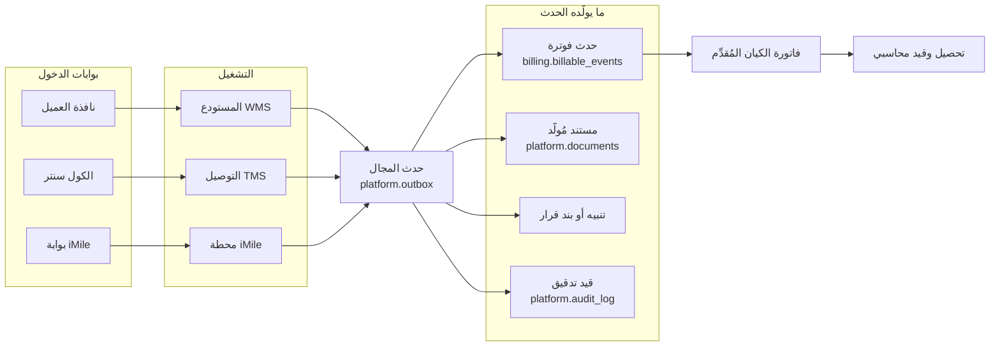

**القاعدة التي تجعل الخريطة صحيحة (P10):** لا يُكتب حدث فوترة يدوياً أبداً. كل سطر فاتورة يُرَدّ إلى حدثه، والحدث إلى عمليته، والعملية إلى منفّذها وتاريخها وجهازها.

---

# 2. خريطة الكيانات الخمسة

## 2-1 ماذا يبيع كل كيان · أي موديولات تخدمه

| الرمز | الكيان | `entity_kind` | ماذا يبيع | نوع العميل | الموديولات الخادمة |
|---|---|---|---|---|---|
| **PGH** | بريميوم جروب القابضة | `holding` (الجذر · `parent_id = null`) | **لا يبيع خارجياً** — يحمل التكاليف المشتركة ورواتب الإدارة العليا والعقود الإطارية | **لا عملاء خارجيين إطلاقاً** | M01 · M07 (تخصيص التكلفة) · M08 · M12 · M13 |
| **PCC** | بريميوم CC | `operating` | كول سنتر وبدالة — **باقة + تجاوز** (CC-01…CC-15) | داخلي (كيانات المجموعة) + خارجي (كول سنتر فقط) | M06 · M02 · M07 · M12 |
| **PST** | بريميوم ستوراج | `operating` | إدارة مخازن متكاملة 2PL / 3PL | خارجي | M04 · M02 · M03 · M07 · M10 · الشركاء |
| **PDL** | بريميوم دليفري | `operating` | توصيل طلبات | خارجي | M05 · M09 · M11 · M02 · M07 · M10 |
| **POR** | بريميوم أوردر | `operating` | توصيل طلبات | خارجي | M05 · M09 · M02 · M07 · M10 |

**تحقُّق قاعدة:** الخمسة مبذورون فعلاً في `platform.entities`؛ `PGH` جذر بلا أب، والأربعة أبناؤه عبر `parent_id`.

## 2-2 الفوترة بين الكيانات

| القاعدة | التطبيق | الفرض |
|---|---|---|
| **الفاتورة من الكيان المُقدِّم للخدمة حصراً** | متطلب قانوني غير قابل للتفاوض | 40 §A2 |
| **القابضة لا تفوتر عميلاً خارجياً** | مُشغِّل `billing.reject_holding_invoice()` يرفض أي فاتورة غير بينية على `PGH` | EXEC §1.5 |
| **كل معاملة بينية تُعلَّم `is_intercompany = true`** | وتُحذف آلياً عند تجميع حسابات المجموعة | 40 §A2 |
| **توزيع التكاليف المشتركة** | شهرياً من `PGH` إلى الأربعة عبر `billing.cost_allocations` — الأساس الافتراضي **نسبة الإيراد** | EXEC §1.5 |
| **الحسابان البينيان** | **4900 إيراد بيني** / **5900 مصروف بيني** — يُحذفان عند التجميع | 06 §5 · 00 §2-1 |
| **الحد الائتماني** | **واحد على مستوى المجموعة** في `sales.accounts` — المتعثّر متعثّر لدى الجميع، والحجز يوقف الأوامر في **كل** الكيانات | 40 §A2 |
| **سجل العميل** | صف واحد في `sales.accounts` مهما تعدّدت الكيانات · **عقد لكل (عميل، كيان)** في `sales.contracts` | 40 §A2 |

**الحالات الثلاث للمعاملة البينية (00 §2-3):**

| الحالة | متى | المعالجة |
|---|---|---|
| **إعادة فوترة** | العقد مع PST وحدها | PDL تفوتر PST بسعر داخلي · PST تفوتر العميل بسعر العقد · الفرق هامش PST |
| **فوترة مباشرة** | للعميل عقد مع كل كيان | كل كيان يفوتر خدمته مباشرة |
| **بدالة PCC للمجموعة** | **دائماً** | PCC تفوتر الكيانات الأخرى شهرياً بسعر تحويلي معتمد |

#### خريطة 2-1: شجرة الكيانات وتدفق الفوترة
تقرأ من الأعلى: القابضة جذر لا يفوتر خارجاً، والأربعة التشغيلية وحدها تصل إلى العميل الخارجي.

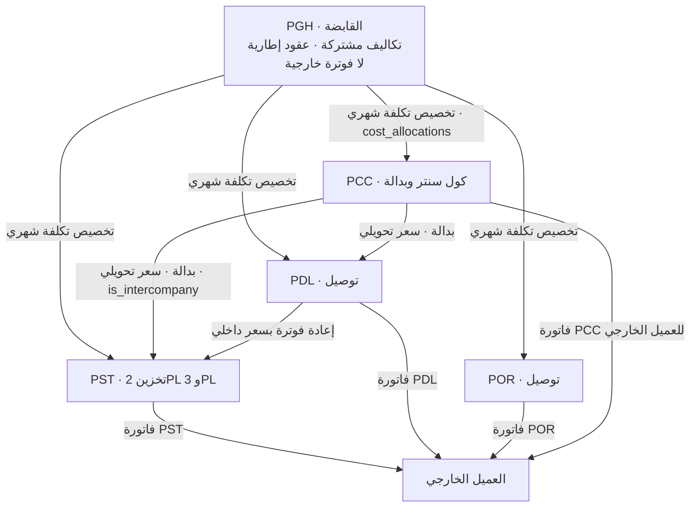

> **بند مفتوح مسجَّل:** `[GM DECISION REQUIRED]` **أساس السعر التحويلي الداخلي بين الكيانات** — تكلفة فعلية أم تكلفة + هامش أم سعر سوق (00 §10 بند 2 · 04 · 06 §10). القرار لا يوقف البناء؛ الجدول موجود والسعر يُدخل بياناً.

---

# 3. خريطة الموديولات — ١٣ موديولاً · ١٥ حزمة كود · ١٦٩ جدولاً

**القاعدة الحاكمة (36 §1-1):** مونوليث معياري. **لا يقرأ موديول جداول موديول آخر مباشرة.** التبادل عبر حدث مجال أو عقد معلن في `packages/contracts` — والمخالفة **تُفشل البناء** بـ`eslint-plugin-boundaries`، ويعززها RLS ومستخدم قاعدة لكل مخطط.

| # | الموديول | حزمة الكود | المخطط SQL | **عدد الجداول الفعلي** | الوثيقة المرجعية | الكيانات |
|---|---|---|---|---|---|---|
| **M01** | الهوية والوصول | `identity` | `identity` | **١١** | 02 · 40 §B1 | الكل |
| **M02** | المبيعات و CRM | `sales` | `sales` | **١٠** | 06 · 40 §C2 | الكل (موحّد) |
| **M03** | الكتالوج والتسعير | `catalog` | `catalog` | **٦** | 04 · 40 §C1 | الكل |
| **M04** | المستودع WMS | `wms` | `wms` | **١٦** | 03 · 17 · 19 · 40 §C3 | PST |
| **M05** | التوصيل TMS | `tms` | `tms` (مشترك مع M09) | **١٣** إجمالاً للمخطط | 03 · 35 · 40 §C4 | PDL · POR |
| **M06** | الكول سنتر | `cc` | `cc` | **٦** | 03 · 40 §C5 | PCC |
| **M07** | المحاسبة والفوترة | `billing` | `billing` | **١١** | 06 · 40 §C6 | الكل (موحّد) |
| **M08** | الموارد البشرية | `hr` | `hr` | **١٣** | 10 · 15 · 40 §C7 | الكل |
| **M09** | الأسطول | `fleet` | **لا مخطط خاص** — جداوله داخل `tms`: `vehicles` · `vehicle_documents` · `fuel_ledger` · `maintenance_plans` · `maintenance_orders` · `accidents` | **٦** من ١٣ | 27 · 40 §C4 | PDL · POR |
| **M10** | نافذة العميل | **لا حزمة موديول** — تطبيق مستقل `apps/portal` | **لا مخطط خاص** — يقرأ `wms` · `tms` · `billing` بعزل RLS `client_id` | — | 05 · 40 §C10 | الكل |
| **M11** | تشغيل iMile | `imile` | `imile` | **١٥** | 07 · ADR-27 · ADR-28 · 40 §C8 | PDL |
| **M12** | المنصة | `platform` | `platform` | **٢٦** | 40 §B · 25 · 23 · 31 | الكل |
| **M13** | الحوكمة والاستراتيجية | `governance` | `governance` — **مُنشأ في القاعدة ✅ (SCH-4 · ق-27)** | **١٤** | 36 §6-2 · 40 §C9 · 07 §M13 | الكل |
| — | الشركاء والمقاولة الباطنية | `partners` | `partners` | **٦** | 09 | PST · PDL · POR |
| — | السكن | `housing` | `housing` | **١٠** | 14 | الكل |
| — | الدورة الإدارية والمشتريات | `admin` | `admin` | **١٢** | 11 | الكل |
| | **الإجمالي** | **١٥ حزمة** | **١٤ مخططاً** | **١٦٩ جدولاً** | | |

> **تحقُّق:** ١١+١٠+٦+١٦+١٣+٦+١١+١٣+١٥+٢٦+٦+١٠+١٢+**١٤** = **١٦٩** — مطابق للعدّ الفعلي لـ`BASE TABLE` في `information_schema.tables` (21/09/2026، بعد SCH-4).
> **وفوقها أحد عشر عرضاً (`VIEW`)** لا تُعدّ جداولاً: `platform.mdm_scorecard` · `identity.unclassified_columns` · `sales.possible_duplicates` · `hr.recruitment_cost_per_employee` · **`hr.employees_basic`** *(أُضيف في SCH-4)* · `wms.space_dashboard` · `wms.warehouse_capacity` · `imile.shipments_attributed` · `imile.driver_id_dashboard` · `partners.resale_margin` · `housing.capacity_overview`.
> **✅ أُغلق في 13B (SCR ق-27):** مخطط `governance` **مُنشأ فعلاً بأربعة عشر جدولاً** بالأسماء المنصوصة في 36 §6-2 و40 §C9، بأعمدة من نصّهما وRLS وقيود حالة وسلسلة ترقيم `NCR`. الحارس **G6/G7** يسمّي `governance` ضمن المخططات الأربعة عشر — وهو الآن **مُعلَن في العقد ومُنفَّذ في المخطط**. التفصيل في **07 §M13**.

#### خريطة 3-1: تبعيات بناء الموديولات
تقرأ من الأعلى إلى الأسفل: لا يُبنى موديول قبل من فوقه. هذه تبعية هندسية لا جدول زمني.

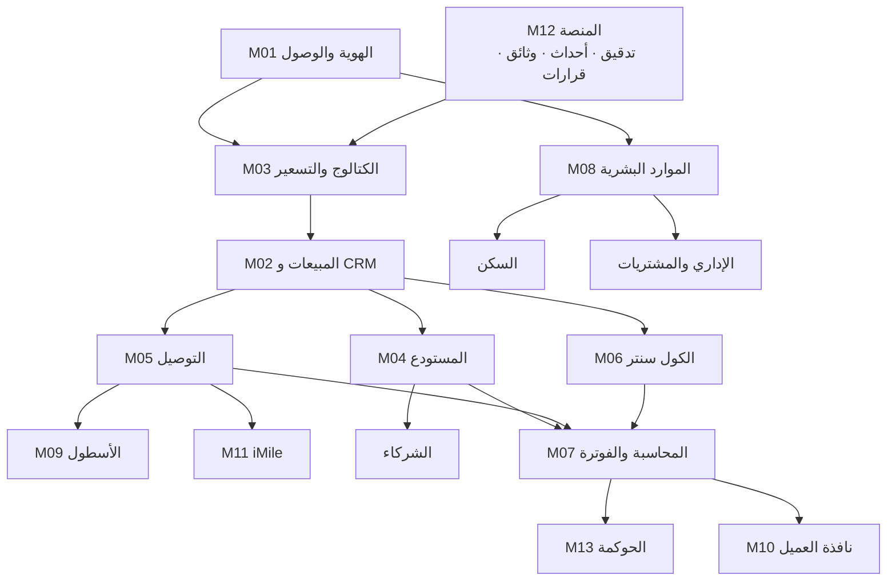

## 3-1 بوابات البيانات — لا يُفتح موديول قبل بلوغ بوابته (P9)

**المصدر الحاكم: 22 §6.** المالك **بالمنصب** لا بالشخص، والنسبة معلنة في `platform.domain_owners.gate_target_pct`.
> **✅ بعد SCH-4 (ق-30):** `platform.domain_owners` **مبذور بـ١٢ صفاً `D01…D12`** بمالك ونسبة بوابة لكل مجال — فالبوابات صارت قابلة للقياس آلياً. **⏳ يبقى قرار GM** في ملكية `D03·D04·D05·D11` (بُذرت على `CFO` — تعارض 22 §2 مع §2-1)، **و↷ مهمة WBS** في تعيين شاغل بالاسم لكل مجال (22 §2-1 «القرار رقم 1»).

| الموديول | البوابة | المالك (المنصب) |
|---|---|---|
| M02 المبيعات | ١٠٠٪ من العملاء الحاليين بسجل تجاري وبيانات تواصل | المدير المالي `CFO` |
| M03 التسعير | ١٠٠٪ من الخدمات النشطة بحد أدنى وتكلفة معيارية | `CFO` |
| M04 المستودع | ١٠٠٪ مواقع مرقّمة **وملصقة ميدانياً** · ≥ ٩٥٪ أصناف مكتملة | مدير المستودع `WH_MGR` |
| M05 التوصيل | ١٠٠٪ سائقين ومركبات بوثائق سارية | مدير التوصيل `DEL_MGR` |
| M06 الكول سنتر | ١٠٠٪ عملاء خارجيين بعقد و SLA معتمد | مدير الكول سنتر `CC_MGR` |
| M07 المحاسبة | دورة فوترة معتمدة · دليل حسابات · حدود ائتمانية | `CFO` |
| M08 الموارد البشرية | ١٠٠٪ موظفين بوثائق وتواريخ انتهاء | **`GM`** (`HR_MGR` غير مشغول) |
| M09 الأسطول | ١٠٠٪ مركبات بوثائق سارية | مدير الأسطول `FLEET_MGR` |
| M10 نافذة العميل | ثلاثة عملاء جاهزون تشغيلياً | `CFO` |
| M11 iMile | ١٠٠٪ معرّفات مسجَّلة بإسنادها | `DEL_MGR` |
| **تصنيف الأعمدة** | **١٠٠٪ من أعمدة `01/13/13B/019` مصنَّفة** — الحارس G6 | مدير النظام `SYSADMIN` |

**السلوك عند عدم البلوغ:** الموديول يبقى مرئياً لمالكه وحده، وشاشته تعرض **«ما ينقص قبل الإطلاق»** بالمالك والتاريخ (40 §D1 — مكوّن الحالة الفارغة إلزامي).

---

# 4. خريطة التطبيقات الخمسة

| # | التطبيق | التقنية | الجمهور (الأدوار) | الموديولات التي يفتحها | القيد الحاكم |
|---|---|---|---|---|---|
| **A1** | **الواجهة الإدارية** `apps/admin` | React 18 + Vite · RTL | الأدوار الداخلية الاثنان والعشرون | كل الموديولات بحسب الدور | **الصفحة الرئيسية لكل دور = صندوق القرارات** · ٥٧ شاشة · ثلاثة أنماط فقط: قائمة · ملف · إجراء |
| **A2** | **نافذة العميل** `apps/portal` | React — تطبيق **منفصل** | `CLIENT_ADMIN` · `CLIENT_CREATOR` · `CLIENT_VIEWER` · `CLIENT_FINANCE` | M04 · M05 · M07 (قراءة) + إنشاء أوامر | ١٢ شاشة · **العزل بـRLS `client_id` في القاعدة لا في الكود** · معيار القبول: استبدال معرّف مباشر يعيد **صفر صفوف لا خطأ صلاحية** |
| **A3** | **تطبيق السائق** `apps/driver` | React Native + Expo | `DRIVER` · `DEL_SUP` | M05 · M09 · M11 · عمولته من M08 | جهاز **شخصي** واحد لكل سائق · تسجيل OTP مرة ثم تجديد ٣٠ يوماً · **عمل دون اتصال ٧ أيام** · تسليم ناجح **≤ ٦ نقرات و≤ ٤٥ ثانية** |
| **A4** | **PDA المستودع** `apps/pda` | PWA على جهاز صناعي | `WH_OP` · `WH_SUP` · `WH_MGR` | M04 | جهاز **مشترك** بوضع Kiosk · كود الموظف + **PIN ٦ أرقام** مخزَّن تجزئةً على الجهاز وحده · **دون اتصال ٧٢ ساعة** · **استجابة مسح ≤ ١.٠ ث** · **لا تُقفل الوردية وطابورها > ٠** |
| **A5** | **تطبيق القرارات** `apps/decisions` | React Native | المدراء: `GM` · `CFO` · `WH_MGR` · `DEL_MGR` · `SALES_MGR` · `FLEET_MGR` · `CC_MGR` | صندوق القرارات + ٦ بطاقات مؤشر لكل دور + التتبّع | **البتّ من الإشعار بلا فتح التطبيق** · ساعات هدوء · ≤ ٢٥ ميجابايت |

#### خريطة 4-1: التطبيقات × الأدوار × الموديولات
تقرأ من اليسار: كل تطبيق يخدم مجموعة أدوار محددة، وكل مجموعة ترى موديولاتها وحدها.

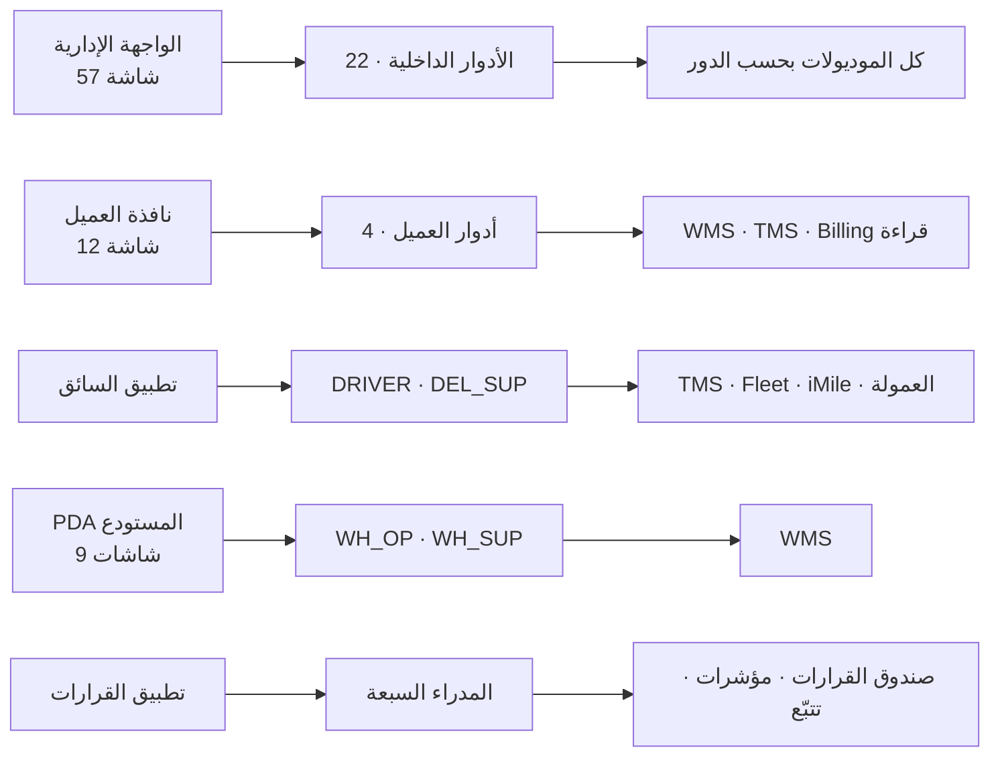

## 4-1 جرد الشاشات — من ٨٤ إلى ٥٧

| الفئة | قبل | **بعد** |
|---|---|---|
| صندوق القرارات | ٠ | **١** — قالب واحد يُرشَّح بالدور عبر `platform.decisions.assigned_role` |
| شاشات العمليات | ٢٨ | ٢٢ |
| شاشات الملفات | ١٤ | ١٤ |
| القوائم والبحث | ٢٠ | **٨** — البحث العام `Ctrl+K` يغني |
| لوحات المؤشرات | ١٢ | **٤** — GM · المالي · العمليات · الملّاك |
| إعدادات وإدارة | ١٠ | ٨ |
| **الإجمالي** | **٨٤** | **٥٧** |

**الأهم ليس العدد:** ٤٠ شاشة من الـ٥٧ لا تُفتح في اليوم العادي — تُفتح عند الاستثناء أو البحث. والمستهدف المعلن: **≤ ١٧ شاشة تُفتح في اليوم العادي** (29 §10).

---

# 5. خريطة تدفق القيمة الشاملة

**من العميل المحتمل إلى التحصيل — بلا حلقة مفقودة.**

#### خريطة 5-1: دورة القيمة التجارية — من العميل المحتمل إلى العقد
تقرأ من الأعلى إلى الأسفل زمنياً: كل خطوة تترك أثراً في جدول، ولا خطوة تُقفز.

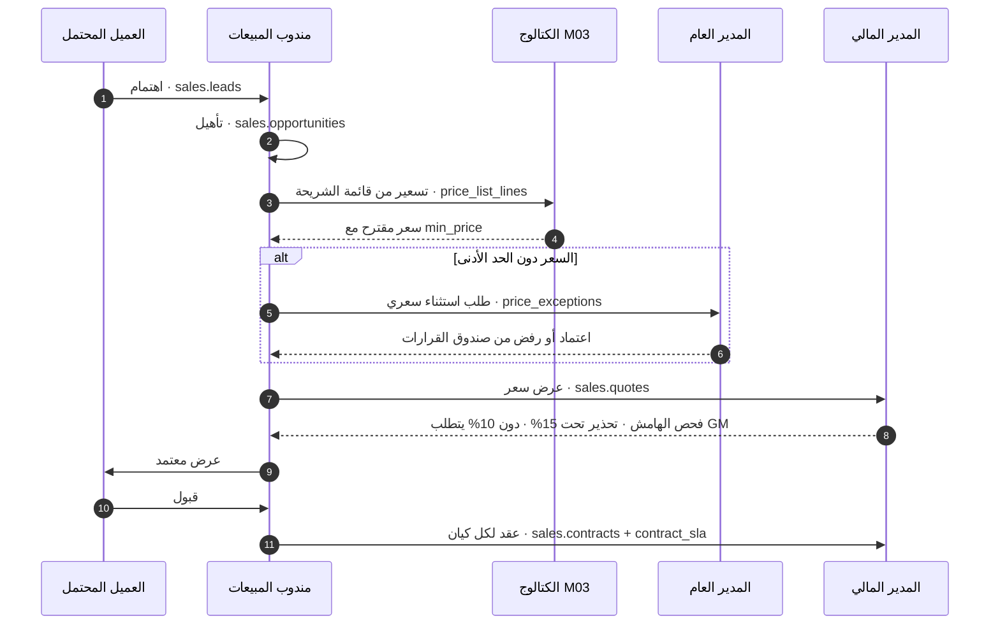

#### خريطة 5-2: دورة القيمة التشغيلية والمالية — من الأمر إلى النقد
تقرأ من اليسار: العملية التشغيلية تُقفل فتنشر حدثاً، والحدث وحده يفتح باب الفوترة.

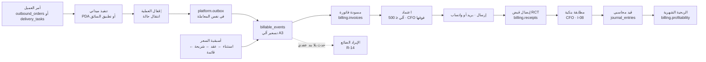

**القواعد المفروضة على هذا المسار:**

| القاعدة | الفرض | المصدر |
|---|---|---|
| لا سطر فاتورة بلا حدث فوترة | **الحارس G11** — صفر سطر يتيم | 40 Part F |
| لا شحنة مسلَّمة بلا إثبات تسليم | **الحارس G12** | 40 Part F |
| الأرصدة تُعاد من دفترها بفرق صفر | **الحارس G1** `wms.verify_balance_integrity()` | 40 Part F |
| القيود متوازنة | **الحارس G2** `billing.verify_journal_balance()` | 40 Part F |
| حدث بلا سعر يُرصد ولا يُخفى | **الحارس G18** — تقرير لا حاجز + التنبيه **N-08** | 40 Part F · 25 |
| رقم الفاتورة يُخصَّص **عند الاعتماد فقط** | `platform.next_doc_no` ذرّي — الحارس G13 | 40 §A3 |

---

# 6. خريطة الأحداث — من ينشر وما الذي يستهلك

## 6-1 القاعدة الحاكمة

**`platform.outbox` هو جدول الأحداث الوحيد** (40 §B3 · R-02a). `platform.domain_events` **متقاعد ومحذوف**. الحدث يُكتب **في نفس معاملة تغيير الحالة** — يُكتب مع الحالة أو لا يُكتب معها، ولا حالة ثالثة. ناقل ينشر **مرة على الأقل**، والمشتركون **متفرّدون بـ`event_id`**.

| العمود الحاكم | الدور |
|---|---|
| `entity_id` | كيان الحدث — إلزامي لكل حدث تجاري/تشغيلي بقيد `outbox_business_needs_entity`؛ يُسمح بـ`null` لأحداث المنصة والهوية فقط |
| `correlation_id` | **إلزامي** — عملية عمل واحدة عبر عدة طلبات؛ هو نفسه الذي يصل السلسلة كلها في شاشة التتبّع |
| `causation_id` | الحدث الأب — شجرة السببية |
| `published_at` · `attempts` · `last_error` | حالة النشر وإعادة المحاولة |

**تسمية الحدث:** `<module>.<aggregate>.<past_tense>` — مثال `wms.outbound.checked` · `tms.task.delivered` · `billing.invoice.approved`.

## 6-2 من ينشر ماذا · من يستهلك

| الناشر | أمثلة الأحداث | المستهلكون المسجَّلون في `packages/events` |
|---|---|---|
| **M04 المستودع** | `wms.inbound.received` · `wms.outbound.checked` · `wms.count.closed` | الفوترة · الوثائق · التنبيهات · التدقيق · التتبّع |
| **M05 التوصيل** | `tms.task.delivered` · `tms.task.failed` · `tms.cod.collected` | الفوترة · الوثائق · التنبيهات · التدقيق · التتبّع |
| **M11 iMile** | `imile.plan.approved` · `imile.dtl.closed` · `imile.inventory.diffed` | الفوترة (العمولة) · التنبيهات · التدقيق |
| **M06 الكول سنتر** | `cc.ticket.closed` · `cc.sla.breached` | الفوترة · التنبيهات · التدقيق |
| **M07 المحاسبة** | `billing.invoice.approved` · `billing.receipt.posted` | الوثائق · التنبيهات · التدقيق |
| **M02 المبيعات** | `sales.contract.activated` · `sales.quote.approved` | الوثائق · التنبيهات · التدقيق |
| **M08 الموارد · السكن · الإداري** | أحداث الوثائق والجزاءات والمشتريات | الوثائق · التنبيهات · التدقيق |

#### خريطة 6-1: أربعة مستهلكين لكل حدث
تقرأ من اليسار: الناشرون ستة، والصندوق الصادر واحد، والمستهلكون خمسة مسجَّلون.

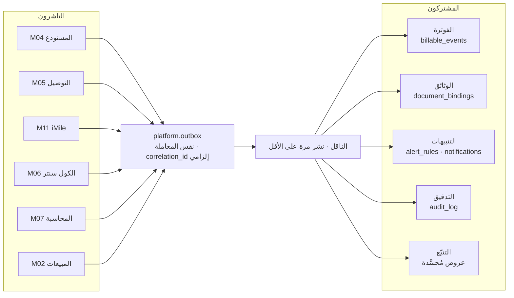

**الحارس الذي يثبت اكتمال الخريطة:** **G9** — آخر ١,٠٠٠ كتابة في `outbox` لكلٍّ منها صف تدقيق بنفس `correlation_id`. أي فجوة = حدث بلا مسؤول بشري مسجَّل.

---

# 7. خريطة التكاملات الخارجية — I-01…I-11

| # | التكامل | الاتجاه | التقنية | الدورية | **المالك بالمنصب** | الحرجية | البديل اليدوي |
|---|---|---|---|---|---|---|---|
| **I-01** | **iMile** — بوابة الشحنات | وارد | وكيل Playwright | كل ١٠ د | `DEL_MGR` | 🔴 حرج | تصدير CSV ورفعه — **يُختبر شهرياً** |
| **I-02** | **iMile** — تنفيذ قرارات التدقيق | صادر | وكيل | كل ٦٠ ث | `DEL_MGR` | 🔴 حرج | تنفيذ يدوي على البوابة |
| **I-03** | **أولى** — بطاقات الوقود | وارد يدوي | استيراد CSV | أسبوعي | `FLEET_MGR` | 🟠 | هو الأصل — لا API لدى أولى |
| **I-04** | **تطبيق البصمة** (Firebase) | وارد | REST + مفتاح | كل ساعة | `SYSADMIN` | 🔴 حرج | كشف حضور ورقي |
| **I-05** | **واتساب** | صادر | **Twilio — WhatsApp Business API** | فوري | `SYSADMIN` | 🟠 | ارتداد إلى I-06 ثم مهمة للكول سنتر |
| **I-06** | **الرسائل النصية** — احتياطي | صادر | **Twilio — SMS** | فوري | `SYSADMIN` | 🟡 | اتصال هاتفي |
| **I-07** | **البريد** — الفواتير والتقارير | صادر | SMTP مؤسسي | فوري + مجدول | `SYSADMIN` | 🟠 | تسليم يدوي |
| **I-08** | **البنك** — كشف الحساب | وارد يدوي | استيراد CSV/MT940 | يومي | **`CFO`** | 🟠 | مطابقة ورقية |
| **I-09** | **واجهة العملاء** — استيراد الطلبات | وارد | REST **يوفّرها نظامنا** | فوري | `SYSADMIN` | 🟠 | إدخال من نافذة العميل |
| **I-10** | **التصدير المحاسبي** | صادر | ملف مرحّل | شهري | `CFO` | 🟡 | تصدير يدوي |
| **I-11** | **تطبيق السائق** | وارد وصادر | REST داخلي | فوري + دفعات | `DEL_MGR` | 🔴 حرج | كشوف ورقية (§حقيبة الطوارئ) |

## 7-1 العقد الموحّد — تسعة حقول لا يُبنى تكامل بدونها

مفتاح تفرّد · سياسة إعادة محاولة · سلوك الفشل (`halt` · `skip_log` · `manual_queue`) · عتبة التنبيه · **مالك بالمنصب** · سجل التشغيل · بديل يدوي · تخزين الأسرار · مدة الاحتفاظ بالخام. كلها أعمدة في `platform.integration_config`.

**الجداول الثلاثة لا تتكرّر:** `integration_config` = العقد والسياسة · `integration_queue` = الطابور اليدوي · `integration_runs` = سجل التشغيل.

#### خريطة 7-1: التكاملات حول النظام
تقرأ من الخارج إلى الداخل: ما يدخل على اليسار، والنظام في الوسط، وما يخرج على اليمين.

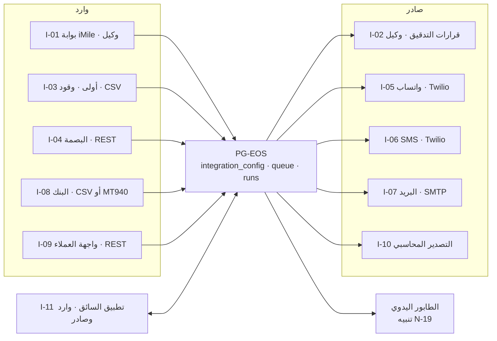

**أربعة تنبيهات تراقب هذه الخريطة:** **N-01** وكيل iMile متوقف > ١٥ د · **N-19** الطابور اليدوي > ٢٠ سجلاً أو > ٤٨ س · **N-20** ارتداد واتساب > ٥٪ · **N-22** تكامل بلا تشغيل ناجح ٢٤ س. **صف أحمر واحد في لوحة التكاملات = يوم لا يُقفل.**

> **بند مفتوح:** طلب الواجهة البرمجية الرسمي من iMile لم يُرسَل بعد — يصوغه `pg-scribe` في المرحلة ٣ ويوقّعه المدير العام. **لا يوقف شيئاً:** الوكيل يبقى المسار الوحيد حتى الرد.

---

# 8. طبقات المعمارية — بلغة إدارية

## 8-1 الشكل: مونوليث معياري

**قرار مُلزم (36 §1-1):** تطبيق واحد · قاعدة واحدة · نشر واحد. **لا خدمات مصغّرة** — لخمسة عشر إلى ثمانين مستخدماً هي عبء تشغيلي بلا عائد، والوكلاء الذكية تبني الأنظمة الموزّعة بشكل رديء. الفصل لاحقاً إلى خدمات **ممكن** لأن الحدود مفروضة من اليوم الأول.

#### خريطة 8-1: الطبقات الستّ
تقرأ من الأعلى إلى الأسفل: ما يراه المستخدم فوق، وما يحفظ الحقيقة تحت.

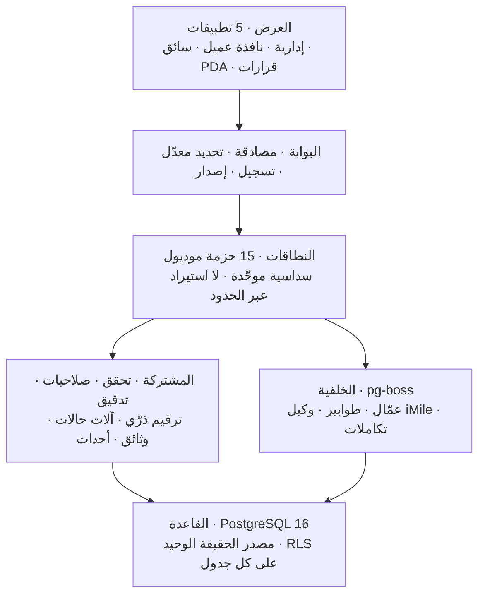

## 8-2 الأنماط الستة التي تجعل النظام مؤسسياً

| النمط | بلغة إدارية | الضمان العملي |
|---|---|---|
| **RLS — أمن على مستوى الصف** | الصلاحية **بيانات في القاعدة لا كود في الشاشة** | لا يرى مستخدم صفاً خارج نطاقه **حتى لو استُدعيت الواجهة مباشرة**. الحارس **G7** = ٠ — **متحقَّق فعلاً: صفر جدول بلا RLS في الثلاثة عشر مخططاً** |
| **الصندوق الصادر (Outbox)** | الحدث يُكتب مع الحالة في **نفس المعاملة** | لا فاتورة تضيع لأن الشبكة انقطعت بعد إقفال الأمر |
| **مفتاح التفرّد (Idempotency)** | كل أمر كتابة يحمل مفتاحاً؛ إعادة الإرسال تعيد النتيجة السابقة ٧ أيام | ضغطتان على «حفظ» لا تنشئان أمرين · السائق دون اتصال يزامن مرتين بأمان |
| **التزامن التفاؤلي** | كل سجل يحمل `version`؛ التعديل على نسخة قديمة يُرفض بـ409 | لا يمحو مديران تعديل بعضهما بصمت |
| **أعلام الميزات ومفاتيح الإيقاف** | `platform.feature_flags` — الخاصية تُشحن مطفأة وتُضاء بالتدريج | خاصية تُسبب مشكلة تُطفأ **بلا نشر** |
| **العتبات بيانات لا كود** | `platform.thresholds` — **٤٤ حدّاً عددياً** يحرّرها المدير العام | رفع حد الاعتماد الآلي من ٥٠٠ إلى ٢,٠٠٠ د.ك **بلا مبرمج ولا نشر** |

## 8-3 المكدّس التقني

| الطبقة | التقنية |
|---|---|
| القاعدة | **PostgreSQL 16** |
| الخلفية | Node.js 20 + TypeScript + **NestJS** (Fastify adapter) |
| الوصول للبيانات | **Drizzle ORM** — اختير لأنه يسمح بـ`SET LOCAL` داخل المعاملة، وهو شرط RLS |
| الواجهة | React 18 + TypeScript + Vite · RTL كامل |
| آلات الحالات | **XState v5** — لا `if`/`switch` لانتقالات الحالة |
| المجدولة والطوابير | **pg-boss** — لا Redis |
| الوثائق | Chromium headless · خط **Cairo** · ثنائي اللغة |
| المال والزمن | `numeric(14,3)` د.ك بثلاث خانات — **لا `float` أبداً** · `timestamptz` مخزَّن UTC ومعروض `Asia/Kuwait` |
| اللغات | **٥ لغات** في التطبيقات الميدانية: `ar en hi ur bn` · `ar/en` في الإدارية |

---

# 9. خريطة النشر — Tier 0 / 1 / 2

| البند | **Tier 0** (المراحل ٠–٣) | **Tier 1** (٤–٦) | **Tier 2** (التوسّع) |
|---|---|---|---|
| المزوّد | **Oracle Always Free** · حساب PAYG | **موارد OCI مدفوعة على الحساب نفسه** | Google Cloud `me-central1` |
| الشكل | **A1.Flex · 4 OCPU / 24 GB** — كامل حصة ARM المجانية في جهاز واحد | قاعدة على جهاز مستقل + **نسخة قراءة** | Cloud Run + Cloud SQL 16 + نسخة قراءة |
| المنطقة | **جدّة `me-jeddah-1`** · بديل دبي `me-dubai-1` | نفسها | `me-central1` |
| الشبكة | **Cloudflare Tunnel · صفر منفذ وارد** · SSH عبر النفق | نفسها | — |
| **RPO / RTO** | **٢٤ ساعة / ٤ ساعات** | ≤ ١ ساعة / ≤ ٤ ساعات | ≤ ١ ساعة / ≤ ٤ ساعات |
| النسخ الاحتياطي | **١٤ يومية · ٨ أسبوعية · ٦ شهرية** إلى OCI Object Storage | ٣٠ · ١٢ · ١٢ + أرشفة WAL | ٣٠ · ١٢ · ١٢ |
| نسخة القراءة للتقارير | **غير متاحة** — التقارير على القاعدة الأساسية بـ`statement_timeout` خارج الذروة | **متاحة** | متاحة |
| التوافر في ساعات العمل | 99.5٪ | 99.5٪ | 99.5٪ |
| اختبار استرجاع فعلي | **شهري — إلزامي** | شهري | شهري |

**محفّز الانتقال إلى Tier 1/2 — أي واحد منها:** قبل المرحلة ٤ · أو **> ٤٠ مستخدماً متزامناً** · أو **خرق p95 لسبعة أيام متصلة**.

**ضمان القابلية للنقل:** نفس `docker-compose.yml` يعمل على أي طبقة. النقل = نسخ compose + `.env` + استرجاع نسخة + إعادة توجيه DNS.

#### خريطة 9-1: تدرّج النشر
تقرأ من اليسار: كل طبقة تُشترى بمحفّز معلن، ولا مورد مدفوع بلا تعليمة مكتوبة من المدير العام.

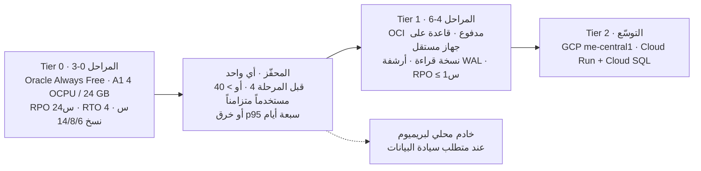

> **قيد قانوني مفتوح (C-07):** **خروج البيانات من الكويت** يحتاج رأياً قانونياً **قبل إدخال بيانات عملاء حقيقية** على Tier 0 أو Tier 2 (مهمة 7.9). **لا يوقف البناء** — Tier 0 يحمل بيانات بذرة واختبار فقط.

---

# 10. مستويات الأتمتة A0–A3 — وأين يبقى الإنسان عمداً

## 10-1 السلّم

| المستوى | الوصف | دور الإنسان |
|---|---|---|
| **A0** | يدوي | ينفّذ كل شيء |
| **A1** | مُساعَد | النظام يقترح · الإنسان يؤكد |
| **A2** | **مؤتمت بالاستثناء** | يعمل وحده · يرفع ما خرج عن القاعدة |
| **A3** | ذاتي كامل | لا تدخّل — مراجعة لاحقة فقط |

**اختبار الأتمتة الثلاثي (P11):** تُؤتمت العملية إن كانت (١) مدخلاتها متاحة في النظام · (٢) قواعدها قابلة للكتابة · (٣) خطؤها قابل للكشف والتصحيح. **فشل أي شرط = تبقى بشرية، ويُذكر السبب صراحةً.**

## 10-2 التوزيع الفعلي — ٤٩ عملية مصنَّفة

| المستوى | العدد | النسبة |
|---|---|---|
| **A0** يدوي كامل | **١** | ٢.٠٪ |
| **A1** مُساعَد | **٢** | ٤.١٪ |
| **A2** مؤتمت بالاستثناء | **١٤** | ٢٨.٦٪ |
| **A3** ذاتي كامل | **٣٢** | ٦٥.٣٪ |
| **عند A2 أو A3** | **٤٦ ÷ ٤٩** | **93.9٪** |
| **المستهدف المعلن** | ≥ ٨٠٪ عند A2/A3 | **مُحقَّق في التصميم** |

**التوزيع بالنطاق:** المستودع ١٢ عملية · التوصيل و iMile ١١ · التجاري والمالي ١٤ · الموارد البشرية والإداري ١٢ = **٤٩**.

#### خريطة 10-1: سلّم الأتمتة وموقع الإنسان
تقرأ من اليسار: كلما ارتفع المستوى تقلّص دور الإنسان، ولا يختفي — ينتقل من التنفيذ إلى البتّ.

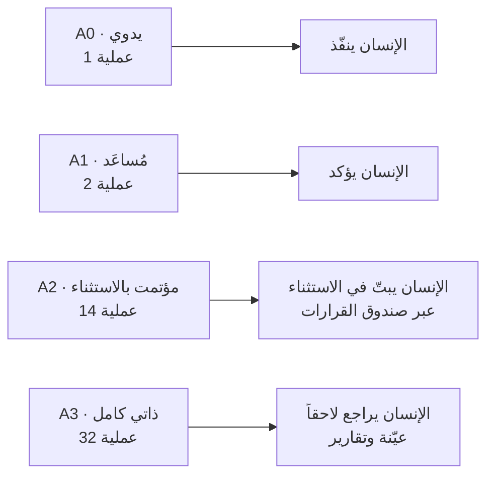

## 10-3 ما يبقى بشرياً عمداً — وسببه المعلن

**ثلاث عمليات مصنَّفة عند A0/A1:**

| العملية | المستوى | السبب المعلن |
|---|---|---|
| **رفع الحجز الائتماني** | **A0** | قرار تجاري بمخاطرة — الحجز نفسه آلي، ورفعه بشري |
| **تسوية فرق الجرد** | **A1** | مسؤولية مالية عن بضاعة الغير |
| **الجزاءات** | **A1** | **مسؤولية قانونية — قانون العمل ٦/٢٠١٠** |

**وستّ نقاط قرار حكمية إضافية خارج التصنيف (29 §5-5):** الاستثناء السعري · الإشعار الدائن · قرار التدقيق الحي المتنازع عليه · إسناد سائق لمنطقة حساسة · اعتماد مسير الرواتب · التفاوض مع iMile.

**الإجمالي: تسع نقاط قرار بشرية** (٣ مصنَّفة + ٦ حكمية).

> **✅ أُغلق في 13B (SCR ق-32):** التسع كلها **مبذورة بالاسم في `platform.automation_rules`** (`AR-H01…AR-H09`) — فلم تعد أيٌّ منها تسقط من البناء. **⏳ قرار GM على فارقين:** (أ) 29 §5-5 يسرد **تسعاً** لا ستّاً حكمية، والفرق أن الثلاث المصنَّفة أعلاه مدرجة ضمنها؛ (ب) **رفع الحجز الائتماني بُذر بمستوى `A1`** بينما هذا الجدول و29 §5-4 يصنّفانه **`A0`** — القيمة في القاعدة هي الحاكمة تشغيلياً حتى الإقرار.
> **↷ مهمة WBS 0.10:** **الأربعون عملية الباقية** من الـ٤٩ (كل ما هو عند `A2`/`A3`) **غير مبذورة بعد** — فمؤشر «نسبة الأتمتة» (P11) لا يزال غير قابل للحساب من القاعدة.

## 10-4 ما لا يُؤتمت أبداً ولا يُضبط من الإعدادات

| البند | القاعدة | كيف يتغيّر |
|---|---|---|
| **الإشعار الدائن** | **المدير العام حصراً · لا يُؤتمت** | بـADR مسجَّل فقط |
| **الفصل (D4)** | **المدير العام حصراً** | بـADR مسجَّل فقط |
| **رفض مشكلة التدقيق الحي** | **بشري دائماً** — `reject` لا يُؤتمت مهما بلغت الثقة | بـADR مسجَّل فقط |
| **درجة ثقة السائق** | **لا تُعرض للسائق ولا تُربط بأجر ولا بجزاء** | بـADR مسجَّل فقط |
| **بوابة G3 في التدقيق الحي** | لا إغلاق آلي إطلاقاً | بـADR مسجَّل فقط |

## 10-5 الاستقلالية المكتسبة — الأتمتة تُستحق ولا تُمنح

ADR-27 يجعل مستويين من الأتمتة **يُكتسبان بالأداء ويُسحبان بالتراجع**:

| المجال | شرط الاكتساب | شرط السحب |
|---|---|---|
| **إغلاق مشكلة التدقيق الحي آلياً** | ١٤ يوماً متتالياً بدقة ≥ ٠.٩٧ على ≥ ٥٠ حالة | **أي يوم دقته < ٠.٩٥ ⇒ تنزيل فوري** |
| **اعتماد خطة التوزيع آلياً** | ١٤ خطة بقبول بلا تعديل ≥ ٩٠٪ + اجتياز بوابة الجودة السباعية | خطتان متتاليتان بتعديل > ٢٠٪ · أو هبوط النجاح من أول محاولة > ١٠ نقاط |

**الضابط الدائم:** إعادة مراجعة عشوائية يومية لـ**٥٪** من الإغلاقات الآلية، و`closed_by = 'engine'` مُعلَّم على كل إغلاق آلي.

---

# 11. خريطة الطريق — ثماني مراحل وبواباتها البشرية

| المرحلة | النطاق | **البوابة — معيار العبور** | المهام |
|---|---|---|---|
| **٠ · الأساس** | ملكية مؤسسية · بيئات · M01 الهوية · M12 المنصة (تدقيق · أحداث · وثائق · قرارات · أتمتة) | **استرجاع نسخة فعلي ناجح** · اختبار العزل أخضر (G7=٠) · تصنيف الأعمدة مكتمل (G6=٠) · مُلاك المجالات مسمَّون | ٢٠ |
| **١ · النواة التجارية** | M03 الكتالوج والتسعير → M02 المبيعات و CRM → العقود | **كل خدمة بحد أدنى وتكلفة معيارية · كل عميل بعقد وأسعار** | ١١ |
| **٢ · المستودع** | M04 · مواقع ملصقة · أصناف مكتملة · PDA · **الشريحة الذهبية 2.9** | **سيناريو S1 و S2 · أول عميل حقيقي** | ١٩ |
| **٣ · التوصيل و iMile** | M05 · M09 · M11 · تطبيق السائق | **يوم محطة كامل · صفر مشكلة تدقيق > ٢٤ ساعة** | ٢٢ |
| **٤ · المالية** | M07 · الفوترة الآلية · التحصيل · الربحية · الإيراد الضائع | **فاتورة آلية مطابقة · القيود متوازنة · S19 و S20 يمرّان** | ١٨ |
| **٥ · الإسناد** | M06 كول سنتر · M08 موارد · السكن · الشركاء · الإداري · M13 الحوكمة | **راتب شهر محسوب آلياً ومراجَع** | ١٧ |
| **٦ · العميل** | M10 نافذة العميل + واجهة برمجية I-09 | **اختبار عزل ناجح · ٣ عملاء يعملون** | ٧ |
| **٧ · التصليب والإطلاق** | اختراق · حمل · طفرة · الحرّاس · تمرين الوضع اليدوي · البنود القانونية | **قائمة التحقق النهائية (28 §11) موقَّعة · ٢٠/٢٠ سيناريو** | ١٢ |
| | **+ ٦ مهام عرضية** | | **١٣٢** |

**القاعدة الحاكمة: كل بوابة مرحلة تعتمد على مهمة بشرية واحدة على الأقل** — بيانات أو توقيع. لا مرحلة تُغلق بالكود وحده.

**توزيع المهام:** ٨٣ شريحة قابلة للبناء بالذكاء الاصطناعي 🤖 · ٢١ مهمة بشرية 🧑 · ٧ بنية تحتية 🔧 · ١٥ تحقق ✅.

#### خريطة 11-1: المراحل الثماني وبواباتها
تقرأ من اليسار إلى اليمين: لا مرحلة تبدأ قبل اجتياز بوابة سابقتها.


## 11-1 البوابات السبع لخط النشر — على كل تغيير

**١ STATIC · ٢ UNIT · ٣ INTEGRATION · ٤ ACCEPTANCE · ٥ GUARDS · ٦ SECURITY · ٧ BUILD.**
البوابة ⑤ تشغّل الحرّاس **G1–G18**. **فشل حارس واحد يمنع الدمج والنشر معاً — لا يوجد «انشر وأصلح».**

---

# 12. فهرس القراءة — أي وثيقة لأي سؤال إداري

## 12-1 الأسئلة الإدارية ← الوثيقة

**أعمدة الجدول: السؤال ← وثيقة `D-blueprints` التي تجيبه (إن وُجدت) ← الوثيقة الحاكمة في الحزمة.**

| السؤال | وثيقة `D-blueprints` | الحاكم في الحزمة |
|---|---|---|
| ما الذي يحتاج قراري الآن؟ ومن يقرّر ماذا؟ | **`07-Governance-Control.md` §4-1 · §10** | 29 §6 · 40 §B5 · §D1 |
| ما الحدود المالية ومن يعتمد كم؟ | **`07-Governance-Control.md` §7-1** — القائمة الكاملة الـ٤٤ | EXECUTION-MASTER-v4 §1.1 |
| ما التنبيهات التي تصلني؟ وما التقارير المتاحة؟ وما طقس إدارتي اليومي؟ | **`07-Governance-Control.md` §9** | 25 · 40 §B6 |
| من يملك أي بيانات؟ ومن لا يجتمع مع من؟ | **`07-Governance-Control.md` §7-3 · §7-4** | **22 §2 · §2-2** |
| كيف يُثبَت من فعل ماذا؟ وكيف يعمل النظام إن توقف؟ | **`07-Governance-Control.md` §4-7 · §4-8** | 31 · **26** |
| ماذا يبيع كل كيان وكيف يفوتر الآخر؟ | **هذه الوثيقة §2** | 00 §2 · 06 · 40 §A2 |
| كيف تُصدر الفاتورة وتُحصَّل؟ وكيف تُحسب الربحية والتكاليف؟ | **`02-Financial-Accounting.md`** | 06 · 40 §C6 |
| ما الخدمات وأسعارها وحدودها الدنيا؟ وكيف تُدار المبيعات والعقود؟ | **`02-Financial-Accounting.md`** | 04 (٩٢ خدمة · ٧ فئات) · 40 §C1 · §C2 |
| كيف يعمل المستودع ومن يقرّر فيه؟ | **`03-Operations-Warehouse.md`** | 03 · 17 · 18 · 19 · 30 · 40 §C3 · §D4 |
| كيف يعمل التوصيل وتطبيق السائق والأسطول والشركاء؟ | **`04-Operations-Delivery-Fleet.md`** | 35 · 27 · 09 · 03 · 40 §C4 · §D3 |
| كيف يُدار الموظفون والجزاءات والسكن والمشتريات والمعاملات الحكومية؟ | **`06-Administrative-HR-Housing.md`** | 10 · 11 · 14 · 15 · 40 §C7 |
| ما بنية القاعدة كاملة؟ الجداول والعلاقات والمفاتيح | **`08-Data-Model-Maps.md`** — مولَّد آلياً من القاعدة | `database/01 · 13 · 13B · 019` |
| كيف تعمل محطة iMile والتدقيق الحي والاستقلالية المكتسبة؟ | **`07-Governance-Control.md` §4-2** (الجانب الحوكمي) | **07** · ADR-27 · ADR-28 · 40 §C8 |
| كيف تعمل نافذة العميل والكول سنتر؟ | — *(وثيقة النطاق لم تصدر بعد)* | 05 · 40 §C5 · §C10 |
| ما التكاملات ومن يملكها وماذا لو تعطّلت؟ | **هذه الوثيقة §7** · `07` §4-5 | **23** |
| أين يُنشر النظام وكم يكلّف؟ | **هذه الوثيقة §9** | **42** · 28 §8 |
| ما تسلسل البناء ومن المسؤول عن كل مهمة؟ | **هذه الوثيقة §11** | **38** — تسلسل المهام الوحيد |
| ما القرارات المتَّخذة وبأي قيمة رقمية؟ | — | **EXECUTION-MASTER-v4 §1** — سجل القرارات الوحيد |
| ما العقد التقني الذي يحكم عند التعارض؟ | — | **40** ثم 36 ثم EXECUTION-MASTER-v4 |
| ما الذي يجب أن يمرّ قبل الإطلاق؟ | **`07-Governance-Control.md` §12** | **28 §11** — قائمة التحقق النهائية (١٨ بنداً) |

## 12-2 قاعدة الأسبقية عند التعارض (R-01)

```
40 → 36 → EXECUTION-MASTER-v4 → 42 → 38 → 22 → database/01·13·13B·019 → BOOTSTRAP-v4 → بقية الوثائق مرجعية
```

**الوثيقة الأعلى تحكم، والأدنى هي التي تُصحَّح.** وهذه الوثيقة — وكل وثائق `D-blueprints` — **مرجعية**: تصف ولا تُنشئ قاعدة.

## 12-3 المتقاعد — لا يُشار إليه في v4

**08 · 16 · 20 · 21 · 24 · 37 · 39 · 43 · DECISIONS-ADDENDUM · BOOTSTRAP-v2/v3.**
أبرزها: **24 نقل البيانات ساقطة كاملاً** (بناء نظيف، لا نقل) · **21 معمارية الواجهة** بديلها 29 §6 و40 Part D.

---

# 13. فجوات مرصودة وقرارات مطلوبة

> **قراءة هذا الجدول:** العمود الأخير **«الحالة بعد SCH-4»** هو الحاكم اليوم. البند لا يُحذف بعد إغلاقه — يبقى بنصّه الأصلي ليُقرأ تاريخه. الرموز: **✅ أُغلق في 13B** · **⏳ قرار GM** · **↷ مهمة WBS** · **✗ بلا نص يغطيه**. السجل الموحّد لكل ما بقي مفتوحاً في **`09-Gap-Register.md`**.

| # | الفجوة | الوصف (كما رُصد) | الحالة السابقة | الأثر | **الحالة بعد SCH-4** |
|---|---|---|---|---|---|
| **G-01** | **مخطط `governance` غير موجود في القاعدة** | 36 §6-2 و40 §C9 يعرّفان M13 بـ`budgets` · `budget_lines` · `kpis` · `kpi_targets` · `kpi_actuals` · `objectives` · `key_results` · `risks` · `risk_reviews` · `ncr` · `corrective_actions` · `policies` · `policy_acknowledgements` · `decisions`. **عدّ الجداول الفعلي للمخطط: صفر** — والحارسان G6/G7 يسمّيانه ضمن المخططات الأربعة عشر | **فجوة مخطط حقيقية** — تُرفع بطلب تغيير مخطط تحت G-01 | الموازنة والانحراف وشجرة المؤشرات وسجل المخاطر غير قابلة للبناء في المرحلة ٥ | **✅ أُغلق في 13B (ق-27)** · المخطط مُنشأ بـ**١٤ جدولاً** بالأسماء المنصوصة، بأعمدة من نصّ 36/40 وRLS وقيود حالة وسلسلة `NCR`؛ الأعمدة المستنبَطة معلَّمة واحداً واحداً. **التفصيل في 07 §M13** |
| **G-02** | **أساس السعر التحويلي الداخلي** | `[GM DECISION REQUIRED]` — تكلفة فعلية أم تكلفة + هامش أم سعر سوق (00 §10 بند ٢ · 06 §10) | **مفتوح — قرار مدير عام** | فوترة PCC للمجموعة وإعادة فوترة PDL↔PST تحتاج رقماً | **⏳ قرار GM** · الوعاء `catalog.price_lists.is_internal` قائم وفارغ؛ لا رقم يُخترع (Gap-Register #8) |
| **G-03** | **تحفّظ لاغٍ في 22 §7 بشأن `platform.mdm_scorecard`** | 22 §7 ينصّ على أن العرض «**غير معرَّف في `01/13/13B/019`** حتى الآن» — **والتحقق المباشر يعيده موجوداً كـ`VIEW` منفَّذ بنفس تعريف الوثيقة حرفياً** | **تصحيح وثائقي** — تُحذف الملاحظة من 22 | لا أثر تشغيلي؛ R-20 له مصدر تنفيذي بالفعل | **↷ مهمة WBS (تصحيح وثائقي)** · العرض مُتحقَّق في القاعدة؛ التصحيح في وثيقة 22 خارج نطاق 13B (SCH-4 §3-4) |
| **G-04** | **جداول الحوكمة مبذورة جزئياً فقط** | `alert_rules` **٢٢ صفاً ✅** · `thresholds` **٤٤ ✅** · `sod_rules` **٤ ✅** · `roles` **٢٦ ✅** — لكن `automation_rules` **٠** و`domain_owners` **٠** و`feature_flags` **٠** و`integration_config` **٠** و`approval_chains` **٠** و`column_classification` **٠** | **بذر ناقص** — مهام 0.10 · 0.16 · 0.17 · 5.13 | بلا `automation_rules` لا مستوى أتمتة معلن لأي عملية؛ وبلا `column_classification` يفشل الحارس G6 | **✅ جزئياً (ق-30…ق-32):** `domain_owners` = **١٢** · `approval_chains` = **٨** · `automation_rules` = **٩** (النقاط البشرية بالاسم) · `settings` = **١٤**. **↷ يبقى:** `feature_flags` **٠** (0.10) · `integration_config` **٠** (0.15) · `column_classification` **٠** (0.16 — G6 لا يزال حاجز نشر) · `role_permissions` **٠** · و**الأربعون عملية A2/A3** غير مبذورة في `automation_rules` |
| **G-05** | **الست الحكمية في 29 §5-5 خارج التصنيف** | ست عمليات بشرية عمداً **غير مدرجة في §5-1…§5-4**، فلن تُبذر في `automation_rules` وستسقط من البناء | **مرصود في 29 نفسه** مع إجراء مطلوب: تُدرَج بمستوى **A1** صراحةً بأسمائها الستة | ست نقاط قرار بشرية بلا قاعدة أتمتة تحكمها | **✅ أُغلق في 13B (ق-32)** بذراً: `AR-H01…AR-H09` بالاسم. **⏳ يبقى قرار GM** على فارقين: 29 §5-5 يسرد **تسعاً** لا ستّاً؛ و**رفع الحجز الائتماني بُذر `A1`** بينما §10-3 و29 §5-4 يصنّفانه **`A0`** |
| **G-06** | **`OPS_DIR` و`HR_MGR` دوران معرَّفان وغير مشغولين** | الدوران موجودان في `identity.roles` (٢٦ دوراً) لكن **لا يظهران مالكاً ولا معتمِداً ولا مستقبِلاً لتنبيه** | **مُغلق بقاعدة قراءة** — `OPS_DIR` ← `WH_MGR`/`DEL_MGR` بالنطاق · `HR_MGR` ← `GM` | لا أثر تشغيلي طالما التزمت البذور بالقاعدة | **✅ مؤكَّد في البذرة** · `domain_owners` لا يسند أي مجال لهما؛ M08 مملوك لـ`GM` كما في §3-1 |
| **G-07** | **طلب API الرسمي من iMile لم يُرسَل** | يصوغه `pg-scribe` في المرحلة ٣ ويوقّعه المدير العام | **مفتوح — توقيع لا قرار** | لا يوقف شيئاً؛ الوكيل يبقى المسار الوحيد | **↷ مهمة WBS** (مرحلة ٣) · خارج نطاق المخطط تماماً |
| **G-08** | **C-05 الفوترة الضريبية · C-07 خروج البيانات** | يحتاجان محاسباً قانونياً ومستشاراً قانونياً؛ التصميم يستوعب أي نتيجة | **مفتوح — مهمة 7.9** | C-07 يحجب **بيانات العملاء الحقيقية** على Tier 0/2 — لا يحجب البناء | **↷ مهمة WBS 7.9** · لا أثر على المخطط؛ الحجب قائم على Tier 0/2 |
| **G-09** | **اعتماد الهيئة للائحة الجزاءات (م.٣٦)** | اللائحة **٧٧ بنداً مبذورة فعلاً** في `hr.penalty_schedule`، لكن الاعتماد الرسمي معلّق | **مفتوح** — بانر تحذير حتى يُرفع علم الاعتماد | الجزاءات تُسجَّل وتظهر بتحذير قانوني | **✅ الوعاء أُغلق (ق-32 بذراً):** المفتاح `hr.penalty_schedule_approved` مبذور في `platform.settings` فالشارة التحذيرية صارت تعمل. **⏳ يبقى توقيع خارجي** — الاعتماد نفسه |

> **قاعدة الفجوات:** ما ورد أعلاه إمّا موثّق في الحزمة كـ`[GM DECISION REQUIRED]` أو مكتشَف بالتحقق المباشر من قاعدة `pgeos`. **لم تُملأ أي فجوة بتقدير** — الفراغ مذكور كفراغ، والمُغلق موسوم بـSCR الذي أغلقه.
