# النطاق المالي والمحاسبي — خريطة هيكلية
**PG-EOS v4 · D-blueprints · 21/09/2026 · المصادر: 04 · 06 · 09 · 11 · 22 · 25 · 29 §5-3/§7 · 40 §A2/§A3/§C1/§C2/§C6/Part D/Part E/Part F · EXECUTION-MASTER-v4 §1.1/§1.5/§1.6/§1.16 · database/01 · 13 · 13B · guards.sql · القاعدة الحيّة `pgeos`**

---

## 1. الغرض والنطاق

هذا النطاق يدير **المال كلّه**: من تعريف الخدمة وسعرها الأدنى، إلى الحدث التشغيلي الذي يتحوّل إيراداً، إلى الفاتورة والتحصيل والمطابقة البنكية، ثم إلى المصروف بكل أشكاله — مشتريات، عهدة نقدية، رسوم حكومية، فواتير شركاء — وانتهاءً بدفتر الأستاذ والإقفال الشهري والربحية لكل عميل وعقد وكيان.

يخدم **الكيانات الخمسة**: الكيان القابض `PGH` وأربعة كيانات تشغيلية `PCC` · `PST` · `PDL` · `POR` — إدارة محاسبية **واحدة** تخدمها جميعاً، والفصل بينها **قانوني في المستندات لا تنظيمي في الإدارة** (06 §مبدأ الوثيقة).

مستخدموه: **المدير المالي `CFO`** مالك الدورة ومعتمِد الفواتير والمطابقة البنكية والميزانية · **المدير العام `GM`** للاستثناء السعري والإشعار الدائن وما فوق 2,000 د.ك · **المندوب `PRO`** للتحصيل وعهدة الرسوم · **المحاسب `ACCOUNTANT`** · **محلل التكاليف `COST_ANALYST`** للربحية · **مدير المبيعات `SALES_MGR`** لصيانة الكتالوج دون حدوده · ومديرو الأقسام كمعتمِدين في شريحة الشراء 100–500 د.ك.

الحاكم عند التعارض: **40 §C6** ثم **EXECUTION-MASTER-v4 §1**، والمخطط النافذ هو `database/01 · 13 · 13B` كما هو مطبَّق في القاعدة الحيّة.

---

## 2. خريطة النطاق

#### خريطة 2-1: الجهات الفاعلة ← العمليات ← المستندات ← الجداول
تقرأ من الحدث التشغيلي في أقصى اليسار إلى الجداول المالية في أقصى اليمين.

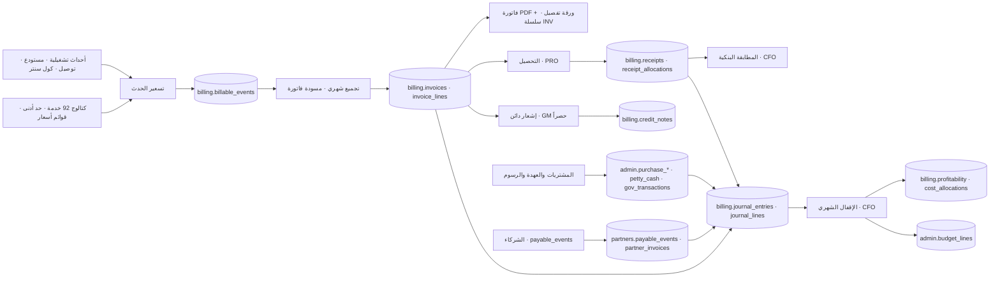

**قراءة الخريطة في عشرة أسطر:**
1. لا إيراد يُولَد إلا من **حدث تشغيلي مسجَّل** يحمل رمز خدمة من الكتالوج (المبدأ P10 · 40 §A1).
2. الكتالوج هو الوعاء الوحيد للسعر؛ لا تسعير خارجه (04 §القاعدة الحاكمة).
3. `billing.billable_events` هو **دفتر الإيراد الأولي**، وفهرسه الفريد `(source_table, source_id, service_id)` يمنع فوترة الحدث مرتين.
4. الفاتورة **تجميعٌ لأحداث** لا إدخال يدوي (INV-C6-1)، ورقمها من سلسلة `INV` يُخصَّص **لحظة الاعتماد فقط**.
5. التحصيل بسلسلة `RCT` يسجّله `PRO`؛ والمطابقة البنكية حدث مستقل مالكه `CFO` — وهو زوج فصل المهام `(PRO, CFO)`.
6. التصحيح **بإشعار دائن باعتماد `GM` حصراً**، لا بتعديل فاتورة معتمدة (INV-C6-2).
7. المصروف يدخل من ثلاثة أبواب: المشتريات · العهدة النقدية وعهدة الرسوم `GOV` · فواتير الشركاء.
8. كل باب من الأبواب الستة أعلاه يولّد **قيداً في `billing.journal_entries`** — لا إدخال محاسبي يدوي للإيراد (06 §6).
9. الإقفال الشهري يرحّل القيود ويوزّع التكاليف ويحسب الربحية ويصدر تقرير الإيراد الضائع (40 §C6 — ثلاث خطوات آلية).
10. `admin.budget_lines` يقيّد المصروف قبل وقوعه: لا أمر شراء بلا بند ميزانية ورصيد كافٍ (11 §3-1).

#### خريطة 2-2: شجرة الكيانات والفوترة البينية
تقرأ من الكيان القابض في الأعلى إلى الكيانات التشغيلية وتجميع المجموعة في الأسفل.

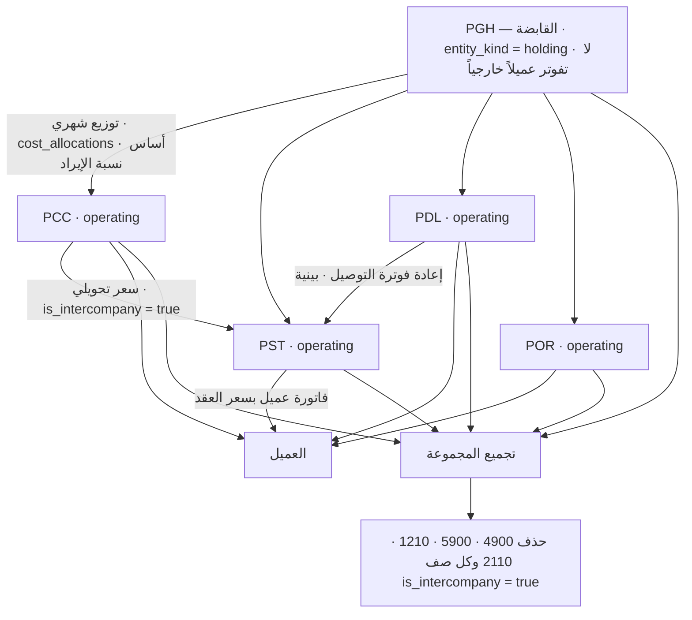

**القاعدة المفروضة برمجياً:** المُشغِّل `billing.reject_holding_invoice()` على `billing.invoices` يرفع استثناءً لأي فاتورة على `PGH` نوعها ليس `intercompany` — «الكيان القابض لا يُصدر فواتير عملاء».

---

## 3. البيانات الرئيسية (Master Data)

| العنصر | الجدول | المالك (المنصب) | بوابة الجودة / الاكتمال | من يعدّل |
|---|---|---|---|---|
| الكيانات وبياناتها القانونية | `platform.entities` | **GM** (D01) | 100% من حقول السجل التجاري والعنوان والشعار · صفر مستند بترويسة ناقصة | `SYSADMIN` · سياسة `internal_only` |
| كتالوج الخدمات | `catalog.services` (92 صف · 7 فئات) | **CFO** (D05) — `SALES_MGR` يصون ولا يغيّر الحدود | **بوابة M03:** `min_price` و`standard_cost` لكل خدمة نشطة · القاعدة: `min_price = standard_cost × 1.15` | صلاحية `platform.reference.manage` |
| فئات الخدمات | `catalog.service_categories` (7: ST · HD · OF · DL · VA · CC · IT) | CFO | ترقيم متّصل داخل كل فئة ولا يُعاد استخدامه | `reference.manage` |
| شرائح العملاء | `catalog.segments` (6: SEG-A…F) | **CFO** | خصم ونطاق ومعيار لكل شريحة · المراجعة ربعية | `reference.manage` |
| قوائم الأسعار وسطورها | `catalog.price_lists` · `catalog.price_list_lines` | CFO (D05) | قائمة لكل شريحة · سطور متدرّجة **تصاعدية** · `is_internal` للسعر التحويلي | `entity_scope` · `internal_only` |
| الاستثناءات السعرية | `catalog.price_exceptions` | **يعتمدها GM حصراً** | `reason` + `valid_from/to` + `review_at` + `min_price_at_approval` — كلها `not null` | `GM` |
| العملاء والحد الائتماني | `sales.accounts` | **CFO** (D03) | سجل تجاري · شريحة · حد ائتماني · مهلة سداد · جهة اتصال — **صفر عميل بلا حد ائتماني** | `CFO` · `SALES_MGR` |
| العقود وأعلام الفوترة | `sales.contracts` | **CFO** (D04) | كل عميل نشط بعقد ساري و`price_list_id` — INV-C2-2 | `CFO` |
| دليل الحسابات | `billing.gl_accounts` | **CFO** | **بوابة M07:** دورة فوترة · دليل حسابات · حدود ائتمانية · هيكل موحّد في الكيانات الخمسة | `reference.manage` |
| الشركاء والموردون | `partners.partners` | **CFO** (D11 في 22 §2) | سجل تجاري · بيانات بنكية · عقد · تأمين — **صفر دفع لمورّد بلا سجل مكتمل** | `internal_only` |
| عقود الشركاء وأسعارها | `partners.partner_contracts` · `partner_price_lines` | CFO | `penalty_recoverable` إلزامي في كل عقد جديد · `insurance_by = 'partner'` · `liability_cap` محسوب | `CFO` |
| الميزانية | `admin.budget_lines` | **CFO** | `fiscal_year × cost_center × gl_account_id` فريد · `available` عمود مولَّد | `CFO` |
| الحدود الرقمية | `platform.thresholds` (44 صفاً) | **GM** — يعدّلها من شاشة الإعدادات بلا نشر | كل حد في النطاق المالي له صفّ بقيمة ووحدة ووصف | `GM` · `SYSADMIN` |
| سلاسل الاعتماد | `platform.approval_chains` | `SYSADMIN` + **أربع عيون** | خطوة وحدود مالية لكل `request_type` · `unique (request_type, step_no)` | `SYSADMIN` + (`DEPUTY_SYSADMIN` أو `CFO`) |
| قواعد فصل المهام | `identity.sod_rules` (4 أزواج) | `SYSADMIN` | تعطيل قاعدة يحتاج **`GM` بسبب مسجَّل** | أربع عيون |
| عدّادات المستندات | `platform.counters` (22 نوعاً × 5 كيانات) | `SYSADMIN` | `platform.next_doc_no()` ذرّي · لا يُعاد استخدام رقم · `RCP` ملغاة | `reference.manage` |
| ملكية المجالات | `platform.domain_owners` (D01…D12) | `GM` | `gate_target_pct` لكل مجال — مدخل بطاقة جودة البيانات R-20 | أربع عيون |

---

## 4. العمليات

> **مستوى الأتمتة** في كل عملية مأخوذ من **29 §5-3 و§5-4** (سلّم A0…A3)، والوعاء المعلن له `platform.automation_rules.level`.

### 4.1 صيانة الكتالوج والحد الأدنى والتسعير — «فحص الحد الأدنى» A3

**المدخل:** طلب إضافة أو تعديل خدمة أو سعر.

1. `SALES_MGR` يقترح الخدمة أو يعدّل بياناتها الوصفية · شاشة الكتالوج · يُكتب `catalog.services` — **لا يملك تغيير `min_price` ولا `standard_cost`** (INV-C1-4 · زوج SoD `(SALES_MGR, CFO)`).
2. `CFO` يحدّد `standard_cost`، والنظام يشتق `min_price = standard_cost × 1.15` من `catalog.min_price_markup_pct = 15`.
3. تجاوز القاعدة لخدمة بعينها: `CFO` يكتب قيمة `min_price` مسجَّلة (EXEC §1.1).
4. إضافة خدمة جديدة أو حذفها: قرار مسجَّل من **`GM` + `CFO`** معاً (04 §قرارات البند 1).
5. `CFO` ينشئ قائمة الأسعار لكل شريحة في `catalog.price_lists` بسطورها المتدرّجة **تصاعدياً** — كل شريحة بسعرها لا سعر الشريحة الأخيرة على الكل (INV-C1-3).
6. البوابة M03: الكتالوج **لا يُفتح للتسعير** قبل تعبئة `min_price` و`standard_cost` لكل خدمة نشطة.

**المخرج:** كتالوج مسعَّر قابل للاستهلاك من محرّك التسعير · الحدث `catalog` جاهز لبوابة M03.

#### خريطة 4-1: مسار الخدمة من الاقتراح إلى قائمة سعر سارية
تقرأ من اقتراح الخدمة إلى فتح بوابة M03.

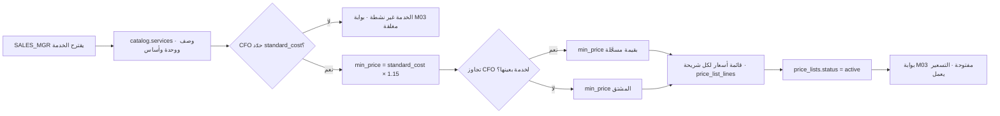

**القواعد المفروضة برمجياً**

| القاعدة | المشغِّل / القيد | القيمة | المصدر |
|---|---|---|---|
| الحد الأدنى مشتق من التكلفة | `platform.thresholds['catalog.min_price_markup_pct']` | **15** | EXEC §1.1 |
| ترقيم الخدمة فريد | `catalog.services_code_key` UNIQUE على `code` | — | 13B |
| سطر القائمة فريد بالشريحة | `price_list_lines_price_list_id_service_id_tier_from_key` UNIQUE | — | 13B |
| حالات قائمة السعر | `chk_price_lists_status` | `draft · active · expired` | STATE-REGISTER §3 |
| البائع لا يحدّد حدّه | `identity.sod_rules (SALES_MGR, CFO)` + `identity.check_sod()` | نشط | 22 §2-3 · EXEC §1.6 |

---

### 4.2 العرض والعقد — البوابة السعرية والاستثناء السعري — A3 فحص · A0 الاستثناء

**المدخل:** فرصة مؤهَّلة على حساب `sales.accounts` بسجل تجاري (INV-C2-1).

1. `SALES_REP` يبني العرض · شاشة العرض · `sales.quotes` بحالة `draft`، وكل سطر في `sales.quote_lines` يخزّن `min_price_at_quote` وقت البناء.
2. عند الحفظ يُحسب العمود المولَّد `below_min = unit_price < min_price_at_quote`، ويرفض القيد `below_min_needs_exception` أي سطر تحت الحد **بلا `exception_id`** — على **كل مسارات الكتابة**: الشاشة والواجهة البرمجية والاستيراد (المبدأ P5 · سيناريو S10).
3. مسار الاستثناء: `SALES_MGR` ← `CFO` ← **`GM`** · `catalog.price_exceptions` بـ`reason` و`valid_from/to` و`review_at` و`min_price_at_approval` — كلها إلزامية.
4. الهامش المقدَّر يُحسب في `sales.quotes.estimated_margin_pct`: تحت **15%** تحذير بارز، وتحت **10%** لا يُعتمد إلا من **`GM`**.
5. الاعتماد: `draft → commercial_review → finance_review → approved` — `SALES_REP` ينشئ · `SALES_MGR` يرفع · `CFO` يعتمد · `GM` إن كان فيه استثناء.
6. `sent` **مجمَّد** في `frozen_snapshot`؛ التعديل ينشئ نسخة جديدة. والصلاحية تنتهي تلقائياً عند `valid_until`.
7. العقد `sales.contracts` لا يُفعَّل بلا `price_list_id` (INV-C2-2)، ويحمل أعلام الفوترة الخمسة الافتراضية `false`.

**المخرج:** عقد `active` بملحق أسعار · أعلام فوترة محسومة · مصدر سعر لكل بند.

#### خريطة 4-2: بوابة الحد الأدنى ومسار الاستثناء
تقرأ من سطر العرض إلى الفاتورة الحاملة لمصدر سعرها.

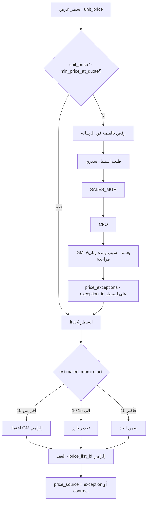

**القواعد المفروضة برمجياً**

| القاعدة | المشغِّل / القيد | القيمة | المصدر |
|---|---|---|---|
| لا سطر تحت الحد بلا استثناء | `sales.quote_lines.below_min_needs_exception` CHECK | — | 40 INV-C1-2 |
| كشف تجاوز الحد | عمود مولَّد `below_min` | — | 13B |
| تحذير الهامش | `contract.min_margin_pct` | **15** | EXEC §1.1 |
| اعتماد المدير العام | `contract.gm_margin_pct` | **10** | EXEC §1.1 |
| حالات العرض | `chk_quotes_status` | `draft · commercial_review · finance_review · approved · sent · accepted · rejected · expired` | STATE-REGISTER §1 |
| ترقية الشريحة آلية | `catalog.segments.review_cycle = quarterly` + 3 أشهر متتالية | — | INV-C2-4 · EXEC §1.1 |
| التنزيل يدوي | لا أتمتة — إشعار ومهلة شهر ثم قرار `CFO` | — | 06 §4-1 |

---

### 4.3 حدث الفوترة وتسعيره — «تسعير حدث الفوترة» A3

**المدخل:** إقفال عملية تشغيلية — استلام · صرف · تسليم · لقطة إشغال · تذكرة.

1. النظام يكتب صفاً في `billing.billable_events` بحالة `pending` يحمل `client_id` و`service_id` و`qty` و`source_module/table/id` — **لكل حدث كود خدمة واحد** (المبدأ P10).
2. مصادر الأحداث كما في 03 §12: `wms.occupancy.snapshot` ← **ST-01…ST-14 يومياً** · `wms.inbound.received` ← HD · `wms.outbound.checked` ← OF · `tms.task.delivered` ← DL-01/02 وما يلحقها · `cc.ticket.resolved` ← CC.
3. **استثناءان مُصحَّحان في v4:** `ST-13` يُحسب من **مدة العقد** لا من اللقطة، و`ST-14` من `wms.space_reservations` لا من اللقطة.
4. محرّك التسعير يبحث بالأسبقية الخماسية ويتوقف عند أول تطابق ويكتب `unit_price` و`price_source` و`price_ref_id` ثم `status = priced`.
5. **بلا سعر** → يبقى `pending`، ويظهر في تقرير الاستثناءات وتقرير الإيراد الضائع R-14، والتنبيه **N-08** يعمل بعد **7 أيام**.
6. الخدمات الخمس `DL-11 · DL-12 · DL-13 · DL-14 · DL-18` — تلك التي `requires_contract_clause = true` في القاعدة — **تُفوتر فقط** إذا كان علم العقد المقابل `true`؛ والعلم افتراضياً `false`. ما خرج عن البند يُسجَّل حدثاً بلا سعر ويظهر في الإيراد الضائع بقيمته التقديرية — **لا يُسقط ولا يُفوتر بلا سند**.
7. `CFO` وحده ينقل الحدث إلى `excluded` بسبب مسجَّل أو إلى `disputed`.

**المخرج:** أحداث `priced` جاهزة للتجميع · أحداث `pending` في صندوق قرارات `CFO`.

#### خريطة 4-3: أسبقية السعر الخماسية
تقرأ من الحدث غير المسعَّر إلى مصدر السعر المسجَّل على السطر.

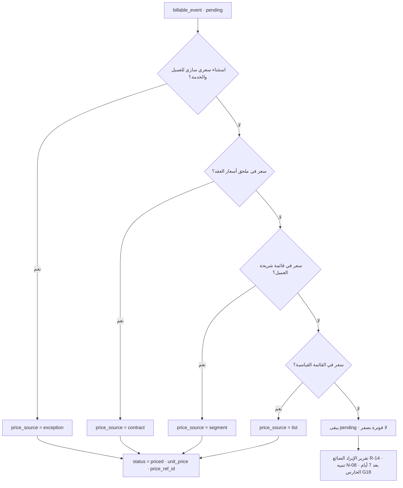

**القواعد المفروضة برمجياً**

| القاعدة | المشغِّل / القيد | القيمة | المصدر |
|---|---|---|---|
| لا فوترة مزدوجة للحدث | `billable_events_source_table_source_id_service_id_idx` UNIQUE | — | 40 §C6 |
| حالات الحدث | `chk_billable_events_status` | `pending · priced · invoiced · excluded · disputed` | 13B |
| أحداث بلا سعر تُبلَّغ | `billing.verify_unpriced_events()` — الحارس **G18 تقرير فقط** | `pending` و`occurred_at < now() - 7 days` | 40 Part F · EXEC §1.16 R-02c |
| الخمس الإلزامية | `catalog.services.requires_contract_clause = true` على DL-11/12/13/14/18 | 5 خدمات | القاعدة الحيّة · 04 §د |
| أعلام العقد | `bills_failed_attempt` · `bills_return` · `bills_waiting` · `bills_reschedule` · `bills_partial_delivery` — الافتراضي **false** | OFF | EXEC §1.1 · 13B |
| نطاق الرؤية | سياسة `entity_scope` على `billable_events` | `platform.allowed_entities()` | 13B |

---

### 4.4 الفاتورة — التوليد والاعتماد والإصدار — A3 توليد · **A2 اعتماد**

**المدخل:** أحداث `priced` لكل زوج (عميل × كيان) في دورة الفوترة.

1. النظام يجمّع الأحداث في مسودة `billing.invoices` بحالة `draft` **بلا `doc_no`** وسطور `invoice_lines` كل سطر منها يحمل `price_source` و`price_ref_id` و`event_count`.
2. غرامات SLA المحسوبة من `sales.sla_results.penalty_amt` تنزل في `invoices.sla_penalty_amt` — سطر ظاهر في الفاتورة.
3. `CFO` يراجع ويطابق بالتقارير التشغيلية → `review`.
4. **بوابة الاعتماد:** الإجمالي **≤ 500 د.ك** → اعتماد **آلي**؛ فوقه → **بند في صندوق قرارات `CFO`** (INV-C6-4).
5. عند الاعتماد فقط يُخصَّص `doc_no` من سلسلة `INV` عبر `platform.next_doc_no()` — ذرّي ولا يُعاد استخدامه؛ ويُجمَّد `frozen_snapshot`.
6. توليد PDF مع **ورقة التفصيل** التي تحصر كل حدث بتاريخه ومرجعه وسعره ومصدر السعر — وهي ما يمنع النزاع.
7. الإرسال `sent` + إشعار في نافذة العميل. والفاتورة المعتمدة **لا تُعدَّل**؛ التصحيح بإشعار دائن.
8. المعاملة البينية تُعلَّم `is_intercompany = true` و`invoice_type = 'intercompany'` مع `counterparty_entity_id`.

**المخرج:** فاتورة بترقيم قانوني · قيد محاسبي تلقائي · أحداثها `invoiced`.

#### خريطة 4-4: من المسودة إلى الفاتورة المرسَلة
تقرأ من تجميع الأحداث إلى القيد المحاسبي.

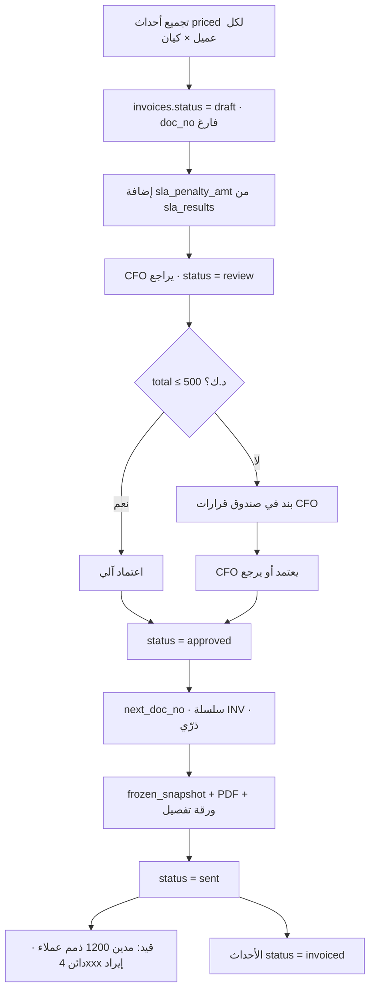

**القواعد المفروضة برمجياً**

| القاعدة | المشغِّل / القيد | القيمة | المصدر |
|---|---|---|---|
| لا رقم قبل الاعتماد | `doc_no_only_when_approved` CHECK على `billing.invoices` | `draft`/`review` ⇒ `doc_no is null` | 40 §A3 · 13B |
| الرقم فريد لكل كيان | `invoices_entity_id_doc_no_key` UNIQUE | — | 13B |
| ذرّية الترقيم | `platform.next_doc_no()` مع `update … returning` | الحارس **G13**: 100 رقم فريد تحت 100 اتصال متزامن | 40 Part F |
| سقف الاعتماد الآلي | `platform.thresholds['invoice.auto_approve_max']` | **500** د.ك | EXEC §1.1 · 29 §7-1 |
| القابضة لا تفوتر خارجياً | `trg_no_holding_invoice` ← `billing.reject_holding_invoice()` | `entity_kind = holding` و`invoice_type <> 'intercompany'` ⇒ استثناء | EXEC §1.5 · 40 §A2 |
| كل سطر يسنده حدث | الحارس **G11**: `invoice_lines` بلا `billable_events.invoice_line_id` = 0 | 0 صفوف | 40 Part F |
| حالات الفاتورة | `chk_invoices_status` | `draft · review · approved · sent · partially_paid · paid · overdue · void` | STATE-REGISTER §1 |
| الرصيد مشتق | `balance` عمود مولَّد `total - paid_amount` | — | 13B |

---

### 4.5 التحصيل والتخصيص والمطابقة البنكية والحجز الائتماني — A3 أعمار · **A2 مطابقة** · **A0 رفع الحجز**

**المدخل:** فاتورة `sent` ومهلة سداد من `sales.accounts.payment_terms_days`.

1. تذكيرات آلية عند **−3 · 0 · +7 · +15 · +30** يوماً من الاستحقاق.
2. `PRO` يسجّل سند قبض في `billing.receipts` من سلسلة **`RCT`** · `recorded_by` إلزامي.
3. التخصيص ضد فواتير محددة في `billing.receipt_allocations` — **لا سداد عائم بلا تخصيص أكثر من 7 أيام**؛ والعمود المولَّد `unallocated` يكشف المتبقي.
4. الفاتورة تنتقل إلى `partially_paid` ثم `paid` بحسب `balance`.
5. **المطابقة البنكية — `CFO` حصراً** ومِلكية التكامل `I-08`: استيراد CSV/MT940 ومطابقة بالمبلغ والمرجع، وغير المطابق يذهب للمحاسب. وهي **حدث** `billing.reconciliation.matched` على `receipt_allocations` **لا حالة فاتورة**؛ ويُختم `reconciled_by` و`reconciled_at`.
6. الحجز الائتماني **تلقائي** عند تجاوز `credit_limit` أو تأخر يفوق المهلة → `sales.accounts.credit_hold = true` — ويمنع أوامر الصرف الجديدة ومهام التوصيل وطوابير الكول سنتر **في الكيانات الأربعة معاً** (S6).
7. **رفع الحجز يبقى بشرياً** — `GM` أو `CFO` بسبب مسجَّل **ومدة محددة**.

**المخرج:** ذمم محدَّثة · تيار نقدي مطابَق · حجز ائتماني منضبط.

#### خريطة 4-5: التحصيل والمطابقة والحجز
تقرأ من الفاتورة المرسَلة إلى المطابقة البنكية وإلى الحجز الائتماني.

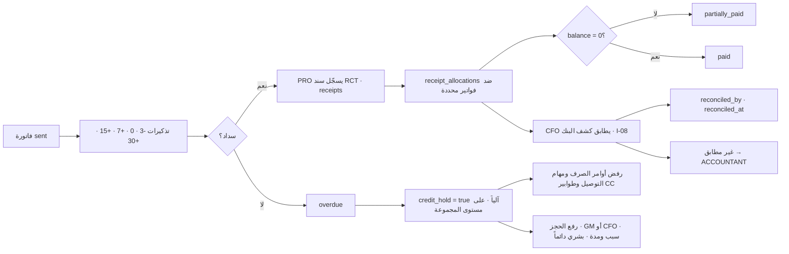

**القواعد المفروضة برمجياً**

| القاعدة | المشغِّل / القيد | القيمة | المصدر |
|---|---|---|---|
| المحصِّل لا يطابق البنك | `identity.sod_rules (PRO, CFO)` نشط | — | EXEC §1.6 · 22 §2-2 |
| معتمِد الفاتورة لا يسجّل السداد | `identity.sod_rules (CFO, ACCOUNTANT)` نشط | — | EXEC §1.6 |
| تخصيص موجب | `receipt_allocations.positive_allocation` CHECK `amount > 0` | — | 13B |
| سند القبض فريد | `receipts_entity_id_doc_no_key` UNIQUE | سلسلة `RCT` فقط · `RCP` ملغاة | EXEC §1.6 · R-04 |
| سند مُدخَل خارج الاتصال | `chk_billing_receipts_offline_has_date` CHECK | `entered_offline` ⇒ `original_occurred_at not null` | 13B |
| الحجز على مستوى المجموعة | `credit_limit` و`credit_hold` على `sales.accounts` لا على العقد | — | 40 §A2 · S6 |
| تنبيه اقتراب الحد | **N-07** عند 80% من الحد · يومي · `CFO` | 80% | 25 §2 |
| تنبيه المطابقة المتأخرة | **N-21** مطابقة غير مكتملة > **7 أيام** · `CFO` | 7 أيام | 40 §B6 · EXEC §1.4 |

---

### 4.6 الإشعار الدائن — A0 · **`GM` حصراً ولا يُؤتمت أبداً**

**المدخل:** خطأ أو تسوية على فاتورة **معتمدة**.

1. `CFO` يطلب إشعاراً دائناً في `billing.credit_notes` بحالة `draft` · `invoice_id` **إلزامي** · `reason` **إلزامي** · `requested_by`.
2. المسار: `CFO` → **`GM`** — ولا اعتماد آلي إطلاقاً، وهذه قيمة **FIXED** لا تُضبط من `platform.thresholds`.
3. عند الاعتماد: `approved_by` و`approved_at` ورقم من سلسلة `CN`.
4. التطبيق `applied` يخفّض رصيد الفاتورة الأصلية ويولّد قيداً عكسياً.

#### خريطة 4-6: مسار الإشعار الدائن
تقرأ من طلب التخفيض إلى القيد العكسي.


**القواعد المفروضة برمجياً**

| القاعدة | المشغِّل / القيد | القيمة | المصدر |
|---|---|---|---|
| فاتورة أصلية إلزامية | `credit_notes_invoice_id_fkey` NOT NULL + FK | — | 13B |
| سبب إلزامي | `reason text not null` | — | 13B |
| حالات الإشعار | `chk_credit_notes_status` | `draft · approved · applied` | STATE-REGISTER §1 |
| لا أتمتة | غير مدرج في `platform.thresholds` — تغييره يحتاج **ADR مسجَّلاً** | FIXED | EXEC §1.1 · 29 §7-1 |
| الفاتورة المعتمدة لا تُعدَّل | INV-C6-2 · المبدأ P3 دفاتر append-only | — | 40 §A1 · §C6 |

---

### 4.7 الفوترة البينية وتوزيع تكاليف الكيان القابض — A3

**المدخل:** نهاية الشهر · تكاليف `PGH` المشتركة وإيراد كل كيان.

1. `PGH` تحمل: التكاليف المشتركة · رواتب الإدارة العليا `GM` · `CFO` · `SALES_MGR` · `SYSADMIN` · العقود الإطارية · الاشتراكات والتراخيص الجماعية.
2. النظام يحسب حصة كل كيان تشغيلي على **أساس نسبة الإيراد** من إيراد المجموعة في الشهر نفسه — والأساس قابل للتغيير لبند بعينه **بقرار `CFO` مسجَّل**.
3. تُكتب صفوف في `billing.cost_allocations` لكل (فترة × كيان × نوع تكلفة) مع `basis` و`source_table/source_id`.
4. القيد البيني: `PGH` مدين **1210** ذمم بينية / دائن **4900** إيراد بيني — والكيان المستقبِل مدين **5900** مصروف بيني / دائن **2110** ذمم بينية.
5. إعادة الفوترة بين الكيانات التشغيلية تتبع الآلية نفسها بفاتورة `invoice_type = 'intercompany'`.
6. عند التجميع تُحذف **4900 · 5900 · 1210 · 2110** وكل صف `is_intercompany = true` (INV-C6-6).

#### خريطة 4-7: توزيع تكاليف PGH والقيد البيني
تقرأ من تكلفة القابضة إلى حذفها عند التجميع.

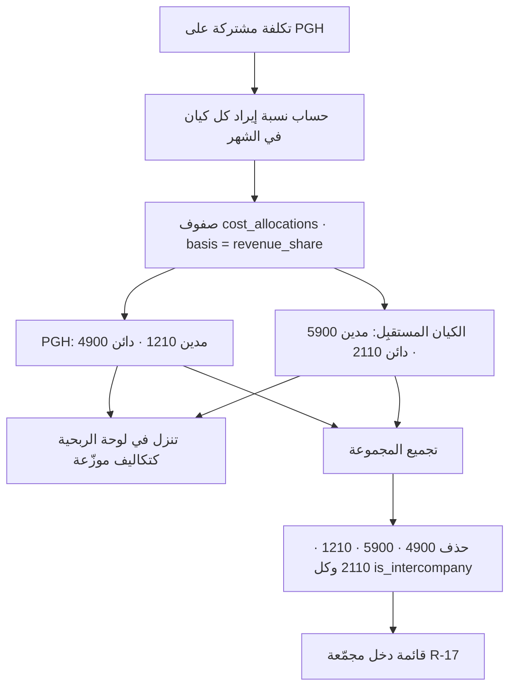

**القواعد المفروضة برمجياً**

| القاعدة | المشغِّل / القيد | القيمة | المصدر |
|---|---|---|---|
| القابضة بلا أب | `holding_has_no_parent` CHECK على `platform.entities` | `entity_kind = holding` ⇒ `parent_id is null` | 13B |
| منع الفاتورة الخارجية على القابضة | `trg_no_holding_invoice` | استثناء عند `invoice_type <> 'intercompany'` | EXEC §1.5 |
| الأساس الافتراضي | نسبة الإيراد — تغييره لبند بعينه بقرار `CFO` مسجَّل | revenue share | 06 §5-1 · 11 §12 البند 5 |
| علامة البينية | `is_intercompany` على `invoices` · `billable_events` · `journal_entries` | `false` افتراضاً | 13B |
| الحذف عند التجميع | INV-C6-6 | كل `is_intercompany = true` | 40 §C6 |

---

### 4.8 المشتريات والمطابقة الثلاثية — **A2 اعتماد** · A3 مطابقة

**المدخل:** حاجة قسم · `admin.purchase_requests` بـ`cost_center` **إلزامي** و`client_id` كلما أمكن.

1. فحص آلي: بند الميزانية `budget_line_id` والرصيد المتاح `admin.budget_lines.available` — **لا أمر شراء بلا بند ورصيد كافٍ**.
2. الاعتماد بالشريحة المالية على `estimated_amount`:
   · **≤ 100 د.ك** → اعتماد **آلي** بلا معتمِد بشري
   · **> 100 و ≤ 500** → **مدير القسم الطالب** `WH_MGR` / `DEL_MGR` / `SALES_MGR` / `FLEET_MGR` / `CC_MGR`
   · **> 500 و ≤ 2,000** → **`CFO`**
   · **> 2,000** → **`GM`**
3. **ثلاثة عروض إلزامية فوق 500 د.ك** في `admin.vendor_quotes`؛ والاختيار يستوجب `selection_reason` — ليس بالضرورة الأرخص لكن السبب إلزامي.
4. الترسية → `admin.purchase_orders` برقم من سلسلة `PO` وإرسال للمورّد.
5. الاستلام والفحص → **مطابقة ثلاثية**: أمر الشراء ↔ الاستلام ↔ الفاتورة → `three_way_matched = true`.
6. الدفع **مستحيل** قبل المطابقة — القيد `no_pay_before_match` يمنع `paid_at` بلا `three_way_matched`.
7. فاتورة بلا أمر شراء **مرفوضة** إلا باعتماد استثنائي من **`GM`** بسبب مسجَّل.
8. القيد: مدين 5xxx مصروف أو 1500 أصول ثابتة / دائن 2100 ذمم موردين؛ ثم الدفع مدين 2100 / دائن 1100 بنك.

#### خريطة 4-8: دورة المشتريات من الطلب إلى الدفع
تقرأ من طلب الشراء إلى قيد الدفع.

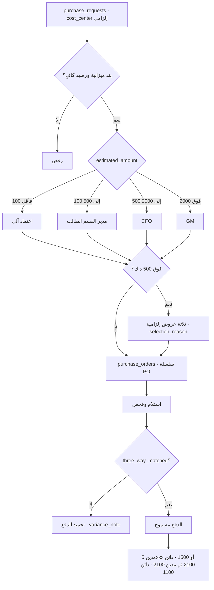

**القواعد المفروضة برمجياً**

| القاعدة | المشغِّل / القيد | القيمة | المصدر |
|---|---|---|---|
| الاعتماد الآلي | `platform.thresholds['purchase.auto_max']` | **100** د.ك | EXEC §1.1 |
| مدير القسم الطالب | `platform.thresholds['purchase.manager_max']` | **500** د.ك | EXEC §1.1 · R-04 |
| المدير المالي | `platform.thresholds['purchase.cfo_max']` | **2,000** د.ك · فوقها `GM` | EXEC §1.1 |
| ثلاثة عروض | `platform.thresholds['purchase.three_quotes_min']` | **500** د.ك | 11 §3 · 12 س14 |
| سبب الاختيار | `vendor_quotes.selected_needs_reason` CHECK | `is_selected` ⇒ `selection_reason not null` | 13B |
| لا دفع قبل المطابقة | `purchase_orders.no_pay_before_match` CHECK | `paid_at` ⇒ `three_way_matched` | 13B · S14 |
| لا اعتماد ذاتي | `purchase_requests.no_self_approval` CHECK `approved_by <> requested_by` | قيد عمودي فعلي لا `check (true)` | 11 §10-1 · EXEC §1.1 |
| مركز التكلفة إلزامي | `purchase_requests.cost_center not null` | — | 11 §9 |
| المناصب الشاغرة | `OPS_DIR` و`HR_MGR` لا يظهران معتمِدَين في أي سلسلة | — | R-04 · 22 §2-1 |

---

### 4.9 العهدة النقدية وعهدة الرسوم الحكومية — A1/A2

**المدخل:** حامل عهدة معتمَد من `CFO` بحد `limit_amount` وسقف عملية واحدة `max_single_txn`.

1. `admin.petty_cash` — **عهدة نشطة واحدة لكل موظف** يفرضها فهرس فريد جزئي على `holder_employee_id` حيث `status = 'active'`.
2. كل صرف في `admin.petty_cash_transactions` بنوع `advance · expense · settlement · return` — و**الصرف بلا إيصال مرفوض** بالقيد `expense_needs_receipt`.
3. فوق سقف العملية الواحدة: يمر بدورة المشتريات لا بالعهدة.
4. التسوية عند بلوغ **70% من الحد** أو نهاية الشهر — أيهما أسبق؛ والتجديد بعد اعتماد التسوية فقط. المستندات الناقصة تُخصم من حامل العهدة.
5. **تيار نقدي ثانٍ منفصل تماماً:** عهدة الرسوم الحكومية على `admin.gov_transactions` — كل صرف رسوم بسند من سلسلة **`GOV`** مع إثبات `receipt_url`.
6. **الخلط ممنوع:** سند `RCT` لا يُصرف به رسم، وسند `GOV` لا يُقبض به من عميل.
7. **`CFO` يطابق السلسلتين منفصلتين شهرياً** — وهو الضابط التعويضي الوحيد لتجميع `PRO = ACCOUNTANT` (EXEC §1.7).

#### خريطة 4-9: تيارا النقد في يد المندوب
تقرأ من مصدر النقد إلى مطابقة المدير المالي.

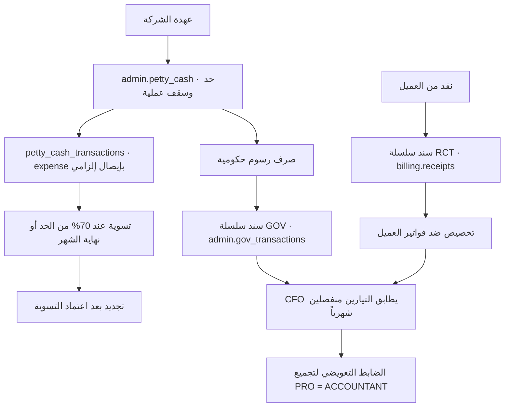

**القواعد المفروضة برمجياً**

| القاعدة | المشغِّل / القيد | القيمة | المصدر |
|---|---|---|---|
| عهدة نشطة واحدة | `petty_cash_holder_employee_id_idx` UNIQUE جزئي `where status='active'` | — | 13 |
| لا صرف بلا إيصال | `expense_needs_receipt` CHECK | `txn_type = 'expense'` ⇒ `receipt_url not null` | 11 §10 |
| سقف العملية الواحدة | `petty_cash.max_single_txn` | افتراضي **50** في المخطط · القيم يعتمدها `CFO` | 13B · 11 §12 البند 3 |
| السلاسل الثلاث | `platform.counters` doc_type | `INV` · `RCT` · `GOV` — و`RCP` غير موجودة | EXEC §1.6 · القاعدة الحيّة |
| **سند الرسوم من سلسلة `GOV` حصراً** | `chk_gov_voucher_series` على `gov_transactions.fee_voucher_no` | الرقم يطابق `-GV-[0-9]+$` وإلا رُفض — **الفصل عن `RCT` مفروض بالقيد لا بالسياسة** | **✅ SCH-4 ق-21** · 11 §6-1 |
| **رسوم مدفوعة ⇒ سند إلزامي** | `chk_gov_fees_need_voucher` | معاملة مُقفلة (`completed_at`) برسوم > 0 بلا `fee_voucher_no` **تُرفض** | **✅ SCH-4 ق-21** · 11 §6-1 |
| مالك المرحلة إلزامي | `gov_transactions.stage_owner not null` | — | 40 §C7 |
| موعد الاستحقاق بمُشغِّل | `trg_gov_due_at` ← `platform.set_stage_due_at()` | `due_at = stage_started_at + sla_days` · الافتراضي **7 أيام** | 11 §10-1 · 40 §C7 |
| التأخر شرط قراءة لا عمود | `due_at < now() and completed_at is null` | التصعيد عند **+50%** أي اليوم **11** | 11 §12 البند 6 · `recruitment.escalate_days = 11` |

---

### 4.10 الشركاء — حدث الدفع وفاتورة الشريك والمطابقة 2% — **A2**

**المدخل:** `partners.service_allocations` يحدّد من ينفّذ أي خدمة لأي عميل.

1. عند إقفال العملية المنفَّذة لدى شريك يُكتب **حدثان متزامنان**: `billing.billable_events` بسعر العقد و`partners.payable_events` بسعر التعاقد مع الشريك، مربوطان بـ`billable_event_id` — **الهامش يُحسب فوراً**.
2. `payable_events.client_id` **هو أساس الربحية** — بدونه لا تُربط تكلفة الشريك بالعميل.
3. نهاية الشهر: فاتورة الشريك تُسجَّل في `partners.partner_invoices` بـ`partner_ref` مقابل `doc_no` من سلسلة `PINV`، و`variance_amount` عمود **مولَّد** = `claimed_amount − matched_amount`.
4. المطابقة الآلية ضد أحداثنا بعتبة **`partner.match_tolerance_pct = 2%`**:
   · **الفرق ≤ 2%** بما فيه التطابق التام → **اعتماد آلي للدفع**
   · **الفرق > 2%** → **تجميد الدفع** · تقرير سطر بسطر · بند في صندوق القرارات · نزاع موثّق
   · **بند في فاتورته بلا حدث لدينا** → **مرفوض** مهما صغر المبلغ
   · **حدث لدينا بلا بند** → تنبيه — قد يكون خصماً مستحقاً
5. `matched_by ≠ approved_by` — قيد `matcher_ne_approver` هو الضابط الأدنى حتى يُسمَّى الدوران.
6. السعة المحجوزة: `partners.check_committed_utilization()` يكشف كل عقد `committed` استغلاله تحت `min_utilization_pct` الافتراضي **70%**، ويحسب الكلفة الضائعة.
7. القيد: مدين 5xxx مصروف شريك / دائن 2100 ذمم موردين.

#### خريطة 4-10: الحدث المزدوج ومطابقة فاتورة الشريك
تقرأ من تخصيص الخدمة للشريك إلى قرار الدفع.

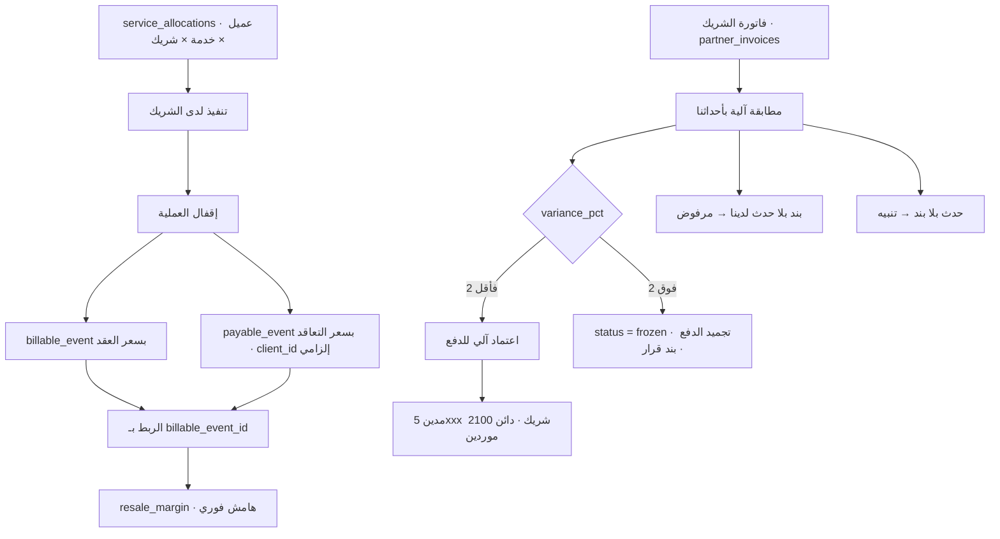

**القواعد المفروضة برمجياً**

| القاعدة | المشغِّل / القيد | القيمة | المصدر |
|---|---|---|---|
| عتبة المطابقة | `platform.thresholds['partner.match_tolerance_pct']` | **2** % | EXEC §1.1 · 40 §C6 · 09 §5-1 |
| الفرق عمود مولَّد | `variance_amount generated always as (claimed_amount - matched_amount) stored` | — | 13B |
| المطابِق ليس المعتمِد | `matcher_ne_approver` CHECK | `matched_by <> approved_by` | 09 §4 |
| لا دفع بلا مطابقة | الحارس **G5** `partners.verify_paid_matched()` | `paid_amount > 0` وحالة ليست `approved/paid` = 0 صفوف | 40 Part F |
| فاتورة الشريك فريدة | `partner_invoices_partner_id_partner_ref_key` UNIQUE | — | 13B |
| حدث الدفع فريد | UNIQUE `(source_table, source_id, service_id, partner_id)` | — | 13B |
| استغلال السعة المحجوزة | `partners.check_committed_utilization(period)` · `min_utilization_pct` | **70** % افتراضاً | 09 §3 · §10 البند 5 |
| سقف المسؤولية | `liability_cap = min(3 × الفوترة الشهرية، قيمة العقد)` · `partner.liability_cap_months = 3` | التأمين على الشريك | EXEC §1.1 · 09 §7-1 |
| الغرامة قابلة للاسترداد | `penalty_recoverable` بند إلزامي في كل عقد جديد · خلافه بقرار `GM` | — | 09 §10 البند 6 |
| تنبيه الفرق | **N-10** فاتورة شريك بفرق > 2% · لحظي · `CFO` | — | 25 §2 |

---

### 4.11 دفتر الأستاذ والقيود الآلية — A3

**المدخل:** أحداث الأعمال المولِّدة للقيود.

**هيكل دليل الحسابات** — موحّد في الكيانات الخمسة ليتم التجميع بلا مطابقة يدوية:

| المجموعة | النطاق | أمثلة حاكمة |
|---|---|---|
| **1 الأصول** | 1000–1999 | 1100 نقد وبنوك · 1200 ذمم عملاء · **1210 ذمم بينية** · 1500 أصول ثابتة |
| **2 الالتزامات** | 2000–2999 | 2100 ذمم موردين · **2110 ذمم بينية** · 2200 مستحقات موظفين · 2300 إيراد مؤجل |
| **3 حقوق الملكية** | 3000–3999 | 3100 رأس المال · 3200 أرباح مرحّلة |
| **4 الإيرادات** | 4000–4999 | 4100 تخزين · 4200 مناولة · 4300 تجهيز · 4400 توصيل · 4500 قيمة مضافة · 4600 كول سنتر · **4900 إيراد بيني** |
| **5 المصروفات** | 5000–5999 | 5100 رواتب · 5200 وقود · 5300 صيانة · 5400 إيجارات · 5500 غرامات SLA · 5600 تالف ومفقود · **5900 مصروف بيني** |

**جدول: الحدث ← القيد المتولّد تلقائياً**

| الحدث | الجدول المصدر | مدين | دائن |
|---|---|---|---|
| اعتماد فاتورة عميل | `billing.invoices` | 1200 ذمم عملاء | 4xxx إيراد بحسب فئة الخدمة |
| تحصيل وتخصيص | `billing.receipts` · `receipt_allocations` | 1100 بنك | 1200 ذمم عملاء |
| اعتماد إشعار دائن | `billing.credit_notes` | 4xxx إيراد | 1200 ذمم عملاء |
| فاتورة بينية صادرة | `billing.invoices` بـ`is_intercompany` | 1210 ذمم بينية | 4900 إيراد بيني |
| فاتورة بينية واردة | الكيان المستقبِل | 5900 مصروف بيني | 2110 ذمم بينية |
| توزيع تكاليف `PGH` | `billing.cost_allocations` | القيد البيني نفسه | القيد البيني نفسه |
| استلام مشتريات | `admin.purchase_orders` | 5xxx مصروف **أو** 1500 أصول | 2100 ذمم موردين |
| دفع للمورّد | `admin.purchase_orders.paid_at` | 2100 ذمم موردين | 1100 بنك |
| اعتماد فاتورة شريك | `partners.partner_invoices` | 5xxx مصروف شريك | 2100 ذمم موردين |
| صرف رسوم حكومية | `admin.gov_transactions.fees_paid` | 5xxx رسوم حكومية | العهدة / 1100 بنك |
| صرف من العهدة النقدية | `admin.petty_cash_transactions.gl_account_id` | 5xxx بحسب الحساب | العهدة |
| غرامة SLA | `sales.sla_results.penalty_amt` | 5500 غرامات SLA | 1200 ذمم عملاء |

**القواعد المفروضة برمجياً**

| القاعدة | المشغِّل / القيد | القيمة | المصدر |
|---|---|---|---|
| التوازن | الحارس **G2** `billing.verify_journal_balance()` | `sum(debit) = sum(credit)` لكل قيد — **0 صفوف** وإلا يتوقف الدمج والنشر | 40 Part F · INV-C6-3 |
| جانب واحد للسطر | `journal_lines.one_side_only` CHECK | مدين موجب ودائن صفر **أو** العكس | 13B |
| رقم القيد فريد | `journal_entries_entity_id_doc_no_key` UNIQUE · سلسلة `JE` | — | 13B |
| الدفاتر append-only | المبدأ **P3** — التصحيح بقيد عكسي عبر `reversed_by` | `REVOKE UPDATE, DELETE` | 40 §A1 |
| النقد بثلاث خانات | `numeric(14,3)` · KWD · لا `float` إطلاقاً | — | 40 §A3 |
| الوقت | `timestamptz` مخزَّن UTC ومعروض `Asia/Kuwait` | — | 40 §A3 |

---

### 4.12 الإقفال الشهري — ثلاث خطوات آلية تحت المبدأ P11

**المدخل:** نهاية الفترة المحاسبية.

| # | الخطوة | من يفعلها | ما يتغيّر في القاعدة |
|---|---|---|---|
| 1 | إقفال أحداث الشهر · لقطة الإشغال الأخيرة | النظام | `billable_events` تُقفل الفترة · `wms.occupancy_snapshots` |
| 2 | تسعير الأحداث · تقرير الاستثناءات | النظام | `status: pending → priced` |
| 3 | معالجة الاستثناءات — بلا سعر · بلا عقد · تحت الحد | **`CFO`** | `excluded` بسبب · أو تسعير يدوي بمصدر |
| 4 | احتساب غرامات SLA | النظام | `sales.sla_results` · `invoices.sla_penalty_amt` |
| 5 | توليد المسودات لكل عميل ولكل كيان | النظام | `invoices` بحالة `draft` |
| 6 | المراجعة والمطابقة بالتقارير التشغيلية | **`CFO`** | `status = review` |
| 7 | الاعتماد → تخصيص الأرقام → توليد PDF | النظام ≤ 500 · **`CFO`** فوقها | `approved` · `doc_no` · `frozen_snapshot` |
| 8 | الإرسال والإشعار في نافذة العميل | **`CFO`** | `sent` |
| 9 | ترحيل القيود · تخصيص التكاليف · احتساب الربحية | **`COST_ANALYST`** | `journal_entries` · `cost_allocations` · `profitability` |
| 10 | مراجعة العقود تحت حد الهامش | **`GM`** | قرار تجديد أو إنهاء مسجَّل |

**من يقفل:** `CFO` يقفل شهر **كل كيان على حدة** ويعتمد قيوده **قبل** التجميع — وهو مُدخَل التقرير R-17 (25 §5 · PLT-15).

#### خريطة 4-11: الإقفال الشهري بحرّاسه
تقرأ من إقفال الأحداث إلى القوائم المجمّعة، مع الحرّاس الثلاثة.

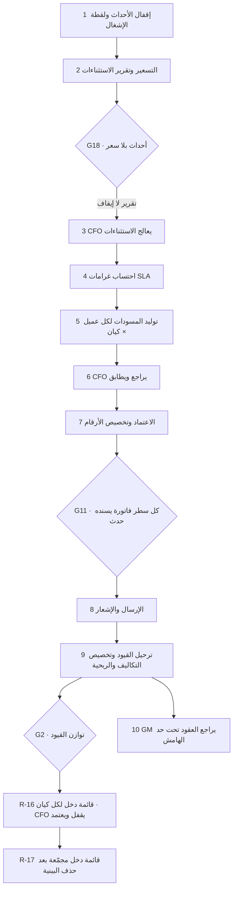

**الحرّاس على مسار الإقفال**

| الحارس | الاستعلام | شرط النجاح | يوقف النشر؟ |
|---|---|---|---|
| **G2** | `select count(*) from billing.verify_journal_balance();` | `0` | **نعم** |
| **G11** | سطور فواتير بلا حدث يسندها | `0` | **نعم** |
| **G18** | `select count(*) from billing.verify_unpriced_events();` | يُبلَّغ ولا يُفرض | **لا — تقرير فقط** |
| G5 | `partners.verify_paid_matched()` | `0` | نعم |
| G13 | ذرّية `next_doc_no` تحت 100 اتصال | 100 رقم فريد | نعم |

---

### 4.13 تخصيص التكلفة والربحية والميزانية — A3 ربحية

**المدخل:** قيود الشهر المرحَّلة + مصادر التكلفة التشغيلية.

**أسس التخصيص** (06 §9-1 · 11 §9):

| نوع التكلفة | المصدر في القاعدة | أساس التخصيص |
|---|---|---|
| عمالة مباشرة | `hr.employees.assigned_client_id` | مباشر |
| عمالة غير مباشرة | رواتب المشرفين والإدارة | نسبة الأحداث أو المنصات |
| وقود | `tms.fuel_ledger` للمركبات المخصّصة | مباشر · أو نسبة الشحنات |
| مساحة | إيجار المستودع | **نسبة المنصات المشغولة** من `wms.occupancy_snapshots` |
| مركبات | إهلاك + `tms.maintenance_orders` + تأمين | مباشر للمخصّصة · نسبة الرحلات لغيرها |
| مقاعد PCC | `cc.agents` + بنية الاتصال | نسبة المكالمات أو المقاعد |
| غرامات SLA | `sales.sla_results.penalty_amt` | مباشر |
| تالف ومفقود | `wms.stock_movements` نوع damage/scrap | مباشر |
| **تكلفة الشركاء** | `partners.payable_events.amount` بـ`client_id` | مباشر |
| **تكلفة السكن** | `housing.utility_bills` + الإيجار + خصم **23 د.ك** للموظف | تُخصَّص لربحية العميل — قرار EXEC §1.3 «نعم» |
| **تكلفة الاستقدام** | `hr.recruitment_costs` عبر العرض `hr.recruitment_cost_per_employee` | **تُطفأ على مدة العقد** للعميل المخصَّص له الموظف |
| عمولات السائقين | `hr.commission_daily.net_commission` | مباشر للعميل المخصَّص |
| عهد تالفة أو مفقودة | `admin.asset_custody` | مركز التكلفة الذي حدثت فيه |
| مصروفات إدارية عامة | `admin.*` بـ`cost_center` | نسبة الإيراد أو عدد الموظفين |
| تكاليف القابضة | `billing.cost_allocations` من `PGH` | نسبة الإيراد |

**الربحية:** صف واحد لكل `(period, entity_id, client_id, contract_id)` في `billing.profitability`، والعمود `margin` **مولَّد**:
`margin = revenue − cost_labour − cost_fuel − cost_space − cost_vehicle − cost_other − sla_penalty`.

> **✅ أُغلق في 13B (SCR ق-29):** أُضيفت ثلاثة أعمدة تكلفة مستقلة — **`cost_partner` · `cost_housing` · `cost_recruitment`** — فصار سؤال «كم كلّفنا هذا العميل من الشركاء؟» مُجاباً من الجدول مباشرة (09 §6 · 11 §9 · 14 §6-2 · EXEC §1.3). وتعليق القاعدة على `cost_other` صار نصّاً: «**المتبقّي بعد فصل `cost_partner` و`cost_housing` و`cost_recruitment`**».
> **✅ أُغلق (تصحيح لاحق لـSCH-4):** أُعيد تعريف تعبير `margin` المولَّد في 13B ليطرح الأعمدة التسعة كلها: `revenue − labour − fuel − space − vehicle − other − partner − housing − recruitment − sla_penalty` — متحقَّق من القاعدة الحيّة بعد إعادة البناء.

**KPI الحاكم:** عقد يهبط تحت **15%** ثلاثة أشهر متتالية → يُعاد التفاوض عليه أو يُنهى **بقرار `GM` مسجَّل**؛ وأي عرض أو تجديد بهامش أقل من **10%** لا يُعتمد إلا من `GM`.

**الميزانية:** `admin.budget_lines` يحمل `annual_amount` و`committed_amount` و`spent_amount`، و`available` **عمود مولَّد** = `annual − committed − spent`. طلب الشراء يفحصه قبل الاعتماد؛ ومقارنة الفعلي بالمخطَّط تتم على `gl_account_id × cost_center × fiscal_year`.

#### خريطة 4-12: من التكلفة إلى الربحية إلى قرار العقد
تقرأ من مصادر التكلفة إلى قرار التجديد أو الإنهاء.

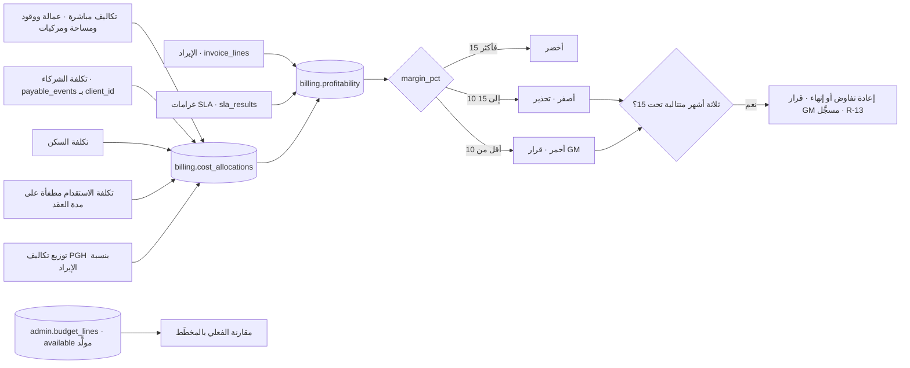

**القواعد المفروضة برمجياً**

| القاعدة | المشغِّل / القيد | القيمة | المصدر |
|---|---|---|---|
| الهامش مولَّد | `profitability.margin` عمود مولَّد مخزَّن | — | 13B |
| صف ربحية فريد | UNIQUE `(period, entity_id, client_id, contract_id)` | — | 13B |
| بند ميزانية فريد | UNIQUE `(entity_id, fiscal_year, cost_center, gl_account_id)` | — | 13 |
| المتاح مولَّد | `available = annual_amount - committed_amount - spent_amount` | — | 13 |
| حد الهامش | `contract.min_margin_pct` / `contract.gm_margin_pct` | **15** / **10** | EXEC §1.1 |
| مركز التكلفة إلزامي | كل معاملة إدارية تحمل `cost_center` و`client_id` كلما أمكن | — | 11 §9 |

---

## 5. آلات الحالات

#### خريطة 5-1: `billing.billable_events.status`
تقرأ من تسجيل الحدث إلى فوترته أو استبعاده.

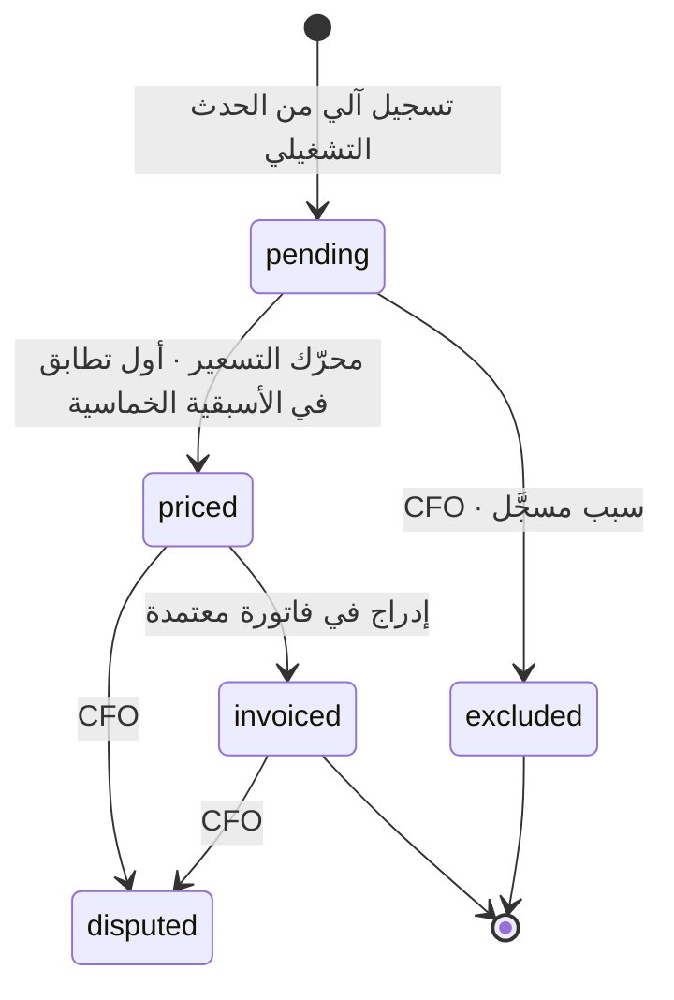

| الحالة | من ينقلها | الحدث | الشاشة |
|---|---|---|---|
| `pending` | النظام | `billing.event.recorded` | `/billing/events?status=pending` |
| `priced` | النظام | `billing.event.priced` | `/billing/events` |
| `excluded` | `CFO` | `billing.event.excluded` | صندوق القرارات |
| `disputed` | `CFO` | `billing.event.disputed` | `/billing/events` |
| `invoiced` | النظام | `billing.event.invoiced` | `/billing/invoices` |

#### خريطة 5-2: `billing.invoices.status`
تقرأ من المسودة إلى السداد أو الإلغاء.

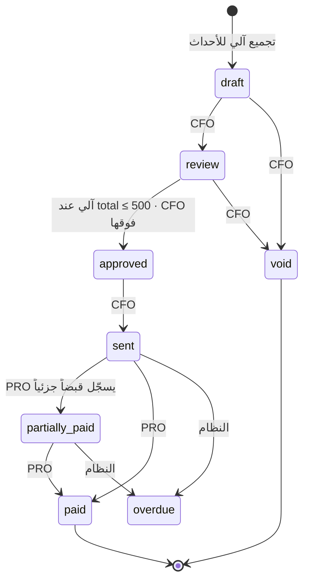

| الحالة | من ينقلها | الحدث | الشاشة |
|---|---|---|---|
| `draft` | النظام | `billing.invoice.drafted` | `/billing/invoices` |
| `review` | `CFO` | `billing.invoice.under_review` | `/billing/invoices` |
| `approved` | النظام ≤ 500 · `CFO` فوقها | `billing.invoice.approved` | صندوق القرارات |
| `sent` | `CFO` | `billing.invoice.sent` | `/billing/invoices` |
| `partially_paid` | `PRO` | `billing.invoice.partially_paid` | `/billing/receipts` |
| `paid` | `PRO` | `billing.invoice.paid` | `/billing/receipts` |
| `overdue` | النظام | `billing.invoice.overdue` + `sales.account.hold_set` | `/billing/invoices?overdue=1` |
| `void` | `CFO` | `billing.invoice.voided` | `/billing/invoices` |

> **المطابقة البنكية ليست حالة فاتورة** — هي الحدث `billing.reconciliation.matched` على `billing.receipt_allocations` ومالكه `CFO`؛ ولا حالة «مقفلة» على الفاتورة (OPS-23).

#### خريطة 5-3: `billing.credit_notes.status`
تقرأ من طلب التخفيض إلى تطبيقه.

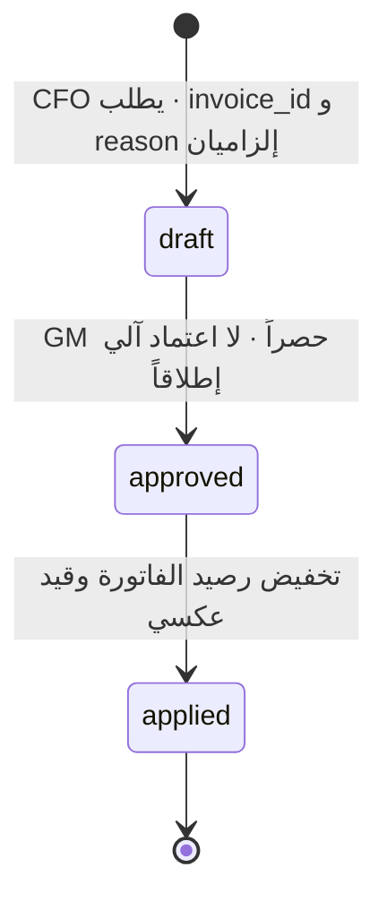

| الحالة | من ينقلها | الحدث | الشاشة |
|---|---|---|---|
| `draft` | `CFO` | — | `/billing/credit-notes` |
| `approved` | **`GM` حصراً** | `billing.credit_note.approved` | صندوق قرارات `GM` |
| `applied` | النظام | — | `/billing/invoices` |

#### خريطة 5-4: `partners.payable_events.status` — مرآة أحداث الفوترة
تقرأ من تسجيل تكلفة الشريك إلى إدراجها في فاتورته.

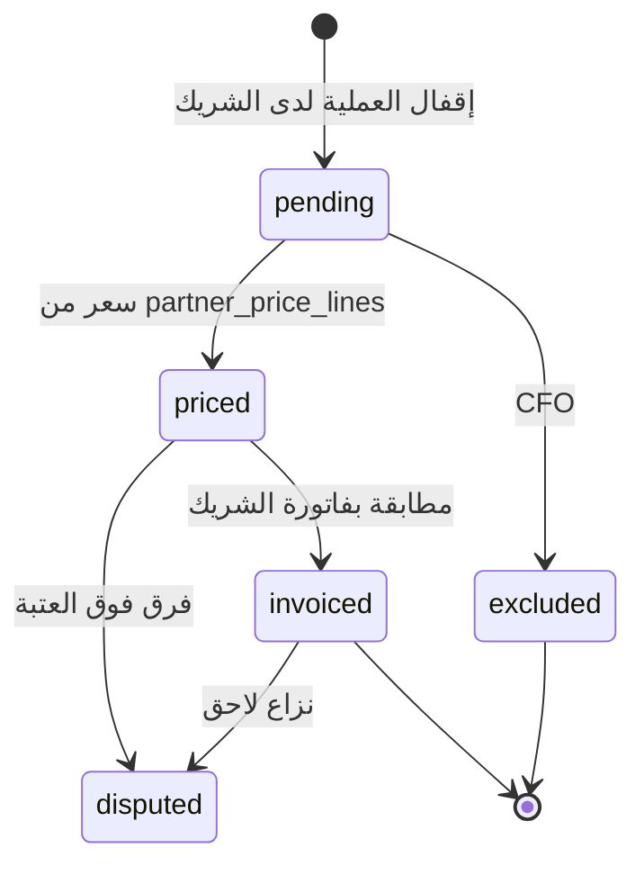

#### خريطة 5-5: `partners.partner_invoices.status`
تقرأ من استلام فاتورة الشريك إلى الدفع أو الرفض.

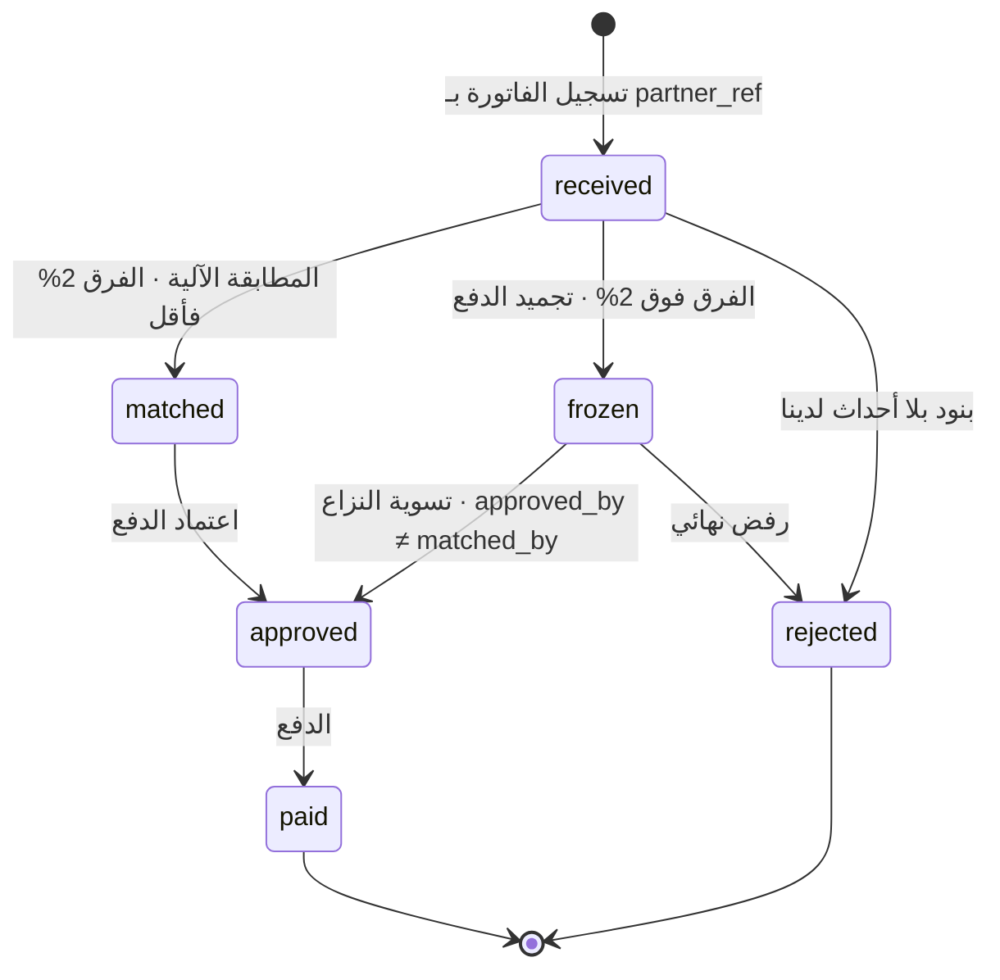

| الحالة | من ينقلها | الحدث | الشاشة |
|---|---|---|---|
| `received` | **غير مسمّى في الحزمة — §13 البند 3** | — | `/partners/invoices` |
| `matched` | النظام | مطابقة آلية | `/partners/invoices` |
| `frozen` | النظام | تنبيه **N-10** + بند قرار | `/partners/invoices?variance=1` |
| `approved` | **مفتوح — انظر §13 البند 3** | — | صندوق القرارات |
| `paid` | **مفتوح — §13 البند 3** | — | `/partners/invoices` |
| `rejected` | `CFO` | — | `/partners/invoices` |

#### خريطة 5-6: `admin.purchase_requests.status`
تقرأ من مسودة الطلب إلى أمر الشراء.

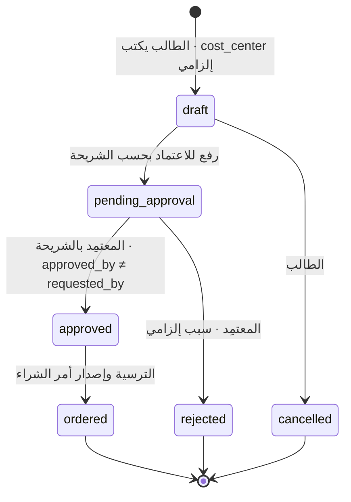

#### خريطة 5-7: `admin.purchase_orders.status`
تقرأ من إصدار أمر الشراء إلى الدفع.

```mermaid
stateDiagram-v2
  [*] --> issued : إرسال للمورّد
  issued --> received : الاستلام والفحص
  issued --> cancelled : إلغاء
  received --> matched : مطابقة ثلاثية · three_way_matched = true
  matched --> paid : الدفع مسموح فقط بعد المطابقة
  paid --> [*]
  cancelled --> [*]
```

#### خريطة 5-8: `admin.approval_requests.status` — محرّك الاعتماد الواحد
تقرأ من الطلب إلى بتّه أو انقضائه.

```mermaid
stateDiagram-v2
  [*] --> pending : إنشاء الطلب · current_step = 1
  pending --> delegated : إنابة سارية ومحدودة بـ 90 يوماً
  pending --> approved : كل الخطوات مبتوتة بالموافقة
  pending --> rejected : رفض بسبب إلزامي
  pending --> expired : تجاوز due_at
  delegated --> approved : المنيب إليه يبتّ · لا يلتف على SoD
  delegated --> rejected : رفض
  approved --> [*]
  rejected --> [*]
  expired --> [*]
```

#### خريطة 5-9: `admin.gov_transactions.stage`
تقرأ من طلب المعاملة الحكومية إلى إنجازها.

```mermaid
stateDiagram-v2
  [*] --> requested : طلب المعاملة · stage_owner إلزامي
  requested --> submitted : التقديم للجهة · government_ref
  submitted --> in_progress : متابعة · رسوم بسند GOV
  in_progress --> completed : استلام الوثيقة ورفعها
  in_progress --> rejected : رفض الجهة
  submitted --> rejected : رفض الجهة
  completed --> [*]
  rejected --> [*]
```

**آلات حالة مالية بسيطة — جدول بدل خريطة**

| العمود | الحالات | من ينقلها | ملاحظة |
|---|---|---|---|
| `catalog.price_lists.status` | `draft · active · expired` | `CFO` | العقد لا يُفعَّل إلا بقائمة `active` |
| `admin.petty_cash.status` | `active · closed` | `CFO` | عهدة نشطة واحدة لكل موظف |
| `partners.partner_contracts.status` | `draft · active · expired · terminated` | `CFO` | `penalty_recoverable` إلزامي عند الإنشاء |
| `partners.partners.status` | `active · suspended · terminated` | `CFO` | لا دفع لمورّد بسجل ناقص |
| `sales.accounts.status` | `active · suspended · closed` | `CFO` | مستقل عن `credit_hold` |

---

## 6. المستندات والنماذج

**السلاسل المالية** — مبذورة في `platform.counters` بـ**22 نوعاً × 5 كيانات = 110 عدّادات**، والترقيم عبر `platform.next_doc_no(entity, doc_type)` ذرّي ولا يُعاد استخدامه:

| النوع | البادئة | المستند | من يصدره | ملاحظة حاكمة |
|---|---|---|---|---|
| `INV` | `<كيان>-INV-` | الفاتورة | النظام عند الاعتماد | **الرقم لحظة الاعتماد فقط** |
| `RCT` | `<كيان>-RC-` | سند القبض | `PRO` | تيار نقد العملاء — `RCP` **ملغاة ولا وجود لها في القاعدة** |
| `GOV` | `<كيان>-GV-` | سند صرف الرسوم الحكومية | `PRO` | تيار عهدة الشركة — **لا يُخلط بـ`RCT`** |
| `CN` | `<كيان>-CN-` | الإشعار الدائن | بعد اعتماد `GM` | — |
| `JE` | `<كيان>-JE-` | القيد المحاسبي | النظام | — |
| `PRQ` | `<كيان>-PR-` | طلب الشراء | الطالب | — |
| `PO` | `<كيان>-PO-` | أمر الشراء | بعد الترسية | — |
| `PINV` | `<كيان>-PI-` | ترقيمنا لفاتورة الشريك | **الدور غير محسوم — §13 البند 3** | مقابل `partner_ref` رقم الشريك |
| `PCT` | `<كيان>-PC-` | عقد الشريك | `CFO` | — |
| `APR` | `<كيان>-AP-` | طلب الاعتماد | محرّك الاعتماد | — |
| `QTE` / `CTR` | `<كيان>-QT-` / `-CT-` | العرض والعقد | `SALES_REP` / `CFO` | — |
| `COR` | `<كيان>-CR-` | المراسلات | الإدارة | — |

**ما يُطبَّق على كل مستند** (40 §B4): القوالب في `platform.document_templates` بصيغة Handlebars ثنائية اللغة، بترويسة وتذييل الكيان من `platform.entities`؛ الربط في `platform.document_bindings(template, source_table, trigger_state, auto_generate)`؛ والمستند المولَّد يُجمَّد في `platform.documents` بـ`rendered_data` و`checksum` و`version` و`superseded_by` و`legal_hold` و`retain_until`. التوليد بـChromium headless وخط Cairo واتجاه RTL افتراضاً.

**المستندات المولَّدة من انتقالات الحالة المالية** (03 §12 · 11 §11):

| الانتقال | الوثيقة |
|---|---|
| `billing.invoice.approved` | **الفاتورة + ورقة التفصيل** — تحصر كل حدث بتاريخه ومرجعه وسعره ومصدر السعر |
| `billing.invoice.sent` · `overdue` | كشف حساب · إشعار تأخر |
| `billing.receipt.recorded` | سند قبض سلسلة `RCT` |
| `billing.reconciliation.matched` | كشف مطابقة بنكية — مالكه `CFO` |
| `billing.credit_note.approved` | إشعار دائن — `GM` حصراً |
| `sales.quote.approved` | عرض سعر PDF |
| `sales.contract.signed` | العقد + ملحق الأسعار |
| `sales.account.hold_set` | إشعار حجز ائتماني |
| طلب شراء ← معتمد | نموذج طلب شراء |
| ← ترسية | أمر شراء |
| ← استلام | محضر استلام |
| عهدة نقدية ← تسوية | كشف تسوية العهدة |
| معاملة حكومية ← إنجاز | إشعار إنجاز + الوثيقة الحكومية |

**التوقيعات:** `approved_by` + `approved_at` على الفاتورة والإشعار الدائن وطلب الشراء وفاتورة الشريك؛ و`matched_by` منفصل عن `approved_by` على فاتورة الشريك؛ و`recorded_by` على سند القبض وحركة العهدة. **لا شاشة نماذج في النظام** — زر الطباعة يعيش على شاشة العملية (40 §B4)، والنموذج الورقي الوحيد المسموح هو بديل الميدان في الوضع اليدوي وهو **لا ينشئ سجلاً**.

---

## 7. الضوابط والاعتمادات

### 7-1 جدول الحدود المالية الكامل

| البند | الحد | المعتمِد | المفتاح في `platform.thresholds` | المصدر |
|---|---|---|---|---|
| اعتماد الفاتورة | **≤ 500 د.ك** | **آلي** | `invoice.auto_approve_max = 500` | EXEC §1.1 |
| اعتماد الفاتورة | **> 500 د.ك** | **`CFO`** | نفس المفتاح | EXEC §1.1 · INV-C6-4 |
| الشراء | **≤ 100 د.ك** | **آلي** | `purchase.auto_max = 100` | EXEC §1.1 |
| الشراء | **> 100 و ≤ 500** | **مدير القسم الطالب** | `purchase.manager_max = 500` | EXEC §1.1 · R-04 |
| الشراء | **> 500 و ≤ 2,000** | **`CFO`** | `purchase.cfo_max = 2000` | EXEC §1.1 |
| الشراء | **> 2,000 د.ك** | **`GM`** | — | EXEC §1.1 |
| ثلاثة عروض أسعار | **> 500 د.ك** | إلزامي + `selection_reason` | `purchase.three_quotes_min = 500` | 11 §3 · 12 س14 |
| هامش العقد — تحذير | **< 15%** | تحذير بارز | `contract.min_margin_pct = 15` | EXEC §1.1 |
| هامش العقد — اعتماد | **< 10%** | **`GM`** | `contract.gm_margin_pct = 10` | EXEC §1.1 |
| الحد الأدنى للسعر | `standard_cost × 1.15` | `CFO` يتجاوزه لخدمة بعينها | `catalog.min_price_markup_pct = 15` | EXEC §1.1 |
| سطر تحت الحد الأدنى | أي قيمة | **`GM`** عبر استثناء سعري | — | 40 INV-C1-2 · S10 |
| مطابقة فاتورة الشريك | **≤ 2%** | **آلي** | `partner.match_tolerance_pct = 2` | EXEC §1.1 |
| مطابقة فاتورة الشريك | **> 2%** | تجميد + بند قرار | نفس المفتاح | 09 §5-1 |
| سقف مسؤولية الشريك | `min(3 × الفوترة الشهرية، قيمة العقد)` | أدنى منها بقرار **`GM`** | `partner.liability_cap_months = 3` | EXEC §1.1 |
| استغلال السعة المحجوزة | **≥ 70%** | تحته مراجعة بعد 3 أشهر | `partner_contracts.min_utilization_pct = 70` | 09 §3 |
| حجز المساحة بلا عقد | **≤ 30 يوماً** | أطول يتطلب **`CFO`** | `space.reservation_max_days = 30` | EXEC §1.1 |
| الإشعار الدائن | أي مبلغ | **`GM` حصراً — لا آلي إطلاقاً** | **غير قابل للضبط — FIXED** | EXEC §1.1 |
| رفع الحجز الائتماني | أي مبلغ | **`GM` أو `CFO`** بسبب **ومدة** | — | 03 §10 · 29 §5-3 |
| الفاتورة بلا أمر شراء | أي مبلغ | **`GM`** باعتماد استثنائي وسبب مسجَّل | — | 11 §3-1 · §12 البند 4 |
| الإنابة | **≤ 90 يوماً** · `valid_to` إلزامي | مفروض بقيد `bounded` | — | EXEC §1.1 · 22 §2-3 |

### 7-2 فصل المهام — الأزواج الأربعة النافذة

| # | الزوج | ما يمنعه | مفروض بـ |
|---|---|---|---|
| 1 | `(CFO, ACCOUNTANT)` | معتمِد الفاتورة لا يسجّل السداد | `identity.sod_rules` + `identity.check_sod()` على `user_roles` |
| 2 | `(SALES_MGR, CFO)` | من يبيع لا يحدّد الحد الأدنى | نفسه |
| 3 | `(WH_OP, WH_SUP)` | الملتقط لا يدقّق التقاطه | نفسه |
| 4 | **`(PRO, CFO)`** | **المحصِّل لا يطابق البنك** | نفسه — وهو الضابط التعويضي لتجميع `PRO = ACCOUNTANT`، **وصار مسنوداً بقيدي سند الرسوم `chk_gov_voucher_series` و`chk_gov_fees_need_voucher` (SCH-4 ق-21)** |

**فصل المهام الرباعي في المشتريات** (11 §3-1): **من يطلب ≠ من يعتمد ≠ من يستلم ≠ من يدفع** — والقيد `no_self_approval` على `admin.purchase_requests` والمُشغِّل `admin.reject_self_approval()` على `admin.approval_steps` يفرضان الشقّ الأول فعلياً (لا `check (true)`).

**فصل إضافي على فاتورة الشريك:** `matcher_ne_approver` — المطابِق ليس المعتمِد.

### 7-3 الأربع عيون

| ما يستوجبها | المنفّذ | المعتمِد الثاني |
|---|---|---|
| تغيير الصلاحيات أو الأسرار | `SYSADMIN` | `DEPUTY_SYSADMIN` **أو `CFO`** |
| تغيير قواعد فصل المهام | `SYSADMIN` | نفسه — والتعطيل يحتاج **`GM` بسبب مسجَّل** |
| تغيير سلسلة اعتماد `platform.approval_chains` | `SYSADMIN` | نفسه — ويسري على الطلبات **الجديدة** فقط |

السبب: **`GM` يشغل `SYSADMIN`** في التسكين الحالي، فالأربع عيون فعّالة من اليوم الأول (EXEC §1.7).

### 7-4 ما يتطلب المدير العام حصراً في هذا النطاق

**الإشعار الدائن** · **الاستثناء السعري** (الخطوة الأخيرة) · **عرض أو تجديد بهامش < 10%** · **الشراء فوق 2,000 د.ك** · **الفاتورة بلا أمر شراء** · **سقف مسؤولية شريك أدنى من القاعدة** · **عقد شريك بلا `penalty_recoverable`** · **إنهاء أو إعادة التفاوض على عقد تحت حد الهامش ثلاثة أشهر** · **تعطيل قاعدة فصل مهام** · **تعديل قيم `platform.thresholds`**.

---

## 8. مؤشرات الأداء (KPI)

| المؤشر | التعريف الحسابي الدقيق | مصدر البيانات | الدورية | المالك | الهدف |
|---|---|---|---|---|---|
| **متوسط فترة التحصيل DSO** | `(Σ invoices.balance حيث balance > 0) ÷ (Σ invoice_lines.line_total للفترة) × عدد أيام الفترة` | `billing.invoices.balance` · `billing.invoice_lines.line_total` | شهري | `CFO` | **يحدده GM** — غير منصوص في الحزمة |
| **أعمار الذمم** | توزيع `invoices.balance` على شرائح `current_date − due_date`: **0-30 · 31-60 · 61-90 · +90** | `billing.invoices.due_date` · `balance` · `receipt_allocations` | يومي (06 §11) · تقرير **R-15** شهري | `CFO` · `ACCOUNTANT` | **يحدده GM** |
| **هامش العقد** | `margin_pct = margin ÷ revenue` حيث `margin` عمود مولَّد | `billing.profitability.margin` · `.revenue` | شهري — **R-13** | `GM` + `CFO` | **≥ 15%**؛ < 10% اعتماد `GM` |
| **الإيراد الضائع** | `Σ (qty × السعر التقديري)` لأحداث `status in ('pending','excluded')` في الفترة، مفصَّلة بكود الخدمة وبسبب الاستبعاد | `billing.billable_events` · `exclusion_reason` | شهري — **R-14** | `GM` + `CFO` | **صفر حدث بلا سعر** (29 §10) |
| **نسبة الأحداث غير المسعّرة** | `count(status='pending') ÷ count(*)` على أحداث الفترة | `billing.billable_events.status` | شهري · الحارس **G18** · التنبيه **N-08** بعد 7 أيام | `CFO` | **صفر** |
| **نسبة الفواتير المعتمدة بلا تدخل** | `count(approved حيث total ≤ 500) ÷ count(approved)` | `billing.invoices.total` · `.approved_by` | شهري | `CFO` | **≥ 90%** (29 §10) |
| **هامش الخدمة المعاد بيعها** | `margin_pct` من العرض: `(revenue − partner_cost) ÷ revenue` لكل عميل × خدمة × فترة | `partners.resale_margin` | شهري — **R-19** | `CFO` | **مفتوح** — §13 البند 2 |
| **نسبة استغلال السعة المحجوزة** | `Σ payable_events.qty ÷ partner_contracts.committed_qty` للفترة | `partners.check_committed_utilization(period)` | شهري | `CFO` | **≥ 70%** · تحته 3 أشهر ⇒ مراجعة |
| **فرق مطابقة فاتورة الشريك** | `variance_amount ÷ claimed_amount × 100` | `partners.partner_invoices.variance_amount` (مولَّد) | لكل فاتورة · التنبيه **N-10** | `CFO` | **≤ 2%** |
| **الالتزام بالميزانية** | `(committed_amount + spent_amount) ÷ annual_amount` لكل `cost_center × gl_account` | `admin.budget_lines` · `available` مولَّد | شهري | `CFO` | **≤ 100%** — `available < 0` يمنع الطلب |
| **نسبة المطابقة الثلاثية قبل الدفع** | `count(paid حيث three_way_matched) ÷ count(paid)` | `admin.purchase_orders` | شهري | `CFO` | **100%** — مفروض بالقيد `no_pay_before_match` |
| **توازن دفتر الأستاذ** | عدد القيود التي `sum(debit) <> sum(credit)` | `billing.verify_journal_balance()` — الحارس **G2** | لكل نشر ودمج | `CFO` | **صفر صفوف — حارس مانع** |
| **نسبة التكلفة الموزّعة من الإيراد** | `Σ cost_allocations.amount حيث basis نسبي ÷ Σ profitability.revenue` | `billing.cost_allocations.basis` · `profitability.revenue` | شهري | `COST_ANALYST` | **يحدده GM** |
| **غرامات SLA المحمَّلة** | `Σ sla_results.penalty_amt` للفترة · ونسبتها من الإيراد | `sales.sla_results.penalty_amt` · `invoices.sla_penalty_amt` | شهري — **R-11** أسبوعي للأداء | `CFO` | **يحدده GM** |
| **زمن المطابقة البنكية** | `receipts.reconciled_at − receipts.received_at` بالأيام · الوسيط | `billing.receipts` | يومي — التنبيه **N-21** | `CFO` | **≤ 7 أيام** |
| **اكتمال الكتالوج — بوابة M03** | `count(min_price is not null and standard_cost is not null) ÷ count(*)` على `is_active` | `catalog.services` | شهري — **R-20** | `CFO` | **100%** قبل فتح التسعير |
| **اكتمال بيانات العملاء — D03** | `count(cr_number و credit_limit > 0 و segment_id و payment_terms_days) ÷ count(*)` | `sales.accounts` | شهري — **R-20** | `CFO` | **100%** · تحت 80% شهرين ⇒ تصعيد `GM` |
| **بنود صندوق القرارات المالية** | `count(decisions حيث assigned_role in ('CFO','GM') and status='open')` لكل يوم | `platform.decisions` | يومي | `GM` | **≤ 7 لكل دور** (29 §10) |

---

## 9. التقارير والتنبيهات المرتبطة

**التقارير المالية من سجل 25 §5**

| الرمز | التقرير | المصدر | الدورية | لمن |
|---|---|---|---|---|
| **R-03** | مطابقة COD | `tms.delivery_tasks` · `tms.payment_attempts` · `billing.receipts` | يومي | `CFO` |
| **R-13** | **الربحية لكل عميل وعقد** | `billing.profitability` · `cost_allocations` | شهري | `GM` + `CFO` |
| **R-14** | **الإيراد الضائع** | `billing.billable_events` (`status='pending'` · `exclusion_reason`) | شهري | `GM` + `CFO` |
| **R-15** | أعمار الذمم | `billing.invoices` · `receipt_allocations` | شهري | `CFO` |
| **R-16** | قائمة الدخل لكل كيان | `journal_entries` · `journal_lines` · `gl_accounts` | شهري | `CFO` — **يقفل ويعتمد قبل التجميع** |
| **R-17** | **قائمة الدخل المجمّعة** بعد حذف البينية | `journal_lines` (`is_intercompany`) | شهري | `GM` + `OWNER` |
| **R-19** | تقييم الشركاء | `partner_invoices` · `service_allocations` · `resale_margin` | شهري | `CFO` + العمليات |
| **R-22** | تكلفة الاستقدام لكل موظف | `hr.recruitment_cost_per_employee` | شهري | `GM` + `CFO` |
| **R-23** | ربحية كل خدمة | `billing.profitability` · `catalog.services` | ربعي | `GM` |
| **R-24** | مراجعة الشرائح والترقيات | `catalog.segments` · `price_lists` · `price_exceptions` | ربعي | `CFO` |
| R-06 | العقود المنتهية خلال مدة الإشعار | `sales.contracts` | يومي | `CFO` + `SALES_MGR` |
| R-11 | أداء SLA لكل عقد | `sales.sla_results` · `contract_sla` | أسبوعي | `WH_MGR` + `DEL_MGR` |
| R-20 | بطاقة جودة البيانات | `platform.domain_owners` + القياس الشهري | شهري | `GM` + مُلاك المجالات |

> **R-13 · R-14 · R-17 · R-23** تقارير ثقيلة: في **Tier 0** لا نسخة قراءة، فتُجدول **ليلاً** في `pg-boss` بـ`statement_timeout` صريح (25 §PLT-22).

**التنبيهات المالية من سجل 25 §2**

| الرمز | الشرط | المستهدَف | الدورية | الإجراء · الرابط |
|---|---|---|---|---|
| **N-03** | فرق COD غير مسوّى | `CFO` · `DEL_MGR` | لحظي — **يخترق ساعات الهدوء** | سوِّ فرق COD · `/inbox?kind=cod_variance` |
| **N-06** | عقد عميل ينتهي خلال مدة الإشعار | `CFO` · `SALES_MGR` | يومي | افتح ملف التجديد · `/sales/contracts?ending=notice` |
| **N-07** | عميل بلغ **80%** من حده الائتماني | `CFO` | يومي | افتح أعمار الذمم · `/billing/ar-aging` |
| **N-08** | حدث فوترة بلا سعر **> 7 أيام** | `CFO` | أسبوعي | سعِّر الأحداث المعلّقة · `/billing/events?status=pending` |
| **N-09** | فاتورة متأخرة | `CFO` · `ACCOUNTANT` | يومي | افتح خطة التحصيل · `/billing/invoices?overdue=1` |
| **N-10** | فاتورة شريك بفرق **> 2%** | `CFO` | لحظي | طابق فاتورة الشريك · `/partners/invoices?variance=1` |
| **N-15** | معاملة حكومية متأخرة عن SLA | `PRO` | يومي | افتح المعاملة · `/admin/gov?overdue=1` |
| **N-17** | طلب اعتماد بلا بتّ فوق مهلته | `GM` · `CFO` · مديرو الأقسام | يومي | ابتّ في الاعتماد · `/inbox?kind=approval` |
| **N-21** | **مطابقة بنكية غير مكتملة > 7 أيام** | `CFO` | يومي | افتح المطابقة البنكية · `/billing/bank-reconciliation` |
| N-18 | مجال بيانات تحت هدفه شهرين | `GM` | شهري | بطاقة جودة البيانات · `/platform/data-quality` |

**ساعات الهدوء 22:00–07:00** تُطبَّق على الجميع عدا الطوارئ — و**فرق COD** أحدها. و**تنبيه بلا رابط إجراء باطل** (40 §B6).

---

## 10. الشاشات

النموذج الحاكم: **صندوق القرارات هو الصفحة الرئيسية لكل دور** — لا لوحة مؤشرات (29 §6-2). والجرد المعتمد **57 شاشة** بثلاثة أنماط فقط: **قائمة** ≤ 6 أعمدة بشريط «يحتاج إجراءك» · **ملف** بترويسة هوية وشريط «ما ينقص قبل الإطلاق» بالمالك والتاريخ وآخر تبويب تدقيق · **إجراء** بمُدرَّج وفحوص حيّة أسفل الشاشة. **مكوّن الحالة الفارغة إلزامي** ويسمّي البيانات الناقصة ومالكها.

| الشاشة · المسار | الدور | الغرض |
|---|---|---|
| **صندوق القرارات** `/inbox` | كل الأدوار — يُرشَّح بـ`platform.decisions.assigned_role` | البتّ المباشر · الترتيب بالأثر المالي ثم الاستعجال · البند يختفي فور البتّ |
| `/inbox?kind=approval` | `GM` · `CFO` · مديرو الأقسام | الاعتمادات المعلّقة |
| `/inbox?kind=cod_variance` | `CFO` · `DEL_MGR` | فروق التحصيل النقدي |
| `/billing/events` | `CFO` | أحداث الفوترة وحالاتها ومصادر أسعارها |
| `/billing/invoices` | `CFO` · `ACCOUNTANT` | الفواتير · الاعتماد · الإرسال · المتأخرات |
| `/billing/receipts` | `PRO` — مسجِّل التحصيل | تسجيل سندات `RCT` والتخصيص |
| `/billing/bank-reconciliation` | **`CFO` حصراً** | استيراد كشف البنك والمطابقة — التكامل I-08 |
| `/billing/ar-aging` | `CFO` · `ACCOUNTANT` | أعمار الذمم والحدود الائتمانية |
| `/billing/credit-notes` | `CFO` يطلب · `GM` يعتمد | الإشعارات الدائنة |
| لوحة المؤشرات المالية | `CFO` | إحدى **أربع** لوحات فقط: `GM` · المالي · العمليات · الملّاك |
| لوحة الملّاك | `OWNER` | **مؤشرات وهوامش فقط — بلا رواتب وبلا بيانات فرد** |
| ملف العميل — صورة 360° | `CFO` · `SALES_MGR` | الهوية · التعاقد · الجاهزية التشغيلية بمسؤول لكل بند · المالية · **الربحية واتجاهها ستة أشهر** · SLA · النشاط |
| `/sales/contracts?ending=notice` | `CFO` · `SALES_MGR` | ملفات التجديد وما فيها من إيراد ضائع |
| `/partners/invoices` | `CFO` — مستهدَف N-10 | فواتير الشركاء والمطابقة والفروق |
| `/admin/gov?overdue=1` | `PRO` | لوحة المندوب: المعاملات بالاستعجال · المتأخرة بالأحمر · الرسوم بأرقام سندات `GOV` |
| شاشة المشتريات | مديرو الأقسام · `CFO` | الطلب · العروض · الترسية · المطابقة الثلاثية |
| شاشة الإعدادات — الحدود | **`GM`** | تعديل `platform.thresholds` بلا نشر ولا مبرمج |
| `/platform/data-quality` | `GM` + مُلاك المجالات | بطاقة جودة البيانات والبوابات |
| بحث عام `Ctrl+K` ← شاشة الأثر | الجميع | أي رقم ⇒ خطّه الزمني الكامل في **≤ 2 ثانية** (الحارس G17) |

---

## 11. الجداول

> **ملاحظة تحقّق:** القاعدة الحيّة **لا تحمل أي `obj_description` على جداول** `billing` · `catalog` · `partners` · `admin` — العدّ الفعلي صفر. الأوصاف أدناه مستخرجة من الوثائق الحاكمة (40 §C1/§C6/§C7 · 06 · 09 · 11)، وغياب التعليقات مسجَّل في §13.

**مخطط `billing` — 11 جدولاً**

| الجدول | الوصف |
|---|---|
| `billing.billable_events` | دفتر الإيراد الأولي — حدث تشغيلي واحد بكود خدمة واحد وسعر ومصدره؛ فهرس فريد `(source_table, source_id, service_id)` يمنع الفوترة المزدوجة |
| `billing.invoices` | الفاتورة — `doc_no` فارغ حتى الاعتماد بقيد؛ `frozen_snapshot`؛ `balance` مولَّد؛ مُشغِّل يمنع الفاتورة الخارجية على القابضة |
| `billing.invoice_lines` | سطور الفاتورة — كل سطر يحمل `price_source` و`price_ref_id` و`event_count`؛ لا سطر يدوي |
| `billing.receipts` | سندات القبض سلسلة `RCT` — `recorded_by` إلزامي؛ `unallocated` مولَّد؛ `reconciled_by/at` للمطابقة البنكية |
| `billing.receipt_allocations` | تخصيص السداد ضد فواتير محددة — `amount > 0`؛ وعليه يقع حدث المطابقة البنكية |
| `billing.credit_notes` | الإشعار الدائن — `invoice_id` و`reason` إلزاميان؛ الاعتماد `GM` حصراً |
| `billing.gl_accounts` | دليل الحسابات الموحّد الهيكل لكل كيان — `(entity_id, code)` فريد · `is_postable` · شجرة بـ`parent_id` |
| `billing.journal_entries` | رأس القيد — `(entity_id, doc_no)` فريد سلسلة `JE` · `is_intercompany` · `reversed_by` للتصحيح العكسي |
| `billing.journal_lines` | سطور القيد — `one_side_only` يفرض جانباً واحداً؛ `client_id`/`contract_id`/`cost_center` هي جسر الربحية |
| `billing.cost_allocations` | تخصيص التكلفة بالفترة ونوعها وأساسها — بما فيه توزيع تكاليف القابضة على الكيانات الأربعة |
| `billing.profitability` | الربحية لكل (فترة × كيان × عميل × عقد) — `margin` عمود مولَّد؛ صف فريد بالمفتاح الرباعي |

**مخطط `catalog` — 6 جداول**

| الجدول | الوصف |
|---|---|
| `catalog.service_categories` | الفئات السبع ST · HD · OF · DL · VA · CC · IT بترتيب عرضها |
| `catalog.services` | الخدمات الـ92 — `uom` · `billing_basis` · `min_price` · `standard_cost` · `requires_contract_clause` على الخمس الإلزامية |
| `catalog.segments` | الشرائح الست SEG-A…F — `criteria jsonb` · `discount_pct` · `review_cycle = quarterly` |
| `catalog.price_lists` | قائمة أسعار لكيان وشريحة أو عميل — `is_internal` وعاء السعر التحويلي · `status` |
| `catalog.price_list_lines` | سطور القائمة المتدرّجة **تصاعدياً** — `tier_from/to` · `free_units` · فريد بـ`(list, service, tier_from)` |
| `catalog.price_exceptions` | استثناء سعري باعتماد `GM` — `min_price_at_approval` و`reason` و`valid_from/to` و`review_at` إلزامية |

**مخطط `partners` — 6 جداول + عرض واحد**

| الجدول | الوصف |
|---|---|
| `partners.partners` | سجل الشركاء والموردين — `partner_type` · بيانات بنكية · `payment_terms_days` · `rating` من نتائج SLA |
| `partners.partner_contracts` | عقد الشريك — `relation_type` · `committed_qty/monthly_cost` · `min_utilization_pct = 70` · `sla_back_to_back` · `penalty_recoverable` · `liability_cap` · `insurance_by` · `audit_right` |
| `partners.partner_price_lines` | ملحق أسعار الشريك — **ما ندفعه نحن** بشرائح ونوافذ صلاحية |
| `partners.service_allocations` | من ينفّذ أي خدمة لأي عميل — `priority` عند تعدّد الشركاء · نافذة صلاحية |
| `partners.payable_events` | نظير أحداث الفوترة تماماً — `client_id` أساس الربحية · `billable_event_id` هو الرابط الذي يجعل الهامش فورياً |
| `partners.partner_invoices` | فاتورة الشريك الواردة — `variance_amount` مولَّد · `matcher_ne_approver` · `(partner_id, partner_ref)` فريد |
| `partners.resale_margin` **عرض** | هامش الخدمة المعاد بيعها لكل عميل × خدمة × فترة من ربط الحدثين |

**مخطط `admin` — الجداول المالية العشرة**

| الجدول | الوصف |
|---|---|
| `admin.budget_lines` | بند الميزانية — فريد بـ`(كيان, سنة, مركز تكلفة, حساب)` · `available` مولَّد |
| `admin.purchase_requests` | طلب الشراء — `cost_center` إلزامي · `budget_line_id` · `estimated_amount` تحدّد شريحة الاعتماد · `no_self_approval` قيد فعلي |
| `admin.vendor_quotes` | عروض الموردين — `selected_needs_reason` يفرض تعليل الاختيار |
| `admin.purchase_orders` | أمر الشراء — `three_way_matched` بوابة الدفع · `no_pay_before_match` يمنع الدفع قبلها |
| `admin.petty_cash` | العهدة النقدية — `limit_amount` · `max_single_txn` · عهدة نشطة واحدة لكل موظف بفهرس جزئي |
| `admin.petty_cash_transactions` | حركات العهدة — `expense_needs_receipt` يمنع الصرف بلا إيصال · `gl_account_id` جسر القيد |
| `admin.gov_transactions` | المعاملة الحكومية — `stage_owner` إلزامي · `due_at` بمُشغِّل · `fees_paid` · `receipt_url` |
| `admin.approval_requests` | محرّك الاعتماد الواحد لكل أنواع الطلبات — `request_type` · `amount` · `current_step` · `due_at` |
| `admin.approval_steps` | خطوات الاعتماد — `approver_role` · `delegated_from` · `decision_note` · مُشغِّل «لا اعتماد ذاتي» |
| `admin.assets` · `admin.asset_custody` | الأصول والعهد — عهدة نشطة واحدة لكل أصل بفهرس فريد جزئي؛ التالف والمفقود تكلفة تُخصَّص لمركز التكلفة |

**جداول المنصّة الحاكمة للنطاق**

| الجدول | الوصف |
|---|---|
| `platform.entities` | شجرة الكيانات — `entity_kind` · `parent_id` · `holding_has_no_parent` · العملة والسنة المالية |
| `platform.thresholds` | **44 صفاً** من الحدود الرقمية يعدّلها `GM` بلا نشر — 11 منها في النطاق المالي |
| `platform.approval_chains` | سلاسل الاعتماد بحدودها المالية لكل `request_type` |
| `platform.counters` | عدّادات المستندات — 22 نوعاً × 5 كيانات؛ `next_doc_no()` ذرّي |
| `platform.decisions` | صندوق القرارات — `context jsonb` وقائع محسوبة لا نصّ حر · `financial_impact` · فهرس الترتيب بالأثر المالي |
| `platform.domain_owners` | ملكية المجالات D01…D12 و`gate_target_pct` |
| `identity.sod_rules` · `identity.delegations` | أزواج فصل المهام الأربعة · الإنابة المحدودة بـ90 يوماً |
| `sales.accounts` · `sales.contracts` · `sales.quote_lines` · `sales.sla_results` | الحساب والحد الائتماني · العقد وأعلامه · بوابة الحد الأدنى · غرامات SLA |

---

## 12. سيناريوهات القبول المغطاة

| السيناريو | ما يثبته في هذا النطاق |
|---|---|
| **S1** | سلسلة الفوترة من الصرف: بعد التدقيق توجد أحداث `OF-01×1 · OF-02×1 · OF-06×1 · OF-07×1` بحالة `pending` |
| **S2** | خدمة خارج العقد `VA-08` تُلتقط حدثاً **بلا سعر** وتظهر في تقرير الإيراد الضائع — لا تُسقط ولا تُفوتر |
| **S3** | `DL-11` يُنشأ **فقط** عندما `bills_failed_attempt = true` |
| **S6** | الحجز الائتماني على مستوى المجموعة يرفض أمر صرف PST ومهمة PDL وطابور PCC بالسبب نفسه |
| **S7** | العميل التجريبي SEG-F: أسعار القائمة بلا خصم · `credit_limit = 0` · تنبيه قبل 14 يوماً من انتهاء العقد |
| **S8** | العميل المحجوز: أحداث `ST-01` **تستمر** من لقطة الإشغال بينما تُرفض أوامر الصرف الجديدة |
| **S9** | سطر `ST-05` بهامش 12% يعرض تحذيراً مقابل العتبة 15% · وبند قرار `partner_or_decline` لـ`GM` |
| **S10** | بوابة الحد الأدنى مفروضة على **الشاشة والواجهة البرمجية والاستيراد** معاً؛ وبعد استثناء `GM` يصبح `price_source = "exception"` |
| **S11** | ملف التجديد يحصر 340 محاولة فاشلة و180 إرجاعاً بلا أعلام عقدية بقيمتها التقديرية |
| **S14** | شراء 20 جهازاً واستلام 18: الدفع مرفوض بـ`three_way_matched = false`، وبعد استلام الباقي يمضي |
| **S18** | حدثان متقابلان 200×2.600 بيعاً و200×1.800 تكلفةً مرتبطان · `resale_margin = 30.8%` · ادّعاء 8,400 مقابل 7,900 ⇒ `variance_review` وتجميد الدفع |
| **S19** | SLA ظهر لظهر: 1.400 للعميل و0.950 للشريك ⇒ هامش 0.450 للشحنة · الستون الفاشلة لا تُدفع للشريك وتُفوتر `DL-11` للعميل · فرق COD 45.000 يجمّد التسوية 48 ساعة |
| **S20** | فرق 500 د.ك = **6%** فوق عتبة **2%** ⇒ تجميد آلي وتقرير سطر بسطر · التسوية تعتمد 8,220 وتُبقي 180 نزاعاً · إشعار دائن من الشريك قبل الإفراج وخفض تقييمه في ملف التجديد |

**الحرّاس المانعة للنطاق:** **G2** توازن القيود · **G5** لا دفع لشريك بلا مطابقة · **G11** لا سطر فاتورة بلا حدث · **G13** ذرّية ترقيم المستندات. و**G18** تقرير لا يوقف النشر.

---

## 13. فجوات مرصودة وقرارات مطلوبة

### 13-1 قرارات موثّقة في الحزمة كـ [GM DECISION REQUIRED]

> **الحالة بعد SCH-4** هي العمود الحاكم. البند لا يُحذف بعد إغلاقه. الرموز: **✅ أُغلق في 13B** · **⏳ قرار GM** · **↷ مهمة WBS** · **✗ بلا نص يغطيه**. السجل الموحّد في **`09-Gap-Register.md`**.

| # | البند | النص كما في الحزمة | الموضع | **الحالة بعد SCH-4** |
|---|---|---|---|---|
| 1 | **أساس السعر التحويلي الداخلي بين الكيانات** | `[GM DECISION REQUIRED: بالتكلفة الفعلية؟ بالتكلفة + هامش وكم؟ بسعر السوق؟ — ومن يراجعه وبأي دورية. الوعاء التقني قائم في catalog.price_lists.is_internal وبلا قاعدة تملؤه؛ وبدونه لا تُحسب ربحية PCC ولا PDL منفردةً]` | 04 §قرارات البند 7 · 06 §10 |  **⏳ قرار GM** · الوعاء `catalog.price_lists.is_internal` قائم وفارغ — لا رقم يُخترع (Gap-Register #8) |
| 2 | **الحد الأدنى لهامش الخدمة المعاد بيعها** | `[GM DECISION REQUIRED: حدّ الهامش العام 15% تحذير و< 10% GM موضوع للعقد ككل لا للخدمة المعاد بيعها منفردةً؛ وبيع خدمة شريك بهامش سالب ممكن اليوم بلا حارس]` | 09 §10 البند 2 |  **⏳ قرار GM** · لا حارس يمنع هامشاً سالباً؛ العرض `partners.resale_margin` يكشفه بعد وقوعه (Gap-Register #9) |
| 3 | **من يطابق ومن يعتمد فاتورة الشريك** | `[GM DECISION REQUIRED: لا زوج SoD يغطيه في EXEC §1.6، و40 §C6 يصف المطابقة الآلية بلا تسمية دورين]` — الضابط الأدنى المطبَّق: قيد `matcher_ne_approver` | 09 §10 البند 3 |  **⏳ قرار GM** · الضابط الأدنى `matcher_ne_approver` مطبَّق ولا يسمّي الدورين (Gap-Register #10) |

### 13-2 فجوات اكتشفها هذا التدقيق في القاعدة الحيّة

| # | الفجوة (كما رُصدت) | الدليل | الأثر | **الحالة بعد SCH-4** |
|---|---|---|---|---|
| 4 | **`admin.gov_transactions.fee_voucher_no` غير موجود في القاعدة** رغم أنه إلزامي بنصّ 11 §6 و§6-1 كرقم سند من سلسلة `GOV` | لا وجود للعمود في `\d admin.gov_transactions` ولا في ملفات `database/*.sql` | **عهدة الرسوم بلا رقم سند** — الضابط التعويضي الوحيد لتجميع `PRO = ACCOUNTANT` غير قابل للتنفيذ. والسلسلة `GOV` مبذورة في `platform.counters` بلا عمود يستهلكها | **✅ أُغلق في 13B (ق-21)** · العمود `fee_voucher_no` مُضاف + `chk_gov_voucher_series` (صيغة `-GV-`) + `chk_gov_fees_need_voucher` (رسوم مدفوعة ومعاملة مقفلة ⇒ سند إلزامي) + فهرس. الفصل `GOV`/`RCT` صار مفروضاً بالقيد |
| 5 | **`billing.gl_accounts` فارغ — صفر صف** | استعلام العدّ | **لا دليل حسابات**؛ بوابة M07 مغلقة، ولا قيد آلي ممكن، ولا `admin.budget_lines.gl_account_id` قابل للتعبئة | **↷ مهمة WBS — بوابة M07** · الجدول قائم و**فارغ (صفر صف)**؛ دليل الحسابات بيانات مرجعية يعتمدها `CFO`، ليست DDL |
| 6 | **`platform.approval_chains` فارغ — صفر صف** | استعلام العدّ | الحدود موجودة في `platform.thresholds` لكن **السلاسل غير مبذورة**؛ ومحرّك `admin.approval_steps.approver_role` بلا مصدر | **✅ أُغلق في 13B (ق-31)** · `approval_chains` مبذور بـ**٨ صفوف**: شراء ٣ مستويات (`WH_MGR` 100–500 · `CFO` 500–2,000 · `GM` > 2,000) · فاتورة مستويان (`CFO` ≥ 500 · `GM`) · إشعار دائن · جزاء · استثناء سعري — كلها `GM`. **⏳ يبقى:** «مدير القسم الطالب» في R-04 غير قابل للاشتقاق من عمود `approver_role` المفرد؛ بُذر `WH_MGR` كقيمة قابلة للاستبدال |
| 7 | **`platform.domain_owners` فارغ — صفر صف** | استعلام العدّ | **R-20 بطاقة جودة البيانات بلا مُدخَل**، وبوابات D01…D12 بلا `gate_target_pct` | **✅ أُغلق في 13B (ق-30)** · `domain_owners` مبذور بـ**١٢ صفاً** `D01…D12` بمالك و`gate_target_pct`؛ R-20 و N-18 وبوابات D01…D12 لها مصدر. **⏳ يبقى قرار GM** على ملكية `D03·D04·D05·D11` (بُذرت `CFO`) وعلى تسمية شاغل بالاسم |
| 8 | **`platform.automation_rules` فارغ — صفر صف** | استعلام العدّ | مستويات الأتمتة المعلنة في 29 §5-3 غير مبذورة؛ و29 نفسه ينبّه أن **الست الحكمية في §5-5 ستسقط من البناء** ما لم تُدرَج بمستوى A1 بأسمائها | **✅ جزئياً (ق-32)** · `automation_rules` مبذور بـ**٩ صفوف** `AR-H01…AR-H09` — كل النقاط البشرية بالاسم بمستوى `A1`، فلم تعد تسقط من البناء. **↷ يبقى (WBS 0.10):** الأربعون عملية `A2`/`A3` غير مبذورة ⇒ مؤشر «نسبة الأتمتة» (P11) غير قابل للحساب بعد |
| 9 | **`platform.document_templates` و`document_bindings` فارغان** | استعلام العدّ | **لا قالب فاتورة ولا سند قبض ولا إشعار دائن**؛ والمبدأ P8 «الوثيقة مخرج انتقال حالة» بلا تنفيذ | **↷ مهمة WBS 5.13** · الجدولان قائمان و**فارغان**؛ قوالب Handlebars بيانات لا DDL (bp-07 GC-07) |
| 10 | **المُشغِّل `trg_no_holding_invoice` على `INSERT` فقط** | `BEFORE INSERT ON billing.invoices` | تحويل `invoice_type` من `intercompany` إلى `standard` **بعد** الإدراج يلتفّ على منع الفوترة على القابضة. يحتاج `BEFORE INSERT OR UPDATE OF invoice_type, entity_id` | **✅ أُغلق في 13B (ق-22)** · أُعيد إنشاء المشغّل `before insert or update of invoice_type, entity_id`. الاختبار S4-2: فاتورة `intercompany` على القابضة ثم تحويلها إلى `standard` **بعد** الإدراج ⇒ مرفوضة |
| 11 | **`identity.check_sod()` مُشغَّل على `identity.user_roles` فقط** | `\d identity.delegations` بلا مُشغِّل | يخالف 22 §2-3 وEXEC §1.6 (ADR-16c): «الإنابة لا تلتفّ على فصل المهام — الفحص نفسه يُطبَّق على `identity.delegations`». **الإنابة اليوم تلتفّ على أزواج SoD الأربعة** | **✅ أُغلق في 13B (ق-23)** · `identity.check_sod_delegation()` + المشغّل `trg_sod_delegation` على `identity.delegations` — يفحص تعارض الدور المُناب مع أدوار المُناب إليه القائمة **ومع إنابات سارية متداخلة**. الاختبار S4-3: إنابة `CFO` لحامل `ACCOUNTANT` مرفوضة |
| 12 | **تعارض ملكية المجالات D03 · D04 · D05 · D11 داخل الوثيقة 22 نفسها** | §2 يسمّي المالك **«المدير المالي»** للأربعة؛ و§2-1 يسندها في الجدول والرسم إلى **«مدير المبيعات»** | مالك بوابة M03 والحد الأدنى محل خلاف نصّي — يحتاج حسماً قبل بذر `platform.domain_owners`. الترجيح المنطقي: `CFO` مالكاً و`SALES_MGR` قيّماً، اتساقاً مع INV-C1-4 وزوج SoD `(SALES_MGR, CFO)` | **⏳ قرار GM** · **بُذرت على `CFO`** للأربعة (§2 هو الجدول الحاكم، ويتسق مع زوج SoD `(SALES_MGR,CFO)`) — القيمة مطبَّقة في القاعدة وتحتاج إقراراً لا بناءً (ق-30) |
| 13 | **`billing.profitability` بلا أعمدة لتكلفة الشريك والسكن والاستقدام** | أعمدة التكلفة الستة: `labour · fuel · space · vehicle · other · sla_penalty` | الثلاثة تنزل مجتمعةً في `cost_other` **بلا تمييز**، فلا يمكن الإجابة عن «كم كلّفنا هذا العميل من الشركاء؟» من الجدول مباشرة رغم أن 09 §6 و11 §9 وEXEC §1.3 تجعلها بنوداً مستقلة | **✅ أُغلق في 13B (ق-29)** · أُضيف `cost_partner` · `cost_housing` · `cost_recruitment`، و`cost_other` صار المتبقّي بتعليق قاعدة. **↷ أثر مالي مفتوح:** تعبير `margin` المولَّد لم يُحدَّث ولا يزال يطرح `cost_other` وحده ⇒ **الهامش مُبالَغ فيه** إن مُلئت الثلاثة. الوضع المؤقت: تُحمَّل داخل `cost_other` حتى يُعاد توليد `margin` (Gap-Register #6) |
| 14 | **`cost_allocations.cost_type` و`.basis` نصّان بلا قائمة مغلقة** | لا قيد `check` على العمودين | أساس التخصيص قابل لأن يُكتب بصيغ متعددة ⇒ التجميع الشهري غير قابل للمطابقة بين الفترات | **✗ بلا نص يغطيه** · لا وثيقة في الحزمة تسرد قيم `cost_type` ولا `basis` — وقيد بلا قائمة منصوصة اختراع. الوضع المؤقت: العمودان نصّ حرّ، والمطابقة بين الفترات تبقى على طبقة التطبيق |
| 15 | **`partner_contracts.liability_basis` غير موجود** رغم طلبه صراحةً في 09 §7-1 ك«أعمدة يُضيفها v4» | `\d partners.partner_contracts` | `liability_cap` رقم مفرد بلا الأساس الذي حُسب منه (`3x_monthly` أو `contract_value`) ولا تاريخ حسابه ⇒ **لا إعادة حساب آلية ولا تنبيه انكشاف** | **✅ أُغلق في 13B (ق-28)** · أُضيف `liability_basis` بقيد `chk_liability_basis` (`3x_monthly` · `contract_value`) و`liability_calc_at` — فصار لإعادة الحساب الآلي ولتنبيه الانكشاف مصدر |
| 16 | **`partner_invoices.variance_pct` عمود عادي لا مولَّد** | `numeric(8,4)` بلا `generated` | بينما `variance_amount` مولَّد؛ فالنسبة التي تقرّر التجميد عند 2% **قابلة للكتابة يدوياً** — ولا مُشغِّل يحسبها ولا يفرض `partner.match_tolerance_pct` | **✅ أُغلق في 13B (ق-28)** · `variance_pct` صار عموداً **مولَّداً** بنفس أساس `variance_amount`: `round(100 × (claimed − matched) ÷ matched, 4)` مع `null` عند مقام صفر — فلم يعد قابلاً للكتابة يدوياً |
| 17 | **لا إلزام على `journal_lines.client_id`** | العمود nullable بلا قيد | حساب الربحية لكل عميل يعتمد عليه؛ وقيد بلا عميل يسقط من `billing.profitability` بصمت | **✗ بلا نص يغطيه** · جعل `client_id` إلزامياً يكسر القيود العامة غير المنسوبة لعميل، ولا نصّ يحسم كيف تُعالَج. الوضع المؤقت: العمود `nullable`، والقيد بلا عميل يسقط من `billing.profitability` — يُغطّى بتقرير مطابقة لا بقيد |
| 18 | **`billing.invoices` بلا عمود `reviewed_by`** | الأعمدة: `prepared_by` · `approved_by` فقط | الحالة `review` قائمة في القيد لكن **لا أثر لمن راجع** — خلافاً للمبدأ P7 «كل شيء متتبَّع: الفاعل والزمن» | **✗ بلا نص يغطيه** · العمود `reviewed_by` **غير مذكور في أي وثيقة حاكمة** فلم يُضَف. الحالة `review` قائمة في القيد بلا أثر لمن راجع — الأثر يبقى في `platform.audit_log` |
| 19 | **المبدأ P3 غير مطبَّق: لا `REVOKE UPDATE, DELETE` على الدفاتر** | لا يوجد في القاعدة دور تطبيق — `pg_roles` يحمل `postgres` وحده | الدفاتر المالية **قابلة للتعديل والحذف** تقنياً حتى تُنشأ أدوار التطبيق وتُطبَّق المنح؛ وهو ما تفترضه 40 §A1 P3 | **✗ بلا نص يغطيه (حاجز بيئة)** · `REVOKE` يحتاج **أدوار تطبيق** لا وجود لها بعد (`pg_roles` يحمل `postgres` وحده). الوضع المؤقت المطبَّق: **`force row level security`** على الدفاتر كضابط جزئي |
| 20 | **لا وعاء للرواتب في المخطط** — مخطط `hr` يحمل `commission_daily` و`commission_rules` ولا يحمل جدول رواتب | جرد الجداول الـ155 | الدورة موصوفة في 03 §0-11: حساب ← مراجعة `GM` ← اعتماد `CFO` ← إقفال ← صرف، والحدث `hr.payroll.closed` معلن — **بلا جدول يحمله**. وحساب 5100 رواتب في دليل الحسابات بلا مصدر آلي. العمولات وحدها موجودة ومحسوبة | **✗ بلا نص يغطيه** · لا جدول مسير رواتب في `hr` ولا **أعمدة منصوصة** في أي وثيقة. الدورة موصوفة في 03 §0-11 والحدث `hr.payroll.closed` معلن، وحساب 5100 بلا مصدر آلي — **يحتاج قرار GM بنقلها إلى 13B أو شطب وعد أتمتة الرواتب** (Gap-Register #7) |
| 21 | **`catalog.services`: صفر خدمة من الـ92 تحمل `min_price` أو `standard_cost`** | استعلام العدّ لكل فئة | **بوابة M03 مغلقة فعلياً** — وهي أصل قاعدة «لا بيع بالخسارة». و`catalog.price_lists` فارغ أيضاً، فمحرّك التسعير بلا مصدر في المستويين الثالث والرابع من الأسبقية الخماسية | **↷ مهمة WBS — بوابة M03** · `catalog.services` لا يزال **٠ من ٩٢** بـ`min_price`/`standard_cost`؛ مهمة بيانات وفق `standard_cost × 1.15` |
| 22 | **صفر تعليق `obj_description` على جداول النطاق المالي** | 14 تعليق جدول فقط في القاعدة كلها | القسم 11 من هذه الوثيقة لا يمكن توليده آلياً من القاعدة كما يفترض المعيار؛ والوصف يبقى في الوثائق لا في المخطط | **↷ مهمة توثيق** · تعليقات `obj_description` لا تزال شبه غائبة (**١٢ جدولاً من ١٦٩**)؛ مخرَج `gen_erd.py` يسرد الناقص |

### 13-3 حدود مطبَّقة وغير مسجَّلة في سجل القرارات

| البند | القيمة المطبَّقة | الحالة |
|---|---|---|
| `purchase.three_quotes_min` | **500** د.ك | مطبَّق ومتطابق بين 11 §3 و12 س14 — **غير مسجَّل في EXEC §1.1**؛ يبقى كما هو |
| `partner_contracts.min_utilization_pct` | **70** % | مطبَّق في 09 §3 والعمود قائم بقيمة افتراضية — **غير مسجَّل في EXEC §1.1** |
| `petty_cash.max_single_txn` | **50** د.ك افتراضياً في المخطط | 11 §12 يصنّفها **بيانات لا قرار تصميم** يعتمدها `CFO` لكل حامل عهدة |
