# عمليات المستودع (PST · WH1) — خريطة هيكلية
**PG-EOS v4 · D-blueprints · 21/09/2026 · المصادر: 03 §0 §2 §3 §4 §12 · 17 · 18 · 19 · 30 · 05 · 29 §5-1 §6 · 25 · 40 §C3 §D4 Part E/F · EXECUTION-MASTER-v4 §1.1 §1.2 §1.9 · 01 قسم wms · 13B (13B-18) · 019-Warehouse-WH1-Setup.sql**

---

## 1. الغرض والنطاق

هذا النطاق يدير **الموديول M04 — المستودع** في كيان **PST (بريميوم ستوراج)** بمخزنه الوحيد **`WH1` ميناء عبدالله**. يغطي أربعة أشياء لا خامس لها: (1) **بنية المخزن** — مناطقه وكتله ومواقعه الـ3,330 وترميزها السباعي؛ (2) **حركة البضاعة** — الاستلام والتخزين والصرف والتحويل والمرتجعات والجرد، كلها من دفتر واحد غير قابل للتعديل `wms.stock_movements`؛ (3) **المساحة كمنتج يُباع** — الطاقة والمتعاقد والمحجوز والمشغول والمتاح للبيع، وما يترتب عليها من أحداث فوترة `ST-01…ST-14`؛ (4) **التنفيذ الميداني** على تطبيق **PDA** بتسع شاشات وجهاز مشترك يعمل 72 ساعة دون اتصال.

الكيانات التي يديرها: `wms.warehouses` · `zones` · `space_blocks` · `locations` · `skus` · `stock_movements` · `stock_balance` · `inbound_orders` · `outbound_orders` · `order_lines` · `inventory_counts` · `inventory_count_lines` · `space_allocations` · `space_reservations` · `space_blocks_out_of_service` · `occupancy_snapshots`.

مستخدموه: **`WH_MGR`** مدير المستودع (اعتماد أوامر الإدخال والصرف · اعتماد تسويات الجرد · التعطيل والتشغيل · قرار الحجر) · **`WH_SUP`** مشرف الوردية (إقفال الأوامر · تعيين المهام · تجاوز قاعدة المدقّق ≠ الملتقط بسبب مسجَّل) · **`WH_OP`** عامل المستودع على الـPDA (تنفيذ فقط — لا اعتماد) · **`SALES_MGR`** (يرى المتاح للبيع ويطلب الحجز) · **`CFO`** (يعتمد التخصيص التعاقدي والحجز فوق 30 يوماً) · **`GM`** (الحجز الطويل والتجاوزات) · **العميل** من نافذته (إنشاء ASN وطلب صرف · ولا يرى المواقع التفصيلية).

> منصب `OPS_DIR` **غير مشغول** (40 §B1)؛ صلاحية «التشغيل والتوقّع» لنطاق المستودع لدى **`WH_MGR`** حتى التعيين (17 §9 · v4 — OPS-67).

---

## 2. خريطة النطاق

#### خريطة 2-1: الجهات الفاعلة ← العمليات ← المستندات ← الجداول
تقرأ من الجهة الفاعلة على اليسار إلى الجدول الذي يُكتب فيه أثرها على اليمين.

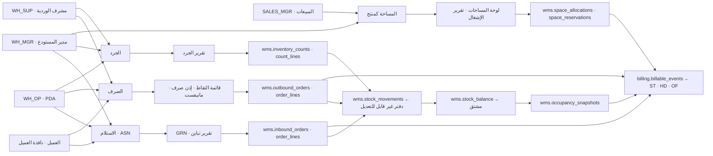

**شرح الخريطة:**
1. مدخلان بشريان للعمل: **العميل من نافذته** ينشئ أمر إدخال أو أمر صرف، و**`WH_OP` من الـPDA** ينفّذ ميدانياً.
2. الاعتماد بيد **`WH_MGR`** لأوامر الإدخال والصرف ولتسوية الجرد؛ والإقفال بيد **`WH_SUP`**.
3. كل الأوامر مهما اختلف نوعها تنتهي إلى **دفتر واحد** `wms.stock_movements` — لا يُعدَّل ولا يُحذف منه صف، والتصحيح بحركة تسوية مقابلة فقط (تعليق القاعدة على الجدول).
4. `wms.stock_balance` **مشتق من الدفتر** لا مصدر مستقل — وحارس `G1` يثبت تطابقهما.
5. **لقطة الإشغال اليومية 00:30** هي الجسر الوحيد بين المخزون والفوترة الشهرية للتخزين.
6. الجداول التعاقدية للمساحة (`space_allocations` · `space_reservations`) **لا تلمس المخزون إطلاقاً** — هي التزام تجاري، وتُقارَن باللقطة لكشف التجاوز والخامل.
7. ثلاثة مسارات تولّد أحداث فوترة: الاستلام `HD-*` · التدقيق `OF-*` · اللقطة اليومية `ST-*`.

#### خريطة 2-2: بنية WH1 — المستودع ← المناطق ← الكتل ← المواقع
تقرأ من المستودع الواحد إلى الأرقام الحاكمة لكل مستوى.

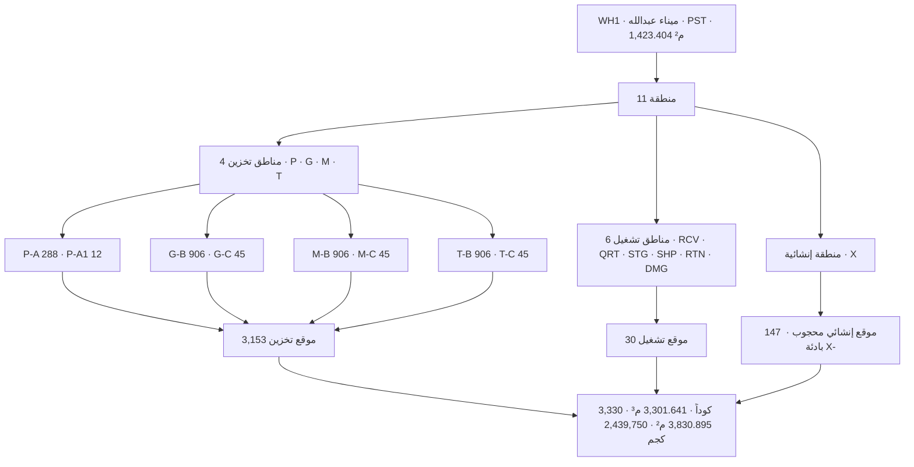

### 2-1 الأرقام الحاكمة — المصدر الوحيد 19 §3-4

| البند | العدد | المصدر |
|---|---|---|
| **مواقع تخزين قابلة للبيع** | **3,153** | 19 §3-4-2 · 40 §C3 |
| مناطق تشغيل أرضية | **30** | RCV 6 · QRT 4 · STG 8 · SHP 6 · RTN 4 · DMG 2 |
| مواقع إنشائية محجوبة | **147** | B1 9×3=27 · C1 27×3=81 · E 13×3=39 · بادئة `X-` |
| **إجمالي أكواد النظام واللافتات** | **3,330** | 19 §3-4-2 · §3-4-3 |
| الحيّز القابل للتخزين | **3,301.641 م³** | أساس ST-03 — يُنص عليه في كل عقد |
| سطح التخزين الأفقي | **3,830.895 م²** | مضاعف كثافة 2.69× |
| الحمل الإجمالي المصمَّم | **2,439,750 كجم = 2,439.75 طن** | ≈ 1,714 كجم/م² |
| المناطق · الكتل | **11 · 8** | 19 §10 بند 3 · 38 §2.1 |

**تحقق حيّ (21/09/2026):** `select * from wms.verify_wh1();` أعادت **21 صفاً كلها `passed = true`** على قاعدة `pgeos` — 3,153 و300 منصة و2,853 رفاً و30 و147 و3,330 والحيّز والسطح والحمل وحدود الوزن وطول الكود السباعي والصيغة والكتل الثماني والمناطق الإحدى عشرة.

### 2-2 صيغة كود الموقع — سبع خانات، مثال واحد

```
  P 3 - 1 4 - 5
  │ │   │ │   │
  │ │   │ │   └── المستوى داخل الطابق — خانة واحدة
  │ │   └─┴────── رقم الموقع على طول الممر — خانتان 01–99 بصفر مُقدَّم
  │ └──────────── رقم الممر — خانة واحدة 1–9 حصراً
  └────────────── القسم / الطابق — حرف واحد: P · G · M · T
```

`code := section || aisle_no || '-' || lpad(position_no::text, 2, '0') || '-' || level_no`

| المكوّن | المدى | القاعدة |
|---|---|---|
| `section` | `P` · `G` · `M` · `T` فقط | `left(zone.code,1)` · الحروف الملتبسة `O · I · L · S` مستبعدة نهائياً |
| `aisle_no` | **1–9 حصراً** | ممر من خانتين يكسر الصيغة — المولّد يرفعه استثناءً قبل كتابة صف واحد |
| `position_no` | **01–99** | `lpad(...,2,'0')` دائماً خانتان |
| `level_no` | `P`: **1–6** · `G/M/T`: **1–3** | المستوى 1 عند القدم |
| `global_level` | 1–9 | **مشتق ولا يظهر في الكود**: `P`→`lvl` · `G`→`lvl` · `M`→`lvl+3` · `T`→`lvl+6` |

**أمثلة معتمدة:** `P3-14-5` · `G1-08-2` · `M4-22-1` · `T2-31-3` — كلها **سبع خانات**. الإنشائي بادئة **`X-`** بصيغة `X-<blk><bay 2d>-<tier>` مثل `X-B101-1`.
**اتجاه الترقيم (قرار مُغلق — EXEC §1.2):** الموضع 01 عند طرف الباب · الممر 1 في جهة المنصات · **اتجاه واحد لكل الممرات**.
**مفروض في القاعدة:** `chk_locations_code_format` → `code ~ '^[PGMT][1-9]-[0-9]{2}-[1-9]$'` لكل موقع `pallet` أو `shelf`؛ و`chk_locations_structural_prefix` → `code like 'X-%'` لكل `structural`.

### 2-3 الكتل الثماني — وحدة البيع والتخصيص

| الكتلة | النوع الإنشائي | المنطقة | المواقع | م² | م³ |
|---|---|---|---|---|---|
| `P-A` | A · 1450×2700×900 مم | P | **288** | 349.920 | 507.384 |
| `P-A1` | A1 · 1450×1350×900 | P | **12** | 14.580 | 21.141 |
| `G-B` | B · 800×2700×900 | G | **906** | 1,100.790 | 880.632 |
| `G-C` | C · 800×1350×900 | G | **45** | 54.675 | 43.740 |
| `M-B` | B | M | **906** | 1,100.790 | 880.632 |
| `M-C` | C | M | **45** | 54.675 | 43.740 |
| `T-B` | B | T | **906** | 1,100.790 | 880.632 |
| `T-C` | C | T | **45** | 54.675 | 43.740 |
| **الإجمالي** | | | **3,153** | **3,830.895** | **3,301.641** |

**لماذا ثماني كتل لا أربع:** الفصل بالطابق (`G-B` · `M-B` · `T-B`) ليس تسمية — **الكتلة وحدة البيع**، وتخصيص عميل لطابق كامل هو وحدة البيع الطبيعية؛ دمجها يُفقد هذه الوحدة (19 §3-2 · v4 — OPS-06).

### 2-4 الحدود التشغيلية لكل موقع — حاجز صلب لا تنبيه

| القسم | حجم الموقع | **الحد الأقصى للوزن** | الكثافة |
|---|---|---|---|
| **P** منصات | 1.76175 م³ | **1,000 كجم** | 823.0 كجم/م² |
| **G · M · T** رفوف | 0.97200 م³ | **750 كجم** | 617.3 كجم/م² |

`wms.check_location_limits(p_location, p_weight, p_volume)` ترفع استثناءً عند: الموقع محجوب · الوزن > `max_weight_kg` · الحجم > `max_volume_cbm`. **الإدخال يُرفض، لا يُحذَّر** (19 §3-3 · 40 §C3 INV-C3-4).

---

## 3. البيانات الرئيسية (Master Data)

| العنصر | الجدول | المالك (المنصب) | بوابة الجودة / الاكتمال | من يعدّل |
|---|---|---|---|---|
| المستودع | `wms.warehouses` | `WH_MGR` | `code` فريد · `entity_id` = PST · `total_sqm` = 1,423.404 | `platform.reference.manage` |
| المنطقة | `wms.zones` | `WH_MGR` | `(warehouse_id, code)` فريد · **11 منطقة بالضبط** — يفحصها `verify_wh1()` | `platform.reference.manage` |
| كتلة المساحة | `wms.space_blocks` | `WH_MGR` + `CFO` للتكلفة | `(entity_id, warehouse_id, code)` فريد · `status ∈ {active, inactive}` · `uom ∈ {pallet, sqm, cbm, position}` · **8 كتل** | `WH_MGR` |
| الموقع | `wms.locations` | `WH_MGR` | الكود سباعي مطابق للصيغة · `max_weight_kg` ≠ 0 لكل موقع تخزين · لا كود مكرر · الإنشائي محجوب دائماً | `WH_MGR` — **ولا تُلصق لافتة قبل توليد كودها** |
| **الصنف SKU** | `wms.skus` | العميل + `WH_MGR` | `(client_id, code)` فريد · **الصنف ملك عميل واحد** (INV-C3-3) · `status ∈ {active, on_hold, discontinued}` · أبعاد ووزن وحجم · هرم التعبئة · شروط الحرارة · `track_batch/serial/expiry` · `picking_policy` · الحد الأدنى للصلاحية عند الاستلام والصرف | طلب تسجيل صنف — **الصنف غير المسجَّل يذهب للحجر ولا يدخل المخزون قبل اكتماله** |
| العميل | `sales.accounts` | `SALES_MGR` | عقد ساري · بلا حجز ائتماني — شرطا 1 و2 من العشرة | المبيعات |
| التخصيص التعاقدي | `wms.space_allocations` | `CFO` يعتمد | `contract_id` إلزامي · `qty > 0` · `valid_from` · `min_charge_applies` · `status ∈ {active, expiring, expired, terminated}` | `CFO` |
| الحجز | `wms.space_reservations` | `SALES_MGR` يطلب · `CFO` فوق 30 يوماً | **`expires_at` إلزامي و`expires_at > reserved_from`** · `status ∈ {active, converted, expired, cancelled}` | `SALES_MGR` |
| التعطيل | `wms.space_blocks_out_of_service` | `WH_MGR` | `reason` إلزامي · صف دائم `operational_buffer` بنسبة **7%** لكل كتلة نشطة | `WH_MGR` |
| الحدود الرقمية | `platform.thresholds` | GM | `space.buffer_pct = 7` · `space.reservation_max_days = 30` | **GM بلا نشر** |
| أساس فوترة الحجم | `platform.settings` | GM | `storage_cbm_basis = "envelope"` · `pallet_max_weight_kg = 1000` · `shelf_max_weight_kg = 750` | GM |
| **رؤية العميل لمواقعه التفصيلية** | `platform.settings` | GM | **✅ SCH-4:** المفتاح `wms.client_sees_detailed_locations = false` مبذور (EXEC §1.1 · 17 §9). **↷ يبقى:** الحبيبة «لكل عميل» — الجدول يحمل `entity_id` ولا يحمل `client_id` | GM |

**حقول SKU الحاكمة للعمليات** (من القاعدة): `length_cm/width_cm/height_cm` · `net_weight_kg/gross_weight_kg` · `volume_cbm` · `units_per_pack` · `packs_per_carton` · `cartons_per_layer` · `layers_per_pallet` · `units_per_pallet` **محسوب آلياً** · `temp_min/temp_max` · `stackable` · `max_stack_height` · `is_fragile` · `is_hazmat` · `un_class` · `light_sensitive` · `picking_policy` افتراضياً `FIFO` · `shelf_life_days` · `min_remaining_life_receipt_days` · `min_remaining_life_issue_days` · `quarantine_days` · `min_stock/max_stock/reorder_point` · `abc_class` · `unit_value` · `msds_url`.

---

## 4. العمليات

### 4.1 الاستلام — من ASN إلى مخزَّن ومقفل

**المدخل:** أمر إدخال `wms.inbound_orders` ينشئه العميل من نافذته أو `WH_OP`، مربوط بعميل وعقد ومستودع، بمرجع `asn_ref` وموعد متوقَّع.

| # | من يفعلها | الشاشة | ما الذي يتغيّر في القاعدة | الحدث المنشور |
|---|---|---|---|---|
| 1 | `WH_OP` / العميل | نافذة العميل · شاشة أمر إدخال | `inbound_orders` صف جديد `status='draft'` · `doc_no` من `platform.counters` سلسلة `INB` | `wms.inbound.drafted` |
| 2 | **`WH_MGR`** | صندوق القرارات | `status='approved'` | `wms.inbound.approved` |
| 3 | `WH_OP` | **PDA · استلام** — مسح رقم الأمر | `status='receiving'` · `arrived_at` | `wms.inbound.receiving_started` |
| 4 | `WH_OP` | PDA · مسح باركود الصنف | فحص: **الصنف يخص هذا العميل؟** خلط عميلين مرفوض (INV-C3-3) | — |
| 5 | `WH_OP` | PDA · كمية · دفعة · صلاحية | `order_lines.qty_actual` · `batch_no` · `expiry_date` · **`variance_reason` إلزامي عند الفرق** (`variance_needs_reason`) | `wms.inbound.variance` عند الفرق — **من السطر لا من الأمر** |
| 6 | `WH_OP` | PDA · التقاط صورة | إلزامية عند وجود فرق أو تلف · تُضغط ≤ 200 ك.ب | — |
| 7 | النظام | — | `status='received'` · `received_by` | **`wms.inbound.received` ← يولّد `HD-01…HD-10`** |
| 8 | `WH_OP` | **PDA · تخزين** — مسح المنصة | النظام يقترح الموقع (A2): شروط الصنف · تصنيف ABC · قرب موقع الصرف · السعة المتبقية · تخصيص العميل | — |
| 9 | `WH_OP` | PDA · مسح كود الموقع للتأكيد | `check_location_limits()` · حركة `putaway` في `stock_movements` · `stock_balance` يرتفع · **موقع غير مطابق للاقتراح يتطلب سبباً من قائمة مغلقة** | `wms.inbound.putaway` |
| 10 | **`WH_SUP`** | شاشة الأمر | `status='closed'` · `closed_at` · `closed_by` — **سطر مفتوح واحد يمنع الإقفال مع ذكر عددها** | `wms.inbound.closed` |

**المخرج:** بضاعة في مواقعها · `GRN` بالكميات الفعلية والفروق · تقرير تباين يُرسل للعميل تلقائياً عند الفرق · تحديث كشف مخزون العميل في نافذته · أحداث `HD-*` بحالة `pending`.

#### خريطة 4-1: دورة الاستلام
تقرأ من إنشاء الأمر إلى إقفاله، مع المسارات الاستثنائية الخمسة.

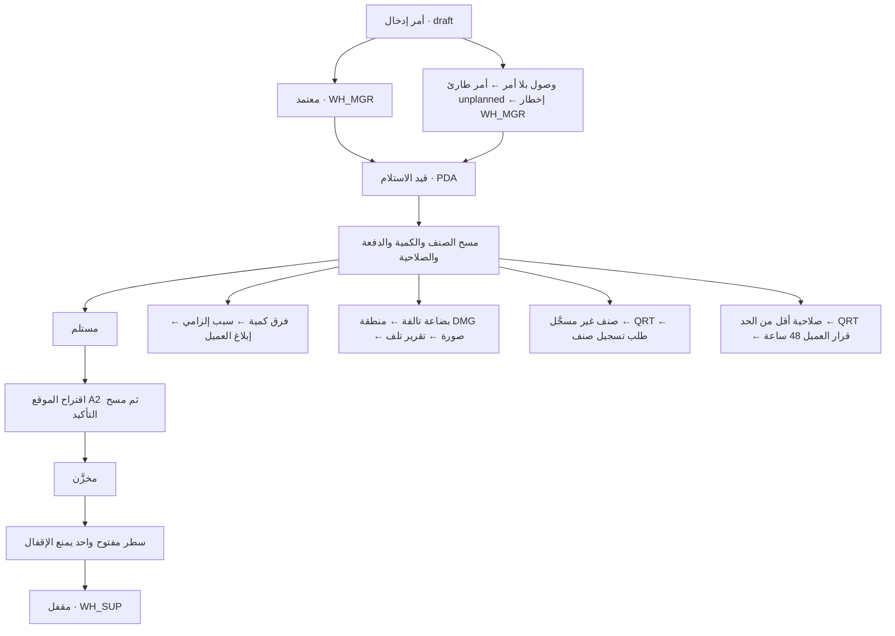

**القواعد المفروضة برمجياً — الاستلام**

| القيد / المشغّل | الحد وقيمته | المصدر |
|---|---|---|
| `chk_inbound_orders_status` | `draft · approved · receiving · received · putaway · closed · cancelled` | 01:742 · STATE-REGISTER §1 |
| `variance_needs_reason` على `order_lines` | `qty_actual ≠ qty_ordered` ⇒ `variance_reason not null` | 40 §C3 INV-C3-5 |
| الصنف ملك عميل واحد | حركة `sku.client_id ≠ order.client_id` **تُرفض** | INV-C3-3 |
| `check_location_limits()` | منصة **1,000 كجم / 1.76175 م³** · رف **750 كجم / 0.97200 م³** · موقع محجوب يُرفض | 19 §3-3 · INV-C3-4 |
| منع الإقفال | أي سطر `order_lines.status ∈ {open, partial}` يمنع `closed` | 03 §2-1 بند 7 · 40 §C3 |
| الحجر عند قصر الصلاحية | `expiry − today < skus.min_remaining_life_receipt_days` ⇒ منطقة `QRT` · **قرار `WH_MGR` · نافذة العميل 48 ساعة** وإلا إرجاع | EXEC §1.2 · 30 §10 بند 5 |
| `no_negative_stock` | `stock_balance.qty_on_hand ≥ 0` | INV-C3-1 |
| `chk_wms_inbound_orders_offline_has_date` | `entered_offline = true` ⇒ `original_occurred_at not null` | 13B |
| الدفتر غير قابل للتعديل | `stock_movements` — «دفتر لا يُعدَّل. التصحيح بحركة تسوية مقابلة فقط» (تعليق القاعدة) | INV-C3-1 |

---

### 4.2 الصرف — من الطلب إلى التسليم للتوصيل

**المدخل:** أمر صرف `wms.outbound_orders` من نافذة العميل أو `WH_OP`، بنوع `order_type` وموعد `required_by` وعنوان تسليم إن كان للتوصيل.

| # | من يفعلها | الشاشة | ما الذي يتغيّر في القاعدة | الحدث المنشور |
|---|---|---|---|---|
| 1 | `WH_OP` / العميل | نافذة العميل | `outbound_orders` صف `status='draft'` · `doc_no` سلسلة `OUT` | `wms.outbound.drafted` |
| 2 | **النظام آلياً** | — | `status='checks_pending'` — **حارس على الانتقال لا مرحلة عمل** · تشغيل الشروط العشرة | `wms.outbound.checks_started` |
| 2ب | النظام | — | فشل الشرط 2 ⇒ `status='credit_rejected'` · `credit_check_passed=false` | `wms.outbound.credit_rejected` |
| 3 | **`WH_MGR`** | صندوق القرارات | `status='approved'` | `wms.outbound.approved` ← **قائمة التقاط** |
| 4 | النظام + `WH_SUP` | شاشة التخصيص | **FEFO** للأصناف ذات الصلاحية · **FIFO** لغيرها · `stock_balance.qty_allocated` يرتفع · `order_lines.location_id` | `wms.outbound.allocated` |
| 4ب | النظام | — | نجاح جزئي ⇒ `status='partially_allocated'` · السطر `order_lines.status='partial'` · **لا يُقفل تلقائياً · ينبّه المشرف** | `wms.outbound.partially_allocated` |
| 5 | **`WH_OP`** | **PDA · التقاط** — بالمسار الأقصر (A3) | `status='picking'` ثم `'picked'` · `picked_by` · حركة `pick` في الدفتر · **نقص ⇒ سبب من قائمة + تنبيه المشرف فوراً** | `wms.outbound.picking_started` · `wms.outbound.picked` |
| 6 | **`WH_OP` آخر** | **PDA · تدقيق** — مسح كل بند | `status='checked'` · `checked_by` — **المدقّق ≠ الملتقط** | **`wms.outbound.checked` ← يولّد `OF-01…OF-11`** ← **إذن صرف / بوليصة تسليم** |
| 7 | `WH_OP` | PDA | `status='packed'` · `packed_by` | `wms.outbound.packed` |
| 8 | `WH_OP` | **PDA · تحميل** — مسح الشحنة ثم المركبة | `status='loaded'` — **يُرفض الإقفال إن نقص شيء** · شحنة لعميل آخر ⇒ رفض فوري | `wms.outbound.loaded` ← **مانيفست الحمولة** |
| 9 | **`WH_SUP`** | شاشة الأمر | `status='dispatched'` · `dispatched_at` · **تُنشأ `tms.delivery_tasks`** بمرجع `outbound_order_id` | `wms.outbound.dispatched` ← إشعار ورابط تتبّع في نافذة العميل |
| 10 | النظام من TMS | — | `status='delivered'` عند `tms.task.delivered` | `wms.outbound.delivered` |

**المخرج:** بضاعة محمَّلة ومسلَّمة للتوصيل · `qty_on_hand` نزل من الدفتر · مهمة توصيل في PDL · أحداث `OF-*` بحالة `pending`.
**عميل 2PL (سيناريو 2 · S2):** `order_type='standard'` **بلا مهمة توصيل** — الدورة تنتهي عند «محمَّل»، والعميل يمسح إذن الصرف عند البوابة وتوقيع مندوبه إثبات التسليم.

#### خريطة 4-2: دورة الصرف
تقرأ من المسودة إلى التسليم، مع مخرجَي الفشل الائتماني والتخصيص الجزئي.

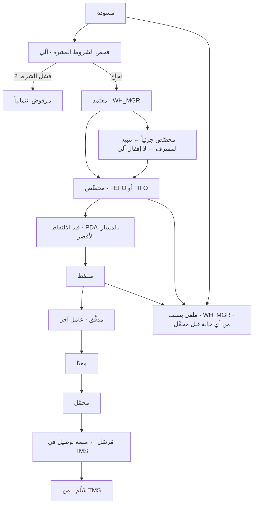

#### 4.2.1 فحص الشروط العشرة قبل الاعتماد

كل شرط يُفحص آلياً؛ الفشل يوقف الأمر **ويذكر السبب المحدد** — ولكل شرط اختبار ورسالة فشل خاصان (40 §C3).

| # | الشرط | الرسالة عند الفشل |
|---|---|---|
| 1 | العقد ساري | «عقد العميل منتهٍ في [تاريخ] — يلزم التجديد» |
| 2 | لا حجز ائتماني | «العميل تحت حجز ائتماني: [السبب]» |
| 3 | الرصيد كافٍ | «المتاح [كمية] فقط من المطلوب [كمية] في [موقع]» |
| 4 | الصنف يخص العميل | «الصنف [كود] مسجَّل لعميل آخر» |
| 5 | الصلاحية المتبقية كافية | «الدفعة [رقم] صلاحيتها [أيام] أقل من الحد [أيام]» |
| 6 | الصنف غير موقوف | «الصنف موقوف: [السبب]» |
| 7 | الموقع غير محجوب | «الموقع [كود] محجوب: [السبب]» |
| 8 | العنوان مكتمل — إن كان للتوصيل | «عنوان التسليم ناقص: [الحقول]» |
| 9 | سعر الخدمة موجود | «لا سعر لخدمة [كود] في عقد العميل» |
| 10 | الكمية ضمن حد الطلب | «الكمية تتجاوز الحد المتفق [كمية]» |

> **الشرط 2 على مستوى المجموعة:** حجز ائتماني على عميل متعدد الكيانات يرفض أمر صرف PST **ومهمة توصيل PDL وطابور PCC** بالسبب نفسه (S6). و**التخزين يستمر في الفوترة أثناء الحجز** — لقطة الإشغال تولّد `ST-01` ولا يُوقفها الحجز (S8).

**القواعد المفروضة برمجياً — الصرف**

| القيد / المشغّل | الحد وقيمته | المصدر |
|---|---|---|
| `chk_outbound_orders_status` | 14 حالة — `draft · checks_pending · credit_rejected · approved · allocated · partially_allocated · picking · picked · checked · packed · loaded · dispatched · delivered · cancelled` | STATE-REGISTER §1 · 13B |
| `chk_order_lines_status` | `open · partial · complete · cancelled` — **الجزئية تُمثَّل على السطر** (OPS-18) | 01:791 |
| **المدقّق ≠ الملتقط** | `checked_by ≠ picked_by` — **مفروض دائماً**؛ التجاوز **بيد `WH_SUP` بسبب مسجَّل يظهر في تقرير شهري** | INV-C3-6 · **EXEC §1.2 FIXED** |
| سياسة التخصيص | **FEFO** افتراضياً لذوات الصلاحية · **FIFO** لغيرها · **LIFO باستثناء معتمد** | 03 §3-2 · `skus.picking_policy` |
| الحجز عند التخصيص | `qty_allocated` يرتفع — الكمية محجوزة ولا تُصرف لأمر آخر · `qty_available` عمود محسوب = `qty_on_hand − qty_allocated` | 01 |
| تسلسل الالتقاط | **المسار الأقصر في المستودع** لا ترتيب السطور | 03 §3-2 · 29 §5-1 A3 |
| الإلغاء | من أي حالة **قبل `loaded`** · بسبب · بيد `WH_MGR` | 03 §0-5 |
| قفل وردية | **لا تُقفل وردية بطابور PDA > 0** | 30 §5 · 40 §D4 |
| `chk_wms_outbound_orders_offline_has_date` | `entered_offline = true` ⇒ `original_occurred_at not null` | 13B |
| عزل العميل | RLS `client_portal_scope` — العميل يرى أوامره فقط · `internal_only` على `order_lines` و`stock_balance` | 01/13B |

---

### 4.3 الجرد — دوري · موضعي · كامل

**المدخل:** أمر جرد `wms.inventory_counts` بنوع `count_type` ومستودع وعميل اختياري، `doc_no` من سلسلة `CNT`.

| # | من يفعلها | الشاشة | ما الذي يتغيّر في القاعدة | الحدث المنشور |
|---|---|---|---|---|
| 1 | `WH_SUP` | شاشة الجرد | `status='draft'` · توليد `inventory_count_lines` بـ`qty_system` **المخفي عن العدّاد** | `wms.count.drafted` |
| 2 | `WH_OP` | **PDA · جرد** — مسح الموقع | `status='in_progress'` · `started_at` · **الموقع قيد العدّ محجوب عن الصرف** | `wms.count.started` |
| 3 | `WH_OP` | PDA · إدخال الكمية | `qty_counted` · `variance` **عمود محسوب** = `qty_counted − qty_system` · **عدّ أعمى — الرصيد النظامي لا يظهر** | — |
| 4 | `WH_SUP` | شاشة مراجعة الفروق | `status='review'` | `wms.count.under_review` |
| 5 | `WH_OP` **عدّاد آخر** | PDA | `status='recount'` · `recount_qty` — **إعادة العدّ إلزامية لأي فرق** · انتقال دائري على `review` | `wms.count.recount_ordered` |
| 6 | **`WH_MGR` يعتمد** | صندوق القرارات | `status='adjusted'` · `approved_by` · حركة **`adjust`** في `stock_movements` بسبب إلزامي · `adjusted_movement_id` على السطر — **لا تعديل رصيد مباشر** | `wms.count.adjusted` |
| 7 | `WH_SUP` | شاشة الجرد | `status='closed'` · `finished_at` | `wms.count.closed` ← **تقرير الجرد** |

**المخرج:** رصيد مطابق للواقع · حركات تسوية موثّقة بأسبابها · تقرير الجرد · **فرق بلا تفسير بعد إعادة العدّ ⇒ تصعيد إلى `WH_MGR`** (لا حالة جديدة) ويُطلق **`N-13`** فوراً عند الإقفال.

#### خريطة 4-3: دورة الجرد
تقرأ من المسودة إلى الإقفال، مع الانتقال الدائري الإلزامي لإعادة العدّ.

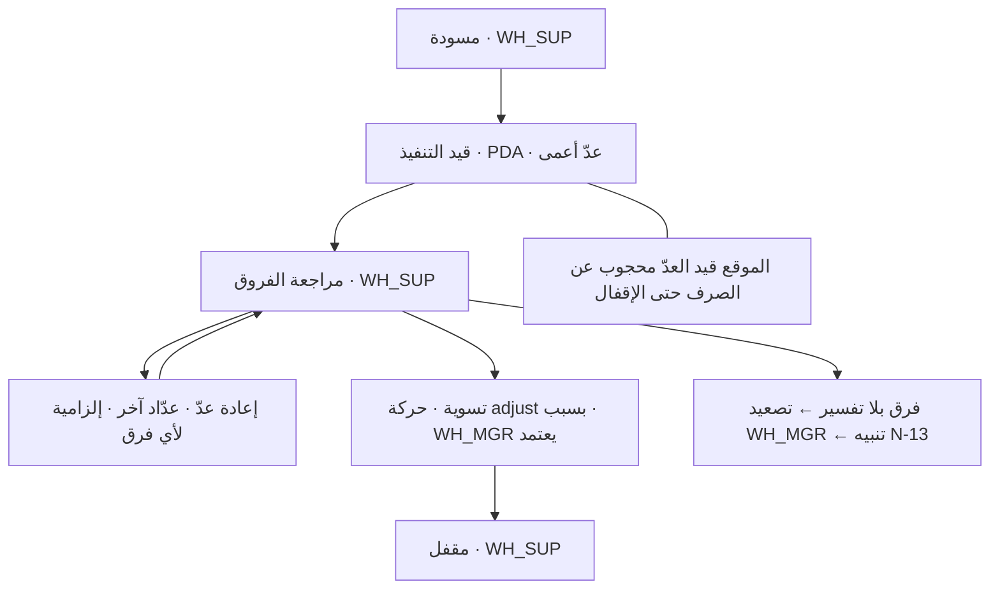

**القواعد المفروضة برمجياً — الجرد**

| القيد / المشغّل | الحد وقيمته | المصدر |
|---|---|---|
| `chk_inventory_counts_status` | `draft · in_progress · review · recount · adjusted · closed` | STATE-REGISTER §1 · 13B |
| **العدّ الأعمى** | العدّاد **لا يرى `qty_system`** — يمنع التحيّز | INV-C3-7 · 30 §3-6 |
| **إعادة العدّ** | **إلزامية لأي فرق قبل التسوية** | INV-C3-7 · 03 §4 |
| التسوية | حركة `adjust` بسبب إلزامي + **اعتماد `WH_MGR`** — **لا تعديل رصيد مباشر** | INV-C3-7 |
| تجميد الحركة | الموقع قيد العدّ **محجوب عن الصرف** حتى الإقفال | 03 §4 |
| أنواع الجرد | **كامل سنوي** · **دوري Cycle** حسب ABC: **A شهري · B ربعي · C سنوي** · **موضعي** | 03 §4 · 29 §5-1 |
| التسوية تبقى بشرية | **A1 — لا تُؤتمت**: مسؤولية مالية | 29 §5-1 |
| `variance` | عمود **محسوب** `generated always` — لا يُكتب يدوياً | 01 |
| حارس `G1` | `select count(*) from wms.verify_balance_integrity();` = **0** — وإلا يتوقف النشر | 40 Part F |

---

### 4.4 المساحة كمنتج — الحجز · التخصيص · التجاوز · التعطيل

**المدخل:** فرصة بيع تخزين بكمية ووحدة وتاريخ بدء.

**المفاهيم الخمسة الحاكمة (17 §2):**
```
الطاقة الإجمالية
  ├── معطّل        صيانة · تلف · ممر · احتياطي تشغيلي 7%
  ├── متعاقد عليه   ملتزَم به في عقد ساري — سواء استُخدم أو لا
  │     ├── مشغول فعلاً      فيه بضاعة الآن
  │     └── متعاقد وغير مشغول  ← يُفوتر ولا يُستخدم
  ├── محجوز        عرض سعر قائم · عميل قادم · موسم متوقَّع
  └── متاح للبيع   = الطاقة − معطّل − متعاقد − محجوز
```

**المتاح للبيع هو الرقم الوحيد الذي يبني عليه البيع قراره** — لا «الطاقة − المشغول».

| # | من يفعلها | الشاشة | ما الذي يتغيّر في القاعدة | الحدث |
|---|---|---|---|---|
| 1 | `SALES_MGR` | `/wms/space` لوحة المساحات | `wms.space_availability(block, from, to)` تُعيد `capacity · out_of_service · contracted · reserved · sellable · occupied_now · idle_contracted` | — |
| 2 | `SALES_MGR` يطلب | `/wms/space/reservations` | `space_reservations` صف `status='active'` · **`expires_at` إلزامي** · `reason ∈ {quote_pending, incoming_client, seasonal_peak, internal}` · `quote_id`/`opportunity_id` | — |
| 3 | النظام | — | **`check_space_available()`** ترفع استثناءً إن `sellable < qty` — «لا بيع لمساحة غير موجودة» | — |
| 4 | `CFO` يعتمد | شاشة العقد | تحويل الحجز إلى `space_allocations` · الحجز `status='converted'` · `converted_allocation_id` | — |
| 5 | النظام 00:30 | وظيفة مجدولة | `occupancy_snapshots` صف لكل **تاريخ × كيان × عميل × مستودع × كتلة** | `wms.occupancy.snapshot` ← **ST-01…ST-14** |
| 6 | النظام | — | `occupied > contracted` ⇒ **`ST-12` على الزائد · فوترة آلية + تنبيه `N-11` · بلا اعتماد** | — |
| 7 | النظام | — | `space_reservations` نشط وغير مستخدم ⇒ **`ST-14`** — **المصدر جدول الحجوزات لا لقطة الإشغال** | — |
| 8 | `WH_MGR` | شاشة الكتلة | `space_blocks_out_of_service` بكمية ومدة وسبب ⇒ **يُخصم فوراً من المتاح للبيع** · تخصيص قائم ⇒ **نقل إلزامي للبضاعة + إشعار العميل** | — |

**المخرج:** التزام تعاقدي مضبوط · لا بيع لنفس الرف مرتين · تجاوز مكشوف ومفوتَر · مساحة معطّلة خارج البيع تلقائياً وتعود عند انتهاء المدة.

#### خريطة 4-4: من الفرصة إلى التخصيص والتجاوز
تقرأ من الفرصة التجارية إلى الفوترة، مع مسار التجاوز المنفصل.

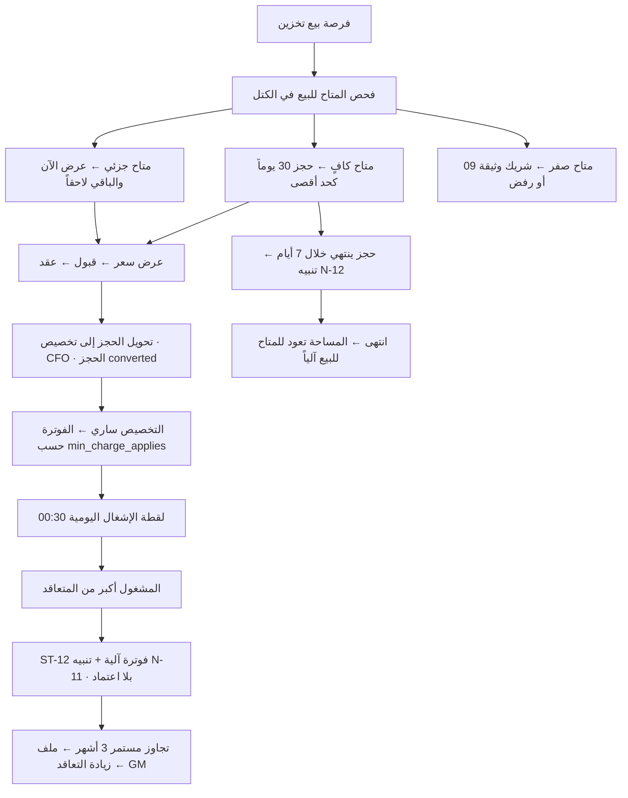

**القواعد المفروضة برمجياً — المساحة**

| القيد / المشغّل | الحد وقيمته | المصدر |
|---|---|---|
| **`wms.check_space_available()`** | يرفض تخصيصاً أو حجزاً يتجاوز `sellable` = الطاقة − معطّل − متعاقد − محجوز | **INV-C3-8** · 17 §4-1 |
| **الحد الأقصى لمدة الحجز** | **30 يوماً** بلا عقد؛ ما زاد **يتطلب `CFO`** · `platform.thresholds.space.reservation_max_days = 30` | **EXEC §1.1** |
| `reservation_has_expiry` | `expires_at > reserved_from` — **لا حجز بلا تاريخ انتهاء** | 01/13B · 17 §6-2 |
| **العازل التشغيلي** | **7%** من طاقة كل كتلة نشطة — صف **دائم** في `space_blocks_out_of_service` بـ`reason='operational_buffer'` · `platform.thresholds.space.buffer_pct = 7` | **EXEC §1.1** · 17 §5-1 · 019 §9 |
| **التجاوز `ST-12`** | **فوترة آلية + تنبيه · لا يتطلب اعتماداً** | **EXEC §1.1** |
| **المحجوز غير المستخدم `ST-14`** | **يُفوتر — بند إلزامي في كل عقد تخزين** · المصدر `wms.space_reservations` | **EXEC §1.1 FIXED** · 17 §7 |
| `positive_qty` | `space_allocations.qty > 0` | 01/13B |
| `chk_space_allocations_status` | `active · expiring · expired · terminated` | 17 §3 · STATE-REGISTER §3 |
| `chk_space_reservations_status` | `active · converted · expired · cancelled` | 17 §3 |
| `chk_space_blocks_status` · `chk_space_blocks_uom` | `active · inactive` · `pallet · sqm · cbm · position` | 13B · STATE-REGISTER §3 |
| حبيبة اللقطة | صف لكل **(تاريخ × كيان × عميل × مستودع × كتلة)** — وإلا يتضخم الإشغال بعدد مواقع الكتلة ويُطلق `ST-12` دائماً | **17 §3 v4 · OPS-59** |
| هامش المساحة | **15% تحذير · < 10% يتطلب `GM`** · `min_price = standard_cost × 1.15` | EXEC §1.1 |
| العميل لا يرى المواقع التفصيلية | **الافتراض الأمني «لا»** — إعداد لكل عميل | EXEC §1.1 |

**تحقق حيّ (21/09/2026):** `select * from wms.space_dashboard;` أعادت **8 كتل** بعازل 7% مطبَّقاً فعلاً — `P-A` سعة 288 وعازل **20.160** ومتاح للبيع **267.840** · `G-B` سعة 906 وعازل **63.420** ومتاح **842.580** · وهكذا. `contracted = reserved = occupied = 0` لأن القاعدة بلا عقود بعد.

---

### 4.5 التحويل والمرتجع — عمليتان من الـPDA

| العملية | الخطوات | ما يُكتب |
|---|---|---|
| **التحويل** | مسح من موقع → الصنف → الكمية → إلى موقع · **تأكيد السعة آلياً** | حركة `transfer` بـ`from_location_id` و`to_location_id` · خدمة **`HD-11`** إن كان بطلب العميل |
| **المرتجع** | مسح الشحنة → سبب الإرجاع من قائمة مغلقة → الحالة صالح / تالف → **📷 صورة** → الوجهة: مخزون / تالف / فحص | حركة `return` أو `damage` · خدمة **`HD-10`** استلام مرتجعات · و**`VA-06`** عند طلب الفرز |

`stock_movements.movement_type` قائمة مغلقة بقيد `chk_stock_movements_type`: `receipt · putaway · pick · pack · ship · issue · transfer · adjust · count · damage · return · scrap` (اتحاد قائمة 01 وقيمتي دورة الصرف `pack`/`ship` — v4).

---

## 5. آلات الحالات

### 5-1 أمر الإدخال — `wms.inbound_orders.status`

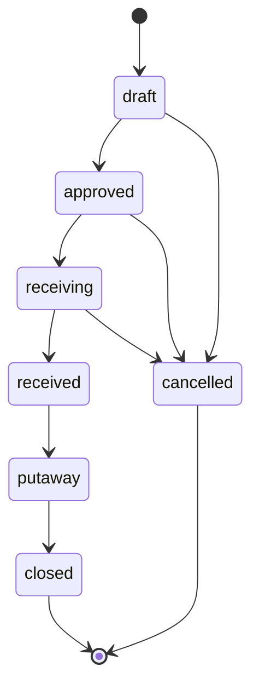

| الحالة | من ينقلها | الحدث | الشاشة |
|---|---|---|---|
| `draft` | `WH_OP` / العميل | `wms.inbound.drafted` | نافذة العميل · شاشة أمر إدخال |
| `approved` | **`WH_MGR`** | `wms.inbound.approved` | صندوق القرارات |
| `receiving` | `WH_OP` | `wms.inbound.receiving_started` | PDA · استلام |
| `received` | `WH_OP` | **`wms.inbound.received`** ← `HD-01…HD-10` + GRN | PDA · استلام |
| `putaway` | `WH_OP` | `wms.inbound.putaway` | PDA · تخزين |
| `closed` | **`WH_SUP`** | `wms.inbound.closed` — **سطر مفتوح واحد يمنعه** | شاشة الأمر |
| `cancelled` | `WH_MGR` بسبب | `wms.inbound.cancelled` — **من أي حالة قبل `received`** | شاشة الأمر |

### 5-2 أمر الصرف — `wms.outbound_orders.status`

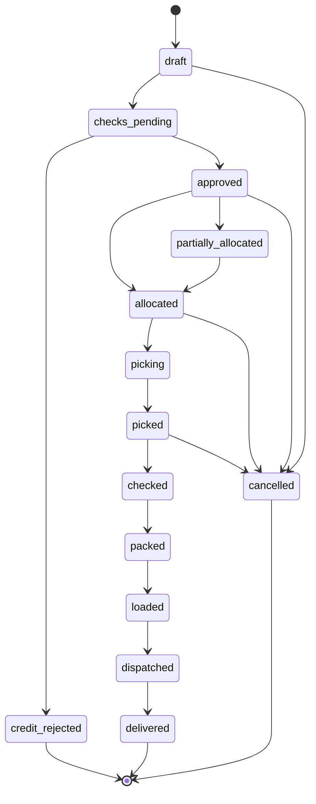

| الحالة | من ينقلها | الحدث | الشاشة |
|---|---|---|---|
| `draft` | `WH_OP` / العميل | `wms.outbound.drafted` | نافذة العميل |
| `checks_pending` | **النظام آلياً** | `wms.outbound.checks_started` | — · حارس لا مرحلة عمل |
| `credit_rejected` | النظام | `wms.outbound.credit_rejected` | صندوق قرارات `CFO` |
| `approved` | **`WH_MGR`** | `wms.outbound.approved` ← قائمة التقاط | صندوق القرارات |
| `allocated` | النظام + `WH_SUP` | `wms.outbound.allocated` | شاشة التخصيص |
| `partially_allocated` | النظام | `wms.outbound.partially_allocated` — **لا إقفال آلي · ينبّه المشرف** | شاشة التخصيص |
| `picking` | **`WH_OP`** | `wms.outbound.picking_started` | PDA · التقاط |
| `picked` | `WH_OP` | `wms.outbound.picked` | PDA · التقاط |
| `checked` | **`WH_OP` آخر** — التجاوز بيد `WH_SUP` بسبب | **`wms.outbound.checked`** ← `OF-01…OF-11` + إذن صرف | PDA · تدقيق |
| `packed` | `WH_OP` | `wms.outbound.packed` | PDA |
| `loaded` | `WH_OP` | `wms.outbound.loaded` ← مانيفست الحمولة | PDA · تحميل |
| `dispatched` | **`WH_SUP`** | `wms.outbound.dispatched` ← مهمة TMS | شاشة الأمر |
| `delivered` | النظام من TMS | `wms.outbound.delivered` | — |
| `cancelled` | `WH_MGR` بسبب | `wms.outbound.cancelled` — **من أي حالة قبل `loaded`** | شاشة الأمر |

### 5-3 سطر الأمر — `wms.order_lines.status`

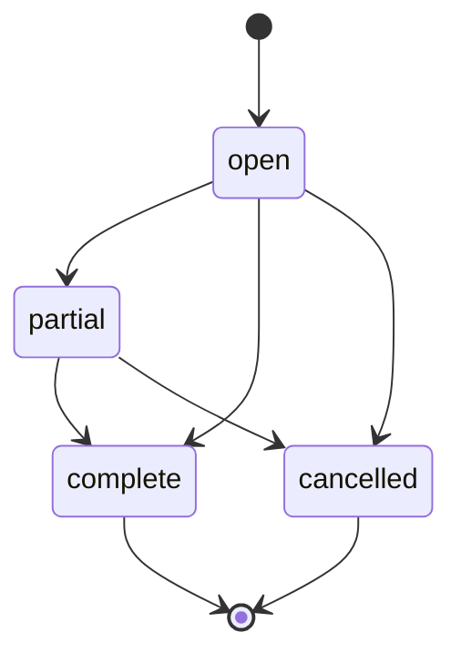

| الحالة | من ينقلها | الحدث | الشاشة |
|---|---|---|---|
| `open` | النظام عند إنشاء الأمر | — | — |
| `partial` | `WH_OP` بالتنفيذ الجزئي | `wms.inbound.variance` عند فرق الاستلام | PDA |
| `complete` | `WH_OP` باكتمال الكمية | — | PDA |
| `cancelled` | `WH_MGR` بسبب | — | شاشة الأمر |

> **الجزئية تُمثَّل على السطر** (`partial`)؛ و`partially_allocated` على الأمر **مؤشر تجميعي لها** لا حالة موازية (v4 — OPS-18).

### 5-4 الجرد — `wms.inventory_counts.status`

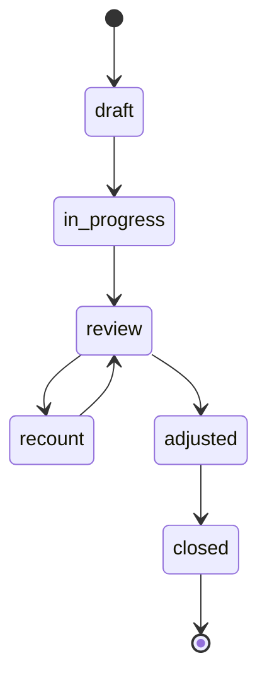

| الحالة | من ينقلها | الحدث | الشاشة |
|---|---|---|---|
| `draft` | `WH_SUP` | `wms.count.drafted` | شاشة الجرد |
| `in_progress` | `WH_OP` | `wms.count.started` — **عدّ أعمى** | PDA · جرد |
| `review` | `WH_SUP` | `wms.count.under_review` | شاشة مراجعة الفروق |
| `recount` | `WH_OP` **عدّاد آخر** | `wms.count.recount_ordered` — **إلزامية لأي فرق** | PDA · جرد |
| `adjusted` | **`WH_MGR` يعتمد** | `wms.count.adjusted` — حركة `adjust` بسبب | صندوق القرارات |
| `closed` | `WH_SUP` | `wms.count.closed` ← تقرير الجرد | شاشة الجرد |

### 5-5 حجز المساحة — `wms.space_reservations.status`

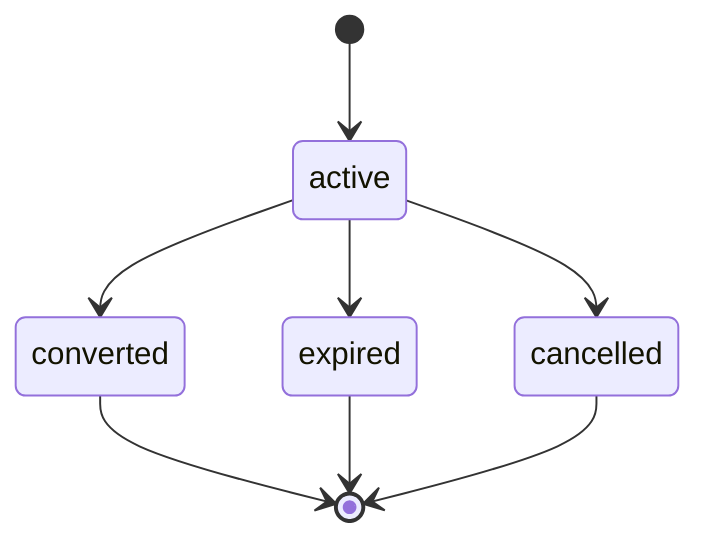

| الحالة | من ينقلها | الحدث | الشاشة |
|---|---|---|---|
| `active` | `SALES_MGR` يطلب · `CFO` فوق 30 يوماً | — · تنبيه `N-12` قبل 7 أيام من الانتهاء | `/wms/space/reservations` |
| `converted` | `CFO` عند توقيع العقد | — · `converted_allocation_id` يُملأ | شاشة العقد |
| `expired` | **النظام آلياً عند `expires_at`** | — · **المساحة تعود للمتاح للبيع** | — |
| `cancelled` | `SALES_MGR` بسبب | — | `/wms/space/reservations` |

### 5-6 التخصيص التعاقدي — `wms.space_allocations.status`

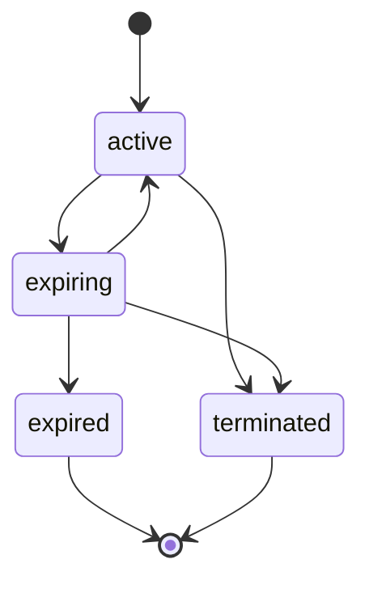

| الحالة | من ينقلها | الحدث | الشاشة |
|---|---|---|---|
| `active` | `CFO` يعتمد | — · الفوترة تبدأ حسب `min_charge_applies` | شاشة العقد |
| `expiring` | النظام — تخصيص ينتهي خلال **90 يوماً** | — · يظهر في لوحة المساحات قسم «العقود» | `/wms/space` |
| `expired` | النظام عند `valid_to` | — · المساحة تعود للمتاح للبيع | — |
| `terminated` | `CFO` / `GM` بسبب | — | شاشة العقد |

### 5-7 حالات أخرى في النطاق

| العمود | القائمة المعتمدة | المصدر |
|---|---|---|
| `wms.skus.status` | `active · on_hold · discontinued` | STATE-REGISTER §3 — **v4 استنباط** · 40 §C3 «SKU not on hold» |
| `wms.space_blocks.status` | `active · inactive` | STATE-REGISTER §3 — **v4 استنباط** |
| `wms.locations.is_blocked` | ليست حالة — **علم** مع `block_reason` إلزامي عملياً | 01 · 40 §C3 |

---

## 6. المستندات والنماذج

### 6-1 السلاسل — من `platform.counters`

| `doc_type` | البادئة (PST) | الجدول | التوليد |
|---|---|---|---|
| `INB` | `PST-IN-#####` | `wms.inbound_orders.doc_no` | عدّاد لكل كيان · `padding = 5` · فريد `(entity_id, doc_no)` |
| `OUT` | `PST-OUT-#####` | `wms.outbound_orders.doc_no` | كما أعلاه |
| `CNT` | `PST-CNT-#####` | `wms.inventory_counts.doc_no` | كما أعلاه |

> السلسلة **لكل كيان على حدة** — PGH و PCC و PST و PDL لكل منها عدّادها. حارس `G13` يثبت أن 100 طلب متزامن يعطي 100 رقماً فريداً.

### 6-2 الوثائق المولَّدة

| الانتقال | الوثيقة | ما يُطبع / يُرسل |
|---|---|---|
| ← `received` | **إشعار استلام بضاعة (GRN)** بالكميات الفعلية والفروق | يُولَّد ويُرسل للعميل تلقائياً |
| فرق أو تلف | **تقرير تباين** | يُرسل للعميل تلقائياً |
| ← `closed` (إدخال) | تحديث **كشف مخزون العميل** في نافذته | نافذة العميل |
| ← `approved` (صرف) | **قائمة التقاط (Pick List)** بالتسلسل الأمثل | تُعرض على الـPDA — لا تُطبع عادة |
| ← `checked` | **إذن صرف / بوليصة تسليم** برقمها | يُطبع · يوقّعه مندوب العميل في حالة 2PL |
| ← `loaded` | **مانيفست الحمولة** للسائق | يُطبع / يُدفع لتطبيق السائق |
| ← `dispatched` | إشعار في نافذة العميل + **رابط تتبّع** | نافذة العميل |
| ← `closed` (جرد) | **تقرير الجرد** | `WH_MGR` + `CFO` |
| يومياً | **لوحة المساحات** · تقرير الإشغال والتجاوزات (R-08) | `WH_MGR` + `SALES_MGR` |

### 6-3 اللافتات — 3,330 لافتة

| النوع | العدد | المواصفة |
|---|---|---|
| لافتات مواقع تخزين | **3,153** | 100×60 مم · الكود **60 مم** يُقرأ من 6 أمتار · Code128 ارتفاع 15 مم · **حد الوزن مطبوع إلزامياً** · شريط لون القسم 15 مم |
| لافتات مناطق تشغيلية | **30** | — |
| **لافتات إنشائية** | **147** | **خلفية سوداء ونص أبيض** · «ممنوع التخزين / NO STORAGE» |
| **الإجمالي** | **3,330** | + لافتات الممرات العلوية بارتفاع حرف **200 مم** بلون القسم |

**ألوان الأقسام:** 🔵 `P` أزرق · 🟢 `G` أخضر · 🟠 `M` برتقالي · 🔴 `T` أحمر — **اللون يعمل حيث تفشل الحروف**.
**بطاقة تدريب العامل** A5 في كل ممر **بخمس لغات: عربي · إنجليزي · هندي · أردو · بنغالي**.
**قاعدة إلزامية:** **لا تُلصق لافتة قبل توليد كودها في النظام** (19 §6).

### 6-4 التوقيعات

| الوثيقة | التوقيع |
|---|---|
| GRN | `received_by` — معرّف `WH_OP` المنفِّذ + **توقيع جهاز الـPDA** + توقيت العملية |
| إذن الصرف (2PL) | توقيع مندوب العميل الورقي عند البوابة + مسحه لإذن الصرف |
| تسوية الجرد | `approved_by` = `WH_MGR` — توقيع نظامي في `audit_log` بسبب إلزامي |
| كل عملية PDA | **`user_id` المنفِّذ + توقيع الجهاز + توقيت العملية** — تُقبل إذا كان الرمز صالحاً **وقت التنفيذ** لا وقت المزامنة |

---

## 7. الضوابط والاعتمادات

### 7-1 جدول الحدود

| البند | الحد | المعتمِد | المصدر |
|---|---|---|---|
| حد وزن موقع المنصة | **1,000 كجم** | — حاجز صلب يرفض الإدخال | 19 §3-3 · 40 §C3 |
| حد وزن موقع الرف | **750 كجم** | — حاجز صلب | 19 §3-3 |
| حد حجم موقع المنصة · الرف | **1.76175 م³** · **0.97200 م³** | — حاجز صلب | 19 §3-4-1 |
| اعتماد أمر إدخال | — | **`WH_MGR`** | 40 §C3 · 03 §0-4 |
| إقفال أمر إدخال | سطر مفتوح واحد يمنعه | **`WH_SUP`** | 40 §C3 |
| اعتماد أمر صرف | بعد **الشروط العشرة** | **`WH_MGR`** | 40 §C3 |
| إرسال أمر الصرف | — | **`WH_SUP`** | 03 §0-5 |
| اعتماد تسوية الجرد | حركة `adjust` بسبب إلزامي | **`WH_MGR`** | INV-C3-7 |
| **الحجز بلا عقد** | **≤ 30 يوماً** | `SALES_MGR` يطلب · **ما زاد يتطلب `CFO`** | **EXEC §1.1** |
| الحجز الطويل والتجاوزات | — | **`GM`** | 17 §9 |
| اعتماد التخصيص التعاقدي | — | **`CFO`** | 17 §9 |
| **العازل التشغيلي** | **7%** من الطاقة — مستبعد من البيع | صف دائم لا يحتاج اعتماداً | EXEC §1.1 |
| **التجاوز ST-12** | أي تجاوز | **بلا اعتماد** — فوترة آلية + تنبيه | EXEC §1.1 |
| **ST-14 المحجوز غير المستخدم** | — | **بند إلزامي في كل عقد** — لا اعتماد فردي | EXEC §1.1 FIXED |
| هامش عقد التخزين | **15% تحذير · < 10%** | **`GM`** | EXEC §1.1 |
| قرار الحجر | نافذة العميل **48 ساعة** وإلا إرجاع | **`WH_MGR`** | EXEC §1.2 |
| تجاوز «المدقّق ≠ الملتقط» | بسبب مسجَّل + **تقرير شهري** | **`WH_SUP`** | EXEC §1.2 FIXED |
| موقع تخزين مخالف للاقتراح | سبب من قائمة مغلقة | `WH_OP` — يُسجَّل | 03 §2-1 بند 6 |
| أجهزة PDA | **الموجود + 20% احتياطي** | `GM` عبر دورة المشتريات | EXEC §1.2 |
| شراء الأجهزة | 100–500 مدير القسم · 500–2,000 `CFO` · > 2,000 **`GM`** | حسب الشريحة | EXEC §1.1 |

### 7-2 فصل المهام والأربع عيون

| الزوج / القاعدة | لماذا | الإنفاذ |
|---|---|---|
| **(`WH_OP`, `WH_SUP`)** — زوج SoD رسمي | **المنفّذ لا يدقّق عمل نفسه** | `identity.sod_rules` مبذور في 13B · **مشغِّل على `identity.user_roles` عند الإدراج وعند التعديل** · **الإنابة لا تلتفّ على SoD** · تعطيل أي قاعدة يتطلب `GM` + سبباً |
| **المدقّق ≠ الملتقط** (INV-C3-6) | تدقيق ذاتي = مصدر التلاعب الأول | مفروض في الأمر (`checked_by ≠ picked_by`) · **مفروض دائماً** · التجاوز بيد `WH_SUP` بسبب مسجَّل يظهر في **تقرير شهري** |
| **العدّاد ≠ مُعيد العدّ** | إعادة عدّ بنفس الشخص بلا قيمة | 03 §0-6 «عدّاد آخر» |
| **العادّ ≠ المعتمِد** | التسوية مسؤولية مالية | `counted_by` ≠ `approved_by` = `WH_MGR` |
| **لا اعتماد ذاتي** عام | `requester_id <> approver_id` **قيد حقيقي لا `check (true)`** | EXEC §1.1 |
| الدفتر غير قابل للتعديل | لا محو أثر | `stock_movements` append-only · التصحيح بحركة مقابلة فقط |

### 7-3 ما يتطلب المدير العام

| البند | لماذا يصعد إلى GM |
|---|---|
| عقد تخزين بهامش **< 10%** | EXEC §1.1 |
| **الحجز الطويل والتجاوزات** | 17 §9 |
| **تجاوز مستمر 3 أشهر** على نفس العميل | ملف لزيادة التعاقد — 17 §6-3 |
| **فرق جرد بلا تفسير > 24 ساعة** | تصعيد `N-13` |
| تعطيل أي قاعدة SoD | + سبب مسجَّل — 02 §3-3 |
| قدرة تخزين غير كافية لفرصة قائمة | بند قرار `partner_or_decline` (S9) |
| **الاعتماد الإنشائي للبلاطة** | فجوة مفتوحة — §13 |

### 7-4 الحوارس التقنية

| # | الفحص | شرط النجاح | يوقف النشر؟ |
|---|---|---|---|
| **G1** | `select count(*) from wms.verify_balance_integrity();` — **الرصيد المعاد بناؤه من الدفتر = الرصيد المخزَّن** | **0** | **نعم** |
| `verify_wh1()` | 21 اختباراً لأرقام WH1 والصيغة السباعية | **21 صفاً `passed = true`** | نعم — «أي فشل = خطأ في التوليد أو تعديل غير مصرّح» |
| G6 | كل عمود في `wms` مصنَّف في `identity.column_classification` | 0 | نعم |
| G7 | كل جدول أساسي في `wms` عليه RLS | 0 | نعم |
| G14 | `pnpm test:isolation` — عميل يطلب معرّفات عميل آخر | **0 صفوف بلا خطأ** | نعم |
| G15 | `pnpm playwright test tests/scenarios` | **20/20** | نعم |

---

## 8. مؤشرات الأداء (KPI)

| المؤشر | التعريف الحسابي الدقيق | مصدر البيانات | الدورية | المالك | الهدف |
|---|---|---|---|---|---|
| **دقة الجرد** | `1 − (Σ ABS(variance) ÷ Σ qty_system)` على الجرود المقفلة في الفترة | `wms.inventory_count_lines.variance` · `qty_system` | شهري | `WH_MGR` | يحدده GM |
| **فروق بلا تفسير** | `count(*)` من `inventory_count_lines` حيث `variance <> 0` و`variance_reason is null` بعد إعادة العدّ | `wms.inventory_count_lines` | فوري + شهري | `WH_MGR` | **صفر** — تنبيه `N-13` |
| **مدة الجرد** | `finished_at − started_at` لكل جرد | `wms.inventory_counts` | لكل جرد | `WH_SUP` | يحدده GM |
| **زمن الاستلام** | `received_at − arrived_at` — الفرق بين وصول الشاحنة وحالة `received` | `wms.inbound_orders.arrived_at` مقابل توقيت الانتقال في `platform.outbox` | يومي | `WH_MGR` | يحدده GM |
| **زمن التخزين (Put-away)** | توقيت `wms.inbound.putaway` − توقيت `wms.inbound.received` | `platform.outbox` · `stock_movements.occurred_at` | يومي | `WH_SUP` | يحدده GM |
| **معدل الإشغال** | `100 × occupied ÷ capacity_pallets` لكل كتلة | `wms.space_dashboard.utilization_pct` | يومي | `WH_MGR` | يحدده GM |
| **نسبة التعاقد** | `100 × contracted ÷ capacity_pallets` | `wms.space_dashboard.contracted_pct` | أسبوعي | `SALES_MGR` | **< 70% 🚩 حملة بيع · > 95% 🚩 خطة توسّع** |
| **متعاقد وغير مشغول** | `greatest(contracted − occupied, 0)` | `wms.space_dashboard.idle_contracted` | أسبوعي | `SALES_MGR` | **> 20% 🟡 بيع متقاطع أو مراجعة حجم العقد** |
| **التجاوز** | `occupied − contracted` حين تكون موجبة | `occupancy_snapshots` مقابل `space_allocations` | يومي | `WH_MGR` + `SALES_MGR` | **أي تجاوز ⇒ `ST-12` + `N-11`** |
| **المعطّل** | `100 × out_of_service ÷ capacity` — **العازل 7% مستثنى من هذا القياس** | `space_blocks_out_of_service` | أسبوعي | `WH_MGR` | **> 10% 🚩** |
| **تكلفة المنصة المشغولة** | `monthly_cost ÷ occupied` | `wms.space_dashboard.cost_per_occupied_pallet` | شهري | `CFO` | مقابل السعر — هامش المساحة الحقيقي |
| **الطلبات في الموعد** | `100 × count(dispatched_at ≤ required_by) ÷ count(*)` | `wms.outbound_orders.dispatched_at` · `required_by` | يومي · أسبوعي | `WH_MGR` | يحدده GM · يظهر في R-11 |
| **نسبة الأوامر المخصَّصة جزئياً** | `100 × count(status='partially_allocated') ÷ count(*)` | `wms.outbound_orders` | يومي | `WH_SUP` | يحدده GM |
| **زمن استجابة المسح (PDA)** | زمن ردّ الخادم على عملية مسح | قياس التطبيق | مستمر | `SYSADMIN` | **≤ 1.0 ثانية** — الأهم ميدانياً |
| عمليات تُنجز من أول مسح | `100 × ops_first_scan ÷ ops_total` | سجل التطبيق | يومي | `WH_SUP` | **≥ 95%** |
| عمليات بلا مسح (إدخال يدوي) | `100 × manual_ops ÷ ops_total` | سجل التطبيق | يومي | `WH_SUP` | **≤ 2%** |
| عمليات تُفقد بضعف الشبكة | عدد العمليات المفقودة من الطابور | سجل المزامنة | يومي | `SYSADMIN` | **صفر** |
| ورديات تُقفل بطابور > 0 | `count(*)` | سجل الورديات | يومي | `WH_SUP` | **صفر** |
| مدة تدريب العامل الجديد | ساعات حتى أول وردية مستقلة | سجل التدريب | لكل توظيف | `WH_MGR` | **≤ 90 دقيقة** |
| تجاوزات «المدقّق ≠ الملتقط» | `count(*)` من سجل التجاوز بسببه | `platform.audit_log` | **شهري** | `WH_MGR` | يحدده GM — **تقرير شهري إلزامي** |

---

## 9. التقارير والتنبيهات المرتبطة

### 9-1 التنبيهات (من 22 تنبيهاً — 25 §2)

| الرمز | الشرط | المستقبِل | الدورية | الكبح | التصعيد | الإجراء / الرابط |
|---|---|---|---|---|---|---|
| **N-11** | **تجاوز مساحة متعاقدة** | `WH_MGR` + `SALES_MGR` | يومي | 24 س | **3 أشهر → GM** | افتح لوحة المساحات · `/wms/space` |
| **N-12** | **حجز مساحة ينتهي خلال 7 أيام** | `SALES_MGR` | يومي | 24 س | — | حوِّل الحجز أو أفرج عنه · `/wms/space/reservations` |
| **N-13** | **فرق جرد بلا تفسير** | **`WH_MGR`** | **فوري عند الإقفال** | **0 — بلا كبح** | **> 24 س → `WH_MGR`** | فسِّر فرق الجرد · `/wms/counts?variance=unexplained` |
| N-08 | حدث فوترة بلا سعر > 7 أيام — يشمل `HD-*` و`OF-*` و`ST-*` خارج العقد | `CFO` | أسبوعي | 168 س | > 30 يوماً → GM | سعِّر الأحداث المعلّقة · `/billing/events?status=pending` |
| N-06 | عقد عميل ينتهي خلال مدة الإشعار — يشمل تخصيصات المساحة | `CFO` + `SALES_MGR` | عند البلوغ | مرة | ≤ 15 يوماً → GM | `/sales/contracts?ending=notice` |
| N-17 | طلب اعتماد بلا بتّ > مهلته — اعتماد أمر أو تسوية | المعتمِد | يومي | 24 س | → المستوى الأعلى | `/inbox?kind=approval` |

> **ساعات الهدوء 22:00–07:00** تُطبَّق على كل تنبيهات المستودع — لا استثناء (الاستثناءان الوحيدان في السجل هما `N-01` و`N-03`، وكلاهما خارج هذا النطاق).

### 9-2 التقارير (من 24 تقريراً — 25 §4)

| الرمز | التقرير | المصدر | الدورية | المالك | القرار الذي يخدمه |
|---|---|---|---|---|---|
| **R-02** | **أوامر اليوم والمتأخر** | `wms.outbound_orders` · `tms.delivery_tasks` | يومي | **`WH_MGR`** + `DEL_MGR` | إعادة توزيع الموارد |
| **R-08** | **إشغال المساحات والتجاوزات** | `wms.space_dashboard` · `occupancy_snapshots` | أسبوعي | **`WH_MGR`** + `SALES_MGR` | بيع أو تفاوض |
| **R-10** | رسالة الطاقة لـ iMile | `imile.shipments_attributed` · **`wms.warehouse_capacity`** | أسبوعي | GM | التفاوض على الحجم |
| **R-11** | أداء SLA لكل عقد | `sales.sla_results` · `sales.contract_sla` | أسبوعي | **`WH_MGR`** + `DEL_MGR` | معالجة قبل الشهر |
| R-13 | الربحية لكل عميل وعقد — تتضمن تكلفة المساحة | `billing.profitability` · `cost_allocations` | شهري | GM + `CFO` | إعادة تفاوض أو إنهاء |
| **R-14** | **الإيراد الضائع** — خدمة نُفّذت بلا بند تعاقدي (S2) | `billing.billable_events` بحالة `pending` و`exclusion_reason` | شهري | GM + `CFO` | إدراج بنود تعاقدية |

### 9-3 لوحة المساحات — أقسامها الثمانية (17 §8)

نظرة عامة لكل مستودع · حسب النوع · **الأداء التجاري** (نسبة التعاقد · نسبة الاستخدام · الإيراد لكل منصة · **الهامش**) · التجاوزات وقيمتها غير المفوترة · الخامل · الحجوزات · التخصيصات المنتهية خلال 90 يوماً · **التوقّع — الإشغال المتوقَّع 6 أشهر** من العقود والحجوزات القائمة.
**التوقّع هو المخرج الأهم إدارياً:** يجيب على «متى أحتاج مخزناً إضافياً أو شريكاً؟» قبل الاصطدام بالحائط (وهو `AI-08` في 29 §8 بمستوى أتمتة A1).

---

## 10. الشاشات

### 10-1 تطبيق PDA — **Premium WH** · تسع شاشات ولا عاشرة (40 §D4 · 30 §3)

| # | الشاشة | الدور | الغرض |
|---|---|---|---|
| 0 | **الرئيسية** | `WH_OP` | ثماني مهام + استعلام · مؤشر «غير مزامَن» ظاهر دائماً · أيقونة ونص معاً |
| 1 | **استلام** | `WH_OP` | مسح الأمر → الصنف → كمية/دفعة/صلاحية → صورة عند الفرق · **العداد الحي: المُستلم/المتوقَّع** |
| 2 | **تخزين** | `WH_OP` | «ضع في `G3-14-2`» بخط 48 بكسل + الحد 750 كجم → مسح الموقع للتأكيد |
| 3 | **التقاط** | `WH_OP` | «اذهب إلى» بالمسار الأقصر + شريط تقدّم + الدفعة بـFEFO |
| 4 | **تدقيق** | **`WH_OP` آخر** | مسح كل بند → مطابقة آلية → **النظام يرفض أن يدقّق الشخصُ التقاطَه** |
| 5 | **تحميل** | `WH_OP` | مسح الشحنة → المركبة · العداد الحي · **شحنة لعميل آخر ⇒ رفض فوري** |
| 6 | **جرد** | `WH_OP` | مسح الموقع → **عدّ أعمى** → فرق ⇒ إعادة عدّ إلزامية |
| 7 | **تحويل / مرتجع** | `WH_OP` | من موقع → إلى موقع بتأكيد سعة · المرتجع بسبب وحالة وصورة ووجهة |
| 8 | **استعلام** | `WH_OP` + `WH_SUP` | **قراءة فقط** — موقع/صنف/شحنة · **أكثر شاشة تُفتح** |

**المبادئ التسعة (30 §2):** المسح هو المدخل · خطوة واحدة في الشاشة · الخطأ يُمنع لا يُصحَّح · يعمل دون اتصال بالكامل · بقفاز وبيد واحدة (أزرار ≥ 60 بكسل) · يُقرأ في إضاءة ضعيفة · بلغة العامل (خمس لغات) · يخبر بما يجب فعله لا بما حدث · لا شاشة بلا هدف.

**لغة الخطأ:** «هذا الصنف لعميل آخر — أعده للمشرف» لا «غير مسموح» · «الموقع يتحمل 750 كجم — هذه 900» لا «تجاوز الحد» · «هذا الموقع درج — لا تخزين فيه» + **شاشة سوداء** · **بلا شبكة: لا رسالة — مؤشر صامت فقط**.

### 10-2 شاشات الواجهة الإدارية (React · 29 §6 · 40 §D1)

| الشاشة | الدور | الغرض |
|---|---|---|
| **صندوق القرارات** | كل دور | **الصفحة الرئيسية لكل دور — لا لوحة مؤشرات**؛ مرشَّح بـ`platform.decisions.assigned_role`. بنود المستودع: اعتماد أمر إدخال · اعتماد أمر صرف · اعتماد تسوية جرد · `quarantine_decision` · `partner_or_decline` |
| **لوحة المساحات** `/wms/space` | `WH_MGR` · `SALES_MGR` · `CFO` | الطاقة · المتعاقد · المحجوز · المشغول · **المتاح للبيع** · الأقسام الثمانية في §9-3 |
| **الحجوزات** `/wms/space/reservations` | `SALES_MGR` | نشطة · تنتهي قريباً · منتهية — إجراء `N-12` |
| **الجرد والفروق** `/wms/counts?variance=unexplained` | `WH_MGR` · `WH_SUP` | مراجعة الفروق وتفسيرها — إجراء `N-13` |
| شاشة أمر الإدخال | `WH_MGR` · `WH_SUP` | نمط **action**: stepper + فحوص حيّة أسفل الشاشة |
| شاشة أمر الصرف | `WH_MGR` · `WH_SUP` | نمط **action**: الشروط العشرة معروضة كفحوص حيّة بنتيجة كل شرط |
| ملف الصنف (SKU) | `WH_MGR` + العميل | نمط **profile**: هوية + شريط «ما الناقص قبل التشغيل» بمالكه وتاريخه + تبويبات، **آخر تبويب = التدقيق** |
| ملف الموقع / الكتلة | `WH_MGR` | ما فيه · العميل · السعة المتبقية · الحدود |
| **بحث شامل `Ctrl+K`** | الكل | أي رقم → شاشة **Trace** بالخط الزمني الكامل ≤ 2 ثانية (G17) |

**أنماط الشاشة ثلاثة لا غير:** list (≤ 6 أعمدة · شريط «يحتاج إجراءك» أعلاها) · profile · action. **مكوّن الحالة الفارغة إلزامي** ويسمّي البيانات الناقصة ومالكها.
**العدد المعتمد للواجهة كلها 57 شاشة** (29 §6-3 · 40 §D1) — والجرد لا يوزّعها بالاسم على النطاقات (انظر الفجوة 9 في §13).

### 10-3 نافذة العميل (40 §C10)

| ما يراه | ما لا يراه |
|---|---|
| مخزونه وحركاته وأوامره · كشف المخزون · تتبّع الشحنات (3PL) · **مساحته المخصّصة فقط** | **المواقع التفصيلية — الافتراض الأمني «لا»** · أسعار التكلفة · اسم الشريك · مخزون أي عميل آخر |

---

## 11. الجداول

> **تحقق:** كل جدول أدناه موجود في قاعدة `pgeos` الحيّة بمخطط `wms`. تعليقات `obj_description` غائبة عن جميع جداول `wms` عدا `stock_movements` — والأوصاف أدناه من تعليقات 01/13B/019 والوثائق المرجعية (انظر الفجوة 5 في §13).

| الجدول | الوصف | RLS |
|---|---|---|
| `wms.warehouses` | المستودعات — صف واحد `WH1` لـPST · `is_partner`/`partner_id` لمستودع الشريك (S18) · `total_sqm = 1,423.404` | `reference_read` داخلي · `reference_write` بصلاحية `platform.reference.manage` |
| `wms.zones` | مناطق المستودع — **11 منطقة**: 4 تخزين `P·G·M·T` · 6 تشغيلية `RCV·QRT·STG·SHP·RTN·DMG` · 1 إنشائية `X` · `zone_type` · `temp_min/max` · `is_secure` | `reference_*` |
| `wms.space_blocks` | **كتلة المساحة — وحدة البيع والتخصيص** (أعلى من الموقع الفردي) · **8 كتل** · الطاقة بثلاث وحدات (منصة · م² · م³) · الشروط البيئية · `max_stack_height` · `hazmat_allowed` · `monthly_cost` نصيبها من الإيجار والتشغيل | `entity_scope` |
| `wms.locations` | المواقع — **3,330 صفاً**: 3,153 تخزين + 30 تشغيلية + 147 إنشائية محجوبة · الكود السباعي بقيدَي الصيغة والبادئة · `section`/`aisle_no`/`position_no`/`level_no` · `global_level` **مشتق** · `max_weight_kg` **حاجز صلب** · `max_volume_cbm` · `volume_m3` أساس فوترة ST-03 · `area_m2` · `assigned_client_id` · `legacy_code` للمطابقة مع الترميز القديم | `reference_*` |
| `wms.skus` | **الأصناف — ملك عميل واحد**: الأبعاد وهرم التعبئة و`units_per_pallet` **محسوب** · شروط التخزين · `track_batch/serial/expiry` · `picking_policy` · حدود الصلاحية عند الاستلام والصرف · `quarantine_days` · `abc_class` · `unit_value` · `msds_url` | `sku_client_scope` — داخلي أو العميل صاحبه |
| `wms.stock_movements` | **«دفتر لا يُعدَّل. التصحيح بحركة تسوية مقابلة فقط»** (تعليق القاعدة) — كل حركة بنوعها ومرجعها ومنفّذها وجهازه · `entered_offline` + `original_occurred_at` للعمليات الميدانية | `entity_scope` |
| `wms.stock_balance` | الرصيد **المشتق** من الدفتر بحبيبة (عميل × صنف × موقع × دفعة) · `qty_available` عمود **محسوب** = `qty_on_hand − qty_allocated` · `no_negative_stock` | `internal_only` |
| `wms.inbound_orders` | أوامر الإدخال — `asn_ref` · بيانات الشاحنة/الحاوية/السائق · `received_by`/`closed_by` · سلسلة `INB` | `entity_scope` |
| `wms.outbound_orders` | أوامر الصرف — `order_type` · `client_ref` · عنوان التسليم · `credit_check_passed` · `picked_by`/`checked_by`/`packed_by` (**أساس إنفاذ المدقّق ≠ الملتقط**) · `delivery_task_id` · `version` للتزامن المتفائل · سلسلة `OUT` | `entity_scope` + `client_portal_scope` للقراءة |
| `wms.order_lines` | سطور الأمرين معاً بـ`order_table`/`order_id` · `qty_ordered`/`qty_actual` · `batch_no`/`serial_no`/`expiry_date` · `location_id` · **`variance_needs_reason`** | `internal_only` |
| `wms.inventory_counts` | أوامر الجرد — `count_type` · `counted_by`/`approved_by` · سلسلة `CNT` | `entity_scope` |
| `wms.inventory_count_lines` | سطور الجرد — `qty_system` **مخفي عن العدّاد** · `qty_counted` · `variance` **محسوب** · `recount_qty` · `adjusted_movement_id` يربط بحركة التسوية | `internal_only` |
| `wms.space_allocations` | **التخصيص التعاقدي: ما التزمنا به للعميل** — `contract_id` إلزامي · `alloc_type` (`dedicated`/`shared`/`overflow`) · `min_charge_applies` **يُفوتر حتى لو لم يُستخدم** | `entity_scope` + `client_portal_scope` |
| `wms.space_reservations` | **الحجز: مساحة موعودة قبل التعاقد** — **`expires_at` إلزامي والحجز ينتهي تلقائياً** · `quote_id`/`opportunity_id` · `converted_allocation_id` · **مصدر `ST-14`** | `entity_scope` |
| `wms.space_blocks_out_of_service` | تعطيل جزء من الكتلة — `reason` (`maintenance`/`damage`/`aisle`/`operational_buffer`/`safety`) بمدة · **يحمل صف العازل الدائم 7% لكل كتلة** | `internal_only` |
| `wms.occupancy_snapshots` | **لقطة الإشغال اليومية 00:30 — أساس فوترة التخزين** · `pallets/sqm/cbm_occupied` · `locations_used` · `space_block_id` مضاف في 13B لأن الإشغال على مستوى الكتلة لا يُشتق بدونه (OPS-59) | `entity_scope` |
| `wms.warehouse_capacity` | **عرض** — الطاقة القابلة للبيع لكل كتلة: `positions` · `volume_m3` · `area_m2` · `max_load_kg` · `assigned` · `blocked` · `free` · يقرؤه **R-10** | عرض |
| `wms.space_dashboard` | **عرض — لوحة المساحات**: `capacity` · `out_of_service` · `contracted` · `reserved` · `occupied` · **`sellable`** · `contracted_pct` · `utilization_pct` · `idle_contracted` · `cost_per_occupied_pallet` · يقرؤه **R-08** | عرض |

### 11-1 الدوال

| الدالة | الغرض |
|---|---|
| `wms.generate_locations(block_code, aisle_map jsonb, levels, max_weight, max_volume)` | مولّد المواقع — **يرفض رقم ممر خارج 1–9** (يكسر الصيغة السباعية) و**عدد مستويات لا يطابق القسم** (P=6 · G/M/T=3) |
| `wms.check_location_limits(location, weight, volume)` | **الحاجز الصلب** — موقع محجوب أو وزن أو حجم زائد ⇒ استثناء |
| `wms.space_availability(block, from, to)` | يُعيد `capacity · out_of_service · contracted · reserved · sellable · occupied_now · idle_contracted` — الإشغال **من اللقطة بالكتلة مباشرةً** |
| `wms.check_space_available(block, qty, from, to)` | **«لا بيع لمساحة غير موجودة»** — يُستدعى قبل اعتماد أي تخصيص أو حجز |
| `wms.verify_balance_integrity()` | **حارس G1** — يجب أن يعيد **صفر صفوف**؛ أي صف يوقف النشر |
| `wms.verify_wh1()` | **21 اختباراً** لأرقام WH1 والصيغة السباعية — أي فشل = خطأ توليد أو تعديل غير مصرّح |

### 11-2 جداول خارج `wms` يعتمد عليها النطاق

`platform.counters` (سلاسل `INB`/`OUT`/`CNT`) · `platform.outbox` (**الجدول الحاكم للأحداث — R-02**) · `platform.audit_log` (مقسَّم شهرياً بسلسلة تجزئة) · `platform.decisions` (صندوق القرارات · `quarantine_decision` · `partner_or_decline`) · `platform.thresholds` (`space.buffer_pct` · `space.reservation_max_days`) · `platform.settings` (**١٤ مفتاحاً بعد SCH-4** — منها `storage_cbm_basis` وحدود الوزن و`wms.client_sees_detailed_locations`) · `platform.documents` · `platform.alert_rules`/`alert_log` · `billing.billable_events` (`ST`/`HD`/`OF`) · `sales.accounts`/`contracts` · `catalog.services` · `tms.delivery_tasks` · `partners.partners` (مستودع الشريك).

---

## 12. سيناريوهات القبول المغطاة

| الرمز | العنوان | ما يختبره في هذا النطاق |
|---|---|---|
| **S1** | عميل 3PL متكامل — `GULF` · PST + PDL | **الحجر:** دفعة `B2409-7` بصلاحية 120 يوماً والحد 180 ⇒ السطر إلى منطقة **`QRT`** · بند `quarantine_decision` بنافذة **48 ساعة** · **لا `stock_movement` إلى موقع تخزين لتلك الدفعة**. **FEFO:** دفعتان 90 و200 يوماً · أمر 12 وحدة ⇒ التخصيص يأخذ الاثنتي عشرة من دفعة الـ90 · بعد `checked` توجد `OF-01×1 · OF-02×1 · OF-06×1 · OF-07×1` بحالة `pending` · تُنشأ مهمة توصيل في PDL |
| **S2** | عميل 2PL تخزين فقط — `PARTS` | العقد يقتصر على `ST-01 · ST-11 · HD-03 · HD-04 · HD-08 · OF-10`؛ تنفيذ **`VA-08`** خارج العقد ⇒ حدث فوترة **بحالة `pending` وبلا سعر** يظهر في **تقرير الإيراد الضائع R-14** — لا يُسقط ولا يُفوتر صامتاً |
| **S6** | عميل متعدد الكيانات — `RETAIL` | حجز ائتماني على مستوى المجموعة (`credit_limit 15000`) ⇒ **أمر صرف PST جديد يُرفض بسبب «credit hold»** ومعه مهمة PDL وطابور PCC — الشرط 2 من العشرة |
| **S8** | عميل متعثّر — `LATE` | **التخزين يستمر في الفوترة أثناء الحجز**: لقطة الإشغال اليومية تولّد `ST-01` · **وأوامر الصرف الجديدة تُرفض** |
| **S9** | من فرصة متعددة الكيانات إلى عقود | طاقة التبريد غير كافية لفرصة **200 منصة مبرَّدة** ⇒ بند قرار **`partner_or_decline`** لـGM · سطر عرض `ST-05` بهامش 12% يظهر بتحذير مقابل عتبة 15% |
| **S10** | استثناء سعري | أرضية سعر `ST-01 = 2.500` مفروضة على **مسارات الكتابة الثلاثة** (واجهة · API · استيراد) · استثناء `GM` بسبب وصلاحية وتاريخ مراجعة ⇒ سطر الفاتورة بـ`price_source = "exception"` |
| **S18** | التخزين في مستودع شريك | 200 منصة لدى الشريك `PW1` بتكلفة 1.800 وسعر 2.600 ⇒ **حدث فوترة وحدث دفع مقترنان** عند اللقطة الشهرية · `resale_margin = 30.8%` · فاتورة الشريك 8,400 مقابل 7,900 المطابَقة ⇒ `variance_review` وتجميد الدفع |
| **S14** | شراء 20 جهاز PDA | مطابقة ثلاثية: PO بـ20 واستلام 18 وفاتورة 20 ⇒ **الدفع مرفوض** حتى استلام الوحدتين — يخدم قرار «الموجود + 20% احتياطي» |

> **الحارسان G1 و`verify_wh1()`** يُشغَّلان مع كل نشر؛ و**`pnpm playwright test tests/scenarios` يجب أن يمر 20/20** قبل أي نشر إنتاجي.

---

## 13. فجوات مرصودة وقرارات مطلوبة

> **الحالة بعد SCH-4** هي العمود الحاكم. البند لا يُحذف بعد إغلاقه. الرموز: **✅ أُغلق في 13B** · **⏳ قرار GM** · **↷ مهمة WBS** · **✗ بلا نص يغطيه**. السجل الموحّد في **`09-Gap-Register.md`**.

| # | الفجوة (كما رُصدت) | الحالة السابقة | الأثر | المصدر | **الحالة بعد SCH-4** |
|---|---|---|---|---|---|
| **1** | **`[GM DECISION REQUIRED: تأكيد كتابي من مهندس إنشائي معتمد بأن اعتماد البلاطة بُني على 2,439.75 طن (1,714 كجم/م²) لا على 1,420.5 طن (998 كجم/م²) — فرق +72%]`** | **موثّقة في الحزمة — مفتوحة** | **خطر سلامة.** كل أرقام الحمولة والحدود (1,000 · 750 كجم) مبنية على الرقم الأعلى. بلا التأكيد يبقى الحد الفعلي مجهولاً | 19 §10 · 18 §4 خطر 2 · §7 بند 1 | **⏳ قرار GM — خطر سلامة** · خارج نطاق المخطط تماماً؛ تأكيد مهندس إنشائي معتمد. الوضع المؤقت: كل الحدود (1,000 · 750 كجم) مبذورة على الرقم الأعلى |
| **2** | **القيد الفريد على `wms.occupancy_snapshots` هو `(snapshot_date, client_id, warehouse_id)` ولا يتضمن `space_block_id`** | **اكتشاف جديد — يناقض 17 §3** | 17 §3 ينص: «اللقطة اليومية 00:30 تُكتب صفاً لكل **(تاريخ × كيان × عميل × مستودع × كتلة)**». بالقيد الحالي **لا يمكن لعميل واحد أن يشغل أكثر من كتلة في اليوم نفسه** — الصف الثاني يُرفض. وهذا يُبطل تصحيح OPS-59 نفسه: `space_availability()` و`space_dashboard` يجمعان `pallets_occupied` بـ`space_block_id`، فتأتي القيم ناقصة أو منعدمة. **الإصلاح المطلوب: توسيع القيد ليشمل `space_block_id`** | القاعدة الحيّة · 01:825 · 13B-18 · 17 §3 | **✅ أُغلق في 13B (ق-19)** · القيد استُبدل بـ`occupancy_snapshots_grain_uq (snapshot_date, entity_id, client_id, warehouse_id, space_block_id)` — مطابق لحبيبة 17 §3. الاختبار S4-6: عميل واحد في كتلتين في اليوم نفسه ⇒ **صفّان**، والتكرار على الكتلة نفسها ما زال مرفوضاً، و`space_availability('G-B')` يعيد `occupied_now = 20.000` بلا تضخيم |
| **3** | **أعمدة تعدادية في `wms` بلا قيد `check`** رغم أن قوائمها منصوصة في التعليقات والوثائق: `stock_movements.movement_type` (10 قيم) · `locations.location_type` (`pallet`/`shelf`/`operational`/`structural`) · `zones.zone_type` (11) · `space_blocks.block_type` · `space_allocations.alloc_type` · `inventory_counts.count_type` · `outbound_orders.order_type` · `skus.picking_policy` (`FIFO`/`FEFO`/`LIFO`) · `space_reservations.reason` · `space_blocks_out_of_service.reason` | **اكتشاف جديد** | STATE-REGISTER غطّى **أعمدة الحالة** وحدها. هذه أعمدة تعدادية أخرى تقبل اليوم أي نص — وقيد `chk_locations_code_format` نفسه **يتفرّع على `location_type`**، فقيمة خاطئة فيه تلتفّ على فحص الصيغة السباعية | القاعدة الحيّة · 01:685 · 19 §4 | **✅ جزئياً (SCH-4 — ٨ قيود من ١٠):** `chk_stock_movements_type` · `chk_locations_type` · `chk_zones_type` · `chk_space_blocks_type` · `chk_space_allocations_type` · `chk_skus_picking_policy` · `chk_space_reservations_reason` · `chk_space_oos_reason`. **✗ يبقى بلا قائمة منصوصة:** `inventory_counts.count_type` و`outbound_orders.order_type` — لا وثيقة تسرد قيمهما |
| **4** | **الحد الأقصى للحجز 30 يوماً غير مفروض في القاعدة** | **اكتشاف جديد** | القيمة مبذورة في `platform.thresholds.space.reservation_max_days = 30`، والقيد الوحيد على الجدول هو `expires_at > reserved_from` فقط. الإنفاذ (وتصعيد ما زاد إلى `CFO`) **يقع بالكامل على طبقة التطبيق** — يلزم اختبار قبول صريح له | القاعدة الحيّة · EXEC §1.1 | **↷ مهمة WBS (اختبار قبول)** · القيمة `space.reservation_max_days = 30` مبذورة في `thresholds`، والقيد الوحيد لا يزال `expires_at > reserved_from`. الإنفاذ والتصعيد إلى `CFO` يبقيان على طبقة التطبيق |
| **5** | **جداول `wms` بلا تعليقات `obj_description`** عدا `stock_movements` | **اكتشاف جديد** | §11 من هذه الوثيقة كان يجب أن يُبنى من تعليقات القاعدة (شرط البريف). بُني من 01/13B/019 بدلاً منها. ويُضعف ذلك أي أداة توثيق آلي | القاعدة الحيّة | **↷ مهمة توثيق** · تعليقات `obj_description` لا تزال غائبة عن جداول `wms` عدا `stock_movements`؛ **١٢ جدولاً موصوفاً من ١٦٩** في القاعدة كلها |
| **6** | **إعداد «هل يرى العميل مواقعه التفصيلية» غير مبذور** | **اكتشاف جديد** | EXEC §1.1 و17 §9 يقرران «لا — إعداد لكل عميل»، و`platform.settings` لا يحوي إلا ثلاثة مفاتيح (`storage_cbm_basis` · `pallet_max_weight_kg` · `shelf_max_weight_kg`). **لا مفتاح للرؤية ولا حبيبة «لكل عميل»** في الجدول | القاعدة الحيّة · EXEC §1.1 | **✅ جزئياً (ق-32 بذراً):** المفتاح `wms.client_sees_detailed_locations = false` مبذور، و`platform.settings` صار **١٤ مفتاحاً**. **↷ يبقى:** حبيبة «لكل عميل» — الجدول يحمل `entity_id` لا `client_id` |
| **7** | **ست خدمات تخزين من 14 لا يوفّرها WH1**: `ST-05` مبرَّد · `ST-06` مجمَّد · `ST-07` مكيّف · `ST-08` خطرة · `ST-09` مؤمَّن · `ST-10` ساحة | **موثّقة — قرار تجاري** | بيعها التزام بلا قدرة. الخياران: **شريك (وثيقة 09)** أو **تعديل الكتالوج**. وS9 يجعل هذا بند قرار `partner_or_decline` لـGM | 18 §5-2 · 19 §3-4-4 | **⏳ قرار GM — تجاري** · خارج نطاق المخطط؛ الخياران شريك (09) أو تعديل الكتالوج. البند مُعلَن في `platform.decisions` كـ`partner_or_decline` (S9) |
| **8** | **مخزن مصمَّم للتجزئة لا للمنصات**: 300 موقع منصات فقط (**9.5%**) مقابل 2,853 موقع رفوف | **موثّقة** | عميل يطلب 200 منصة يستهلك **67% من طاقة المنصات كلها**؛ وسيناريو 1 في وثيقة 05 (عميل بـ320 منصة) **غير قابل للتنفيذ في هذا المخزن** ويحتاج شريكاً | 18 §5-1 | **⏳ قرار GM — تجاري** · حقيقة مادية في المخزن لا فجوة مخطط؛ لا تُعالَج بـDDL |
| **9** | **جرد الشاشات الـ57 لا يوزّع الشاشات بالاسم على النطاقات** | **اكتشاف جديد** | 29 §6-3 يعطي الفئات والأعداد (22 عمليات · 14 ملفات · 8 قوائم · 4 لوحات · 8 إعدادات · 1 صندوق قرارات) بلا تسمية، و40 §D1 يعتمد العدد فقط. **شاشات المستودع في §10-2 مستنبطة** من روابط إجراءات التنبيهات في 25 §3 ومن الأنماط الثلاثة — لا من قائمة مسمّاة | 29 §6-3 · 40 §D1 · 25 §3 | **↷ مهمة WBS (توثيق/تصميم)** · لا مصدر مسمّى للشاشات في 29 §6-3؛ شاشات §10-2 تبقى مستنبَطة ومعلَّمة كذلك |
| **10** | **خرائط الممرات في `019` §6 قيم مسبقة لا نتيجة مسح ميداني** | **موثّقة — بوابة بشرية** | `{"1":24,"2":24}` للمنصات و`{"1":76,"2":76,"3":75,"4":75}` للرفوف مجاميعها مطابقة (3,153) لكنها **ليست الواقع**. **البند 4 من 19 §9 هو البوابة: بلا خريطة الممرات الحقيقية لا تُطبع لافتة واحدة** | 019 §6 · 19 §7 · §9 بند 4 | **↷ مهمة WBS — بوابة بشرية** · خريطة الممرات الحقيقية شرط طباعة أول لافتة (19 §9 بند 4)؛ لا يُعالَج بـDDL |
| **11** | **المناطق التشغيلية الثلاثون أكواد بلا مكان فعلي** | **موثّقة** | المخطط يُظهر ثلاث مناطق تجهيز بلا أبعاد ولا أكواد، ولا يُظهر منطقة استلام أو حجر أو مرتجعات أو تالف محددة على الأرض. **الحجر `QRT` جزء من مسار S1 القبولي** — فبلا مكان معلَّم ميدانياً يبقى المسار ورقياً | 18 §5-3 | **↷ مهمة WBS — بوابة ميدانية** · تعليم المناطق الثلاثين على الأرض، ومنها `QRT` في مسار S1 القبولي |
| **12** | **`space_blocks.uom` للكتل الرفّية** | **موثّقة في 13B كـ«استنباط تقني يحتاج تأكيد GM»** | كتل الرفوف طاقتها **مواضع** لا منصات (`uom='position'`)، بينما 17 §4 و`space_dashboard` يحسبان `sellable` من **`capacity_pallets`**. مزج الوحدتين في مقام واحد يشوّه «المتاح للبيع» عند بيع الرفوف بالموضع | 13B-18 (OPS-11) · 17 §4 | **⏳ قرار GM** · `space_blocks.uom` لا يزال استنباطاً تقنياً؛ `space_dashboard` يحسب `sellable` من `capacity_pallets`. لم يُمسّ في SCH-4 |

**ما لا يُعدّ فجوة:** القرارات السبعة في 17 §10 والعشرة في 19 §10 والستة في 30 §10 **مُغلقة كلها** في EXECUTION-MASTER-v4 §1.1 و§1.2 — وكيل البناء لا يسأل عن أي منها، والقيم مكتوبة في هذه الوثيقة في مواضعها.

---

*انتهت الوثيقة · PG-EOS v4 · D-blueprints · 03-Operations-Warehouse*
