# التوصيل والأسطول والشركاء — خريطة هيكلية
**PG-EOS v4 · D-blueprints · 21/09/2026 · المصادر: 03 §0-7/§0-8/§5/§8/§12 · 35 (كاملةً) · 27 (القسم الأول والثالث) · 09 · 04 §د · 05 س3 · 12 س19/س20 · 40 §C4/§C6/§D3/Part E · 25 · 29 §5-2/§6-3 · 22 §D09/D10 · EXECUTION-MASTER-v4 §1.1/§1.2/§1.3/§1.9/§1.13 · SQL: 01 قسم `tms` · 13B**

---

## 1. الغرض والنطاق

هذا النطاق يدير **حركة البضاعة من باب المستودع إلى يد المستلم**، والموارد التي تنفّذها: السائق والمركبة والشريك. يغطي الكيانين التشغيليين **PDL** (التوصيل) و**POR** (النقل والعمليات الخارجية)، ويخدم عملاء التوصيل الاستهلاكي والتجاري ومحطة iMile على حد سواء.

الكيانات المُدارة: **مهمة التوصيل** `tms.delivery_tasks` · **إثبات التسليم** `tms.proof_of_delivery` · **المسار اليومي** `tms.routes` · **المركبة ووثائقها** `tms.vehicles` / `tms.vehicle_documents` · **أوامر الصيانة والحوادث والوقود** · **الشريك المنفّذ وعقده وأحداثه المستحقة للدفع** `partners.*`.

المستخدمون: `DEL_MGR` مدير التوصيل (خطة الإسناد وقرارات الاستثناء) · `DEL_SUP` مشرف التوصيل (تشغيل اليوم وإقفال المسار) · `DRIVER` السائق (تطبيق السائق — عشر شاشات) · `FLEET_MGR` مدير الأسطول (الوثائق والصيانة والوقود والحوادث) · `CFO` (مطابقة COD وفاتورة الشريك) · `GM` (الاستثناءات وما يتجاوز سلطة المدير).

**الحدّ الحاكم لهذا النطاق:** لا شيء يُسنَد بوثيقة منتهية، ولا شيء يُقفل بلا دليل، ولا سبب فشل خارج القائمة المغلقة.

---

## 2. خريطة النطاق

#### خريطة 4-1: من طلب العميل إلى إثبات التسليم والفوترة
تقرأ من مصدر المهمة على اليسار إلى الجداول الحاملة والفوترة على اليمين.

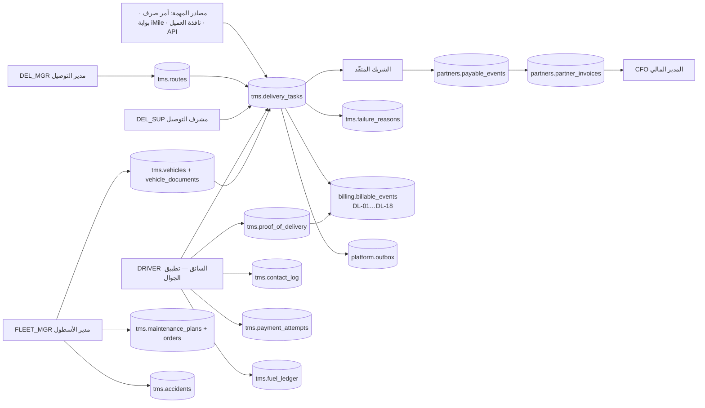

**شرح الخريطة:**
1. المهمة تدخل من أربعة مصادر مسجَّلة في `source_type` وتُمنع من التكرار بفهرس `(source_type, source_ref)`.
2. `DEL_MGR` يبني خطة اليوم مساء اليوم السابق؛ المسار `tms.routes` يحمل السائق والمركبة والمناطق.
3. الإسناد يمرّ بحاجز صلب: سائق أو مركبة بوثيقة منتهية **لا يُسنَد** — منع لا تنبيه.
4. السائق ينفّذ من التطبيق؛ كل اتصال وكل محاولة دفع وكل صورة تُسجَّل في جدولها قبل أن يُقبل «سُلِّمت».
5. الفشل لا يُقبل إلا بكود من `tms.failure_reasons` — لا نص حر.
6. ما يُنفَّذ عبر شريك يحمل `executed_by_partner_id` ويولّد **حدثين متلازمين**: حدث فوترة للعميل وحدث مستحق للشريك.
7. الأسطول يغذّي التوصيل بالمركبة الصالحة، ويستهلك منه العدّاد والوقود والحوادث.
8. كل انتقال حالة يُكتب في `platform.outbox` — الجدول الحاكم للأحداث.

#### خريطة 4-2: مثلث المسؤولية في التشغيل عبر الشريك
تقرأ من العميل إلى الشريك مروراً ببريميوم، مع اتجاه الفوترة والشكوى.

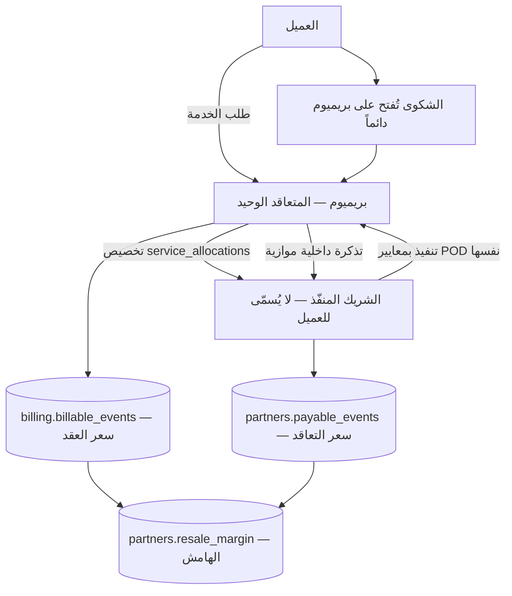

**شرح:** العميل يرى بريميوم وحدها. الشريك يفوتر بريميوم، وبريميوم تفوتر العميل، والفرق هو الهامش — ويُحسب لحظياً لأن `payable_events.billable_event_id` يربط الحدثين بمفتاح واحد. الشكوى تعود إلينا دائماً لأن العميل لا يعرف الشريك ولا يتعامل معه.

---

## 3. البيانات الرئيسية (Master Data)

| العنصر | الجدول | المالك (المنصب) | بوابة الجودة / الاكتمال | من يعدّل |
|---|---|---|---|---|
| **المركبات** (D09) | `tms.vehicles` | مدير الأسطول `FLEET_MGR` | **١٠٠٪ مركبات بوثائق سارية** — الهدف «صفر مركبة بوثيقة منتهية» (22 §D09 · حالياً ٠ من ٨٣) | `FLEET_MGR` · الاستبعاد `disposed` بيد `GM` |
| **وثائق المركبات** | `tms.vehicle_documents` | `FLEET_MGR` | `expiry_date` إلزامي · التنبيه بسلّم **90/45/30/15** يوماً | `FLEET_MGR` |
| **أسباب الفشل** (قائمة مرجعية مغلقة) | `tms.failure_reasons` | مدير التوصيل `DEL_MGR` | **٧ آباء × ٢٥ ابناً = ٣٢ صفاً** — مُتحقَّق في القاعدة · **٣ فقط** `counts_against_driver` | صلاحية `platform.reference.manage` فقط |
| **خطط الصيانة الوقائية** | `tms.maintenance_plans` | `FLEET_MGR` | لكل نوع مركبة: `interval_km` و/أو `interval_days` — **أيهما أسبق** | صلاحية `platform.reference.manage` |
| **المسارات اليومية** | `tms.routes` | `DEL_MGR` | مسار بلا سائق أو بلا مركبة لا يُفعَّل | `DEL_MGR` · `DEL_SUP` |
| **الشركاء** | `partners.partners` | المدير المالي `CFO` | `code` فريد · `partner_type` · `payment_terms_days` · `rating` من نتائج SLA | `CFO` |
| **عقود الشركاء** | `partners.partner_contracts` | `CFO` | `liability_cap` محسوب · `insurance_by = 'partner'` · `penalty_recoverable = true` إلزامي في كل عقد جديد | `CFO` · الاستثناء بقرار `GM` مسجَّل |
| **ملحق أسعار الشريك** | `partners.partner_price_lines` | `CFO` | `cost_price` لكل خدمة بنافذة صلاحية · تفرّد `(contract, service, tier_from)` | `CFO` |
| **تخصيص الخدمة للشريك** | `partners.service_allocations` | `DEL_MGR` للتوصيل · `WH_MGR` للتخزين | `client_id × service_id × partner_id` + نافذة صلاحية + `priority` عند تعدّد الشركاء | مالك النطاق |
| **قواعد العمولة** | `hr.commission_rules` | `GM` + `CFO` | `rate_per_unit = 0.300` ثابت · `bonus_rate = 0.050` مع `bonus_condition` | `GM` بقرار مسجَّل |
| **حدود التوصيل العددية** | `platform.thresholds` | `GM` | كل الحدود **بيانات لا كود** — تُحرَّر من شاشة الحدود بلا نشر | `GM` |

---

## 4. العمليات

### 4.1 دورة مهمة التوصيل — من الإنشاء إلى إثبات التسليم (PDL-01)

**المدخل:** أمر صرف مُقفَل `wms.outbound_orders` أو شحنة من بوابة iMile أو طلب من نافذة العميل أو نداء API.

**الخطوات:**

1. **إنشاء المهمة** — النظام أو `DEL_SUP` · شاشة «مهام التوصيل» · يُكتب صف في `tms.delivery_tasks` بحالة `created` و`doc_no` من سلسلة `TSK` · الحدث `tms.task.created`.
   **رفض فوري** إن نقص أي من: `area` · `block` · `street` · `recipient_phone` — الواجهة البرمجية تعيد **422** تُعدّد الحقول الناقصة (INV-C4-2 · S3).
2. **التخطيط والإسناد** — `DEL_MGR` مساء اليوم السابق · شاشة «خطة التوزيع» · يُنشأ `tms.routes` ويُملأ `driver_id` و`vehicle_id` و`route_id` و`assigned_at` على المهمة، والحالة `assigned` · الحدث `tms.task.assigned` · تُولَّد **وثيقة مانيفست السائق**.
   **حاجز صلب INV-C4-1:** سائق بإقامة أو رخصة منتهية، أو مركبة بوثيقة منتهية في `tms.vehicle_documents` — **لا يُسنَد**.
3. **فحص الجاهزية وبدء الوردية** — `DRIVER` · شاشتا «فحص الجاهزية» و«بدء الوردية» · تحقق من سريان وثائق السائق والمركبة ومن تخصيص معرّف iMile نشط، ثم بصمة وجه + GPS متصلاً؛ وعند التعذّر يُرفع عَلَم `offline_start`.
4. **قائمة فحص المركبة** — `DRIVER` · إطارات · أضواء · فرامل · نظافة · **قراءة العداد الابتدائية مع صورة**.
5. **مسح التحميل** — `DEL_SUP` + `DRIVER` · تسليم الأقفاص بالمسح · أول مسح ينقل المهمة تلقائياً إلى `out_for_delivery` ويُكتب `ofd_at` · الحدث `tms.task.out_for_delivery`.
6. **الاتصال بالمستلم** — `DRIVER` · شاشة «تنفيذ المهمة» · مكالمة أو واتساب بقالب `T1`/`T2`/`T3` أو رسالة نصية — **كلها من الخادم** · يُكتب صف في `tms.contact_log` بقناته وتوقيته ونتيجته.
7. **الوصول والمسح** — مسح باركود الشحنة **إلزامي قبل التسليم** (INV-C4-4) · مسح شحنة ليست في عهدة السائق يُرفض فوراً · مسح بعد أكثر من ٥ دقائق من «وصلت» يُعلَّم للتدقيق.
8. **التحصيل** — إن `is_cod = true` تُفتح دورة الدفع (§4.3) · لا يُتاح زر «سُلِّم» قبل تأكيد الدفع.
9. **إثبات التسليم** — `DRIVER` · يُكتب صف في `tms.proof_of_delivery`: `delivered_at` **بختم الخادم لا بساعة الجهاز** · `geo_lat`/`geo_lng` · اسم المستلم وصلته · **توقيع أو صورة — أحدهما إلزامي** · `sha256` للصورة و`photo_sha256`/`signature_sha256` · `device_id` · `captured_by`. الحالة تصير `delivered` و`completed_at` يُملأ · الحدث `tms.task.delivered`.
10. **توليد أحداث الفوترة** — النظام ليلاً · `DL-01` أو `DL-02` دائماً، ويُضاف `DL-07` لنفس اليوم و`DL-08` للموعد المحدد و`DL-09` خارج الدوام و`DL-10` للتحصيل — بحسب خصائص المهمة (§4.10).
11. **إقفال المسار** — `DEL_SUP` مساءً · `tms.routes.status = 'closed'` مع `finished_at` و`actual_km` و`completed_stops`.

**المخرج:** مهمة `delivered` بإثبات تسليم قابل للاحتجاج، وأحداث فوترة بحالة `pending` جاهزة للتسعير.

#### خريطة 4-3: تدفق تنفيذ المهمة داخل تطبيق السائق
تقرأ من استلام المهمة إلى أحد المخارج الثلاثة: تسليم · فشل · تأجيل.

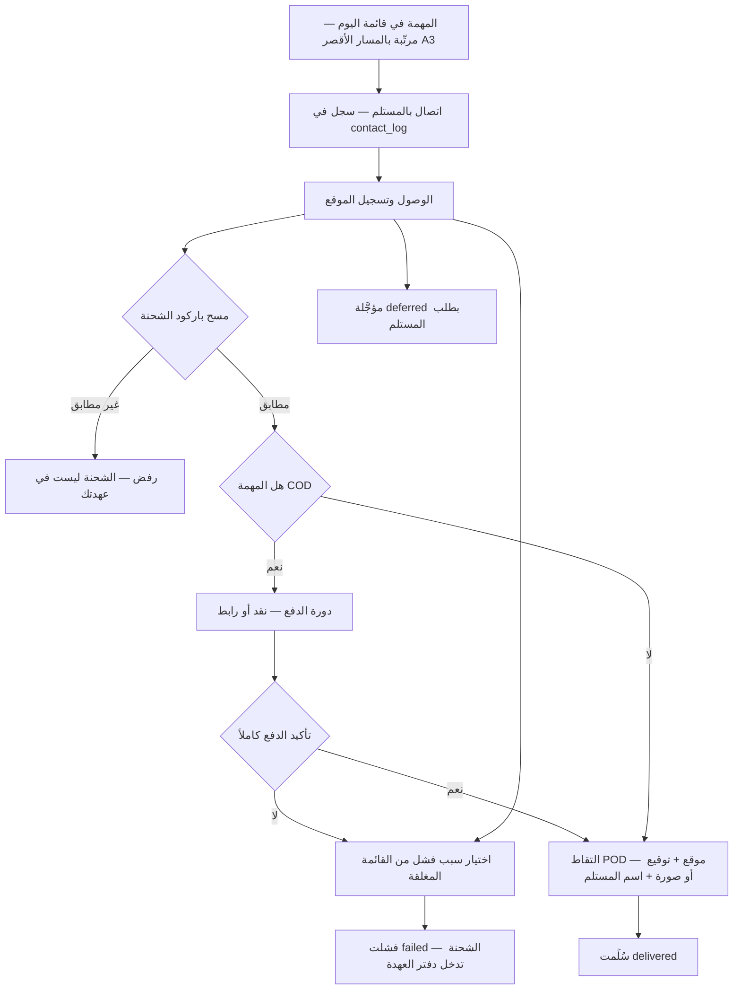

**القواعد المفروضة برمجياً — دورة المهمة:**

| القيد / المشغّل | الحد وقيمته | المصدر |
|---|---|---|
| `chk_delivery_tasks_status` | الحالات الثماني حصراً: `created · assigned · out_for_delivery · delivered · failed · deferred · returned · cancelled` | قيد `check` في القاعدة · 03 §0-7 |
| INV-C4-1 حاجز الإسناد | وثيقة سائق أو مركبة منتهية ⇒ **لا إسناد** | 40 §C4 · 27 §3 |
| INV-C4-2 اكتمال العنوان | رفض بلا `area, block, street, phone` ⇒ **422** | 40 §C4 · 05 س3 |
| INV-C4-3 اكتمال POD | GPS + توقيع أو صورة + اسم المستلم · **الختم الزمني من الخادم** | 40 §C4 · 03 §5-2 |
| INV-C4-4 المسح قبل التسليم | مسح إلزامي · مسح خارج العهدة مرفوض · المستهدف **≥ ٩٨٪** مسح فعلي، وأي سائق تحت **٩٠٪** يُراجَع | 35 §3 |
| تفرّد المصدر | فهرس `(source_type, source_ref)` يمنع الإدخال المزدوج | 01 · 05 س3 |
| تفرّد رقم المستند | `unique (entity_id, doc_no)` · السلسلة `TSK` | `platform.counters` |
| العمل دون اتصال | `chk_tms_delivery_tasks_offline_has_date`: كل صف `entered_offline` يحمل `original_occurred_at` | 13B |
| حدّ القبول المعملي | تسليم ناجح كامل **≤ ٦ نقرات و≤ ٤٥ ثانية** | 40 §D3 · 35 §0-2 |
| عزل نافذة العميل | سياسة `client_portal_scope` على `delivery_tasks` — العميل يرى صفوفه فقط | RLS في القاعدة |

---

### 4.2 المحاولة الفاشلة وأسباب الفشل الخمسة والعشرون (PDL-02)

**المدخل:** مهمة في حالة `out_for_delivery` تعذّر تسليمها.

**الخطوات:**

1. **اختيار السبب** — `DRIVER` · شاشة «تنفيذ المهمة» · قائمة من مستويين: **٧ أسباب رئيسية** و**٢٥ سبباً فرعياً**، بصيغة الكود `<parent>.<child>`. **لا خيار «أخرى» ولا نص حر** (INV-C4-5).
2. **استيفاء الإلزاميات المرافقة** — النظام يفرض حسب صف السبب في `tms.failure_reasons`:
   · `requires_contact_attempts = 2` ⇒ **لا بد من صفّين في `tms.contact_log`** وإلا رُفض السبب؛
   · `requires_photo = true` ⇒ صورة إلزامية (أسباب «الشحنة» و«الوصول» وكود `driver.accident`)؛
   · `requires_note = true` ⇒ ملاحظة نصية.
3. **تسجيل الفشل** — الحالة `failed` · `failure_reason` يحمل الكود · `attempt_no` يبقى كما هو في المحاولة الأولى · الحدث `tms.task.failed` · تُولَّد **وثيقة تقرير محاولة فاشلة**.
4. **نسبة المسؤولية** — النظام آلياً، **لا برأي المشرف**: يُحتسب السبب على السائق فقط في الحالات الثلاث في الجدول أدناه، وبالشرط المكتوب.
5. **المحاولة الثانية** — `DEL_SUP` · إعادة الإسناد مشروطة بـ`attempt_no < 2`، ويزيد العدّاد، وتعود الحالة `assigned` · الحدث `tms.task.reassigned`. **«محاولة 2» عدّاد لا حالة.**
6. **الإرجاع** — بعد فشل المحاولة الثانية يقفل `DEL_SUP` المسار بالحالة `returned` · الحدث `tms.task.returned` · تُولَّد **وثيقة إشعار إرجاع**.
7. **التأجيل بطلب المستلم** — `DRIVER` يسجّل `deferred`، ثم `DEL_SUP` يعيدها إلى `assigned` بتاريخ جديد · الحدث `tms.task.deferred`.
8. **الإلغاء** — `DEL_MGR` فقط، من أي حالة قبل `delivered`، والسائق يُخطَر فوراً بالإشعار `N3` «شحنة أُلغيت — لا تسلّمها».

**المخرج:** فشل موصوف بكود قابل للتحليل، ومسؤولية منسوبة بدليل، وحدث فوترة `DL-11` مشروط بعلم العقد.

**الأسباب الفرعية الخمسة والعشرون — البذرة كما في القاعدة (٣٢ صفاً = ٧ آباء + ٢٥ ابناً):**

| الأب | الأبناء | الإلزامي المرافق |
|---|---|---|
| `no_answer` لا يوجد رد | `no_response` · `phone_off` · `wrong_number` · `door_not_opened` | **محاولتا اتصال مسجَّلتان** |
| `address` العنوان | `incorrect` · `incomplete` · `building_not_found` · `out_of_coverage` | ما وجده فعلاً + الموقع |
| `recipient` المستلم | `refused` · `requested_defer` · `absent` · `not_authorised` | سبب من العميل |
| `payment` الدفع | `no_funds` · `refused` · `method_mismatch` | الموعد البديل |
| `shipment` الشحنة | `damaged` · `short` · `mismatch` | **صورة إلزامية** |
| `access` الوصول | `area_closed` · `security_block` · `road_blocked` · `weather` | **صورة إلزامية** |
| `driver` السائق | `vehicle_breakdown` · `accident` · `shift_time_exhausted` | تبليغ المشرف فوراً |

**الأسباب الثلاثة المحتسبة على السائق — `counts_against_driver = true` (مُثبَّتة FIXED):**

| # | الكود | تُحتسب فقط متى | من يقرّر |
|---|---|---|---|
| 1 | `no_answer.door_not_opened` | **لا توجد محاولتا اتصال مسجَّلتان** في `tms.contact_log` | النظام من سجل الاتصال |
| 2 | `address.building_not_found` | الموقع المسجَّل **> ٣٠٠ متر** عن عنوان المهمة | النظام من إحداثيات المحاولة |
| 3 | `driver.shift_time_exhausted` | **لا يوجد تجاوز مشرف مسجَّل** | النظام، والتجاوز بسبب مسجَّل يظهر في تقرير شهري |

> **عطل المركبة والحادث لا يُحتسبان على السائق إطلاقاً.** عطل المركبة يذهب إلى **مسار الأسطول** (وإن ثبت الإهمال فبند انضباطي مستقل `VEH-07`)، والحادث يذهب إلى **مسار التحقيق** (`VEH-04`؛ ولا تحميل مالي إلا بعد تحقيق وبسقف تحمّل التأمين). هذا اتساقاً مع المبدأ: «لا نسبة بلا دليل».

**القواعد المفروضة برمجياً — الفشل:**

| القيد / المشغّل | الحد وقيمته | المصدر |
|---|---|---|
| مفتاح أجنبي على السبب | `delivery_tasks.failure_reason` من `tms.failure_reasons.code` حصراً — لا نص حر | INV-C4-5 · 40 §C4 |
| عدد الأسباب | **٢٥ سبباً فرعياً** تحت **٧ آباء** — العدد ٢٤ خطأ مصحَّح في v4 | 35 §4 (OPS-33) |
| المحتسب على السائق | **٣ فقط** — القيمة `counts_against_driver` في القاعدة، ومُتحقَّق أنها ٣ صفوف | EXEC §1.2 FIXED |
| حلقة المحاولة | `attempt_no < 2` شرط إعادة الإسناد | 03 §0-7 |
| مراجعة التصنيف | كل **٦ أشهر**: أي سبب يُحتسب على **> ٣٠٪** من السائقين يُراجَع تصنيفه | 35 §4-1 |
| `p2` في `driver_trust` | نسبة الفشل المنسوب للسائق بوزن **0.25** — و`driver_trust` **لا يُربط بأجر ولا بجزاء** | ADR-28 · EXEC §1.13 |

---

### 4.3 التحصيل عند التسليم COD والدفع التفاعلي (PDL-03)

**المدخل:** مهمة `is_cod = true` بمبلغ `cod_amount` محدَّد من النظام.

**القاعدة غير القابلة للتفاوض:** **تأكيد الدفع يأتي من بوابة الدفع أو من عدّ النقد — لا من قول السائق.**

**الخطوات:**

1. **فتح محاولة دفع** — يُكتب صف في `tms.payment_attempts` بـ`method` أحد `cash` · `link` · `pos` و`amount_due` من النظام.
2. **مسار النقد** — السائق يؤكد الاستلام · `confirmed_by = 'driver_cash'` · المبلغ يدخل «محصَّل — بانتظار التوريد» في شاشة النقد الحية · يُملأ `cod_collected` على المهمة.
3. **مسار الرابط** — يُولَّد رابط بمهلة **٣٠ دقيقة** (`driver.payment.link_ttl_min`) · الرابط المنتهي يُعاد توليده والقديم يُبطَل · **زر «سُلِّم» معطّل حتى تأكيد البوابة** · عند التأكيد يصل الإشعار `N2`.
4. **التوريد** — السائق يورّد النقد بمسح إيصال المحاسب؛ الفرق بين `cod_amount` و`cod_collected` **فرق مفتوح** يمنع إقفال اليوم.
5. **المطابقة اليومية** — النظام ليلاً يطابق `delivery_tasks` × `payment_attempts` × `billing.receipts` ويخرج التقرير **R-03 مطابقة COD** لـ`CFO`؛ أي فرق غير مسوّى يولّد التنبيه **N-03** فوراً بلا كبح، ويُصعَّد إلى `GM` بعد ٤٨ ساعة.

**المخرج:** نقد موَرَّد بالكامل أو فرق مسجَّل بمسؤول، وحدث `DL-10` للتحصيل حسب العقد.

**القواعد المفروضة برمجياً — الدفع:**

| القيد / المشغّل | الحد وقيمته | المصدر |
|---|---|---|
| `link_needs_gateway` | `method = 'link'` لا يُؤكَّد بلا `gateway_ref` — **مستحيل برمجياً أن يعلن السائق دفعاً إلكترونياً لم يحدث** | قيد `check` في القاعدة · INV-C4-6 |
| الدفع الجزئي | **مرفوض مطلقاً** — لا استثناء ولا اعتماد مشرف · `driver.payment.allow_partial = false` | 35 §2-1 · EXEC قرار 3 |
| مبلغ مختلف | مرفوض — المبلغ من النظام لا من السائق | 35 §2-1 |
| مهلة الرابط | **٣٠ دقيقة** · `platform.thresholds['driver.payment.link_ttl_min'] = 30.000` | مُتحقَّق في القاعدة |
| بوابة الدفع | `driver.payment.gateway = none` عند الإطلاق — **مؤجَّلة إلى مخرج المرحلة 4**؛ المحرّك والجدول يُبنيان الآن والميزة مخفية بمفتاح | EXEC §1.2 · 35 §2-3 |
| بلا شبكة | **الرابط غير متاح** — النقد فقط، ويُعلَم السائق بوضوح | 35 §13 |
| تنبيه فرق COD | **بلا كبح** (٠ ساعة) و**مستثنى من ساعات الهدوء** بوصفه طارئاً | 25 N-03 · EXEC §1.4 |

---

### 4.4 عهدة الشحنات الفاشلة وحواجز إقفال اليوم (PDL-04)

**المدخل:** شحنة في حالة `failed` ما زالت مادياً في مركبة السائق.

**المبدأ:** شاشة العهدة **دفتر عهدة لا شاشة عرض**. شحنة في سيارة سائق ليست في المخزن ولا عند العميل — وبلا دفتر تضيع بلا مسؤول.

**الخطوات:**

1. **دخول العهدة** — بمجرد `failed` تظهر الشحنة في دفتر عهدة السائق مع عمرها.
2. **تنبيه ٢٤ ساعة** — عمر الشحنة يتجاوز `driver.custody.alert_hours = 24` ⇒ تنبيه للمشرف.
3. **تصعيد ٤٨ ساعة** — يتجاوز `driver.custody.escalate_hours = 48` ⇒ **تصعيد إلى `DEL_MGR`** ويصير **البند الجزائي `CLI-08`** قابلاً للتطبيق.
4. **الإشعار اليومي** — `N5` الساعة ١٦:٠٠: «لديك ٤ شحنات فاشلة لم تُرجَع».
5. **الخروج من العهدة** — **بمسح الاستلام في المستودع فقط**، لا بضغطة في التطبيق. عندها تنتقل المهمة إلى `returned`.
6. **إقفال اليوم** — لا يُقفل يوم السائق إلا بتصفير **الحواجز الخمسة**.

#### خريطة 4-4: حواجز إقفال يوم السائق الخمسة
تقرأ من محاولة الإقفال إلى الإقفال المقبول أو إلى التسوية المطلوبة.

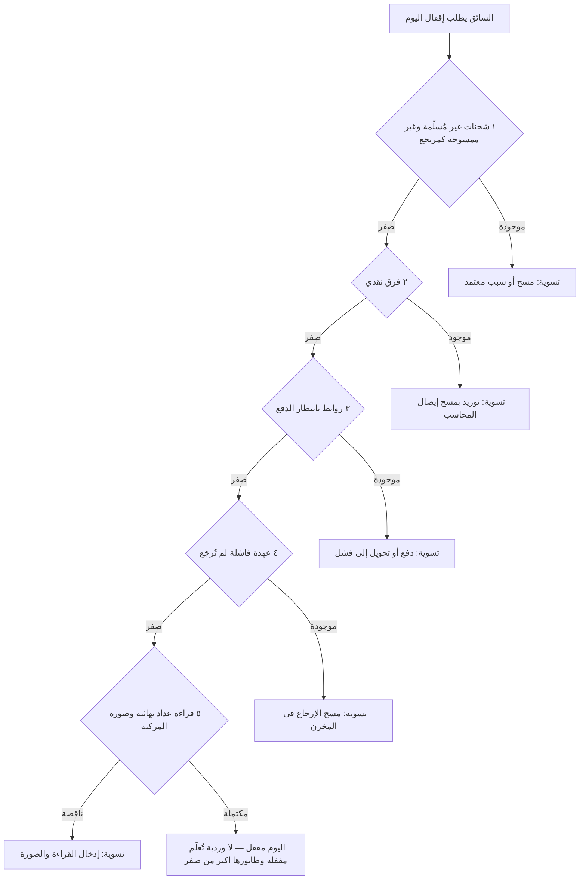

**المخرج:** يوم مقفل بلا ذمم مفتوحة — لا نقد ولا بضاعة ولا رابط معلّق.

**القواعد المفروضة برمجياً — العهدة والإقفال:**

| القيد / المشغّل | الحد وقيمته | المصدر |
|---|---|---|
| تنبيه العهدة | `platform.thresholds['driver.custody.alert_hours'] = 24.000` — **مُتحقَّق في القاعدة** | 35 §12-1 (OPS-42) |
| تصعيد العهدة | `platform.thresholds['driver.custody.escalate_hours'] = 48.000` — **مُتحقَّق في القاعدة** | 35 §12-1 · EXEC §1.2 |
| البند الجزائي | `CLI-08` يصير قابلاً للتطبيق عند تجاوز ٤٨ ساعة — من لائحة الجزاءات الـ٧٧ | 15 · EXEC §1.2 |
| INV-C4-7 إقفال اليوم | محجوب بأي من: شحنات غير ممسوحة · فرق COD ≠ 0 · روابط معلّقة · عهدة فاشلة · عداد نهائي مفقود | 40 §C4 |
| إقفال الوردية والطابور | إنهاء الجلسة بطابور معلّق **مسموح** (تسليم وردية)، والإقفال يتم تلقائياً عند مزامنة آخر عملية — **ولا تُعلَّم وردية مقفلة وطابورها > ٠** | EXEC §1.9 · 35 §13 |
| الخروج من العهدة | **بمسح المستودع حصراً** — لا زر في التطبيق | 35 §7 |

---

### 4.5 تطبيق السائق — الجهاز والعمل دون اتصال والدليل (PDL-05)

**المدخل:** سائق مُعيَّن بجهاز شخصي واحد.

**الشاشات العشر (40 §D3 · 35 §0):**

| # | الشاشة | الغرض التشغيلي |
|---|---|---|
| 1 | فحص الجاهزية | وثائق السائق والمركبة سارية · معرّف iMile نشط — حاجز INV-C4-1 |
| 2 | بدء الوردية | بصمة وجه + GPS متصلاً؛ وإلا عَلَم `offline_start` |
| 3 | قائمة فحص المركبة | إطارات · أضواء · فرامل · نظافة · العداد الابتدائي بصورة |
| 4 | مسح التحميل | استلام الأقفاص والشحنات في العهدة |
| 5 | قائمة المهام | الترتيب بالمسار الأقصر **A3** مع احترام المواعيد المحددة |
| 6 | تنفيذ المهمة | اتصال · مسح · POD · دفع · فشل بكود |
| 7 | العهدة | دفتر الشحنات الفاشلة (§4.4) |
| 8 | الأرباح | العمولة والبونص والخصومات مفصَّلة (§4.6) |
| 9 | الأداء والترتيب | نسبة النجاح ونطاق مئوي بين الأقران |
| 10 | الملف والوثائق والحضور والجزاءات والتظلّم | الجزاء الجديد يُخطَر فوراً `N8` بعدّاد تظلّم ٧ أيام |

**نموذج الجهاز والمصادقة (G-07 — الجهاز الشخصي):**

| البند | القيمة المعتمدة |
|---|---|
| نموذج الجهاز | **شخصي — جهاز واحد لكل سائق** (`device → user`) |
| التسجيل | **OTP مرة واحدة** ثم تحديث الرمز كل **٣٠ يوماً** مربوطاً بالجهاز |
| جهاز جديد | **موافقة مشرف** — لا تسجيل ذاتي |
| نافذة العمل دون اتصال | **٧ أيام** (PDA المشترك ٧٢ ساعة — فرق مقصود) |
| الطابور المحلي | **SQLite** · كل عملية بمعرّف **UUID** فريد · الخادم يرفض المكرر بالمعرّف |
| توقيع العملية | كل عملية مختومة بـ`user_id` المنفِّذ + توقيع الجهاز + توقيت العملية |
| قبول العملية | تُقبل إن كان الرمز صالحاً **وقت تنفيذ العملية** لا وقت المزامنة |
| جهاز ملغى أو مفقود | **إبطال فوري · طابوره يُحجر لمراجعة المشرف** · بيانات الجهاز مشفّرة محلياً |
| ما لا يعمل دون اتصال | **رابط الدفع** — النقد فقط، ويُعلَم السائق |

**الختم المائي والدليل:**

كل صورة تُختم **على الجهاز لحظة الالتقاط**: رقم الشحنة · التاريخ والوقت **من الخادم** · اسم السائق ورقمه · المعرّف · الإحداثيات · الشعار. **الكاميرا مباشرةً فقط — لا اختيار من المعرض.** الضغط ≤ ٣٠٠ ك.ب مع دقة تكفي لقراءة الختم. تُخزَّن بصمة `sha256` للصورة في `tms.proof_of_delivery`.

**الاتصال والخصوصية:**

| البند | القاعدة |
|---|---|
| القنوات | مكالمة (رقم وسيط عند `masked`) · واتساب بقالب معتمد · رسالة نصية من الخادم |
| المزوّد | **Twilio** — I-05 واتساب · I-06 رسائل نصية |
| القوالب | **T1–T5 معرَّفة في 35 §1-3**؛ `T4` رابط الدفع **غير مفعّل** حتى ربط البوابة. **لا كتابة حرة إطلاقاً** |
| الوضع عند الإطلاق | `driver.contact.provider = direct` — **رقم العميل لا يُخزَّن في جهاز السائق**، لكن **رقم السائق قد يظهر لهوية المتصل**، ويُبلَّغ السائق بذلك كتابةً ويُدرَج في عقد العمل |
| `masked` | يُقيَّم عند **مخرج المرحلة 3** — التبديل إعداد في `platform.settings` لا تعديل كود |
| حدّ الخصوصية | يُرصد **ما يجري عبر التطبيق فقط** — لا مكالمات السائق الشخصية ولا رسائله؛ ويُبلَّغ بذلك كتابةً عند التوظيف ويوقّع عليه |

**حفظ الدليل والحجز القانوني:**

| المكوّن | المدة | الأساس |
|---|---|---|
| **سجل POD** — من استلم · متى · الإحداثيات · التوقيع · `sha256` | **٥ سنوات** | الدليل الأساسي في أي نزاع، وحجمه لا يُذكر |
| **ملف الصورة** | **٦٠ يوماً** | كلفة تخزين حقيقية |
| **الاستثناء** | `legal_hold = true` **آلياً** على كل POD مرتبط بنزاع أو شكوى أو جزاء أو مطالبة تأمين | المشغّل `tms.raise_legal_hold()` في القاعدة |
| رفع الحجز | بإغلاق السبب فقط وبسبب مسجَّل في التدقيق | 27 §12-1 |
| تفعيل الحذف | **لا يُفعَّل قبل المرحلة 6** — إلى حينها لا يُحذف شيء | EXEC §1.4 |

> **مُتحقَّق في القاعدة:** المشغّل `trg_pod_hold_exception` على `tms.delivery_exceptions` و`trg_pod_hold_ticket` على `cc.tickets` يستدعيان `tms.raise_legal_hold()` فيرفعان `legal_hold` على كل صف POD للمهمة المعنية. والفهرس الجزئي `pod_legal_hold_idx` يجعل جرد المحجوز فورياً.

---

### 4.6 العمولة والبونص والخصومات والترتيب بين الأقران (PDL-06)

**المدخل:** شحنات اليوم المسلَّمة، منسوبة إلى الموظف الصحيح عبر الإسناد الزمني للمعرّف.

**الخطوات:**

1. **٢٣:٠٠** — وكيل المحطة يسحب أرقام اليوم من بوابة iMile.
2. **النسبة** — النظام ينسب كل شحنة للموظف الذي كان يحمل المعرّف **لحظة التسليم** عبر `imile.shipments_attributed`.
3. **الحساب** — يُكتب صف في `hr.commission_daily` (صف واحد لكل `(work_date, employee_id)` — تفرّد مفروض) مع **لقطة مجمَّدة** في `source_snapshot`.
4. **الخصومات** — بأعمدة مستقلة: `deduction_housing` · `deduction_phone` · `deduction_residency` · `deduction_other` مع `deduction_reason` إلزامي عند وجود خصم.
5. **٠٧:٠٠** — الإشعار `N6` والتقرير `R-07`؛ السائق يرى عمولة أمس.
6. **الاعتراض** — نافذة **٤٨ ساعة** ⇒ `status = 'disputed'` ⇒ مراجعة مشرف التوصيل.
7. **الإقفال** — تأكيد ثم ترحيل إلى `payroll_period` في مسير الرواتب.

**المخرج:** عمولة يومية مجمَّدة قابلة للإثبات، وصافٍ مفصَّل لا مجمَّع.

**الأرقام الحاكمة — مُتحقَّقة في `platform.thresholds`:**

| البند | القيمة المعتمدة | المفتاح في القاعدة |
|---|---|---|
| **الأساس** | **0.300 د.ك لكل شحنة مسلَّمة** — **ثابت FIXED**، لا شرائح ولا تدرّج | `driver.commission_base = 0.300` |
| **بونص الجودة** | **+0.050 د.ك** — بالشرطين معاً: نسبة النجاح من أول محاولة **≥ ٨٥٪** **و**صفر فرق COD في الشهر | `driver.commission_bonus = 0.050` · `driver.bonus_first_attempt_pct = 85.000` |
| **خصم السكن** | **23 د.ك/شهر** بالتناسب · الإعفاء بيد `GM` بسبب مسجَّل | `housing.deduction = 23.000` |
| **خصم الهاتف** | **5 د.ك/شهر** | `housing.phone_deduction = 5.000` |
| **خصم الإقامة** | **12 د.ك/شهر** | `housing.residency_deduction = 12.000` |
| **نافذة الاعتراض** | **٤٨ ساعة** من إتاحة كشف اليوم | 40 §C7 · 35 §8-4 |

**مثال رقمي شهري — سائق سلّم ٥٤٢ شحنة بنسبة أول محاولة ٨٩٪ وبلا فرق COD:**

| البند | الحساب | القيمة (د.ك) |
|---|---|---|
| العمولة الأساسية | 542 × 0.300 | **162.600** |
| بونص الجودة | 542 × 0.050 — مستحق لأن ٨٩٪ ≥ ٨٥٪ **و**فرق COD = صفر | **27.100** |
| **إجمالي العمولة** | 162.600 + 27.100 | **189.700** |
| ناقص: خصم السكن | شهر كامل | −23.000 |
| ناقص: خصم الهاتف | — | −5.000 |
| ناقص: خصم الإقامة | — | −12.000 |
| **الصافي** | 189.700 − 40.000 | **149.700** |

> لو كانت نسبة أول محاولة **٨٢٪** لسقط البونص بالكامل (لا تدرّج)، وصار الصافي **122.600**. ولو كان هناك **أي** فرق COD في الشهر لسقط البونص كذلك حتى مع نسبة ٩٥٪ — **الشرطان معاً لا أحدهما**.

**العرض للسائق:** الأساس × عدد الشحنات · البونص مع **سبب عدم الاستحقاق** إن لم يُستحق · كل خصم **بسطر مستقل باسمه** · الصافي. **لا خصم مجمَّع بلا بيان.**

**الترتيب بين الأقران — ستة مفاتيح بيد الإدارة:**

| المفتاح | الافتراضي | الملاحظة |
|---|---|---|
| `driver.ranking.enabled` | `true` | يُطفأ بضغطة إن أضرّ |
| `driver.ranking.mode` | `band` نطاق مئوي | `exact` متاح وغير موصى به |
| `driver.ranking.show_peer_names` | `false` | الإظهار يخلق احتكاكاً بين الزملاء |
| `driver.ranking.basis` | `success_rate` | **لا `volume`** — العدد يعتمد على المنطقة المسنَدة لا على المهارة |
| `driver.ranking.linked_to_bonus` | `false` | يرفعه `GM` بقرار مسجَّل |
| `driver.ranking.linked_to_penalty` | **`false`** | **مُثبَّت FIXED — يبقى مطفأً** |

> **✅ أُغلق في 13B (SCR ق-32 بذراً):** الإعدادات السلوكية **التسعة** (`driver.contact.provider` · `driver.payment.gateway` · `driver.payment.allow_partial` · ومفاتيح `driver.ranking.*` الستة) **مبذورة فعلاً في `platform.settings` بقيمها المنصوصة في 35 §8-3/§12-1** — مُتحقَّق في القاعدة الحيّة. والجدول صار **١٤ مفتاحاً**.

> **لماذا الفصل:** المكافأة على الترتيب تدفع للتحسين. **العقوبة على الترتيب تدفع للتحايل** — لأن الترتيب نسبي، فالسائق لا يتحسّن بالضرورة بتحسين نفسه بل بإفشال غيره أو بتزوير أرقامه. والتحديث **يومي لا لحظي**: اللحظي يولّد قلقاً بلا فائدة.

**`driver_trust` — المعادلة وحدود الاستخدام (ADR-28):**

```
trust = 1 − (0.35·p1 + 0.25·p2 + 0.20·p3 + 0.10·p4 + 0.10·p5)   محصور في [0,1]
```

| المكوّن | التعريف | الوزن | حد المقام |
|---|---|---|---|
| `p1` | نسبة رفض مشاكل التدقيق الحي المرفوعة | 0.35 | ≥ 10 |
| `p2` | نسبة الفشل المنسوب للسائق | 0.25 | ≥ 10 |
| `p3` | ادّعاءات «لا يوجد رد» بأقل من محاولتَي اتصال | 0.20 | ≥ 5 |
| `p4` | تسليمات على بُعد **> ٣٠٠ م** من العنوان | 0.10 | ≥ 20 |
| `p5` | أيام بفرق COD | 0.10 | ≥ 10 |

نافذة **٩٠ يوماً متأخرة** · تُحسب **ليلاً ٠١:٤٠** · التاريخ **٢٤ شهراً** في `imile.driver_trust`.
**قواعد صارمة:** قضية انضباطية مفتوحة من نوع الاحتيال (`hr.penalty_schedule.is_fraud` — `CLI-02/03/04/06/09 · ATT-07/08 · WRK-08`) ⇒ **`trust = 0`** · بداية باردة (< ٣٠ تسليمة) ⇒ **`trust = 0.70`**.

**القيود غير القابلة للتفاوض:**
- **لا يُعرض للسائق كقيمة مركّبة أبداً** — يُعرض له المكوّن القابل للتصرف وحده (مثل «محاولات الاتصال المسجَّلة»).
- **لا يُربط بأجر ولا بعمولة ولا ببونص ولا بجزاء.** استخدامه الوحيد: **شرط من شروط إقفال DTL الآلي** ومدخل تشغيلي للمشرف.
- **مُتحقَّق في القاعدة:** قيد `weights_sum_one` يرفض أي مجموع أوزان ≠ 1.0000، وقيد `trust_clamped` يحصر القيمة في [0,1].

---

### 4.7 الأسطول — المركبة ووثائقها والصيانة الوقائية (FLT-01)

**المدخل:** مركبة جديدة تُسجَّل، أو مركبة قائمة يحلّ استحقاق صيانتها.

**الخطوات:**

1. **التسجيل** — `FLEET_MGR` · شاشة «ملف المركبة» · `tms.vehicles` بحالة `registered` مع `plate_no` فريد و`vehicle_type` و`ownership` و`capacity_kg`/`capacity_cbm` و`odometer_km` · الحدث `tms.vehicle.registered`.
2. **الوثائق** — لكل وثيقة صف في `tms.vehicle_documents` بـ`doc_type` و`expiry_date` **إلزامي** و`file_url`. **الحالة مشتقّة من تاريخ الانتهاء لا مخزَّنة.**
3. **التفعيل** — `FLEET_MGR` ينقلها إلى `active` بعد اكتمال الوثائق · الحدث `tms.vehicle.activated`.
4. **التنبيه المتدرّج** — الحدث `hr.document.expiring` عند **كل عتبة من الأربع: ٩٠ · ٤٥ · ٣٠ · ١٥ يوماً**، والتنبيه `N-05` أسبوعي مجمّع يصير يومياً عند ≤ ٧ أيام.
5. **الصيانة الوقائية** — النظام يقارن `odometer_km` الحالي و`next_due_km`/`next_due_date` بخطة نوع المركبة، وينبّه قبل **٥٠٠ كم** أو **١٤ يوماً**.
6. **أمر الصيانة** — `FLEET_MGR` · `tms.maintenance_orders` بـ`kind` أحد `preventive` · `corrective` · `accident` و**`odometer_km` إلزامي** · `workshop_partner_id` عند التنفيذ لدى ورشة شريكة · `purchase_order_id` لقطع الغيار.
7. **الإقفال** — `out_at` يولّد `downtime_hours` آلياً، و`parts_cost + labour_cost` يولّدان `total_cost` آلياً، ويُحدَّث `next_due_km`/`next_due_date`.
8. **العودة للخدمة** — `maintenance` ⟶ `active` · الحدث `tms.vehicle.returned_to_service`.
9. **تسليم المركبة لسائق** — يولّد **نموذج تسليم مركبة** والحدث `tms.vehicle.handed_over`.

**المخرج:** مركبة صالحة قانونياً وفنياً للإسناد، وتكلفة صيانة مربوطة بالمركبة وبعميلها.

**فترات الصيانة الوقائية — البذرة الحاكمة:**

| المهمة | `interval_km` | `interval_days` | القاعدة |
|---|---|---|---|
| **زيت وفلاتر** | **5,000 كم** | **90 يوماً** | **أيهما أسبق** |
| **فرامل** | **20,000 كم** | — | بالكيلومترات |
| **إطارات** | **40,000 كم** | — | بالكيلومترات |
| الفحص الدوري القانوني | — | **حسب القانون** | بتاريخ انتهاء الفحص |

> **التصحيح المطبَّق في v4 (ADM-32):** كانت 03 §8 تقول «بالكيلومترات لا بالتاريخ» بينما العمودان موجودان معاً و`EXEC §1.3` يحسمها «5,000 كم **أو** 90 يوماً». المعتمد: **أيهما أسبق**. مركبة قليلة الاستخدام لا يعني زيتها أنه لم يتقادم.

**القواعد المفروضة برمجياً — الأسطول:**

| القيد / المشغّل | الحد وقيمته | المصدر |
|---|---|---|
| `chk_vehicles_status` | ست حالات: `registered · active · maintenance · idle · out_of_service · disposed` | قيد `check` في القاعدة |
| `vehicles_plate_no_key` | رقم اللوحة فريد على مستوى القاعدة كلها | القاعدة |
| وثيقة منتهية | **حاجز صلب** — المركبة لا تُسنَد لمهمة (ليس تنبيهاً) | 27 §3 · INV-C4-1 |
| سلّم التنبيه | **٩٠/٤٥/٣٠/١٥** يوماً — سلّم **واحد في الحزمة كلها** · `alert_days_before` الافتراضي 30 يُقرأ مع السلّم | 40 §C7 · R-06 |
| تنبيه الصيانة | قبل **٥٠٠ كم** (`alert_before_km`) أو **١٤ يوماً** (`alert_before_days`) | القاعدة · 27 §2-1 |
| صيانة متأخرة | **> ١,٠٠٠ كم** عن الاستحقاق ⇒ المركبة تُعلَّم «تحتاج صيانة»، وتسنيدها يتطلب **تجاوز `FLEET_MGR` بسبب مسجَّل** | 27 §3 |
| `chk_maintenance_orders_status` | `planned · in_progress · in_workshop · awaiting_parts · done · cancelled` | قيد `check` في القاعدة |
| أعمدة مولَّدة | `downtime_hours` من `out_at − in_at` · `total_cost` من `parts_cost + labour_cost` — **لا إدخال يدوي** | القاعدة |
| الحالة النهائية | `disposed` **نهائية** ولا رجعة منها · بيد **`GM`** حصراً | 03 §0-8 (OPS-30) |

---

### 4.8 الحادث والتحقيق والتأمين (FLT-02)

**المدخل:** واقعة حادث لمركبة في الخدمة.

**الخطوات:**

1. **البلاغ خلال ٢٤ ساعة** — `DRIVER` ثم `FLEET_MGR` · صف في `tms.accidents` بـ`occurred_at` و`location` و`geo_lat`/`geo_lng` و`severity` أحد `minor · major · total_loss` و**`photo_urls` إلزامية**.
   **عدم الإبلاغ الفوري بند جزائي `VEH-06`.**
2. **الطرف الثالث والشرطة** — `third_party` و`third_party_details` و`police_report_no`.
3. **المطالبة التأمينية** — `insurance_claim_no` و`claim_status` من `filed · under_review · approved · rejected · paid` و`claim_amount` و**`deductible`** (قيمة تحمّل التأمين).
4. **التحقيق** — **`driver_at_fault` لا يُحدَّد إلا بإغلاق التحقيق**. عند ثبوت الخطأ يُربط `disciplinary_case_id` بملف انضباطي وفق البند `VEH-04` بإجراءات المادة 37 كاملةً.
5. **التحميل على السائق** — `charged_to_driver` **مقيَّد بألا يتجاوز `deductible`** — قيد في القاعدة لا سياسة مكتوبة. ما فوق السقف على التأمين أو على الشركة — **لا على السائق**.
6. **الإصلاح** — `repair_order_id` يربط الحادث بأمر صيانة من نوع `accident`.
7. **الإقفال** — `closed_at` بعد إغلاق المطالبة والملف الانضباطي.

**المخرج:** حادث موثّق بصور ومطالبة، وتحميل عادل مسقوف أو صفر.

#### خريطة 4-5: مسار الحادث من الوقوع إلى الإقفال
تقرأ من وقوع الحادث إلى إقفال الملف، مع فرع التحقيق وسقف التحمّل.

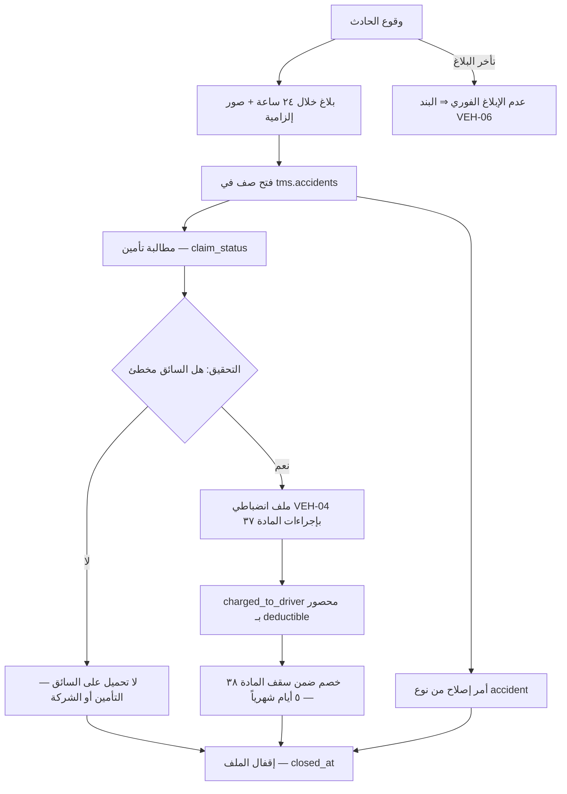

**القواعد المفروضة برمجياً — الحادث:**

| القيد / المشغّل | الحد وقيمته | المصدر |
|---|---|---|
| `charge_within_deductible` | `charged_to_driver <= coalesce(deductible, 0)` — **قيد `check` في القاعدة** | 27 §3-1 · EXEC §1.3 |
| قاعدة التحميل | **بعد تحقيق فقط**، و**بسقف تحمّل التأمين** — شرطان لا شرط واحد | EXEC §1.3 |
| سقف الخصم الشهري | المادة 38 من قانون العمل: **٥ أيام شهرياً** عبر كل الموقّعين، والزائد يُرحَّل | 40 §C7 · 15 |
| مهلة التظلّم | **٧ أيام** من الإصدار — لا ترحيل للخصم قبل انقضائها | 03 §0-11 · 35 N8 |
| عدم الإبلاغ | بند جزائي **`VEH-06`** | 27 §3 |
| الأثر على تقييم التوصيل | **لا يُحتسب** الحادث في `counts_against_driver` — مسار مستقل | 35 §4-1 (OPS-32) |

---

### 4.9 الوقود (FLT-03)

**المدخل:** تعبئة وقود ببطاقة الشركة (المصدر `oula_import` عبر التكامل I-03).

**الخطوات:**

1. **الصرف** — السائق يعبّئ ببطاقة مسجَّلة كأصل `admin.assets`.
2. **تسجيل العداد** — **إلزامي مع كل تعبئة** (INV-C4-9): بدونه لا يُسجَّل الصرف.
3. **الاستيراد** — تصدير CSV من بوابة أولى ثم استيراد ومطابقة بالبطاقة والمركبة — **لا واجهة برمجية لدى أولى**.
4. **الحساب** — `km_since_last` و`km_per_litre` من فرق العداد.
5. **كشف الشذوذ** — انحراف **> ٢٠٪** عن متوسط ٩٠ يوماً للمركبة ⇒ `is_anomaly = true` مع `anomaly_reason` + تنبيه وتحقيق.
6. **المطابقة الشهرية** — `FLEET_MGR` يطابق الدفتر بكشف المزوّد.
7. **إخلاء الطرف** — بطاقة موظف غادر **تُلغى آلياً** عند إخلاء الطرف — حاجز صلب.

**المخرج:** دفتر وقود بلا تكرار وبلا فجوات عدّاد، وتكلفة وقود مربوطة بالمركبة وبعميلها في `billing.profitability.cost_fuel`.

**القواعد المفروضة برمجياً — الوقود:**

| القيد / المشغّل | الحد وقيمته | المصدر |
|---|---|---|
| `fuel_ledger_card_asset_id_filled_at_amount_key` | `unique (card_asset_id, filled_at, amount)` — **يمنع الاستيراد المزدوج** | القاعدة · 27 §2-2 |
| `odometer_km not null` | **قراءة العداد إلزامية** — INV-C4-9 | القاعدة |
| حدّ الشذوذ | انحراف **> ٢٠٪** عن معدل المركبة على **٩٠ يوماً** | 03 §0-8 · 23 I-03 |
| العمل دون اتصال | `chk_tms_fuel_ledger_offline_has_date` — كل صف `entered_offline` يحمل `original_occurred_at` | 13B |
| بطاقة موظف غادر | تُلغى آلياً عند إخلاء الطرف | 27 §3 · 23 I-03 |

---

### 4.10 التشغيل عبر الشركاء — من التخصيص إلى الدفع (POR-01)

**المدخل:** خدمة متعاقد عليها مع العميل، تُنفَّذ كلياً أو جزئياً بطرف ثالث.

**المبدأ الحاكم:** **العميل يرى بريميوم وحدها. الشريك لا يظهر ولا يفوتر العميل مباشرة أبداً.**

**الخطوات:**

1. **التخصيص** — `DEL_MGR` أو `WH_MGR` · صف في `partners.service_allocations`: `client_id × service_id × partner_id` مع `partner_contract_id` و`location_scope` ونافذة صلاحية و`priority` عند تعدّد الشركاء للخدمة نفسها.
2. **الطلب** — العميل يطلب الخدمة كالمعتاد؛ لا شيء في واجهته يتغيّر.
3. **الإسناد** — المهمة تحمل `executed_by_partner_id` و`partner_task_ref` (مرجع الشريك).
4. **التنفيذ بمعاييرنا** — الشريك يعيد حالة الشحنة مع **إثبات تسليم بمعاييرنا نفسها**: GPS + توقيع أو صورة + اسم المستلم. **شحنة بدليل أدنى لا تُقفل — تُرفض وتُعاد للشريك.**
5. **الحدثان المتلازمان عند الإقفال** — `billing.billable_events` بسعر العقد للعميل، و`partners.payable_events` بسعر التعاقد للشريك، **مرتبطان بـ`billable_event_id`** — فالهامش يُحسب فوراً في العرض `partners.resale_margin`.
6. **مطابقة COD اليومية** — الشريك يحصّل نقداً؛ **المطابقة اليومية إلزامية**، وأي فرق **يجمّد التسوية** ويفتح بند قرار بمهلة تصفية **٤٨ ساعة**.
7. **المرتجعات** — **إلى مستودعنا لا مستودع الشريك**.
8. **فاتورة الشريك** — تُستلم في `partners.partner_invoices` بـ`partner_ref` مقابل `doc_no` من سلسلة `PINV`، وتُطابَق آلياً بأحداثنا المسجَّلة.
9. **نتيجة المطابقة** — عتبة واحدة **٢٪** تحكم الاعتماد الآلي والتجميد معاً.
10. **الاعتماد والدفع** — `approved_amount` ثم `paid_amount`؛ القيد المحاسبي: مدين 5xxx مصروف شريك · دائن 2100 ذمم موردين.

**المخرج:** خدمة مقدَّمة بمعايير بريميوم، وتكلفة مربوطة بالعميل، وهامش معلوم فوراً، وفاتورة شريك مدفوعة بقدر ما قُدِّم فقط.

#### خريطة 4-6: مطابقة فاتورة الشريك عند عتبة ٢٪
تقرأ من استلام الفاتورة إلى الدفع أو إلى النزاع الموثّق.

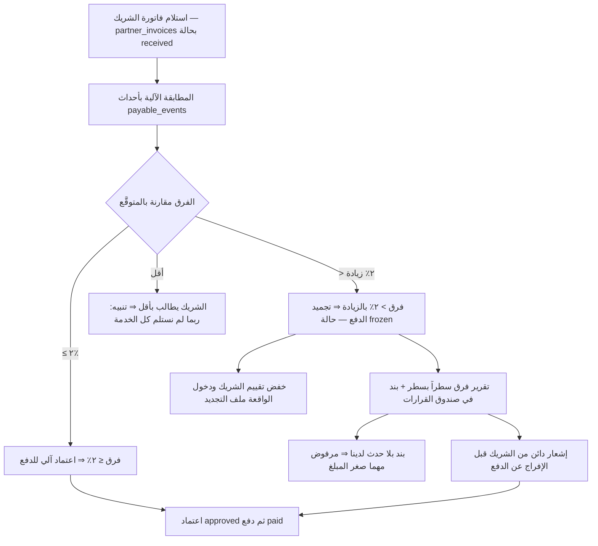

**القواعد المفروضة برمجياً — الشركاء:**

| القيد / المشغّل | الحد وقيمته | المصدر |
|---|---|---|
| عتبة المطابقة | `platform.thresholds['partner.match_tolerance_pct'] = 2.000` — **عتبة واحدة** تحكم الاعتماد والتجميد معاً؛ لا وجود لعتبة «تطابق ١٠٠٪» منفصلة | مُتحقَّق في القاعدة · 09 §5-1 · EXEC §1.1 |
| `matcher_ne_approver` | `matched_by <> approved_by` — **قيد `check` في القاعدة**: المطابِق ليس المعتمِد | 09 §10 البند 3 |
| `variance_amount` | عمود مولَّد `claimed_amount − matched_amount` — **لا إدخال يدوي** | القاعدة |
| `chk_partner_invoices_status` | `received · matched · frozen · approved · paid · rejected` | قيد `check` في القاعدة |
| تفرّد مرجع الشريك | `unique (partner_id, partner_ref)` — الفاتورة نفسها لا تُستلم مرتين | القاعدة |
| تفرّد الحدث المستحق | `unique (source_table, source_id, service_id, partner_id)` على `payable_events` | القاعدة |
| سقف المسؤولية | `liability_cap = min(3 × الفوترة الشهرية، قيمة العقد)` — يُخزَّن **الناتج المحسوب** لأن العمود مفرد؛ `partner.liability_cap_months = 3.000` مُتحقَّق في القاعدة | EXEC §1.1 · 09 §7-1 |
| التأمين | `insurance_by = 'partner'` مع `insurance_expiry` إلزامي وتنبيه انتهاء | EXEC §1.1 · 09 §10 البند 7 |
| استرداد الغرامة | `penalty_recoverable = true` **بند إلزامي في كل عقد شريك جديد**؛ وأي عقد بدونه يحتاج قرار `GM` مسجَّلاً | 09 §10 البند 6 |
| SLA ظهر لظهر | `sla_back_to_back` — التزام الشريك لنا **≥** التزامنا للعميل، وإلا تحمّلنا الغرامة بلا تعويض | 09 §7 |
| نسبة الاستغلال | `min_utilization_pct` الافتراضي **70** — أي حجز سعة تحت ٧٠٪ **ثلاثة أشهر متتالية يُراجَع**؛ الدالة `partners.check_committed_utilization()` في القاعدة | 09 §3 · §10 البند 5 |
| الشريك للعميل | **لا يُسمَّى إطلاقاً** — لا في شاشة ولا في مستند ولا في تفاصيل الشحنة ولا في كشف المخزون | EXEC §1.1 · 09 §2 |
| معيار POD للشريك | **لا تنازل** — شريك لا يستطيع تقديم POD بمعاييرنا لا يُسند له عمل | 09 §9 · S19 |
| حارس الدفع | الدالة `partners.verify_paid_matched()` في القاعدة | 13B |

---

### 4.11 توليد الأحداث القابلة للفوترة DL-01…DL-18 (PDL-07)

**المدخل:** انتقال حالة مُقفَل على مهمة توصيل، أو استثناء توصيل مسجَّل.

**الجدول الحاكم — متى يُولَّد كل حدث:**

| الكود | الخدمة | مصدر التوليد | شرط الفوترة |
|---|---|---|---|
| `DL-01` | توصيل شحنة استهلاكية B2C | `tms.task.delivered` و`task_type = 'b2c'` | **دائماً** |
| `DL-02` | توصيل شحنة تجارية B2B | `tms.task.delivered` و`task_type = 'b2b'` | **دائماً** |
| `DL-03` | رحلة مخصصة | إقفال مهمة من نوع رحلة | حسب العقد |
| `DL-04` | سائق ومركبة مخصصان — باقة يومية | `tms.vehicles.assigned_client_id` × يوم | ثابت يومي |
| `DL-05` | سائق ومركبة مخصصان — باقة شهرية | التخصيص × شهر | ثابت شهري |
| `DL-06` | توصيل بالمسافة | `tms.routes.actual_km` | حسب العقد |
| `DL-07` | توصيل في نفس اليوم | `delivery_tasks.is_same_day = true` عند التسليم | **إضافي — دائماً** |
| `DL-08` | توصيل بموعد محدد | وجود `time_slot_from`/`time_slot_to` عند التسليم | **إضافي — دائماً** |
| `DL-09` | توصيل خارج الدوام أو في العطل | `completed_at` خارج ساعات العمل | **إضافي — دائماً** |
| `DL-10` | تحصيل نقدي عند التسليم | `is_cod = true` عند التسليم | حسب العقد: مبلغ ثابت أو نسبة |
| **`DL-11`** | **محاولة توصيل فاشلة** | `tms.task.failed` | **فقط إن `bills_failed_attempt = true`** |
| **`DL-12`** | **إرجاع شحنة إلى المستودع** | `tms.task.returned` | **فقط إن `bills_return = true`** |
| **`DL-13`** | **انتظار المركبة فوق المدة المسموحة** | `tms.delivery_exceptions` بـ`is_billable = true` | **فقط إن `bills_waiting = true`** |
| **`DL-14`** | **إعادة جدولة بطلب المستلم** | `tms.task.deferred` | **فقط إن `bills_reschedule = true`** |
| `DL-15` | توصيل بمركبة مبرَّدة | `vehicles.is_refrigerated = true` | حسب العقد |
| `DL-16` | نقل بين المستودعات | مهمة تحويل بين مستودعين | حسب العقد |
| `DL-17` | توصيل لمناطق نائية / خارج النطاق | منطقة المهمة خارج نطاق التغطية المتعاقد عليه | إضافي حسب العقد |
| **`DL-18`** | **تسليم جزئي بموافقة المستلم** | إقفال جزئي للمهمة | **فقط إن `bills_partial_delivery = true`** |

**الخمسة الخارجة عن العقد افتراضياً:** `DL-11` · `DL-12` · `DL-13` · `DL-14` · `DL-18` — **عَلَم العقد افتراضه `OFF`**، ومُتحقَّق في القاعدة أن الأعلام الخمسة أعمدة `boolean not null default false` على `sales.contracts`.

> **هذه الخمسة هي مصدر الخسارة الصامتة الأكبر في التوصيل الاستهلاكي.** في معظم عقود الكويت لا يُنصّ عليها، فتُقدَّم مجاناً. القرار المعتمد: **تُرصد كلها في `billing.billable_events` حتى مع غياب البند**، وتظهر بقيمتها التقديرية في **تقرير الإيراد الضائع `R-14`**. وهذا التقرير وحده هو ما يبرّر إعادة التفاوض على العقود — بأرقام لا بانطباعات (INV-C4-8).

**القواعد المفروضة برمجياً — الفوترة من التوصيل:**

| القيد / المشغّل | الحد وقيمته | المصدر |
|---|---|---|
| تفرّد الحدث | `unique (source_table, source_id, service_id)` على `billing.billable_events` — **لا احتساب مزدوج** | القاعدة |
| INV-C4-8 | `DL-11/12/13/14/18` قابلة للفوترة **فقط** بعلم العقد المقابل؛ وإلا تُسجَّل إيراداً ضائعاً | 40 §C4 |
| لا فوترة بسعر صفر أو مفقود | الدورة تتوقف ويُرفع البند إلى `CFO` — يمنع الإيراد الضائع الصامت | 03 §9-1 |
| الحدث المتلازم للشريك | كل حدث فوترة لخدمة منفَّذة بشريك يقابله `payable_event` مربوط بـ`billable_event_id` | 09 §5 |

---

## 5. آلات الحالات

### 5.1 `tms.delivery_tasks.status` — مهمة التوصيل

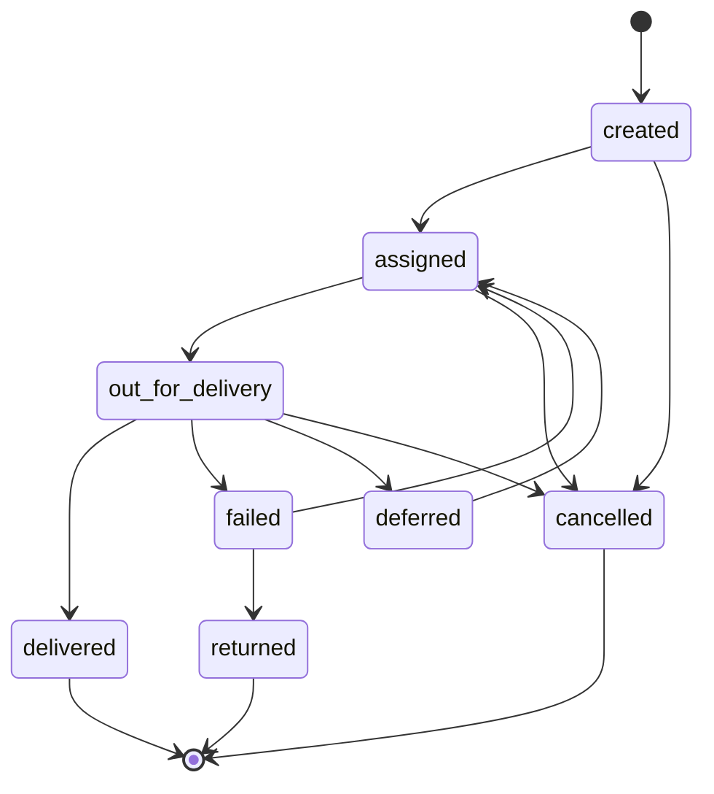

| الحالة | من ينقلها | الحدث | الشاشة |
|---|---|---|---|
| `created` | النظام أو `DEL_SUP` | `tms.task.created` | مهام التوصيل |
| `assigned` | **`DEL_MGR`** — حاجز INV-C4-1 | `tms.task.assigned` | خطة التوزيع |
| `out_for_delivery` | `DRIVER` — تلقائياً عند أول مسح | `tms.task.out_for_delivery` | مسح التحميل (تطبيق السائق) |
| `delivered` | `DRIVER` — بـPOD كامل وختم خادم | `tms.task.delivered` | تنفيذ المهمة |
| `failed` | `DRIVER` — بكود من القائمة المغلقة حصراً | `tms.task.failed` | تنفيذ المهمة |
| `assigned` ⟳ (محاولة 2) | `DEL_SUP` — مشروطة بـ`attempt_no < 2` | `tms.task.reassigned` | معالجة الفشل |
| `deferred` | `DRIVER` ثم `DEL_SUP` يعيدها بتاريخ جديد | `tms.task.deferred` | تنفيذ المهمة · خطة التوزيع |
| `returned` | **`DEL_SUP`** — إقفال المسار بعد المحاولة 2 | `tms.task.returned` | إقفال المسار |
| `cancelled` | **`DEL_MGR`** — من أي حالة قبل `delivered` | `tms.task.cancelled` | مهام التوصيل |

> `attempt_no` **عدّاد لا حالة** (OPS-22). و`deferred` كانت منصوصة في 40 §C4 وغائبة عن تعليق 01 — **أُضيفت إلى قيد `check` في 13B** (OPS-22)، ومُتحقَّق وجودها اليوم في القيد.

### 5.2 `tms.vehicles.status` — المركبة

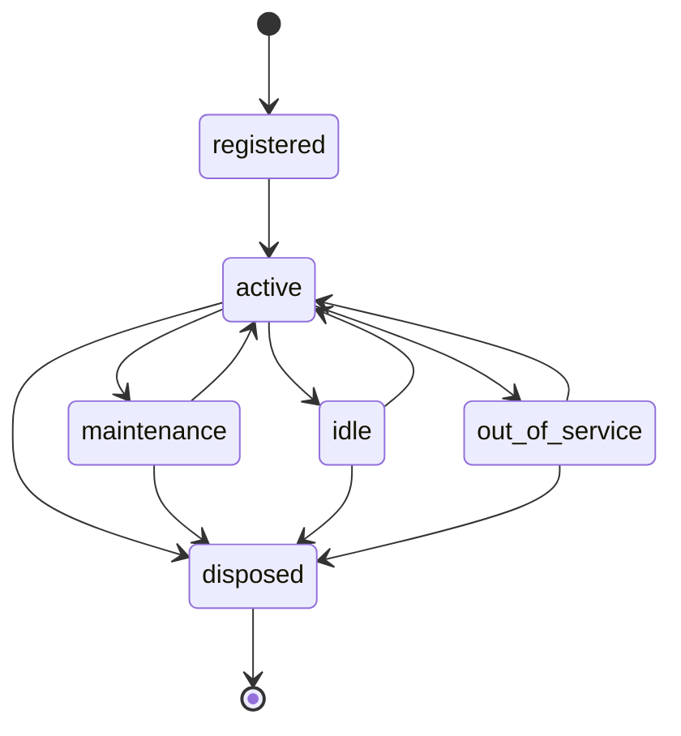

| الحالة | من ينقلها | الحدث | الشاشة |
|---|---|---|---|
| `registered` | `FLEET_MGR` — فعل الإنشاء | `tms.vehicle.registered` | ملف المركبة |
| `active` | `FLEET_MGR` | `tms.vehicle.activated` | ملف المركبة |
| `maintenance` | `FLEET_MGR` | `tms.vehicle.in_maintenance` | أوامر الصيانة |
| `idle` | `FLEET_MGR` — متاحة ولا تعمل، بلا سائق مسنَد | `tms.vehicle.idled` | لوحة الأسطول |
| `out_of_service` | `FLEET_MGR` — عاطلة بعطل فني | `tms.vehicle.out_of_service` | لوحة الأسطول |
| `active` ⟳ | `FLEET_MGR` — العودة للخدمة | `tms.vehicle.returned_to_service` | لوحة الأسطول |
| `disposed` | **`GM`** — **حالة نهائية** | `tms.vehicle.disposed` | ملف المركبة |

**وثيقة المركبة:** **لا عمود حالة** — الحالة مشتقّة من `expiry_date` بسلّم **90/45/30/15** يوماً، والحدث `hr.document.expiring` عند كل عتبة من الأربع.

### 5.3 `tms.maintenance_orders.status` — أمر الصيانة

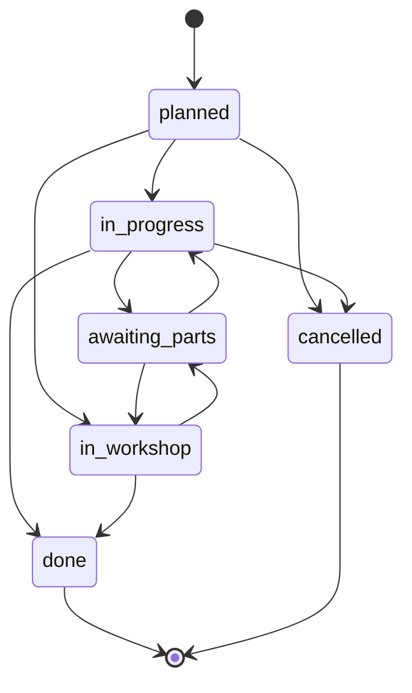

| الحالة | من ينقلها | الحدث | الشاشة |
|---|---|---|---|
| `planned` | `FLEET_MGR` — من خطة وقائية أو من بلاغ عطل | — | أوامر الصيانة |
| `in_progress` | `FLEET_MGR` — تنفيذ داخلي | — | أوامر الصيانة |
| `in_workshop` | `FLEET_MGR` — لدى ورشة شريكة (`workshop_partner_id`) | — | أوامر الصيانة |
| `awaiting_parts` | `FLEET_MGR` — بانتظار قطع بأمر شراء (`purchase_order_id`) | — | أوامر الصيانة |
| `done` | `FLEET_MGR` — `out_at` يولّد `downtime_hours` والتكلفة | — | أوامر الصيانة |
| `cancelled` | `FLEET_MGR` بسبب مسجَّل | — | أوامر الصيانة |

### 5.4 `tms.routes.status` — المسار اليومي

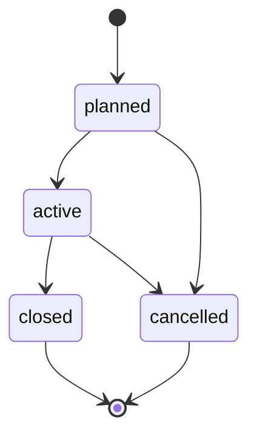

| الحالة | من ينقلها | الحدث | الشاشة |
|---|---|---|---|
| `planned` | `DEL_MGR` — بناء خطة اليوم السابق مساءً | — | خطة التوزيع |
| `active` | `DEL_SUP` / `DRIVER` — بدء المسار بأول مسح | — | مسح التحميل |
| `closed` | `DEL_SUP` — مساءً مع `actual_km` و`completed_stops` | — | إقفال المسار |
| `cancelled` | `DEL_MGR` بسبب مسجَّل | — | خطة التوزيع |

### 5.5 `partners.payable_events.status` — الحدث المستحق للشريك

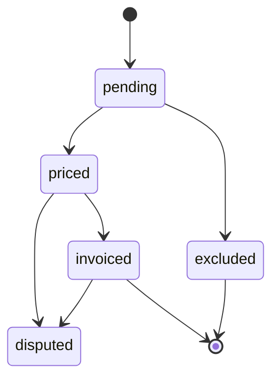

| الحالة | من ينقلها | الحدث | الشاشة |
|---|---|---|---|
| `pending` | النظام — عند إقفال العملية المنفَّذة بشريك | — | أحداث الشركاء |
| `priced` | النظام — من `partner_price_lines` | — | أحداث الشركاء |
| `excluded` | `CFO` بسبب مسجَّل | — | أحداث الشركاء |
| `invoiced` | النظام — عند ربطه بـ`partner_invoice_id` | — | فواتير الشركاء |
| `disputed` | `CFO` مع `dispute_reason` | — | فواتير الشركاء |

> **ملاحظة اتساق:** وثيقة 09 §4 تصف القائمة بـ`pending · priced · matched · invoiced · disputed`، بينما قيد `chk_payable_events_status` في القاعدة يسمح بـ`pending · priced · invoiced · excluded · disputed`. **القاعدة هي الحاكم** — و«المطابقة» في هذا التصميم **حالة على الفاتورة لا على الحدث** (§5.6). مسجَّلة في §13.

### 5.6 `partners.partner_invoices.status` — فاتورة الشريك

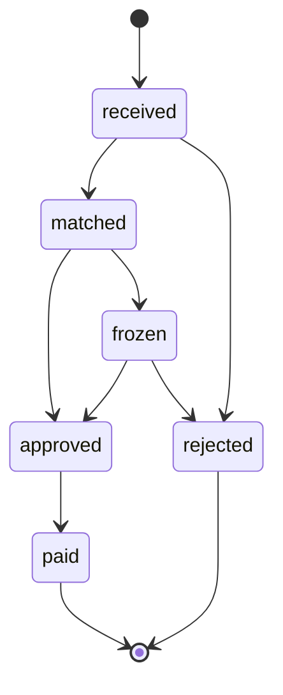

| الحالة | من ينقلها | الحدث | الشاشة |
|---|---|---|---|
| `received` | النظام أو `ACCOUNTANT` — استلام الفاتورة بـ`partner_ref` | — | فواتير الشركاء |
| `matched` | النظام — المطابقة الآلية بالأحداث · `matched_by` | — | فواتير الشركاء |
| `frozen` | النظام — **فرق > ٢٪** ⇒ تجميد الدفع + بند في صندوق القرارات | — | `/partners/invoices?variance=1` |
| `approved` | **`CFO`** — `approved_by` **≠** `matched_by` (قيد في القاعدة) | — | صندوق القرارات |
| `rejected` | `CFO` — بند بلا حدث لدينا مرفوض مهما صغر المبلغ | — | فواتير الشركاء |
| `paid` | `CFO` بعد القيد المحاسبي | — | الدفعات |

### 5.7 `partners.partner_contracts.status` — عقد الشريك

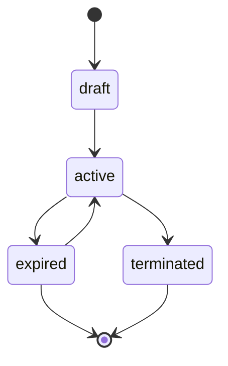

| الحالة | من ينقلها | الحدث | الشاشة |
|---|---|---|---|
| `draft` | `CFO` | — | عقود الشركاء |
| `active` | `CFO` — بعد اكتمال `liability_cap` و`insurance_by` و`penalty_recoverable` | — | عقود الشركاء |
| `expired` | النظام عند `end_date` — والتجديد إن `auto_renew` | — | عقود الشركاء |
| `terminated` | `CFO` بإشعار `notice_days` (افتراضي 30) | — | عقود الشركاء |

### 5.8 `hr.commission_daily.status` — كشف العمولة اليومي

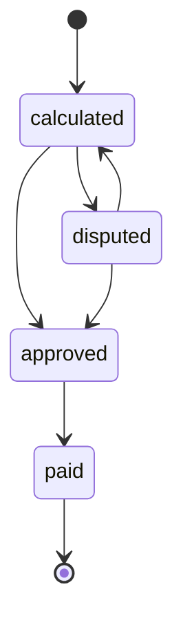

| الحالة | من ينقلها | الحدث | الشاشة |
|---|---|---|---|
| `calculated` | النظام ليلاً بلقطة مجمَّدة | — | الأرباح (تطبيق السائق) · `R-07` |
| `disputed` | `DRIVER` **خلال ٤٨ ساعة** مع `dispute_note` | — | الأرباح |
| `approved` | `DEL_SUP` — مراجعة الاعتراض · `confirmed_by` | — | مراجعة العمولات |
| `paid` | النظام عند ترحيل `payroll_period` | `hr.payroll.closed` | مسير الرواتب |

> **آلة حالات الدفع في تطبيق السائق ليست عموداً مخزَّناً** — هي مشتقّة من صفوف `tms.payment_attempts` (`method` · `gateway_status` · `confirmed_at` · `confirmed_by`) ومن مقارنة `cod_amount` بـ`cod_collected`. لا عمود `status` على الجدول، والحارس البنيوي الوحيد هو `link_needs_gateway`.

---

## 6. المستندات والنماذج

| المستند | السلسلة / المصدر | متى يُولَّد | ما يُطبع أو يُرسل | التوقيع |
|---|---|---|---|---|
| **مهمة التوصيل** | `TSK` من `platform.counters` (`<كيان>-TSK-#####`) | عند `tms.task.created` | مرجع داخلي | — |
| **مانيفست السائق** | من المسار | عند `tms.task.assigned` | يُطبع أو يُعرض في التطبيق | مسح التسليم |
| **المسار اليومي** | `RTE` (`<كيان>-RT-#####`) | عند بناء الخطة | لوحة المشرف | — |
| **إثبات التسليم POD** | `tms.proof_of_delivery` | عند `tms.task.delivered` | يُرسل للعميل في النافذة + رابط تتبّع · نسخة للمستلم | **توقيع المستلم أو صورته** + ختم خادم |
| **تقرير محاولة فاشلة** | من `tms.delivery_tasks` + السبب | عند `tms.task.failed` | تقرير يومي لـ`DEL_SUP` والعميل حسب العقد | — |
| **إشعار إرجاع** | من المهمة | عند `tms.task.returned` | نافذة العميل | مسح الاستلام في المخزن |
| **نموذج تسليم مركبة** | من `tms.vehicles` | عند `tms.vehicle.handed_over` | يُطبع ويُوقَّع | توقيع السائق ومدير الأسطول |
| **أمر الصيانة** | `tms.maintenance_orders.doc_no` — **✅ السلسلة `MNT` مبذورة (SCH-4 ق-20)** · البادئة `<كيان>-MN-` | عند `planned` | للورشة الداخلية أو الشريكة | اعتماد `approved_by` |
| **تقرير الحادث** | `tms.accidents.doc_no` — **✅ السلسلة `ACC` مبذورة (SCH-4 ق-20)** · البادئة `<كيان>-AC-` | خلال **٢٤ ساعة** من الواقعة | لشركة التأمين + الملف الانضباطي | صور إلزامية + تقرير شرطة |
| **كشف العمولة اليومي** | `hr.commission_daily` | ٠٧:٠٠ يومياً | شاشة الأرباح + `R-07` | إقرار السائق ضمنياً بانقضاء ٤٨ ساعة |
| **عقد الشريك** | `PCT` (`<كيان>-PCT-#####`) | عند `active` | يُطبع ويُوقَّع | الشريك + `CFO` |
| **فاتورة الشريك** | `PINV` (`<كيان>-PINV-#####`) مقابل `partner_ref` | عند الاستلام | ملف + تقرير مطابقة سطراً بسطر | `matched_by` ثم `approved_by` — **مختلفان** |
| **تقرير فرق المطابقة** | من `variance_amount` | عند فرق > ٢٪ | لـ`CFO` + بند في صندوق القرارات | — |
| **فاتورة العميل + ورقة التفصيل** | `INV` | إقفال الشهر | للعميل | اعتماد آلي ≤ 500 د.ك وإلا `CFO` |

> **ورقة التفصيل مع الفاتورة هي ما يمنع النزاعات:** تحصر كل حدث بتاريخه ومرجعه وسعره المطبَّق ومصدر ذلك السعر.

---

## 7. الضوابط والاعتمادات

**جدول الحدود:**

| البند | الحد | المعتمِد | المصدر |
|---|---|---|---|
| إسناد مهمة | وثائق سائق ومركبة سارية | **منع آلي** — لا معتمِد بشري | INV-C4-1 |
| إنشاء مهمة | `area, block, street, phone` مكتملة | **منع آلي — 422** | INV-C4-2 |
| سبب الفشل | كود من `tms.failure_reasons` حصراً | **منع آلي** | INV-C4-5 |
| الدفع الجزئي | **مرفوض مطلقاً** — لا اعتماد مشرف يبيحه | **لا أحد** | 35 §2-1 · قرار 3 |
| تجاوز سبب `shift_time_exhausted` | تجاوز بسبب مسجَّل يظهر في تقرير شهري | `DEL_SUP` / `DEL_MGR` | 35 §4-1 |
| إلغاء مهمة قبل التسليم | من أي حالة قبل `delivered` | **`DEL_MGR`** | 03 §0-7 |
| تسنيد مركبة بصيانة متأخرة > ١,٠٠٠ كم | تجاوز بسبب مسجَّل | **`FLEET_MGR`** | 27 §3 |
| استبعاد مركبة `disposed` | نهائي لا رجعة فيه | **`GM`** | 03 §0-8 |
| تحميل حادث على السائق | بعد تحقيق **و**بسقف `deductible` | **`GM`** عبر الملف الانضباطي D4 · المدير D3 | EXEC §1.3 · §1.6 |
| درجة الجزاء | مشرف D1–D2 · مدير D1–D3 · **`GM` D1–D4** · الفصل `GM` فقط | حسب الدرجة — والموقّع خارج سلطته **يُعاد توجيهه لأعلى** مع تسجيل `routed_to` | EXEC §1.6 · 40 §C7 |
| سقف الخصم الشهري | **٥ أيام** شهرياً عبر كل الموقّعين (المادة 38) | — | 40 §C7 |
| مهلة توقيع الجزاء | **١٥ يوماً** من ثبوت المخالفة (المادة 35) | — | 40 §C7 |
| مهلة التظلّم | **٧ أيام** من الإصدار — والتظلّم يذهب **مستوى واحد فوق الموقّع** | المستوى الأعلى | 03 §0-11 |
| إعفاء خصم السكن | بسبب مسجَّل | **`GM`** | EXEC §1.3 |
| تغيير قاعدة العمولة | الأساس والبونص مُثبَّتان FIXED | **`GM` بقرار مسجَّل** | EXEC §1.2 · §1.15 |
| ربط الترتيب بالمكافأة | `linked_to_bonus` | **`GM` بقرار مسجَّل** | 35 §8-3 |
| ربط الترتيب بالجزاء | **`linked_to_penalty = false` FIXED** | **لا أحد — يتطلب ADR مسجَّلاً** | EXEC §1.15 |
| ربط `driver_trust` بأجر أو جزاء | **ممنوع** | **لا أحد — يتطلب ADR مسجَّلاً** | ADR-28 · EXEC §1.15 |
| اعتماد فاتورة شريك بفرق ≤ ٢٪ | **اعتماد آلي** بلا تدخل بشري | النظام | 09 §5-1 |
| اعتماد فاتورة شريك بفرق > ٢٪ | تجميد ثم بتّ | **`CFO`** — و`approved_by ≠ matched_by` | 09 §5-1 · قيد القاعدة |
| عقد شريك بلا `penalty_recoverable` | استثناء | **`GM` بقرار مسجَّل** | 09 §10 البند 6 |
| `liability_cap` أدنى من القاعدة | استثناء | **`GM` بقرار مسجَّل** | 09 §7-1 |
| تسمية الشريك للعميل | **ممنوع مطلقاً** | **لا أحد** | EXEC §1.1 |

**فصل المهام (SoD) في هذا النطاق:**

| الزوج | القاعدة | كيف يُفرض |
|---|---|---|
| **المطابِق ≠ المعتمِد** لفاتورة الشريك | `matched_by <> approved_by` | **قيد `check` في القاعدة** — `matcher_ne_approver` |
| **السائق ≠ المؤكِّد للدفع الإلكتروني** | التأكيد من البوابة (`gateway_ref`) لا من السائق | **قيد `check`** — `link_needs_gateway` |
| **السائق ≠ مُخرج الشحنة من عهدته** | الخروج بمسح المستودع لا بضغطة في التطبيق | قاعدة تشغيلية مفروضة في مسار المسح |
| **(PRO, CFO)** | PRO يسجّل القبض · CFO يطابق البنك ويعتمد | `identity.sod_rules` + مشغّل |
| **لا اعتماد ذاتي** | `requester_id <> approver_id` — قيد حقيقي لا `check (true)` | EXEC §1.1 |

**الأربع عيون:** تغييرات الصلاحيات والأسرار وقواعد SoD وسلاسل الاعتماد تحتاج معتمِداً ثانياً (`DEPUTY_SYSADMIN` **أو** `CFO`) — فعّالة من اليوم الأول، لأن `GM = SYSADMIN` تركيز دور مقبول بضوابط تعويضية (G-06).

**ما يتطلب المدير العام حصراً:** استبعاد مركبة `disposed` · الفصل من الخدمة (D4) · إعفاء خصم السكن · تغيير قاعدة العمولة · ربط الترتيب بالمكافأة · عقد شريك بلا استرداد غرامة أو بسقف مسؤولية أدنى من القاعدة · إشعار دائن (لا اعتماد آلي إطلاقاً) · الإفراج عن حجز ائتماني · تصعيد التدقيق والعهدة بعد ٤٨ ساعة.

---

## 8. مؤشرات الأداء (KPI)

| المؤشر | التعريف الحسابي الدقيق | مصدر البيانات | الدورية | المالك | الهدف |
|---|---|---|---|---|---|
| **نسبة النجاح من أول محاولة** | عدد المهام `delivered` و`attempt_no = 1` ÷ عدد المهام المُقفلة `delivered + returned` × 100 | `tms.delivery_tasks (status, attempt_no)` | يومي ومجمَّع شهرياً | `DEL_MGR` | **≥ ٨٥٪** — شرط بونص الجودة وسقف غرامة SLA في عقود B2C |
| **نسبة التسليم في الموعد** | عدد المهام `delivered` بـ`completed_at ≤ time_slot_to` ÷ المهام ذات نافذة زمنية × 100 | `tms.delivery_tasks (completed_at, time_slot_to)` | يومي | `DEL_SUP` | يحدده GM لكل عقد |
| **نسبة التسليم اليومي DLD** | الشحنات المسلَّمة في اليوم ÷ الشحنات الخارجة للتوصيل × 100 | `tms.delivery_tasks` · `imile.shipments` | يومي | `DEL_MGR` | **≥ ٧٠٪** (الأساس ~٥٢٪) |
| **فرق COD** | مجموع `cod_amount − cod_collected` للمهام `delivered` بـ`is_cod` | `tms.delivery_tasks` · `tms.payment_attempts` · `billing.receipts` | يومي | `CFO` | **صفر** |
| **نسبة التسليم بمسح فعلي** | تسليمات مسبوقة بمسح باركود ÷ كل التسليمات × 100 | `tms.proof_of_delivery` + سجل المسح | أسبوعي | `DEL_SUP` | **≥ ٩٨٪** · وأي سائق تحت **٩٠٪** يُراجَع |
| **نسبة التسليم بلا اتصال** | تسليمات بلا صف في `contact_log` ÷ كل التسليمات × 100 | `tms.contact_log` × `tms.delivery_tasks` | شهري | `DEL_MGR` | **≥ ٨٥٪** — رقم قابل للبيع للعميل |
| **توزيع أسباب الفشل** | عدد المهام `failed` مجمَّعة بـ`failure_reason` ونسبتها | `tms.delivery_tasks.failure_reason` | شهري | `DEL_MGR` | يحدده GM — والغرض الترتيب لا العدد |
| **نسبة الفشل المنسوب للسائق** | المهام الفاشلة بسبب `counts_against_driver = true` ÷ مهام السائق المُقفلة | `tms.failure_reasons` × `tms.delivery_tasks` | شهري | `DEL_MGR` | يحدده GM · وأي سبب يُحتسب على **> ٣٠٪** من السائقين يُراجَع تصنيفه |
| **عمر العهدة الفاشلة** | ساعات بين `tms.task.failed` و`tms.task.returned` | `tms.delivery_tasks` + `platform.outbox` | يومي ١٦:٠٠ | `DEL_SUP` | **صفر شحنة > ٤٨ ساعة** |
| **تكلفة التوصيل للشحنة** | (تكلفة المركبة + الوقود + العمالة المخصّصة) ÷ عدد الشحنات المسلَّمة في الفترة | `billing.profitability (cost_vehicle, cost_fuel, cost_labour)` · `billing.cost_allocations` | شهري | `CFO` | يحدده GM |
| **تكلفة الكيلومتر لكل مركبة** | (صيانة + وقود) ÷ `actual_km` المتراكم للمركبة | `tms.maintenance_orders.total_cost` · `tms.fuel_ledger.amount` · `tms.routes.actual_km` | شهري | `FLEET_MGR` | يحدده GM |
| **زمن تعطّل الأسطول** | مجموع `downtime_hours` ÷ ساعات التشغيل المتاحة × 100 | `tms.maintenance_orders.downtime_hours` (مولَّد) | شهري | `FLEET_MGR` | يحدده GM |
| **كم/لتر لكل مركبة وسائق** | `km_since_last ÷ litres` بالمتوسط المرجَّح | `tms.fuel_ledger (km_per_litre)` | شهري | `FLEET_MGR` | يحدده GM · انحراف **> ٢٠٪** ⇒ `is_anomaly` |
| **مركبات بوثائق سارية** | المركبات `active` بلا وثيقة منتهية ÷ كل المركبات `active` × 100 | `tms.vehicles` × `tms.vehicle_documents` | أسبوعي | `FLEET_MGR` | **١٠٠٪** — بوابة جودة D09 |
| **تكلفة الحوادث لكل سائق** | مجموع `claim_amount + deductible` للحوادث المرتبطة بالسائق ÷ عدد شحناته | `tms.accidents` × `hr.employees` | ربعي | `FLEET_MGR` | يحدده GM — **مؤشر سلوك لا مالي فقط** |
| **نسبة الالتزام بالصيانة الوقائية** | أوامر `preventive` منفَّذة قبل تجاوز الاستحقاق ÷ كل الاستحقاقات × 100 | `tms.maintenance_orders` × `tms.maintenance_plans` | شهري | `FLEET_MGR` | يحدده GM |
| **هامش الخدمة المعاد بيعها** | (إيراد `billable_event` − تكلفة `payable_event` المرتبط) ÷ الإيراد × 100 | `partners.resale_margin` (عرض في القاعدة) | شهري | `CFO` | **مفتوح — انظر §13** |
| **نسبة الخدمات المُسندة للشركاء** | أحداث فوترة بشريك ÷ كل أحداث الفوترة × 100 | `partners.payable_events` ÷ `billing.billable_events` | شهري | `CFO` | يحدده GM — **الاعتماد المفرط خطر** |
| **نسبة استغلال السعة المحجوزة** | الكمية المستخدمة فعلاً ÷ `committed_qty` × 100 | `partners.partner_contracts` · `partners.payable_events` | شهري | `CFO` | **≥ ٧٠٪** — وتحتها ثلاثة أشهر متتالية يُراجَع الحجز |
| **فروق فواتير الشركاء** | عدد الفواتير بـ`variance_pct > 2` ÷ كل الفواتير المستلمة × 100 | `partners.partner_invoices (variance_pct)` | شهري | `CFO` | يحدده GM |
| **الإيراد الضائع من التوصيل** | مجموع القيمة التقديرية لأحداث `DL-11/12/13/14/18` غير المفوترة لغياب علم العقد | `billing.billable_events (status='pending')` × `sales.contracts` | شهري | `CFO` + `GM` | **صفر بعد جولة إعادة التفاوض** |

---

## 9. التقارير والتنبيهات المرتبطة

**التقارير (من سجل 25):**

| الكود | التقرير | المصدر | الدورية | المالك |
|---|---|---|---|---|
| `R-02` | أوامر اليوم والمتأخر | `wms.outbound_orders` · `tms.delivery_tasks` | يومي | `WH_MGR` + `DEL_MGR` |
| `R-03` | **مطابقة COD** | `tms.delivery_tasks` · `tms.payment_attempts` · `billing.receipts` | يومي | `CFO` |
| `R-07` | **عمولة السائقين أمس** | `hr.commission_daily` | يومي | السائق + المشرف |
| `R-09` | الوثائق المنتهية والقريبة | `hr.employee_documents` · `tms.vehicle_documents` | أسبوعي | الموارد (= `GM`) + `FLEET_MGR` + `PRO` |
| `R-11` | أداء SLA لكل عقد | `sales.sla_results` · `sales.contract_sla` | أسبوعي | `WH_MGR` + `DEL_MGR` |
| `R-13` | الربحية لكل عميل وعقد | `billing.profitability` · `cost_allocations` | شهري | `GM` + `CFO` |
| `R-14` | **الإيراد الضائع** | `billing.billable_events` بحالة `pending` + سبب الاستبعاد | شهري | `GM` + `CFO` |
| `R-19` | **تقييم الشركاء** | `partners.partner_invoices` · `service_allocations` · `resale_margin` | شهري | `CFO` + العمليات |
| `R-21` | حصيلة الجزاءات (المادة 40) | `hr.disciplinary_cases` · `hr.penalty_schedule` | شهري | `GM` + `CFO` |

**التنبيهات (من سجل 25 — كل تنبيه يحمل `source_query` و`action_label` و`action_link`):**

| الكود | التنبيه | المالك | التوقيت | الكبح | التصعيد | رابط الإجراء |
|---|---|---|---|---|---|---|
| `N-03` | **فرق COD غير مسوّى** | `CFO` + `DEL_MGR` | فوري | **٠ بلا كبح** · **مستثنى من ساعات الهدوء** | > ٤٨ س → `GM` | `/inbox?kind=cod_variance` |
| `N-05` | وثيقة مركبة تدخل درجة من سلّم **90/45/30/15** | `FLEET_MGR` | أسبوعي مجمّع | ١٦٨ س | ≤ ٧ أيام → يومي | `/fleet/documents?expiring=90` |
| `N-04` | وثيقة موظف تدخل درجة من السلّم نفسه | الموارد (= `GM`) + `PRO` | أسبوعي مجمّع | ١٦٨ س | ≤ ١٥ يوماً → يومي | `/hr/documents?expiring=90` |
| `N-10` | **فاتورة شريك بفرق > ٢٪** | `CFO` | فوري | **٠ بلا كبح** | > ٧ أيام → `GM` | `/partners/invoices?variance=1` |
| `N-17` | طلب اعتماد بلا بتّ فوق مهلته | المعتمِد من `approval_chains` | يومي | ٢٤ س | → المستوى الأعلى | `/inbox?kind=approval` |

**إشعارات تطبيق السائق الثمانية:**

| # | الإشعار | التوقيت |
|---|---|---|
| `N1` | شحنات جديدة أُضيفت لمسارك — العدد والمناطق | فوري |
| `N2` | **تم دفع الرابط — يمكنك التسليم** | فوري |
| `N3` | شحنة أُلغيت — لا تسلّمها | فوري |
| `N4` | موعد محدد بعد ٣٠ دقيقة | مجدول |
| `N5` | **لديك شحنات فاشلة لم تُرجَع** | **١٦:٠٠ يومياً** |
| `N6` | عمولة أمس جاهزة — **نافذة اعتراض ٤٨ ساعة** | **٠٧:٠٠** |
| `N7` | **وثيقتك تنتهي خلال ٩٠ / ٤٥ / ٣٠ / ١٥ يوماً** | **عند كل عتبة من الأربع** |
| `N8` | إنذار أو خصم جديد — **لديك ٧ أيام للتظلّم** | فوري |

---

## 10. الشاشات

| الشاشة | المسار | الدور | الغرض |
|---|---|---|---|
| **صندوق القرارات** | `/inbox` | كل الأدوار — مرشَّح بـ`assigned_role` | الصفحة الرئيسية: وقائع + أثر مالي + مجموعة إجراء واحدة، ويختفي البند بالبتّ |
| مهام التوصيل | `/tms/tasks` | `DEL_SUP` · `DEL_MGR` | قائمة المهام وإنشاؤها والاستثناءات |
| خطة التوزيع | `/tms/dispatch` | `DEL_MGR` | بناء خطة اليوم · الإسناد · التعليل |
| إقفال المسار | `/tms/routes` | `DEL_SUP` | إقفال المسار · معالجة الفشل · تسليم COD |
| مطابقة COD | `/inbox?kind=cod_variance` | `CFO` · `DEL_MGR` | تسوية الفروق النقدية |
| ملف المركبة | `/fleet/vehicles` | `FLEET_MGR` | الهوية · الوثائق · الصيانة · التكلفة · التدقيق |
| وثائق المركبات | `/fleet/documents?expiring=90` | `FLEET_MGR` | جدول تجديد الوثائق بسلّم ٩٠/٤٥/٣٠/١٥ |
| أوامر الصيانة | `/fleet/maintenance` | `FLEET_MGR` | الوقائية والعلاجية وقطع الغيار |
| الحوادث | `/fleet/accidents` | `FLEET_MGR` · `GM` | الواقعة · المطالبة · التحقيق · التحميل |
| دفتر الوقود | `/fleet/fuel` | `FLEET_MGR` | الاستيراد · المطابقة · الشذوذ |
| الشركاء وعقودهم | `/partners/contracts` | `CFO` | العقد · الأسعار · السقوف · التأمين |
| تخصيص الخدمات | `/partners/allocations` | `DEL_MGR` · `WH_MGR` | من ينفّذ ماذا لمن |
| فواتير الشركاء | `/partners/invoices?variance=1` | `CFO` | المطابقة · التجميد · النزاع |
| لوحة العمليات | `/dashboards/ops` | `DEL_MGR` · `WH_MGR` | واحدة من أربع لوحات مؤشرات فقط |
| **تطبيق السائق — عشر شاشات** | Premium Driver (React Native + Expo) | `DRIVER` | فحص الجاهزية · بدء الوردية · فحص المركبة · مسح التحميل · قائمة المهام · تنفيذ المهمة · العهدة · الأرباح · الأداء والترتيب · الملف والوثائق والجزاءات |
| **تطبيق المدراء** | Premium Decisions (React Native) | `DEL_MGR` · `FLEET_MGR` · `GM` | ثلاث شاشات: قرارات · ست بطاقات مؤشرات لكل دور · بحث وتتبّع — والبتّ من الإشعار بلا فتح التطبيق · **≤ ٢٥ م.ب** |

> **جرد الشاشات الإداري كله ٥٧ شاشة** (29 §6-3 · 40 §D1)، منها **٤٠ لا تُفتح في اليوم العادي** — تُفتح عند الاستثناء أو البحث. والبحث العام `Ctrl+K` على أي رقم يفتح شاشة التتبّع.

---

## 11. الجداول

**مخطط `tms` — ثلاثة عشر جدولاً (كلها مُتحقَّقة في القاعدة):**

| الجدول | الوصف |
|---|---|
| `tms.delivery_tasks` | مهمة التوصيل — السجل المركزي للنطاق: المصدر والعنوان والمستلم والنافذة الزمنية وحالة التحصيل والسائق والمركبة والمسار وعدّاد المحاولات وسبب الفشل والشريك المنفّذ وعلم العمل دون اتصال. |
| `tms.proof_of_delivery` | إثبات التسليم — وقت التسليم بختم الخادم واسم المستلم وصلته والتوقيع والصورة والإحداثيات ودقّتها ومعرّف الجهاز وبصمات `sha256` الثلاث وأعمدة الحفظ `legal_hold` و`retain_until`. |
| `tms.delivery_exceptions` | استثناءات التوصيل — نوع الاستثناء ووصفه وأدلّته وحلّه، وعلم `is_billable` الذي يغذّي `DL-13`؛ إدراج فيه يرفع الحجز القانوني على POD المهمة بمشغّل. |
| `tms.failure_reasons` | القائمة المرجعية المغلقة لأسباب الفشل — شجرة ذاتية المرجع بأب وابن، مع الإلزاميات المرافقة وعلم الفوترة وعلم النسبة إلى السائق. **٣٢ صفاً = ٧ آباء + ٢٥ ابناً · ٣ منها `counts_against_driver`.** |
| `tms.contact_log` | سجل اتصال السائق بالمستلم عبر التطبيق — القناة والاتجاه والتوقيت والردّ والمدة وكود القالب وتوقيت التسليم والقراءة ومرجع المزوّد والموقع والتكلفة. **حدّ الخصوصية: ما يجري عبر التطبيق فقط.** |
| `tms.payment_attempts` | محاولات الدفع — الطريقة والمبلغ المستحق والمدفوع ورابط الدفع ومهلته ومرجع البوابة وحالتها ومن أكّد؛ بقيد `link_needs_gateway` الذي يمنع إعلان دفع إلكتروني بلا مرجع بوابة. |
| `tms.routes` | المسار اليومي — التاريخ والسائق والمركبة والمناطق والتوقفات المخططة والمنفَّذة والكيلومترات المخططة والفعلية وأوقات البدء والانتهاء والحالة. |
| `tms.vehicles` | سجل المركبات — اللوحة والصنع والطراز والسنة والنوع والسعة وزناً وحجماً والتبريد ونوع الملكية والحالة والسائق والعميل المخصَّصين وقراءة العداد. |
| `tms.vehicle_documents` | وثائق المركبة — نوعها ورقمها وتاريخا الإصدار والانتهاء والملف ومهلة التنبيه؛ **الحالة مشتقّة من `expiry_date` لا مخزَّنة**. |
| `tms.maintenance_plans` | خطط الصيانة الوقائية لكل نوع مركبة — الفترة بالكيلومترات و/أو بالأيام **أيهما أسبق**، ومهلتا التنبيه، والتكلفة والساعات التقديرية. |
| `tms.maintenance_orders` | أوامر الصيانة — نوعها وقراءة العداد والعطل المبلَّغ والورشة الشريكة وأمر الشراء والحالة وأوقات الدخول والخروج، وأعمدة مولَّدة لزمن التعطّل وإجمالي التكلفة، والاستحقاق التالي. |
| `tms.accidents` | الحوادث — التوقيت والموقع والشدّة والطرف الثالث وتقرير الشرطة والصور والمطالبة التأمينية وحالتها ومبلغها وسقف التحمّل وخطأ السائق والملف الانضباطي والمحمَّل عليه وأمر الإصلاح، بقيد `charge_within_deductible`. |
| `tms.fuel_ledger` | دفتر الوقود — البطاقة والمركبة والسائق والتوقيت واللترات والمبلغ وقراءة العداد والمحطة والكيلومترات منذ آخر تعبئة والكفاءة وعلم الشذوذ وسببه والمصدر، بتفرّد يمنع الاستيراد المزدوج. |

**مخطط `partners` — ستة جداول وعرض واحد (كلها مُتحقَّقة في القاعدة):**

| الجدول | الوصف |
|---|---|
| `partners.partners` | سجل الشركاء والموردين — الكود والاسم والنوع والسجل التجاري والرقم الضريبي وبيانات التواصل والبنك ومهلة السداد والتقييم والحالة. |
| `partners.partner_contracts` | عقد الشريك — نوع العلاقة والمدة والتجديد التلقائي ومهلة الإشعار والكمية والتكلفة الملتزم بها والحد الأدنى للاستغلال وSLA ظهر لظهر واسترداد الغرامة وسقف المسؤولية والتأمين وحق الجرد. |
| `partners.partner_price_lines` | ملحق أسعار الشريك — **ما ندفعه نحن** لكل خدمة، بشرائح ونافذة صلاحية وتفرّد على `(العقد، الخدمة، بداية الشريحة)`. |
| `partners.service_allocations` | من ينفّذ ماذا لمن — العميل × الخدمة × الشريك × عقد الشريك، مع نطاق الموقع ونافذة الصلاحية وأولوية عند تعدّد الشركاء. |
| `partners.payable_events` | **نظير `billing.billable_events` تماماً** — الحدث المستحق للشريك بعميله وخدمته وكميته وسعر تكلفته، مربوطاً بحدث الفوترة المقابل عبر `billable_event_id` فيصير الهامش فورياً. |
| `partners.partner_invoices` | فاتورة الشريك الواردة — مرجعه مقابل ترقيمنا، والمبلغ المطالَب به والمطابَق والفرق المولَّد ونسبته والمعتمد والمدفوع، بقيد `matcher_ne_approver`. |
| `partners.resale_margin` *(عرض)* | هامش الخدمة المعاد بيعها — يشتقّه من ربط `payable_events.billable_event_id` بـ`billing.billable_events`. |

**جداول من مخططات أخرى يتوقف عليها هذا النطاق:**

| الجدول | الوصف |
|---|---|
| `hr.commission_daily` | الحساب اليومي المجمَّد لعمولة السائق — صف واحد لكل يوم وموظف، بالأعداد والعمولة الإجمالية والخصومات الأربعة المفكَّكة والصافي المولَّد ولقطة الأرقام المجمَّدة وحالته وفترة الرواتب. |
| `hr.commission_rules` | قاعدة الاحتساب — السعر الثابت للوحدة (0.300) ومعدّل البونص (0.050) وشرطه بصيغة `jsonb`، بنافذة صلاحية وإمكان قاعدة خاصة بعميل. |
| `billing.billable_events` | الحدث القابل للفوترة — مصدره ومرجعه وخدمته وكميته وسعره ومصدر السعر وحالته، بتفرّد `(source_table, source_id, service_id)`. |
| `billing.profitability` | ربحية العميل والعقد بالفترة — الإيراد مقابل تكاليف العمالة والوقود والمساحة والمركبات وغيرها وغرامات SLA، بهامش مولَّد. |
| `platform.outbox` | **الجدول الحاكم للأحداث** — كل انتقال حالة في النطاق يُكتب فيه، وما يحمل مشتركين منه هو حدث مجال. |
| `platform.thresholds` | الحدود العددية التي يحرّرها `GM` بلا نشر — ومنها كل أرقام هذا النطاق. |
| `platform.decisions` | السجل المركزي لبنود صندوق القرارات — بند التجميد وبند التصعيد وبند تسوية COD. |

---

## 12. سيناريوهات القبول المغطاة

| الكود | السيناريو | ما يثبته في هذا النطاق |
|---|---|---|
| **S3** | **توصيل استهلاكي B2C بـSLA** | العميل `SHOP` بعلم `bills_failed_attempt = true` ومهمة عليها محاولتا اتصال؛ فشل بالسبب `no_answer.no_response` ⇒ **يُنشأ `DL-11`** و**`counts_against_driver = false`**. ومهمة بمنطقة `Salmiya` بلا قطعة ولا شارع ⇒ **422 تُعدّد الحقول الناقصة**. |
| **S8** | **عميل متعثّر** | العميل على حجز ائتماني: أوامر الصرف الجديدة تُرفض، **ومهام التوصيل الجديدة تُرفض بالسبب نفسه** — والحجز على مستوى المجموعة لا الكيان. |
| **S6** | **عميل متعدد الكيانات** | فاتورة PST متأخرة تدفع الانكشاف فوق الحد ⇒ `credit_hold = true` ⇒ **مهمة توصيل PDL جديدة تُرفض بسبب «حجز ائتماني»**. |
| **S11** | **تجديد عقد** | ملف التجديد يعرض **٣٤٠ محاولة فاشلة و١٨٠ إرجاعاً** بلا علم عقدي خلال ١٢ شهراً، بقيمتها التقديرية — وهو ما يبرّر إدراج `DL-11`/`DL-12`. |
| **S15** | **إنهاء خدمة سائق** | الموظف يحمل معرّف iMile وجهاز PDA وسلفة معلّقة ⇒ **إغلاق الإسناد آلياً وتحرير المعرّف**، و**إخلاء الطرف محجوب** حتى إعادة الجهاز وتسوية السلفة — ومنه تحرير العهدة والبطاقة. |
| **S18** | **تخزين لدى شريك** | ٢٠٠ منصة بتكلفة 1.800 وسعر 2.600 ⇒ **حدث فوترة وحدث مستحق مرتبطان**، و`resale_margin` يعرض **٣٠٫٨٪**؛ وفاتورة شريك تطالب بـ8,400 مقابل 7,900 مطابَقة ⇒ **تجميد الدفع**. |
| **S19** | **توصيل بالباطن في ذروة موسمية** | ثلاثة إثباتات: (١) شحنة يعيدها الشريك **بلا GPS أو توقيع/صورة أو اسم مستلم ⇒ لا تُقفل، تُرفض وتُعاد للشريك**؛ (٢) فرق COD يومي **45.000 د.ك ⇒ تجميد التسوية وبند قرار بمهلة ٤٨ ساعة**؛ (٣) ٢,٨٠٠ شحنة بسعر عميل 1.400 وتكلفة شريك 0.950 ⇒ **هامش 0.450 للشحنة**، و**٦٠ شحنة فاشلة لا تُدفع للشريك** بينما **`DL-11` عنها تُفوتَر للعميل**. |
| **S20** | **نزاع على فاتورة شريك** | مطالبة 8,400 مقابل 7,900 ⇒ الفرق **500 د.ك = ٦٪ فوق عتبة ٢٪** ⇒ **تجميد آلي** وتقرير سطراً بسطر يحصر ٢٠٠ منصة لخمسة أيام تداخل ورسم مناولة غير متعاقد عليه 180 د.ك ⇒ **اعتماد 8,220 وبقاء 180 نزاعاً**، و**إشعار دائن من الشريك قبل الإفراج عن الدفع**، و**خفض تقييم الشريك ودخول الواقعة ملف التجديد**. |

---

## 13. فجوات مرصودة وقرارات مطلوبة

> **الحالة بعد SCH-4** هي العمود الحاكم. البند لا يُحذف بعد إغلاقه. الرموز: **✅ أُغلق في 13B** · **⏳ قرار GM** · **↷ مهمة WBS** · **✗ بلا نص يغطيه**. السجل الموحّد في **`09-Gap-Register.md`**.

| # | الفجوة (كما رُصدت) | الوصف | الحالة السابقة | **الحالة بعد SCH-4** |
|---|---|---|---|---|
| **1** | **الحد الأدنى لهامش الخدمة المعاد بيعها** | `[GM DECISION REQUIRED]` — حدّ الهامش العام (١٥٪ تحذير · < ١٠٪ يحتاج `GM`) موضوع **للعقد ككل** لا للخدمة المعاد بيعها منفردةً؛ **وبيع خدمة شريك بهامش سالب ممكن اليوم بلا حارس**. أثره مباشر على مؤشر «هامش الخدمة المعاد بيعها» في §8 الذي يبقى بلا هدف. | موثّقة في 09 §10 البند 2 — **مفتوحة** | **⏳ قرار GM** · لا حارس يمنع هامشاً سالباً؛ مؤشر «هامش الخدمة المعاد بيعها» يبقى بلا هدف (Gap-Register #9) |
| **2** | **من يطابق فاتورة الشريك ومن يعتمدها** | `[GM DECISION REQUIRED]` — لا زوج فصل مهام يغطيه في EXEC §1.6، و40 §C6 يصف المطابقة الآلية بلا تسمية دورين. **الضابط الأدنى المطبَّق حتى الحسم:** قيد `matcher_ne_approver` يمنع أن يكون المطابِق هو المعتمِد — لكنه لا يسمّي الدورين. | موثّقة في 09 §10 البند 3 — **مفتوحة** | **⏳ قرار GM** · `matcher_ne_approver` مطبَّق ولا يسمّي الدورين (Gap-Register #10) |
| **3** | **لا جدول للورديات والحضور في القاعدة** | مخطط `hr` يحوي ١٣ جدولاً ولا يوجد فيها جدول ورديات ولا حضور. لكن التصميم يتطلب: بدء وردية ببصمة وجه، وعَلَم `offline_start` (EXEC §1.9)، وحالة إقفال الوردية بشرط «الطابور = صفر»، وحواجز إقفال اليوم الخمسة، و~~التكامل `I-04` للبصمة~~ (SUPERSEDED — ADR-0003 · D-126: البصمة أصلية؛ حوامل الحضور مطلوبة في SCR-HR-ATT-01). **لا يوجد اليوم حامل لأي من هذه القيم في القاعدة.** | **اكتُشفت في هذه المراجعة** — تحتاج صفّاً في `_changelog/OPS-SCHEMA-NEEDS.md` | **✗ بلا نص يغطيه** · لا جدول ورديات ولا حضور، و**لا أعمدة منصوصة** في أي وثيقة حاكمة. الوضع المؤقت: `offline_start` وحواجز إقفال اليوم بلا حامل في القاعدة — يحتاج قرار GM بنقلها إلى 13B (Gap-Register #7 · #17) |
| **4** | **لا سجل لأجهزة الميدان وربطها بالمستخدم** | G-07 (EXEC §1.9) يفرض: جهاز واحد لكل سائق (`device → user`) · مفتاح توقيع للجهاز · تجديد رمز كل ٣٠ يوماً · **إبطال فوري للجهاز المفقود وحجر طابوره لمراجعة المشرف**. `admin.assets` + `admin.asset_custody` يغطيان عهدة جهاز PDA كأصل، **ولا يغطيان تسجيل الجهاز الشخصي ولا مفتاح التوقيع ولا حجر الطابور**. | **اكتُشفت في هذه المراجعة** | **✗ بلا نص يغطيه** · لا سجل أجهزة ميدان؛ `admin.assets`/`asset_custody` يغطيان العهدة لا التسجيل ولا مفتاح التوقيع ولا حجر الطابور (Gap-Register #18) |
| **5** | **لا سلسلة ترقيم مبذورة لأمر الصيانة ولا لتقرير الحادث** | `tms.maintenance_orders.doc_no` و`tms.accidents.doc_no` كلاهما `not null` بتفرّد `(entity_id, doc_no)`، بينما بذرة `platform.counters` في 01 تحمل ٢٢ نوع مستند ليس فيها نوع لأمر الصيانة ولا للحادث. **أي إدراج سيفشل بـ«عدّاد غير معرّف» من الدالة نفسها.** | **اكتُشفت في هذه المراجعة** | **✅ أُغلق في 13B (ق-20)** · السلسلتان مبذورتان: **`MNT`**(`MN`) لأمر الصيانة و**`ACC`**(`AC`) لتقرير الحادث، لكل كيان من الخمسة. الاختبار S4-1: `next_doc_no` يعيد `PDL-MN-00001` و`PDL-AC-00001` بعد أن كان يفشل بـ«عدّاد غير معرّف» |
| **6** | **تعارض قائمة حالات `payable_events` بين 09 والقاعدة** | 09 §4 يصف `pending · priced · matched · invoiced · disputed`، والقيد في القاعدة يسمح بـ`pending · priced · invoiced · excluded · disputed`. الفرق: `matched` مقابل `excluded`. **القاعدة هي الحاكم**، و«المطابقة» في هذا التصميم حالة على الفاتورة لا على الحدث — **يلزم تصحيح نصّ 09 لا تغيير القاعدة**. | **اكتُشفت في هذه المراجعة** | **↷ مهمة WBS (تصحيح وثائقي)** · القاعدة هي الحاكم: `pending · priced · invoiced · excluded · disputed`. التصحيح في نصّ 09 خارج نطاق 13B (SCH-4 §3-4) |
| **7** | **لا قائمة مغلقة لـ`delivery_exceptions.exception_type`** | العمود `not null` بلا قيد `check` ولا جدول مرجعي، بينما هو **المصدر الوحيد لحدث الفوترة `DL-13` (انتظار المركبة)** عبر `is_billable`. نصّ مفتوح في حقل يولّد إيراداً يفتح الباب لما أُغلق في `failure_reasons`. | **اكتُشفت في هذه المراجعة** | **✅ أُغلق في 13B** · `chk_delivery_exceptions_type` مطبَّق على العمود — فلم يعد نصّاً حرّاً في حقل يولّد إيراد `DL-13` |
| **8** | **لا مصدر لإهلاك المركبة والتأمين والرخص في معادلة تكلفة المركبة** | 27 §4 يعرّف تكلفة المركبة الشهرية بأنها «إهلاك + تأمين + صيانة + وقود + رخص». الصيانة والوقود متاحان في القاعدة، و`billing.profitability.cost_vehicle` موجود، **لكن لا جدول إهلاك ولا حامل لأقساط التأمين والرخص**؛ `admin.assets` يحمل `purchase_value` و`purchase_date` بلا جدول إهلاك. **المؤشر قابل للحساب جزئياً فقط.** | **اكتُشفت في هذه المراجعة** | **✗ بلا نص يغطيه** · لا جدول إهلاك ولا حامل لأقساط التأمين والرخص؛ معادلة 27 §4 تبقى قابلة للحساب جزئياً (الصيانة والوقود فقط) — Gap-Register #19 |
| **9** | **معامل صعوبة المنطقة = 1.0 حتى المرحلة 3 + ٩٠ يوماً** | قاعدة التقييم العادل في 35 §8-2 تنصّ على «تعديل حسب صعوبة المنطقة: معامل لكل منطقة»، والقيمة المعتمدة حتى الحسم **1.0 لكل المناطق** — أي **بلا تعديل فعلي** — وتُحسب من بيانات ٩٠ يوماً بعد المرحلة 3. حتى ذلك الحين يبقى الترتيب بين الأقران غير معدَّل بالصعوبة. | **مقصودة ومعلنة** — EXEC §1.2 «No guessing» · 35 §12-2 البند 3 | **⏳ مقصودة ومعلنة** · المعامل يبقى `1.0` لكل المناطق حتى المرحلة 3 + ٩٠ يوماً؛ لم يُمسّ في SCH-4 |
| **10** | **`driver.*` غير مبذورة في `platform.settings`** | الحدود العددية للتوصيل **كلها مبذورة ومُتحقَّقة** في `platform.thresholds` (١٤ مفتاحاً)، لكن الإعدادات السلوكية التسعة (`driver.contact.provider` · `driver.payment.gateway` · `driver.payment.allow_partial` · مفاتيح `driver.ranking.*` الستة) **غير موجودة في `platform.settings` اليوم** — الجدول يحمل ثلاثة مفاتيح مستودعية فقط. البذرة موصوفة حرفياً في 35 §8-3 و§12-1 ولم تُطبَّق. | **اكتُشفت في هذه المراجعة** | **✅ أُغلق في 13B (ق-32)** · الإعدادات التسعة مبذورة في `platform.settings` بقيمها المنصوصة — مُتحقَّق في القاعدة. والجدول صار **١٤ مفتاحاً** لا ثلاثة |

> **لا فجوة من العشر تمنع بدء البناء.** الأولى والثانية قراران للمدير العام؛ والثالثة والرابعة والخامسة والسابعة والعاشرة بنود مخطط تُسجَّل لوكيل المخطط؛ والسادسة تصحيح نصّي في وثيقة مرجعية؛ والثامنة نطاق محاسبي خارج هذا النطاق؛ والتاسعة معلنة بقيمتها المؤقتة.

> **الحصيلة بعد SCH-4:** **أُغلق ثلاثة** من العشر في المخطط — **5** (السلسلتان `MNT` و`ACC`) و**7** (قيد `delivery_exceptions.exception_type`) و**10** (الإعدادات السلوكية التسعة). **بقي سبعة:** **1** و**2** و**9** ⏳ قرار GM · **6** ↷ تصحيح وثائقي · **3** و**4** و**8** ✗ بلا نصّ يغطيها — وهذه الثلاث هي الوحيدة التي تمسّ قدرة كاملة لا عموداً، وتحتاج قرار GM بنقلها إلى المخطط أو شطب الوعد المرتبط بها.
