# تشغيل iMile والكول سنتر — خريطة هيكلية
**PG-EOS v4 · D-blueprints · 21/09/2026 · المصادر: 07 (كاملةً) · 10 §10–§20 · 03 §0-9/§0-12/§6 · 23 I-01/I-02 · 04 §و · 05 س4/س5 · 12 س16 · 40 §C5/§C7/§C8/Part E · 25 · 29 §5-2 · 22 §D10 · EXECUTION-MASTER-v4 §1.2/§1.12 (ADR-27)/§1.13 (ADR-28) · SQL: 01 قسما `imile` و`cc` · 13B**

---

## 1. الغرض والنطاق

هذا النطاق يدير **تشغيل محطة iMile في ميناء عبدالله** — وهي أكبر عميل توصيل بالجملة، وشحناتها تصل عبر بوابته لا عبر نظامنا — و**مركز الاتصال PCC** الذي يخدم كيانات المجموعة وعملاء خارجيين معاً.

المبدأ الحاكم الأول: **النظام هو الواجهة التشغيلية، وبوابة iMile في الخلفية** — عدا الجرد الذي يحتاج مطابقة مزدوجة لأنه الموضع الوحيد الذي يكون فيه نظام العميل هو المرجع.
المبدأ الحاكم الثاني: **الاستقلالية مكتسبة لا ممنوحة** — ما يُثبت دقته بالقياس يُؤتمت بشروط مكتوبة وقابلة للتنزيل الفوري، و**الرفض يبقى بشرياً دائماً، والبوابة G3 لا تُغلق آلياً إطلاقاً**.

الكيانات المُدارة: **الشحنة في المحطة** `imile.shipments` · **خطة الفرز اليومية** `imile.sorting_plans` · **مشكلة التدقيق الحي** `imile.dtl_problems` · **الجرد اليومي** `imile.daily_inventory` · **معرّف السائق وإسناده الزمني** `imile.driver_ids` / `driver_id_assignments` · **الطابور والمكالمة والتذكرة** `cc.queues` / `cc.calls` / `cc.tickets`.

المستخدمون: `DEL_MGR` (مالك قرار التدقيق الحي واعتماد الخطة ومجال معرّفات iMile) · `DEL_SUP` (الفرز والتسليم والاستثناءات) · مدقّق التدقيق الحي · `CC_MGR` (الطوابير واتفاقيات الخدمة والتصعيد) · `CC_AGENT` (المكالمات والتذاكر) · `SYSADMIN` (صحة الوكيل والتكاملات) · `GM` (التصعيد بعد ٤٨ ساعة).

---

## 2. خريطة النطاق

#### خريطة 5-1: من بوابة iMile إلى قرار مُنفَّذ
تقرأ من بوابة العميل على اليسار إلى القرار المُعاد إليها على اليمين.

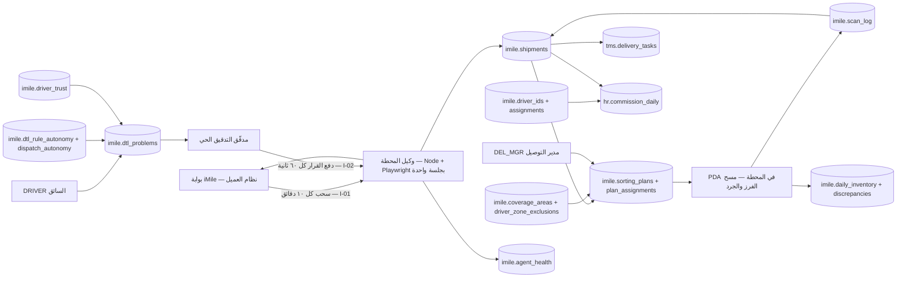

**شرح الخريطة:**
1. لا واجهة برمجية لدى iMile، فالوكيل المحلي يحمل الجلسة ويسحب البيانات كل **١٠ دقائق** ويدفع قرارات التدقيق كل **٦٠ ثانية**.
2. الشحنة تدخل `imile.shipments` بحالة `expected` قبل وصولها المادي، فيبدأ الفرز فور التفريغ لا بعده.
3. خطة اليوم تُبنى من الشحنات المتوقَّعة والمرحّل، بالتقاطع مع خريطة المناطق والتجاور وقوائم الاستبعاد.
4. الفرز **A3**: المسح يجيب خلال أقل من ثانية بالقفص والمنطقة والسائق؛ لا خطوة بشرية في المسار السعيد.
5. الشحنة تُربط بمهمة توصيل في `tms.delivery_tasks`، فتدخل دورة التوصيل القياسية.
6. مشاكل السائقين تمرّ ببوابات تقييم خمس، والقرار يعود إلى البوابة عبر الوكيل نفسه.
7. الاستقلالية والثقة جدولان يقيّدان ما يجوز إغلاقه آلياً — لا يوسّعانه.
8. النسبة إلى السائق البشري تمر **دائماً** بجدول الإسناد الزمني، وعليها تُبنى العمولة.

#### خريطة 5-2: الكول سنتر — من المكالمة إلى الفوترة
تقرأ من المكالمة الواردة إلى حدث الفوترة الشهري.

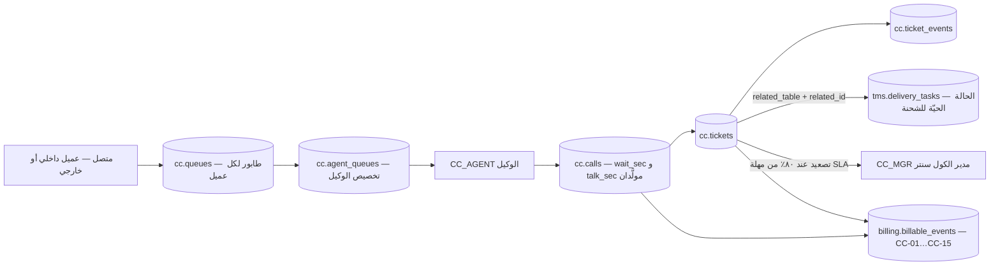

**شرح:** الطابور هو وحدة العزل التجارية والأمنية معاً: لكل عميل طابوره، والوكيل لا يرى إلا طوابيره المخصَّصة. التذكرة عن شحنة تُربط بمهمة التوصيل مباشرةً، **فالوكيل يرى حالة الشحنة الحقيقية ولا يسأل عنها**. والفوترة تخرج من العدّادين نفسيهما: المكالمات المُجابة ودقائق المحادثة.

---

## 3. البيانات الرئيسية (Master Data)

| العنصر | الجدول | المالك (المنصب) | بوابة الجودة / الاكتمال | من يعدّل |
|---|---|---|---|---|
| **معرّفات iMile** (D10) | `imile.driver_ids` | مدير التوصيل `DEL_MGR` | **كل معرّف بحالته وإسناده الزمني** — الهدف «صفر شحنة بلا سائق منسوب» (22 §D10 · حالياً 🟡 جزئي) | `DEL_MGR` |
| **إسناد المعرّفات** | `imile.driver_id_assignments` | `DEL_MGR` | **إسناد نشط واحد لكل معرّف، وواحد لكل موظف** — مفروض بفهرسين جزئيين فريدين | `DEL_MGR` — والمعتمِد **مفتوح** (§13) |
| **خريطة المناطق والتجاور** | `imile.coverage_areas` | مشرف التوصيل `DEL_SUP` | `code` فريد · `adjacent_codes` غير فارغ للمناطق المتجاورة · `is_rotation` لمناطق التدوير · `daily_capacity_hint` | صلاحية `platform.reference.manage` |
| **قوائم استبعاد السائق × المنطقة** | `imile.driver_zone_exclusions` | `DEL_SUP` | `reason` إلزامي (شكوى سابقة · عدم إلمام) + نافذة صلاحية | `DEL_SUP` |
| **مستويات الاستقلالية — التدقيق** | `imile.dtl_rule_autonomy` | `DEL_MGR` | صف لكل (نوع مشكلة × نوع قرار) · `level ∈ {0,1}` · **`decision_kind` لا يقبل إلا `accept` و`reclassify`** | النظام بالترقية والتنزيل · `promoted_by` بشري |
| **مستوى الاستقلالية — التوزيع** | `imile.dispatch_autonomy` | `DEL_MGR` | صف واحد لكل `scope` · `level ∈ {0,1}` | النظام بالترقية والتنزيل |
| **درجة ثقة السائق** | `imile.driver_trust` | `DEL_MGR` | مجموع الأوزان = 1.0000 · القيمة محصورة [0,1] · تاريخ ٢٤ شهراً | النظام ليلاً ٠١:٤٠ — **لا تحرير بشري** |
| **الطوابير** | `cc.queues` | مدير الكول سنتر `CC_MGR` | **١٠٠٪ عملاء خارجيين بعقد وSLA** (22 §M06) · `target_answer_sec` و`target_abandon_pct` لكل طابور | `CC_MGR` |
| **الوكلاء وتخصيصهم** | `cc.agents` · `cc.agent_queues` | `CC_MGR` | لغات الوكيل ومستوى مهارته · أولوية الطابور | `CC_MGR` |
| **العتبات الست عشرة لـADR-27** | `platform.thresholds` | `GM` | ثمانية مفاتيح `dtl.*` وثمانية `dispatch.*` — **مُتحقَّق وجود الستة عشر جميعاً في القاعدة** | `GM` بلا نشر |
| **مستوى الأتمتة لكل عملية** | `platform.automation_rules` | `GM` | الحامل الرسمي لمستوى A0–A3 — **✅ مبذور بـ٩ صفوف** (`AR-H01…AR-H09`، كل النقاط البشرية بالاسم · SCH-4 ق-32)؛ **↷ الأربعون عملية `A2`/`A3` لم تُبذر بعد** (WBS 0.10 · §13) | `GM` |

---

## 4. العمليات

### 4.1 وكيل المحطة — السحب والدفع والفشل والطابور اليدوي (IMI-01)

**المدخل:** بوابة iMile، بلا واجهة برمجية، وبقيد حاكم: **جلسة واحدة فقط**.

**القيد المكتشف ميدانياً:** حساب التدقيق يعمل بجلسة واحدة؛ **الدخول من متصفح آخر يُسقط جلسة الوكيل**. ولهذا:
- **حساب iMile مخصّص للوكيل لا يستخدمه أحد** — قرار مُغلق.
- كل تشغيل وتدقيق عبر **مشغّل الواجهة عن بُعد داخل جلسة الوكيل** (`remote UI operator`).
- تنبيه فوري عند سقوط الجلسة.

**مواصفة الوكيل كاملةً:**

| البند | القيمة المعتمدة |
|---|---|
| التقنية | **Node + Playwright** · المسار `services/agent` · جهاز صغير في المحطة |
| الحساب | **مخصّص للوكيل** · جلسة واحدة — أي دخول آخر يُسقطها |
| **السحب** (I-01) | **كل ١٠ دقائق**: المخزون · المعلّق · الواصل · أداء السائقين · كشف وصول الفريش |
| **دفع قرارات التدقيق** (I-02) | **كل ٦٠ ثانية** |
| نبض الصحة | مستمر في `imile.agent_health`: صلاحية الجلسة · آخر سحب · الدفعات المعلّقة · إصدار المحرّك · رسالة الخطأ |
| التفرّد | `tracking_no` + `scan_type` + التاريخ |
| **الفشل** | **٣ محاولات** ثم **الطابور اليدوي** `platform.integration_queue` + تنبيه فوري لمدير التوصيل |
| **توقف > ١٥ دقيقة** | تنبيه **`N-01`** إلى `DEL_MGR` — فوري + واتساب · **مستثنى من ساعات الهدوء** |
| **توقف > ٦٠ دقيقة** | **تصعيد إلى `GM`** |
| **البديل اليدوي** | تصدير CSV من البوابة ورفعه — **يُختبر مرة شهرياً** |
| الحماية من تغيّر الواجهة | اعتماد **نقاط البيانات لا الشاشات** · اختبار يومي ٠٠:٣٠ |
| البنية التحتية | إنترنت ثابت + UPS + **جهاز احتياطي مُهيَّأ** |
| **الحل الجذري** | **طلب واجهة برمجية رسمية من iMile** — **يصوغه `pg-scribe` في المرحلة 3 ويرسله `GM` بتوقيعه**؛ ولا API قبل ورود ردّ رسمي، والوكيل يبقى المسار الوحيد حتى حينه |

**الطابور اليدوي — الحدّ المراقَب:** التنبيه **`N-19`** يشتعل عندما يتجاوز الطابور **٢٠ سجلاً** أو يتجاوز عمر أقدم سجل **٤٨ ساعة**؛ المالك هو مالك التكامل من `integration_config.owner_role`، والتصعيد بعد **٧٢ ساعة** إلى `SYSADMIN` ثم `GM`. والتنبيه **`N-22`** يشتعل لأي تكامل بلا تشغيل ناجح **٢٤ ساعة**.

**المخرج:** صورة محدَّثة لحالة المحطة في نظامنا كل عشر دقائق، وقرارات مُنفَّذة في بوابة العميل خلال دقيقة من اتخاذها.

**القواعد المفروضة برمجياً — الوكيل:**

| القيد / المشغّل | الحد وقيمته | المصدر |
|---|---|---|
| تفرّد الشحنة | `shipments_tracking_no_key` — رقم التتبّع فريد | القاعدة |
| تفرّد المسح | `tracking_no + scan_type + التاريخ` | 23 I-01 |
| حد التنبيه | **١٥ دقيقة** توقفاً ⇒ `DEL_MGR` · **٦٠ دقيقة** ⇒ `GM` | 40 §C8 · 07 §2-1 |
| حد الطابور اليدوي | **> ٢٠ سجلاً أو > ٤٨ ساعة** ⇒ `N-19` | 25 · 23 §4 |
| قاموس التكاملات | `integration_runs.integration_code` و`integration_queue.integration_code` يرجعان إلى `platform.integration_config.code` بالرموز `I-01…I-11` | 23 (PLT-26) |
| العمل دون اتصال في المحطة | `chk_imile_scan_log_offline_has_date` — كل مسح `entered_offline` يحمل `original_occurred_at` | 13B |

---

### 4.2 الفرز الآلي — مستوى الأتمتة A3 (IMI-02)

**المدخل:** وصول دفعة الفريش إلى المحطة (موعد غير ثابت، نحو الساعة ٠٤:٠٠).

**الخطوات:**

1. **كشف الوصول** — الوكيل يرصد تغيّر الحالة في البوابة.
2. **التحميل المسبق** — النظام يكون قد حمّل قائمة الشحنات المتوقَّعة **قبل الوصول**، بحالة `expected`.
3. **المسح عند التفريغ** — `WH_OP`/`DEL_SUP` على PDA · مسح البوليصة · **النظام يجيب خلال < ١ ثانية** بالقفص والمنطقة والسائق.
4. **المطابقة** — المنطقة تُشتق من عنوان الشحنة بمطابقتها بـ`imile.coverage_areas`؛ والسائق من خطة اليوم (وقد يتغيّر قبل التسليم النهائي).
5. **الوضع في القفص** — ثم **مسح القفص للتأكيد** · يُكتب صف في `imile.scan_log` · الشحنة تصير `sorted` ثم `staged`.
6. **الشحنة المجهولة** — قفص **«انتظار»** + **تنبيه فوري للمشرف** — **لا تُترك على الأرض**، ويُعاد مسحها بعد تحديث الخطة.
7. **إقفال القفص وتسليمه** — للسائق **بمسح واحد** · الشحنة تصير `assigned` ثم `ofd` عند الخروج.

**المخرج:** شحنات مفروزة بالمسح بلا قراءة عناوين، وسائق يخرج بقفص مغلق موثّق.

#### خريطة 5-3: مسار الفرز من وصول الفريش إلى تسليم القفص
تقرأ من وصول الدفعة إلى خروج السائق، مع فرع الشحنة المجهولة.

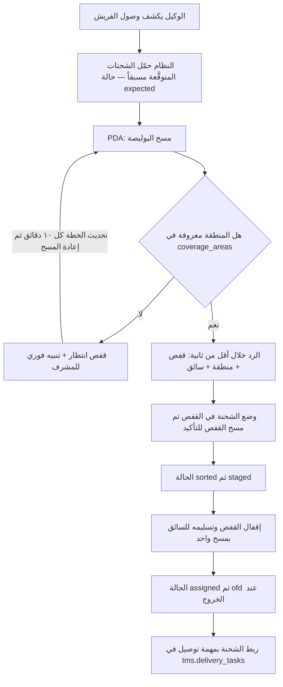

**قواعد الفرز المفروضة:**

| القاعدة | التطبيق | المصدر |
|---|---|---|
| **مستوى الأتمتة** | **A3** — النظام ينفّذ والإنسان يراقب بالاستثناء. **40 §C8 و07 صُحِّحا من A2 إلى A3** | EXEC §1.12 FIXED · R-06 |
| المنطقة | من عنوان الشحنة مطابقةً بـ**`imile.coverage_areas`** — المصدر الوحيد للمنطقة والتجاور | 07 §3-3 |
| زمن الاستجابة | **≤ ١٠٠٠ مللي ثانية** يظهر فيها القفص والمنطقة والسائق — شرط قبول S4 | 40 Part E · 05 س4 |
| **تجميع المناطق** | سائق واحد ← **مناطق متجاورة فقط** · الهدف **≤ ٣ مناطق** | 07 §3-3 |
| التدوير | مناطق محددة بالتدوير لعدالة الأحمال · `is_rotation` + `last_rotated_driver_code` | 07 §3-3 |
| السعة | لا يُحمَّل سائق فوق سعته اليومية المعلَنة | 07 §3-3 |
| الشحنة المجهولة | قفص «انتظار» + تنبيه فوري — **لا تُترك على الأرض** | 07 §3-3 |
| الأولوية | نفس اليوم ← موعد محدد ← COD مرتفع ← عادي | 07 §3-3 |
| انقطاع الشبكة | PWA يعمل دون اتصال · دفعات مؤجلة تُزامَن عند العودة | 07 §8 |

---

### 4.3 التوزيع — محرّك الخطة وبوابة الجودة السباعية والاستقلالية المكتسبة (IMI-03)

**المدخل:** الشحنات المتوقَّعة والواصلة، والمرحّل من أمس، والسائقون المتاحون.

**مدخلات المحرّك الثمانية:**

| المدخل | المصدر |
|---|---|
| الشحنات المتوقَّعة والواصلة | الوكيل — كل ١٠ دقائق |
| المرحّل من أمس | النظام |
| السائقون المتاحون | جدول الورديات والراحات + الحضور |
| سعة كل سائق | **تاريخي ٣٠ يوماً + الحد المعلَن** |
| خريطة المناطق والتجاور | `imile.coverage_areas` |
| قوائم الاستبعاد | `imile.driver_zone_exclusions` — سائق × منطقة |
| ثقة السائق | `imile.driver_trust` |
| التدوير | مناطق التدوير وآخر من غطّاها |

**منطق المحرّك ستّ خطوات:**

1. تجميع الشحنات بالمنطقة.
2. ترتيب المناطق بالحجم تنازلياً.
3. لكل سائق متاح: إسناد أكبر منطقة غير مسندة تناسب سعته، ثم **تكميل السعة من المناطق المتجاورة فقط**، مع احترام الاستبعادات والتدوير.
4. **الفائض عن الطاقة ⇒ قائمة «مرحّل» معلَنة + تنبيه للمدير.**
5. عرض الخطة مع **تعليل كل إسناد**.
6. المشرف يعدّل يدوياً — والنظام يسجّل نسبة التعديل `edits_pct` ويضبط قواعده أسبوعياً.

**الاعتماد — شرطان معاً لا شرط واحد:**

**① بوابة الجودة السباعية** — تُخزَّن نتيجتها في `imile.sorting_plans.quality_gate` بصيغة `jsonb`:

| # | الفحص | الشرط | المفتاح |
|---|---|---|---|
| 1 | **الإسناد الكامل** | ١٠٠٪ من الشحنات مُسنَدة، **أو** فائض **≤ ٣٪** مع قائمة مُرحَّلة معلَنة | `dispatch.gate.max_overflow_pct = 3` |
| 2 | **تركيز المناطق** | **≥ ٩٥٪ من السائقين** ضمن الحد | `dispatch.gate.min_drivers_zone_cap_pct = 95` |
| 3 | **حد المناطق للسائق** | **≤ ٣ مناطق** | `dispatch.gate.max_zones_per_driver = 3` |
| 4 | **الاستبعادات** | **صفر مخالفة** لقوائم `driver_zone_exclusions` | قاعدة ثابتة |
| 5 | **السعة** | **صفر مخالفة** لسعة السائق اليومية المعلَنة | قاعدة ثابتة |
| 6 | **التدوير والتجاور** | التدوير محترم · **المناطق المتجاورة فقط** | قاعدة ثابتة |
| 7 | **الأهلية** | **وثائق السائق سارية + معرّف iMile نشط** — حاجز INV-C4-1 | قاعدة ثابتة |

**② الاستحقاق** — في `imile.dispatch_autonomy`: **١٤ خطة** متتالية بقبول **بلا تعديل ≥ ٩٠٪**.

**③ التنزيل الفوري إلى `level = 0`** — بأيٍّ من الشرطين:
- **خطتان متتاليتان** تعديلهما **> ٢٠٪**، **أو**
- هبوط معدّل النجاح من أول محاولة **> ١٠ نقاط** عن متوسط ٣٠ يوماً.

**④ الأثر في القاعدة:** `sorting_plans.approved_by_kind = 'engine'` (وقيد `approved_by_kind_valid` يحصره في `human | engine`) · `quality_gate` محفوظة · `edits_pct` محسوبة. **نافذة التجاوز البشري: حتى أول تسليم قفص.**

> **استُبدلت في v4 (OPS-55)** عبارة «الخطة مقترح لا أمر» لأنها تناقض ADR-27 نصاً. ما لا يتغيّر: **التجاوز البشري متاح دائماً**، و**الرفض بشري دائماً** في التدقيق.

**المخرج:** خطة يومية معتمدة — بشرياً عند `level = 0` أو آلياً عند `level = 1` — وكل سائق بثلاث مناطق متجاورة أو أقل.

#### خريطة 5-4: اعتماد خطة التوزيع — البوابة والاستحقاق والتنزيل
تقرأ من بناء الخطة إلى اعتمادها، مع مسار الترقية والتنزيل.

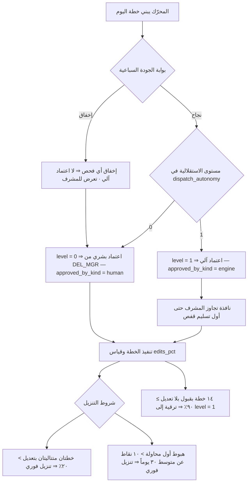

---

### 4.4 التدقيق الحي DTL — البوابات والقرارات والإقفال الآلي (IMI-04)

**المدخل:** مشكلة يرفعها السائق عن شحنة — نزاع تسليم أو ادّعاء أو طلب إعادة تصنيف.

**المبدأ:** السائق يرفع مشكلة ⟶ محرّك يقيّمها خلال دقيقة ⟶ المدقّق يبتّ من شاشة واحدة ⟶ القرار يعود للبوابة.

**بوابات التقييم الخمس:**

| البوابة | تفحص | المخرج |
|---|---|---|
| **G0** | اكتمال البيانات — صورة · نص · توقيت | ناقص ⇒ **بشري فوراً** |
| **G1** | تطابق نوع المشكلة مع الدليل المرفق | تعارض ⇒ **مرفوض** |
| **G2** | قراءة الأدلة بالـOCR مع **تمييز مُرسِل الرسالة** | نص العميل مقابل نص السائق |
| **G3** | **قرار العميل المكتوب بخط السائق** — أخطر حالة | يتطلب دليلاً **من العميل نفسه** |
| **G4** | قياس استجابة السائق من مسار الشحنة | بطء متكرر ⇒ علامة |

**المخرج الرباعي:** `accept` · `reject` · `human` · `reclassify` + **درجة ثقة** + **سبب نصّي** — مفروض بقيدي `chk_dtl_problems_engine_decision` و`chk_dtl_problems_auditor_decision` في القاعدة.

**شاشة المدقّق:** قائمة انتظار مرتّبة بالأولوية مع نتيجة البوابات وسببها · الأدلة (نص العميل والسائق مع علامات القراءة وروابط الصور) · الإجراءات (قبول · رفض · إعادة تصنيف · اتصال · واتساب) · السياق (مسار الشحنة · تاريخ السائق · المحاولات السابقة).

**الإقفال الآلي — الشروط الستة مجتمعةً:**

| # | الشرط | المفتاح في `platform.thresholds` | القيمة (مُتحقَّقة) |
|---|---|---|---|
| 1 | ثقة المحرّك | `dtl.auto_close.min_confidence` | **≥ 0.900** |
| 2 | **ليست G3** | — قاعدة ثابتة | — |
| 3 | قيمة التحصيل | `dtl.auto_close.max_cod_kwd` | **≤ 20.000 د.ك** |
| 4 | ثقة السائق | `dtl.auto_close.min_driver_trust` | **≥ 0.800** |
| 5 | دليل موضوعي | — قاعدة ثابتة | صورة/نص/توقيت تقبلها G0–G2 |
| 6 | القاعدة عند المستوى 1 | `imile.dtl_rule_autonomy.level = 1` | — |

**الترقية 0 ⟶ 1** — لكل زوج «نوع مشكلة × نوع قرار» على حدة:

| المفتاح | القيمة (مُتحقَّقة) |
|---|---|
| `dtl.promotion.consecutive_days` | **١٤ يوماً متتالياً** |
| `dtl.promotion.min_accuracy` | **دقة ≥ 0.970** |
| `dtl.promotion.min_cases` | **≥ ٥٠ حالة في النافذة** |

**التنزيل:** `dtl.demotion.accuracy_floor = 0.950` — **أي يوم دقته < 0.95 ⇒ تنزيل فوري إلى 0**.
**الرقابة المستمرة:** `dtl.review.random_sample_pct = 5` — **مراجعة عشوائية يومية لـ٥٪** من الإغلاقات الآلية، تُسجَّل في `dtl_problems.re_reviewed_at` و`re_review_agreed`.
**الوسم:** كل إغلاق آلي يحمل **`dtl_problems.closed_by = 'engine'`** فيصير قابلاً للتتبّع.

**العتبات الست عشرة — ثمانية `dtl.*` وثمانية `dispatch.*`:**

| # | المفتاح | القيمة | الوحدة |
|---|---|---|---|
| 1 | `dtl.auto_close.min_confidence` | 0.900 | ratio |
| 2 | `dtl.auto_close.max_cod_kwd` | 20.000 | KWD |
| 3 | `dtl.auto_close.min_driver_trust` | 0.800 | ratio |
| 4 | `dtl.promotion.consecutive_days` | 14.000 | days |
| 5 | `dtl.promotion.min_accuracy` | 0.970 | ratio |
| 6 | `dtl.promotion.min_cases` | 50.000 | count |
| 7 | `dtl.demotion.accuracy_floor` | 0.950 | ratio |
| 8 | `dtl.review.random_sample_pct` | 5.000 | pct |
| 9 | `dispatch.gate.max_overflow_pct` | 3.000 | pct |
| 10 | `dispatch.gate.min_drivers_zone_cap_pct` | 95.000 | pct |
| 11 | `dispatch.gate.max_zones_per_driver` | 3.000 | count |
| 12 | `dispatch.promotion.min_plans` | 14.000 | count |
| 13 | `dispatch.promotion.min_unchanged_pct` | 90.000 | pct |
| 14 | `dispatch.demotion.consecutive_plans` | 2.000 | count |
| 15 | `dispatch.demotion.max_edits_pct` | 20.000 | pct |
| 16 | `dispatch.demotion.first_attempt_drop_pts` | 10.000 | points |

> **العدد المعتمد للبناء ١٦ لا ١٤.** نصّ ADR-27 يكتب «14 thresholds»، والاستخراج الحرفي لكل قيمة عددية في القسم يعطي **١٦** — وهو ما بُذر فعلاً في 13B، **ومُتحقَّق في القاعدة أن الستة عشر جميعاً موجودة بقيمها أعلاه**. كلها **بيانات لا كود**: يحرّرها `GM` من شاشة الحدود بلا نشر.

**الحلقة المغلقة:** قرار المدقّق يُنفَّذ في البوابة ⟶ يُسجَّل في سجل التعلّم ⟶ **مصالحة ليلية ٠١:٤٠** تحسب `rule_was_correct` ودقة المدقّق واستجابة السائق بعد الرفض ⟶ **ضبط أسبوعي للقواعد** وتقرير أداء السائقين.

**الخلل التنظيمي الحقيقي:** المحرّك سليم — الخلل أن **القرارات تتراكم بلا بتّ** (٥٤ مشكلة معلّقة · صفر قرار في يوم). والحل تنظيمي لا تقني: **اجتماع ١٥ دقيقة يومياً الساعة ٩:٠٠** لتصفير القائمة · **مالك بالاسم (`DEL_MGR`)** · **مؤشر: صفر مشكلة عمرها > ٢٤ ساعة** · تصعيد آلي > ٢٤ ساعة إلى `DEL_MGR` و> ٤٨ ساعة إلى `GM`.

**المخرج:** قرار مبتوت بدليل خلال ٢٤ ساعة، ومحرّك يتحسّن أسبوعياً من نتائجه الفعلية.

#### خريطة 5-5: مسار قرار التدقيق الحي
تقرأ من رفع المشكلة إلى إقفالها آلياً أو بشرياً.

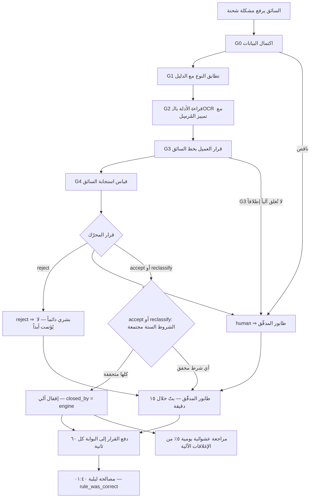

**القواعد المفروضة برمجياً — التدقيق:**

| القيد / المشغّل | الحد وقيمته | المصدر |
|---|---|---|
| `reject_never_auto` | **قيد `check` في القاعدة**: `dtl_rule_autonomy.decision_kind ∈ {accept, reclassify}` — **يستحيل بنيوياً تسجيل استقلالية لقرار رفض** | 13B · ADR-27 |
| `level_0_or_1` | مستوى الاستقلالية `0` أو `1` فقط — لا مستويات وسطى | القاعدة |
| **G3 لا تُغلق آلياً** | قاعدة ثابتة — **لا تتغيّر إلا بـADR مسجَّل** | EXEC §1.15 |
| `chk_dtl_problems_*_decision` | قرار المحرّك وقرار المدقّق كلاهما من `accept · reject · human · reclassify` | القاعدة |
| فهرس الطابور | `dtl_problems_auditor_decision_raised_at_idx` جزئي على الصفوف غير المبتوتة — الطابور فوري مهما كبر السجل | القاعدة |
| التصعيد | **> ٢٤ ساعة ⇒ `DEL_MGR`** · **> ٤٨ ساعة ⇒ `GM`** · التنبيه `N-02` يومياً ٠٩:٠٠ | 40 §C8 · 25 |
| `driver_trust` | **لا يُربط بأجر ولا بجزاء** — استخدامه الوحيد **شرط الإقفال الآلي رقم 4** ومدخل تشغيلي للمشرف؛ **ولا يُعرض للسائق كقيمة مركّبة أبداً** | ADR-28 · EXEC §1.15 |
| توليد الأرقام | **الأرقام من النظام · الحكم من الذكاء الاصطناعي** — مدقّق يرفض أي رقم ليس في المعطيات | 07 §7-1 |

---

### 4.5 الجرد اليومي بالمطابقة المزدوجة (IMI-05)

**المدخل:** رصيد المحطة في نظام iMile عند لحظة بدء الجرد.

**لماذا مزدوج:** الجرد هو **الموضع الوحيد الذي يكون فيه نظام iMile هو المرجع لا نظامنا** — فالمطابقة المزدوجة إلزامية، والمستوى **A2**: المطابقة والفروق آلية، **والقرار بشري**.

**الخطوات الست:**

1. **اللقطة المجمّدة** — الوكيل يسحب رصيد النظام (In-Hub) وقت بدء الجرد · يُكتب صف في `imile.daily_inventory` بـ`count_date` فريد و`system_count` و`started_at`.
2. **المسح الأعمى** — PDA · مسح متتابع لكل شحنة في المحطة · عدّاد حي · **تنبيه صوتي للمكرر** · يُملأ `scanned_count`.
3. **المطابقة الفورية عند الإقفال** — ثلاثة أنواع فروق تُكتب في `imile.inventory_discrepancies`:
   · **مفقود** — في النظام وليس في المسح (`missing_count`)
   · **زائد** — في المسح وليس في النظام (`extra_count`)
   · **حالة خاطئة** — موجود بحالة مختلفة (`system_status` مقابل `physical_status`)
4. **إعادة عدّ إلزامية لكل فرق** — `recount_done = true`.
5. **التفسير من قائمة مغلقة** — لكل فرق باقٍ: **سُلِّم ولم يُحدَّث · مع السائق · مرتجع لم يُسجَّل · مفقود فعلاً**.
6. **التصعيد** — **مفقود بلا تفسير ⇒ تصعيد فوري + تقرير** · `unexplained_count` هو المؤشر الحاكم.

**المخرج:** رصيد مطابق موثّق، و`duration_min` محسوب آلياً، وصفر فرق بلا تفسير.

**القواعد المفروضة برمجياً — الجرد:**

| القيد / المشغّل | الحد وقيمته | المصدر |
|---|---|---|
| `daily_inventory_count_date_key` | **جرد واحد لكل يوم** — تفرّد على `count_date` | القاعدة |
| `duration_min` | عمود **مولَّد** من `finished_at − started_at` — لا إدخال يدوي للمدة | القاعدة |
| المسح الأعمى | العدّاد لا يعرض الرصيد المتوقَّع — يمنع «العدّ نحو الرقم» | 07 §6-2 |
| إعادة العدّ | **إلزامية لكل فرق** قبل أي تفسير | 07 §6-2 |
| قائمة التفسير | **مغلقة** — أربعة تفسيرات لا خامس لها | 07 §6-2 |
| فرق بلا تفسير | **تصعيد فوري** — التنبيه `N-13` بلا كبح · التقرير `R-05` يومي | 25 · 07 §6-2 |
| المستوى | **A2** — المطابقة آلية والقرار بشري | 07 §2-2 |

**مستهدفات الجرد:** مدة الجرد **≤ ٤٥ دقيقة** · فرق بلا تفسير بعد إعادة العدّ **صفر** · دقة الجرد **≥ ٩٩٫٥٪** · جرد يومي مكتمل **١٠٠٪ من أيام العمل**.

---

### 4.6 نسبة الشحنات للسائق ومعرّفات iMile (IMI-06)

**المشكلة التقنية الحقيقية:** الشحنة في نظام iMile منسوبة إلى **`driver_code`** — معرّف المحطة، لا إلى سائق بشري. **والمعرّف مورد يُعاد تخصيصه، لا صفة ملازمة.** الربط الثابت بين سائق ومعرّف يعني احتساب عمولة سائق لسائق آخر فور إعادة التسليم.

**الحل: إسناد محدود بالزمن.**

```sql
-- المقتطف الحاسم كما هو في القاعدة
create unique index on imile.driver_id_assignments (driver_id_ref) where assigned_to is null;
create unique index on imile.driver_id_assignments (employee_id)   where assigned_to is null;
```

**الفهرسان الجزئيان الفريدان هما الضمانة البنيوية** ضد «معرّف واحد لسائقين» و«سائق واحد بمعرّفين» — لا قاعدة مكتوبة ولا فحص في الكود.

**النسبة الصحيحة — العرض `imile.shipments_attributed`:** يربط الشحنة بالموظف الذي كان يحمل المعرّف **لحظة `ofd_at`**:

```
shipments  ⟵ driver_code ⟶  driver_ids  ⟵  driver_id_assignments
                             شرط: ofd_at >= assigned_from
                                   و (assigned_to is null أو ofd_at < assigned_to)
```

**كل حساب عمولة وكل تقييم أداء وكل قرار انضباطي يمر بهذا الربط. والربط المباشر بـ`driver_code` ممنوع في الكود ويُفشل مراجعة الشيفرة.**

**الحارس G3 — `imile.verify_attribution(p_from, p_to)`:** دالة في القاعدة تعيد كل شحنة `delivered` في الفترة **بلا إسناد ساري وقت التسليم**، مع سبب الفجوة: «معرّف غير مسجّل لدينا» أو «لا إسناد ساري في وقت التسليم». **التوقيع الرسمي في اختبارات الحراسة: `imile.verify_attribution(current_date - 30, current_date)`، ويجب أن يعيد صفر صفوف.** والدالة المرافقة `imile.verify_no_orphan_ids()` تكشف المعرّفات اليتيمة.

**دورة حياة المعرّف — إيقاف وإعادة تخصيص (س16):**

1. **الرصد** — الوكيل يرصد إيقاف المعرّف في البوابة ⇒ `driver_ids.status = 'suspended'` + تنبيه فوري لـ`DEL_MGR`.
2. **الإغلاق الآلي للإسناد** — **المشغّل `trg_close_on_suspension` في القاعدة** يستدعي `imile.close_assignment_on_suspension()` فيغلق الإسناد الساري بـ`end_reason = 'suspended_by_imile'`. **عمولة السائق تتوقف عند هذه اللحظة بالضبط.**
3. **استرجاع الجهاز والعهدة** بنموذج استرجاع.
4. **الاستفسار من iMile عن السبب** — **خطوة إلزامية لا تُتخطّى**، ويُسجَّل في `suspension_reason` و`suspension_category`.
5. **التفرّع بحسب السبب:**

| فئة السبب | القرار |
|---|---|
| **إداري** (تحديث بيانات) | يُعاد التخصيص **فوراً** |
| **أداء** (تأخر تسليم) | يُعاد التخصيص **بعد مراجعة أداء** |
| **سلوكي** (احتيال · شكوى) | 🚫 **لا يُعاد التخصيص** — تحقيق أولاً، ثم يُعاد المعرّف لـiMile ويُطلب بديل |
| **محظور نهائياً** | **يُعاد لـiMile ويُطلب بديل** |

6. **اختيار السائق البديل** — النظام يعرض السائقين النشطين **بلا معرّف**، بفحص: إقامة سارية · رخصة سارية · **لا إجراء انضباطي مفتوح** · اجتاز التدريب.
7. **الإسناد الجديد** — سجل جديد بـ`assigned_from = الآن` و`assigned_to = null`.
8. **نموذج تسليم معرّف** يُولَّد ويُوقَّع (`handover_doc_id` ⟶ `platform.documents`).
9. **إبلاغ iMile** ببيانات السائق الجديد ورخصته.
10. **التفعيل** — الشحنات الجديدة تُنسب للسائق الجديد آلياً، **وكشف العمولة يُظهر لكل منهما رقمه الصحيح من المعرّف نفسه**.

**إنهاء الخدمة:** تغيير حالة الموظف إلى `terminated` **يُغلق الإسناد آلياً ويحرّر المعرّف** — لا خطوة يدوية تُنسى (S15).

**لوحة إدارة المعرّفات — العرض `imile.driver_id_dashboard`:**

| المؤشر | ما يكشفه |
|---|---|
| معرّفات متاحة / مُسندة / موقوفة | الطاقة الفعلية للمحطة |
| **سائقون نشطون بلا معرّف** | طاقة معطّلة — موظف يُدفع له ولا ينتج |
| **معرّفات مُسندة لسائقين غير نشطين** | معرّف مهدور — يُسترجَع |
| متوسط `days_suspended` حتى إعادة التخصيص | كفاءة إدارة المورد |
| **معرّفات موقوفة > ١٤ يوماً** | **تصعيد إلى iMile** |
| إيقافات متكررة لنفس السائق | **مؤشر أداء لا مشكلة تقنية** |

**القواعد المفروضة برمجياً — المعرّفات:**

| القيد / المشغّل | الحد وقيمته | المصدر |
|---|---|---|
| `driver_id_assignments_driver_id_ref_idx` | فهرس فريد جزئي: **إسناد ساري واحد لكل معرّف** | القاعدة |
| `driver_id_assignments_employee_id_idx` | فهرس فريد جزئي: **إسناد ساري واحد لكل موظف** | القاعدة |
| `valid_period` | `assigned_to > assigned_from` — لا نافذة معكوسة | القاعدة |
| `driver_ids_imile_code_key` | كود المعرّف فريد | القاعدة |
| `trg_close_on_suspension` | **مشغّل** يغلق الإسناد الساري عند إيقاف المعرّف | القاعدة |
| إنهاء الخدمة | **يغلق الإسناد آلياً ويحرّر المعرّف** — S15 | 40 §C7 |
| معرّف موقوف لسبب سلوكي | **لا يُعاد تخصيصه** — قرار مُغلق · S16 يرفض المحاولة وينشئ بند قرار `return_to_imile` | 40 §C7 · 10 §17 |
| الحارس G3 | `imile.verify_attribution(current_date - 30, current_date)` **يعيد صفر صفوف** | R-02c · 40 Part F |
| تفرّد كشف العمولة | `unique (work_date, employee_id)` على `hr.commission_daily` — يمنع الاحتساب المزدوج | القاعدة |
| لقطة مجمَّدة | `commission_daily.source_snapshot` **`not null`** — تغيّر أرقام iMile لاحقاً لا يغيّر عمولة معتمدة | القاعدة · 10 §15 |
| يوم بلا إسناد معرّف | 🚩 شحنات بلا سائق منسوب ⇒ **تصعيد فوري** | 10 §15 |

---

### 4.7 الكول سنتر — الطوابير والمكالمات (PCC-01)

**المدخل:** مكالمة واردة أو صادرة على أحد الطوابير.

**نوعا العميل:**

| النوع | الوصف | الفوترة |
|---|---|---|
| **داخلي** | طوابير لكيانات المجموعة — استفسارات الشحنات وشكاوى التوصيل | **سعر تحويلي داخلي** · معاملة بينية (`is_intercompany`) تُحذف عند تجميع المجموعة |
| **خارجي** | عميل يشتري خدمة كول سنتر أو بدالة فقط | **باقة + تجاوز** (`CC-01…CC-15`) |

**الخطوات:**

1. **الورود** — المكالمة تدخل طابور العميل `cc.queues` بـ`channel` و`working_hours` و`target_answer_sec` (افتراضي **٢٠ ثانية**) و`target_abandon_pct` (افتراضي **٥٪**).
2. **التوجيه** — إلى وكيل مؤهَّل من `cc.agent_queues` **بمهارة اللغة** (`agents.languages`) و`skill_level` و`priority` الطابور.
3. **الشاشة المخصّصة** — الوكيل يرى شاشة العميل: سكربت · نظام مواعيد · أسئلة شائعة.
4. **التسجيل** — صف في `cc.calls` بـ`started_at` و`answered_at` و`ended_at`؛ و**`wait_sec` و`talk_sec` عمودان مولَّدان آلياً** — لا إدخال يدوي.
5. **التذكرة** — تُنشأ عند اللزوم (§4.8) وتُربط بالمكالمة عبر `calls.ticket_id`.
6. **التسجيل الصوتي** — `recording_url` بتصنيف حساسية، والوصول بصلاحية صريحة فقط.

**المخرج:** مكالمة مقيسة بزمن انتظار ومحادثة محسوبين آلياً، وحدث فوترة `CC-01` أو `CC-02`.

**القواعد المفروضة برمجياً — المكالمات:**

| القيد / المشغّل | الحد وقيمته | المصدر |
|---|---|---|
| `wait_sec` و`talk_sec` | **عمودان مولَّدان** من الطوابع الزمنية — لا تلاعب يدوي بأرقام SLA | القاعدة |
| `queues_code_key` | كود الطابور فريد | القاعدة |
| `chk_agents_status` | حالة الوكيل من `offline · available · busy · break` | القاعدة |
| هدف الرد | `target_answer_sec = 20` ثانية افتراضاً لكل طابور | القاعدة · 05 س5 |
| هدف التخلي | `target_abandon_pct = 5` افتراضاً | القاعدة |
| عزل الطوابير | **الوكيل لا يرى إلا طوابيره المخصَّصة** — شرط قبول S5: **صفر تذاكر تُعاد، لا خطأ صلاحية** · **✅ مطبَّق في RLS (SCH-4 ق-25):** `cc.is_agent()` + `cc.current_agent_queues()` (كلتاهما `security definer`) + **أربع سياسات `as restrictive`** على `tickets` · `calls` · `queues` · `ticket_events` | 40 §C5 · S5 |
| تسريب التسجيلات | تصنيف `secret` على روابط التسجيل · وصول بصلاحية صريحة فقط | 05 س5 |

---

### 4.8 التذكرة — الدورة والمهل والتصعيد (PCC-02)

**المدخل:** طلب أو شكوى أو استفسار من عميل، أو شكوى مُنشأة آلياً من نافذة العميل.

**الخطوات:**

1. **الفتح** — `CC_AGENT` · صف في `cc.tickets` بـ`doc_no` من سلسلة `TKT` و`queue_id` و`category` و`priority` و`subject` · الحالة `open` · الحدث `cc.ticket.created`.
2. **الربط بالتشغيل** — إن كانت عن شحنة: `related_table = 'tms.delivery_tasks'` و`related_id` · **الوكيل يرى حالة الشحنة الحقيقية ولا يسأل عنها**.
   وهذا الربط نفسه **يرفع `legal_hold` آلياً** على إثبات التسليم عبر المشغّل `trg_pod_hold_ticket`.
3. **حساب المهلة** — `sla_due_at` من الأولوية: **عاجل ١٥ دقيقة · عالٍ ساعة · عادي ٤ ساعات** للاستجابة الأولى.
4. **المعالجة** — `in_progress` مع `first_response_at` · الحدث `cc.ticket.started` · كل خطوة تُكتب في `cc.ticket_events` بعلم `is_internal` الذي يفصل ما يراه العميل عمّا لا يراه.
5. **الانتظار** — `pending_client` أو `pending_internal` ذهاباً وإياباً مع `in_progress`.
6. **التصعيد** — **عند بلوغ ٨٠٪ من مهلة SLA** ⇒ تنبيه `N-14` إلى `CC_MGR` — **تصعيد لا حالة**.
7. **الحل** — `resolved` مع **حقل «الحل» إلزامي — لا إقفال بلا نص** · الحدث `cc.ticket.resolved` · تُولَّد **وثيقة ملخص التذكرة** ويُنشأ حدث فوترة `CC-04`.
8. **الإقفال** — النظام أو `CC_MGR` ⇒ `closed` + **استبيان رضا تلقائي** يملأ `satisfaction_score`.
9. **إعادة الفتح** — `CC_MGR` **خلال ٧ أيام** ⇒ `reopened`، **ومخرجها `in_progress`** لا حالة نهائية.

**المخرج:** تذكرة محلولة بنصّ حلّ موثّق ودرجة رضا، وحدث فوترة `CC-04`.

#### خريطة 5-6: دورة التذكرة والتصعيد عند ٨٠٪ من المهلة
تقرأ من فتح التذكرة إلى إقفالها أو إعادة فتحها.

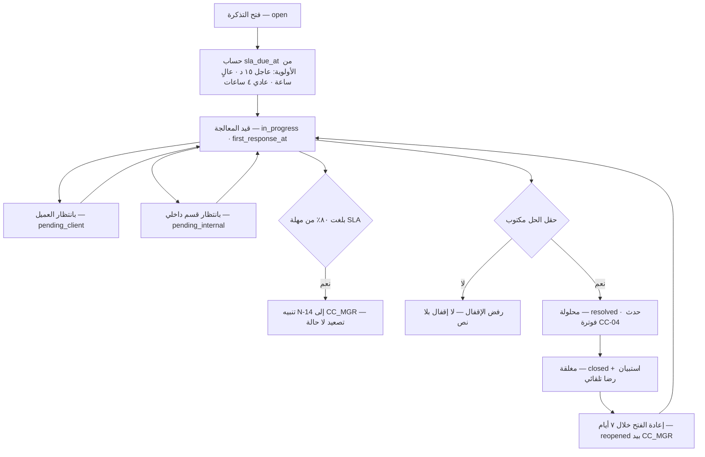

**القواعد المفروضة برمجياً — التذاكر:**

| القيد / المشغّل | الحد وقيمته | المصدر |
|---|---|---|
| `chk_tickets_status` | سبع حالات: `open · in_progress · pending_client · pending_internal · resolved · closed · reopened` | قيد `check` في القاعدة |
| `tickets_entity_id_doc_no_key` | رقم التذكرة فريد لكل كيان · السلسلة `TKT` | القاعدة |
| فهرس المهلة | `tickets_status_sla_due_at_idx` — استعلام «تذاكر معرَّضة للتجاوز» فوري | القاعدة |
| فهرس الربط | `tickets_related_table_related_id_idx` — من الشحنة إلى تذاكرها مباشرةً | القاعدة |
| مهلة الاستجابة الأولى | **عاجل ١٥ د · عالٍ ساعة · عادي ٤ ساعات** | 40 §C5 · 03 §6-2 |
| التصعيد | **عند ٨٠٪ من مهلة SLA** ⇒ `N-14` إلى `CC_MGR` — **بلا كبح** | 40 §C5 · 25 |
| الإقفال | **حقل `resolution` إلزامي** — لا إقفال بلا نص | 40 §C5 |
| إعادة الفتح | **خلال ٧ أيام** · بيد `CC_MGR` · **مخرجها `in_progress`** (OPS-30) | 03 §0-9 |
| الرضا | استبيان تلقائي بعد الإقفال ⇒ `satisfaction_score` | 40 §C5 |
| الحجز القانوني | `trg_pod_hold_ticket` — تذكرة على مهمة توصيل ترفع `legal_hold` على POD تلقائياً | القاعدة |
| **الأولوية** | `priority` **✅ مقيَّدة بـ`chk_tickets_priority` في القاعدة (SCH-4)** — فحساب `sla_due_at` لم يعد يتعطّل بقيمة مكتوبة خطأً. **✗ يبقى بلا قيد:** `cc.calls.disposition` · `cc.ticket_events.event_type` · `cc.queues.channel` — لا وثيقة تسرد قيمها | — |

---

### 4.9 تسعير الكول سنتر — باقة + تجاوز (PCC-03)

**النموذج المعتمد: باقة + تجاوز** — أرضية إيراد مضمونة للشركة، وسقف تكلفة متوقَّع للعميل، وتحصيل لما يتجاوز الباقة.

**الخدمات الخمس عشرة:**

| الكود | الخدمة | الوحدة | الأساس | مصدر التوليد |
|---|---|---|---|---|
| `CC-01` | استقبال مكالمات واردة | مكالمة مُجابة | لكل وحدة | `cc.calls` بـ`direction = inbound` و`answered_at` غير فارغ |
| `CC-02` | استقبال مكالمات — بالدقيقة | دقيقة محادثة | لكل وحدة | `cc.calls.talk_sec` مولَّد |
| `CC-03` | **مقعد وكيل مخصّص** | مقعد / شهر | ثابت شهري | `cc.agent_queues` × الشهر |
| `CC-04` | معالجة تذكرة أو شكوى | تذكرة | لكل وحدة | `cc.ticket.resolved` |
| `CC-05` | مكالمات صادرة — حملة | مكالمة | لكل وحدة | `cc.calls` بـ`direction = outbound` |
| `CC-06` | خدمة واتساب أو دردشة | محادثة | لكل وحدة | `cc.tickets` بـ`channel` غير صوتي |
| `CC-07` | معالجة بريد إلكتروني | رسالة | لكل وحدة | `cc.tickets` بقناة البريد |
| `CC-08` | **تأكيد الطلبات قبل التوصيل** | طلب | لكل وحدة | حملة صادرة مربوطة بـ`tms.delivery_tasks` |
| `CC-09` | متابعة الشحنات الفاشلة وإعادة الجدولة | شحنة | لكل وحدة | تذكرة على مهمة في حالة `failed` |
| `CC-10` | خدمة خارج ساعات الدوام 24/7 | شهر | ثابت شهري | بند عقدي |
| `CC-11` | بدالة أو رقم افتراضي | رقم / شهر | ثابت شهري | بند عقدي |
| `CC-12` | تسجيل المكالمات وأرشفتها | مقعد / شهر | ثابت شهري | بند عقدي |
| `CC-13` | تقارير وتحليلات مخصّصة | تقرير / شهر | ثابت شهري | بند عقدي |
| `CC-14` | إعداد وتهيئة حساب عميل جديد | مرة واحدة | لكل حدث | تهيئة الطابور |
| `CC-15` | تدريب وكلاء على منتج العميل | ساعة | بالساعة | بند عقدي |

**مثال النموذج (S5 — عيادة طبية):** ٤ مقاعد `CC-03` شاملة **٣,٠٠٠ مكالمة**؛ وما فوقها `CC-01` بالمكالمة · إضافةً إلى `CC-11` رقم افتراضي و`CC-12` تسجيل و`CC-06` واتساب و`CC-13` تقارير. والـSLA: **نسبة الرد ≥ ٩٠٪ خلال ٢٠ ثانية · نسبة التخلي ≤ ٥٪**.

**نقاط الحذر المعالَجة تصميمياً:**

| النقطة | المعالجة |
|---|---|
| عزل بيانات العميل | وكيل لا يرى تذاكر عميل آخر — العزل على مستوى `queue_id` |
| موسمية الحجم | **باقة ثابتة + تجاوز تحمي الطرفين** |
| تسريب التسجيلات | تصنيف حساس + صلاحية صريحة |
| **وكيل يخدم عدة عملاء** | **مقعده يُوزَّع نسبياً في تكلفة العمالة** — وإلا اختلّت الربحية |

---

## 5. آلات الحالات

### 5.1 `imile.shipments.internal_status` — الشحنة في المحطة

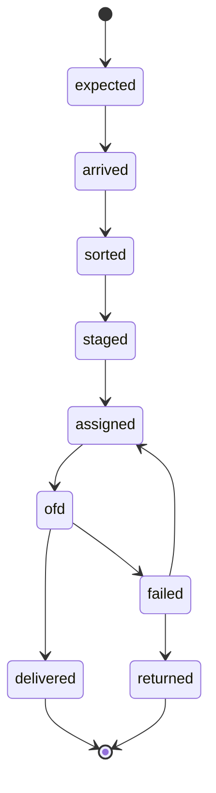

| الحالة | من ينقلها | الحدث | الشاشة |
|---|---|---|---|
| `expected` | وكيل المحطة — تحميل مسبق قبل الوصول | `imile.shipment.expected` | لوحة المحطة |
| `arrived` | وكيل المحطة — كشف وصول الفريش | `imile.shipment.arrived` | لوحة المحطة |
| `sorted` | `WH_OP` / `DEL_SUP` — مسح الفرز على PDA | `imile.shipment.sorted` | شاشة الفرز (PDA) |
| `staged` | `DEL_SUP` — الشحنة في قفصها | `imile.shipment.staged` | شاشة الفرز |
| `assigned` | النظام من خطة اليوم | `imile.shipment.assigned` | خطة التوزيع |
| `ofd` | `DRIVER` — خروج بالقفص | `imile.shipment.ofd` | مسح التحميل |
| `delivered` | `DRIVER` — عبر مهمة التوصيل المربوطة | `imile.shipment.delivered` | تنفيذ المهمة |
| `failed` | `DRIVER` | `imile.shipment.failed` | تنفيذ المهمة |
| `returned` | `DEL_SUP` | `imile.shipment.returned` | إقفال المسار |

> الشحنة مربوطة بمهمة توصيل عبر `delivery_task_id`؛ فالحالتان تتحركان معاً، و`tms.delivery_tasks.status` هو المرجع للدورة التشغيلية الكاملة.

### 5.2 `imile.sorting_plans.status` — خطة الفرز اليومية

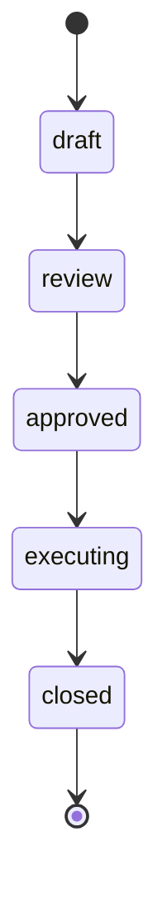

| الحالة | من ينقلها | الحدث | الشاشة |
|---|---|---|---|
| `draft` | المحرّك — بناء الخطة مساءً | — | خطة التوزيع |
| `review` | المحرّك — بعد حساب بوابة الجودة السباعية | — | خطة التوزيع |
| `approved` | **`DEL_MGR`** عند `level = 0` (`approved_by_kind = 'human'`) · **أو `engine`** عند `level = 1` | `imile.plan.approved` | خطة التوزيع |
| `executing` | `DEL_SUP` — بدء الفرز والتسليم | — | شاشة الفرز |
| `closed` | `DEL_SUP` نهاية اليوم — مع حساب `edits_pct` | — | خطة التوزيع |

### 5.3 `imile.driver_ids.status` — معرّف السائق

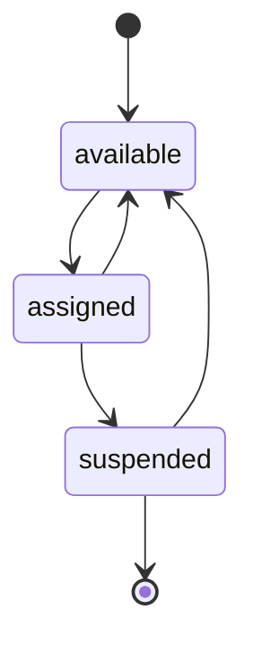

| الحالة | من ينقلها | الحدث | الشاشة |
|---|---|---|---|
| `available` | `DEL_MGR` عند التخصيص من iMile، أو آلياً عند تحرير الإسناد | — | لوحة المعرّفات |
| `assigned` | `DEL_MGR` — مع سجل إسناد ساري | — | لوحة المعرّفات |
| `suspended` | **الوكيل آلياً** عند رصد الإيقاف في البوابة · والمشغّل يغلق الإسناد فوراً | — | لوحة المعرّفات |
| العودة إلى `available` | بعد رفع الإيقاف — **إلا إن كان السبب سلوكياً** فلا يُعاد التخصيص | — | لوحة المعرّفات |

> **قيد القاعدة `chk_driver_ids_status` يسمح بثلاث حالات فقط** — `available · assigned · suspended` — مطابقةً لـ40 §C7 وسجل الحالات. ووثيقة 10 §11 تعدّد خمساً بإضافة `blocked` و`returned`؛ العمود `returned_at` موجود لكن الحالة غير مسموحة. انظر §13.

### 5.4 `imile.dtl_rule_autonomy.level` — استقلالية قاعدة التدقيق

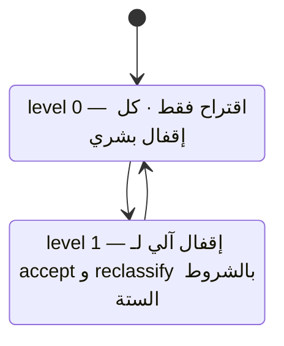

| الانتقال | الشرط | من ينفّذه |
|---|---|---|
| `level0 ⟶ level1` **ترقية** | **١٤ يوماً متتالياً** بدقة **≥ 0.97** على **≥ ٥٠ حالة** — لكل زوج «نوع مشكلة × نوع قرار» على حدة | النظام · `promoted_by` بشري مسجَّل |
| `level1 ⟶ level0` **تنزيل** | **أي يوم دقته < 0.95** ⇒ تنزيل فوري مع `demotion_reason` | النظام — فوري بلا انتظار |
| **لا يوجد** | `decision_kind = 'reject'` — **مستحيل بنيوياً** بقيد `reject_never_auto` | — |

### 5.5 `imile.dispatch_autonomy.level` — استقلالية اعتماد الخطة

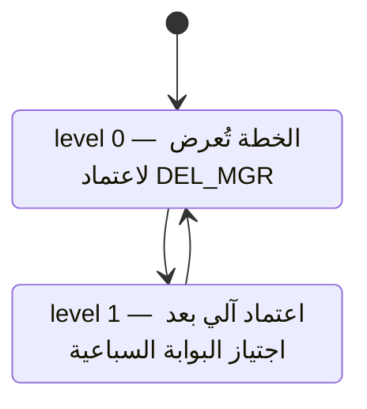

| الانتقال | الشرط | من ينفّذه |
|---|---|---|
| `level0 ⟶ level1` **ترقية** | **١٤ خطة** بقبول **بلا تعديل ≥ ٩٠٪** | النظام · `promoted_by` بشري مسجَّل |
| `level1 ⟶ level0` **تنزيل** | **خطتان متتاليتان بتعديل > ٢٠٪** **أو** هبوط أول محاولة **> ١٠ نقاط** عن متوسط ٣٠ يوماً | النظام — فوري |
| **قيد دائم** | البوابة السباعية تُفحص في **كل** خطة حتى عند `level = 1`؛ إخفاق أي فحص يمنع الاعتماد الآلي لتلك الخطة | النظام |

### 5.6 `cc.tickets.status` — التذكرة

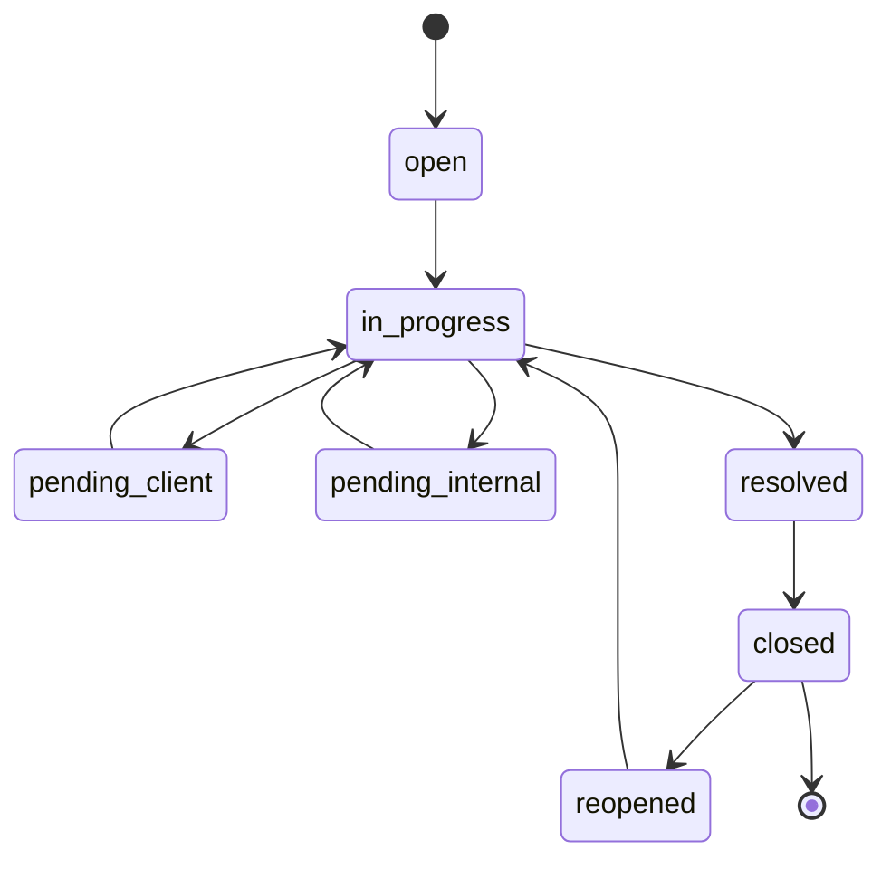

| الحالة | من ينقلها | الحدث | الشاشة |
|---|---|---|---|
| `open` | `CC_AGENT` — أو آلياً من شكوى في نافذة العميل | `cc.ticket.created` | التذاكر |
| `in_progress` | `CC_AGENT` — مع `first_response_at` | `cc.ticket.started` | التذاكر |
| `pending_client` | `CC_AGENT` | `cc.ticket.waiting_client` | التذاكر |
| `pending_internal` | `CC_AGENT` | `cc.ticket.waiting_internal` | التذاكر |
| `resolved` | `CC_AGENT` — **حقل الحل إلزامي** | `cc.ticket.resolved` | التذاكر |
| `closed` | النظام أو `CC_MGR` — استبيان رضا تلقائي | `cc.ticket.closed` | التذاكر |
| `reopened` | **`CC_MGR` خلال ٧ أيام** — **ومخرجها `in_progress`** | `cc.ticket.reopened` | التذاكر |

> **التصعيد عند ٨٠٪ من مهلة SLA تنبيه لا حالة** — لا يُغيّر `status`، بل يرفع `N-14` إلى `CC_MGR`.

### 5.7 `cc.agents.status` — حالة الوكيل

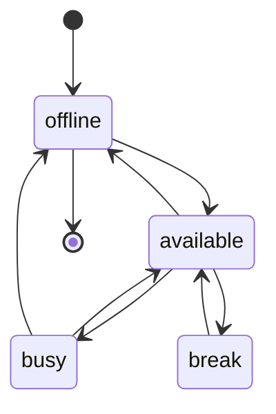

| الحالة | من ينقلها | الحدث | الشاشة |
|---|---|---|---|
| `offline` | الوكيل أو النظام عند انتهاء الجلسة | — | شاشة الوكيل |
| `available` | الوكيل — جاهز لاستقبال التوجيه | — | شاشة الوكيل |
| `busy` | النظام — أثناء مكالمة نشطة | — | شاشة الوكيل |
| `break` | الوكيل — استراحة محسوبة في الإشغال | — | شاشة الوكيل |

> **قرار التدقيق الحي ليس عمود حالة** — `dtl_problems` يحمل `engine_decision` و`auditor_decision` و`closed_by` و`re_review_agreed`، لا عمود `status`. الدورة موصوفة بالقرارات لا بالحالات، والفهرس الجزئي على الصفوف غير المبتوتة هو حامل «الطابور».

---

## 6. المستندات والنماذج

| المستند | السلسلة / المصدر | متى يُولَّد | ما يُطبع أو يُرسل | التوقيع |
|---|---|---|---|---|
| **خطة الفرز اليومية** | `imile.sorting_plans` بتفرّد على `plan_date` | عند `approved` | لوحة المشرف + ورقة القفص لكل سائق | `approved_by` بشري أو `approved_by_kind = 'engine'` |
| **بطاقة القفص** | من `plan_assignments (cage_code, zones, planned_count)` | عند إقفال القفص | تُلصق على القفص وتُمسح عند التسليم | مسح السائق |
| **رسالة الطاقة الأسبوعية لـiMile** | `R-10` من `imile.shipments_attributed` + طاقة المحطة | أسبوعياً | **تُرسل إلى iMile** — الحجم المستلم مقابل الطاقة الفعلية والمرحّل وأثره على نسبة التسليم | `GM` |
| **تقرير الجرد اليومي** | `imile.daily_inventory` + `inventory_discrepancies` | عند إقفال الجرد | `R-05` إلى `DEL_MGR` + المفقود بلا تفسير مصعَّد | `closed_by` |
| **نموذج تسليم معرّف iMile** | `driver_id_assignments.handover_doc_id` ⟶ `platform.documents` | عند كل إسناد جديد | يُطبع ويُوقَّع | السائق + `DEL_MGR` |
| **نموذج استرجاع المعرّف والعهدة** | من إغلاق الإسناد | عند الإيقاف أو إنهاء الخدمة | يُطبع ويُوقَّع | السائق + `DEL_MGR` |
| **طلب الواجهة البرمجية الرسمي لـiMile** | مستند خارجي | **المرحلة 3** | **يصوغه `pg-scribe` ويرسله `GM`** بتوقيعه | `GM` |
| **التذكرة** | `TKT` (`<كيان>-TK-#####`) | عند `cc.ticket.created` | مرجع للعميل | — |
| **ملخص التذكرة** | من `cc.tickets` + `ticket_events` غير الداخلية | عند `cc.ticket.resolved` | يُرسل للعميل مع نص الحل | — |
| **استبيان الرضا** | من الإقفال | عند `closed` | يُرسل تلقائياً ⇒ `satisfaction_score` | — |
| **تقرير SLA للكول سنتر** | من `cc.calls` و`cc.tickets` | شهرياً | للعميل مع الفاتورة — أساس الغرامة أو الحافز | `CC_MGR` |
| **فاتورة العميل + ورقة التفصيل** | `INV` | إقفال الشهر | الباقة + التجاوز مفصَّلين بالمكالمات والدقائق والتذاكر | `CFO` فوق 500 د.ك |

---

## 7. الضوابط والاعتمادات

**جدول الحدود:**

| البند | الحد | المعتمِد | المصدر |
|---|---|---|---|
| حساب iMile | **مخصّص للوكيل لا يستخدمه أحد** · جلسة واحدة | **قرار مُغلق — لا استثناء** | EXEC §1.2 |
| تشغيل البوابة يدوياً | عبر **مشغّل الواجهة عن بُعد داخل جلسة الوكيل حصراً** | `DEL_MGR` | 40 §C8 |
| توقف الوكيل | **١٥ دقيقة** ⇒ `DEL_MGR` · **٦٠ دقيقة** ⇒ `GM` | تصعيد آلي | 40 §C8 |
| اعتماد خطة التوزيع | البوابة السباعية **و** الاستحقاق | **`DEL_MGR`** عند `level = 0` · **`engine`** عند `level = 1` | ADR-27 |
| تجاوز الخطة المعتمدة آلياً | **نافذة تجاوز حتى أول تسليم قفص** | `DEL_SUP` / `DEL_MGR` | 07 §4-4 |
| **قرار `reject` في التدقيق** | **بشري دائماً — لا يُؤتمت أبداً** | **مدقّق بشري حصراً** · قيد في القاعدة | EXEC §1.15 FIXED |
| **البوابة G3** | **لا تُغلق آلياً إطلاقاً** | **مدقّق بشري حصراً** | EXEC §1.15 FIXED |
| الإقفال الآلي لـ`accept`/`reclassify` | **الشروط الستة مجتمعةً** | النظام — بوسم `closed_by = 'engine'` | ADR-27 |
| تنزيل الاستقلالية | **فوري** عند خرق أي عتبة — لا مهلة ولا استئناف | النظام | ADR-27 |
| تغيير أي من العتبات الست عشرة | بيانات في `platform.thresholds` | **`GM` بلا نشر** | 40 §A4 |
| تغيير «الرفض بشري» أو «G3 لا تُغلق» | **يتطلب ADR مسجَّلاً** | **لا أحد بقرار تشغيلي** | EXEC §1.15 |
| ربط `driver_trust` بأجر أو جزاء | **ممنوع** | **لا أحد — يتطلب ADR مسجَّلاً** | ADR-28 · EXEC §1.15 |
| عرض `driver_trust` للسائق كقيمة مركّبة | **ممنوع** — يُعرض مكوّن قابل للتصرف وحده | **لا أحد** | ADR-28 |
| مشكلة تدقيق بلا بتّ | **> ٢٤ ساعة** ⇒ `DEL_MGR` · **> ٤٨ ساعة** ⇒ `GM` | تصعيد آلي | 40 §C8 |
| فرق جرد بلا تفسير | **تصعيد فوري** — لا إقفال جرد عليه | `DEL_MGR` | 07 §6-2 |
| معرّف موقوف لسبب سلوكي | **لا يُعاد تخصيصه** — يُعاد لـiMile ويُطلب بديل | **قرار مُغلق** | 40 §C7 · S16 |
| معرّف موقوف > ١٤ يوماً | تصعيد إلى iMile | `DEL_MGR` | 10 §19 |
| **معتمِد إعادة تخصيص المعرّف** | — | **مفتوح** (§13) | 10 §21 البند 5 |
| إقفال تذكرة | **حقل الحل إلزامي** — لا إقفال بلا نص | منع آلي | 40 §C5 |
| إعادة فتح تذكرة | **خلال ٧ أيام** | **`CC_MGR`** | 03 §0-9 |
| تصعيد التذكرة | عند **٨٠٪** من مهلة SLA | تنبيه آلي إلى `CC_MGR` | 40 §C5 |
| وصول الوكيل إلى طابور آخر | **ممنوع** — صفر تذاكر لا خطأ صلاحية | **✅ مفروض بأربع سياسات RLS `restrictive`** (SCH-4 ق-25) — مُتحقَّق بالاختبار S4-4 | S5 |
| الوصول إلى تسجيلات المكالمات | بصلاحية صريحة فقط · تصنيف حساس | `CC_MGR` | 05 س5 |

**فصل المهام (SoD) في هذا النطاق:**

| الزوج | القاعدة | كيف يُفرض |
|---|---|---|
| **المحرّك ≠ المقرِّر في الرفض** | `reject` بشري دائماً | **قيد `check`** — `reject_never_auto` على `dtl_rule_autonomy` |
| **المدقّق ≠ المراجِع العشوائي** | ٥٪ من الإغلاقات الآلية تُراجَع يومياً بعين أخرى | `re_reviewed_at` / `re_review_agreed` |
| **العادّ ≠ مُعيد العدّ** | إعادة العدّ إلزامية لكل فرق قبل أي تفسير | قاعدة تشغيلية في مسار الجرد |
| **المسنِد ≠ المعتمِد لإعادة تخصيص المعرّف** | `driver_id_assignments.assigned_by` و`approved_by` عمودان منفصلان | **العمودان موجودان — والدورَان غير مسمّيين** (§13) |
| **لا اعتماد ذاتي** | `requester_id <> approver_id` | EXEC §1.1 |

**الأربع عيون:** تغيير مستوى الأتمتة في `platform.automation_rules`، وتغيير أي من العتبات الست عشرة، وتعطيل قاعدة SoD — كلها تحتاج معتمِداً ثانياً (`DEPUTY_SYSADMIN` أو `CFO`).

**ما يتطلب المدير العام حصراً:** إرسال طلب الواجهة البرمجية لـiMile · التصعيد بعد ٦٠ دقيقة توقفاً للوكيل أو ٤٨ ساعة بلا بتّ · التفاوض مع iMile على الطاقة · تغيير أي قاعدة مُثبَّتة بـADR (الرفض البشري · G3 · حدود `driver_trust`) · اعتماد رسالة الطاقة الأسبوعية.

---

## 8. مؤشرات الأداء (KPI)

| المؤشر | التعريف الحسابي الدقيق | مصدر البيانات | الدورية | المالك | الهدف |
|---|---|---|---|---|---|
| **زمن الفريش إلى أول سائق** | الفارق بين `arrived_at` لأول شحنة في الدفعة و`ofd_at` لأول شحنة خارجة | `imile.shipments (arrived_at, ofd_at)` | يومي | `DEL_MGR` | **≤ ٣ ساعات** (الأساس: غير مقاس) |
| **نسبة الفرز بالمسح بلا تدخل يدوي** | مسحات الفرز التي أعادت قفصاً مباشرةً ÷ كل مسحات الفرز × 100 | `imile.scan_log (scan_type, result)` | يومي | `DEL_SUP` | **≥ ٩٥٪** (الأساس ٠٪) |
| **زمن استجابة المسح** | زمن الرد من المسح إلى عرض القفص والمنطقة والسائق | قياس التطبيق + `scan_log` | مستمر | `SYSADMIN` | **≤ ١٠٠٠ مللي ثانية** — شرط قبول S4 |
| **سائقون بـ ≤ ٣ مناطق** | أيام-السائق بـ`array_length(zones) ≤ 3` ÷ كل أيام-السائق × 100 | `imile.plan_assignments.zones` | يومي | `DEL_MGR` | **≥ ٩٥٪** (الأساس ~٥٤٪) |
| **نسبة التسليم اليومي DLD** | الشحنات `delivered` في اليوم ÷ الشحنات `ofd` × 100 | `imile.shipments.internal_status` | يومي | `DEL_MGR` | **≥ ٧٠٪** (الأساس ~٥٢٪) |
| **نسبة المرحّل** | شحنات لم تُسنَد في خطة اليوم ÷ كل شحنات اليوم × 100 | `imile.sorting_plans` × `shipments` | يومي | `DEL_MGR` | **≤ ٣٪** — الفحص الأول في بوابة الجودة |
| **نسبة تعديل الخطة** | `edits_pct` لكل خطة، ومتوسطها على ١٤ خطة | `imile.sorting_plans.edits_pct` | لكل خطة | `DEL_MGR` | **≤ ٢٠٪** — وفوقها خطتين متتاليتين ⇒ تنزيل |
| **نسبة القبول بلا تعديل** | خطط بـ`edits_pct = 0` ÷ ١٤ خطة متتالية × 100 | `imile.dispatch_autonomy.unchanged_acceptance_pct` | متدحرج ١٤ خطة | `DEL_MGR` | **≥ ٩٠٪** — شرط الترقية |
| **مشاكل تدقيق بلا بتّ > ٢٤ ساعة** | عدد صفوف `dtl_problems` بـ`auditor_decision is null` وعمرها > ٢٤ ساعة | `imile.dtl_problems (raised_at, auditor_decision)` | يومي ٠٩:٠٠ | `DEL_MGR` | **صفر** (الأساس ٥٤ معلّقة) |
| **دقة قاعدة التدقيق** | `count(rule_was_correct = true) ÷ count(rule_was_correct is not null)` لكل نوع مشكلة | `imile.dtl_problems.rule_was_correct` | يومي (مصالحة ٠١:٤٠) | `DEL_MGR` | **≥ 0.97** للترقية · **< 0.95 ⇒ تنزيل فوري** |
| **نسبة الإغلاق الآلي** | `count(closed_by = 'engine') ÷ count(*)` للمشاكل المُقفلة | `imile.dtl_problems.closed_by` | شهري | `DEL_MGR` | يحدده GM — والمقياس الحاكم هو الدقة لا النسبة |
| **اتفاق المراجعة العشوائية** | `count(re_review_agreed = true) ÷ count(re_reviewed_at is not null)` | `imile.dtl_problems` | يومي | `DEL_MGR` | يحدده GM — وعيّنة **٥٪** إلزامية |
| **مدة الجرد** | `duration_min` المولَّد | `imile.daily_inventory.duration_min` | يومي | `DEL_SUP` | **≤ ٤٥ دقيقة** |
| **فرق جرد بلا تفسير** | `unexplained_count` بعد إعادة العدّ | `imile.daily_inventory.unexplained_count` | يومي | `DEL_MGR` | **صفر** |
| **دقة الجرد** | `1 − (missing_count + extra_count) ÷ system_count` × 100 | `imile.daily_inventory` | يومي | `DEL_MGR` | **≥ ٩٩٫٥٪** |
| **الجرد اليومي المكتمل** | أيام بجرد مقفل ÷ أيام العمل × 100 | `imile.daily_inventory.count_date` | شهري | `DEL_MGR` | **١٠٠٪** |
| **شحنات بلا سائق منسوب** | عدد صفوف `imile.verify_attribution(current_date - 30, current_date)` | دالة الحارس في القاعدة | يومي | `DEL_MGR` | **صفر — حارس G3 يمنع النشر عند الإخفاق** |
| **سائقون نشطون بلا معرّف** | موظفون سائقون `active` بلا إسناد ساري | `imile.driver_id_dashboard` | أسبوعي | `DEL_MGR` | **صفر** — طاقة معطّلة |
| **معرّفات موقوفة > ١٤ يوماً** | صفوف بـ`days_suspended > 14` | `imile.driver_id_dashboard` | أسبوعي | `DEL_MGR` | **صفر** — وفوقها تصعيد لـiMile |
| **صحة الوكيل** | نسبة الدقائق التي كان فيها `session_valid = true` من دقائق التشغيل | `imile.agent_health` | يومي | `SYSADMIN` | **≥ ٩٩٪** — وأي توقف > ١٥ د يولّد `N-01` |
| **عمر الطابور اليدوي** | عدد السجلات المعلّقة وعمر أقدمها | `platform.integration_queue` | فوري | مالك التكامل | **≤ ٢٠ سجلاً و≤ ٤٨ ساعة** |
| **ساعات العمل اليدوي في الفرز والتوزيع** | ساعات مقيسة مقابل خط الأساس | قياس تشغيلي | ربعي | `DEL_MGR` | **−٦٠٪** عن الأساس |
| **نسبة الرد في الكول سنتر** | مكالمات `answered_at` غير فارغ و`wait_sec ≤ target_answer_sec` ÷ كل المكالمات الواردة × 100 | `cc.calls (wait_sec)` × `cc.queues (target_answer_sec)` | يومي | `CC_MGR` | **≥ ٩٠٪ خلال ٢٠ ثانية** (S5) |
| **نسبة التخلي** | مكالمات بلا `answered_at` ÷ كل المكالمات الواردة × 100 | `cc.calls (answered_at)` | يومي | `CC_MGR` | **≤ ٥٪** — `target_abandon_pct` |
| **متوسط زمن المعالجة AHT** | متوسط `talk_sec` للمكالمات المُجابة | `cc.calls.talk_sec` (مولَّد) | يومي | `CC_MGR` | يحدده GM |
| **الالتزام بمهلة الاستجابة الأولى** | تذاكر بـ`first_response_at ≤ sla_due_at` ÷ كل التذاكر × 100 | `cc.tickets` | يومي | `CC_MGR` | يحدده GM لكل عقد — والتصعيد عند **٨٠٪** من المهلة |
| **نسبة إعادة الفتح** | تذاكر مرّت بـ`reopened` ÷ التذاكر المُقفلة × 100 | `cc.tickets` + `cc.ticket_events` | شهري | `CC_MGR` | يحدده GM — **مؤشر جودة الحل لا جودة السرعة** |
| **درجة رضا العملاء** | متوسط `satisfaction_score` للتذاكر المُقفلة | `cc.tickets.satisfaction_score` | شهري | `CC_MGR` | يحدده GM |
| **إشغال الوكيل** | `sum(talk_sec)` ÷ ساعات الدوام المسجَّلة × 100 | `cc.calls` × `cc.agents` | شهري | `CC_MGR` | يحدده GM |
| **تجاوز الباقة** | المكالمات فوق حد الباقة التعاقدي × سعر `CC-01` | `cc.calls` × `sales.contracts` | شهري | `CFO` | يحدده GM — **مصدر الإيراد الإضافي في نموذج باقة + تجاوز** |

---

## 9. التقارير والتنبيهات المرتبطة

**التقارير (من سجل 25):**

| الكود | التقرير | المصدر | الدورية | المالك | القرار الذي يخدمه |
|---|---|---|---|---|---|
| `R-04` | **التدقيق الحي المعلّق** | `imile.dtl_problems` | يومي | `DEL_MGR` | البتّ في ١٥ دقيقة |
| `R-05` | **جرد iMile والفروق** | `imile.daily_inventory` · `inventory_discrepancies` | يومي | `DEL_MGR` | تصعيد المفقود |
| `R-06` | حالة التكاملات | `platform.integration_runs` · `integration_queue` | يومي | `SYSADMIN` | تدخّل فني |
| `R-07` | عمولة السائقين أمس | `hr.commission_daily` | يومي | السائق + المشرف | الاعتراض خلال ٤٨ ساعة |
| `R-10` | **رسالة الطاقة لـiMile** | `imile.shipments_attributed` · طاقة المحطة | أسبوعي | `GM` | **التفاوض على الحجم بأرقام موثّقة** |
| `R-11` | أداء SLA لكل عقد | `sales.sla_results` · `sales.contract_sla` | أسبوعي | `WH_MGR` + `DEL_MGR` | معالجة قبل الشهر |
| `R-13` | الربحية لكل عميل وعقد | `billing.profitability` · `cost_allocations` | شهري | `GM` + `CFO` | إعادة تفاوض أو إنهاء |
| `R-14` | الإيراد الضائع | `billing.billable_events` بحالة `pending` | شهري | `GM` + `CFO` | إدراج بنود تعاقدية |

> **`R-10` هو أهم مخرجات الأتمتة تجارياً.** التفاوض على الحجم بأرقام موثّقة أقوى بكثير من الشكوى الشفهية، وهو ما يعالج السبب الجذري — قبول حجم يفوق طاقة المحطة — لا العرض.

**التنبيهات (من سجل 25):**

| الكود | التنبيه | المالك | التوقيت | الكبح | التصعيد | رابط الإجراء |
|---|---|---|---|---|---|---|
| `N-01` | **وكيل iMile متوقف > ١٥ دقيقة** | `DEL_MGR` | فوري + واتساب | ٦٠ س | **> ٦٠ دقيقة ⇒ `GM`** · **مستثنى من ساعات الهدوء** | `/platform/integrations` |
| `N-02` | **مشكلة تدقيق حي بلا بتّ > ٢٤ ساعة** | `DEL_MGR` | يومي ٠٩:٠٠ | ٢٤ س | **> ٤٨ ساعة ⇒ `GM`** | `/imile/dtl` |
| `N-03` | فرق COD غير مسوّى | `CFO` + `DEL_MGR` | فوري | **٠ بلا كبح** | > ٤٨ س ⇒ `GM` | `/inbox?kind=cod_variance` |
| `N-13` | **فرق جرد بلا تفسير** | `WH_MGR` | فوري عند الإقفال | **٠ بلا كبح** | > ٢٤ س ⇒ `WH_MGR` | `/wms/counts?variance=unexplained` |
| `N-14` | **تذكرة تتجاوز ٨٠٪ من SLA** | `CC_MGR` | فوري | **٠ بلا كبح** | تجاوز ⇒ مدير الكول | `/cc/tickets?sla=at_risk` |
| `N-19` | **طابور المعالجة اليدوية > ٢٠ سجلاً أو عمر > ٤٨ ساعة** | مالك التكامل | فوري + بريد | ٦ س | > ٧٢ س ⇒ `SYSADMIN` ثم `GM` | `/platform/integrations` |
| `N-22` | **تكامل بلا تشغيل ناجح ٢٤ ساعة** | مالك التكامل + `SYSADMIN` | فوري | ١٢ س | > ٤٨ س ⇒ `GM` | `/platform/integrations` |
| ~~`N-16`~~ | ~~مزامنة البصمة فاشلة يومين~~ **SUPERSEDED — ADR-0003 (D-126، 24/09/2026 · D-125)** | — | — | — | — | — |

> كل تنبيه يحمل **`source_query`** (استعلام SQL يعيد **صفر صفوف عند السلامة**) و**`action_label`** و**`action_link`** — وتنبيه بلا رابط إجراء **غير صالح** (40 §B6). و**ساعات الهدوء ٢٢:٠٠–٠٧:٠٠** تسري على الجميع عدا الطوارئ: سقوط الوكيل وفرق COD.

---

## 10. الشاشات

| الشاشة | المسار | الدور | الغرض |
|---|---|---|---|
| **صندوق القرارات** | `/inbox` | كل الأدوار — مرشَّح بـ`assigned_role` | الصفحة الرئيسية: وقائع + أثر مالي + مجموعة إجراء واحدة |
| **التدقيق الحي** | `/imile/dtl` | `DEL_MGR` + المدقّق | **شاشة واحدة**: قائمة الانتظار بنتيجة البوابات · الأدلة · الإجراءات الأربعة · السياق |
| لوحة المحطة | `/imile/station` | `DEL_MGR` · `DEL_SUP` | الواصل والمعلّق والمرحّل وحالة الأقفاص |
| خطة التوزيع | `/imile/plans` | `DEL_MGR` | الخطة مع **تعليل كل إسناد** · بوابة الجودة السباعية · التعديل اليدوي |
| الجرد اليومي | `/imile/inventory` | `DEL_SUP` · `DEL_MGR` | اللقطة والمسح والفروق والتفسير |
| لوحة المعرّفات | `/imile/driver-ids` | `DEL_MGR` | المتاح والمُسنَد والموقوف · السائقون بلا معرّف · مدد الإيقاف |
| مناطق التغطية | `/imile/coverage` | `DEL_SUP` | المناطق والتجاور والتدوير والاستبعادات |
| **شاشة الفرز (PDA)** | Premium WH — PWA على PDA صناعي | `WH_OP` · `DEL_SUP` | مسح واحد لكل خطوة · **استجابة ≤ ١٫٠ ثانية** · وضع الكشك · ماسح Keyboard Wedge · **offline ٧٢ ساعة** بعدّاد غير مزامَن مرئي |
| لوحة التكاملات | `/platform/integrations` | `SYSADMIN` · `DEL_MGR` | صحة الوكيل · الطابور اليدوي · سجل التشغيل |
| التذاكر | `/cc/tickets?sla=at_risk` | `CC_AGENT` · `CC_MGR` | الطابور والمهلة والتصعيد والحل |
| شاشة الوكيل | `/cc/agent` | `CC_AGENT` | المكالمة الحية · شاشة العميل المخصّصة · إنشاء التذكرة |
| الطوابير والوكلاء | `/cc/queues` | `CC_MGR` | تعريف الطوابير وأهدافها وتخصيص الوكلاء |
| لوحة العمليات | `/dashboards/ops` | `DEL_MGR` · `CC_MGR` | واحدة من أربع لوحات مؤشرات فقط |
| **تطبيق المدراء** | Premium Decisions (React Native) | `DEL_MGR` · `CC_MGR` · `GM` | قرارات · ست بطاقات مؤشرات لكل دور · بحث وتتبّع — والبتّ من الإشعار بلا فتح التطبيق |

> **نمط الشاشة:** ثلاثة أنماط فقط — **قائمة** (≤ ٦ أعمدة مع شريط «يحتاج إجراءك») · **ملف** (ترويسة هوية + شريط «ما الناقص قبل التشغيل» بمالكه وتاريخه + تبويبات آخرها التدقيق) · **إجراء** (خطوات متسلسلة مع فحص شروط حي أسفل الشاشة، والخطأ يذكر المسموح). و**مكوّن الحالة الفارغة إلزامي**: يسمّي البيانات الناقصة ومالكها.

---

## 11. الجداول

**مخطط `imile` — خمسة عشر جدولاً وعرضان ودوال حراسة (كلها مُتحقَّقة في القاعدة):**

| الجدول | الوصف |
|---|---|
| `imile.shipments` | الشحنة في المحطة — رقم التتبّع الفريد وكود المحطة والتاجر والمنطقة والمنطقة الفرعية وهاتف المستلم وحالة التحصيل ومبلغه وعلم الفريش وحالة البوابة والحالة الداخلية وطوابع الوصول والفرز والإسناد والخروج والإقفال، وكود القفص وكود السائق ومهمة التوصيل المربوطة وعدد المحاولات وآخر مزامنة والحمولة الخام. |
| `imile.coverage_areas` | خريطة المناطق — الكود والاسم والمحافظة و**قائمة الأكواد المتجاورة** وعلم التدوير وآخر من غطّى المنطقة ومتى، وتقدير الحجم اليومي وعلم التفعيل. **المصدر الوحيد للمنطقة والتجاور**، وبدونه لا يعمل الفرز ولا محرّك الخطة. |
| `imile.driver_zone_exclusions` | قوائم استبعاد السائق × المنطقة — بسبب إلزامي ونافذة صلاحية ومَن أنشأها؛ الفحص الرابع في بوابة الجودة السباعية. |
| `imile.sorting_plans` | خطة الفرز اليومية — واحدة لكل تاريخ، بإجماليات الشحنات والسائقين والمناطق وتحذير الطاقة، ومن اعتمدها ومتى و**نوع المعتمِد بشري أو محرّك** و**نتيجة بوابة الجودة السباعية** و**نسبة التعديل**. |
| `imile.plan_assignments` | سطور الخطة — لكل سائق في الخطة: كود المعرّف والموظف والمناطق والقفص والعدد المخطط والفعلي وترتيب التنفيذ، بتفرّد على `(الخطة، كود السائق)`. |
| `imile.scan_log` | سجل كل مسح في المحطة — التوقيت ورقم التتبّع ونوع المسح والموقع والقفص والسائق والجهاز ومن مسح ونتيجة المسح ورسالتها، وعلم العمل دون اتصال مع التوقيت الأصلي. |
| `imile.dtl_problems` | مشكلة التدقيق الحي — الشحنة والسائق ونوع المشكلة و**نتيجة البوابات الخمس** وقرار المحرّك وثقته وسببه والأدلة ونصّا العميل والسائق، وقرار المدقّق ومن هو ومتى، والنتيجة الفعلية وصحة القاعدة وتوقيت الدفع إلى البوابة و**من أقفلها** وتوقيت المراجعة العشوائية واتفاقها. |
| `imile.dtl_rule_autonomy` | استقلالية قاعدة التدقيق — صف لكل (نوع مشكلة × نوع قرار) بمستواه وأيامه المتتالية وحالاته ودقته وتاريخ القياس والترقية والتنزيل وسببه، **بقيد يمنع تسجيل استقلالية لقرار رفض**. |
| `imile.dispatch_autonomy` | استقلالية اعتماد الخطة — بنطاقه ومستواه وعدد الخطط المقيسة ونسبة القبول بلا تعديل وعدد الخطط المتتالية المعدَّلة ونسبة أول محاولة ومتوسطها على ٣٠ يوماً وتاريخ الترقية والتنزيل وسببه. |
| `imile.driver_trust` | درجة ثقة السائق — بنافذتها ومكوّناتها الخمسة ومقاماتها وأوزانها والدرجة المحسوبة وعدد التسليمات وعلم البداية الباردة والقاعدة الصارمة المطبَّقة، **بقيدين: مجموع الأوزان = 1.0000 والدرجة محصورة [0,1]**. |
| `imile.daily_inventory` | الجرد اليومي — واحد لكل تاريخ، بأوقات البدء والانتهاء ورصيد النظام والمسحوح والمفقود والزائد وعلم إعادة العدّ وعدد الفروق بلا تفسير، **ومدة مولَّدة بالدقائق**. |
| `imile.inventory_discrepancies` | فروق الجرد — لكل رقم تتبّع: نوع الفرق وحالته في النظام وحالته الفعلية والتفسير من القائمة المغلقة ومن حلّه ومتى. |
| `imile.driver_ids` | سجل معرّفات iMile — الكود الفريد وتاريخ التخصيص والحالة وتوقيت الإيقاف وسببه وفئته وتوقيت الإعادة، مع مشغّل يغلق الإسناد الساري عند الإيقاف. |
| `imile.driver_id_assignments` | **الإسناد الزمني** — المعرّف والموظف ونافذة `assigned_from`/`assigned_to` ومن أسند ومن اعتمد ووثيقة التسليم وسبب الإنهاء؛ **بفهرسين جزئيين فريدين هما الضمانة البنيوية للنسبة الصحيحة**. |
| `imile.agent_health` | نبض صحة وكيل المحطة — توقيت التقرير ومعرّف الوكيل وصلاحية الجلسة وآخر سحب وعدد الدفعات المعلّقة وإصدار المحرّك ورسالة الخطأ. |
| `imile.shipments_attributed` *(عرض)* | **النسبة الصحيحة** — الشحنة مربوطة بالموظف الذي كان يحمل المعرّف لحظة `ofd_at`. **كل عمولة وتقييم وقرار انضباطي يمر به، والربط المباشر بـ`driver_code` ممنوع.** |
| `imile.driver_id_dashboard` *(عرض)* | لوحة إدارة المعرّفات — الحالة وفئة الإيقاف وتوقيته والموظف الحامل واسمه وحالته وبداية إسناده و**عدد أيام الإيقاف محسوباً**. |
| `imile.verify_attribution(from, to)` *(دالة)* | **حارس G3** — يعيد كل شحنة مسلَّمة بلا إسناد ساري وقت التسليم مع سبب الفجوة؛ **التوقيع الرسمي في CI: `(current_date - 30, current_date)` ويجب أن يعيد صفر صفوف**. |
| `imile.verify_no_orphan_ids()` *(دالة)* | حارس مرافق — يكشف المعرّفات اليتيمة بلا سجل صحيح. |
| `imile.close_assignment_on_suspension()` *(دالة مشغّل)* | تغلق الإسناد الساري آلياً عند تحوّل حالة المعرّف إلى `suspended`. |

**مخطط `cc` — ستة جداول (كلها مُتحقَّقة في القاعدة):**

| الجدول | الوصف |
|---|---|
| `cc.queues` | الطابور — الكود الفريد والاسم والعميل أو علم الطابور الداخلي والقناة وساعات العمل و**هدف زمن الرد** (٢٠ ثانية افتراضاً) و**هدف نسبة التخلي** (٥٪ افتراضاً). وحدة العزل التجارية والأمنية معاً. |
| `cc.agents` | الوكيل — مستخدمه وموظفه وتحويلته ولغاته ومستوى مهارته وحالته وتاريخ تعيينه. |
| `cc.agent_queues` | تخصيص الوكلاء للطوابير بأولوية — المفتاح المركّب `(الوكيل، الطابور)`، وهو أساس العزل المطلوب في S5. |
| `cc.calls` | المكالمة — الطابور والعميل والوكيل والاتجاه والرقمان وطوابع البدء والرد والانتهاء، و**`wait_sec` و`talk_sec` عمودان مولَّدان آلياً**، والنتيجة ورابط التسجيل والتذكرة والمرجع الخارجي. |
| `cc.tickets` | التذكرة — رقمها الفريد لكل كيان والطابور والعميل و**الربط بالتشغيل** عبر `related_table`/`related_id` والقناة والفئة والأولوية والعنوان والوصف والحالة والمسنَد إليه **ومهلة SLA** وتوقيت أول استجابة والحل والإقفال ونصّ الحل ودرجة الرضا. |
| `cc.ticket_events` | سجل أحداث التذكرة — التوقيت ونوع الحدث والقيمة قبل وبعد والنصّ و**علم `is_internal`** الذي يفصل ما يراه العميل عمّا لا يراه، والفاعل. |

**جداول من مخططات أخرى يتوقف عليها هذا النطاق:**

| الجدول | الوصف |
|---|---|
| `tms.delivery_tasks` | مهمة التوصيل — الشحنة تُربط بها عبر `delivery_task_id`، والتذكرة تُربط بها عبر `related_id`. |
| `hr.commission_daily` | الحساب اليومي المجمَّد للعمولة — مصدره الوحيد الاستعلام المنسوب زمنياً. |
| `hr.employees` | الموظف — إنهاء خدمته يغلق إسناد معرّفه آلياً. |
| `platform.integration_config` | **عقد التكامل وسياسته** — `I-01…I-11` بمالك كل تكامل وجدولته وحرجيته. |
| `platform.integration_queue` | **الطابور اليدوي** — ما فشل بعد ثلاث محاولات، ومصدر التنبيه `N-19`. |
| `platform.integration_runs` | **سجل التشغيل** — ومصدر التنبيه `N-22`. |
| `platform.thresholds` | العتبات الست عشرة لـADR-27 وكل حدّ عددي في النطاق. |
| `platform.automation_rules` | حامل مستوى الأتمتة A0–A3 لكل عملية — **✅ ٩ صفوف مبذورة** (النقاط البشرية بالاسم)؛ **الأربعون عملية `A2`/`A3` لم تُبذر بعد** (§13). |
| `platform.outbox` | الجدول الحاكم للأحداث — كل انتقال حالة يُكتب فيه. |

---

## 12. سيناريوهات القبول المغطاة

| الكود | السيناريو | ما يثبته في هذا النطاق |
|---|---|---|
| **S4** | **عميل المحطة (iMile)** | إثباتان: (١) **المسح إلى القفص في أقل من ثانية** — خطة اليوم تسند المنطقة `SABAH` للسائق `D-0451` والقفص `C-07`، ومسح شحنة للمنطقة على PDA يعرض الثلاثة خلال **١٠٠٠ مللي ثانية**؛ (٢) **النسبة عبر الإسناد الزمني** — المعرّف `D-0451` للموظف `PG-0231` حتى ١٤/٠٣ الساعة ١١:٢٠ ثم للموظف `PG-0245` من ١٥/٠٣ الساعة ٠٨:٠٠، فشحنة سُلِّمت ١٤/٠٣ الساعة ١٠:٠٠ تُنسب للأول وشحنة ١٥/٠٣ الساعة ٠٩:٠٠ تُنسب للثاني، **و`verify_attribution()` يعيد صفر صفوف**. |
| **S5** | **عميل كول سنتر خارجي** | الوكيل `A1` مُسنَد إلى الطابور `CLINIC` وحده؛ وطلبه تذاكر الطابور `SHOP` يعيد **صفر تذاكر — لا خطأ صلاحية**. العزل بـRLS على `queue_id` **لا بإخفاء في الواجهة**. (**✅ مطبَّق ومُختبَر — SCH-4 ق-25 · الاختبار S4-4:** الوكيل يرى `TK-C` وحدها، وطلبه تذاكر `SHOP` يعيد صفر تذاكر بلا خطأ صلاحية، وغير الوكيل يرى الاثنتين.) |
| **S15** | **إنهاء خدمة سائق** | الموظف `PG-0231` يحمل المعرّف `D-0451` وجهاز PDA وسلفة معلّقة؛ ضبط حالته على `terminated` ⇒ **إغلاق الإسناد آلياً وتحرير المعرّف**، **وإخلاء الطرف محجوب** حتى إعادة الجهاز وتسوية السلفة. |
| **S16** | **إيقاف معرّف وإعادة تخصيصه** | المعرّف `D-0451` موقوف بفئة `conduct`؛ محاولة إعادة تخصيصه للموظف `PG-0245` **تُرفض**، ويُنشأ بند قرار `return_to_imile`. ويثبت السيناريو أيضاً أن كشف العمولة يُظهر لكل سائق شحناته من المعرّف نفسه بحدود زمنية صحيحة. |
| **S3** | **توصيل استهلاكي بـSLA** | يغطي الطرف التشغيلي المشترك: سبب الفشل من القائمة المغلقة، وحدث `DL-11` بعلم العقد — وهو ما يغذّي المكوّن `p2` في `driver_trust` وقرارات التدقيق الحي. |
| **S8** | **عميل متعثّر** | الحجز الائتماني يرفض **طابور PCC جديداً** لذلك العميل، كما يرفض أوامر الصرف ومهام التوصيل — الحجز على مستوى المجموعة لا الكيان. |

---

## 13. فجوات مرصودة وقرارات مطلوبة

> **الحالة بعد SCH-4** هي العمود الحاكم. البند لا يُحذف بعد إغلاقه. الرموز: **✅ أُغلق في 13B** · **⏳ قرار GM** · **↷ مهمة WBS** · **✗ بلا نص يغطيه**. السجل الموحّد في **`09-Gap-Register.md`**.

| # | الفجوة (كما رُصدت) | الوصف | الحالة السابقة | **الحالة بعد SCH-4** |
|---|---|---|---|---|
| **1** | **معتمِد إعادة تخصيص معرّف iMile** | `[GM DECISION REQUIRED: معتمِد إعادة تخصيص معرّف iMile — مدير التوصيل أم المدير العام؟ المرشّح الطبيعي `DEL_MGR` لأنه مالك مجال المعرّفات D10 في وثيقة 22، لكن لا نصّ حاكم يسمّيه]`. العمودان `assigned_by` و`approved_by` موجودان في `driver_id_assignments` **بلا دور مسمّى لأيٍّ منهما ولا قيد يفرض اختلافهما**. | موثّقة في 10 §21 البند 5 — **مفتوحة** | **⏳ قرار GM** · `assigned_by`/`approved_by` لا يزالان بلا دور مسمّى ولا قيد اختلاف — لا نصّ حاكم يسمّي `DEL_MGR` (Gap-Register #39) |
| **2** | **عزل الطوابير غير مطبَّق في RLS** | 40 §C5 ينصّ: «الوكيل يرى طوابيره المخصَّصة فقط — RLS على `queue_id`»، وشرط قبول **S5** يطلب **صفر تذاكر لا خطأ صلاحية**. لكن سياسات القاعدة على `cc.tickets` و`cc.calls` و`cc.queues` هي **`entity_scope` فقط** (نطاق الكيان)، وعلى `cc.agents` و`cc.agent_queues` و`cc.ticket_events` هي **`internal_only`**. **لا توجد سياسة واحدة تقيّد الوكيل بطوابيره** — فوكيل العيادة يرى اليوم تذاكر المتجر ما داما في الكيان نفسه. **S5 يفشل كما هي القاعدة.** | **اكتُشفت في هذه المراجعة** — تحتاج صفّاً في `_changelog/OPS-SCHEMA-NEEDS.md` | **✅ أُغلق في 13B (ق-25) — S5 يمرّ** · `cc.is_agent()` + `cc.current_agent_queues()` (`security definer`) + **أربع سياسات `as restrictive`** على `tickets` · `calls` · `queues` · `ticket_events`. الاختبار S4-4 يثبت: صفر تذاكر بلا خطأ صلاحية، وغير الوكيل يرى الكل |
| **3** | **`platform.automation_rules` فارغ** | الجدول هو **الحامل الرسمي لمستوى الأتمتة A0–A3 لكل عملية** (40 §B5 · 07 §2-2)، ووثيقة 07 تعدّد ست عمليات بمستوياتها (الفرز A3 · التوزيع A2⟶A3 · التدقيق A2⟶A3 جزئياً · الجرد A2 · اقتراح الموقع A2 · ترتيب المسار A3). **الجدول منشأ وفارغ**، فلا مصدر آلي لمستوى أي عملية، ولا يمكن قياس هدف «≥ ٨٠٪ من العمليات عند A2/A3» (P11). | **اكتُشفت في هذه المراجعة** | **✅ جزئياً (ق-32)** · `automation_rules` مبذور بـ**٩ صفوف** — كل النقاط البشرية بالاسم بمستوى `A1`. **↷ يبقى (WBS 0.10):** العمليات الست التي تعدّها 07 (الفرز `A3` · التوزيع · التدقيق · الجرد · اقتراح الموقع · ترتيب المسار) **غير مبذورة**، فهدف «≥ ٨٠٪ عند A2/A3» (P11) لا يزال غير قابل للقياس |
| **4** | **تعارض قائمة حالات `driver_ids` بين وثيقة 10 والقاعدة** | 10 §11 يصف خمس حالات: `available · assigned · suspended · blocked · returned`، وقيد `chk_driver_ids_status` في القاعدة يسمح بثلاث فقط مطابقةً لـ40 §C7 وسجل الحالات. والعمود `returned_at` موجود بلا حالة `returned`، ودورة الحياة في 10 §16 تذكر «محظور نهائياً» بلا `blocked`. **القاعدة والسجل هما الحاكم — يلزم تصحيح نصّ 10، أو قرار GM بتوسيع القيد.** | **اكتُشفت في هذه المراجعة** | **↷ مهمة WBS (تصحيح وثائقي)** · القاعدة والسجل هما الحاكم بثلاث حالات (40 §C7)؛ التصحيح في نصّ 10 خارج نطاق 13B (SCH-4 §3-4) |
| **5** | **لا قائمة مغلقة لفئة إيقاف المعرّف** | `driver_ids.suspension_category` عمود نصّ حرّ **بلا قيد `check` ولا جدول مرجعي**، بينما هو **مفتاح قرار حاسم**: الفئة «سلوكي» تمنع إعادة التخصيص نهائياً (S16 يستخدم القيمة `conduct` حرفياً)، والفئات الأربع في 10 §17 هي: إداري · أداء · سلوكي · محظور نهائياً. **نصّ مفتوح في حقل يمنع أو يبيح إعادة تخصيص مورد.** | **اكتُشفت في هذه المراجعة** | **✅ أُغلق في 13B** · `chk_driver_ids_suspension_category` مطبَّق على العمود — فالفئة التي تمنع إعادة التخصيص (`conduct` في S16) لم تعد نصّاً حرّاً |
| **6** | **لا قائمة مغلقة لأولوية التذكرة** | `cc.tickets.priority` عمود نصّ حرّ بافتراضي `normal` **بلا قيد**، بينما **الأولوية هي ما يحدّد `sla_due_at`** (عاجل ١٥ د · عالٍ ساعة · عادي ٤ ساعات) وما يشغّل التصعيد عند ٨٠٪. قيمة مكتوبة خطأً تعطّل حساب المهلة كله بصمت. ويسري المثل على `cc.calls.disposition` و`cc.ticket_events.event_type` و`cc.queues.channel`. | **اكتُشفت في هذه المراجعة** | **✅ جزئياً** · `chk_tickets_priority` مطبَّق فحساب `sla_due_at` مؤمَّن. **✗ يبقى:** `cc.calls.disposition` · `cc.ticket_events.event_type` · `cc.queues.channel` — لا وثيقة تسرد قيمها فلا قائمة تُفرض |
| **7** | **لا حامل لسعة السائق اليومية المعلَنة ولا لتاريخ ٣٠ يوماً** | محرّك الخطة يأخذ «سعة كل سائق = تاريخي ٣٠ يوماً + الحد المعلَن» (07 §4-1)، وهي **الفحص الخامس في بوابة الجودة السباعية** («صفر مخالفة لسعة السائق اليومية المعلَنة»). **لا عمود ولا جدول في `imile` أو `hr` يحمل هذه السعة**؛ `plan_assignments.planned_count` يحمل ما خُطِّط فعلاً لا الحد المسموح. **الفحص الخامس غير قابل للتنفيذ كما هي القاعدة.** | **اكتُشفت في هذه المراجعة** | **✗ بلا نص يغطيه — يوقف فحص قبول** · لا عمود ولا جدول يحمل السعة اليومية المعلَنة ولا تاريخ ٣٠ يوماً؛ `plan_assignments.planned_count` يحمل المخطَّط لا الحد. **الفحص الخامس في بوابة الجودة السباعية يبقى غير قابل للتنفيذ** (Gap-Register #2) |
| **8** | **لا جدول للورديات والحضور** | مدخلات المحرّك تشمل «السائقون المتاحون: جدول الورديات والراحات + الحضور»، ومخطط `hr` لا يحوي جدول ورديات ولا حضور. وهذا يمسّ أيضاً شرط «بدء الوردية ببصمة وجه» و`offline_start` في تطبيق السائق. **مذكورة كذلك في وثيقة `04-Operations-Delivery-Fleet.md` §13 البند 3 — فجوة واحدة تمسّ النطاقين.** | **اكتُشفت في هذه المراجعة** | **✗ بلا نص يغطيه** · فجوة واحدة مشتركة مع 04 §13 بند 3 — لا جدول ورديات ولا حضور ولا أعمدة منصوصة (Gap-Register #7 · #17) |
| **9** | **الفارق المعلن بين ١٤ و١٦ عتبة** | ADR-27 في EXECUTION-MASTER-v4 §1.12 يكتب «16 thresholds» في العنوان ويشير إلى أن الإضافة الأصلية قالت «14»؛ **والفرق مسجَّل صراحةً للمدير العام** ولم يُطوَ. **العدد المعتمد للبناء ١٦، ومُتحقَّق أن الستة عشر جميعاً مبذورة في `platform.thresholds` بقيمها المنصوصة.** لا شيء اختُرع ولا شيء أُسقط. | **مغلقة ومعلنة** — مذكورة للاتساق لا كبند مفتوح | **✅ مغلقة ومعلنة** · العدد المعتمد **١٦** ومُتحقَّق أن الستة عشر مبذورة؛ `platform.thresholds` = **٤٤ مفتاحاً** إجمالاً. لم يُمسّ في SCH-4 |
| **10** | **مستوى الأتمتة في 40 §C8 كان A2 وصُحِّح إلى A3** | كان 40 §C8 و07 يكتبان مستوى الفرز `A2`، بينما EXECUTION-MASTER-v4 §1.12 يحسمها «Sorting: already A3 — no change» وهو **أحدث في سلّم الأسبقية**. **المعتمد للبناء: A3** (R-06). التعارض مسجَّل لأن أي بذرة أو تقرير مبني على A2 يعطي رقماً خاطئاً لهدف الأتمتة P11. | **مغلقة** — R-06 | **✅ مغلقة (R-06)** · المعتمد للبناء `A3`. **↷ ملاحظة:** الفرز لم يُبذر بعد في `automation_rules`، فالمستوى لا يزال في النصّ لا في القاعدة (WBS 0.10) |

> **الحصيلة بعد SCH-4:** البند **2** — الذي كان يُفشل **S5** — **أُغلق ومُختبَر (ق-25)**، ومعه البندان **5** و**6** (قيدا `suspension_category` و`priority`) والبند **3** جزئياً. **الفجوة الوحيدة الباقية التي توقف فحص قبول هي البند 7:** لا حامل لسعة السائق اليومية المعلَنة، فالفحص الخامس في بوابة الجودة السباعية يبقى غير قابل للتنفيذ ويُضعف شرط الاعتماد الآلي للخطة — **وهي ✗ بلا نصّ يغطيها**، تحتاج قرار GM بالعمود وقيمته.

> **نصّ التقييم الأصلي (قبل SCH-4):** لا فجوة من العشر تمنع بدء البناء، لكن اثنتين تُفشلان اختبار قبول: البند **2** يُفشل **S5** كما هي القاعدة اليوم، والبند **7** يجعل الفحص الخامس في بوابة الجودة السباعية غير قابل للتنفيذ فيُضعف شرط الاعتماد الآلي للخطة. والبند **1** قرار للمدير العام؛ والبنود **3** و**4** و**5** و**6** و**8** بنود مخطط تُسجَّل لوكيل المخطط؛ والبندان **9** و**10** مسجَّلان للاتساق لا كبنود مفتوحة.
