# الإدارة والموارد البشرية والسكن والدورة الإدارية — خريطة هيكلية

**PG-EOS v4 · D-blueprints · 21/09/2026 · المصادر: 02 · 10 · 11 · 12 (س13–س17) · 14 · 15 · 22 · 28 · 40 §B1/§B5/§C7/Part D/Part E · EXECUTION-MASTER-v4 §1.1/§1.3/§1.6/§1.7/§1.8 · database/01 · 13 · 13B · `_changelog/STATE-REGISTER.md`**

> **قاعدة هذه الوثيقة:** كل جدول مذكور هنا **تُحقِّق وجوده في قاعدة `pgeos` الحيّة**، وكل حدّ رقمي مُسنَد إلى وثيقته الحاكمة. ما لم يوجد في المخطط مذكور في **§13 فجوات مرصودة** ولا يُبنى عليه وعد.

---

## 1. الغرض والنطاق

هذا النطاق يدير **الشركة نفسها** لا عملاءها: من يعمل فيها، وبأي صلاحية، وأين يسكن، وكيف تُشترى أغراضها وتُنجز أوراقها الحكومية.
يغطي خمسة مجالات متصلة: **الهيكل التنظيمي والصلاحيات** (`identity.*`) · **الموارد البشرية والاستقدام والجزاءات والعمولات** (`hr.*`) · **السكن** (`housing.*`) · **الدورة الإدارية** من مشتريات وعهد ومعاملات حكومية واعتمادات ومراسلات (`admin.*`) · **التدريب والامتثال والإطلاق** (28).
يخدم الكيانات الخمسة كلها: القابضة `PGH` والتشغيلية الأربعة `PCC` · `PST` · `PDL` · `POR` — والموظفون التنفيذيون على القابضة وتكلفتهم تُوزَّع شهرياً عبر `billing.cost_allocations` (02 §1 · EXEC §1.5).
مستخدموه: **`GM`** (كل الاعتمادات البشرية والمالية العليا) · **`CFO`** (الشراء 500–2,000 · العهد النقدية · التكلفة) · **`PRO`** (الوثائق والمعاملات الحكومية وعهدة `GOV`) · **`HOUSING_SUP`** (السكن كاملاً داخل عقاراته) · **مديرو الأقسام** (`WH_MGR` · `DEL_MGR` · `FLEET_MGR` · `CC_MGR` · `SALES_MGR`) بديلاً عن المنصبين غير المشغولين.
**المخرج الاقتصادي:** كل تكلفة إدارية — استقدام · سكن · رسوم · عهد — تحمل `cost_center` و`client_id` كلما أمكن، فتصل إلى **تكلفة العمالة المباشرة** في لوحة الربحية (11 §9 · 14 §6-2 · EXEC §1.3).

---

## 2. خريطة النطاق

#### خريطة 6-1: الجهات الفاعلة → العمليات → المستندات → الجداول
تقرأ من الأدوار على اليسار إلى الجداول الحاملة للحقيقة على اليمين.

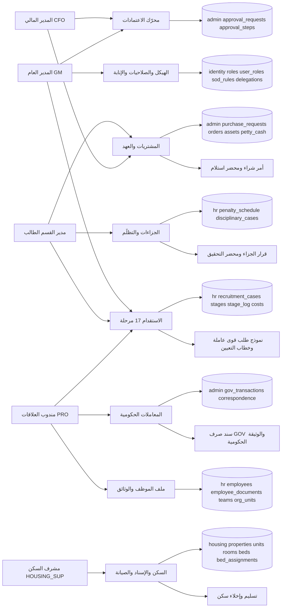

**شرح الخريطة:** كل عملية تنتهي إلى **جدول واحد حامل للحقيقة** ووثيقة تُولَّد من انتقال الحالة لا من تبويب نماذج (40 §B4). المسارات الأربعة التي تلتقي عند `GM` هي بالضبط اعتمادات الموارد البشرية الثلاثة — **إعفاء السكن · جزاء D4 · الاستقدام** — زائد الشراء فوق 2,000 د.ك (02 §7-1 · 11 §7). و`PRO` هو المسار الوحيد إلى الجهات الحكومية (10 §3). و`HOUSING_SUP` يُسند ويُخلي **بلا معتمِد ثانٍ** داخل عقاراته (14 §8).

#### خريطة 6-2: الكيانات الخمسة وموقع الإدارة منها
تقرأ من الكيان القابض إلى الكيانات التشغيلية الأربعة وأثر ذلك على التكلفة.

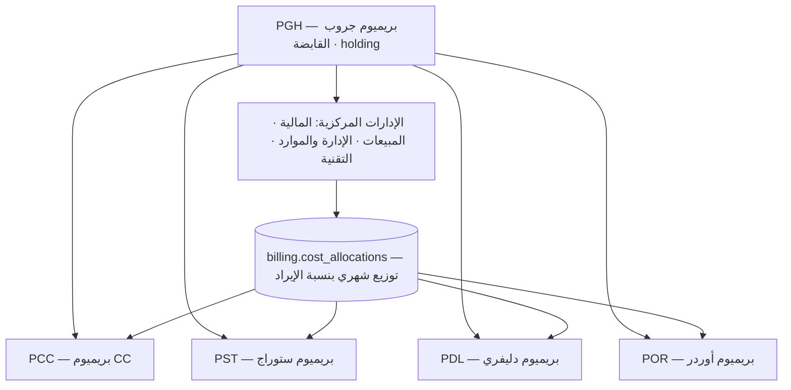

**شرح:** الخمسة مبذورة فعلاً في `platform.entities` بـ`entity_kind` = `holding` واحد و`operating` أربعة. القابضة **لا تُصدر فاتورة عميل** — يمنعها المشغّل `billing.reject_holding_invoice()` (EXEC §1.5). كل صفّ في `hr.employees` و`admin.*` و`housing.*` يحمل `entity_id` **NOT NULL**، وRLS مفعَّل على كل جداول النطاق الثلاثة (تحقُّق حيّ: **46 جدولاً** في `hr` + `housing` + `admin` + `identity` كلها `rls = true`).

---

## 3. البيانات الرئيسية (Master Data)

**الحاكم: 22 §2 — اثنا عشر مجالاً، لكل مجال مالك واحد بمنصب مشغول.** ما يلي المجالات التي يملكها هذا النطاق أو يعتمد عليها مباشرة.

| # | العنصر | الجدول | المالك (المنصب) | بوابة الجودة / الاكتمال | من يعدّل |
|---|---|---|---|---|---|
| **D01** | الكيانات وبيانات الشركة | `platform.entities` · `platform.settings` | **المدير العام** | ١٠٠٪ من حقول السجل التجاري والعنوان والشعار · **صفر مستند بترويسة ناقصة** | `GM` |
| **D02** | المستخدمون والأدوار | `identity.users` · `roles` · `user_roles` · `role_permissions` · `user_entities` | **مدير النظام** (= `GM` في التسكين الحالي) | كل موظف نشط له حساب ودور · **صفر حساب لموظف منتهي الخدمة** | `SYSADMIN` + معتمِد ثانٍ (أربع عيون) |
| **D02ب** | تصنيف حساسية الأعمدة | `identity.column_classification` | **مدير النظام** | **١٠٠٪ من أعمدة 01/13/13B/019** — الحارس G6؛ عمود بلا تصنيف يمنع النشر | `SYSADMIN` |
| **D08** | الموظفون والهيكل | `hr.employees` · `org_units` · `teams` · `employee_documents` | **المدير العام** للهيكل · **`PRO`** للبيانات الورقية | وثائق بتواريخ انتهاء · وحدة · مدير مباشر · `assigned_client_id` · **صفر وثيقة منتهية نشطة** | `GM` (الهيكل والراتب) · `PRO` (الوثائق) |
| **D10** | معرّفات iMile | `imile.driver_ids` · `driver_id_assignments` | **مدير التوصيل** | كل معرّف بحالته وإسناده الزمني · **صفر شحنة بلا سائق منسوب** | `DEL_MGR` |
| **D12** | السكن | `housing.properties` · `units` · `rooms` · `beds` · `bed_assignments` | **مشرف السكن** | عقود · أسرّة · إشغال · حالة الأصول · **صفر موظف بلا سرير مسنَد** | `HOUSING_SUP` داخل عقاراته · `GM` للإعفاء |
| — | لائحة الجزاءات | `hr.penalty_schedule` | **المدير العام** (اعتماد) · `PRO` (اعتماد الهيئة م.36) | **77 بنداً في 9 فئات** — مبذورة فعلاً · **8 بنود `is_fraud`** | `GM` فقط — بيانات مرجعية لا تُعدَّل تشغيلياً |
| — | مراحل الاستقدام | `hr.recruitment_stages` | **المدير العام** | **17 مرحلة بأكواد إنجليزية ثابتة** — مبذورة فعلاً · `default_sla_days = 7` | `GM` يضبط SLA بلا نشر |
| — | الحدود العددية | `platform.thresholds` | **المدير العام** | 44 مفتاحاً مبذوراً · القيم تُعدَّل **بلا نشر** | `GM` |
| — | سلاسل الاعتماد | `platform.approval_chains` | **المدير العام** | مستويات الشراء 100/500/2,000 — **✅ مبذور بـ٨ صفوف (SCH-4 ق-31):** شراء `WH_MGR` 100–500 · `CFO` 500–2,000 · `GM` > 2,000 · فاتورة `CFO` ≥ 500 ثم `GM` · إشعار دائن وجزاء واستثناء سعري كلها `GM` | `SYSADMIN` + معتمِد ثانٍ |
| — | ملكية المجالات | `platform.domain_owners` | **المدير العام** | 12 صفاً `D01…D12` — **✅ مبذورة كلها (SCH-4 ق-30)** بمالك و`gate_target_pct`؛ **⏳ ملكية `D03·D04·D05·D11` بُذرت `CFO` وتحتاج إقرار GM** | `SYSADMIN` + معتمِد ثانٍ |
| — | الميزانيات | `admin.budget_lines` | **المدير المالي** | `fiscal_year × cost_center × gl_account_id` فريد · `available` **عمود مولَّد** | `CFO` |
| — | الأصول والعهد | `admin.assets` · `asset_custody` | مدير القسم الطالب · `CFO` للقيمة | كود ثابت فريد لكل أصل · **عهدة نشطة واحدة لكل أصل** | مدير القسم الطالب |

**قاعدة الملكية (22 §2-1):** الملكية **تتبع المنصب لا الشخص** — من يشغل المنصب يرث مجاله، ولا يُعاد تصميم الهيكل عند تغيّر الأشخاص. و`OPS_DIR` و`HR_MGR` **لا يظهران مالكَين ولا معتمِدَين ولا مستقبِلَي تنبيه في أي سلسلة** (22 · 40 §B1 · R-04).

---

## 4. العمليات

### 4.1 إدارة الهيكل والأدوار والصلاحيات والإنابة

**المدخل:** قرار تنظيمي أو تعيين أو إجازة معتمِد.

1. **`GM`/`SYSADMIN`** يفتح **محرّر الهيكل** (40 §B1: «Structure editor … is a UI screen») ويضيف الدور أو يسند مستخدماً لدور → صفّ في `identity.user_roles` · الحدث: `identity.user_role.granted`.
2. **مشغّل `identity.check_sod`** يعمل `before insert or update of role_id, user_id, revoked_at` على `identity.user_roles` → يرفض الإسناد إن اقترن الدور بدور قائم في `identity.sod_rules` النشطة.
3. أي تغيير على **الصلاحيات أو الأسرار أو قواعد SoD أو سلاسل الاعتماد** يمرّ بـ**أربع عيون**: المنفّذ `SYSADMIN` + معتمِد ثانٍ `DEPUTY_SYSADMIN` **أو** `CFO` (02 §3-2 · EXEC §1.7).
4. **الإنابة** أثناء الإجازة: صفّ في `identity.delegations` بـ`valid_from`/`valid_to` و`reason` و`approved_by` كلها **NOT NULL** → القيد `bounded` يفرض `valid_to > valid_from` و`valid_to ≤ valid_from + 90 days`.
5. **الإنابة لا تلتف على SoD** (ADR-16c) — المشغّل نفسه يفحص الدور المُناب.
6. تعطيل أي قاعدة SoD يتطلب **`GM` + سبباً مسجَّلاً**؛ وكل تغيير يُكتب في `platform.audit_log` بسلسلة التجزئة.

**المخرج:** صلاحية فعّالة ومدقَّقة · جلسة المستخدم تُبطَل فوراً عند تغيّر الدور (40 §B1).

**القواعد المفروضة برمجياً**

| القيد / المشغّل | الحد وقيمته | المصدر | حالة التحقّق الحيّ |
|---|---|---|---|
| `identity.check_sod()` على `user_roles` — إدراج **وتعديل** | 4 أزواج: (`CFO`,`ACCOUNTANT`) · (`SALES_MGR`,`CFO`) · (`WH_OP`,`WH_SUP`) · (`PRO`,`CFO`) | 40 §B1 · EXEC §1.6 | ✅ المشغّل `trg_sod` موجود · 4 صفوف مبذورة نشطة |
| `identity.delegations` قيد `bounded` | **≤ 90 يوماً · `valid_to` إلزامي** | 40 §B1 · 11 §7 | ✅ `check ((valid_to > valid_from) and (valid_to <= valid_from + '90 days'))` |
| `identity.roles` قيد `valid_scope` | **ثمانية نطاقات حصراً**: `all · entity · org_unit · subordinates · assigned · account · client · self` | 02 §5 · 40 §B1 | ✅ مفروض |
| عدد الأدوار | **26** | 40 §B1 + `DEPUTY_SYSADMIN` (EXEC §1.4) | ✅ 26 صفاً مبذوراً |
| RLS على كل جداول `identity` | مفعَّل | 11 §10-1 (الحارس G7) | ✅ 11 جدولاً كلها `rls = true` |
| أربع عيون على الصلاحيات والأسرار | معتمِد ثانٍ `DEPUTY_SYSADMIN` \| `CFO` | 02 §3-2 · EXEC §1.7 | 🟡 سياسة — لا قيد في المخطط (§13) |

---

### 4.2 الاستقدام من الخارج — سبع عشرة مرحلة

**المدخل:** طلب قوى عاملة من مدير القسم الطالب (`WH_MGR`/`DEL_MGR`/`FLEET_MGR`).

1. مدير القسم ينشئ `hr.manpower_requests` — `headcount` · `job_title_ar` · `proposed_salary` · `justification` **NOT NULL** · `source_type = 'overseas'` · `doc_no` من سلسلة **`MPR`**. الحالة `draft`.
2. رفع للاعتماد → `pending_approval` → **اعتماد `GM`** للعدد والراتب والميزانية → `approved` (`approved_by`/`approved_at`/`budget_approved`).
3. لكل مرشّح يُفتح صفّ في `hr.recruitment_cases` بـ`request_id` و`doc_no` و`stage = 'manpower_request'` و**`stage_owner` NOT NULL** — **لا حالة بلا مالك**.
4. كل انتقال مرحلة يكتب صفاً في `hr.recruitment_stage_log` (`from_stage` · `to_stage` · `owner_id` · `entered_at` · `duration_days`) ويحدّث `stage_started_at`.
5. **المشغّل `trg_recruitment_due_at`** (`platform.set_stage_due_at`) يملأ **`due_at`** من `stage_started_at + sla_days` عند كل دخول مرحلة — والتأخر **شرط استعلام** `due_at < now()` لا عمود مولَّد.
6. كل رسم أو أتعاب يُقيَّد في `hr.recruitment_costs` مرتبطاً بـ`gov_transaction_id` و`receipt_url`، ويُجمَّع في `cost_to_date` وفي العرض `hr.recruitment_cost_per_employee`.
7. عند `onboarding_setup` يُطلب سرير من `housing.bed_reservations`، وعند `probation_start` يُولَّد عقد العمل ونموذج المباشرة.
8. **`probation_review`** → تثبيت (`employee_id` يُملأ و`outcome`/`completed_at`) أو إنهاء.

**المخرج:** موظف نشط في `hr.employees` بكوده `PG-####` · تكلفة استقدام مقيسة تُخصَّص لعميله عبر `assigned_client_id`.

#### خريطة 6-3: مراحل الاستقدام السبع عشرة بمالكها
تقرأ من طلب القوى العاملة إلى تقييم فترة التجربة — الأكواد الإنجليزية ثابتة ومقيَّدة في المخطط.

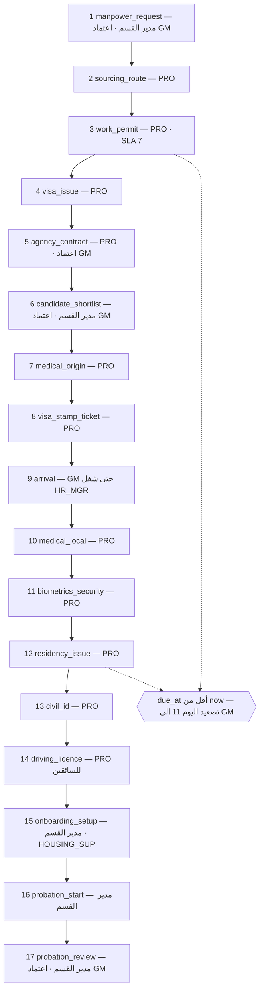

**القواعد المفروضة برمجياً**

| القيد / المشغّل | الحد وقيمته | المصدر | حالة التحقّق الحيّ |
|---|---|---|---|
| `chk_recruitment_cases_stage` | **17 كوداً حصراً** من `manpower_request` إلى `probation_review` | 10 §4-1 · 40 §C7 | ✅ القيد يعدّد السبعة عشر بالحرف |
| `hr.recruitment_cases.stage_owner` | **NOT NULL** — لا مرحلة بلا مالك | 10 §5 · 40 Part E · S13 | ✅ |
| `sla_days` | **افتراضي 7 أيام** لكل مرحلة | 40 Part E · S13 | ✅ `default 7` في الجدول وفي `recruitment_stages.default_sla_days` |
| `trg_recruitment_due_at` | `due_at = stage_started_at + sla_days` | 40 §C7 | ✅ المشغّل موجود ويستدعي `platform.set_stage_due_at` |
| عتبة التصعيد | `recruitment.escalate_pct = 50` ⇒ **اليوم الحادي عشر** | 40 §B5 · Part E S13 · ADM-37 | ✅ مبذورة، ومعها `recruitment.escalate_days = 11` |
| `positive_headcount` على `manpower_requests` | `headcount > 0` | 13 | ✅ |
| `hr.recruitment_stages` | **17 صفاً** بترتيب `seq` فريد | 10 §4-1 | ✅ 17 صفاً مبذوراً (الحارس G-SEED) |
| `justification` على طلب القوى العاملة | **NOT NULL** — لا طلب بلا مبرر | 13 | ✅ |

**التكلفة وتحميلها على العميل (10 §6 · 11 §9):** بنود التكلفة = رسوم إذن العمل والتأشيرة · أتعاب مكتب الاستقدام · التذكرة · الفحصان الطبيان · رسوم الإقامة والبطاقة المدنية · التأمين الصحي · رخصة القيادة · التهيئة. المجموع من `hr.recruitment_costs` ← العرض `hr.recruitment_cost_per_employee.total_cost` ← يُخصَّص للعميل عبر `hr.employees.assigned_client_id` ← **يُطفأ على مدة العقد** (EXEC §1.3). أساس المعالجة المحاسبية **ما زال مفتوحاً** (§13).

---

### 4.3 ملف الموظف والوثائق

**المدخل:** موظف جديد أو تجديد وثيقة.

1. `PRO` يرفع الوثيقة إلى `hr.employee_documents` — `doc_type` · `expiry_date` **NOT NULL** · `file_url` · `alert_days_before`.
2. محرّك التنبيهات يقرأ `expiry_date` ويولّد **N-04** عند دخول كل درجة من السلّم.
3. الوثيقة المنتهية تُفعِّل **حاجزاً صلباً**: إقامة منتهية ⇒ الموظف لا يُسند لمهمة · رخصة منتهية ⇒ السائق لا يُسند لمركبة (10 §8 · 12 س17).
4. التجديد الجماعي يُفتح كمعاملة حكومية واحدة في `admin.gov_transactions`، والناقص يُحوَّل مهمةً بمالك ومهلة (12 س17 · 40 Part E S17).

**سلّم التنبيه الموحَّد — القيمة الحاكمة الوحيدة**

| البند | القيمة | المصدر |
|---|---|---|
| **سلّم وثائق الموظف** | **90 / 45 / 30 / 15 يوماً** — **السلّم الواحد؛ الوثيقتان 03 و35 صُحِّحتا إليه** | 40 §C7 · EXEC (R-06) |
| التنبيه المرتبط | **N-04** — أسبوعي مجمّع · يصير يومياً عند ≤ 15 يوماً · الهدف: الموارد (**= `GM`**) + `PRO` | 25 §2 |
| السلالم التفصيلية في 10 §8 | إقامة 90 ثم 45·30·15 · بطاقة مدنية 60 ثم 30·15 · رخصة 60 ثم 30·15 · جواز 180 ثم 90·30 · تأمين 30 ثم 15 | 10 §8 |
| الحاجزان الصلبان | إقامة منتهية → لا إسناد مهمة · رخصة منتهية → لا إسناد مركبة | 10 §8 |
| بوابة بيانات M08 | **١٠٠٪ موظفين بوثائق وتواريخ انتهاء** — المالك **`GM`** (`HR_MGR` غير مشغول) | 22 §6 |

> **ملاحظة اتساق:** `hr.employee_documents.alert_days_before` قيمته الافتراضية في القاعدة **60**، بينما السلّم الحاكم يبدأ من **90**. الحقل صالح كتجاوز لكل وثيقة، والسلّم يُطبَّق من محرّك التنبيهات لا من العمود.

---

### 4.4 الجزاءات والتظلّم

**المدخل:** واقعة مرصودة من مشرف أو تفتيش أو نظام أو شكوى عميل.

1. الراصد يسجّل الواقعة في `hr.disciplinary_cases`: `incident_date` · **`proven_date`** · `reported_by` · `description` **NOT NULL** · `evidence_urls` · `penalty_code` من القائمة المنسدلة (77 بنداً).
2. الدالة `hr.next_penalty_degree(employee, code)` تحسب الدرجة المستحقة = **عدد الوقائع على البند نفسه خلال 12 شهراً**، مرفوعة إلى **`min_degree`** البند ومحدودة بـ4.
3. **المشغّل `trg_penalty_authority`** (`hr.check_penalty_authority`) يعمل `before insert or update of applied_degree, signed_by, signer_role, penalty_type`:
   - يقارن `applied_degree` بسقف `signer_role` عبر `hr.max_degree_for_role`؛
   - **الفصل أو الدرجة الرابعة → `GM` حصراً** (لغير `GM` يُخفَّض السقف إلى 3)؛
   - عند التجاوز **يُحفظ الصفّ** بـ`routed_to` = أقرب مخوَّل صاعد في سلسلة `hr.employees.reports_to` و`routed_reason`، والحالة `pending_authority` — **إحالة لأعلى لا رفض صامت**؛
   - يرفض أن يبتّ **في التظلّم من وقّع الجزاء** (`grievance_decided_by = signed_by` → استثناء).
4. **إجراءات المادة 37 الخمسة** تُستوفى قبل أي خصم — يفرضها القيد `art37_due_process`.
5. التوقيع خلال **15 يوماً من الثبوت** (`art35_15_days`)؛ التجاوز بـ**`art35_override_by`** = قرار `GM` مسجَّل.
6. الامتناع عن التوقيع ⇒ **شاهدان برقمين مدنيين مختلفين** (`witnesses_required`).
7. **مهلة تظلّم 7 أيام** قبل الترحيل؛ التظلّم يبتّه **المستوى الأعلى**؛ الجزاء الملغى يُشطب ولا يُحتسب في العدّاد.
8. الترحيل للرواتب بسقف **م.38: 5 أيام شهرياً** والزائد في `carried_forward_amount`.

**المخرج:** قرار جزاء موقَّع · محضر تحقيق بالملف · قيد في سجل الجزاءات (م.40) وحصيلة شهرية (R-21).

#### خريطة 6-4: مسار الجزاء من الواقعة إلى الترحيل
تقرأ من رصد الواقعة إلى القيد في السجل، مع بوابتي السلطة والمادة 37.

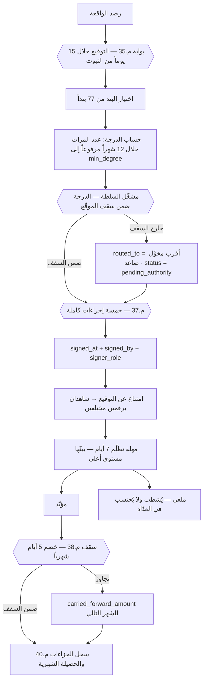

**اللائحة — 77 بنداً في تسع فئات (تحقُّق حيّ: `select count(*) from hr.penalty_schedule` = 77)**

| الفئة | الرمز | العدد المنصوص | العدد في القاعدة |
|---|---|---|---|
| الحضور والانصراف | `ATT` | 10 | ✅ 10 |
| أداء العمل | `WRK` | 11 | ✅ 11 |
| المركبات والقيادة | `VEH` | 11 | ✅ 11 |
| العملاء والشحنات | `CLI` | 10 | ✅ 10 |
| السلامة والمستودع | `SAF` | 8 | ✅ 8 |
| السلوك والانضباط | `CON` | 10 | ✅ 10 |
| السكن | `HOU` | 9 | ✅ 9 |
| العهد والأصول | `CST` | 4 | ✅ 4 |
| النظام والبيانات | `SYS` | 4 | ✅ 4 |
| **الإجمالي** | | **77** | **✅ 77** |

**درجات الجزاء:** `D1` تنبيه شفهي مُوثَّق · `D2` إنذار كتابي · `D3` خصم من الأجر بعدد أيام البند · `D4` خصم أكبر أو الفصل للحالات الجسيمة (م.41). **أجر اليوم = الراتب الشامل ÷ 30** · **عدّاد التكرار يُصفَّر بعد 12 شهراً** (15 §1-1).

**السلطة الهرمية — السقوف المفروضة بالدالة `hr.max_degree_for_role`**

| المنصب الموقِّع | السقف | القيمة في الدالة الحيّة |
|---|---|---|
| مشرف (`WH_SUP` · `DEL_SUP`) | **D1–D2** | ✅ 2 |
| مدير (`WH_MGR` · `DEL_MGR` · `SALES_MGR` · `FLEET_MGR` · `HOUSING_SUP` · `CFO` · `CC_MGR`) | **D1–D3** | ✅ 3 |
| **`GM`** | **D1–D4 — والفصل له وحده** | ✅ 4 |
| أي دور آخر | لا سلطة جزاء | ✅ 0 |

**القواعد المفروضة برمجياً**

| القيد / المشغّل | الحد وقيمته | المصدر | حالة التحقّق الحيّ |
|---|---|---|---|
| `art35_15_days` | `signed_at is null` **أو** `art35_override_by is not null` **أو** `signed_at <= proven_date + 15` | م.35 · 15 §3-2 | ✅ |
| `art35_incident_before_proof` | `proven_date >= incident_date` | 15 §3-2 | ✅ |
| `art37_due_process` | الخصم يتطلب **الخمسة**: `notified_at` · `statement_heard` · `defence_investigated` · **`investigation_minutes_url`** · `decision_notified_at` | م.37 · 40 §C7 | ✅ |
| `witnesses_required` | الامتناع ⇒ شاهدان **برقمين مدنيين مختلفين** | م.37 | ✅ |
| `valid_category` | **تسع فئات حصراً** | 15 §3-2 | ✅ |
| `chk_penalty_min_degree` | `1 ≤ min_degree ≤ 4` | 15 §4-12 | ✅ |
| `is_fraud` | **`true` على ثمانية أكواد**: `CLI-02/03/04/06/09` · `ATT-07/08` · `WRK-08` — يقرؤها محرّك `driver_trust` (ADR-28) | 15 §4-13 · 40 §C7 | ✅ 8 صفوف بالضبط |
| `hr.check_penalty_authority()` | سقف الدرجة · الفصل لـ`GM` · **إحالة لأعلى** · التظلّم لمستوى أعلى | 15 §3-2 · EXEC §1.6 | ✅ المشغّل موجود · 🟡 فحص سلسلة الإشراف غير منفَّذ (§13) |
| مهلة التظلّم | **7 أيام** قبل الترحيل | 15 §3 | 🟡 سياسة — لا قيد زمني في المخطط |
| سقف م.38 | **خصم ≤ أجر 5 أيام شهرياً** والزائد يُرحَّل | م.38 · 40 §C7 | 🔴 لا مفتاح له في `platform.thresholds` (§13) |
| الشارة التحذيرية | تحذير على **كل** جزاء حتى `penalty_schedule_approved = true` — اعتماد الهيئة العامة للقوى العاملة (م.36) | 15 · 40 §C7 | **✅ المفتاح `hr.penalty_schedule_approved = false` مبذور في `platform.settings` (SCH-4)** — الشارة تعمل؛ **⏳ يبقى الاعتماد الرسمي نفسه** |
| مؤشر مراجعة السلطة | مدير تُلغى جزاءاته بالتظلّم **> 30٪** تُراجَع صلاحيته | 40 §C7 | 🟡 مؤشر تقرير |

> ⚠️ **التحفّظ القانوني نافذ بحرفيته (15 صدر الوثيقة):** اللائحة مُعدّة هندسياً ومُوفَّقة مع نصوص قانون العمل 6/2010، **وتُراجَع مع المستشار القانوني وتُعتمد من الهيئة العامة للقوى العاملة قبل فرض أي جزاء**. والمواد 35–41 مذكورة **بأرقامها كمرجع لا كفتوى**.

> **حالة خاصة (15 §4-1):** غرامة العميل على **سائق العمولة** تخفيض لقاعدة العمولة لا خصم من أجر — فلا تدخل سقف م.38؛ أما سائق الراتب فالغرامة خصم يدخل السقف. **تكييف يحتاج تأكيد المستشار القانوني.**

---

### 4.5 عمولة السائقين — الحساب اليومي

**المدخل:** أرقام iMile المسحوبة الساعة 23:00.

1. الوكيل يسحب شحنات اليوم → النظام ينسب كل شحنة عبر **الإسناد الزمني** `imile.driver_id_assignments` (العرض `imile.shipments_attributed`) — **لا ربط مباشر بـ`driver_code` في أي استعلام**.
2. يطبّق `hr.commission_rules` السارية بنافذة `valid_from`/`valid_to`.
3. يكتب `hr.commission_daily` صفاً واحداً لكل **(يوم × موظف)** مع **`source_snapshot jsonb` NOT NULL** — لقطة مجمَّدة من أرقام iMile هي الدليل في أي نزاع.
4. 07:00 السائق يرى عمولة أمس في تطبيقه — **نافذة اعتراض 48 ساعة** → مراجعة مشرف التوصيل.
5. إقفال الشهر → `payroll_period` → الترحيل لمسير الرواتب.

**الحساب — قرار مغلق ومُعلَّم FIXED (EXEC §1.2 · 40 §C7)**

| البند | القيمة | المفتاح في `platform.thresholds` | تحقُّق حيّ |
|---|---|---|---|
| الأساس | **0.300 د.ك لكل شحنة مسلَّمة — ثابت بلا شرائح** | `driver.commission_base` | ✅ 0.300 KWD |
| بونص الجودة | **+0.050 د.ك لكل شحنة** عند **الشرطين معاً في الشهر**: التسليم من أول محاولة **≥ 85٪** **وبلا أي فرق COD** | `driver.commission_bonus` · `driver.bonus_first_attempt_pct` | ✅ 0.050 · ✅ 85 |
| خصم السكن | **23 د.ك شهرياً** | `housing.deduction` | ✅ 23.000 |
| خصم الهاتف | **5 د.ك شهرياً** | `housing.phone_deduction` | ✅ 5.000 |
| خصم الإقامة | **12 د.ك شهرياً** | `housing.residency_deduction` | ✅ 12.000 |
| نافذة الاعتراض | **48 ساعة** | — | 🟡 سياسة — لا عمود مهلة في المخطط |
| الربط بالتقييم | **العمولة لا تُربط بترتيب الأقران ولا بدرجة الثقة** — `driver_trust` لا يُربط بأجر ولا بجزاء (ADR-28) | — | — |

**مثال حسابي كامل — سائق في شهر 30 يوماً**

| البند | الحساب | القيمة (د.ك) |
|---|---|---|
| شحنات مسلَّمة في الشهر | 1,200 شحنة | — |
| العمولة الأساسية | 1,200 × **0.300** | **360.000** |
| نسبة التسليم من أول محاولة | 88٪ ⇒ **≥ 85٪** ✅ | — |
| فرق COD في الشهر | صفر ✅ | — |
| بونص الجودة | 1,200 × **0.050** (الشرطان متحقّقان) | **60.000** |
| **إجمالي العمولة `gross_commission`** | 360.000 + 60.000 | **420.000** |
| خصم السكن `deduction_housing` | **23.000** | −23.000 |
| خصم الهاتف `deduction_phone` | **5.000** | −5.000 |
| خصم الإقامة `deduction_residency` | **12.000** | −12.000 |
| **الصافي `net_commission`** | 420.000 − 40.000 | **380.000** |

**ولو اختلّ شرط واحد:** نسبة أول محاولة 83٪ ⇒ **لا بونص** ⇒ الإجمالي 360.000 والصافي **320.000**. **فرق البونص الشهري = 60.000 د.ك** — وهو ما يجعل الشرطين قابلين للقياس اليومي لا للتقدير.

**القواعد المفروضة برمجياً**

| القيد / المشغّل | الحد وقيمته | المصدر | تحقُّق حيّ |
|---|---|---|---|
| `commission_daily_work_date_employee_id_key` | **صفّ واحد لكل (يوم × موظف)** — يمنع الاحتساب المزدوج | 10 §13 | ✅ فهرس فريد |
| `source_snapshot jsonb` | **NOT NULL** — لقطة مجمَّدة مع كل حساب | 10 §13 · 40 §C7 | ✅ |
| `deduction_needs_reason` | خصم > 0 ⇒ `deduction_reason` إلزامي — **لا خصم تقديري** | 10 §15 | ✅ |
| `chk_commission_daily_status` | `calculated · disputed · approved · paid` | STATE-REGISTER | ✅ (الوثيقة 10 §13 تسمّيها `confirmed` — §13) |
| `driver_id_assignments` فهرسان جزئيان فريدان | إسناد نشط واحد **لكل معرّف** وواحد **لكل موظف** | 10 §11 · 40 §C7 | ✅ |
| `hr.close_driver_id_on_termination()` | إنهاء الخدمة **يُغلق الإسناد آلياً** ويحرّر المعرّف | 10 §20 | ✅ المشغّل `trg_close_driver_id` على `hr.employees` |
| معرّف موقوف لسبب **سلوكي** | **لا يُعاد تخصيصه** — يُعاد لـiMile ويُطلب بديل | 10 §17 · 40 Part E S16 | ✅ منصوص · التنفيذ في نطاق iMile |

---

### 4.6 السكن — الإسناد والإخلاء والصيانة والتفتيش

**المدخل:** موظف جديد أو حالة استقدام تقترب من الوصول.

1. **الهرم:** عقار `housing.properties` → وحدة `units` → غرفة `rooms` → **سرير `beds` = وحدة الإسناد**.
2. `HOUSING_SUP` يفتح طلب سكن → النظام يعرض الأسرّة المتاحة مرتّبة بمعايير التجانس **بترتيبها الحاكم**: ① **الوردية** ② **تجانس الفريق** ③ قرب موقع العمل ④ الجنسية واللغة (EXEC §1.3 · ADM-26).
3. حجز السرير للمستقدَم قبل وصوله → `housing.bed_reservations` بـ`reserved_from` و**`expires_at` NOT NULL**.
4. التسليم: مفتاح · أثاث · قواعد السكن · توقيع → **نموذج «تسليم سكن»** (`handover_doc_id`).
5. **صفّ إسناد جديد** في `housing.bed_assignments` بـ`assigned_to = null` — **الإشغال يتغيّر من هنا، لا بتحديث `beds.status`**. خصم السكن يبدأ من `assigned_from` **بالتناسب اليومي**.
6. **الإخلاء:** فحص الغرفة → تلف؟ يُحمَّل على الذمة → تسليم المفتاح → إغلاق الإسناد (`assigned_to` + `end_reason`) → السرير `available` أو `maintenance`. **إخلاء الطرف لا يكتمل قبل إخلاء السكن — حاجز صلب.**
7. **الصيانة:** بلاغ في `housing.maintenance_requests` بـ`priority` و`sla_hours`؛ التكلفة فوق الحد تمر بدورة المشتريات عبر `purchase_order_id`؛ إتلاف متعمَّد → `charged_to_resident` + بند جزائي `HOU-02`.
8. **التفتيش:** شهري لكل وحدة ومفاجئ عند الشكوى → `housing.inspections` بـ`occupancy_matches` و`unauthorized_occupants` و`violations_raised`. **ساكن غير مسجَّل = مخالفة جسيمة بالبند `HOU-05`.**

#### خريطة 6-5: السكن — الهرم ومصدر حقيقة الإشغال
تقرأ من العقار إلى السرير، ومن الإسناد الزمني إلى الخصم والتكلفة والربحية.

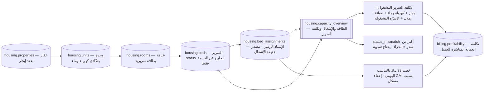

**القواعد المفروضة برمجياً**

| القيد / المشغّل | الحد وقيمته | المصدر | تحقُّق حيّ |
|---|---|---|---|
| `bed_assignments_bed_id_idx` | **سرير واحد لا يُسنَد لشخصين** — فهرس فريد جزئي `where assigned_to is null` | 14 §3 · 40 §C7 | ✅ |
| `bed_assignments_employee_id_idx` | **شخص واحد لا يشغل سريرين** | 14 §3 | ✅ |
| `valid_period` | `assigned_to is null` أو `assigned_to >= assigned_from` | 13B | ✅ |
| `positive_capacity` على `rooms` | `bed_capacity > 0` | 13B | ✅ |
| مصدر حقيقة الإشغال | **`bed_assignments` النشطة — لا `beds.status`** · و`status_mismatch` يُظهر الانحراف | 14 §4 · EXEC §1.3 | ✅ العرض `housing.capacity_overview` مبني بالصيغة الصحيحة بـ`left join` |
| خصم السكن | **23 د.ك شهرياً بالتناسب اليومي** · يُخصم **ممن له إسناد نشط فقط** | `housing.deduction` · EXEC §1.3 · ADM-27 | ✅ 23.000 |
| الإعفاء | **`GM` حصراً وبسبب مسجَّل** في `charge_waived` + `waiver_reason` | 14 §6-1 · EXEC §1.3 · ADM-28 | ✅ العمودان موجودان · 🟡 هوية المعفي غير مخزَّنة (§13) |
| السكن بلا إسناد | **مخالفة `HOU-05` لا خصم** | 14 §6-1 | ✅ البند مبذور |
| SLA الصيانة | **4 ساعات طوارئ · 24 عالٍ · 48 عادي** | 14 §5-3 · EXEC §1.3 · 40 §C7 | ✅ `sla_hours default 48` |
| الحد الأدنى للإشغال | **70٪** قبل مراجعة عقد الإيجار | `housing.min_occupancy_pct` | ✅ 70.000 |
| صلاحية `HOUSING_SUP` | `housing.*` قراءة وكتابة **بلا معتمِد ثانٍ** داخل عقاراته · `hr.employees` قراءة **الكود والاسم والوحدة فقط** · **لا رواتب ولا بيانات تجارية** | 14 §8 · EXEC §1.7 | **✅ العرض `hr.employees_basic` مُنشأ (SCH-4)** بثلاثة أعمدة (`code` · `name_ar` · `org_unit_id`) زائد المفاتيح — لا راتب ولا مدني ولا جواز ولا هاتف |
| إخلاء الطرف | **لا يكتمل قبل إخلاء السكن** | 14 §5-2 | 🟡 سياسة — لا قيد في المخطط |

**الاقتصاد (14 §6-2):** إن كانت تكلفة السرير الفعلية **38 د.ك** والخصم **23**، فالفرق **15 د.ك × عدد الموظفين شهرياً** تكلفة تحمّلها الشركة. النظام **يُظهرها بنداً صريحاً** في لوحة الربحية بدل ترحيلها على الموظف — وهذا قرار مغلق (14 §9-1).

---

### 4.7 دورة المشتريات

**المدخل:** حاجة تشغيلية من أي قسم.

1. الطالب يفتح `admin.purchase_requests` — `cost_center` **NOT NULL** · `client_id` إن أمكن · `budget_line_id` · `estimated_amount` · `description` **NOT NULL**.
2. **فحص آلي:** بند الميزانية والرصيد المتاح من `admin.budget_lines.available` (**عمود مولَّد** = `annual_amount − committed_amount − spent_amount`).
3. مسار الاعتماد **بالحدّ المالي لا بالمسمّى** (§4-12).
4. فوق **500 د.ك: ثلاثة عروض إلزامية** في `admin.vendor_quotes`؛ الترسية ليست بالضرورة على الأرخص — لكن **`selection_reason` إلزامي** عند `is_selected`.
5. `admin.purchase_orders` برقمه من سلسلة **`PO`** → المورّد → يحجز `committed_amount`.
6. الاستلام والفحص → **المطابقة الثلاثية**: أمر الشراء ↔ الاستلام ↔ الفاتورة → `three_way_matched`.
7. **بوابة الدفع:** القيد `no_pay_before_match` يمنع `paid_at` ما لم يكن `three_way_matched = true`.
8. القيد المحاسبي: مدين 5xxx أو 1500 أصول | دائن 2100 ذمم موردين؛ ثم الدفع: مدين 2100 | دائن 1100 بنك.
9. الأصول المشتراة تُسجَّل في `admin.assets` بكود ثابت فريد وتُسلَّم عهداً بنماذج موقَّعة.

#### خريطة 6-6: المشتريات من الطلب إلى الدفع
تقرأ من طلب الشراء إلى بوابة المطابقة الثلاثية التي تحكم الدفع.

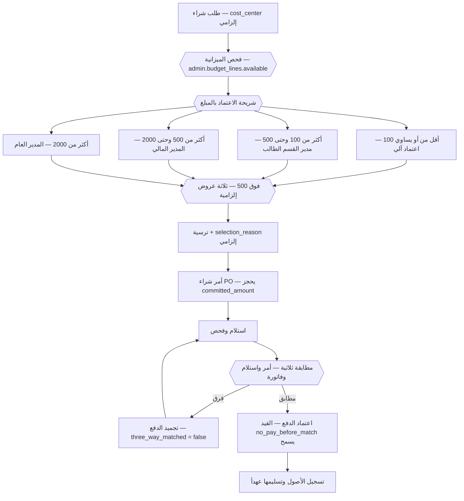

**القواعد المفروضة برمجياً**

| القيد / المشغّل | الحد وقيمته | المصدر | تحقُّق حيّ |
|---|---|---|---|
| `no_self_approval` على `purchase_requests` | `approved_by is null or approved_by <> requested_by` — **قيد فعلي لا `check(true)`** | 11 §10-1 · 40 §B5 | ✅ |
| `no_pay_before_match` | `paid_at is null or three_way_matched` — **بوابة الدفع** | 11 §3-1 · 40 §C7 | ✅ |
| `selected_needs_reason` | `not is_selected or selection_reason is not null` | 11 §10 | ✅ |
| `cost_center` على طلب الشراء | **NOT NULL** — معاملة بلا مركز تكلفة تُرفض | 11 §9 | ✅ |
| `available` على `budget_lines` | عمود مولَّد = `annual − committed − spent` | 11 §10 | ✅ |
| بند ميزانية فريد | `entity_id × fiscal_year × cost_center × gl_account_id` | 11 §10 | ✅ فهرس فريد |
| فصل المهام الرباعي | **من يطلب ≠ من يعتمد ≠ من يستلم ≠ من يدفع** | 11 §3-1 | 🟡 مفروض جزئياً: `no_self_approval` فقط |
| فاتورة بلا أمر شراء | **مرفوضة** — إلا باعتماد استثنائي من `GM` بسبب مسجَّل | 11 §3-1 · §12-4 | 🟡 سياسة |

**مستويات الاعتماد — الجدول الحاكم (EXEC §1.1 · 11 §3-0)**

| الشريحة (د.ك) | المعتمِد | المنصب المسنَد اليوم | المفتاح | تحقُّق حيّ |
|---|---|---|---|---|
| **≤ 100** | **لا معتمِد — اعتماد آلي** | النظام | `purchase.auto_max = 100` | ✅ 100.000 |
| **> 100 · ≤ 500** | **مدير القسم الطالب** | `WH_MGR` · `DEL_MGR` · `SALES_MGR` · `FLEET_MGR` · `CC_MGR` بحسب مركز التكلفة | `purchase.manager_max = 500` | ✅ 500.000 |
| **> 500 · ≤ 2,000** | **المدير المالي** | `CFO` | `purchase.cfo_max = 2000` | ✅ 2000.000 |
| **> 2,000** | **المدير العام** | `GM` | — | — |
| عتبة العروض الثلاثة | **500 د.ك** | — | `purchase.three_quotes_min = 500` | ✅ 500.000 |

---

### 4.8 العهدة النقدية

**المدخل:** اعتماد `CFO` لحدّ عهدة لحاملها.

1. `admin.petty_cash` — صفّ واحد لكل حامل بـ`limit_amount` و`max_single_txn` (افتراضي **50**) و`current_balance`؛ **فهرس فريد جزئي** يمنع أكثر من عهدة نشطة للحامل الواحد.
2. كل صرف صفّ في `admin.petty_cash_transactions` بـ`txn_type` و`amount` و`description` **NOT NULL** و`cost_center`.
3. **لا صرف بلا إيصال:** القيد `expense_needs_receipt` يفرض `receipt_url` على كل `txn_type = 'expense'`.
4. ما يتجاوز سقف العملية الواحدة يمرّ بدورة المشتريات.
5. **التسوية** عند بلوغ **70٪ من الحد** أو نهاية الشهر — أيهما أسبق؛ و**التجديد بعد اعتماد التسوية فقط**.
6. **جرد مفاجئ:** نقد + مستندات = الحد، في أي لحظة. المستندات الناقصة تُخصم من حامل العهدة.

| القيد | الحد وقيمته | المصدر | تحقُّق حيّ |
|---|---|---|---|
| `expense_needs_receipt` | `txn_type <> 'expense' or receipt_url is not null` | 11 §4 · §10 | ✅ |
| `petty_cash_holder_employee_id_idx` | **عهدة نشطة واحدة لكل حامل** | 40 §C7 | ✅ فهرس فريد `where status = 'active'` |
| `max_single_txn` | افتراضي **50 د.ك** — فوقه دورة المشتريات | 13 | ✅ `default 50` |
| حد العهدة ومن يحملها | **بيانات يعتمدها `CFO`** لا قرار تصميم | 11 §12-3 | — |
| التسوية عند 70٪ أو نهاية الشهر | | 11 §4 | 🟡 سياسة — لا مفتاح في `thresholds` |

---

### 4.9 العهد الشخصية والأصول

**المدخل:** أصل مُسجَّل + طلب عهدة معتمد.

1. الأصل يُسجَّل **مرة واحدة** في `admin.assets` بكود ثابت فريد (`assets_code_key`) و`asset_type` يشمل **`imile_id`**.
2. التسليم بتوقيع → صفّ في `admin.asset_custody` (`issued_at` · `issued_by` · `condition_at_issue` · `handover_doc_id`) → **نموذج تسليم عهدة**.
3. **الفهرس الفريد الجزئي** `(asset_id) where returned_at is null` يمنع تسليم الأصل الواحد لشخصين.
4. الاسترجاع بتوقيع مع `condition_at_return`؛ التالف → تقرير؛ المفقود → تحقيق → `loss_reason` و`charged_amount` أو شطب.
5. **إنهاء الخدمة لا يكتمل قبل استرجاع كل العهد — حاجز صلب في مسار المخالصة** (11 §5 · 40 Part E S15).
6. **معرّف iMile عهدة**: يُغلق إسناده آلياً عند إنهاء الخدمة بمشغّل `hr.close_driver_id_on_termination()` — لا خطوة يدوية تُنسى.

---

### 4.10 المعاملات الحكومية وسلسلة `GOV`

**المدخل:** حاجة إلى إذن عمل أو إقامة أو رخصة أو تجديد أو ترخيص.

1. `PRO` يفتح `admin.gov_transactions` — `transaction_type` · `authority` · `related_table`/`related_id` · `recruitment_case_id` إن كانت من دورة استقدام · `stage_owner` **NOT NULL** · `sla_days` (افتراضي 7).
2. **المشغّل `trg_gov_due_at`** يملأ `due_at` من `stage_started_at + sla_days` عند كل تغيّر في `stage` أو `sla_days`.
3. تجميع المستندات بقائمة تحقق لكل نوع → التقديم → **`government_ref`** المرجع الحكومي للمتابعة.
4. **كل صرف رسوم** يُسجَّل بـ`fees_paid` و`receipt_url` **وسند من سلسلة `GOV` حصراً** — منفصلة تماماً عن `RCT`.
5. الإنجاز → `result_doc_url` → رفع الوثيقة → تحديث سجل الموظف أو المركبة → `completed_at`.
6. المتأخرة: `due_at < now() and completed_at is null` — يخدمها الفهرس `(stage_owner, due_at) where completed_at is null` ويولّد **N-15**.

#### خريطة 6-7: تيّارا النقد عند المندوب — الفصل الحاكم
تقرأ من مصدر النقد إلى سلسلته إلى من يطابقه.

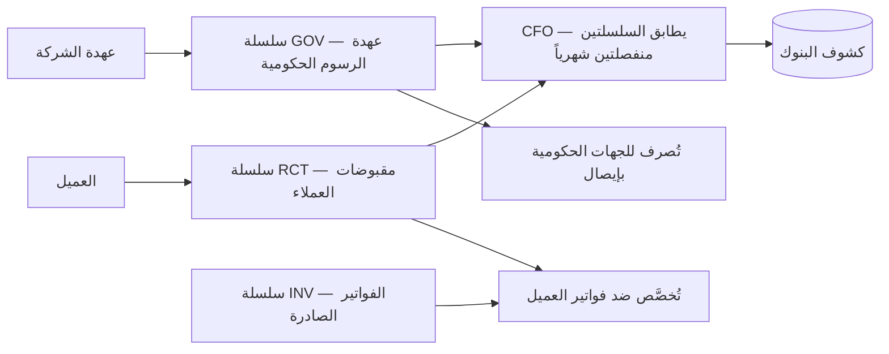

**القواعد المفروضة برمجياً**

| القيد / المشغّل | الحد وقيمته | المصدر | تحقُّق حيّ |
|---|---|---|---|
| `stage_owner` | **NOT NULL** — لا معاملة بلا مالك | 11 §6 · 40 §C7 | ✅ |
| `trg_gov_due_at` | `due_at` بمشغّل — **لا عمود مولَّد** لأن `now()` غير ثابت | 11 §10-1(أ) · 40 §C7 | ✅ |
| `chk_gov_transactions_stage` | `requested · submitted · in_progress · completed · rejected` | STATE-REGISTER | ✅ |
| فهرس المتأخرات | `(stage_owner, due_at) where completed_at is null` | 11 §10-1 | ✅ |
| **`fee_voucher_no`** من سلسلة `GOV` | إلزامي مع `receipt_url` — **الخلط بين `RCT` و`GOV` ممنوع** | 11 §6-1 · EXEC §1.6 · 40 §C6 | **✅ العمود مُضاف ومفروض بقيدين (SCH-4 ق-21):** `chk_gov_voucher_series` (صيغة `-GV-`) و`chk_gov_fees_need_voucher` (رسوم مدفوعة ومعاملة مقفلة ⇒ سند إلزامي) |
| السلسلة `RCP` | **مُلغاة** — تُحذف من البذرة و`platform.counters` | 11 §6-1 · EXEC §1.4 | ✅ لا وجود لها في `platform.counters` |
| المطابقة | **`CFO` وحده يطابق التيارين** — الضابط التعويضي الوحيد لتجميع `PRO` = `ACCOUNTANT` | EXEC §1.6/§1.7 | ✅ زوج SoD (`PRO`,`CFO`) مبذور ونشط |

---

### 4.11 المراسلات والأرشفة

1. **الوارد** يُقيَّد في `admin.correspondence` بـ`direction` و`doc_no` من سلسلة **`COR`** و`correspondent` و`subject` **NOT NULL**، ويُحال إلى `assigned_to` بمهلة `due_at`.
2. **الصادر** يُقيَّد برقمه ويُربط بالوارد عبر `reply_to_id` ذاتي المرجع.
3. المراسلات الرسمية تحمل **ترويسة الكيان المُصدِر آلياً** من `platform.entities`.
4. كل مراسلة تُربط بعميل أو موظف أو معاملة عبر `related_table`/`related_id`.
5. الأرشفة: بحث بالرقم والتاريخ والجهة والموضوع؛ الحالات `open · replied · closed`.

---

### 4.12 محرّك الاعتمادات الإدارية — محرّك واحد لكل الطلبات

**المدخل:** أي طلب يحتاج قراراً — شراء · إجازة · سلفة · استثناء سعري · إشعار دائن · صرف عهدة · سفر · تعيين · إعفاء سكن · جزاء D4 · تغيير صلاحيات.

1. `admin.approval_requests` — `request_type` · `source_table`/`source_id` · `amount` · `requested_by` · `current_step` · `due_at`.
2. الخطوات في `admin.approval_steps` — `step_no` فريد لكل طلب · `approver_role` · `approver_user_id` · **`delegated_from`** و`delegation_expires_at` · `decision` · `decision_note`.
3. **مشغّل `trg_no_self_approval`** (`admin.reject_self_approval`) يرفض أن يكون `approver_user_id` هو نفسه `requested_by` — **بمُشغِّل لا بـ`check`**، لأن `CHECK` لا يقبل استعلاماً فرعياً في PostgreSQL.
4. السلاسل تُقرأ من `platform.approval_chains` — **الصلاحية بالحد المالي لا بالمسمّى**.
5. تجاوز `due_at` ⇒ تنبيه **N-17** للمستوى الأعلى.

#### خريطة 6-8: محرّك الاعتماد الواحد
تقرأ من الطلب إلى القرار، مع ضابطَي لا-اعتماد-ذاتي ولا-معتمِد-على-منصب-شاغر.

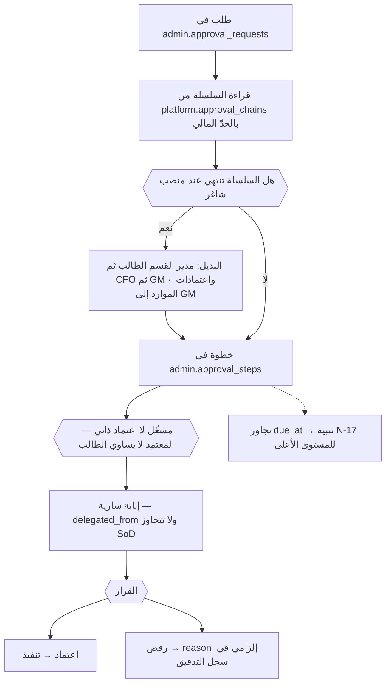

**جدول المسارات — كل معتمِد يشغل منصباً مشغولاً فعلاً (11 §7 · R-04)**

| نوع الطلب | المسار | الدور المُسنَد |
|---|---|---|
| شراء | حسب الحد المالي (§4-7) | آلي / مدير القسم الطالب / `CFO` / `GM` |
| إجازة | المشرف المباشر → **المدير العام** | `<supervisor>` → `GM` |
| سلفة موظف | المشرف المباشر → **المدير المالي** | `<supervisor>` → `CFO` |
| استثناء سعري | مدير المبيعات → المدير المالي → **المدير العام** | `SALES_MGR` → `CFO` → `GM` |
| رفع حجز ائتماني | المدير المالي **أو** المدير العام — بسبب مسجَّل **ومدة محددة** | `CFO` \| `GM` |
| إشعار دائن | المدير المالي → **المدير العام** — **لا اعتماد آلي إطلاقاً** | `CFO` → `GM` |
| صرف عهدة | مدير القسم الطالب | `WH_MGR`/`DEL_MGR`/`SALES_MGR`/`FLEET_MGR`/`CC_MGR` |
| سفر ومهمة عمل | المدير المباشر → **المدير العام** | `<manager>` → `GM` |
| تعيين | مدير القسم الطالب → **المدير العام** | مدير القسم → `GM` |
| **إعفاء من خصم السكن** | **المدير العام حصراً — بسبب مسجَّل** | `GM` |
| **جزاء من الدرجة الرابعة / الفصل** | **المدير العام حصراً** | `GM` |
| **تغيير صلاحيات أو أسرار أو قواعد SoD أو سلسلة اعتماد** | **أربع عيون**: المنفّذ + معتمِد ثانٍ | `SYSADMIN` + (`DEPUTY_SYSADMIN` \| `CFO`) |

---

### 4.13 التدريب والامتثال والإطلاق

1. **مستخدم خارق واحد لكل موديول — من الميدان لا من الإدارة**؛ ولا يُطلق موديول بلا إقراره الجاهزية (28 §3).
2. **برنامج التدريب بمُدده ومعايير قبوله:** عامل PDA **90 دقيقة** · سائق **60** · وكيل كول سنتر **90** · مشرف **3 ساعات** · مالية **4 ساعات** · مدير **ساعتان** · `GM` **ساعتان** (28 §4).
3. **اللغات الست: `ar` · `en` · `hi` · `ur` · `bn` · `am`** — «التدريب بلغة لا يفهمها المتدرّب تدريب لم يحدث» (28 §4 · 40 الخاتمة · EXEC §1.4 · D-001).
4. **الدعم ثلاث طبقات:** L1 المستخدم الخارق فوري · L2 مالك النظام ≤ 4 ساعات عمل · L3 المطوّر ≤ يوم عمل · التصعيد إلى `GM`.
5. **موجة 5 «الإسناد»** هي موجة هذا النطاق: M06 كول سنتر · **M08 موارد · السكن · الشركاء · الإداري** — وبوابتها: **راتب شهر مطابق للنظام القديم** (28 §9).
6. **شروط الموجة السبعة** كلها إلزامية: بوابة البيانات بلغت نسبتها · السيناريوهات 100٪ · الحرّاس خضر · المستخدمون مدرَّبون · المستخدم الخارق أقرّ · الإجراء اليدوي مكتوب ومجرَّب · خطة الرجوع جاهزة. **موجة لا تستوفي السبعة لا تُطلق ولو كان الكود جاهزاً.**

**سجل الامتثال — البنود التي يملكها هذا النطاق (28 §7)**

| # | المجال | المرجع | الحالة | المسؤول |
|---|---|---|---|---|
| C-01 | **قانون العمل 6/2010** | المواد 35–41 | ✅ مصمَّم — **ينتظر اعتماد الهيئة (م.36)** | `PRO` |
| C-02 | لائحة الجزاءات معلنة | م.35 | نسخة لكل موظف بتوقيع استلام | الموارد (**= `GM`**) |
| C-03 | سجل الجزاءات وحصيلته | م.40 | 🟡 معرَّف في المخطط — يُبنى في WBS 5.7 | `CFO` |
| C-04 | تراخيص المزاولة والتخزين | وزارة التجارة | تُحصر وتُربط بتنبيهات التجديد | `PRO` |
| C-12 | عقود العمالة وملف القوى العاملة | العمل | مطابقة الرواتب المسجّلة | `PRO` |
| C-13 | تراخيص المركبات والسائقين | الداخلية | ✅ حواجز صلبة مبنية | `FLEET_MGR` |

**قائمة الإطلاق النهائية — البنود التي تخص هذا النطاق (28 §11 · معيار قبول المهمة 7.12)**

| # | البند | مهمة 38 |
|---|---|---|
| 3 | RLS على كل جدول تشغيلي · اختبار عزل العميل ناجح | 0.18 · 6.1 |
| 4 | **كل عمود مصنَّف** في `identity.column_classification` | 0.16 |
| 5 | **فصل المهام مفروض — الأزواج الأربعة** | 0.17 · 4.7 |
| 6 | الترقيم الذرّي مُختبَر تحت التزامن (`next_doc_no`) | 0.9 |
| 7 | كل مستند يُولَّد من عمليته — **لا تبويب نماذج** | 0.15 |
| 9 | كل بوابة بيانات بلغت نسبتها **بمالك بالاسم** | 1.3 · 1.10 · 2.7 · 3.2 · 5.15 |
| 11 | **بديل موثّق لمالك النظام** — `DEPUTY_SYSADMIN` مسمّى ومدرَّب | 7.6 |
| 14 | التدريب مكتمل **بلغات الميدان الخمس** | 2.19 · 3.22 |
| 15 | مستخدم خارق لكل موديول أقرّ | 2.19 · 3.22 |

---

## 5. آلات الحالات

### 5.1 `hr.recruitment_cases.stage` — سبع عشرة مرحلة

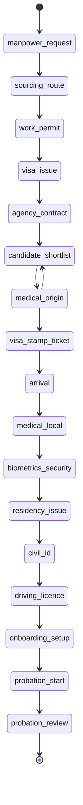

| الحالة (الكود) | من ينقلها | الحدث | الشاشة |
|---|---|---|---|
| `manpower_request` | مدير القسم الطالب · **اعتماد `GM`** | `hr.manpower_request.approved` | شاشة طلب القوى العاملة (نمط action) |
| `sourcing_route` | `PRO` | `hr.recruitment.stage_changed` | ملف الاستقدام (نمط profile) |
| `work_permit` | `PRO` | `hr.recruitment.stage_changed` + `admin.gov.opened` | لوحة المندوب · `/admin/gov?overdue=1` |
| `visa_issue` · `visa_stamp_ticket` · `medical_origin` · `medical_local` · `biometrics_security` · `residency_issue` · `civil_id` · `driving_licence` | `PRO` | `hr.recruitment.stage_changed` | لوحة المندوب |
| `agency_contract` | `PRO` · **اعتماد `GM`** | `hr.recruitment.stage_changed` | ملف الاستقدام |
| `candidate_shortlist` | مدير القسم · **اعتماد `GM`** | `hr.recruitment.shortlisted` | صندوق القرارات `/inbox` |
| `arrival` | **`GM`** حتى شغل `HR_MGR` | `hr.recruitment.arrived` | ملف الاستقدام |
| `onboarding_setup` | مدير القسم · **`HOUSING_SUP`** للسكن | `housing.bed.reserved` | لوحة السكن |
| `probation_start` | مدير القسم | `hr.employee.started` | ملف الموظف |
| `probation_review` | مدير القسم · **اعتماد `GM`** | `hr.employee.confirmed` \| `hr.employee.terminated` | صندوق القرارات |

**الانتقال المشروط الوحيد:** `medical_origin` غير المجتاز يعود إلى `candidate_shortlist` لاختيار بديل من الاحتياط (10 §4 · 12 س13). **والتأخر في أي مرحلة** (`due_at < now()`) يولّد بند تصعيد إلى `GM` **في اليوم الحادي عشر** يسمّي المرحلة والمالك ومدة التعطّل.

### 5.2 `hr.disciplinary_cases.status`

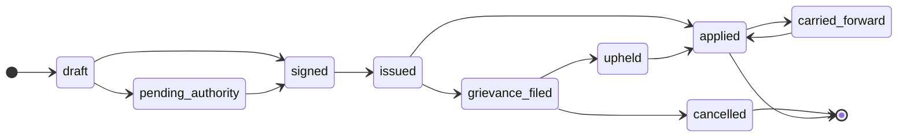

| الحالة | من ينقلها | الحدث | الشاشة |
|---|---|---|---|
| `draft` | الراصد (`reported_by`) | `hr.discipline.reported` | شاشة تسجيل واقعة |
| `pending_authority` | **المشغّل `trg_penalty_authority`** آلياً عند تجاوز السقف | `hr.discipline.routed_up` | صندوق قرارات المخوَّل (`routed_to`) |
| `signed` | الموقّع المخوَّل (`signed_by` + `signer_role`) | `hr.discipline.signed` | شاشة القرار |
| `issued` | الموقّع | `hr.discipline.issued` | سجل الجزاءات |
| `grievance_filed` | الموظف خلال **7 أيام** | `hr.discipline.grievance_filed` | تطبيق السائق — تبويب الجزاءات والتظلّم |
| `upheld` \| `cancelled` | **`grievance_decided_by` — مستوى أعلى من الموقّع** | `hr.discipline.grievance_decided` | صندوق القرارات |
| `applied` | الترحيل للرواتب ضمن سقف م.38 | `hr.discipline.applied` | سجل الجزاءات |
| `carried_forward` | آلياً عند تجاوز سقف الخمسة أيام | `hr.discipline.carried_forward` | كشف الراتب مع تنبيه |

> القائمة الحيّة في القاعدة **تسع حالات** (`chk_disciplinary_cases_status`)، بينما `_changelog/STATE-REGISTER.md` يعدّد سبعاً ويغفل `pending_authority` و`signed` المضافتين مع مشغّل السلطة — تفاوت سجلّي لا مخطّطي (§13).

### 5.3 `admin.gov_transactions.stage`

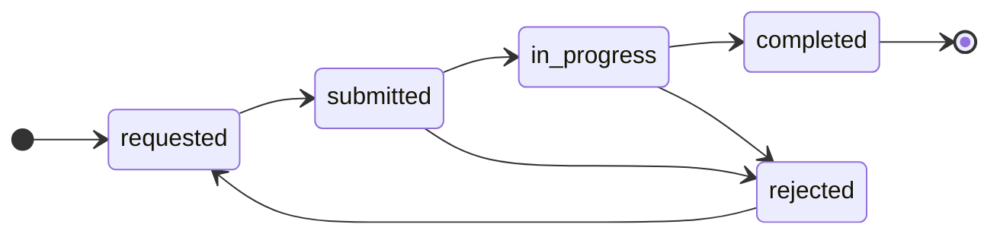

| الحالة | من ينقلها | الحدث | الشاشة |
|---|---|---|---|
| `requested` | `PRO` — `stage_owner` NOT NULL | `admin.gov.requested` | `/admin/gov?overdue=1` |
| `submitted` | `PRO` — يُسجَّل `government_ref` | `admin.gov.submitted` | لوحة المندوب |
| `in_progress` | `PRO` — متابعة ورسوم بسند `GOV` | `admin.gov.fee_paid` | لوحة المندوب |
| `completed` | `PRO` — `result_doc_url` + `completed_at` | `admin.gov.completed` | ملف الموظف أو المركبة |
| `rejected` | الجهة الحكومية | `admin.gov.rejected` | صندوق القرارات |

### 5.4 `admin.purchase_requests.status` و`admin.purchase_orders.status`

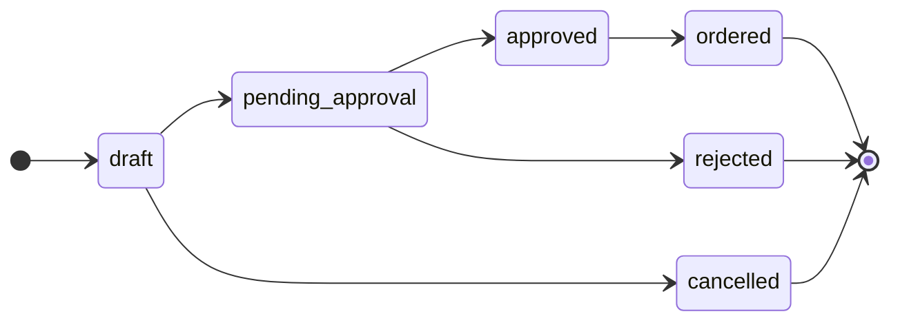

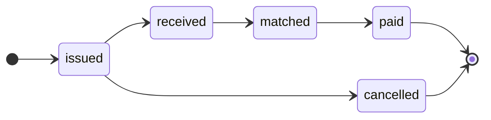

| الحالة | من ينقلها | الحدث | الشاشة |
|---|---|---|---|
| `draft` → `pending_approval` | الطالب | `admin.purchase.submitted` | شاشة طلب شراء |
| `approved` \| `rejected` | المعتمِد حسب الشريحة — **`approved_by <> requested_by`** | `admin.purchase.approved` | `/inbox?kind=approval` |
| `ordered` → `issued` | المشتريات — يحجز `committed_amount` | `admin.po.issued` | شاشة أمر الشراء |
| `received` | المستلم (`received_by` · `received_amount`) | `admin.po.received` | محضر الاستلام |
| `matched` | آلياً عند `three_way_matched = true` | `admin.po.matched` | شاشة المطابقة |
| `paid` | `CFO` — **يمنعه `no_pay_before_match`** قبل المطابقة | `admin.po.paid` | المالية |

### 5.5 `admin.approval_requests.status`

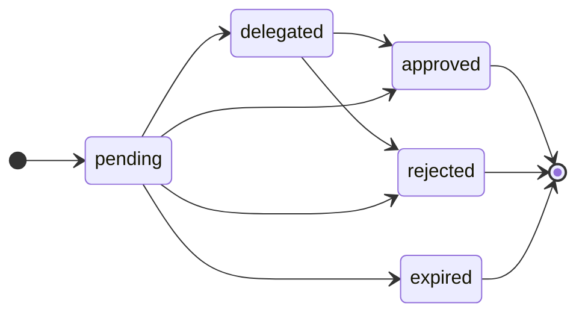

| الحالة | من ينقلها | الحدث | الشاشة |
|---|---|---|---|
| `pending` | الطالب | `admin.approval.requested` | `/inbox?kind=approval` |
| `delegated` | نائب بإنابة سارية ≤ 90 يوماً (`delegated_from`) | `admin.approval.delegated` | صندوق القرارات |
| `approved` \| `rejected` | المعتمِد — **`reason` إلزامي للرفض** | `admin.approval.decided` | صندوق القرارات |
| `expired` | آلياً عند تجاوز `due_at` | `admin.approval.expired` → **N-17** | صندوق المستوى الأعلى |

### 5.6 `housing.maintenance_requests.status`

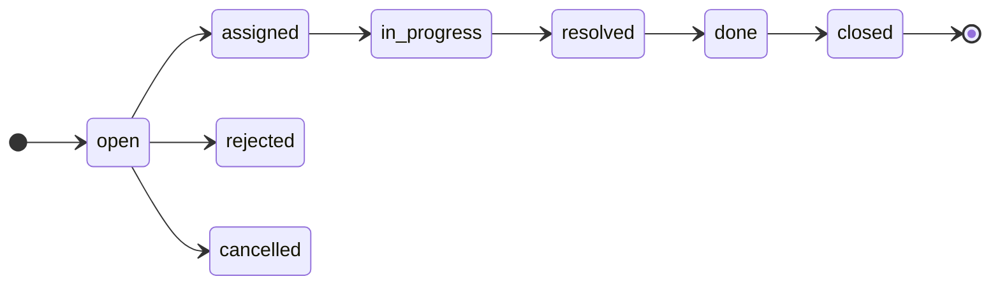

| الحالة | من ينقلها | الحدث | الشاشة |
|---|---|---|---|
| `open` | الساكن أو المشرف أو التفتيش · `sla_hours` **4/24/48** | `housing.maintenance.opened` | لوحة السكن |
| `assigned` | `HOUSING_SUP` — فني داخلي أو `vendor_id` | `housing.maintenance.assigned` | لوحة السكن |
| `in_progress` → `resolved` | المنفّذ · التكلفة فوق الحد تمر بـ`purchase_order_id` | `housing.maintenance.resolved` | لوحة السكن |
| `done` → `closed` | **تأكيد الساكن** ثم الإقفال · إتلاف متعمَّد → `charged_to_resident` + بند `HOU-02` | `housing.maintenance.closed` | لوحة السكن |

### 5.7 `hr.employees.status` و`housing.bed_assignments`

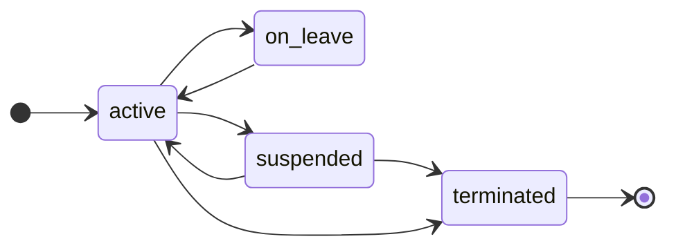

| الحالة | من ينقلها | الحدث | الأثر الآلي |
|---|---|---|---|
| `active` | التثبيت بعد `probation_review` | `hr.employee.activated` | يدخل العدّ في بوابة M08 |
| `on_leave` | اعتماد الإجازة | `hr.employee.on_leave` | — |
| `suspended` | وقف للتحقيق **≤ 10 أيام مدفوع** (م.39) | `hr.discipline.suspended` | يُصرف الأجر حتى الإدانة |
| `terminated` | **اعتماد `GM`** | `hr.employee.terminated` | **يُغلق إسناد معرّف iMile آلياً** (`trg_close_driver_id`) · يُوقف خصم السكن بالتناسب · المخالصة تُحجب حتى استرجاع العهد وإخلاء السرير |

**حالات مرافقة بلا رسم مستقل** (كلها مقيَّدة بـ`check` في القاعدة):

| العمود | القيم | المصدر |
|---|---|---|
| `hr.manpower_requests.status` | `draft · pending_approval · approved · in_progress · completed · rejected · cancelled` | 13 |
| `hr.commission_daily.status` | `calculated · disputed · approved · paid` | 13 · STATE-REGISTER |
| `housing.beds.status` | `available · occupied · reserved · maintenance` — **للخارج عن الخدمة فقط، لا للإشغال** | 14 §2 |
| `housing.bed_reservations.status` | `active · converted · expired · cancelled` | 14 §2 |
| `housing.properties.status` · `units.status` · `rooms.status` | `active · inactive` | 14 §2 |
| `housing.assets.status` | `working · faulty · replaced` | 14 |
| `admin.assets.status` | `in_stock · in_custody · maintenance · disposed` | 13 |
| `admin.petty_cash.status` | `active · closed` | 13 |
| `admin.correspondence.status` | `open · replied · closed` | 13 |

---

## 6. المستندات والنماذج

**قاعدة حاكمة (40 §B4 · 28 §11 بند 7):** كل مستند **يُولَّد من انتقال الحالة** — **لا شاشة «نماذج» في النظام إطلاقاً**؛ زرّ الطباعة يعيش على شاشة العملية. والنموذج الفارغ الوحيد المسموح هو **الورق الميداني البديل** في وضع الاستمرارية (26) وهو **لا ينشئ سجلاً**.

**السلاسل المستخدمة في هذا النطاق — مبذورة فعلاً في `platform.counters` لكل كيان من الخمسة**

| السلسلة | البادئة لكل كيان | الجدول | المصدر |
|---|---|---|---|
| **`MPR`** | `<ENT>-MP-` | `hr.manpower_requests.doc_no` | 13 |
| **`PRQ`** | `<ENT>-PR-` | `admin.purchase_requests.doc_no` | 13 |
| **`PO`** | `<ENT>-PO-` | `admin.purchase_orders.doc_no` | 13 |
| **`PCT`** | `<ENT>-PC-` | العهدة النقدية | 13 |
| **`GOV`** | `<ENT>-GV-` | **سند صرف الرسوم الحكومية — منفصل تماماً عن `RCT`** | 11 §6-1 · EXEC §1.4/§1.6 |
| **`APR`** | `<ENT>-AP-` | `admin.approval_requests.doc_no` | 13B |
| **`COR`** | `<ENT>-CR-` | `admin.correspondence.doc_no` | 13 |
| `RCT` · `INV` · `CN` | `<ENT>-RC-` · `<ENT>-INV-` · `<ENT>-CN-` | المقبوضات والفواتير والإشعارات الدائنة — **مرجع للفصل لا لهذا النطاق** | EXEC §1.4 |

> **`RCP` مُلغاة** — سلسلة يتيمة حُذفت من البذرة؛ والقاعدة الحيّة **لا تحوي أي صفّ لها** ✅.

**الوثائق المولَّدة من الانتقالات**

| الانتقال | الوثيقة | المصدر |
|---|---|---|
| `manpower_request` معتمد | نموذج طلب قوى عاملة | 10 §7 |
| `candidate_shortlist` | ملف المرشح + **خطاب تعيين / عرض عمل** (نُقل إليها في v4 — ADM-47) | 10 §7 |
| `visa_stamp_ticket` | **إشعار سفر** | 10 §7 |
| `probation_start` | نموذج مباشرة عمل + **عقد العمل** | 10 §7 |
| `probation_review` | تقرير تقييم فترة التجربة | 10 §7 |
| جزاء موقَّع | **قرار الجزاء** + **محضر التحقيق** (`investigation_minutes_url`) + إبلاغ كتابي بالجزاء | م.37 · 15 §3 |
| امتناع عن التوقيع | **محضر شاهدين** باسمين ورقمين مدنيين مختلفين | م.37 |
| إسناد سرير | **نموذج تسليم سكن** (`handover_doc_id`) | 14 §5-1 |
| إغلاق إسناد سرير | **نموذج إخلاء سكن موقَّع** | 14 §5-2 |
| طلب شراء معتمد | نموذج طلب شراء | 11 §11 |
| ترسية | **أمر شراء** | 11 §11 |
| استلام | **محضر استلام** | 11 §11 |
| عهدة — تسليم / استرجاع | نموذج تسليم عهدة · نموذج استرجاع عهدة | 11 §11 |
| عهدة نقدية — تسوية | كشف تسوية العهدة | 11 §11 |
| معاملة حكومية — إنجاز | **إشعار إنجاز + الوثيقة الحكومية** | 11 §11 |
| صادر | **خطاب رسمي بترويسة الكيان** آلياً | 11 §11 · 40 §B4 |
| إسناد معرّف iMile | نموذج تسليم معرّف يُولَّد ويُوقَّع | 10 §17 |

**التوقيعات:** توقيع الجزاء (`signed_at` + `signed_by` + `signer_role`) · توقيع الاستلام والتسليم على العهد والسكن · توقيع استلام نسخة لائحة الجزاءات لكل موظف (م.35 · C-02) · **الشاهدان عند الامتناع**. والمستند يُجمَّد في `platform.documents` بـ`rendered_data` و`checksum` و`legal_hold` — و**أي صورة مرتبطة بنزاع أو شكوى أو جزاء تحمل `legal_hold` تلقائياً** (EXEC §1.4 · 31 §8).

---

## 7. الضوابط والاعتمادات

**جدول الحدود**

| البند | الحد | المعتمِد | المصدر / المفتاح |
|---|---|---|---|
| شراء ≤ 100 د.ك | اعتماد آلي | النظام | `purchase.auto_max` · EXEC §1.1 |
| شراء > 100 · ≤ 500 | مدير القسم الطالب | `WH_MGR`/`DEL_MGR`/`SALES_MGR`/`FLEET_MGR`/`CC_MGR` | `purchase.manager_max` |
| شراء > 500 · ≤ 2,000 | المدير المالي | `CFO` | `purchase.cfo_max` |
| شراء > 2,000 | **المدير العام** | `GM` | EXEC §1.1 |
| ثلاثة عروض إلزامية | **فوق 500 د.ك** | — | `purchase.three_quotes_min` · 11 §3 |
| سقف العملية الواحدة من العهدة النقدية | **50 د.ك** افتراضياً | `CFO` | `admin.petty_cash.max_single_txn` |
| خصم السكن | **23 د.ك شهرياً بالتناسب اليومي** | — | `housing.deduction` · EXEC §1.3 |
| **إعفاء من خصم السكن** | — | **`GM` حصراً بسبب مسجَّل** | 14 §6-1 · EXEC §1.3 |
| الحد الأدنى للإشغال | **70٪** | مراجعة `GM`/`CFO` للعقد | `housing.min_occupancy_pct` |
| SLA صيانة السكن | **4 / 24 / 48 ساعة** | `HOUSING_SUP` | EXEC §1.3 · 40 §C7 |
| SLA مرحلة استقدام | **7 أيام** · تصعيد **اليوم 11** | `GM` | `recruitment.escalate_pct` · 40 Part E S13 |
| SLA معاملة حكومية | **7 أيام** افتراضياً · تصعيد بـ+50٪ | `GM` | 11 §12-6 |
| توقيع الجزاء | **خلال 15 يوماً من الثبوت** | تجاوز `GM` بـ`art35_override_by` | م.35 · قيد `art35_15_days` |
| سقف الخصم الجزائي الشهري | **أجر 5 أيام** والزائد يُرحَّل | `CFO` يضبطه | م.38 · 15 §6-6 — 🔴 بلا مفتاح (§13) |
| الوقف للتحقيق | **≤ 10 أيام مدفوعة** | مدير القسم | م.39 |
| مهلة التظلّم | **7 أيام** قبل الترحيل | — | 15 §3 |
| **جزاء D4 / الفصل** | — | **`GM` حصراً** | 40 §C7 · EXEC §1.3/§1.6 |
| مدة الإنابة | **≤ 90 يوماً · `valid_to` إلزامي** | `GM`/`SYSADMIN` | قيد `bounded` · 40 §B1 |
| نافذة الاعتراض على العمولة | **48 ساعة** | مشرف التوصيل | EXEC §1.2 · 40 §C7 |

**فصل المهام — الأزواج الأربعة (`identity.sod_rules` · مبذورة ونشطة)**

| الزوج | السبب | آلية الفرض |
|---|---|---|
| (`CFO`, `ACCOUNTANT`) | معتمِد الفاتورة لا يسجّل السداد | **مشغّل `identity.check_sod`** على `user_roles` عند الإدراج **وعند التعديل** — إعادة تفعيل دور بتصفير `revoked_at` لا تلتفّ على القاعدة |
| (`SALES_MGR`, `CFO`) | بائع الصفقة لا يعتمدها مالياً ولا يحدّد الحد الأدنى | المشغّل نفسه |
| (`WH_OP`, `WH_SUP`) | المنفّذ لا يدقّق عمل نفسه | المشغّل نفسه |
| (`PRO`, `CFO`) | **المحصِّل لا يطابق البنك** | المشغّل نفسه |

**الإنابة لا تلتف على SoD** (ADR-16c) · **تعطيل أي قاعدة SoD يتطلب `GM` + سبباً مسجَّلاً**.

**الأربع عيون — ما يتطلب معتمِداً ثانياً**

| الفعل | المنفّذ | المعتمِد الثاني | السبب |
|---|---|---|---|
| تغيير الصلاحيات | `SYSADMIN` | **`DEPUTY_SYSADMIN`** أو **`CFO`** | `GM` = `SYSADMIN` في التسكين الحالي (EXEC §1.7) |
| تغيير الأسرار ومفاتيح التكاملات | `SYSADMIN` | `DEPUTY_SYSADMIN` \| `CFO` | نفس السبب |
| تغيير قواعد SoD | `SYSADMIN` | `DEPUTY_SYSADMIN` \| `CFO` + **سبب مسجَّل** | نفس السبب |
| تغيير سلاسل الاعتماد | `SYSADMIN` | `DEPUTY_SYSADMIN` \| `CFO` | نفس السبب |

**ما يتطلب المدير العام حصراً في هذا النطاق:** اعتماد الاستقدام (العدد والراتب والميزانية) · اعتماد المرشحين · **جزاء D4 والفصل** · **تجاوز مهلة الخمسة عشر يوماً** (`art35_override_by`) · **الإعفاء من خصم السكن** · اعتماد عقود الإيجار الجديدة · الشراء فوق 2,000 د.ك · قرار التعيين والراتب · إنهاء الخدمة · تغيير الأدوار · **تعطيل قاعدة SoD** · اعتماد الإجازات (حتى يُشغل `HR_MGR`).

**الضوابط التعويضية للتجميع (EXEC §1.7)**

| التجميع | الضابط الإلزامي | حالة التحقّق |
|---|---|---|
| `GM` = `SYSADMIN` | `DEPUTY_SYSADMIN` منشأ · **أربع عيون** · **وسم أفعال `GM` بصفته `SYSADMIN` في سجل التدقيق وتقرير شهري** | ✅ الدور مبذور · 🟡 الوسم والتقرير سياسة |
| `PRO` = `ACCOUNTANT` | `PRO` **لا يحمل `CFO` أبداً** · سلسلة `RCT` منفصلة عن `GOV` · **`CFO` يطابق التيارين** | ✅ زوج SoD (`PRO`,`CFO`) مفروض بالمشغّل |

**ضوابط عامة (11 §7):** الصلاحية **بالحد المالي لا بالمسمّى** · **لا معتمِد على منصب شاغر** — سلسلة تنتهي عند منصب غير مشغول = سلسلة ميتة والطلب يقف إلى الأبد · **لا اعتماد ذاتي** مفروض في القاعدة · كل اعتماد في التدقيق: من · متى · من أي جهاز · مع الملاحظة · و**`reason` إلزامي للرفض والتجاوز**.

---

## 8. مؤشرات الأداء (KPI)

| المؤشر | التعريف الحسابي الدقيق | مصدر البيانات | الدورية | المالك | الهدف |
|---|---|---|---|---|---|
| **زمن الاستقدام الكلي** | متوسط `completed_at − created_at` بالأيام للحالات المكتملة | `hr.recruitment_cases` | شهري | `GM` | **يحدده GM** |
| **زمن المرحلة مقابل SLA** | متوسط `recruitment_stage_log.duration_days` لكل `to_stage` مقابل `recruitment_stages.default_sla_days` | `hr.recruitment_stage_log` · `hr.recruitment_stages` | أسبوعي | `GM` | **7 أيام** لكل مرحلة |
| **حالات استقدام متأخرة** | `count(*) where due_at < now() and completed_at is null` | `hr.recruitment_cases` | يومي | `GM` + `PRO` | **صفر** · التصعيد **اليوم 11** |
| **حالة بلا مالك** | `count(*) where stage_owner is null` | `hr.recruitment_cases` | يومي | `GM` | **صفر** — مفروض بـNOT NULL (S13) |
| **تكلفة الاستقدام لكل موظف** | `sum(hr.recruitment_costs.amount)` لكل حالة | العرض `hr.recruitment_cost_per_employee` | شهري | `GM` + `CFO` | **يحدده GM** — تقرير **R-22** |
| **وثائق منتهية نشطة** | `count(*)` من `employee_documents` حيث `expiry_date < current_date` لموظف `status = 'active'` | `hr.employee_documents` · `hr.employees` | أسبوعي | `GM` + `PRO` | **صفر** (بوابة D08) |
| **وثائق داخلة السلّم** | `count(*)` لكل درجة من **90/45/30/15** | `hr.employee_documents` | أسبوعي | `GM` + `PRO` | تنبيه **N-04** · تقرير **R-09** |
| **نسبة إشغال السكن** | `housing.capacity_overview.occupancy_pct` = الأسرّة ذات إسناد نشط ÷ إجمالي الأسرّة × 100 | `housing.bed_assignments` · `beds` | شهري | `HOUSING_SUP` | **≥ 70٪** (`housing.min_occupancy_pct`) |
| **الشاغر القابل للاستقدام** | `available − عدد الحجوزات النشطة` | `housing.capacity_overview` · `bed_reservations` | يومي | `HOUSING_SUP` | يحدده قرار الاستقدام |
| **تكلفة السرير المشغول** | `(إيجار + كهرباء وماء + صيانة + إهلاك أثاث) ÷ الأسرّة المشغولة` — والعرض يحسب `monthly_rent ÷ occupied` | `housing.capacity_overview` · `utility_bills` · `maintenance_requests` · `assets` | شهري | `CFO` | يُقارن بـ**23 د.ك**؛ **الفرق يظهر بنداً صريحاً** |
| **انحراف حالة السرير** | `housing.capacity_overview.status_mismatch` | `housing.beds` · `bed_assignments` | أسبوعي | `HOUSING_SUP` | **صفر** |
| **صيانة متجاوزة SLA** | `count(*) where resolved_at is null and now() > created_at + sla_hours · interval '1 hour'` | `housing.maintenance_requests` | يومي | `HOUSING_SUP` | **صفر** · السلّم 4/24/48 |
| **وحدات بلا تفتيش > 45 يوماً** | `count(units)` بلا صفّ في `inspections` منذ 45 يوماً | `housing.inspections` | شهري | `HOUSING_SUP` | **صفر** (14 §7) |
| **ساكنون غير مسجَّلين** | `sum(unauthorized_occupants)` | `housing.inspections` | شهري | `HOUSING_SUP` | **صفر** — البند `HOU-05` |
| **دورة الشراء** | متوسط `purchase_orders.received_at − purchase_requests.created_at` بالأيام | `admin.purchase_requests` · `purchase_orders` | شهري | `CFO` | **يحدده GM** |
| **نسبة المطابقة الثلاثية** | `count(*) filter (three_way_matched) ÷ count(*)` من أوامر الشراء المستلمة × 100 | `admin.purchase_orders` | شهري | `CFO` | **100٪ قبل أي دفع** |
| **الالتزام مقابل الميزانية** | `committed_amount + spent_amount ÷ annual_amount` لكل `cost_center` | `admin.budget_lines` | شهري | `CFO` | **≤ 100٪** — `available ≥ 0` |
| **معاملات حكومية متأخرة** | `count(*) where due_at < now() and completed_at is null` | `admin.gov_transactions` | يومي | `PRO` | **صفر** — تنبيه **N-15** |
| **رسوم حكومية غير مخصَّصة** | `count(*) where fees_paid > 0 and cost_center is null` | `admin.gov_transactions` | شهري | `CFO` | **صفر** (11 §9) |
| **الجزاءات لكل 100 موظف** | `count(disciplinary_cases الشهر) ÷ count(employees active) × 100` | `hr.disciplinary_cases` · `hr.employees` | شهري | `GM` | **يحدده GM** |
| **حصيلة الجزاءات (م.40)** | `sum(deduction_amount)` للشهر | `hr.disciplinary_cases` | شهري | `GM` + `CFO` | **متطلب قانوني** — تقرير **R-21** |
| **نسبة إلغاء التظلّمات** | `count(grievance ملغى) ÷ count(grievance_filed) × 100` **لكل موقّع** | `hr.disciplinary_cases` | شهري | `GM` | **> 30٪ لمدير ⇒ مراجعة صلاحيته** (40 §C7) |
| **البنود الأكثر تكراراً** | `count(*) group by penalty_code` | `hr.disciplinary_cases` | شهري | `GM` | بند يتكرر عبر موظفين كثيرين = خلل في **الإجراء أو التدريب** لا في الأشخاص |
| **جزاءات عالقة بلا م.37** | `count(*) where penalty_type = 'deduction'` وأحد الحقول الخمسة ناقص | `hr.disciplinary_cases` | أسبوعي | `GM` | **صفر** |
| **خصومات مرحَّلة** | `sum(carried_forward_amount)` | `hr.disciplinary_cases` | شهري | `CFO` | يُراقَب — سقف م.38 |
| **عمولة السائقين اليومية** | `sum(gross_commission)` · `sum(net_commission)` لكل يوم | `hr.commission_daily` | يومي | السائق + المشرف | تقرير **R-07** · اعتراض **48 ساعة** |
| **أيام بلا إسناد معرّف** | أيام فيها شحنات مسلَّمة بلا صفّ إسناد مطابق | `imile.shipments_attributed` | يومي | `DEL_MGR` | **صفر** — تصعيد فوري |
| **عهد غير مسترجَعة لموظف منتهٍ** | `count(*)` من `asset_custody` حيث `returned_at is null` والموظف `terminated` | `admin.asset_custody` · `hr.employees` | يومي | مدير القسم | **صفر** — حاجز المخالصة |
| **اكتمال تصنيف الأعمدة** | `identity.unclassified_columns` عدد الصفوف | `identity.column_classification` | أسبوعي | `SYSADMIN` | **صفر** — الحارس G6 |
| **جودة المجال الشهرية** | نسبة الاكتمال لكل `D01…D12` | `platform.domain_quality_monthly` · `platform.mdm_scorecard` | شهري | مالك المجال + `GM` | **< 80٪ شهرين ⇒ N-18** · تقرير **R-20** |
| **مستخدمون فتحوا النظام هذا الأسبوع** | نسبة المستخدمين النشطين إلى المسجَّلين | `identity.sessions` | شهري | `GM` | **100٪** (28 §6) |
| **عمليات تُنفَّذ في النظام لا ورقياً** | — | مؤشر تبنّي | شهري | `GM` | **≥ 95٪** |
| **شاشات لم تُفتح 30 يوماً** | — | مؤشر تبنّي | شهري | `GM` | **تُراجع وتُحذف إن بقيت** |
| **معدل الغياب** | — | **🔴 لا جدول حضور في المخطط — انظر §13** | — | — | — |
| **الالتزام بالورديات** | — | **🔴 لا جدول ورديات في المخطط — انظر §13** | — | — | — |

---

## 9. التقارير والتنبيهات المرتبطة

**التنبيهات (سجل 25 §2 — 22 تنبيهاً · الجدول مبذور فعلاً بـ22 صفاً في `platform.alert_rules` ✅)**

| الكود | الشرط | الهدف | الدورية | التصعيد | رابط الإجراء |
|---|---|---|---|---|---|
| **N-04** | وثيقة موظف تدخل درجة من سلّم **90/45/30/15** | الموارد (**= `GM`**) + `PRO` | أسبوعي مجمّع | **≤ 15 يوماً → يومي** | `/hr/documents?expiring=90` |
| **N-15** | معاملة حكومية متأخرة عن SLA | `PRO` | يومي | **+50٪ → `GM`** | `/admin/gov?overdue=1` |
| **N-17** | طلب اعتماد بلا بتّ > مهلته | المعتمِد من `approval_chains` | يومي | **→ المستوى الأعلى** | `/inbox?kind=approval` |
| **N-18** | مجال بيانات تحت **80٪ شهرين** | مالك المجال + `GM` | شهري | — | `/platform/data-quality` |
| N-05 | وثيقة مركبة تدخل السلّم نفسه | `FLEET_MGR` | أسبوعي | ≤ 7 أيام → يومي | `/fleet/documents?expiring=90` |
| N-16 | مزامنة البصمة فاشلة يومين | `SYSADMIN` | فوري | 3 أيام → `GM` | `/platform/integrations` |

> **قاعدة 40 §B6:** **تنبيه بلا رابط إجراء غير صالح.** و**التنبيه لا يستهدف منصباً شاغراً** أبداً: حيث تقول 25 «مدير العمليات» اقرأ **`WH_MGR` + `DEL_MGR`** بنطاقيهما، وحيث تقول «مدير الموارد البشرية» اقرأ **`GM`**. وساعات الهدوء **22:00–07:00** تُطبَّق على كل تنبيهات هذا النطاق بلا استثناء (الاستثناءان الوحيدان N-01 و N-03 خارج هذا النطاق).

**التقارير (سجل 25 §5 — 24 تقريراً)**

| الكود | التقرير | المصدر | الدورية | المالك | القرار الذي يخدمه |
|---|---|---|---|---|---|
| **R-07** | **عمولة السائقين أمس** | `hr.commission_daily` | يومي | السائق + المشرف | الاعتراض خلال **48 ساعة** |
| **R-09** | الوثائق المنتهية والقريبة | `hr.employee_documents` · `tms.vehicle_documents` | أسبوعي | الموارد (**= `GM`**) + `FLEET_MGR` + `PRO` | جدولة التجديد |
| **R-12** | الراحات والاستثناءات لكل مشرف | `hr.disciplinary_cases` · `platform.audit_log` | أسبوعي | `GM` | **كشف المحاباة** |
| **R-20** | **بطاقة جودة البيانات** | `platform.domain_owners` + القياس الشهري | شهري | `GM` + مُلاك المجالات | مساءلة |
| **R-21** | **حصيلة الجزاءات (م.40)** | `hr.disciplinary_cases` · `hr.penalty_schedule` | شهري | `GM` + `CFO` | **متطلب قانوني** |
| **R-22** | **تكلفة الاستقدام لكل موظف** | `hr.recruitment_cost_per_employee` | شهري | الموارد (**= `GM`**) + `CFO` | تقييم دوران العمالة |
| R-13 | الربحية لكل عميل وعقد | `billing.profitability` · `cost_allocations` | شهري | `GM` + `CFO` | **يستقبل تكلفة السكن والاستقدام** |

---

## 10. الشاشات

**النموذج الحاكم (40 §D1):** الصفحة الرئيسية لكل دور هي **صندوق القرارات** (`platform.decisions` مُرشَّحاً بـ`assigned_role`) — لا لوحة مؤشرات. وثلاثة أنماط شاشات فقط: **list** (≤ 6 أعمدة مع شريط «يحتاج إجراءك») · **profile** (ترويسة هوية + شريط «ما ينقص قبل الإطلاق» بالمالك والتاريخ + تبويبات آخرها التدقيق) · **action** (stepper مع فحوص حيّة أسفل الشاشة). **مكوّن الحالة الفارغة إلزامي** ويسمّي البيانات الناقصة ومالكها. **العدد المعتمد: 57 شاشة إدارية** (29 §6-3).

| الشاشة / المسار | النمط | الدور | الغرض | المصدر |
|---|---|---|---|---|
| **صندوق القرارات** `/inbox` | صندوق | كل الأدوار | البتّ المباشر — البند يختفي فور القرار · الترتيب بالأثر المالي ثم الاستعجال | 40 §D1 · 29 §6-2 |
| `/inbox?kind=approval` | صندوق | المعتمِد من `approval_chains` | البتّ في طلبات الاعتماد — إجراء **N-17** | 25 §2-2 |
| **`/hr/documents?expiring=90`** | list | `GM` + `PRO` | جدول تجديد وثائق الموظفين — إجراء **N-04** | 25 §2-2 |
| **`/admin/gov?overdue=1`** | list | `PRO` | لوحة المندوب: المعاملات بالاستعجال · **المتأخرة بالأحمر** · الرسوم بأرقام سندات `GOV` · المعلّقة لنقص مستند **مع اسم مالك المستند الناقص** | 25 §2-2 · 11 §6-1 |
| **`/platform/data-quality`** | list | `GM` + مُلاك المجالات | بطاقة جودة البيانات D01–D12 — إجراء **N-18** · تقرير **R-20** | 25 §2-2 · 22 §7 |
| **محرّر الهيكل** | action | `SYSADMIN` + معتمِد ثانٍ | الأدوار · مصفوفة الصلاحيات · **مُلاك المجالات · سلاسل الاعتماد · الإنابات · قواعد SoD** — كلها بيانات تُحرَّر من الواجهة، وكل تغيير مدقَّق | 40 §B1 · EXEC §1.6 |
| **ملف الموظف** | profile | `GM` · مدير القسم · `PRO` | الهوية · الوثائق · الجزاءات · العهد · السكن · آخر تبويب **التدقيق** | 40 §D1 |
| **ملف الاستقدام** | profile | `GM` · `PRO` · مدير القسم | المرحلة ومالكها و`due_at` والتكلفة التراكمية والمستندات | 10 §5 |
| **سجل الجزاءات** | list | `GM` + `CFO` | جزاءات الشهر بالفئة والدرجة والإدارة · **الحصيلة المالية (م.40)** · التظلّمات ونسبة الإلغاء · المتكررون · البنود الأكثر تكراراً · العالقة بلا م.37 · متجاوزو 15 يوماً · الخصومات المرحَّلة | 15 §5 |
| **لوحة إدارة السكن** | list | `HOUSING_SUP` · `GM` · `CFO` | الطاقة لكل عقار · الشاغر القابل للاستقدام · عقود تنتهي خلال 90 يوماً · الصيانة بالأولوية والمتجاوزة · التفتيش · **التكلفة والفرق عن الخصومات** · الاستهلاك الشاذ · المخالفات | 14 §7 |
| **لوحة إدارة معرّفات iMile** | list | `DEL_MGR` | متاح/مُسند/موقوف/محظور · **سائقون نشطون بلا معرّف** · معرّفات مُسندة لغير نشطين · موقوفة > 14 يوماً · إيقافات متكررة | 10 §19 |
| **تطبيق السائق — الأرباح** | شاشة تطبيق | `DRIVER` | عمولة يومية · **الخصومات مفصَّلة بنداً بنداً** · نافذة اعتراض **48 ساعة** | 40 §D3 |
| **تطبيق السائق — الجزاءات والتظلّم** | شاشة تطبيق | `DRIVER` | عرض الجزاء ورفع التظلّم | 40 §D3 |

> **ما ليس في الحزمة:** الحزمة لا تُعدِّد أسماء الشاشات السبع والخمسين فرداً فرداً؛ المتاح هو **الأنماط الثلاثة** و**العدد** و**مسارات الإجراء في سجل التنبيهات**. ما فوق مبنيّ عليها حصراً، ولم يُخترع مسار واحد.

---

## 11. الجداول

> **ملاحظة:** تعليقات القاعدة `obj_description` **غائبة عن معظم جداول هذا النطاق** — الموجود ثلاثة تعليقات فقط (`hr.penalty_schedule` · `identity.delegations` · `platform.thresholds` · `platform.domain_quality_monthly`). ما يلي الوصف من وثيقته الحاكمة، والنقص مسجَّل في §13.

### `identity` — الهوية والصلاحيات (11 جدولاً)

| الجدول | الوصف |
|---|---|
| `identity.users` | المستخدمون: داخلي · عميل · وكيل · **لا كلمات مرور مخزَّنة على الخادم**؛ عميل بلا `client_id` مرفوض بالقيد |
| `identity.roles` | **26 دوراً** بكودها و`scope_type` من الثمانية المقيَّدة |
| `identity.permissions` | الصلاحيات بصيغة `module.object.action` |
| `identity.role_permissions` | ربط الدور بصلاحياته |
| `identity.user_roles` | إسناد الأدوار — **قابل للسحب** بـ`revoked_at`؛ عليه مشغّل فصل المهام |
| `identity.user_entities` | الكيانات التي يراها المستخدم — أساس نطاق `entity` |
| `identity.sessions` | الجلسات القابلة للإبطال — **6 ساعات داخلي** · ساعة + 30 يوماً تحديث لتطبيقات الميدان |
| `identity.otp_codes` | رموز الدخول لمرة واحدة — **6 خانات · صلاحية 5 دقائق · 5 محاولات · إعادة إرسال 60 ثانية** (EXEC §1.8) |
| `identity.column_classification` | **تصنيف حساسية كل عمود**: `public · personal · payroll · commercial · secret` — عمود بلا تصنيف يُفشل النشر (G6) |
| `identity.delegations` | **الإنابة ≤ 90 يوماً** بـ`valid_to` و`reason` و`approved_by` إلزامية — **لا تتجاوز فصل المهام أبداً (ADR-16c)** |
| `identity.sod_rules` | **أزواج فصل المهام الأربعة** — تعطيل أي قاعدة يتطلب `GM` + سبباً |

### `hr` — الموارد البشرية (13 جدولاً)

| الجدول | الوصف |
|---|---|
| `hr.org_units` | الوحدات التنظيمية بشجرتها و`cost_center` ومديرها |
| `hr.employees` | الموظفون — `code` فريد `PG-####` · **`reports_to`** (أساس نطاق `subordinates` والسلطة الهرمية) · **`assigned_client_id`** (أساس تكلفة العمالة المباشرة) · أربع حالات |
| `hr.teams` | الفرق بنوعها ومشرفها وعميلها و**ورديتها** — مُدخل معيار تجانس السكن |
| `hr.employee_documents` | وثائق الموظف بتاريخ انتهاء **NOT NULL** — مصدر السلّم 90/45/30/15 والحواجز الصلبة |
| `hr.manpower_requests` | طلب القوى العاملة بـ`headcount > 0` و`justification` إلزامي و**اعتماد `GM`** للميزانية |
| `hr.recruitment_cases` | ملف الاستقدام — **17 مرحلة مقيَّدة** · `stage_owner` NOT NULL · `due_at` بمشغّل · `cost_to_date` |
| `hr.recruitment_stages` | **الجدول المرجعي للمراحل السبع عشرة** بترتيبها ومالكها الافتراضي و`default_sla_days = 7` |
| `hr.recruitment_stage_log` | سجل الانتقالات — من/إلى ومالك ومدة فعلية بالأيام |
| `hr.recruitment_costs` | بنود تكلفة الاستقدام مربوطة بالمعاملة الحكومية وإيصالها |
| `hr.commission_rules` | قاعدة احتساب العمولة — **0.300 ثابت** + `bonus_rate` و`bonus_condition` بنافذة صلاحية |
| `hr.commission_daily` | الحساب اليومي المجمَّد — **صفّ واحد لكل (يوم × موظف)** · `source_snapshot` إلزامي · **الخصومات مفكَّكة** إلى سكن وهاتف وإقامة وأخرى |
| `hr.penalty_schedule` | **لائحة الجزاءات — 77 بنداً في 9 فئات** بأربع درجات وأيامها و`allows_dismissal` و`dismissal_article` و`min_degree` و**`is_fraud`** |
| `hr.disciplinary_cases` | القضية التأديبية — حقول م.37 الخمسة · `signed_by`/`signer_role`/`routed_to` · `art35_override_by` · التظلّم · الترحيل |

**العرض:** `hr.recruitment_cost_per_employee` — إجمالي تكلفة الاستقدام لكل موظف وعدد بنودها ونافذتها الزمنية.

### `housing` — السكن (10 جداول)

| الجدول | الوصف |
|---|---|
| `housing.properties` | العقار — العنوان الكويتي الكامل · بيانات المالك · **عقد الإيجار** بمدته و`notice_days` و`monthly_rent` و`deposit_amount` و`cost_center` |
| `housing.units` | الوحدة داخل العقار بطابقها ونوعها وإيجارها **وعدّادَي الكهرباء والماء** |
| `housing.rooms` | الغرفة بنوعها ومساحتها و**`bed_capacity > 0`** ووجود التكييف |
| `housing.beds` | **السرير — وحدة الإسناد**؛ `status` **يخدم الخارج عن الخدمة فقط وليس مصدر حقيقة الإشغال** |
| `housing.bed_assignments` | **الإسناد الزمني — مصدر حقيقة الإشغال**؛ فهرسان فريدان جزئيان · `monthly_charge` · `charge_waived` + `waiver_reason` |
| `housing.bed_reservations` | حجز سرير لمستقدَم قبل وصوله بـ`expires_at` إلزامي ومربوط بـ`recruitment_case_id` |
| `housing.maintenance_requests` | بلاغات الصيانة بالأولوية و**`sla_hours` 4/24/48** · `charged_to_resident` للإتلاف المتعمَّد · ربط بأمر الشراء |
| `housing.inspections` | التفتيش الدوري — النظافة والسلامة و**`occupancy_matches`** و`unauthorized_occupants` و`violations_raised` |
| `housing.utility_bills` | فواتير الكهرباء والماء بفترتها واستهلاكها — أساس كشف الاستهلاك الشاذ |
| `housing.assets` | أثاث وأجهزة السكن بحالتها وخدمتها الدورية |

**العرض:** `housing.capacity_overview` — الطاقة والإشغال والمحجوز والمتاح والخارج عن الخدمة و**`status_mismatch`** و`occupancy_pct` و`cost_per_occupied_bed` لكل عقار.

### `admin` — الدورة الإدارية (12 جدولاً)

| الجدول | الوصف |
|---|---|
| `admin.budget_lines` | بند الميزانية والرصيد — **`available` عمود مولَّد** = السنوي ناقص الملتزم ناقص المنصرف |
| `admin.purchase_requests` | طلب الشراء — `cost_center` إلزامي · `estimated_amount` تحدّد شريحة الاعتماد · **قيد لا-اعتماد-ذاتي فعلي** |
| `admin.vendor_quotes` | عروض الموردين — **`selection_reason` إلزامي عند الاختيار** |
| `admin.purchase_orders` | أمر الشراء — **`three_way_matched` بوابة الدفع** بقيد `no_pay_before_match` · `variance_note` |
| `admin.petty_cash` | العهدة النقدية — حد ورصيد وسقف عملية واحدة · **عهدة نشطة واحدة لكل حامل** |
| `admin.petty_cash_transactions` | حركات العهدة — **`expense_needs_receipt`: لا صرف بلا إيصال** |
| `admin.assets` | سجل الأصول بكود ثابت فريد — `asset_type` يشمل `imile_id` |
| `admin.asset_custody` | العهد الشخصية — **عهدة نشطة واحدة لكل أصل** بفهرس فريد جزئي · التالف والمفقود بقيمته |
| `admin.gov_transactions` | المعاملات الحكومية — `stage_owner` **NOT NULL** · `due_at` بمشغّل · `government_ref` · `fees_paid` + `receipt_url` |
| `admin.approval_requests` | محرّك الاعتماد الواحد — نوع الطلب ومصدره ومبلغه وخطوته الحالية ومهلته |
| `admin.approval_steps` | خطوات الاعتماد — الدور والمستخدم و**الإنابة ومهلتها** والقرار وملاحظته · **مشغّل لا-اعتماد-ذاتي** |
| `admin.correspondence` | الوارد والصادر — `reply_to_id` ذاتي المرجع · محال بمهلة · مربوط بجدوله المصدر |

### `platform` — جداول الحوكمة التي يعتمد عليها النطاق

| الجدول | الوصف |
|---|---|
| `platform.entities` | **الكيانات الخمسة** — القابضة جذر الشجرة وتحمل التكاليف المشتركة فقط؛ التشغيلية وحدها تُصدر فواتير العملاء |
| `platform.thresholds` | **الحدود العددية التي يحرّرها `GM` بلا نشر** — 44 مفتاحاً مبذوراً |
| `platform.settings` | الإعداد غير العددي: أنماط ومزوّدون وأعلام |
| `platform.approval_chains` | سلاسل الاعتماد بالحد المالي — **✅ ٨ صفوف مبذورة (SCH-4 ق-31)** |
| `platform.domain_owners` | ملكية المجالات `D01…D12` بالمنصب — **✅ ١٢ صفاً مبذورة (SCH-4 ق-30)**؛ ⏳ ملكية `D03·D04·D05·D11` تحتاج إقرار GM |
| `platform.domain_quality_monthly` | **بطاقة جودة البيانات الشهرية لكل مجال** — مصدر **N-18** و**R-20** |
| `platform.counters` | سلاسل الترقيم لكل كيان — `MPR` · `PRQ` · `PO` · `PCT` · **`GOV`** · `APR` · `COR` |
| `platform.decisions` | بنود صندوق القرارات بحقائق محسوبة وأثر مالي واستعجال ودور مُسنَد |
| `platform.audit_log` | سجل التدقيق المقسَّم شهرياً بسلسلة تجزئة SHA-256 و**`on_behalf_of`** للأفعال بإنابة |
| `platform.alert_rules` · `alert_log` | **22 تنبيهاً** باستعلام مصدر ورابط إجراء — **تنبيه بلا رابط إجراء غير صالح** |
| `platform.document_templates` · `documents` · `document_bindings` | القوالب ثنائية اللغة بترويسة الكيان · المستندات المجمَّدة بـ`checksum` و`legal_hold` |

---

## 12. سيناريوهات القبول المغطاة

| الكود | السيناريو | نقطة الاختبار الحاسمة | ما يفحصه في هذا النطاق |
|---|---|---|---|
| **S13** | **استقدام عشرة سائقين من الخارج** | «عند بلوغ المرحلة `work_permit` يكون `stage_owner` مضبوطاً و`sla_days = 7`؛ **وبمرور 11 يوماً بلا تقدّم يُصعَّد بند إلى `GM` يسمّي المالك**» | القيد على 17 مرحلة · `stage_owner` NOT NULL · مشغّل `due_at` · `recruitment.escalate_pct` |
| **S14** | **شراء عشرين جهاز PDA** | «أمر بعشرين واستلام ثمانية عشر وفاتورة بعشرين ⇒ **الدفع مرفوض لأن `three_way_matched = false`**؛ وباستلام جهازين إضافيين تصير `true` ويمضي الدفع» | `no_pay_before_match` · العروض الثلاثة فوق 500 · `selection_reason` · حجز `committed_amount` |
| **S15** | **إنهاء خدمة سائق** | «عند ضبط الحالة `terminated` **يُغلق إسناد المعرّف ويصير المعرّف متاحاً**، والمخالصة محجوبة حتى إعادة جهاز PDA وتسوية السلفة» | مشغّل `trg_close_driver_id` · فهرس العهدة النشطة الواحدة · حاجز المخالصة |
| **S16** | **إيقاف معرّف iMile وإعادة تسليمه** | «معرّف موقوف بفئة `conduct` ⇒ **إعادة التخصيص مرفوضة** ويُنشأ بند قرار `return_to_imile`» | سياسة عدم إعادة تخصيص المعرّف السلوكي · الإسناد الزمني |
| **S17** | **تجديد إقامات جماعي** | «23 إقامة تنتهي خلال 90 يوماً وأربعة ينقصهم فحص طبي ⇒ **أربع مهام، لكل منها مالك وتاريخ استحقاق**» | سلّم 90/45/30/15 · `admin.gov_transactions` بمالك ومهلة · الحاجز الصلب على الإقامة المنتهية |
| S4 (جزئياً) | **نسب الشحنة عبر الإسناد الزمني** | «معرّف أُسند لموظف حتى 14/03 ولآخر من 15/03 ⇒ كل شحنة تُنسب لمن كان يحملها وقتها، و`verify_attribution()` يعيد **صفر صفوف**» | أساس `hr.commission_daily` كله |

**الحارس G15 يشترط `20/20`** من السيناريوهات S1–S20 قبل أي نشر إنتاجي، **و38 / 4.17 يجعل S19 وS20 بوابة المرحلة 4**.

---

## 13. فجوات مرصودة وقرارات مطلوبة

### 13-1 فجوات مخطط مؤكَّدة بالفحص الحيّ على قاعدة `pgeos`

> **الحالة بعد SCH-4** هي العمود الحاكم. البند لا يُحذف بعد إغلاقه. الرموز: **✅ أُغلق في 13B** · **⏳ قرار GM** · **↷ مهمة WBS** · **✗ بلا نص يغطيه**. السجل الموحّد في **`09-Gap-Register.md`**.

| # | الفجوة (كما رُصدت) | الأثر | المصدر / الحالة السابقة | **الحالة بعد SCH-4** |
|---|---|---|---|---|
| **G-1** | **جداول الحضور والورديات والإجازات والرواتب غير موجودة**: `hr.attendance` · `hr.shifts` · `hr.leaves` · `hr.payroll_runs` · `hr.payroll_lines` — لا في `01/13/13B` ولا في القاعدة | **ثمانية وعود معلَّقة:** ترحيل الخصم الجزائي للرواتب (15 §3⑥) · سقف م.38 · رمز الحضور **Q** للوقف المدفوع (م.39) · حصيلة م.40 الآلية · اعتماد المسير (10 §2) · ترحيل العمولة الشهري · **مؤشر معدل الغياب** · **مؤشر الالتزام بالورديات**. وتفعيل **الرصد الآلي للغياب** محظور أصلاً حتى بلوغ بيانات الحضور **≥ 95٪ لثلاثين يوماً** (EXEC §1.3) | موثَّقة في `_changelog/CHANGELOG-ADM.md` §3 · A-5 — **«يحتاج تحكيم»**. **القرار المطلوب من `GM`: نقلها إلى 13B أو شطب كل وعد بأتمتة الرواتب** | **✗ بلا نص يغطيه — الفجوة الحرجة** · لا `attendance` ولا `shifts` ولا `leaves` ولا `payroll_runs`/`payroll_lines` في القاعدة، و**لا أعمدة منصوصة في أي وثيقة حاكمة**. الوضع المؤقت: الثمانية وعود معلَّقة كما هي، والرصد الآلي للغياب محظور أصلاً حتى بلوغ البيانات ≥ ٩٥٪ لثلاثين يوماً. **القرار المطلوب من GM قائم بحرفيته** (Gap-Register #7 · #17) |
| **G-2** | **`platform.domain_owners` فارغ** — صفر صفوف مقابل 12 مطلوباً (`D01…D12`) | **بوابات البيانات العشر لا تُقاس**، وتقرير **R-20** وتنبيه **N-18** بلا مصدر، **وتوقيع قبول أي موديول (UAT) بلا مالك** (25 §9-6) | 22 §2 · 40 §B5 — بذرة ناقصة | **✅ أُغلق في 13B (ق-30)** · **١٢ صفاً** `D01…D12` مبذورة بمالك و`gate_target_pct` — فبوابات البيانات صارت تُقاس، وR-20 وN-18 لهما مصدر، ولتوقيع UAT مالك. **⏳ يبقى:** إقرار ملكية `D03·D04·D05·D11` (بُذرت `CFO`) وتسمية شاغل بالاسم (GM-8) |
| **G-3** | **`platform.approval_chains` فارغ** — صفر صفوف مقابل مستويات الشراء الأربعة وبقية المسارات في 11 §7 | **محرّك الاعتماد بلا سلاسل**: كل طلب في `admin.approval_requests` بلا خطوة معرَّفة؛ و**N-17 لا يعرف «المستوى الأعلى»** | 40 §B5 يوجب بذرها صراحةً | **✅ أُغلق في 13B (ق-31)** · **٨ صفوف**: شراء ٣ مستويات (`WH_MGR` · `CFO` · `GM`) · فاتورة مستويان · إشعار دائن · جزاء · استثناء سعري. **⏳ يبقى:** «مدير القسم الطالب» في R-04 غير قابل للاشتقاق من `approver_role` المفرد — بُذر `WH_MGR` كقيمة قابلة للاستبدال |
| **G-4** | **`admin.gov_transactions.fee_voucher_no` غير موجود في القاعدة** | **الفصل بين `RCT` و`GOV` غير مفروض على مستوى الصفّ**: لا يمكن إثبات أن سند صرف الرسوم من سلسلة `GOV`، وهو **الضابط التعويضي الوحيد** لتجميع `PRO` = `ACCOUNTANT` | 11 §6 و§10 يذكرانه عموداً حاكماً — **غائب عن المخطط المطبَّق** | **✅ أُغلق في 13B (ق-21)** · العمود مُضاف + `chk_gov_voucher_series` + `chk_gov_fees_need_voucher` + فهرس. الفصل `RCT`/`GOV` صار مفروضاً على مستوى الصفّ، فالضابط التعويضي لتجميع `PRO = ACCOUNTANT` صار قابلاً للتنفيذ. الاختبار S4-5 يثبته |
| **G-5** | **العرض `hr.employees_basic` غير موجود** | **قيد `HOUSING_SUP` على ثلاثة أعمدة فقط (الكود · الاسم · الوحدة) غير مفروض**: RLS يقيّد الصفوف لا الأعمدة، فقراءته اليوم إما كاملة أو ممنوعة | 02 §5 · 14 §8 · EXEC §1.7 | **✅ أُغلق في 13B** · العرض مُنشأ بثلاثة أعمدة (`code` · `name_ar` · `org_unit_id`) زائد المفاتيح — لا راتب ولا رقم مدني ولا جواز ولا هاتف (EXEC §1.7) |
| **G-6** | **`housing.beds.status` لا يقبل `blocked`** بينما العرض `housing.capacity_overview` يعدّه في `out_of_service` | فرع ميت في العرض · و**`beds.block_reason` بلا حالة تقابله** | القيد `chk_beds_status` يسمح بأربع قيم فقط: `available · occupied · reserved · maintenance` | **✅ أُغلق في 13B (ق-24)** · `chk_beds_status` يقبل الآن **خمس قيم** بإضافة `blocked` — فلم يعد في `capacity_overview` فرع ميت، و`beds.block_reason` صار له حالة تقابله (14 §2 سطر 48) |
| **G-7** | **لا مفتاح لسقف المادة 38** في `platform.thresholds` (لا `penalty.*` ولا ما يعادله بين الـ44 مفتاحاً) | **سقف 5 أيام شهرياً غير قابل للضبط ولا للفرض** — و15 §6-6 يكلّف `CFO` صراحةً بضبطه في `thresholds` | 15 §6-6 · م.38 | **✗ بلا نص يغطيه** · لا مفتاح لسقف م.38 بين الـ٤٤ مفتاحاً في `platform.thresholds` (الموجود `housing.*` فقط). سقف ٥ أيام شهرياً لا يزال غير قابل للضبط ولا للفرض — و15 §6-6 يكلّف `CFO` بضبطه (Gap-Register) |
| **G-8** | **`penalty_schedule_approved` غير مبذور** في `platform.settings` (الموجود ثلاثة مفاتيح مخزنية فقط) | **الشارة التحذيرية على كل جزاء لا تعمل** — وهي شرط م.36 قبل تطبيق اللائحة | 15 صدر الوثيقة · 40 §C7 | **✅ أُغلق في 13B (ق-32 بذراً)** · `hr.penalty_schedule_approved = false` مبذور في `platform.settings` — الشارة التحذيرية تعمل. **⏳ يبقى الاعتماد الرسمي من الهيئة** (م.36 · GM-6) |
| **G-9** | **`hr.check_penalty_authority` لا ينفّذ البند 1 من مواصفته**: لا يتحقق أن `employee_id` يقع في سلسلة `reports_to` الصاعدة من `signed_by` | **«الموقّع يدير المخالف» غير مفروض** — مدير قسم آخر يستطيع توقيع جزاء على موظف ليس تابعاً له ما دامت الدرجة ضمن سقفه | المواصفة في 15 §3-2 البند 1 · والمشغّل ينفّذ البنود 2–5 فقط | **✅ أُغلق في 13B (ق-26)** · `hr.check_penalty_authority` ينفّذ الآن البند 1: الموظَّف خارج سلسلة `reports_to` الصاعدة من الموقّع ⇒ `routed_to` + `pending_authority` برسالة مميّزة. الاختبار السلوكي 1 صار سببه «الموقّع خارج سلسلة الإشراف» لأن هذا الفحص يسبق فحص السقف |
| **G-10** | **لا سلسلة ترقيم لأربعة جداول تحمل `doc_no` NOT NULL**: `hr.recruitment_cases` · `hr.disciplinary_cases` · `housing.maintenance_requests` · `housing.inspections` | **لا يمكن إنشاء صفّ واحد فيها** عبر `next_doc_no` — والبند 6 في قائمة الإطلاق يشترط ترقيماً ذرّياً مُختبَراً | `platform.counters` · 28 §11 بند 6 | **✅ أُغلق في 13B (ق-20)** · أربع سلاسل مبذورة لخمسة كيانات: **`RCR`**(`RQ`) للاستقدام · **`DSC`**(`DS`) للتأديب · **`HMR`**(`HM`) لصيانة السكن · **`HIN`**(`HI`) لتفتيش السكن. الاختبار S4-1: `next_doc_no` يعيد `PDL-RQ-00001` … بعد أن كان يفشل بـ«عدّاد غير معرّف» |
| **G-11** | **`identity.role_permissions` فارغ** (صفر صفوف) و**`identity.column_classification` فارغ** | **مصفوفة الصلاحيات غير مفعَّلة** · **الحارس G6 يمنع النشر** حتى تُصنَّف كل الأعمدة — وهي مهمة WBS 0.16 | 22 §6 · 40 §B1 | **↷ مهمة WBS 0.16 (حاجز نشر قائم)** · `identity.column_classification` لا يزال **٠** و`role_permissions` لا يزال **٠**؛ الحارس **G6 = 2,270 عموداً غير مصنَّف** (+134 عمود حوكمة من SCH-4). العرض `identity.unclassified_columns` يسرد المتبقي |
| **G-12** | **`platform.document_templates` فارغ** (صفر قوالب) | **لا وثيقة من وثائق §6 تُولَّد** اليوم — 17 نموذجاً موعوداً بلا قالب | 40 §B4 · 28 §11 بند 7 | **↷ مهمة WBS 5.13** · `platform.document_templates` و`document_bindings` لا يزالان **٠**؛ قوالب Handlebars بيانات لا DDL. الـ١٧ نموذجاً بلا قالب |
| **G-13** | **هوية معتمِد إعفاء السكن غير مخزَّنة**: `bed_assignments` فيه `charge_waived` و`waiver_reason` **بلا `waived_by`** | قاعدة «`GM` حصراً وبسبب مسجَّل» **قابلة للكتابة من أي صاحب صلاحية على الجدول** — و`HOUSING_SUP` يملك `housing.*` كتابةً | 14 §6-1 · EXEC §1.3 | **✗ بلا نص يغطيه** · العمود `waived_by` **غير مذكور في أي وثيقة حاكمة** فلم يُضَف. الوضع المؤقت: قاعدة «`GM` حصراً وبسبب مسجَّل» تبقى سياسةً، وأثر الفاعل في `platform.audit_log` لا في الصفّ |
| **G-14** | **تفاوتات قوائم حالات** بين الوثائق والقاعدة: `hr.commission_daily.status` في القاعدة `approved` بينما 10 §13 يسمّيها **`confirmed`** · `net_commission` **ليس عموداً مولَّداً** خلافاً لنصّ 10 §13 · `admin.purchase_requests.status` بلا `quoting`/`awarded` (11 §10) وفيه `ordered` بدلاً منهما · `admin.purchase_orders.status` بلا `partially_received`/`invoiced` · `hr.disciplinary_cases` تسع حالات في القاعدة مقابل سبع في `STATE-REGISTER.md` | الوثيقة والقاعدة تصفان شيئين مختلفين — **وكيل يبني على النصّ يكتب حالة مرفوضة بقيد** | مقارنة حيّة بين 10/11 و`STATE-REGISTER.md` والقاعدة | **↷ مهمة WBS (تصحيح وثائقي)** — مع تصحيح واحد يخصّ هذه الوثيقة: **`hr.commission_daily.net_commission` عمود مولَّد فعلاً في القاعدة** (`is_generated = ALWAYS`)، فالتحفّظ عليه لاغٍ. يبقى قائماً: `approved` مقابل `confirmed` · حالات الشراء · تسع حالات تأديب مقابل سبع في `STATE-REGISTER` — **والقاعدة هي الحاكم** في كلٍّ منها |
| **G-15** | **قيود ناقصة على حقول مُعدَّدة**: `admin.petty_cash_transactions.txn_type` بلا `check` (المطلوب `advance · expense · settlement · return`) · `admin.correspondence.direction` بلا `check` · `hr.disciplinary_cases.grievance_outcome` بلا `check` | نصّ حرّ في حقول تُبنى عليها تقارير وقواعد | 11 §10 | **✗ بلا نص يغطيه** · لا قيد على `petty_cash_transactions.txn_type` ولا `correspondence.direction` ولا `disciplinary_cases.grievance_outcome` حتى اليوم — 11 §10 يسرد قيم `txn_type` الأربع ولا يسرد الاثنتين الأخريين، فلم يُفرض أيٌّ منها في SCH-4 |
| **G-16** | **تعليقات القاعدة `obj_description` شبه غائبة** عن جداول `hr` و`housing` و`admin` (ثلاثة تعليقات فقط في النطاق كله) | كل وثيقة لاحقة تصف الجداول **من النصّ لا من القاعدة** — وهو ما يسمح للانحراف بالتكرار | ملاحظة §11 | **↷ مهمة توثيق** · **١٢ جدولاً موصوفاً من ١٦٩** في القاعدة كلها؛ لا يزال النطاق الإداري شبه خالٍ من `obj_description` |
| **G-17** | **ضوابط سياسية بلا فرض في المخطط**: الأربع عيون · مهلة التظلّم 7 أيام · نافذة الاعتراض على العمولة 48 ساعة · تسوية العهدة عند 70٪ · فصل المهام الرباعي في المشتريات (من يطلب ≠ يعتمد ≠ يستلم ≠ يدفع) · حاجز «إخلاء الطرف بعد إخلاء السكن» · رفض الفاتورة بلا أمر شراء | كلها مكتوبة ولا يمنعها شيء في القاعدة — والمبدأ الحاكم أن **الضابط في القاعدة لا في السياسة** | 11 §3-1 · §7 · 14 §5-2 · 15 §3 · EXEC §1.7 | **↷ مهمة WBS** · لم يُمسّ في SCH-4 — الضوابط السياسية السبعة تبقى على طبقة التطبيق. (استثناء: صلاحية الجزاء صارت مفروضة في القاعدة بـ**G-9**) |

### 13-2 قرارات مطلوبة من المدير العام — موثّقة في الحزمة

| # | القرار | الحالة في الحزمة | **الحالة بعد SCH-4** |
|---|---|---|---|
| **GM-1** | **سقف مجموع الاستقطاعات الشهرية من الأجر** — الرقم المتداول **25٪ غير مُسنَد إلى مادة** في قانون 6/2010 خلافاً لبقية الحدود، و**منفصل تماماً عن سقف م.38** (5 أيام) | `[GM DECISION REQUIRED]` في 14 §6-1 و§9-8 و15 §6-8 · A-10 — **يُراجَع مع المستشار القانوني قبل التفعيل** | **⏳ قرار GM** · لا مفتاح في `thresholds` ولا قيد؛ يُراجَع مع المستشار القانوني قبل التفعيل |
| **GM-2** | **مدة فترة التجربة بالأيام ومعايير التثبيت** — غير محسومة في أي وثيقة حاكمة؛ القيمة القانونية تُراجَع مع المستشار | `[GM DECISION REQUIRED]` في 10 §21-6 · A-11 | **⏳ قرار GM** · لا عمود ولا قيمة مبذورة لمدة التجربة |
| **GM-3** | **أساس معالجة تكلفة الاستقدام محاسبياً** — إطفاء على مدة العقد أم تحميل دفعة واحدة (EXEC §1.3 يقول «على مدة العقد» والمعالجة المحاسبية التفصيلية مفتوحة) | `[GM DECISION REQUIRED]` في 10 §21-7 · A-11 | **⏳ قرار GM** · `hr.recruitment_costs` يحمل التكلفة؛ أساس الإطفاء محاسبياً غير محسوم |
| **GM-4** | **معتمِد إعادة تخصيص معرّف iMile** — `DEL_MGR` (مالك المجال D10 في 22) أم `GM`؟ لا نصّ حاكم يسمّيه | `[GM DECISION REQUIRED]` في 10 §21-5 · A-9 | **⏳ قرار GM** · الفجوة نفسها في 05 §13 بند 1 — `assigned_by`/`approved_by` بلا دور مسمّى ولا قيد اختلاف |
| **GM-5** | **تكييف غرامات العملاء لسائقي العمولة** — تخفيض لقاعدة العمولة لا خصم من أجر، فلا تدخل سقف م.38 | 15 §4-1 — **يحتاج تأكيد المستشار القانوني** | **⏳ قرار GM** · تكييف قانوني لا عمود؛ لم يُمسّ في SCH-4 |
| **GM-6** | **اعتماد لائحة الجزاءات من الهيئة العامة للقوى العاملة (م.36)** ومراجعة بنودها الـ77 مع المستشار القانوني، **وإعلانها في مكان ظاهر مع نسخة موقَّعة لكل موظف (م.35)** | 15 §6 البنود 1–3 · C-01 و C-02 في 28 §7 — **شرط نفاذ اللائحة كلها** | **⏳ توقيع خارجي** · **الوعاء أُغلق:** المفتاح `hr.penalty_schedule_approved` مبذور والشارة تعمل — يبقى الاعتماد نفسه |
| **GM-7** | **تسمية شاغل `DEPUTY_SYSADMIN`** قبل المرحلة 4 — بدونه **الأربع عيون بمعتمِد واحد ممكن (`CFO`)** فقط، والضابط التعويضي لتركّز `GM` = `SYSADMIN` أضعف مما صُمِّم | EXEC §1.4 · 28 §11 بند 11 · WBS 7.6 — **توقيع لا قرار** | **⏳ توقيع لا قرار** · الدور مُنشأ ومبذور؛ الأربع عيون تعمل بـ`CFO` كمعتمِد ثانٍ حتى التسمية |
| **GM-8** | **تعيين مالك بالاسم لكل مجال من الاثني عشر، بموعد ومساءلة شهرية** — «القرار رقم 1 في الوثيقة 22» | 28 §13 · 22 §2-1 — **يسدّ G-2 مباشرة** | **⏳ قرار GM** · **البذرة أُنجزت بالمنصب (ق-30) لا بالشخص** — `domain_owners` يحمل ١٢ صفاً بأدوار؛ تعيين شاغل بالاسم وموعد ومساءلة شهرية يبقى مفتوحاً |

> **الفجوة الحرجة الواحدة:** **G-1** ليست نقص جدول بل **نقص قدرة كاملة** — بدونها لا حضور ولا ورديات ولا إجازات ولا رواتب في النظام، وسبع سلاسل في مصفوفة 10 §2 تصف عمليات بلا شاشة ولا أتمتة. وقرار `GM` فيها **يسبق** أي مهمة بناء في موجة 5.

> **وتحذير 15 §6-7 يبقى نافذاً بحرفيته:** تفعيل الرصد الآلي للغياب والتأخير على بيانات حضور ناقصة **يولّد مئات الجزاءات الخاطئة دفعة واحدة — وهي أسرع طريق لنزاع عمالي جماعي.**
