# الحوكمة والرقابة والقرار — خريطة هيكلية
**PG-EOS v4 · D-blueprints · 21/09/2026 · المصادر: 25 · 31 · 26 · 29 §6 §8 · 28 · 22 · 36 §6-2 · 40 §B2 §B5 §B6 §C9 · EXECUTION-MASTER-v4 §1.4 §1.6 §1.7 §1.11 §1.15 · database/13B**

---

# 1. الغرض والنطاق

هذا النطاق هو **الطبقة التي تُدار بها الشركة من داخل النظام**: كيف يصل القرار إلى صاحبه، وكيف تعمل الأتمتة بحدود معلنة، وكيف يُراقَب ما يجري، وكيف يُثبَت من فعل ماذا، وكيف يستمر العمل إن توقف النظام.

يغطّي: **صندوق القرارات** (`platform.decisions`) · **قواعد الأتمتة ومستوياتها** (`platform.automation_rules`) · **العتبات العددية وأعلام الميزات** (`platform.thresholds` · `feature_flags`) · **٢٢ تنبيهاً و٢٤ تقريراً** · **سجل التدقيق بسلسلة تجزئة** (`platform.audit_log`) · **ملكية البيانات وفصل المهام والإنابة** (`platform.domain_owners` · `identity.sod_rules` · `delegations`) · **إدارة الوصول** (٢٦ دوراً · OTP · الأجهزة · الجلسات) · **الاستمرارية والوضع اليدوي** · **حوكمة التغيير**.

**لأي كيانات:** الخمسة جميعاً. قواعد الحوكمة **عابرة للكيانات** — وبعض بنود القرار على مستوى المجموعة يُسمح فيها بـ`entity_id = null` (40 §B5).

**من يستخدمه:** المدير العام `GM` (وهو `SYSADMIN` في التوظيف الحالي) · المدير المالي `CFO` · نائب مدير النظام `DEPUTY_SYSADMIN` · ومُلاك المجالات الاثنا عشر كلٌّ في نطاقه.

---

# 2. خريطة النطاق

#### خريطة 2-1: من الواقعة إلى القرار إلى الأثر
تقرأ من اليسار: كل واقعة تشغيلية تمرّ بقاعدة أتمتة، فإمّا تُنفَّذ آلياً أو تصير بند قرار أو تنبيهاً — وكلاهما ينتهي بأثر مسجَّل.

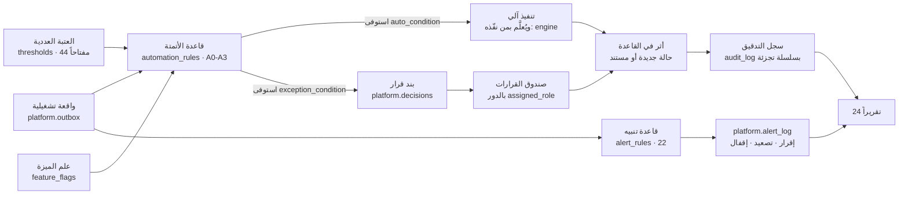

**قراءة الخريطة في عشرة أسطر:**
1. لا واقعة تدخل النظام بلا قاعدة أتمتة معلنة لها في `platform.automation_rules`.
2. القاعدة تقرأ حدّها العددي من `platform.thresholds` عبر `threshold_key` — **لا رقم داخل الكود**.
3. `auto_condition` مستوفى ⇒ تنفيذ آلي مُعلَّم بمنفّذه الآلي (`closed_by = 'engine'`).
4. `exception_condition` مستوفى ⇒ **بند قرار واحد** في `platform.decisions` لدور واحد.
5. صندوق القرارات هو **الصفحة الرئيسية لكل دور** — لا لوحة مؤشرات.
6. التنبيه مسار موازٍ لا بديل: يراقب ما لم يقع بعد، وله دائماً **رابط إجراء**.
7. كل بتّ وكل تنفيذ آلي يكتب حالة جديدة في القاعدة.
8. كل كتابة تولّد قيد تدقيق مربوطاً بسلسلة تجزئة لا تُكسر بلا كشف.
9. التقارير الأربعة والعشرون تقرأ القاعدة مباشرة — **لا يُبنى تقرير على تقرير**.
10. أعلام الميزات تشحن الجديد مطفأً وتُطفئ ما يُسبب مشكلة **بلا نشر**.

---

# 3. البيانات الرئيسية (Master Data)

| العنصر | الجدول | المالك (المنصب) | بوابة الجودة / الاكتمال | من يعدّل |
|---|---|---|---|---|
| **ملكية المجالات الاثني عشر** | `platform.domain_owners` | `GM` (D02) | ١٢ صفاً `D01…D12`، لكلٍّ `owner_role` و`approver_role` و`gate_target_pct` — **لا منصب شاغر مالكاً** | `SYSADMIN` / `GM` من محرّر الهيكل · تغيير مُدقَّق |
| **قواعد الأتمتة** | `platform.automation_rules` | `GM` | صفّ لكل عملية مصنَّفة (**٤٩** في 29 §5-1…§5-4 + **٦** حكمية عند A1) بمستواها ومالكها | `GM` · تغيير مُدقَّق بـ`changed_by`/`changed_at` |
| **العتبات العددية** | `platform.thresholds` | `GM` | **٤٤ مفتاحاً** — `description_ar` و`changed_by` إلزاميان | **`GM` وحده — بلا نشر ولا مبرمج** |
| **الإعدادات غير العددية** | `platform.settings` | `GM` / مالك المجال | وضع أو مزوّد أو علم — `jsonb` بـ`data_type` | `SYSADMIN` / مالك المجال |
| **أعلام الميزات** | `platform.feature_flags` | `SYSADMIN` | لكل علم `kill_switch` ونسبة طرح ومن غيّره | `SYSADMIN` · بأربع عيون إن مسّ صلاحية |
| **قواعد التنبيه** | `platform.alert_rules` | مالك التنبيه بالدور | **٢٢ صفاً `N-01…N-22`** — `source_query` و`action_label` و`action_link` **`not null`** | `SYSADMIN` · الإيقاف لمالك التنبيه بسبب ومدة |
| **سلاسل الاعتماد** | `platform.approval_chains` | `GM` | خطوة لكل مستوى بحدّيها · `requester_id <> approver_id` قيد فعلي | `SYSADMIN` / `GM` — بأربع عيون |
| **الأدوار والصلاحيات** | `identity.roles` · `permissions` · `role_permissions` | `SYSADMIN` (D02) | **٢٦ دوراً** مبذورة · كل صلاحية `module.object.action` | محرّر الهيكل — بأربع عيون |
| **قواعد فصل المهام** | `identity.sod_rules` | `GM` | **أربعة أزواج** مبذورة · `unique (role_a, role_b)` | **تعطيل القاعدة يتطلب `GM` وسبباً مسجَّلاً** |
| **الإنابة** | `identity.delegations` | مانح الإنابة | `valid_to` **إلزامي** وقيد `bounded` يحصرها في **٩٠ يوماً** | المانح · باعتماد `approved_by` |
| **تصنيف الأعمدة** | `identity.column_classification` | `SYSADMIN` (D02) | **١٠٠٪ من أعمدة `01/13/13B/019`** — الحارس **G6** يمنع النشر دونه | `SYSADMIN` · كل هجرة تصنّف أعمدتها |
| **التكاملات** | `platform.integration_config` | مالك التكامل بالدور | **١١ صفاً `I-01…I-11`** بالحقول التسعة | `SYSADMIN` |
| **قوالب المستندات وروابطها** | `platform.document_templates` · `document_bindings` | `GM` / مالك العملية | لكل نوع مستند قالب وربط بانتقال حالة يولّده | `SYSADMIN` |
| **بطاقة جودة البيانات الشهرية** | `platform.domain_quality_monthly` | مالك المجال | صف لكل مجال لكل شهر — مصدر **R-20** و**N-18** | يُكتب آلياً من القياس الشهري |

**تحقُّق القاعدة الحيّة (21/09/2026 · بعد SCH-4):** `alert_rules` = **٢٢ صفاً ✅** · `thresholds` = **٤٤ ✅** · `sod_rules` = **٤ ✅** · `identity.roles` = **٢٦ ✅** · `hr.penalty_schedule` = **٧٧ ✅** · **`domain_owners` = ١٢ ✅** · **`approval_chains` = ٨ ✅** · **`automation_rules` = ٩ ✅** · **`settings` = ١٤ ✅** · **`counters` = ١٥٠ ✅**.
**↷ غير مبذور بعد (مهام WBS):** `feature_flags` **٠** (0.10) · `integration_config` **٠** (0.15) · `column_classification` **٠** (0.16 — **حاجز نشر G6 قائم**) · `role_permissions` **٠** · `document_templates` و`document_bindings` **٠** (5.13) · `billing.gl_accounts` **٠** (بوابة M07) · **جداول `governance` الأربعة عشر منشأة وفارغة** (موجة ٥).
**↷ بذرة `automation_rules` ناقصة عمداً:** التسعة المبذورة هي **النقاط البشرية بالاسم** (`AR-H01…AR-H09`)؛ **الأربعون عملية `A2`/`A3`** من الـ٤٩ لم تُبذر بعد، فمؤشر «نسبة الأتمتة» (P11) لا يزال غير قابل للحساب من القاعدة.

---

# 4. العمليات

## 4.1 صندوق القرارات — من توليد البند إلى البتّ

**المدخل:** عملية تشغيلية استوفت `exception_condition` في قاعدة أتمتتها، أو تجاوزت عتبة، أو انقضت مهلتها.

| # | الخطوة | من يفعلها | الشاشة | ما يتغيّر في القاعدة | الحدث المنشور |
|---|---|---|---|---|---|
| 1 | رصد الاستثناء عند إقفال العملية | المحرّك | — | قراءة `automation_rules` + `thresholds` | — |
| 2 | توليد بند القرار | المحرّك | — | `insert platform.decisions`: `kind` · `title_ar` · `context jsonb` (**وقائع محسوبة لا نص حر**) · `financial_impact` · `urgency` · `source_table`/`source_id` · `assigned_role` · `due_at` · `status='open'` | `platform.decision.created` |
| 3 | ظهور البند في صندوق صاحبه | — | `/inbox` — **الصفحة الرئيسية للدور** | قراءة مرشَّحة بـ`assigned_role` + `status='open'` مرتَّبة بـ`urgency` ثم `financial_impact desc` | — |
| 4 | إشعار على تطبيق القرارات | محرّك التنبيهات | تطبيق **Premium Decisions** | `platform.notifications` — يحترم ساعات الهدوء | — |
| 5 | البتّ | صاحب الدور (أو **نائبه بإنابة سارية**) | `/inbox` مباشرة — **لا فتح شاشة إلا للتفاصيل** | `status='decided'` · `decision` · `decision_note` · `decided_by` · `decided_at` | `platform.decision.decided` |
| 6 | تنفيذ أثر القرار | المحرّك | — | تغيّر الحالة في جدول المصدر عبر `source_table`/`source_id` | حدث الموديول المعني |
| 7 | اختفاء البند | — | `/inbox` | البند يغادر القائمة فوراً | — |
| 8 | انقضاء المهلة بلا بتّ | المجدولة | — | `status='expired'` + تصعيد بـ**N-17** إلى المستوى الأعلى | `platform.decision.expired` |
| 9 | زوال سبب البند | المحرّك | — | `status='auto_resolved'` | — |

**المخرج:** قرار مسجَّل بصاحبه وتوقيته ومبرّره، وأثر منفَّذ في جدول المصدر، وقيد تدقيق بسلسلة تجزئة.

#### خريطة 4-1: دورة بند القرار
تقرأ من اليسار: من الاستثناء إلى الأثر، وكل مخرج بديل مذكور صراحةً.

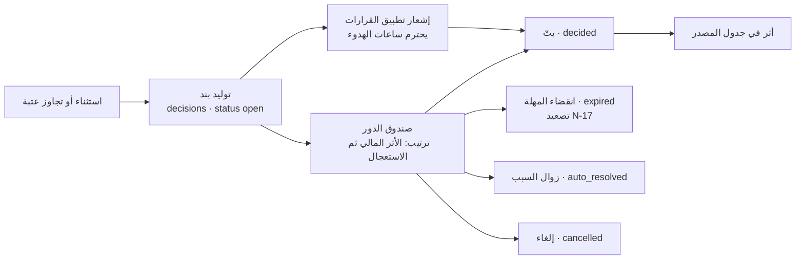

### القواعد المفروضة برمجياً

| القيد / المشغّل | الحد وقيمته | المصدر |
|---|---|---|
| `chk_decisions_status` | `status ∈ {open, decided, expired, cancelled, auto_resolved}` | قيد `check` في القاعدة — تحقَّق |
| `context jsonb not null` | **وقائع محسوبة فقط — لا نص حر** | 29 §7 · 13B |
| `assigned_role text not null` | **لا بند بلا صاحب** | 13B |
| فهرس الترتيب | `(assigned_role, status, urgency, financial_impact desc)` | 29 §7 · موجود في القاعدة |
| مجموعة إجراءات واحدة لكل بند | «Every item has exactly one action set. Item disappears on decision» | 40 §B5 |
| RLS | مقيَّد بالكيان · يُسمح `entity_id is null` لقرارات مستوى المجموعة | 40 §B5 |
| مؤشر صحة الأتمتة | **متوسط البنود لكل دور يومياً ≤ ٧** — فإن زاد فالأتمتة تتراجع | 29 §6-2 · §10 |
| مهلة البتّ | **وسيط ≤ ٤ ساعات عمل** | 29 §10 |

---

## 4.2 الأتمتة المحكومة — من إعلان القاعدة إلى الاستقلالية المكتسبة

**المدخل:** عملية من العمليات التسع والأربعين المصنَّفة في 29 §5.

| # | الخطوة | من يفعلها | الشاشة | ما يتغيّر في القاعدة | الحدث |
|---|---|---|---|---|---|
| 1 | إعلان القاعدة | `GM` | شاشة الإعدادات — قواعد الأتمتة | صف في `automation_rules`: `code` · `process` · `level` (`A0…A3`) · `auto_condition` · `exception_condition` · `escalate_to_roles` · `threshold_key` · `owner_role` | — |
| 2 | ربط الحدّ العددي | `GM` | شاشة العتبات | `threshold_key` → `platform.thresholds.key` — **الرقم في مكان واحد** | — |
| 3 | التنفيذ عند كل واقعة | المحرّك | — | قراءة القاعدة والحد، ثم تنفيذ آلي أو توليد بند قرار | حدث الموديول |
| 4 | تعليم المنفّذ الآلي | المحرّك | — | `closed_by='engine'` (التدقيق الحي) · `approved_by_kind='engine'` (خطة الفرز) | — |
| 5 | قياس الأداء يومياً | المجدولة | لوحة العمليات | `imile.dtl_rule_autonomy` · `imile.dispatch_autonomy` — `level ∈ {0,1}` | — |
| 6 | ترقية الاستقلالية | المحرّك بشروط معلنة | — | `level: 0 → 1` | — |
| 7 | **تنزيل فوري عند التراجع** | المحرّك | — | `level: 1 → 0` | تنبيه للمالك |
| 8 | مراجعة عيّنة عشوائية | المدقّق البشري | `/imile/dtl` | **٥٪ يومياً** من الإغلاقات الآلية | — |

**المخرج:** كل عملية لها مستوى أتمتة **معلن كبيانات**، والاستقلالية تُكتسب بالأداء وتُسحب بالتراجع.

#### خريطة 4-2: الاستقلالية المكتسبة — تُستحق ولا تُمنح
تقرأ من اليسار: لا انتقال إلى الآلي بلا نافذة أداء مثبتة، والرجوع فوري.

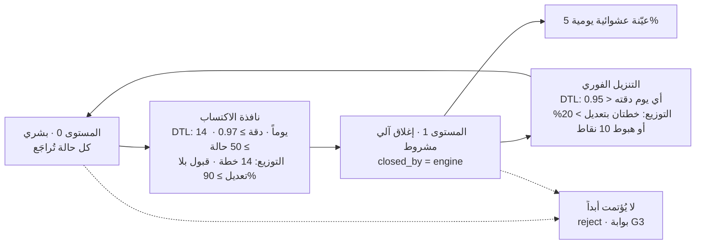

### القواعد المفروضة برمجياً

| القيد / المشغّل | الحد وقيمته | المصدر |
|---|---|---|
| `automation_rules.level char(2)` | `A0` · `A1` · `A2` · `A3` | 13B — **لا قيد `check` على العمود في القاعدة اليوم** (انظر §13) |
| `owner_role not null` | لا قاعدة أتمتة بلا مالك | 13B |
| شرط الإغلاق الآلي للتدقيق الحي — **الستة مجتمعة** | ثقة ≥ **٠.٩٠** · ليست `G3` · تحصيل ≤ **٢٠.٠٠٠** د.ك · ثقة السائق ≥ **٠.٨٠** · دليل موضوعي · القاعدة عند المستوى ١ | ADR-27 · EXEC §1.12 |
| بوابة جودة خطة التوزيع — **سبعة فحوص** | فائض غير مُسنَد ≤ **٣٪** بقائمة مُرحَّلة · ≥ **٩٥٪** من السائقين ضمن حد المناطق · ≤ **٣ مناطق** للسائق · صفر مخالفة استبعاد أو سعة · تدوير · تجاور · وثائق سارية ومعرّف نشط | ADR-27 |
| **`reject` لا يُؤتمت أبداً** | مهما بلغت الثقة | EXEC §1.12 · §1.15 |
| **`G3` لا يُغلق آلياً أبداً** | — | EXEC §1.15 |
| درجة ثقة السائق | `trust = 1 − (0.35·p1 + 0.25·p2 + 0.20·p3 + 0.10·p4 + 0.10·p5)` محصورة `[0,1]` · نافذة ٩٠ يوماً · تُحسب **٠١:٤٠** ليلاً · تاريخ ٢٤ شهراً | ADR-28 · EXEC §1.13 |
| مجموع أوزان الثقة | **= ١.٠٠** — قيد `weights_sum_one` | 13B |
| بداية باردة · قضية احتيال | < ٣٠ تسليماً ⇒ **٠.٧٠** · قضية احتيال مفتوحة (`penalty_schedule.is_fraud`) ⇒ **٠** | ADR-28 |
| **الثقة لا تُعرض للسائق ولا تُربط بأجر ولا بجزاء** | قاعدة ثابتة — تتغيّر بـADR فقط | EXEC §1.13 · §1.15 |
| المستهدف العام | **≥ ٨٠٪ من العمليات عند A2/A3** — والمحقَّق تصميمياً **93.9٪** | 29 §4 · §5-6 |

---

## 4.3 تعديل عتبة أو علم ميزة — الإعدادات الحيّة

**المدخل:** قرار إداري بتغيير حدّ عددي أو إطفاء خاصية.

| # | الخطوة | من يفعلها | الشاشة | ما يتغيّر في القاعدة | الحدث |
|---|---|---|---|---|---|
| 1 | فتح شاشة العتبات | `GM` | الإعدادات — العتبات | قراءة `platform.thresholds` | — |
| 2 | تعديل القيمة | `GM` | نفسها | `update thresholds set value, changed_by, changed_at` | `platform.threshold.changed` |
| 3 | قيد تدقيق إلزامي | المشغّل | — | `audit_log` بالقيمة **قبل وبعد** | — |
| 4 | السريان الفوري | المحرّك | — | القاعدة التالية تقرأ القيمة الجديدة — **بلا نشر** | — |
| 5 | إطفاء خاصية | `SYSADMIN` | الإعدادات — أعلام الميزات | `feature_flags.enabled=false` أو `kill_switch=true` | — |
| 6 | تغيير يمسّ صلاحية أو سرّاً | `SYSADMIN` + **معتمِد ثانٍ** | نفسها | لا يُنفَّذ قبل إقرار `DEPUTY_SYSADMIN` أو `CFO` | — |

**المخرج:** حدّ جديد ساري المفعول فوراً، بأثر رجعي **صفري** (يسري على الجديد لا على الجاري)، وقيد تدقيق كامل.

### القواعد المفروضة برمجياً

| القيد / المشغّل | الحد وقيمته | المصدر |
|---|---|---|
| `thresholds.value numeric(14,3) not null` | كل حد عددي بثلاث خانات | 13B |
| `description_ar not null` · `changed_by not null` | **لا حدّ مجهول المعنى ولا مجهول المُغيِّر** | 13B |
| الفصل عن `settings` | **عدد يُعاد ضبطه ⇒ `thresholds` · وضع أو مزوّد أو علم ⇒ `settings`** — ق-3 | 40 §B5 · R-02d |
| **الأربع عيون** | تغيير الصلاحيات أو الأسرار أو قواعد فصل المهام أو سلاسل الاعتماد يتطلب معتمِداً ثانياً: **`DEPUTY_SYSADMIN` أو `CFO`** — لأن `GM = SYSADMIN` | 40 §B1 · EXEC §1.7 · 22 §2-3 |
| تغيير سلسلة اعتماد | يسري على الطلبات **الجديدة** فقط — الجارية تكمل بسلسلتها | 22 §2-3 |
| ما لا يُضبط من الإعدادات إطلاقاً | **الإشعار الدائن `GM` حصراً · الفصل `GM` حصراً · رفض التدقيق الحي بشري دائماً · ثقة السائق لا تُربط بأجر ولا بجزاء** | 29 §7-1 · EXEC §1.15 |
| الخاصية الجديدة | **تُشحن مطفأة** (`ship dark`) وتُضاء بالتدريج عبر `rollout_pct` | 40 §A4 |

---

## 4.4 سلسلة الاعتماد — المشتريات نموذجاً

**المدخل:** طلب شراء من قسم.

| # | الخطوة | من يفعلها | الشاشة | ما يتغيّر في القاعدة | الحدث |
|---|---|---|---|---|---|
| 1 | إنشاء طلب الشراء | مقدّم الطلب | `/admin/purchase-requests` | `admin.purchase_requests` — سلسلة `PRQ` | `admin.purchase_request.created` |
| 2 | قراءة السلسلة الواجبة | المحرّك | — | `platform.approval_chains` بحسب `request_type` والمبلغ | — |
| 3 | **اعتماد آلي تحت الحد** | المحرّك | — | ≤ **١٠٠** د.ك ⇒ `approved` مباشرة (`purchase.auto_max`) | `admin.approval.auto_approved` |
| 4 | توليد طلب اعتماد | المحرّك | — | `admin.approval_requests` + `admin.approval_steps` · `status='pending'` | — |
| 5 | ظهوره في صندوق المعتمِد | — | `/inbox?kind=approval` | بند قرار بالدور | — |
| 6 | البتّ | المعتمِد حسب الشريحة | `/inbox` | `approved` أو `rejected` **بسبب إلزامي** أو `delegated` | `admin.approval.decided` |
| 7 | تصعيد بلا بتّ | المجدولة | — | `expired` + تنبيه **N-17** إلى المستوى الأعلى | — |
| 8 | ثلاثة عروض أسعار | المحرّك | `/admin/vendor-quotes` | فوق **٥٠٠** د.ك ⇒ `admin.vendor_quotes` إلزامية | — |
| 9 | المطابقة الثلاثية قبل الدفع | المحرّك | — | أمر شراء = استلام = فاتورة، وإلا **يُرفض الدفع** | — |

**المخرج:** التزام مالي معتمد من صاحب الصلاحية الصحيح، بأثر كامل ومستند مُولَّد.

#### خريطة 4-3: مستويات اعتماد المشتريات بالدينار الكويتي
تقرأ من اليسار: المبلغ وحده يحدّد المعتمِد، ولا يُعتمد أحد طلب نفسه.

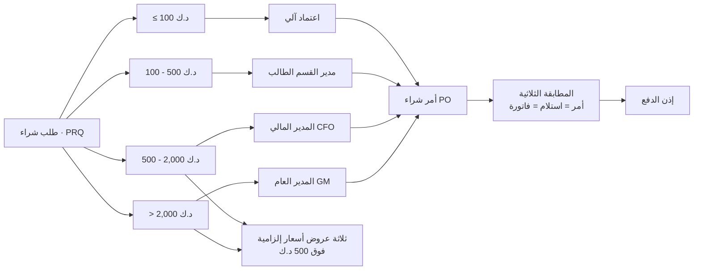

### القواعد المفروضة برمجياً

| القيد / المشغّل | الحد وقيمته | المصدر |
|---|---|---|
| `purchase.auto_max` | **١٠٠** د.ك — اعتماد آلي تحته | `thresholds` — تحقَّق |
| `purchase.manager_max` | **٥٠٠** د.ك — ١٠٠–٥٠٠ لمدير القسم **الطالب** | `thresholds` — تحقَّق |
| `purchase.cfo_max` | **٢,٠٠٠** د.ك — ٥٠٠–٢,٠٠٠ للمدير المالي · فوقها للمدير العام | `thresholds` — تحقَّق |
| `purchase.three_quotes_min` | **٥٠٠** د.ك — ثلاثة عروض إلزامية فوقه | `thresholds` — تحقَّق |
| **لا اعتماد ذاتي** | `requester_id <> approver_id` — **قيد فعلي لا `check (true)`** | 40 §B5 · EXEC §1.1 |
| `chk_approval_requests_status` | `pending · approved · rejected · expired · delegated` | قيد `check` في القاعدة — تحقَّق |
| سبب إلزامي عند الرفض | `audit_log.reason` — الحارس **G10** يعيد صفراً | 40 §B2 |
| **لا منصب شاغر في سلسلة** | `OPS_DIR` و`HR_MGR` لا يظهران معتمِدين أبداً؛ البديل: مدير القسم الطالب ← `CFO` ← `GM` | 22 · EXEC §1.1 |
| اعتمادات الموارد البشرية | إعفاء خصم السكن · جزاءات D4 · الاستقدام ⇒ **`GM`** | EXEC §1.1 |

---

## 4.5 التنبيه — من الاستعلام إلى الإقفال

**المدخل:** جدولة `alert_rules.schedule` أو واقعة فورية.

| # | الخطوة | من يفعلها | الشاشة | ما يتغيّر في القاعدة | الحدث |
|---|---|---|---|---|---|
| 1 | تنفيذ `source_query` | المجدولة `pg-boss` | — | استعلام يعيد **صفر صفوف عند السلامة** | — |
| 2 | فحص الكبح | المحرّك | — | مقارنة `entity_ref` بآخر إطلاق ضمن `dedupe_window_hours` | — |
| 3 | فحص ساعات الهدوء | المحرّك | — | **٢٢:٠٠–٠٧:٠٠** تُطبَّق إلا على المستثنى | — |
| 4 | الإطلاق | المحرّك | — | `insert platform.alert_log`: `rule_code` · `entity_ref` · `fired_at` · `recipients` · `channel` | `platform.alert.fired` |
| 5 | الإرسال | القنوات | داخل التطبيق · واتساب I-05 · بريد I-07 | `platform.notifications` | — |
| 6 | الإقرار | المستقبِل | الشاشة المقصودة عبر `action_link` | `acknowledged_at` · `acknowledged_by` | — |
| 7 | التصعيد بلا إقرار | المجدولة | — | بعد `escalate_after_hours` ⇒ `escalated_at` + إرسال لـ`escalate_to_roles` | — |
| 8 | الإقفال | — | — | `resolved_at` عند زوال سبب التنبيه | — |
| 9 | الإيقاف المؤقت | **مالك التنبيه وحده** | إعدادات التنبيهات | `muted_until` · `muted_by` · `mute_reason` **إلزامي** | — |

**المخرج:** تنبيه وصل صاحبه، بإجراء واحد واضح ورابط شاشة، ومسار تصعيد معلن.

#### خريطة 4-4: دورة حياة التنبيه
تقرأ من اليسار: لا تنبيه يخرج بلا كبح وفحص هدوء، ولا يموت بلا إقرار أو تصعيد.

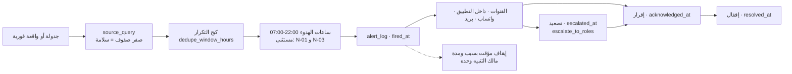

### القواعد المفروضة برمجياً

| القيد / المشغّل | الحد وقيمته | المصدر |
|---|---|---|
| `source_query` · `action_label` · `action_link` | **الثلاثة `not null`** — «تنبيه بلا رابط إجراء غير صالح» | 40 §B6 · 25 §1 |
| ساعات الهدوء | **٢٢:٠٠–٠٧:٠٠** · المستثنى **N-01** (وكيل متوقف) و**N-03** (فرق COD) **وحدهما** | 25 §1 · EXEC §1.4 |
| **«حريق» ليس تنبيه نظام** | لا مصدر بيانات له؛ يُدار بإعلان الوضع اليدوي، **وإعلان الوضع اليدوي يرفع ساعات الهدوء عن نطاقه آلياً** | 25 §1-1 |
| الكبح | `dedupe_window_hours` · **٠ = بلا كبح** (N-03 · N-10 · N-13 · N-14) | 25 §2 |
| **لا منصب شاغر مستقبِلاً** | «مدير العمليات» ⇒ `WH_MGR` + `DEL_MGR` بالنطاق · «الموارد» ⇒ `GM` | 25 §1-2 · 40 §B6 |
| الإيقاف | مالك التنبيه وحده · **بسبب وبمدة** · ويُسجَّل | 25 §1 |
| التجميع | عشر وثائق تنتهي ⇒ **رسالة واحدة بجدول** لا عشر رسائل | 25 §1 |

---

## 4.6 إدارة الوصول — منح دور · إنابة · فصل مهام

**المدخل:** طلب منح صلاحية أو إنابة أثناء غياب.

| # | الخطوة | من يفعلها | الشاشة | ما يتغيّر في القاعدة | الحدث |
|---|---|---|---|---|---|
| 1 | إنشاء المستخدم | `SYSADMIN` | محرّر الهيكل | `identity.users` — **بلا كلمة مرور مخزَّنة على الخادم** | — |
| 2 | منح الدور | `SYSADMIN` | محرّر الهيكل | `identity.user_roles` — **قابل للإبطال** `revoked_at` | — |
| 3 | فحص فصل المهام | المشغّل `identity.check_sod()` | — | **يرفض** إن اجتمع الدور مع زوجه في `sod_rules` | — |
| 4 | نطاق الكيانات | `SYSADMIN` | نفسها | `identity.user_entities` | — |
| 5 | إبطال الجلسات فوراً | المحرّك | — | `identity.sessions` — **الجلسة تُبطَل فور تغيير الدور** | — |
| 6 | الدخول | المستخدم | شاشة الدخول | `identity.otp_codes` — رمز ٦ أرقام · `sessions` ٦ ساعات | — |
| 7 | إنشاء إنابة | مانح الإنابة | محرّر الهيكل — الإنابة | `identity.delegations` — `valid_to` **إلزامي** ≤ **٩٠ يوماً** | — |
| 8 | فحص فصل المهام على الإنابة | المشغّل | — | **الإنابة لا تتجاوز فصل المهام أبداً** (ADR-16c) | — |
| 9 | العمل بالإنابة | النائب | أي شاشة | `audit_log.on_behalf_of` يحمل المُناب عنه | — |
| 10 | تعطيل قاعدة فصل مهام | **`GM` وحده** | محرّر الهيكل | `sod_rules.is_active=false` **بسبب مسجَّل** | — |

**المخرج:** وصول ممنوح بحدود معلنة، قابل للإبطال لحظياً، ومسجَّل بالقيمة قبل وبعد.

#### خريطة 4-5: طبقات الوصول
تقرأ من الأعلى: الهوية أولاً، ثم الدور، ثم النطاق، ثم الصف نفسه — وكل طبقة تحجب ما فوقها.

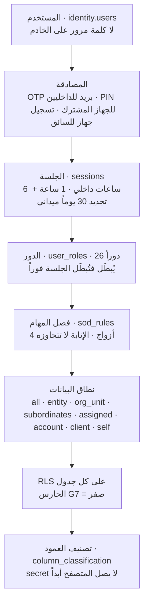

### القواعد المفروضة برمجياً

| القيد / المشغّل | الحد وقيمته | المصدر |
|---|---|---|
| أزواج فصل المهام الأربعة | `(CFO, ACCOUNTANT)` · `(SALES_MGR, CFO)` · `(WH_OP, WH_SUP)` · `(PRO, CFO)` | مبذورة فعلاً — **٤ صفوف تحقَّقت** |
| المشغّل يعمل على الإدراج **والتحديث** | `before insert or update of role_id, revoked_at on identity.user_roles` — وإلا التفّ إعادة التفعيل على القاعدة | 22 §2-3 |
| `delegations.bounded` | `valid_to > valid_from and valid_to <= valid_from + 90 days` | قيد `check` في القاعدة — تحقَّق |
| **الإنابة لا تتجاوز فصل المهام** | ADR-16c — نفس الفحص يُطبَّق على `delegations` | EXEC §1.6 · تعليق القاعدة |
| OTP | **٦ أرقام** · صلاحية **٥ دقائق** · استخدام واحد · **٥ محاولات** · إعادة إرسال بعد **٦٠ ثانية** · **٥/بريد/ساعة** | EXEC §1.8 |
| الإقفال | **١٠ إخفاقات/١٥ دقيقة** ⇒ ١٥ ← ٣٠ ← ٦٠ دقيقة · **٣ إقفالات/٢٤ ساعة** ⇒ تنبيه | EXEC §1.8 |
| حدود المعدّل | دخول **٥/دقيقة/IP** + **٢٠/ساعة/بريد** · واجهة داخلية **٣٠٠/دقيقة/مستخدم** · مفتاح عميل **١٠٠/دقيقة** · مزامنة ميدانية **٦٠/دقيقة/جهاز** | EXEC §1.8 |
| الجلسات | داخلي **٦ ساعات** · ميداني **١ ساعة** + تجديد **٣٠ يوماً** مربوط بالجهاز | EXEC §1.8 |
| **PDA — جهاز مشترك** | كود الموظف + **PIN ٦ أرقام**؛ التجزئة `argon2id` على **الجهاز المسجَّل وحده** ولا تصل الخادم · **إعادة تحقق OTP أسبوعياً** · دون اتصال **٧٢ ساعة** | G-07 · EXEC §1.9 |
| **تطبيق السائق — جهاز شخصي** | جهاز واحد لكل سائق · تسجيل OTP **مرة** ثم تجديد **٣٠ يوماً** · **جهاز جديد = موافقة المشرف** · دون اتصال **٧ أيام** | G-07 · EXEC §1.9 |
| جهاز مُبطَل | **طابوره يُحجَر** لمراجعة المشرف | EXEC §1.9 |
| إقفال الوردية | **لا تُقفل وردية وطابورها > ٠** | EXEC §1.9 |
| تصنيف الأعمدة | `public · personal · payroll · commercial · secret` — **`secret` لا يصل المتصفح أبداً** · الحارس **G6** يمنع النشر إن بقي عمود بلا تصنيف | 40 §B1 |
| الأدوار | **٢٦** — تحقَّق فعلاً في `identity.roles` | 40 §B1 + `DEPUTY_SYSADMIN` |

---

## 4.7 التدقيق والتتبّع — من الكتابة إلى الإثبات

**المدخل:** أي كتابة في النظام — من إنسان أو وكيل أو نظام أو ذكاء اصطناعي أو عميل.

| # | الخطوة | من يفعلها | الشاشة | ما يتغيّر في القاعدة | الحدث |
|---|---|---|---|---|---|
| 1 | الكتابة | أي فاعل | أي شاشة | تغيير في جدول المصدر | حدث المجال |
| 2 | التعقيم | `platform.sanitize_audit()` | — | الأعمدة المصنَّفة `payroll` · `commercial` · `secret` · `personal` تُخزَّن **`•••`** | — |
| 3 | ربط السلسلة | `platform.audit_hash_chain()` تحت **قفل استشاري** | — | `prev_hash` + `row_hash = sha256(prev_hash ‖ occurred_at ‖ user_id ‖ table_name ‖ record_id ‖ operation)` | — |
| 4 | الكتابة في القسم الشهري | المحرّك | — | `platform.audit_log_YYYY_MM` · المفتاح `(id, occurred_at)` | — |
| 5 | إنشاء قسم الشهر القادم | المجدولة `pg-boss` | — | قسم جديد + `audit_log_default` شبكة أمان | — |
| 6 | التحقق الشهري | المجدولة | — | `platform.verify_audit_chain()` — **صفر صفوف** | — |
| 7 | كسر مكتشَف | المحرّك | — | **تنبيه فوري لـ`GM` + `SYSADMIN`** | — |
| 8 | التتبّع | المستخدم | شاشة التتبّع `Ctrl+K` | قراءة عروض مُجسَّدة فوق `audit_log` + `outbox` + الدفاتر | — |
| 9 | الأرشفة | المجدولة | — | `detach partition` — **لا `delete`**، ويبقى قابلاً للبحث | — |

**المخرج:** كل رقم في النظام يُرَدّ إلى من كتبه ومتى ومن أي جهاز وبأي قيمة سابقة — **في ≤ ٢ ثانية** (الحارس G17).

#### خريطة 4-6: الطبقات الأربع للإثبات
تقرأ من الأعلى: التدقيق يسجّل الضغطة، والحدث يسجّل الواقعة، والدفتر يحمل الرقم، والسلسلة تصلها.

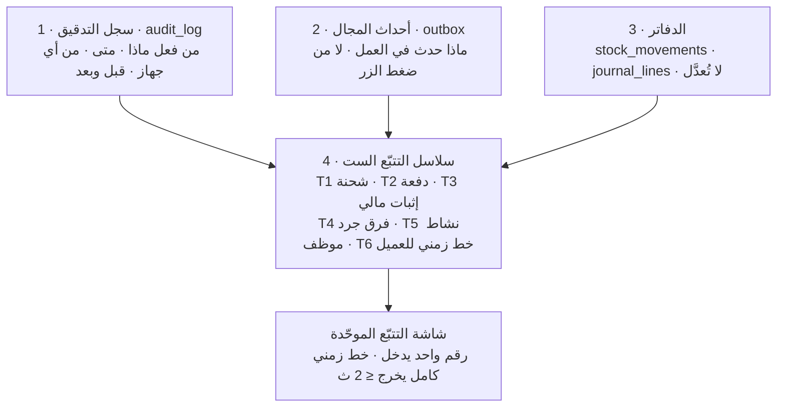

### القواعد المفروضة برمجياً

| القيد / المشغّل | الحد وقيمته | المصدر |
|---|---|---|
| `REVOKE UPDATE, DELETE` على `audit_log` | **السجل لا يُعدَّل ولا يُحذف** | 40 §B2 |
| الأعمدة الإحدى عشرة الإلزامية | `prev_hash` · `row_hash` · `doc_no` · `changed_fields` · `reason` · `correlation_id` · `request_id` · `session_id` · `device_id` · `on_behalf_of` · `actor_type` — **موجودة كلها في القاعدة، تحقَّقت** | 40 §B2 |
| `actor_type` | `user · agent · system · ai · client` | 40 §B2 |
| `operation` | `insert update delete approve reject void login export print read_secret` | 40 §B2 |
| **سبب إلزامي** | لـ`reject` و`void` و`override` — الحارس **G10** يعيد صفراً | 40 §B2 · 31 §9-2 |
| **G8** سلامة السلسلة | `select * from platform.verify_audit_chain();` ⇒ **صفر صفوف** | 40 Part F |
| **G9** كل حدث له تدقيق | آخر **١,٠٠٠** كتابة في `outbox` لكلٍّ صف تدقيق بنفس `correlation_id` ⇒ **صفر** | 31 §9-1 |
| **G17** زمن التتبّع | **≤ ٢ ثانية** | 40 Part F |
| الاحتفاظ | تدقيق تشغيلي **١٨ شهراً** · مالي واعتمادات **١٠ سنوات** · أحداث `outbox` **٥ سنوات** · دفتر مخزون **٥ سنوات** · دفتر مالي **١٠ سنوات** · **صور إثبات التسليم ٦٠ يوماً** | 31 §8 · 40 Part G |
| **`legal_hold` تلقائي** | على أي صورة مرتبطة بنزاع أو شكوى أو جزاء — و`tms.proof_of_delivery` يحمل `legal_hold` و`retain_until` و`sha256` | EXEC §1.4 · 31 §8-1 |
| مراقبة القسم الافتراضي | **أي صف في `audit_log_default` = المهمة الشهرية لم تعمل** | 31 §3-4 |
| صلاحية القراءة على التتبّع | `GM`/`SYSADMIN` الكل **بقيم مالية معقّمة** · `CFO` المالي · مديرو الوحدات نطاقهم · المشرف فريقه · الموظف عملياته هو · **العميل بلا أسماء موظفينا** | 31 §10 |

---

## 4.8 الاستمرارية — إعلان الوضع اليدوي والعودة منه

**المدخل:** عطل من المستويات الأربعة.

| # | الخطوة | من يفعلها | الشاشة / القناة | ما يتغيّر | الحدث |
|---|---|---|---|---|---|
| 1 | تصنيف العطل | مالك النظام / مالك الموديول | لوحة المراقبة | L0 بطء · L1 جزئي · L2 كلي · L3 فقد بيانات | — |
| 2 | **الإعلان خلال ≤ ١٥ دقيقة** | **`GM`، أو `WH_MGR`/`DEL_MGR` لنطاقه** | **مجموعة واتساب `PG-EOS-OPS`** | إعلان الوضع اليدوي — **ويرفع ساعات الهدوء عن نطاقه آلياً** | — |
| 3 | التحوّل ≤ ٣٠ دقيقة | كل الإدارات | **حقيبة الطوارئ** | النماذج الورقية الأحد عشر المرقّمة مسبقاً | — |
| 4 | العمل الورقي | الميدان | النماذج | لا سجل في النظام بعد | — |
| 5 | إعلان العودة | **المعلِن نفسه** | نفس القناة | — | — |
| 6 | تجميد ٣٠ دقيقة | `SYSADMIN` | — | لا عمليات جديدة | — |
| 7 | الإدخال اللاحق ≤ ٤ ساعات | الميدان | شاشات العمليات | `entered_offline = true` + `original_occurred_at` **بالتاريخ الأصلي** | أحداث المجال |
| 8 | المطابقة الثلاثية ≤ ٢٤ ساعة | مالك كل نطاق | — | عدد الورق = عدد السجلات · مجاميع COD متطابقة · **لا رقم مستند مكرر** | — |
| 9 | سجل العطل | `SYSADMIN` | — | السبب · المدة · ما فات · ما أُدخل · من أدخل | — |

**المخرج:** يوم عمل لم يتوقف، وبيانات دخلت بتواريخها الأصلية، ومطابقة موثّقة.

#### خريطة 4-7: مستويات العطل وقرارها
تقرأ من الأعلى: كل مستوى له مقرِّر واحد معلن — لا قرار مشترك يتعطّل بغياب أحدهما.

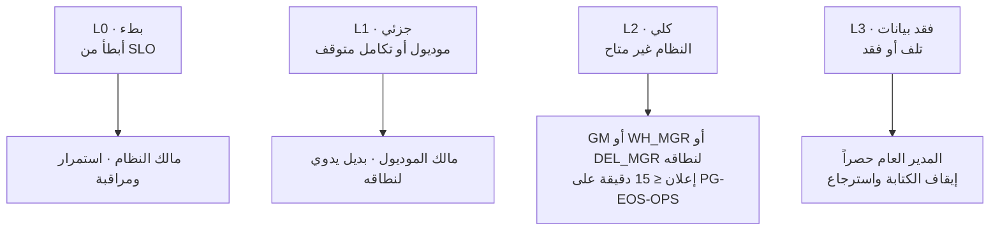

### القواعد المفروضة برمجياً وإدارياً

| القيد / القاعدة | الحد وقيمته | المصدر |
|---|---|---|
| مهلة إعلان L2 | **≤ ١٥ دقيقة** من الاكتشاف · القناة **`PG-EOS-OPS`** · **المعلِن نفسه يُنهي** | 26 §1 · EXEC §1.4 |
| **RPO / RTO — Tier 0** | **٢٤ ساعة / ٤ ساعات** (المراحل ٠–٣ فقط) | 26 §4 · 40 Part G |
| **RPO / RTO — Tier 2** | **≤ ١ ساعة / ≤ ٤ ساعات** (من المرحلة ٤) | 26 §4 |
| النسخ الاحتياطي | **١٤ يومية · ٨ أسبوعية · ٦ شهرية** — كما هو منفَّذ في `backup.sh` · يومياً **٠٢:٠٠** | 26 §4-1 · 42 §6.1 |
| **اختبار استرجاع فعلي** | **شهري — إلزامي في كل الطبقات.** «نسخة غير مُختبَرة ليست نسخة» | 26 §4-1 |
| العمودان الميدانيان | `entered_offline boolean not null default false` · `original_occurred_at timestamptz` — **على الجداول الميدانية حصراً** | 26 §5 · OPS-53 |
| **تمرين الوضع اليدوي** | **ربعي · ساعتان · كل الإدارات** — أول تنفيذ **بعد بوابة المرحلة ٢** | 26 §6 · EXEC §1.4 |
| حقيبة الطوارئ | نسخة مطبوعة في **أربعة مواقع**: المستودع · المحطة · المالية · الكول سنتر — تُحدَّث **شهرياً** بمسؤول بالاسم | 26 §3 |
| النماذج الورقية | **أحد عشر نموذجاً مرقّماً مسبقاً** — وهي **الاستثناء الوحيد** لقاعدة «لا تبويب نماذج»، **ولا تُنشئ سجلاً بذاتها** | 26 §3 · 00 §5-2 |
| حساب كسر الزجاج | خزنة فعلية في المقر · **`GM` + `CFO` يعرفان الموقع** | EXEC §1.4 |
| Runbook | **ثمانية إجراءات موثّقة** — يُكتب قبل الإطلاق (مهمة 0.20) | 26 §8 |

---

## 4.9 حوكمة التغيير — SCR وADR

**المدخل:** حاجة إلى جدول أو عمود أو قاعدة عمل غير موجودة.

| # | الخطوة | من يفعلها | ما يتغيّر | القرار |
|---|---|---|---|---|
| 1 | اكتشاف الفجوة أثناء بناء شريحة | وكيل البناء | — | **يتوقف ولا يخترع** |
| 2 | رفع طلب تغيير مخطط (SCR) بسطر واحد | وكيل البناء | `docs/notes/` | تحت قاعدة **G-01** |
| 3 | الفحص | المعماري | — | **يُقبل** إن كان ضمن `01/13/13B/019`، أو لواحدة من ثلاث: فجوة مخطط حقيقية · قيد تقني غير قابل للحل · متطلب في 40 غير مُنمذج |
| 4 | **الرفض** | المعماري | — | **قاعدة عمل جديدة داخل شريحة تُرفض** — محلها `platform.thresholds` أو قرار مسجَّل للمدير العام |
| 5 | تغيير معماري | المعماري | `ADR` مسجَّل | وحده يستوجب ADR |
| 6 | ما دون ذلك | — | `CHANGELOG` | لا وثيقة مرقَّمة جديدة |
| 7 | DDL صادر عن المدير العام | `GM` | — | **لا يحتاج SCR** |

**المخرج:** مخطط لا يتضخّم بالصدفة، وقرارات معمارية موثّقة بسببها وبدائلها المرفوضة.

### القواعد المفروضة

| القاعدة | الحد | المصدر |
|---|---|---|
| **لا جدول ولا عمود ولا قاعدة عمل خارج `01/13/13B/019`** | حاجز مطلق — «STOP and file an SCR» | 40 §A5 · EXEC §1.11 |
| **لا رقم سحري في الكود** | ثوابت مسمّاة أو `platform.thresholds` | 40 §A5 |
| تغيير خاصية داخل موديول قائم | موافقة مالك الموديول | 00 §7-3 |
| خاصية جديدة أو تغيير مخطط | قرار مسجَّل: القرار · السبب · **البدائل المرفوضة** · المسؤول · موعد التقييم | 00 §7-3 |
| تغيير معماري | يعدّل الوثيقة الحاكمة **صراحةً** | 00 §7-3 |
| **«منجز» يتطلب بصمة الالتزام** | لا `commit hash` لاختبار قبول ناجح في `PROJECT_STATE.md` ⇒ **غير منجز** | EXEC §1.14 |
| **لا تُضعَّف قاعدة ولا اختبار** | «Never weaken a test to make it pass. Fix the code» | 40 §A5 |

---

# 5. آلات الحالات

## 5-1 `platform.decisions.status`

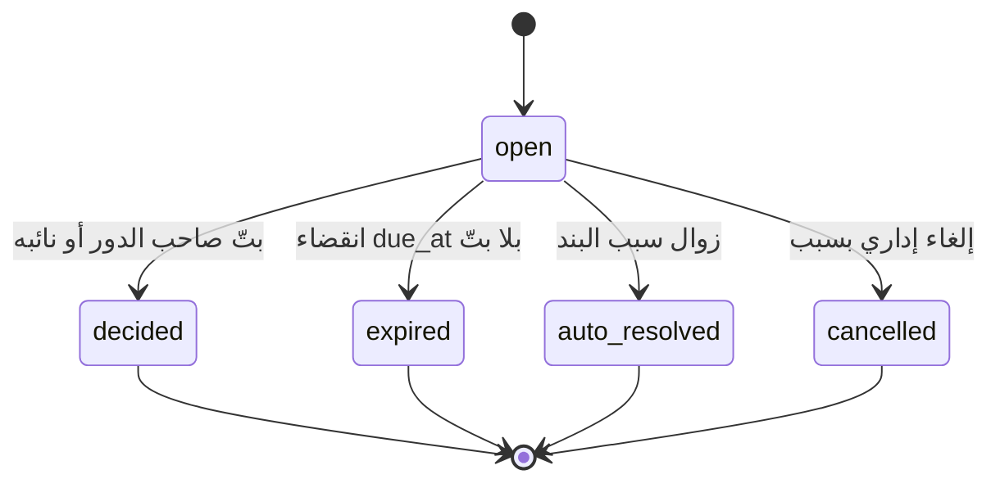

| الحالة | من ينقلها | الحدث | الشاشة |
|---|---|---|---|
| `open` | المحرّك عند الإنشاء | `platform.decision.created` | `/inbox` |
| `decided` | `assigned_role` أو نائبه بإنابة سارية | `platform.decision.decided` | `/inbox` |
| `expired` | المجدولة عند تجاوز `due_at` | `platform.decision.expired` + **N-17** | `/inbox` |
| `auto_resolved` | المحرّك عند زوال السبب | — | — |
| `cancelled` | `GM` أو مالك المصدر بسبب مسجَّل | — | `/inbox` |

> **القيمة الحاكمة هي قيد القاعدة:** خمس حالات. (`_changelog/STATE-REGISTER.md` يسرد أربعاً بلا `auto_resolved` بينما 29 §7 و40 §B5 يسردان أربعاً بلا `cancelled` — والقاعدة تحمل اتحادهما. مرصود في §13.)

## 5-2 `admin.approval_requests.status`

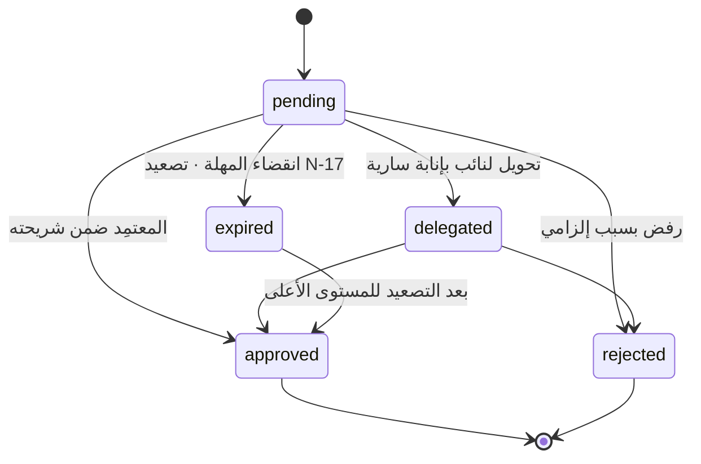

| الحالة | من ينقلها | الحدث | الشاشة |
|---|---|---|---|
| `pending` | المحرّك من `approval_chains` | `admin.approval.created` | `/inbox?kind=approval` |
| `approved` | المعتمِد بحسب الشريحة المالية | `admin.approval.decided` | `/inbox` |
| `rejected` | المعتمِد — **`reason` إلزامي** | `admin.approval.decided` | `/inbox` |
| `delegated` | المعتمِد إلى نائب بإنابة سارية | — | `/inbox` |
| `expired` | المجدولة + **N-17** | — | `/inbox` |

## 5-3 `platform.integration_queue.status` — الطابور اليدوي

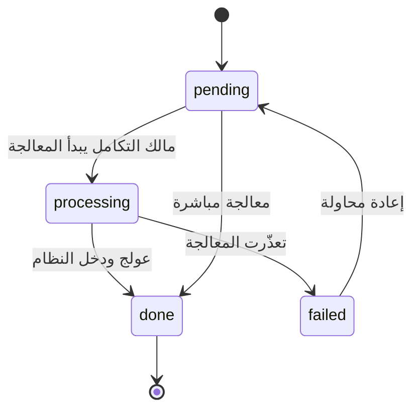

| الحالة | من ينقلها | الحدث | الشاشة |
|---|---|---|---|
| `pending` | محرّك التكامل عند الفشل بعد إعادة المحاولات | — | `/platform/integrations/queue` |
| `processing` | مالك التكامل (`integration_config.owner_role`) | — | نفسها |
| `done` | مالك التكامل | — | نفسها |
| `failed` | المحرّك | **N-19** عند > ٢٠ سجلاً أو عمر > ٤٨ ساعة | نفسها |

## 5-4 `platform.documents.status`

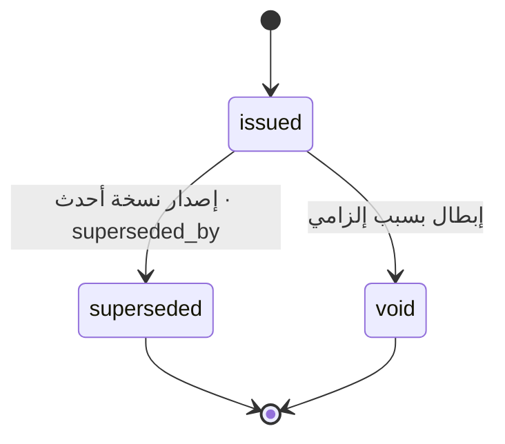

| الحالة | من ينقلها | الحدث | الشاشة |
|---|---|---|---|
| `issued` | محرّك الوثائق عند انتقال الحالة المُولِّد | `platform.document.issued` | شاشة العملية نفسها |
| `superseded` | محرّك الوثائق عند إصدار نسخة أحدث | — | نفسها |
| `void` | مالك العملية — **`reason` إلزامي (G10)** | — | نفسها |

## 5-5 دورة الإنابة — `identity.delegations`

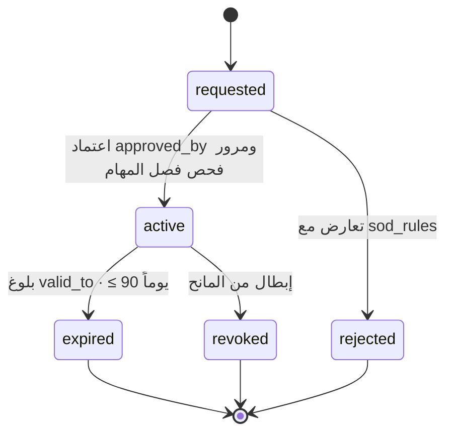

> **ملاحظة مخطط:** `identity.delegations` **لا يحمل عمود حالة** في القاعدة — الحالة **مشتقّة** من `valid_from`/`valid_to`/`approved_by`. الرسم أعلاه يصف الدورة المنطقية لا عموداً مخزَّناً.

---

# 6. المستندات والنماذج

## 6-1 المبدأ P8 — الوثيقة مخرَج لا مدخل

```
عملية → انتقال حالة → محرّك الوثائق → مستند مُولَّد + مؤرشف + مربوط بالحركة
```

**لا يوجد في النظام «تبويب نماذج» إطلاقاً.** زر الطباعة يعيش **في شاشة العملية نفسها**، ولا مكان آخر لإصدار ذلك المستند.

| المكوّن | الوصف |
|---|---|
| `platform.document_templates` | قالب Handlebars HTML لكل نوع · ثنائي اللغة · الترويسة والتذييل من `platform.entities` |
| `platform.document_bindings` | ربط: نوع المستند ← **العملية وانتقال الحالة** الذي يولّده · `auto_generate` |
| `platform.documents` | المستند المُولَّد: رقمه · نسخته · `rendered_data` **مجمَّد** · `file_url` · `checksum` · `superseded_by` · `legal_hold` · `retain_until` |

**تعليق القاعدة على `document_bindings` صريح:** «لا تبويب نماذج. كل مستند مربوط بعملية وانتقال حالة يولّده تلقائياً».

## 6-2 السلاسل المرقّمة — `platform.counters`

**الترقيم ذرّي عبر `platform.next_doc_no(entity, doc_type)` — لا يُعاد رقم أبداً، والحارس G13 يثبت ذلك تحت ١٠٠ اتصال متزامن.**

| السلسلة | الاستخدام | ملاحظة حوكمية |
|---|---|---|
| **`INV`** | فواتير العملاء | **الرقم يُخصَّص عند الاعتماد فقط** لا عند المسودة |
| **`RCT`** | سندات القبض | السلسلة الوحيدة للتحصيل — `RCP`/`RC` **ألغيتا** · يحملها `PRO` |
| **`GOV`** | عهدة الرسوم الحكومية | **منفصلة عن `RCT` عمداً** — نقدان في يد واحدة يفصلهما دفتران، و`CFO` يطابق التيارين كلاً على حدة |
| **`CN`** | الإشعارات الدائنة | **اعتماد `GM` حصراً · لا يُؤتمت أبداً** |
| `PRQ` · `PO` · `APR` | طلب شراء · أمر شراء · طلب اعتماد | سلسلة الاعتماد |
| `COR` | المراسلات | `admin.correspondence` |
| `JE` | القيود المحاسبية | دفتر لا يُعدَّل |
| `QTE` · `CTR` · `OPP` · `LEAD` | عروض · عقود · فرص · عملاء محتملون | — |
| `INB` · `OUT` · `CNT` · `TSK` · `RTE` · `TKT` · `MPR` · `PCT` · `PINV` | تشغيلية | — |

**تحقُّق القاعدة:** `platform.counters` يحمل **١١٠ صفاً** تغطي **٢٢ نوع مستند** موزّعة على الكيانات الخمسة.

## 6-3 ما يُطبع ويُرسل والتوقيعات

| البند | القاعدة |
|---|---|
| التصيير | Chromium headless · خط **Cairo** · **RTL افتراضاً** · ثنائي اللغة |
| الهوية البصرية | ترث من الكيان المُصدِر: الشعار · الاسم القانوني · السجل التجاري · الرقم الضريبي · العنوان — **تُدخل مرة وتظهر في كل مستند تالٍ** |
| الألوان | كحلي `#14284B` · نحاسي `#B5673E` · رمادي `#6B7280` |
| التجميد | `rendered_data` مجمَّد عند الإصدار — تغيّر البيانات لاحقاً **لا يغيّر المستند الصادر** |
| **الحجز القانوني** | `legal_hold` يمنع الحذف بانقضاء المدة — **يُرفع تلقائياً** على أي مستند أو صورة مرتبطة بنزاع أو شكوى أو جزاء |
| كل قراءة أو طباعة أو تصدير | **تُسجَّل** في `audit_log` (`operation = print · export`) — تسريب محتمل |
| **الاستثناء الورقي الوحيد** | النموذج الميداني الفارغ في حقيبة الطوارئ — يُطبع من القالب نفسه، وله خانة مرجع تُدخل لاحقاً، **ولا يُنشئ سجلاً بذاته** |

---

# 7. الضوابط والاعتمادات

## 7-1 العتبات العددية — القائمة الكاملة الأربع والأربعون

**كل صفّ أدناه موجود فعلاً في `platform.thresholds` — عُدّ وتُحقِّق منه في قاعدة `pgeos`.** يحرّرها **المدير العام** من شاشة الإعدادات **بلا نشر ولا مبرمج**.

### أ) تجاري ومالي — ١٠ مفاتيح

| المفتاح | القيمة | الوحدة | المعنى الإداري |
|---|---|---|---|
| `invoice.auto_approve_max` | **٥٠٠.٠٠٠** | د.ك | الفاتورة تُعتمد آلياً تحته · فوقه اعتماد المدير المالي |
| `purchase.auto_max` | **١٠٠.٠٠٠** | د.ك | الشراء يُعتمد آلياً تحته |
| `purchase.manager_max` | **٥٠٠.٠٠٠** | د.ك | ١٠٠–٥٠٠ لمدير القسم الطالب |
| `purchase.cfo_max` | **٢٬٠٠٠.٠٠٠** | د.ك | ٥٠٠–٢٬٠٠٠ للمدير المالي · فوقها للمدير العام |
| `purchase.three_quotes_min` | **٥٠٠.٠٠٠** | د.ك | ثلاثة عروض أسعار إلزامية فوق هذا المبلغ |
| `contract.min_margin_pct` | **١٥.٠٠٠** | ٪ | هامش العقد الأدنى — تحته **تحذير** |
| `contract.gm_margin_pct` | **١٠.٠٠٠** | ٪ | تحته **يتطلب المدير العام** |
| `catalog.min_price_markup_pct` | **١٥.٠٠٠** | ٪ | `min_price = standard_cost × 1.15` |
| `partner.match_tolerance_pct` | **٢.٠٠٠** | ٪ | فاتورة الشريك تُعتمد آلياً ضمن هذا الفرق · فوقه تُحجز للمدير المالي |
| `partner.liability_cap_months` | **٣.٠٠٠** | شهر | سقف مسؤولية الشريك = `min(3 × الفوترة الشهرية، قيمة العقد)` |

### ب) المساحات والسكن — ٦ مفاتيح

| المفتاح | القيمة | الوحدة | المعنى الإداري |
|---|---|---|---|
| `space.reservation_max_days` | **٣٠.٠٠٠** | يوم | أقصى حجز مساحة بلا عقد · أطول يتطلب المدير المالي |
| `space.buffer_pct` | **٧.٠٠٠** | ٪ | الاحتياطي التشغيلي المستبعَد من البيع |
| `housing.min_occupancy_pct` | **٧٠.٠٠٠** | ٪ | تحته **يُراجَع عقد الإيجار** |
| `housing.deduction` | **٢٣.٠٠٠** | د.ك | خصم السكن الشهري — **الإعفاء بقرار `GM` وسبب مسجَّل** |
| `housing.phone_deduction` | **٥.٠٠٠** | د.ك | خصم الهاتف الشهري |
| `housing.residency_deduction` | **١٢.٠٠٠** | د.ك | خصم الإقامة الشهري |

### ج) السائقون والأسطول — ١٠ مفاتيح

| المفتاح | القيمة | الوحدة | المعنى الإداري |
|---|---|---|---|
| `driver.commission_base` | **٠.٣٠٠** | د.ك | عمولة الشحنة المسلَّمة — **قاعدة ثابتة** |
| `driver.commission_bonus` | **٠.٠٥٠** | د.ك | بونص الجودة للشحنة |
| `driver.bonus_first_attempt_pct` | **٨٥.٠٠٠** | ٪ | عتبة النجاح من أول محاولة لاستحقاق البونص |
| `driver.custody.alert_hours` | **٢٤.٠٠٠** | ساعة | تنبيه العهدة الفاشلة بيد السائق |
| `driver.custody.escalate_hours` | **٤٨.٠٠٠** | ساعة | تصعيد لمدير التوصيل · وتصير المخالفة CLI-08 قابلة للتطبيق |
| `driver.payment.link_ttl_min` | **٣٠.٠٠٠** | دقيقة | مهلة صلاحية رابط الدفع |
| `fleet.pm_oil_km` | **٥٬٠٠٠.٠٠٠** | كم | صيانة وقائية — الزيت والفلاتر بالمسافة |
| `fleet.pm_oil_days` | **٩٠.٠٠٠** | يوم | صيانة وقائية — الزيت بالزمن |
| `fleet.pm_brakes_km` | **٢٠٬٠٠٠.٠٠٠** | كم | صيانة وقائية — الفرامل |
| `fleet.pm_tyres_km` | **٤٠٬٠٠٠.٠٠٠** | كم | صيانة وقائية — الإطارات |

### د) الاستقلالية المكتسبة — التدقيق الحي (ADR-27) — ٨ مفاتيح

| المفتاح | القيمة | الوحدة | المعنى الإداري |
|---|---|---|---|
| `dtl.auto_close.min_confidence` | **٠.٩٠٠** | نسبة | الإغلاق الآلي يشترط ثقة المحرّك ≥ ٠.٩٠ |
| `dtl.auto_close.max_cod_kwd` | **٢٠.٠٠٠** | د.ك | الإغلاق الآلي يشترط قيمة تحصيل ≤ ٢٠ د.ك |
| `dtl.auto_close.min_driver_trust` | **٠.٨٠٠** | نسبة | الإغلاق الآلي يشترط ثقة السائق ≥ ٠.٨٠ |
| `dtl.promotion.consecutive_days` | **١٤.٠٠٠** | يوم | الترقية ٠→١ تتطلب ١٤ يوماً متتالياً |
| `dtl.promotion.min_accuracy` | **٠.٩٧٠** | نسبة | الترقية تتطلب دقة ≥ ٠.٩٧ |
| `dtl.promotion.min_cases` | **٥٠.٠٠٠** | حالة | الترقية تتطلب ≥ ٥٠ حالة في النافذة |
| `dtl.demotion.accuracy_floor` | **٠.٩٥٠** | نسبة | **أي يوم دقته < ٠.٩٥ ⇒ تنزيل فوري** |
| `dtl.review.random_sample_pct` | **٥.٠٠٠** | ٪ | إعادة مراجعة عشوائية يومية لـ٥٪ من الإغلاقات الآلية |

### هـ) الاستقلالية المكتسبة — خطة التوزيع (ADR-27) — ٨ مفاتيح

| المفتاح | القيمة | الوحدة | المعنى الإداري |
|---|---|---|---|
| `dispatch.gate.max_overflow_pct` | **٣.٠٠٠** | ٪ | بوابة الجودة — فائض غير مُسنَد ≤ ٣٪ بقائمة مُرحَّلة |
| `dispatch.gate.min_drivers_zone_cap_pct` | **٩٥.٠٠٠** | ٪ | بوابة الجودة — ≥ ٩٥٪ من السائقين ضمن حد المناطق |
| `dispatch.gate.max_zones_per_driver` | **٣.٠٠٠** | منطقة | بوابة الجودة — ≤ ٣ مناطق للسائق |
| `dispatch.promotion.min_plans` | **١٤.٠٠٠** | خطة | الاستقلالية تُكتسب بعد ١٤ خطة |
| `dispatch.promotion.min_unchanged_pct` | **٩٠.٠٠٠** | ٪ | الترقية تتطلب قبولاً بلا تعديل ≥ ٩٠٪ |
| `dispatch.demotion.max_edits_pct` | **٢٠.٠٠٠** | ٪ | حد التعديل على الخطة |
| `dispatch.demotion.consecutive_plans` | **٢.٠٠٠** | خطة | خطتان متتاليتان تجاوزتا حد التعديل ⇒ تنزيل |
| `dispatch.demotion.first_attempt_drop_pts` | **١٠.٠٠٠** | نقطة | هبوط النجاح من أول محاولة > ١٠ نقاط عن متوسط ٣٠ يوماً ⇒ تنزيل |

### و) الاستقدام — مفتاحان

| المفتاح | القيمة | الوحدة | المعنى الإداري |
|---|---|---|---|
| `recruitment.escalate_days` | **١١.٠٠٠** | يوم | تصعيد مرحلة الاستقدام — SLA ٧ أيام + ٥٠٪ |
| `recruitment.escalate_pct` | **٥٠.٠٠٠** | ٪ | نسبة تجاوز SLA الموجبة للتصعيد — للعرض |

**المجموع: ١٠ + ٦ + ١٠ + ٨ + ٨ + ٢ = ٤٤ مفتاحاً — مطابق للعدّ الفعلي في القاعدة.**

## 7-2 أعلام الميزات — `platform.feature_flags`

| العمود | الدور الحوكمي |
|---|---|
| `key` · `enabled` | الخاصية تُشحن **مطفأة** |
| `rollout_pct` | طرح تدريجي بالنسبة |
| `enabled_for_roles` | تفعيل لأدوار مختارة أولاً |
| **`kill_switch`** | **إطفاء فوري بلا نشر** عند ظهور مشكلة |
| `changed_by` · `changed_at` | من غيّر ومتى — مُدقَّق |

**علم حوكمي معلن بالاسم:** الرصد الآلي للغياب والتأخير من البصمة **لا يُفعَّل قبل اكتمال بيانات الحضور ≥ ٩٥٪ لمدة ٣٠ يوماً متصلة** — التفعيل على بيانات ناقصة يولّد مئات الجزاءات الخاطئة (EXEC §1.3 · 23 I-04).

## 7-3 ملكية البيانات — المجالات الاثنا عشر

**القاعدة: الملكية بالمنصب لا بالشخص. من يشغل المنصب يرث مجاله، ولا تُعاد الهيكلة عند تغيّر الأشخاص.**

| # | المجال | الجدول | المالك (المنصب) | معيار الاكتمال | مؤشر الجودة |
|---|---|---|---|---|---|
| **D01** | الكيانات وبيانات الشركة | `platform.entities` · `settings` | **`GM`** | ١٠٠٪ من حقول السجل التجاري والعنوان والشعار | صفر مستند بترويسة ناقصة |
| **D02** | المستخدمون والأدوار | `identity.*` | `SYSADMIN` | كل موظف نشط له حساب ودور | **صفر حساب لموظف منتهي الخدمة** |
| **D03** | العملاء | `sales.accounts` | `CFO` | سجل تجاري · شريحة · حد ائتماني · مهلة سداد · جهة اتصال | **صفر عميل بلا حد ائتماني** |
| **D04** | العقود وملاحق الأسعار | `sales.contracts` | `CFO` | كل عميل نشط له عقد ساري بملحق أسعار | **صفر أمر على عقد منتهٍ** |
| **D05** | كتالوج الخدمات والأسعار | `catalog.*` | `CFO` | حد أدنى وتكلفة معيارية لكل خدمة نشطة | **صفر حدث فوترة بلا سعر** |
| **D06** | الأصناف | `wms.skus` | `WH_MGR` | باركود · أبعاد · وزن · شروط تخزين · سياسة صرف | ≥ ٩٥٪ من الأصناف النشطة مكتملة |
| **D07** | المواقع | `wms.locations` | `WH_MGR` | مواقع مرقّمة **وملصقة ميدانياً** | **صفر موقع بلا لافتة** |
| **D08** | الموظفون والهيكل | `hr.*` | **`GM`** (الهيكل) · الموارد (البيانات) | وثائق بتواريخ انتهاء · وحدة · مدير مباشر · تخصيص عميل | **صفر وثيقة منتهية نشطة** |
| **D09** | المركبات والوثائق | `tms.vehicles` | `FLEET_MGR` | وثائق سارية · نوع · سعة · تخصيص | **صفر مركبة بوثيقة منتهية** |
| **D10** | معرّفات iMile | `imile.driver_ids` | `DEL_MGR` | كل معرّف بحالته وإسناده الزمني | **صفر شحنة بلا سائق منسوب** |
| **D11** | الشركاء والموردون | `partners.partners` | `CFO` | سجل تجاري · بيانات بنكية · عقد · تأمين | **صفر دفع لمورّد بلا سجل مكتمل** |
| **D12** | السكن | `housing.*` | `HOUSING_SUP` | عقود · أسرّة · إشغال · حالة الأصول | **صفر موظف بلا سرير مسنَد** |

> **يُكتب `D10` لا `D010`** — الترميز حرفان ورقمان بالضبط (40 §B5).

#### خريطة 7-1: شجرة الملكية بالمنصب
تقرأ من الأعلى: كل مجال معلَّق بمنصب مشغول — ولا شواغر في الشجرة.

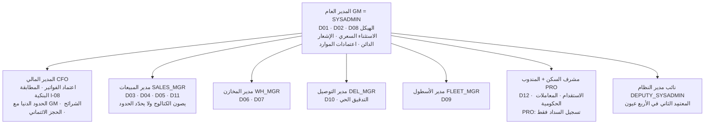

## 7-4 فصل المهام — الأزواج الأربعة

| # | الزوج | السبب | الحالة في القاعدة |
|---|---|---|---|
| 1 | **`(CFO, ACCOUNTANT)`** | معتمِد الفاتورة لا يسجّل السداد | ✅ مبذور |
| 2 | **`(SALES_MGR, CFO)`** | من يبيع لا يحدّد الحد الأدنى | ✅ مبذور |
| 3 | **`(WH_OP, WH_SUP)`** | الملتقط لا يدقّق التقاطه | ✅ مبذور |
| 4 | **`(PRO, CFO)`** | **المحصِّل لا يطابق الحسابات البنكية** | ✅ مبذور |

**الرقابة الخمس المحقَّقة بالمناصب القائمة (22 §2-2):**

| الرقابة | من يفعل | من يعتمد / يراقب | الفصل |
|---|---|---|---|
| **الأسعار** | `SALES_MGR` يصون الكتالوج | **`GM` + `CFO`** يحدّدان الحدود الدنيا والتكلفة المعيارية | البائع لا يحدّد حدّه |
| **الإيراد** | `PRO` يسجّل السداد بسلسلة `RCT` | **`CFO`** يعتمد الفاتورة **ويطابق البنك (I-08)** | المعتمِد ≠ المحصِّل |
| **التخفيض** | `CFO` يطلب | **`GM`** يعتمد الإشعار الدائن | تخفيض الإيراد بيد واحدة عليا |
| **الاستثناء السعري** | `SALES_MGR` يطلب · `CFO` يراجع | **`GM`** | ثلاث أعين على التزام طويل |
| **الجزاءات** | كل مسؤول على من يديره ضمن اللائحة | التظلّم للمستوى الأعلى · **الفصل `GM` وحده** | هرمي بلا مركزة |

**العهدتان النقديتان في يد المندوب `PRO`** ليستا خللاً بل ضبطاً: سلسلة **`RCT`** لسندات القبض **منفصلة عن** سلسلة **`GOV`** لعهدة الرسوم الحكومية، **و`CFO` يطابق التيارين كلاً على حدة**، ويثبّت ذلك الزوج `(PRO, CFO)`.

## 7-5 صلاحية الجزاء — هرمية تتبع `hr.employees.reports_to`

| المستوى | يوقّع على | الدرجات المتاحة | ما يخرج عن صلاحيته |
|---|---|---|---|
| قائد الفريق / المشرف | أفراد فريقه | **D1 تنبيه · D2 إنذار** | الخصم والفصل |
| مدير المخازن · مدير التوصيل | قادة الفرق والعمال والسائقون | **D1 · D2 · D3 خصم** | الفصل |
| مدير المبيعات · الأسطول · مشرف السكن | من يديرونهم | D1 · D2 · D3 | الفصل |
| **المدير العام** | الجميع | **D1 – D4 بما فيها الفصل** | — |

| الضابط | القاعدة |
|---|---|
| **اللائحة ثابتة — ٧٧ بنداً** | المسؤول يختار البند · **النظام يحسب الدرجة** من عدّاد ١٢ شهراً · **لا جزاء خارج اللائحة** |
| **الصلاحية تُشتق لا تُمنح** | من سلسلة `reports_to` — لا تُسنَد يدوياً |
| **موقّع خارج صلاحيته** | **يُعاد توجيهه لأعلى تلقائياً** ويُسجَّل `routed_to` — **لا يُرفض بصمت** |
| **إجراءات م.٣٧** | إلزامية مهما كان الموقّع — لا خصم بلا الخطوات الخمس |
| **التظلّم** | للمستوى الأعلى مباشرة من الموقّع · **لا يبتّ فيه من وقّعه** |
| **سقف م.٣٨** | ٥ أيام شهرياً على **مجموع** ما وقّعه كل المستويات |
| **المؤشر الحاكم** | مسؤول تُلغى **> ٣٠٪** من جزاءاته في التظلّم ⇒ **تُراجَع صلاحيته** |
| **حالة قانونية** | **بانر تحذير على كل جزاء حتى يُرفع علم اعتماد الهيئة (م.٣٦)** |

## 7-6 ما يتطلب المدير العام — القائمة الحصرية

| البند | لماذا | قابلية الضبط |
|---|---|---|
| **الإشعار الدائن** | تخفيض إيراد معتمد | **غير قابل للضبط — `GM` حصراً ولا يُؤتمت أبداً** |
| **الفصل (D4)** | مسؤولية قانونية — م.٤١ | **غير قابل للضبط** |
| **الاستثناء السعري** | التزام مالي طويل | `GM` يعتمد بسبب وصلاحية وتاريخ مراجعة |
| **عقد بهامش < ١٠٪** | عتبة `contract.gm_margin_pct` | قابل للضبط من العتبات |
| **شراء > ٢٬٠٠٠ د.ك** | عتبة `purchase.cfo_max` | قابل للضبط من العتبات |
| **إعفاء خصم السكن** | `HR_MGR` غير مشغول | `GM` **بسبب مسجَّل** |
| **جزاءات D4 والاستقدام** | اعتمادات الموارد البشرية | `GM` |
| **تعطيل قاعدة فصل مهام** | آخر خط دفاع | `GM` **بسبب مسجَّل** |
| **رفع سقف نداءات الذكاء الاصطناعي** | ضبط التكلفة | `GM` وحده · يُسجَّل |
| **إعلان L3 فقد بيانات** | إيقاف الكتابة والاسترجاع | `GM` **حصراً** |
| **إدخال الأسرار وكلمات المرور** | «لا يُدخلها أحد نيابة عنك» | `GM` بنفسه **+ إقرار معتمِد ثانٍ** |

## 7-7 الأربع عيون — أين تُفرض بالضبط

**الموافِق الثاني: `DEPUTY_SYSADMIN` أو `CFO`** — لأن `GM = SYSADMIN` في التوظيف الحالي (G-06 · EXEC §1.7). **فعّالة من اليوم الأول.**

| التغيير | يحتاج معتمِداً ثانياً |
|---|---|
| مصفوفة الصلاحيات `role_permissions` | ✅ |
| الأسرار ومفاتيح التكاملات (إدخال أو تدوير) | ✅ |
| قواعد فصل المهام `sod_rules` | ✅ |
| سلاسل الاعتماد `approval_chains` | ✅ |

**إجراءات `SYSADMIN` التي ينفّذها المدير العام تُعلَّم في سجل التدقيق وتُعرض في تقرير شهري.**

---

# 8. مؤشرات الأداء (KPI)

| المؤشر | التعريف الحسابي الدقيق | مصدر البيانات | الدورية | المالك | الهدف |
|---|---|---|---|---|---|
| **نسبة الأتمتة** | `count(automation_rules where level in ('A2','A3')) ÷ count(automation_rules where is_active)` | `platform.automation_rules.level` | شهري | `GM` | **≥ ٨٠٪** |
| **متوسط بنود الصندوق لكل دور يومياً** | `count(decisions where status='open') ÷ count(distinct assigned_role)` مقيساً يومياً | `platform.decisions` | يومي | `GM` | **≤ ٧** — وإن زاد شهرياً فالأتمتة تتراجع |
| **زمن بتّ القرار (وسيط)** | وسيط `decided_at − created_at` لبنود `status='decided'` بساعات العمل | `platform.decisions` | أسبوعي | `GM` | **≤ ٤ ساعات عمل** |
| **بنود منقضية بلا بتّ** | `count(decisions where status='expired')` في الشهر | `platform.decisions.status` | شهري | `GM` | **يحدده GM** — الاتجاه متناقص |
| **التنبيهات غير المعالجة** | `count(alert_log where acknowledged_at is null and fired_at < now() − rule.escalate_after_hours)` | `platform.alert_log` + `alert_rules` | يومي | مالك كل تنبيه | **صفر خارج نافذة التصعيد** |
| **معدّل تصعيد التنبيهات** | `count(alert_log where escalated_at is not null) ÷ count(alert_log)` شهرياً | `platform.alert_log` | شهري | `GM` | **يحدده GM** |
| **اكتمال المجال المرجعي** | لكل `D01…D12`: النسبة المحسوبة شهرياً في بطاقة الجودة | `platform.domain_quality_monthly.score_pct` مقابل `domain_owners.gate_target_pct` | شهري | مالك المجال | **≥ ٨٠٪** · **تحته شهرين ⇒ تصعيد للمدير العام باسم مالكه** |
| **حدث فوترة بلا سعر** | `count(billing.billable_events where status='pending')` بعمر > ٧ أيام | `billing.billable_events` | أسبوعي | `CFO` | **صفر** |
| **فواتير تصدر بلا تدخل بشري** | `count(invoices approved by engine) ÷ count(invoices approved)` | `billing.invoices` | شهري | `CFO` | **≥ ٩٠٪** |
| **عمليات تُنفَّذ بلا لمسة بشرية** | نسبة الأحداث المغلقة آلياً من مجموع الأحداث | `platform.outbox` + `automation_rules` | شهري | `GM` | **≥ ٦٥٪** |
| **انقطاعات سلسلة التدقيق** | عدد صفوف `platform.verify_audit_chain()` | `platform.audit_log` | شهري (مهمة مجدولة) | `SYSADMIN` | **صفر — الحارس G8** |
| **تغطية تصنيف الأعمدة** | نسبة أعمدة المخططات الأربعة عشر المسجَّلة في `column_classification` | `information_schema.columns` + `identity.column_classification` | عند كل هجرة | `SYSADMIN` | **١٠٠٪ — الحارس G6** |
| **تغطية RLS** | عدد الجداول التشغيلية بلا `relrowsecurity` | `pg_class` · `pg_namespace` | عند كل نشر | `SYSADMIN` | **صفر — الحارس G7 · متحقَّق فعلاً** |
| **زمن التتبّع الكامل** | زمن استجابة شاشة التتبّع لرقم واحد | قياس التشغيل | أسبوعي | `SYSADMIN` | **≤ ٢ ثانية — الحارس G17** |
| **نجاح اختبار الاسترجاع** | اختبار استرجاع فعلي في بيئة منفصلة + دوال الحرّاس تعيد صفراً | `restore.sh` + `guards.sql` | **شهري** | `SYSADMIN` | **١٠٠٪ نجاح — إلزامي** |
| **الوصول غير المستخدم** | `count(user_roles where revoked_at is null)` لمستخدمين بلا جلسة منذ ٩٠ يوماً | `identity.user_roles` + `sessions` | ربعي | `SYSADMIN` | **يحدده GM** — الاتجاه متناقص |
| **إنابات منتهية لم تُبطَل** | `count(delegations where valid_to < now())` وما زال أثرها في `audit_log.on_behalf_of` | `identity.delegations` | شهري | `SYSADMIN` | **صفر** |
| **نسبة إلغاء الجزاءات في التظلّم** | لكل موقّع: `count(cases cancelled on grievance) ÷ count(cases signed)` | `hr.disciplinary_cases` | شهري | `GM` | **> ٣٠٪ ⇒ تُراجَع صلاحية الموقّع** |
| **شاشات تُفتح في اليوم العادي** | عدد الشاشات المتميّزة المفتوحة يومياً | سجل الاستخدام | شهري | `GM` | **≤ ١٧ من ٥٧** |
| **الطابور اليدوي للتكاملات** | `count(integration_queue where status='pending')` وعمر أقدم صف | `platform.integration_queue` | يومي | مالك كل تكامل | **≤ ٢٠ سجلاً وعمر ≤ ٤٨ ساعة** |

---

# 9. التقارير والتنبيهات المرتبطة

## 9-1 سجل التنبيهات — اثنان وعشرون · `N-01…N-22`

**كل صفّ أدناه مبذور فعلاً في `platform.alert_rules` — عُدّ وتُحقِّق منه.**

| # | الشرط | المالك (الدور) | القناة | الجدولة | الكبح (س) | الهدوء | التصعيد | رابط الإجراء |
|---|---|---|---|---|---|---|---|---|
| **N-01** | وكيل iMile متوقف > ١٥ دقيقة | `DEL_MGR` | داخل التطبيق + واتساب | فوري | ٦٠ | **مستثنى** | بعد ١ س → `GM` | `/platform/integrations` |
| **N-02** | مشكلة تدقيق حي بلا بتّ > ٢٤ س | `DEL_MGR` | داخل التطبيق + بريد | يومي ٠٩:٠٠ | ٢٤ | تُطبَّق | بعد ٤٨ س → `GM` | `/imile/dtl` |
| **N-03** | فرق COD غير مسوّى | `CFO` + `DEL_MGR` | داخل التطبيق + واتساب | فوري | **٠ بلا كبح** | **مستثنى** | بعد ٤٨ س → `GM` | `/inbox?kind=cod_variance` |
| **N-04** | وثيقة موظف على سلّم **٩٠/٤٥/٣٠/١٥** يوماً | `GM` + `PRO` | داخل التطبيق + بريد | أسبوعي أحد ٠٨:٠٠ | ١٦٨ | تُطبَّق | ≤ ١٥ يوماً ⇒ يومي | `/hr/documents?expiring=90` |
| **N-05** | وثيقة مركبة على سلّم **٩٠/٤٥/٣٠/١٥** يوماً | `FLEET_MGR` | داخل التطبيق + بريد | أسبوعي أحد ٠٨:٠٠ | ١٦٨ | تُطبَّق | ≤ ٧ أيام ⇒ يومي | `/fleet/documents?expiring=90` |
| **N-06** | عقد عميل ينتهي خلال مدة الإشعار | `CFO` + `SALES_MGR` | داخل التطبيق + بريد | يومي ٠٨:٠٠ | ٠ | تُطبَّق | بعد ٣٦٠ س → `GM` | `/sales/contracts?ending=notice` |
| **N-07** | عميل بلغ **٨٠٪** من حده الائتماني | `CFO` | داخل التطبيق + بريد | يومي ٠٨:٠٠ | ٢٤ | تُطبَّق | التجاوز ⇒ **حجز آلي** + `GM` | `/billing/ar-aging` |
| **N-08** | حدث فوترة بلا سعر > ٧ أيام | `CFO` | داخل التطبيق + بريد | أسبوعي | ١٦٨ | تُطبَّق | بعد ٧٢٠ س → `GM` | `/billing/events?status=pending` |
| **N-09** | فاتورة متأخرة | `CFO` + `ACCOUNTANT` | داخل التطبيق + بريد | يومي ٠٨:٠٠ | ٢٤ | تُطبَّق | بعد ٧٢٠ س → `GM` | `/billing/invoices?overdue=1` |
| **N-10** | فاتورة شريك بفرق > **٢٪** | `CFO` | داخل التطبيق | فوري | **٠ بلا كبح** | تُطبَّق | بعد ١٦٨ س → `GM` | `/partners/invoices?variance=1` |
| **N-11** | تجاوز مساحة متعاقدة | `WH_MGR` + `SALES_MGR` | داخل التطبيق + بريد | يومي ٠٨:٠٠ | ٢٤ | تُطبَّق | بعد ٢١٦٠ س (٣ أشهر) → `GM` | `/wms/space` |
| **N-12** | حجز مساحة ينتهي خلال ٧ أيام | `SALES_MGR` | داخل التطبيق | يومي ٠٨:٠٠ | ٢٤ | تُطبَّق | — | `/wms/space/reservations` |
| **N-13** | فرق جرد بلا تفسير | `WH_MGR` | داخل التطبيق | فوري عند الإقفال | **٠ بلا كبح** | تُطبَّق | بعد ٢٤ س → `WH_MGR` + `GM` | `/wms/counts?variance=unexplained` |
| **N-14** | تذكرة تتجاوز **٨٠٪** من SLA | `CC_MGR` | داخل التطبيق | فوري | **٠ بلا كبح** | تُطبَّق | التجاوز → `GM` | `/cc/tickets?sla=at_risk` |
| **N-15** | معاملة حكومية متأخرة عن SLA | `PRO` | داخل التطبيق + بريد | يومي ٠٨:٠٠ | ٢٤ | تُطبَّق | +٥٠٪ → `GM` | `/admin/gov?overdue=1` |
| **N-16** | مزامنة البصمة فاشلة يومين | `SYSADMIN` | داخل التطبيق + واتساب | فوري | ٢٤ | تُطبَّق | بعد ٧٢ س → `GM` | `/platform/integrations` |
| **N-17** | طلب اعتماد بلا بتّ > مهلته | **المعتمِدون الستة**: `GM` `CFO` `WH_MGR` `DEL_MGR` `SALES_MGR` `FLEET_MGR` | داخل التطبيق + بريد | يومي ٠٨:٠٠ | ٢٤ | تُطبَّق | بعد ٢٤ س → `GM` | `/inbox?kind=approval` |
| **N-18** | مجال بيانات تحت هدفه شهرين | مالك المجال + `GM` | داخل التطبيق + بريد | شهري (١ من الشهر ٠٨:٠٠) | ٧٢٠ | تُطبَّق | — | `/platform/data-quality` |
| **N-19** ✳ | طابور المعالجة اليدوية > **٢٠ سجلاً** أو عمر > **٤٨ س** | `SYSADMIN` + `DEL_MGR` + `FLEET_MGR` + `CFO` | داخل التطبيق + بريد | فوري | ٦ | تُطبَّق | بعد ٧٢ س → `SYSADMIN` ثم `GM` | `/platform/integrations/queue` |
| **N-20** ✳ | رسائل واتساب مرتدّة > **٥٪** في ٢٤ س | `SYSADMIN` | داخل التطبيق + بريد | يومي ٠٩:٠٠ | ٢٤ | تُطبَّق | > ١٠٪ → `GM` | `/platform/integrations?code=I-05` |
| **N-21** ✳ | مطابقة بنكية غير مكتملة > **٧ أيام** | `CFO` | داخل التطبيق + بريد | يومي ٠٨:٠٠ | ٢٤ | تُطبَّق | بعد ١٦٨ س → `GM` | `/billing/bank-reconciliation` |
| **N-22** ✳ | تكامل بلا تشغيل ناجح **٢٤ ساعة** | `SYSADMIN` | داخل التطبيق + بريد | فوري | ١٢ | تُطبَّق | بعد ٤٨ س → `GM` | `/platform/integrations` |

✳ = مضاف في v4 من مؤشرات 23 §4 التي كانت بلا رمز.

**قاعدتان حاكمتان:** (١) **المستثنى من ساعات الهدوء تنبيهان فقط — N-01 و N-03.** (٢) «حريق» **ليس تنبيه نظام** ولا يقابله `alert_rules.code`؛ يُدار بإعلان الوضع اليدوي، **وإعلان الوضع اليدوي يرفع ساعات الهدوء عن نطاقه المعلَن آلياً**.

## 9-2 كتالوج التقارير — أربعة وعشرون · `R-01…R-24`

**القاعدة: لكل تقرير قرار يدعمه. تقرير لا يُذكر القرار الذي يدعمه — يُحذف.**

### تشغيلية — يومية

| الرمز | التقرير | المصدر | الجمهور | القرار الذي يخدمه |
|---|---|---|---|---|
| **R-01** | **الرسالة الصباحية** | `platform.decisions` + `tms` + `billing` | `GM` | **أولويات اليوم** |
| **R-02** | أوامر اليوم والمتأخر | `wms.outbound_orders` · `tms.delivery_tasks` | `WH_MGR` + `DEL_MGR` | إعادة توزيع الموارد |
| **R-03** | **مطابقة COD** | `tms.delivery_tasks` · `payment_attempts` · `billing.receipts` | `CFO` | **إقفال يوم السائق** |
| **R-04** | التدقيق الحي المعلّق | `imile.dtl_problems` | `DEL_MGR` | البتّ في ١٥ دقيقة |
| **R-05** | جرد iMile والفروق | `imile.daily_inventory` · `inventory_discrepancies` | `DEL_MGR` | تصعيد المفقود |
| **R-06** | حالة التكاملات | `platform.integration_runs` · `integration_queue` | `SYSADMIN` | تدخّل فني |
| **R-07** | عمولة السائقين أمس | `hr.commission_daily` | السائق + المشرف | **الاعتراض خلال ٤٨ ساعة** |

### تشغيلية — أسبوعية

| الرمز | التقرير | المصدر | الجمهور | القرار الذي يخدمه |
|---|---|---|---|---|
| **R-08** | إشغال المساحات والتجاوزات | `wms.space_dashboard` · `occupancy_snapshots` | `WH_MGR` + `SALES_MGR` | بيع أو تفاوض |
| **R-09** | الوثائق المنتهية والقريبة | `hr.employee_documents` · `tms.vehicle_documents` | `GM` + `FLEET_MGR` + `PRO` | جدولة التجديد |
| **R-10** | رسالة الطاقة لـ iMile | `imile.shipments_attributed` · `wms.warehouse_capacity` | `GM` | التفاوض على الحجم |
| **R-11** | أداء SLA لكل عقد | `sales.sla_results` · `contract_sla` | `WH_MGR` + `DEL_MGR` | معالجة قبل الشهر |
| **R-12** | **الراحات والاستثناءات لكل مشرف** | `hr.disciplinary_cases` · `platform.audit_log` | `GM` | **كشف المحاباة** |

### تجارية ومالية — شهرية

| الرمز | التقرير | المصدر | الجمهور | القرار الذي يخدمه |
|---|---|---|---|---|
| **R-13** | **الربحية لكل عميل وعقد** | `billing.profitability` · `cost_allocations` | `GM` + `CFO` | **إعادة تفاوض أو إنهاء** |
| **R-14** | **الإيراد الضائع** | `billing.billable_events` (`pending` · `exclusion_reason`) | `GM` + `CFO` | **إدراج بنود تعاقدية** |
| **R-15** | أعمار الذمم | `billing.invoices` · `receipt_allocations` | `CFO` | التحصيل والحجز |
| **R-16** | قائمة الدخل لكل كيان | `billing.journal_entries` · `journal_lines` · `gl_accounts` | `CFO` | إقفال الشهر واعتماد القيود **قبل التجميع** |
| **R-17** | **قائمة الدخل المجمّعة** بعد حذف البينية | `billing.journal_lines` (`is_intercompany`) | `GM` + الملّاك | صورة المجموعة |
| **R-18** | قمع المبيعات وأسباب الخسارة | `sales.opportunities` · `quotes` | `GM` + `SALES_MGR` | تعديل التسعير أو المنتج |
| **R-19** | تقييم الشركاء | `partners.partner_invoices` · `service_allocations` | `CFO` + `WH_MGR`/`DEL_MGR` | التجديد |
| **R-20** | **بطاقة جودة البيانات** | العرض `platform.mdm_scorecard` + `platform.domain_owners` + `domain_quality_monthly` | `GM` + مُلاك المجالات | **المساءلة** |
| **R-21** | حصيلة الجزاءات (م.٤٠) | `hr.disciplinary_cases` · `penalty_schedule` | `GM` + `CFO` | **متطلب قانوني** |
| **R-22** | تكلفة الاستقدام لكل موظف | العرض `hr.recruitment_cost_per_employee` فوق `hr.recruitment_costs` | `GM` + `CFO` | تقييم الدوران |

### ربعية

| الرمز | التقرير | المصدر | الجمهور | القرار الذي يخدمه |
|---|---|---|---|---|
| **R-23** | ربحية كل خدمة | `billing.profitability` · `catalog.services` | `GM` | تعديل الكتالوج |
| **R-24** | مراجعة الشرائح والترقيات | `catalog.segments` · `price_lists` · `price_exceptions` | `CFO` | تحديث الأسعار |

**قواعد التقارير:** المصدر **القاعدة مباشرة — لا يُبنى تقرير على تقرير** · كل رقم **قابل للنقر** للوصول لمصدره · الأرقام المالية مصنَّفة فلا تُرسل لمن لا يراها · **في Tier 0 لا نسخة قراءة**: التقارير تعمل على القاعدة الأساسية بـ`statement_timeout` خارج الذروة، والثقيلة منها (**R-13 · R-14 · R-17 · R-23**) تُجدول ليلاً في `pg-boss`.

## 9-3 طقس الإدارة — اليومي والأسبوعي والشهري

**مشتقّ حصراً من التقارير والتنبيهات المذكورة أعلاه — لا يُضاف إليه شيء غير موجود.**

### صباحاً — المدير العام

| الوقت | ماذا يرى | من أين |
|---|---|---|
| ٠٧:٠٠ | **الرسالة الصباحية** — أولويات اليوم | **R-01** |
| بعدها مباشرة | **صندوق القرارات** — بنوده مرتَّبة بالأثر المالي ثم الاستعجال | `/inbox` |
| نظرة | تنبيهات ليلية غير مُقرّة | `platform.alert_log` |

**معيار انتهاء الجلسة الصباحية: صندوق فارغ.** «صندوق فارغ = يومك منتهٍ».

### خلال اليوم — المدراء

| الدور | ما يراقبه | التقرير / التنبيه |
|---|---|---|
| `DEL_MGR` | التدقيق الحي المعلّق · جرد iMile · وكيل متوقف | **R-04 · R-05 · N-01 · N-02** |
| `WH_MGR` | أوامر اليوم والمتأخر · فرق جرد بلا تفسير | **R-02 · N-13** |
| `CFO` | مطابقة COD · فرق COD غير مسوّى · فاتورة شريك بفرق | **R-03 · N-03 · N-10** |
| `SYSADMIN` | حالة التكاملات · الطابور اليدوي | **R-06 · N-19 · N-22** |
| `CC_MGR` | تذاكر على حافة SLA | **N-14** |

### نهاية اليوم

| البند | الإجراء | المصدر |
|---|---|---|
| **إقفال يوم السائق** | مطابقة COD مكتملة | **R-03** |
| **صفر صف أحمر في لوحة التكاملات** | «صف واحد أحمر = يوم لا يُقفل» | **R-06** |
| عمولة الأمس منشورة | نافذة اعتراض ٤٨ ساعة مفتوحة | **R-07** |
| بنود قرار لم تُبتّ | تُرحَّل ويُقاس زمنها | `platform.decisions` |

### أسبوعياً

| البند | من | المصدر |
|---|---|---|
| **اجتماع البيانات — ١٥ دقيقة** | مُلاك المجالات الاثنا عشر | جدول واحد: النسب والمتعثّر منها |
| الوثائق المنتهية والقريبة | `GM` + `FLEET_MGR` + `PRO` | **R-09 · N-04 · N-05** |
| إشغال المساحات والتجاوزات | `WH_MGR` + `SALES_MGR` | **R-08 · N-11 · N-12** |
| أداء SLA لكل عقد | `WH_MGR` + `DEL_MGR` | **R-11** |
| **الراحات والاستثناءات لكل مشرف** | `GM` — **كشف المحاباة** | **R-12** |
| رسالة الطاقة لـ iMile | `GM` | **R-10** |

### شهرياً — الإقفال

| # | الخطوة | من | المصدر |
|---|---|---|---|
| 1 | اعتماد قيود كل كيان | `CFO` | **R-16** |
| 2 | التجميع بعد حذف المعاملات البينية | `CFO` → `GM` | **R-17** |
| 3 | الربحية لكل عميل وعقد | `GM` + `CFO` | **R-13** |
| 4 | **الإيراد الضائع** | `GM` + `CFO` | **R-14** |
| 5 | أعمار الذمم وخطة التحصيل | `CFO` | **R-15 · N-09** |
| 6 | **بطاقة جودة البيانات** — نسبة لكل مجال | `GM` + مُلاك المجالات | **R-20 · N-18** |
| 7 | حصيلة الجزاءات ونسبة الإلغاء في التظلّم | `GM` + `CFO` | **R-21** |
| 8 | تكلفة الاستقدام لكل موظف | `GM` + `CFO` | **R-22** |
| 9 | قمع المبيعات وأسباب الخسارة | `GM` + `SALES_MGR` | **R-18** |
| 10 | تقييم الشركاء | `CFO` | **R-19** |
| 11 | **التحقق من سلسلة التدقيق** | `SYSADMIN` | `verify_audit_chain()` — **G8** |
| 12 | **اختبار استرجاع فعلي** | `SYSADMIN` | `restore.sh` + الحرّاس |
| 13 | تقرير إجراءات `SYSADMIN` التي نفّذها `GM` | `DEPUTY_SYSADMIN` | `audit_log` |

### ربعياً

| البند | من | المصدر |
|---|---|---|
| ربحية كل خدمة | `GM` | **R-23** |
| مراجعة الشرائح والترقيات | `CFO` | **R-24** |
| **تمرين الوضع اليدوي — ساعتان** | كل الإدارات | 26 §6 |
| تعطّل وكيل iMile — تمرين | `DEL_MGR` | 26 §6 |
| مراجعة الوصول غير المستخدم | `SYSADMIN` | `user_roles` + `sessions` |

---

# 10. الشاشات

| الشاشة | المسار | الدور | الغرض |
|---|---|---|---|
| **صندوق القرارات** | `/inbox` | **كل دور** — الصفحة الرئيسية | البتّ المباشر في البنود المرشَّحة بـ`assigned_role`؛ البند يختفي فور البتّ |
| صندوق الاعتمادات | `/inbox?kind=approval` | المعتمِدون الستة | البتّ في طلبات الاعتماد المنقضية أو المعلّقة |
| صندوق فروق التحصيل | `/inbox?kind=cod_variance` | `CFO` + `DEL_MGR` | تسوية فرق COD — غير خاضع لساعات الهدوء |
| **لوحة التكاملات** | `/platform/integrations` | `SYSADMIN` + مُلاك التكاملات | صف لكل تكامل: آخر تشغيل ناجح · السجلات · الفشل · الطابور · المالك |
| **الطابور اليدوي** | `/platform/integrations/queue` | مالك التكامل | معالجة السجلات التي فشلت وتحتاج بشراً |
| **بطاقة جودة البيانات** | `/platform/data-quality` | `GM` + مُلاك المجالات | نسبة اكتمال كل مجال `D01…D12` مقابل هدفه |
| **محرّر الهيكل** | الإعدادات — الهيكل | `SYSADMIN` · `GM` | الأدوار · مصفوفة الصلاحيات · ملكية المجالات · سلاسل الاعتماد · الإنابة · قواعد فصل المهام — **كلها بيانات تُعدَّل بلا نشر** |
| **شاشة العتبات وأعلام الميزات** | الإعدادات | `GM` · `SYSADMIN` | تعديل الحدود الأربعة والأربعين وإطفاء الخصائص |
| **شاشة قواعد الأتمتة** | الإعدادات | `GM` | مستوى الأتمتة لكل عملية وشروطها ومالكها |
| **شاشة التتبّع الموحّدة** | `Ctrl+K` من أي شاشة | بحسب `31 §10` | رقم واحد يدخل — خط زمني كامل يخرج في ≤ ٢ ثانية |
| **تبويب التدقيق** | آخر تبويب في كل شاشة نمط **ملف** | مالك السجل | من غيّر ماذا ومتى وبأي قيمة سابقة |
| **لوحة المدير العام** | لوحات المؤشرات (١ من ٤) | `GM` | المؤشرات التنفيذية |
| **لوحة المالي** | لوحات المؤشرات (٢ من ٤) | `CFO` | الذمم · الربحية · التحصيل |
| **لوحة العمليات** | لوحات المؤشرات (٣ من ٤) | `WH_MGR` + `DEL_MGR` | التشغيل اليومي |
| **لوحة الملّاك** | لوحات المؤشرات (٤ من ٤) | `OWNER` | **مؤشرات وهوامش — بلا رواتب ولا بيانات موظف بعينه** |
| **تطبيق القرارات — القرارات** | تطبيق `Premium Decisions` | المدراء | البتّ من الإشعار **بلا فتح التطبيق** |
| **تطبيق القرارات — المؤشرات** | نفسه | المدراء | **ست بطاقات مؤشر لكل دور** |
| **تطبيق القرارات — البحث والتتبّع** | نفسه | المدراء | التتبّع من الجوال |
| **شاشة التدقيق الحي** | `/imile/dtl` | `DEL_MGR` | البتّ في مشاكل التدقيق — `reject` بشري دائماً |
| **شاشة المطابقة البنكية** | `/billing/bank-reconciliation` | `CFO` | المطابقة اليومية — ملكية I-08 |

**مكوّن الحالة الفارغة إلزامي في كل شاشة** ويُسمّي **البيانات الناقصة ومالكها** (40 §D1).

---

# 11. الجداول

## 11-1 مخطط `platform` — ٢٦ جدولاً

| الجدول | الوصف |
|---|---|
| `platform.entities` | **الكيانات القانونية.** القابضة جذر الشجرة وتحمل التكاليف المشتركة والعقود الإطارية فقط؛ الكيانات التشغيلية وحدها تُصدر فواتير العملاء *(تعليق القاعدة)* |
| `platform.settings` | الإعداد **غير العددي** — وضع أو مزوّد أو علم، بصيغة `jsonb` مع `data_type` |
| `platform.thresholds` | **الحدود العددية التي يحرّرها المدير العام بلا نشر. الإعداد غير العددي في `platform.settings` — ق-3** *(تعليق القاعدة)* |
| `platform.feature_flags` | أعلام الميزات: تفعيل · نسبة طرح · أدوار · **مفتاح إيقاف** · من غيّر ومتى |
| `platform.automation_rules` | قاعدة الأتمتة لكل عملية: المستوى `A0…A3` · شرط الآلي · شرط الاستثناء · أدوار التصعيد · مفتاح العتبة · المالك. **✅ `chk_automation_rules_level` مفروض في القاعدة (SCH-4)** · **٩ صفوف مبذورة** (النقاط البشرية) و**الأربعون `A2`/`A3` لم تُبذر** |
| `platform.decisions` | **صندوق القرارات** — البند وحالته وأثره المالي ودوره المسنَد ومهلته وقراره |
| `platform.approval_chains` | سلاسل الاعتماد: نوع الطلب · رقم الخطوة · دور المعتمِد · الحدّان · حد الاعتماد الآلي |
| `platform.domain_owners` | ملكية المجالات `D01…D12`: دور المالك · دور المعتمِد · نسبة البوابة |
| `platform.domain_quality_monthly` | **بطاقة جودة البيانات الشهرية لكل مجال `D01–D12` — مصدر التنبيه N-18 وتقرير R-20** *(تعليق القاعدة)* |
| `platform.alert_rules` | **٢٢ قاعدة تنبيه** — الاستعلام المصدر · الأدوار · القنوات · الجدولة · الكبح · الهدوء · التصعيد · **رابط الإجراء** · الإيقاف بسبب ومدة |
| `platform.alert_log` | سجل إطلاق التنبيهات: المستقبِلون · القناة · الإقرار · التصعيد · الإقفال |
| `platform.notifications` | الإشعارات المرسَلة وحالة تسليمها `sent · delivered · bounced · failed` |
| `platform.audit_log` | **سجل التدقيق المجزّأ شهرياً** بسلسلة تجزئة SHA-256 والأعمدة الإحدى عشرة — المفتاح `(id, occurred_at)` · `UPDATE`/`DELETE` ممنوعان |
| `platform.audit_log_2026_09` … `_2026_12` | الأقسام الشهرية المُنشأة مسبقاً |
| `platform.audit_log_default` | **القسم الافتراضي — شبكة أمان.** أي صف فيه يعني أن المهمة الشهرية لم تعمل |
| `platform.outbox` | **صندوق صادر معامَلاتي. يُكتب في نفس معاملة تغيير الحالة؛ ناقل ينشر كل ثانية. يحل محل `platform.domain_events` (ق-2)** *(تعليق القاعدة)* |
| `platform.counters` | **١٥٠ عدّاداً** لسلاسل الترقيم لكل (كيان، نوع مستند) — الترقيم ذرّي بـ`next_doc_no`. **+٤٠ عدّاداً في SCH-4 ق-20:** ثماني سلاسل جديدة × خمسة كيانات — `MNT` · `ACC` · `RCR` · `DSC` · `HMR` · `HIN` · `DOC` · `NCR` |
| `platform.document_templates` | قوالب المستندات: HTML ثنائي اللغة · الترويسة والتذييل من الكيان |
| `platform.document_bindings` | **لا تبويب نماذج. كل مستند مربوط بعملية وانتقال حالة يولّده تلقائياً** *(تعليق القاعدة)* |
| `platform.documents` | المستند المُولَّد: رقمه · نسخته · بياناته المجمَّدة · ملفه · بصمته · الحجز القانوني ومدة الحفظ |
| `platform.integration_config` | **عقد التكامل وسياسته** — صف ثابت لكل تكامل من `I-01…I-11` بالحقول التسعة |
| `platform.integration_queue` | **الطابور اليدوي** — السجل الذي فشل ويحتاج بشراً · مصدر التنبيه N-19 |
| `platform.integration_runs` | **سجل التشغيل** — كل تشغيلة بنتيجتها وعدد سجلاتها وزمنها · مصدر N-01 و N-22 |

## 11-2 مخطط `identity` — ١١ جدولاً

| الجدول | الوصف |
|---|---|
| `identity.users` | المستخدمون: داخلي · عميل · وكيل — **بلا كلمة مرور مخزَّنة على الخادم** |
| `identity.roles` | **٢٦ دوراً** بأكوادها ونطاق بياناتها |
| `identity.permissions` | الصلاحيات بصيغة `module.object.action` |
| `identity.role_permissions` | مصفوفة الصلاحيات — تُحرَّر مرئياً من محرّر الهيكل |
| `identity.user_roles` | إسناد الدور للمستخدم — **قابل للإبطال**؛ مشغّل فصل المهام يعمل على الإدراج والتحديث معاً |
| `identity.user_entities` | نطاق الكيانات لكل مستخدم |
| `identity.sessions` | الجلسات القابلة للإبطال — **تُبطَل فور تغيير الدور** |
| `identity.otp_codes` | رموز الدخول لمرة واحدة: ٦ أرقام · ٥ دقائق · استخدام واحد |
| `identity.delegations` | **الإنابة لا تتجاوز فصل المهام أبداً (ADR-16c)** *(تعليق القاعدة)* · قيد `bounded` يحصرها في ٩٠ يوماً |
| `identity.sod_rules` | **أربعة أزواج** لا تجتمع في شخص · `unique (role_a, role_b)` · التعطيل يتطلب `GM` وسبباً |
| `identity.column_classification` | تصنيف كل عمود: `public · personal · payroll · commercial · secret` — **الحارس G6 يمنع النشر إن بقي عمود بلا تصنيف** |

## 11-3 جداول حوكمية في مخططات أخرى

| الجدول | المخطط | الدور الحوكمي |
|---|---|---|
| `admin.approval_requests` · `admin.approval_steps` | `admin` | تنفيذ سلاسل الاعتماد — `requester_id <> approver_id` |
| `hr.penalty_schedule` | `hr` | **لائحة الجزاءات — ٧٧ بنداً مبذورة** · `is_fraud` يغذّي ADR-28 *(تعليق القاعدة: البنود نفسها في وثيقة 15، بيانات مرجعية لا DDL)* |
| `hr.disciplinary_cases` | `hr` | الجزاءات الموقَّعة · إعادة التوجيه لأعلى · التظلّم |
| `imile.dtl_rule_autonomy` | `imile` | **الاستقلالية تُكتسب لكل (نوع مشكلة × نوع قرار). `reject` لا يُؤتمت أبداً. العتبات في `platform.thresholds` تحت `dtl.*`** *(تعليق القاعدة)* |
| `imile.dispatch_autonomy` | `imile` | استقلالية اعتماد خطة التوزيع — المستوى ٠ أو ١ |
| `imile.driver_trust` | `imile` | **الاحتفاظ ٢٤ شهراً. لا يُعرض للسائق كقيمة مركّبة أبداً، ولا يُربط بأجر ولا بجزاء** *(تعليق القاعدة)* |
| `wms.stock_movements` | `wms` | **دفتر لا يُعدَّل. التصحيح بحركة تسوية مقابلة فقط** *(تعليق القاعدة)* |
| `tms.proof_of_delivery` | `tms` | يحمل `legal_hold` و`retain_until` و`sha256` — حاجز سياسة الصور |

## 11-4 العروض الحوكمية الموجودة في القاعدة

**القاعدة تحمل أحد عشر عرضاً (`VIEW`) خارج الجداول الـ١٦٩ (بعد SCH-4)؛ أربعة منها حوكمية بحتة — وقد تحقَّق وجودها فعلاً:**

| العرض | الدور الحوكمي |
|---|---|
| **`platform.mdm_scorecard`** | **بطاقة جودة البيانات المرجعية** — نسبة اكتمال لكل مجال: العملاء · الخدمات · الأصناف · المواقع · وثائق الموظفين · وثائق المركبات. **مصدر تقرير R-20 والتنبيه N-18** |
| **`identity.unclassified_columns`** | كل عمود في المخططات التشغيلية **بلا تصنيف حساسية** — الاستعلام الذي يقف خلف الحارس **G6** وبوابة النشر |
| `sales.possible_duplicates` | كشف تكرار السجلات المرجعية للعملاء — أداة 22 §5 |
| `hr.recruitment_cost_per_employee` | تكلفة الاستقدام لكل موظف — مصدر **R-22** |

> عروض أخرى تخدم نطاقات محدَّدة: `wms.space_dashboard` (R-08) · `wms.warehouse_capacity` و`imile.shipments_attributed` (R-10) · `partners.resale_margin` (R-19) · `imile.driver_id_dashboard` · `housing.capacity_overview` · **`hr.employees_basic`** (أُضيف في SCH-4 لقيد `HOUSING_SUP` على ثلاثة أعمدة).

## 11-5 مخطط `governance` — **M13 · أربعة عشر جدولاً** ✅

**الحالة:** كان `governance` **معلَناً في العقد وغير مُنفَّذ في المخطط** — يسمّيه الحارسان G6/G7 ضمن المخططات الأربعة عشر وعدّ جداوله صفر (الفجوة **GC-01**). **أُغلق في `13B` بـSCR ق-27:** المخطط مُنشأ الآن بأربعة عشر جدولاً **بالأسماء المنصوصة في 36 §6-2 و40 §C9**، بأعمدة من نصّهما، وRLS على كل جدول، وقيود حالة، وسلسلة ترقيم `NCR`.

**قاعدتان حاكمتان في البناء:**
1. **لم يُنشأ جدول خارج القائمة.** «حزمة الملّاك» في 36 §6-2 **ليست جدولاً**: 40 §C9 يقول «board pack **generated from** reports R-13…R-24» — أي مخرَج تقارير لا كيان مخزَّن.
2. **`governance.decisions` غير `platform.decisions`.** الأول **سجل حوكمة دائم** بقرارات الشركة ومسوّغاتها ومَن نسخ مَن؛ والثاني **صندوق قرارات التشغيل اليومي** الذي يختفي بنده بالبتّ (40 §B5). الخلط بينهما يُفقد سجل القرارات دوامه.

| الجدول | الغرض (36 §6-2 · 40 §C9) | أعمدة الحالة والقيود المفروضة | RLS |
|---|---|---|---|
| `budgets` | الموازنة السنوية لكل **(كيان × سنة مالية × مركز تكلفة)** ومَن اعتمدها ومتى | `status ∈ draft · approved · locked · closed` (`chk_budgets_status`) | `entity_scope` |
| `budget_lines` | بند الموازنة بالحساب والشهر — **الانحراف مولَّد قيمةً ونسبةً** | لا عمود حالة · `variance_amount = actual − planned` **مولَّد** · `variance_pct` **مولَّد** بـ`null` عند مقام صفر | `internal_only` |
| `kpis` | **شجرة المؤشرات** بثلاثة مستويات `group → entity → module` مع `parent_id` و`source_query` | `level ∈ group · entity · module` (`chk_kpis_level`) · `direction ∈ higher_better · lower_better` (`chk_kpis_direction`) · `is_active` | `entity_scope` |
| `kpi_targets` | الهدف المعتمد لكل مؤشر لكل فترة — ومَن وضعه ومتى | لا عمود حالة · المدى `period_start`/`period_end` | `internal_only` |
| `kpi_actuals` | الفعلي المقيس لكل مؤشر لكل فترة | لا عمود حالة · `period` + `measured_at` | `internal_only` |
| `objectives` | **الأهداف الربعية (OKR)** لكل كيان بمالكها بالدور | `status ∈ draft · active · achieved · missed · cancelled` (`chk_objectives_status`) | `entity_scope` |
| `key_results` | النتائج الرئيسية للهدف، مربوطة اختيارياً بمؤشر — **التقدّم مولَّد** | لا عمود حالة · `progress_pct` **مولَّد** من `baseline → current → target`، محصور بين 0 و100 و`null` عند تساوي الأساس بالهدف | `internal_only` |
| `risks` | **سجل المخاطر** بفئته ومعالجته ومالكه — **الدرجة مولَّدة** | `status ∈ open · mitigating · accepted · closed` · `category ∈ operational · financial · legal · safety · technology · commercial` · `chk_risks_scale`: `likelihood` و`impact` كلٌّ **1…5** · `score = likelihood × impact` **مولَّد** | `entity_scope` |
| `risk_reviews` | المراجعة الدورية للمخاطرة: مَن راجع ومتى، والاحتمال والأثر المُعاد تقييمهما، وموعد المراجعة التالية | لا عمود حالة · `next_review_date` هو محرّك التنبيه | `internal_only` |
| `ncr` | **تقرير عدم المطابقة** — المصدر والوصف والتحقيق والسبب الجذري ومَن رفعه ومالكه | `status ∈ open · investigating · action_pending · verifying · closed` (`chk_ncr_status`) · **`doc_no` من سلسلة `NCR`** (`<كيان>-NC-`) المبذورة في SCH-4 ق-20 | `entity_scope` |
| `corrective_actions` | **الإجراء التصحيحي** المرتبط بـ`ncr` بمالكه وموعده ومَن تحقّق منه | `status ∈ open · in_progress · done · verified · cancelled` · `verified_by` + `verification_note` — **التحقق خطوة مستقلة عن الإنجاز** | `internal_only` |
| `policies` | **سجل السياسات** بنسختها وتاريخ نفاذها ومَن اعتمدها، و`requires_ack_roles` الأدوار المُلزَمة بالإقرار | لا `status` — الحالة بـ`is_active` + `effective_from` · `version` | `internal_only` |
| `policy_acknowledgements` | **إقرار الاطلاع** لكل (سياسة × مستخدم) بزمنه و`ip_address` — هو الدليل على م.35 وما شابهها | لا عمود حالة · الإقرار حدث لا دورة | `internal_only` |
| `decisions` | **سجل القرارات المركزي الدائم**: الكود والعنوان ونصّ القرار ومسوّغه ومَن قرّره ومتى والمصدر، و`supersedes_id` لسلسلة النسخ | `status ∈ active · superseded · revoked` (`chk_gov_decisions_status`) — **لا `open`**: القرار يُسجَّل بعد البتّ لا قبله | `internal_only` |

> **الأعمدة غير المنصوصة معلَّمة `-- v4 (استنباط)` واحداً واحداً** في `13B`: دورات الحالة · `score` · `progress_pct` · `source_query` · `direction` · `unit` · `ip_address` · `supersedes_id`. ما لا نصّ له مذكور كاستنباط لا كأصل.

**ما يفتحه هذا الإغلاق:** الموازنة والانحراف (R-14) · شجرة المؤشرات وأهدافها وفعلياتها · OKR الربعي · سجل المخاطر ومراجعاتها · دورة NCR والإجراء التصحيحي · سجل السياسات وإقراراتها · سجل القرارات الدائم — **كلها صارت قابلة للبناء في المرحلة ٥**.

**ما يبقى — ↷ مهمة WBS لا فجوة مخطط:** الجداول الأربعة عشر **منشأة وفارغة** (صفر صف في كلٍّ منها). الموازنات والمؤشرات والمخاطر والسياسات **بيانات إدارية يضعها `GM` ومُلاك المجالات**، لا DDL — وبذرها بند في موجة ٥. والحارس **G6** يعدّ الآن **+134 عمود حوكمة** ضمن غير المصنَّف (2,270).

---

# 12. سيناريوهات القبول المغطاة

| الرمز | السيناريو | البند الحوكمي الذي يثبته |
|---|---|---|
| **S1** | عميل 3PL كامل | **بند قرار `quarantine_decision`** يُولَّد لجهة اتصال العميل خلال ٤٨ ساعة — الاستثناء يصير قراراً لا رسالة |
| **S8** | عميل متعثّر | **الحجز الائتماني آلي وأثره في كل الكيانات**: الفوترة تستمر والأوامر الجديدة تُرفض |
| **S9** | عميل متعدد الكيانات من فرصة إلى عقود | **بند قرار `partner_or_decline`** لـ`GM` · تحذير هامش ١٢٪ مقابل عتبة `contract.min_margin_pct = 15` |
| **S10** | الاستثناء السعري | **الحدّ الأدنى مفروض على مسارات الكتابة الثلاثة** (واجهة · API · استيراد) · اعتماد `GM` بسبب وصلاحية وتاريخ مراجعة · `price_source = exception` في الفاتورة |
| **S13** | الاستقدام من الخارج | **لا مرحلة بلا مالك** · `sla_days = 7` · **التصعيد لـ`GM` في اليوم ١١** باسم المالك (`recruitment.escalate_days`) |
| **S14** | شراء ٢٠ جهاز PDA | **المطابقة الثلاثية تحجز الدفع**: أمر ٢٠ واستلام ١٨ وفاتورة ٢٠ ⇒ `three_way_matched = false` |
| **S15** | إنهاء خدمة سائق | **إخلاء الطرف حاجز صلب**: إسناد المعرّف يُقفل آلياً، ولا إخلاء قبل إعادة الجهاز وتسوية السلفة |
| **S16** | إيقاف معرّف وإعادة إسناده | **إيقاف بسبب سلوكي لا يُعاد إسناده** — يُرفض ويُولَّد بند قرار `return_to_imile` |
| **S17** | تجديد إقامات بالجملة | **لكل نقص مهمة بمالك وتاريخ استحقاق** — لا نقص بلا مسؤول |
| **S20** | نزاع فاتورة شريك | **تفاوت > ٢٪** (`partner.match_tolerance_pct`) ⇒ `variance_review` **وتجميد الدفع** |

**الحارس G15 يشترط ٢٠/٢٠ من `S1…S20` قبل أي نشر إنتاجي.** العشرة أعلاه هي ما يلمس هذا النطاق مباشرة؛ الباقي في وثائق النطاقات المعنية.

---

# 13. فجوات مرصودة وقرارات مطلوبة

> **الحالة بعد SCH-4** هي العمود الحاكم. البند لا يُحذف بعد إغلاقه — يبقى بنصّه الأصلي ليُقرأ تاريخه. الرموز: **✅ أُغلق في 13B** · **⏳ قرار GM** · **↷ مهمة WBS** · **✗ بلا نص يغطيه**. السجل الموحّد لكل ما بقي مفتوحاً في **`09-Gap-Register.md`**.

| # | الفجوة (كما رُصدت) | التفصيل | الحالة السابقة | الأثر | **الحالة بعد SCH-4** |
|---|---|---|---|---|---|
| **GC-01** | **مخطط `governance` غير موجود — M13 غير مبنيّ** | 36 §6-2 و40 §C9 يعرّفان `budgets` · `budget_lines` · `kpis` · `kpi_targets` · `kpi_actuals` · `objectives` · `key_results` · `risks` · `risk_reviews` · `ncr` · `corrective_actions` · `policies` · `policy_acknowledgements` · `decisions`. **عدّ الجداول الفعلي: صفر** — والحارسان G6/G7 يسمّيان `governance` ضمن المخططات الأربعة عشر | **فجوة مخطط حقيقية** — تُرفع بـSCR تحت G-01 | **الموازنة والانحراف · شجرة المؤشرات · OKR · سجل المخاطر · سجل السياسات · حزمة الملّاك — كلها غير قابلة للبناء في المرحلة ٥** | **✅ أُغلق في 13B (ق-27)** · المخطط مُنشأ بـ**١٤ جدولاً** بالأسماء المنصوصة، بأعمدة من نصّ 36/40 وRLS على كلٍّ وقيود حالة وسلسلة `NCR`. **التفصيل الكامل في §11-5 من هذه الوثيقة.** ولم يُنشأ جدول خارج القائمة: «حزمة الملّاك» مخرَج تقارير لا كيان. **↷ يبقى:** الأربعة عشر **فارغة** — بذرها بيانات إدارية في موجة ٥ |
| **GC-02** | **`platform.automation_rules` فارغ** | صفر صف — بينما 29 §5 يصنّف **٤٩ عملية** بمستوياتها، و40 §B5 ينصّ: «This table — not prose — carries the automation level of every process» | **بذر ناقص** — مهمة WBS 0.10 | **لا مستوى أتمتة معلن لأي عملية** · مؤشر «نسبة الأتمتة» غير قابل للحساب | **✅ جزئياً (ق-32)** · **٩ صفوف** `AR-H01…AR-H09` — كل النقاط البشرية بالاسم بمستوى `A1`. **↷ يبقى (WBS 0.10):** **الأربعون عملية `A2`/`A3`** من الـ٤٩ غير مبذورة ⇒ **مؤشر «نسبة الأتمتة» لا يزال غير قابل للحساب** (Gap-Register #27) |
| **GC-03** | **الستّ الحكمية في 29 §5-5 خارج التصنيف** | ست عمليات بشرية عمداً (الاستثناء السعري · الإشعار الدائن · التدقيق الحي المتنازع عليه · إسناد سائق لمنطقة حساسة · اعتماد مسير الرواتب · التفاوض مع iMile) **غير مدرجة في §5-1…§5-4**، فلن تُبذر في `automation_rules` | **مرصود في 29 نفسه** بإجراء مطلوب: تُدرَج بمستوى **A1** صراحةً بأسمائها الستة | ست نقاط قرار بشرية بلا قاعدة تحكمها | **✅ أُغلق في 13B (ق-32)** بذراً. **⏳ فارق يحتاج إقرار GM:** 29 §5-5 يسرد **تسعاً** لا ستّاً — بُذرت التسع بأسمائها؛ و**رفع الحجز الائتماني بُذر `A1`** بينما 01 §10-3 و29 §5-4 يصنّفانه **`A0`**. القيمة في القاعدة هي الحاكمة تشغيلياً حتى الإقرار |
| **GC-04** | **`platform.domain_owners` فارغ** | صفر صف — بينما مهمة WBS 0.1 مُعلَنة «✅ Done — all domains owned by filled positions»، والملكية موثّقة نصّاً في 22 §2 | **تناقض بين الإعلان والقاعدة** | **`gate_target_pct` غير موجود ⇒ P9 غير قابل للفرض آلياً** · التنبيه **N-18** وتقرير **R-20** بلا مصدر | **✅ أُغلق في 13B (ق-30)** · **١٢ صفاً** `D01…D12` بمالك و`gate_target_pct` — فـP9 صار قابلاً للفرض آلياً، وN-18 وR-20 لهما مصدر. **⏳ يبقى:** ملكية `D03·D04·D05·D11` بُذرت `CFO` (تعارض 22 §2 مع §2-1) · **↷ وتسمية شاغل بالاسم** (22 §2-1) |
| **GC-05** | **`platform.approval_chains` فارغ** | صفر صف — بينما مستويات الشراء الأربعة محسومة رقمياً في `thresholds` | **بذر ناقص** — مهمة 0.17 | سلسلة الاعتماد غير قابلة للقراءة آلياً؛ التنبيه **N-17** بلا `approval_chains` يقرأ منها المعتمِد | **✅ أُغلق في 13B (ق-31)** · **٨ صفوف**: شراء ٣ مستويات · فاتورة مستويان · إشعار دائن · جزاء · استثناء سعري — فـN-17 صار يقرأ «المستوى الأعلى» من الجدول. **⏳ يبقى:** «مدير القسم الطالب» في R-04 غير قابل للاشتقاق من `approver_role` المفرد؛ بُذر `WH_MGR` كقيمة قابلة للاستبدال |
| **GC-06** | **`identity.column_classification` فارغ** | صفر صف — والحارس **G6** يشترط تغطية **١٠٠٪** لأعمدة `01/13/13B/019` وإلا **فشل النشر** | **حاجز نشر قائم** — مهمة 0.16 | **النشر محجوب حتى تُصنَّف كل الأعمدة** · و`sanitize_audit()` بلا تصنيف **يخزّن القيم كاملة** فيعود التدقيق طريقاً التفافياً لقراءة الرواتب | **↷ مهمة WBS 0.16 — حاجز نشر قائم** · لا يزال **٠ صف**، و**G6 = 2,270 عموداً غير مصنَّف** بعد إضافة ١٣٤ عمود حوكمة. `sanitize_audit()` بلا تصنيف يخزّن القيم كاملة — الحاجز كما وُصف |
| **GC-07** | **`platform.feature_flags` و`integration_config` و`document_templates` و`document_bindings` فارغة** | صفر صف لكلٍّ — بينما 23 يحدّد **١١ تكاملاً** بالاسم و40 §B4 يوجب ربط كل مستند بانتقال حالته | **بذر ناقص** — مهام 0.10 · 0.15 · 5.13 | لوحة التكاملات والتنبيه **N-22** بلا بيانات · محرّك الوثائق بلا قالب ولا ربط | **↷ مهام WBS 0.10 · 0.15 · 5.13** · الأربعة لا تزال **٠ صف**. لوحة التكاملات وN-22 بلا بيانات، ومحرّك الوثائق بلا قالب ولا ربط — **قوالب Handlebars وعقود التكامل بيانات لا DDL** |
| **GC-08** | **تعارض ثلاثي في قائمة حالات `platform.decisions`** | القاعدة تسمح بخمس: `open · decided · expired · cancelled · auto_resolved` · `_changelog/STATE-REGISTER.md` يسرد أربعاً بلا `auto_resolved` · 29 §7 و40 §B5 يسردان أربعاً بلا `cancelled` | **تعارض وثائقي — القاعدة هي الاتحاد** | لا أثر تشغيلي؛ لكن **STATE-REGISTER ليس مطابقاً للقيد المُطبَّق** — يحتاج تحديثاً | **↷ مهمة WBS (تصحيح وثائقي)** · القاعدة لا تزال الاتحاد بخمس حالات؛ `STATE-REGISTER.md` و29 §7 و40 §B5 يحتاجان تحديثاً — خارج نطاق 13B (SCH-4 §3-4). **ملاحظة تمييز:** هذا عن `platform.decisions`؛ و`governance.decisions` الجديد له دورته الخاصة (`active · superseded · revoked`) |
| **GC-09** | **`automation_rules.level` بلا قيد `check` في القاعدة** | العمود `char(2)` بتعليق `A0 · A1 · A2 · A3` لكن **لا `check` constraint** — بينما كل عمود حالة آخر في الحزمة مقيَّد | **فجوة قيد** — تُرفع بـSCR | قيمة خارج السلّم الأربعة تدخل بلا رفض | **✅ أُغلق في 13B** · `chk_automation_rules_level` مفروض على العمود: `A0 · A1 · A2 · A3` — فلم تعد قيمة خارج السلّم تدخل بلا رفض |
| **GC-10** | **22 §7 يقول إن `platform.mdm_scorecard` غير معرَّف — والقاعدة تحمله فعلاً** | الوثيقة 22 §7 تنصّ صراحةً: «العرض `platform.mdm_scorecard` **غير معرَّف في `01/13/13B/019`** حتى الآن». **والتحقق المباشر يعيده موجوداً كـ`VIEW` منفَّذ بنفس تعريف 22 §7 حرفياً** | **تحفّظ وثائقي لاغٍ — يُحذف من 22** | لا أثر تشغيلي؛ **R-20 له مصدر تنفيذي بالفعل**. الفجوة الحقيقية الباقية هي `domain_owners` الفارغ (GC-04) لا العرض | **↷ مهمة WBS (تصحيح وثائقي)** · العرض مُتحقَّق موجوداً في القاعدة؛ حذف التحفّظ من 22 خارج نطاق 13B (SCH-4 §3-4). **والفجوة الحقيقية الباقية — `domain_owners` الفارغ — أُغلقت في GC-04** |
| **GC-11** | **اعتماد الهيئة للائحة الجزاءات (م.٣٦)** | اللائحة **٧٧ بنداً مبذورة فعلاً**، لكن الاعتماد الرسمي معلّق | **مفتوح — توقيع خارجي** | **بانر تحذير على كل جزاء** حتى يُرفع علم الاعتماد | **✅ الوعاء أُغلق (ق-32 بذراً)** · `hr.penalty_schedule_approved = false` مبذور في `platform.settings` فالشارة التحذيرية صارت تعمل. **⏳ يبقى التوقيع الخارجي** — اعتماد الهيئة نفسه |
| **GC-12** | **C-05 الفوترة الضريبية · C-07 خروج البيانات من الكويت** | يحتاجان محاسباً قانونياً ومستشاراً قانونياً — والوثيقة 28 تتحفّظ صراحةً | **مفتوح — مهمة 7.9** | **C-07 يحجب إدخال بيانات عملاء حقيقية** على Tier 0/2 — لا يحجب البناء | **↷ مهمة WBS 7.9** · لم يُمسّ في SCH-4؛ لا أثر على المخطط، والحجب قائم على Tier 0/2 |
| **GC-13** | **تسمية النائب `DEPUTY_SYSADMIN`** | الدور **مُنشأ ومبذور**، لكن **الشخص لم يُسمَّ بعد**؛ يعيّنه `GM` قبل المرحلة ٤ | **مفتوح — توقيع لا قرار** | **الأربع عيون تعمل بـ`CFO` كمعتمِد ثانٍ** حتى التسمية — الضابط قائم ولا فراغ | **⏳ توقيع لا قرار** · الدور مُنشأ ومبذور والشخص لم يُسمَّ؛ الأربع عيون تعمل بـ`CFO` كمعتمِد ثانٍ |
| **GC-14** | **الرصد الآلي للغياب معطَّل بعلم ميزة** | لا يُفعَّل قبل اكتمال بيانات الحضور ≥ **٩٥٪ لمدة ٣٠ يوماً متصلة** | **مُغلق بقرار — العلم في `feature_flags`** | **والعلم نفسه غير مبذور** (GC-07) — فالحاجز معلَن ولا محل له بعد | **↷ مهمة WBS 0.10** · العلم نفسه **لا يزال غير مبذور** (`feature_flags` = ٠) — فالحاجز معلَن ولا محل له بعد. القرار مُغلق والوعاء ناقص |

> **قاعدة الفجوات:** كل بند أعلاه إمّا موثّق في الحزمة كقرار مطلوب أو تحفّظ صريح، أو مكتشَف بالتحقق المباشر من قاعدة `pgeos` (٢١/٠٩/٢٠٢٦). **لم تُملأ فجوة بتقدير ولا بافتراض** — ما لا مصدر له مذكور كفراغ بمالكه.
