# نموذج البيانات — خرائط وجرد آلي
**PG-EOS v4 · D-blueprints · 21/09/2026 · مولَّد آلياً من القاعدة الحيّة `pgeos` بواسطة `tools/gen_erd.py` — لا يحوي أي وصف مكتوب يدوياً خارج اتفاقيات الترويسة وسطري تعريف كل مخطط.**

> كل رقم وكل اسم وكل قيمة حالة في هذه الوثيقة مقروء من `information_schema` و`pg_catalog` و`obj_description`. الجداول التي لا تعليق لها في القاعدة وُسمت `—` ولم يُخترع لها وصف.

## 0. اتفاقيات المخطط

منقولة حرفياً من ترويسة `A-governing/database/01-Data-Model.sql`:

| الاتفاقية | القاعدة |
|---|---|
| المفتاح الأساسي | `uuid` |
| رقم المستند البشري | `doc_no` من عدّاد ذرّي، فريد، لا يُعاد استخدامه |
| التوقيت | `timestamptz` — UTC مخزَّن، `Asia/Kuwait` معروض |
| المال | `numeric(14,3)` — ثلاث خانات للدينار. لا `float` إطلاقاً |
| الحذف | منطقي (`deleted_at`). لا حذف فعلي في أي نطاق مالي أو مخزني |
| تعدد الكيانات | كل جدول تجاري/تشغيلي يحمل `entity_id` — محور المحاسبة متعددة الكيانات |

**أرقام المخطط كما هو الآن في القاعدة**

| البند | العدد |
|---|---|
| المخططات (schemas) | 14 |
| الجداول | 175 |
| الجداول المفعَّل عليها RLS | 174 من 175 |
| الجداول الحاملة `entity_id` | 78 |
| المفاتيح الأجنبية | 354 منها 185 عابر للمخططات |
| الدوال والمشغّلات (خارج `public`) | 43 دالة · 22 مشغّل |
| العتبات `platform.thresholds` | 65 |

**اتفاقيات القراءة داخل الخرائط**

- اسم الكيان في `erDiagram` بصيغة `schema_table` (Mermaid لا يقبل النقطة) — الاسم الحقيقي هو `schema.table`.
- كل جدول يعرض حتى **8 أعمدة** تمثيلية: المفتاح الأساسي، المفاتيح الأجنبية، أعمدة الحالة، المبالغ والكميات، التواريخ التشغيلية. الجرد تحت كل خريطة يحوي البقية.
- الأنواع مختصرة: `uuid` · `text` · `num` (=`numeric`) · `ts` (=`timestamptz`) · `date` · `bool` · `int` · `jsonb`.
- الجداول المرسومة بمفتاحها فقط وتعليق «خارجي» تقع خارج المخطط الحالي — تفاصيلها في قسم مخططها.
- **سهمان مكتومان عمداً في خرائط المخططات:** `entity_id → platform.entities` (في 78 جدولاً) و`*_by → identity.users` — رسمهما يجعل كل خريطة عقدة واحدة متشابكة. وجودهما مثبت في عمود «المفاتيح الأجنبية» في الجرد.

## 1. العمود الفقري (Backbone) — من الكيان إلى المقبوض

المسار المالي الوحيد في النظام: كيان قانوني ← حساب عميل ← عقد ← **حدث قابل للفوترة** ← بند فاتورة ← فاتورة ← تخصيص مقبوض ← مقبوض. لا إيراد يدخل من خارج `billing.billable_events`.

كل موديول تشغيلي يغذّي `billable_events` عبر الزوج `source_table` + `source_id` (رابط متعدد الأشكال، لا مفتاح أجنبي — لذلك لا يظهر في `pg_constraint`)، ويحرسه فهرس فريد `(source_table, source_id, service_id)` فلا يُفوتر حدث مرتين.

#### خريطة 1-1: العمود الفقري المالي
تقرأ من الكيان القانوني إلى المقبوض، مع الموديولات المغذّية للحدث القابل للفوترة.

ملف منفصل: `diagrams/erd-backbone.mmd`.

```mermaid
erDiagram
    platform_entities ||--o{ platform_entities : "entities_parent_id_fkey"
    sales_accounts ||--o{ sales_contracts : "contracts_account_id_fkey"
    platform_entities ||--o{ sales_contracts : "contracts_entity_id_fkey"
    platform_entities ||--o{ catalog_services : "services_entity_id_fkey"
    sales_accounts ||--o{ billing_billable_events : "billable_events_client_id_fkey"
    sales_contracts ||--o{ billing_billable_events : "billable_events_contract_id_fkey"
    platform_entities ||--o{ billing_billable_events : "billable_events_counterparty_entity_id_fkey"
    platform_entities ||--o{ billing_billable_events : "billable_events_entity_id_fkey"
    catalog_services ||--o{ billing_billable_events : "billable_events_service_id_fkey"
    billing_invoices ||--o{ billing_invoice_lines : "invoice_lines_invoice_id_fkey"
    catalog_services ||--o{ billing_invoice_lines : "invoice_lines_service_id_fkey"
    sales_accounts ||--o{ billing_invoices : "invoices_client_id_fkey"
    sales_contracts ||--o{ billing_invoices : "invoices_contract_id_fkey"
    platform_entities ||--o{ billing_invoices : "invoices_counterparty_entity_id_fkey"
    platform_entities ||--o{ billing_invoices : "invoices_entity_id_fkey"
    sales_accounts ||--o{ billing_receipts : "receipts_client_id_fkey"
    platform_entities ||--o{ billing_receipts : "receipts_entity_id_fkey"
    billing_invoices ||--o{ billing_receipt_allocations : "receipt_allocations_invoice_id_fkey"
    billing_receipts ||--o{ billing_receipt_allocations : "receipt_allocations_receipt_id_fkey"
    sales_accounts ||--o{ billing_credit_notes : "credit_notes_client_id_fkey"
    platform_entities ||--o{ billing_credit_notes : "credit_notes_entity_id_fkey"
    billing_invoices ||--o{ billing_credit_notes : "credit_notes_invoice_id_fkey"
    billing_billable_events ||--o{ partners_payable_events : "payable_events_billable_event_id_fkey"
    sales_accounts ||--o{ partners_payable_events : "payable_events_client_id_fkey"
    platform_entities ||--o{ partners_payable_events : "payable_events_entity_id_fkey"
    catalog_services ||--o{ partners_payable_events : "payable_events_service_id_fkey"
    wms_outbound_orders ||--o{ billing_billable_events : "source_table+source_id"
    wms_inbound_orders ||--o{ billing_billable_events : "source_table+source_id"
    wms_space_allocations ||--o{ billing_billable_events : "source_table+source_id"
    tms_delivery_tasks ||--o{ billing_billable_events : "source_table+source_id"
    imile_shipments ||--o{ billing_billable_events : "source_table+source_id"
    cc_tickets ||--o{ billing_billable_events : "source_table+source_id"

    platform_entities {
        uuid id PK
        text code UK
        text name_ar
        text name_en
        text legal_name_ar
        date fiscal_year_end
        uuid parent_id FK "→ platform.entities"
        bool is_active
    }
    sales_accounts {
        uuid id PK
        text code UK
        text name_ar
        text name_en
        uuid segment_id FK "→ catalog.segments"
        uuid owner_user_id FK "→ identity.users"
        ts hold_set_at
        text status "active · suspended · closed"
    }
    sales_contracts {
        uuid id PK
        uuid entity_id FK,UK "→ platform.entities"
        uuid account_id FK "→ sales.accounts"
        uuid quote_id FK "→ sales.quotes"
        text status "draft · signed · active · suspended · expired · renewed · terminated"
        date start_date
        date end_date
        uuid price_list_id FK "→ catalog.price_lists"
    }
    catalog_services {
        uuid id PK
        text code UK
        uuid category_id FK "→ catalog.service_categories"
        text name_ar
        uuid entity_id FK "→ platform.entities"
        num min_price
        num standard_cost
        bool is_active
    }
    billing_billable_events {
        uuid id PK
        uuid entity_id FK "→ platform.entities"
        uuid client_id FK "→ sales.accounts"
        uuid contract_id FK "→ sales.contracts"
        uuid service_id FK "→ catalog.services"
        num qty
        text status "pending · priced · invoiced · excluded · disputed"
        uuid counterparty_entity_id FK "→ platform.entities"
    }
    billing_invoice_lines {
        uuid id PK
        uuid invoice_id FK,UK "→ billing.invoices"
        int line_no UK
        uuid service_id FK "→ catalog.services"
        num qty
        num unit_price
        num discount_pct
        num line_total
    }
    billing_invoices {
        uuid id PK
        uuid entity_id FK,UK "→ platform.entities"
        uuid client_id FK "→ sales.accounts"
        uuid contract_id FK "→ sales.contracts"
        text status "draft · review · approved · sent · …"
        num subtotal
        num discount_amt
        uuid counterparty_entity_id FK "→ platform.entities"
    }
    billing_receipts {
        uuid id PK
        uuid entity_id FK,UK "→ platform.entities"
        uuid client_id FK "→ sales.accounts"
        date received_at
        date cheque_date
        num amount
        num allocated_amount
        ts reconciled_at
    }
    billing_receipt_allocations {
        uuid id PK
        uuid receipt_id FK "→ billing.receipts"
        uuid invoice_id FK "→ billing.invoices"
        num amount
        ts allocated_at
        uuid allocated_by
    }
    billing_credit_notes {
        uuid id PK
        uuid entity_id FK,UK "→ platform.entities"
        uuid client_id FK "→ sales.accounts"
        uuid invoice_id FK "→ billing.invoices"
        date issue_date
        num amount
        text status "draft · approved · applied"
        ts approved_at
    }
    partners_payable_events {
        uuid id PK
        uuid entity_id FK "→ platform.entities"
        uuid partner_id FK "→ partners.partners"
        uuid contract_id FK "→ partners.partner_contracts"
        uuid client_id FK "→ sales.accounts"
        uuid service_id FK "→ catalog.services"
        uuid billable_event_id FK "→ billing.billable_events"
        text status "pending · priced · invoiced · excluded · disputed"
    }
    wms_outbound_orders {
        uuid id PK "خارجي · wms.outbound_orders"
    }
    wms_inbound_orders {
        uuid id PK "خارجي · wms.inbound_orders"
    }
    wms_space_allocations {
        uuid id PK "خارجي · wms.space_allocations"
    }
    tms_delivery_tasks {
        uuid id PK "خارجي · tms.delivery_tasks"
    }
    imile_shipments {
        uuid id PK "خارجي · imile.shipments"
    }
    cc_tickets {
        uuid id PK "خارجي · cc.tickets"
    }
```

**حراس هذا المسار (من القاعدة):**

| الحارس | الجدول | ما يمنعه |
|---|---|---|
| `billing.reject_holding_invoice` (مشغّل `trg_no_holding_invoice`) | `billing.invoices` | إصدار فاتورة عميل من الكيان القابض |
| `billing.verify_unpriced_events` | `billing.billable_events` | ترحيل حدث بلا سعر إلى فاتورة |
| `billing.verify_journal_balance` | `billing.journal_entries` | قيد غير متوازن |
| فهرس فريد `billable_events_source_table_source_id_service_id_idx` | `billing.billable_events` | فوترة الحدث التشغيلي مرتين |

## 2. المخططات

### 2.1 مخطط `platform` — 26 جدولاً

الطبقة الأساس: الكيانات القانونية، المرجعيات (العتبات · الإعدادات · العدّادات · رايات الميزات)، سلاسل الاعتماد وقواعد الأتمتة والتنبيهات.
وفيها أيضاً المستندات وقوالبها وروابطها، طابور التكامل والصندوق الصادر، وسجل التدقيق المقسَّم شهرياً بسلسلة تجزئة.

#### خريطة 2-1-1: `platform` — الكيانات والحوكمة والمرجعيات
تقرأ من الجدول الأصل (`||`) إلى الجدول التابع (`o{`)؛ اسم السهم هو اسم المفتاح الأجنبي في القاعدة. ملف منفصل: `diagrams/erd-platform-1.mmd`.

```mermaid
%% platform · الكيانات والحوكمة والمرجعيات
erDiagram
    platform_entities ||--o{ platform_entities : "entities_parent_id_fkey"
    platform_entities ||--o{ platform_settings : "settings_entity_id_fkey"
    platform_entities ||--o{ platform_counters : "counters_entity_id_fkey"
    identity_roles ||--o{ platform_domain_owners : "domain_owners_approver_role_fkey"
    identity_roles ||--o{ platform_domain_owners : "domain_owners_owner_role_fkey"
    platform_domain_owners ||--o{ platform_domain_quality_monthly : "domain_quality_monthly_domain_code_fkey"
    platform_entities ||--o{ platform_decisions : "decisions_entity_id_fkey"
    identity_roles ||--o{ platform_approval_chains : "approval_chains_approver_role_fkey"

    platform_entities {
        uuid id PK
        text code UK
        text name_ar
        text name_en
        text legal_name_ar
        date fiscal_year_end
        uuid parent_id FK "→ platform.entities"
        bool is_active
    }
    platform_settings {
        uuid id PK
        uuid entity_id FK,UK "→ platform.entities"
        text key UK
        jsonb value
        text data_type
        text description
        ts updated_at
        uuid updated_by
    }
    platform_thresholds {
        text key PK
        num value
        text unit
        text description_ar
        uuid changed_by
        ts changed_at
    }
    platform_counters {
        uuid id PK
        uuid entity_id FK,UK "→ platform.entities"
        text doc_type UK
        text period UK
        text prefix
        int padding
        int current_val
    }
    platform_feature_flags {
        text key PK
        bool enabled
        int rollout_pct
        array enabled_for_roles
        bool kill_switch
        uuid changed_by
        ts changed_at
    }
    platform_domain_owners {
        text domain_code PK
        text owner_role FK "→ identity.roles"
        text approver_role FK "→ identity.roles"
        num gate_target_pct
        uuid changed_by
        ts changed_at
    }
    platform_domain_quality_monthly {
        text domain_code PK,FK "→ platform.domain_owners"
        date month PK
        num score_pct
        ts measured_at
    }
    platform_decisions {
        uuid id PK
        uuid entity_id FK "→ platform.entities"
        text kind
        text title_ar
        text status "open · decided · expired · cancelled · auto_resolved"
        text decision
        ts decided_at
        ts due_at
    }
    platform_approval_chains {
        uuid id PK
        text request_type UK
        int step_no UK
        text approver_role FK "→ identity.roles"
        num min_amount
        num max_amount
        num auto_approve_below
        bool is_active
    }
    platform_automation_rules {
        uuid id PK
        text code UK
        text process
        text level "A0 · A1 · A2 · A3"
        text auto_condition
        text exception_condition
        array escalate_to_roles
        bool is_active
    }
    platform_alert_rules {
        uuid id PK
        text code UK
        text name_ar
        text source_query
        array target_roles
        array channels
        bool is_active
        ts muted_until
    }
    platform_alert_log {
        int id PK
        text rule_code
        text entity_ref
        ts fired_at
        array recipients
        ts acknowledged_at
        ts escalated_at
        ts resolved_at
    }
    platform_notifications {
        uuid id PK
        uuid user_id
        uuid entity_id
        text channel
        text severity
        ts sent_at
        ts read_at
        text delivery_status "sent · delivered · bounced · failed · (أو فارغ)"
    }
    identity_roles {
        uuid id PK "خارجي · identity.roles"
    }
```

#### خريطة 2-1-2: `platform` — المستندات والتكامل والتدقيق
تقرأ من الجدول الأصل (`||`) إلى الجدول التابع (`o{`)؛ اسم السهم هو اسم المفتاح الأجنبي في القاعدة. ملف منفصل: `diagrams/erd-platform-2.mmd`.

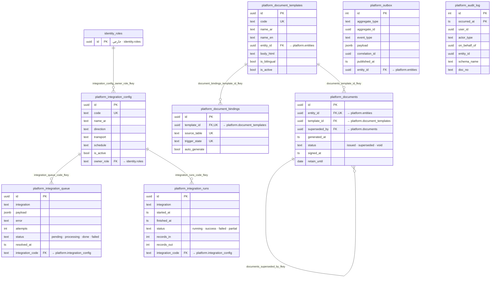

**جرد جداول `platform`**

| الجدول | الوصف (`obj_description`) | الأعمدة | RLS | `entity_id` | أعمدة الحالة والقيم المسموحة | المفاتيح الأجنبية |
|---|---|---|---|---|---|---|
| `alert_log` | — | 10 | نعم · internal_only | لا | — | — |
| `alert_rules` | — | 17 | نعم · reference_read, reference_write | لا | — | — |
| `approval_chains` | — | 10 | نعم · reference_read, reference_write | لا | — | `approver_role` → `identity.roles` |
| `audit_log` *(مقسَّم)* | — | 23 | لا | نعم | — | — |
| `audit_log_2026_09` *(قسم من `audit_log`)* | — | 23 | نعم · entity_scope | نعم | — | — |
| `audit_log_2026_10` *(قسم من `audit_log`)* | — | 23 | نعم · entity_scope | نعم | — | — |
| `audit_log_2026_11` *(قسم من `audit_log`)* | — | 23 | نعم · entity_scope | نعم | — | — |
| `audit_log_2026_12` *(قسم من `audit_log`)* | — | 23 | نعم · entity_scope | نعم | — | — |
| `audit_log_default` *(قسم من `audit_log`)* | — | 23 | نعم · entity_scope | نعم | — | — |
| `automation_rules` | — | 12 | نعم · reference_read, reference_write | لا | `level`: `A0` · `A1` · `A2` · `A3` | — |
| `counters` | — | 7 | نعم · reference_read, reference_write | نعم | — | `entity_id` → `platform.entities` |
| `decisions` | — | 18 | نعم · entity_scope | نعم | `status`: `open` · `decided` · `expired` · `cancelled` · `auto_resolved` | `entity_id` → `platform.entities` |
| `document_bindings` | لا تبويب نماذج. كل مستند مربوط بعملية وانتقال حالة يولّده تلقائياً | 5 | نعم · reference_read, reference_write | لا | — | `template_id` → `platform.document_templates` |
| `document_templates` | — | 11 | نعم · reference_read, reference_write | نعم | — | `entity_id` → `platform.entities` |
| `documents` | — | 20 | نعم · entity_scope | نعم | `status`: `issued` · `superseded` · `void` | `entity_id` → `platform.entities` `superseded_by` → `platform.documents` `template_id` → `platform.document_templates` |
| `domain_owners` | — | 6 | نعم · reference_read, reference_write | لا | — | `approver_role` → `identity.roles` `owner_role` → `identity.roles` |
| `domain_quality_monthly` | بطاقة جودة البيانات الشهرية لكل مجال D01–D12 — مصدر التنبيه N-18 وتقرير R-20 (25 §2-1) | 4 | نعم · internal_only | لا | — | `domain_code` → `platform.domain_owners` |
| `entities` | الكيانات القانونية. الشركة القابضة (holding) جذر الشجرة وتحمل التكاليف المشتركة والعقود الإطارية فقط؛ الكيانات التشغيلية (operating) وحدها تُصدر فواتير العملاء | 21 | نعم · internal_only | لا | — | `parent_id` → `platform.entities` |
| `feature_flags` | — | 7 | نعم · reference_read, reference_write | لا | — | — |
| `integration_config` | — | 18 | نعم · reference_read, reference_write | لا | — | `owner_role` → `identity.roles` |
| `integration_queue` | — | 11 | نعم · internal_only | لا | `status`: `pending` · `processing` · `done` · `failed` | `integration_code` → `platform.integration_config` |
| `integration_runs` | — | 10 | نعم · internal_only | لا | `status`: `running` · `success` · `failed` · `partial` | `integration_code` → `platform.integration_config` |
| `notifications` | — | 12 | نعم · entity_scope | نعم | `delivery_status`: `sent` · `delivered` · `bounced` · `failed` · `(أو فارغ)` | — |
| `outbox` | صندوق صادر معامَلاتي — 40 §B3. يُكتب في نفس معاملة تغيير الحالة؛ ناقل ينشر كل ثانية. يحل محل platform.domain_events (ق-2) | 13 | نعم · entity_scope | نعم | — | `entity_id` → `platform.entities` |
| `settings` | — | 8 | نعم · reference_read, reference_write | نعم | — | `entity_id` → `platform.entities` |
| `thresholds` | الحدود العددية التي يحرّرها المدير العام بلا نشر (40 §B5). الإعداد غير العددي في platform.settings — ق-3 | 6 | نعم · reference_read, reference_write | لا | — | — |

### 2.2 مخطط `identity` — 11 جدولاً

الهوية والصلاحيات: المستخدمون وجلساتهم ورموز التحقق، الأدوار والصلاحيات وربطها، ونطاق المستخدم على الكيانات.
وفيها قواعد فصل المهام `sod_rules`، الإنابة `delegations`، وتصنيف الأعمدة الحساسة `column_classification`.

#### خريطة 2-2-1: `identity` — الجداول والعلاقات
تقرأ من الجدول الأصل (`||`) إلى الجدول التابع (`o{`)؛ اسم السهم هو اسم المفتاح الأجنبي في القاعدة. ملف منفصل: `diagrams/erd-identity.mmd`.

```mermaid
%% identity · الجداول والعلاقات
erDiagram
    identity_users ||--o{ identity_delegations : "delegations_from_user_id_fkey"
    identity_roles ||--o{ identity_delegations : "delegations_role_code_fkey"
    identity_users ||--o{ identity_delegations : "delegations_to_user_id_fkey"
    identity_permissions ||--o{ identity_role_permissions : "role_permissions_permission_id_fkey"
    identity_roles ||--o{ identity_role_permissions : "role_permissions_role_id_fkey"
    identity_users ||--o{ identity_sessions : "sessions_user_id_fkey"
    identity_roles ||--o{ identity_sod_rules : "sod_rules_role_a_fkey"
    identity_roles ||--o{ identity_sod_rules : "sod_rules_role_b_fkey"
    identity_users ||--o{ identity_user_entities : "user_entities_user_id_fkey"
    identity_roles ||--o{ identity_user_roles : "user_roles_role_id_fkey"
    identity_users ||--o{ identity_user_roles : "user_roles_user_id_fkey"

    identity_column_classification {
        text schema_name PK
        text table_name PK
        text column_name PK
        text sensitivity
    }
    identity_delegations {
        uuid id PK
        uuid from_user_id FK "→ identity.users"
        uuid to_user_id FK "→ identity.users"
        text role_code FK "→ identity.roles"
        jsonb scope
        ts valid_from
        ts valid_to
        text reason
    }
    identity_otp_codes {
        uuid id PK
        text email
        text code_hash
        ts expires_at
        ts consumed_at
        int attempts
    }
    identity_permissions {
        uuid id PK
        text code UK
        text module
        text object
        text action
        text description
    }
    identity_role_permissions {
        uuid role_id PK,FK "→ identity.roles"
        uuid permission_id PK,FK "→ identity.permissions"
    }
    identity_roles {
        uuid id PK
        text code UK
        text name_ar
        text name_en
        text scope_type "all · entity · org_unit · subordinates · …"
        text description
    }
    identity_sessions {
        uuid id PK
        uuid user_id FK "→ identity.users"
        text token_hash
        ts issued_at
        ts expires_at
        ts revoked_at
        text ip_address
        text user_agent
    }
    identity_sod_rules {
        uuid id PK
        text role_a FK,UK "→ identity.roles"
        text role_b FK,UK "→ identity.roles"
        text reason_ar
        bool is_active
    }
    identity_user_entities {
        uuid user_id PK,FK "→ identity.users"
        uuid entity_id PK,FK "→ platform.entities"
    }
    identity_user_roles {
        uuid id PK
        uuid user_id FK "→ identity.users"
        uuid role_id FK "→ identity.roles"
        ts granted_at
        uuid granted_by
        ts revoked_at
        uuid revoked_by
    }
    identity_users {
        uuid id PK
        text email UK
        text full_name_ar
        text full_name_en
        text phone
        uuid employee_id
        bool is_active
        ts last_login_at
    }
```

**جرد جداول `identity`**

| الجدول | الوصف (`obj_description`) | الأعمدة | RLS | `entity_id` | أعمدة الحالة والقيم المسموحة | المفاتيح الأجنبية |
|---|---|---|---|---|---|---|
| `column_classification` | — | 4 | نعم · reference_read, reference_write | لا | — | — |
| `delegations` | EXECUTION-MASTER-v4 §1.6 (ex DECISIONS-ADDENDUM §2) (ADR-16c): الإنابة لا تتجاوز فصل المهام أبداً | 9 | نعم · internal_only | لا | — | `from_user_id` → `identity.users` `role_code` → `identity.roles` `to_user_id` → `identity.users` |
| `otp_codes` | — | 6 | نعم · internal_only | لا | — | — |
| `permissions` | — | 6 | نعم · reference_read, reference_write | لا | — | — |
| `role_permissions` | — | 2 | نعم · reference_read, reference_write | لا | — | `permission_id` → `identity.permissions` `role_id` → `identity.roles` |
| `roles` | — | 6 | نعم · reference_read, reference_write | لا | `scope_type`: `all` · `entity` · `org_unit` · `subordinates` · `assigned` · `account` · `client` · `self` | — |
| `sessions` | — | 8 | نعم · internal_only | لا | — | `user_id` → `identity.users` |
| `sod_rules` | — | 5 | نعم · reference_read, reference_write | لا | — | `role_a` → `identity.roles` `role_b` → `identity.roles` |
| `user_entities` | — | 2 | نعم · entity_scope | نعم | — | `entity_id` → `platform.entities` `user_id` → `identity.users` |
| `user_roles` | — | 7 | نعم · internal_only | لا | — | `role_id` → `identity.roles` `user_id` → `identity.users` |
| `users` | — | 11 | نعم · internal_only | لا | — | — |

### 2.3 مخطط `catalog` — 6 جدولاً

كتالوج الخدمات والتسعير: الخدمات وفئاتها وشرائح العملاء، قوائم الأسعار وبنودها.
و`price_exceptions` هو المسار الوحيد للبيع تحت الحد الأدنى — يُربط ببند عرض السعر.

#### خريطة 2-3-1: `catalog` — الجداول والعلاقات
تقرأ من الجدول الأصل (`||`) إلى الجدول التابع (`o{`)؛ اسم السهم هو اسم المفتاح الأجنبي في القاعدة. ملف منفصل: `diagrams/erd-catalog.mmd`.

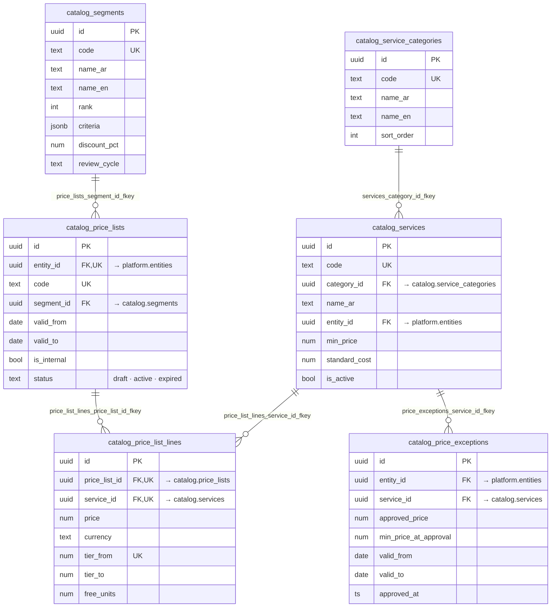

**جرد جداول `catalog`**

| الجدول | الوصف (`obj_description`) | الأعمدة | RLS | `entity_id` | أعمدة الحالة والقيم المسموحة | المفاتيح الأجنبية |
|---|---|---|---|---|---|---|
| `price_exceptions` | — | 12 | نعم · entity_scope | نعم | — | `entity_id` → `platform.entities` `service_id` → `catalog.services` |
| `price_list_lines` | — | 9 | نعم · internal_only | لا | — | `price_list_id` → `catalog.price_lists` `service_id` → `catalog.services` |
| `price_lists` | — | 10 | نعم · entity_scope | نعم | `status`: `draft` · `active` · `expired` | `entity_id` → `platform.entities` `segment_id` → `catalog.segments` |
| `segments` | — | 8 | نعم · reference_read, reference_write | لا | — | — |
| `service_categories` | — | 5 | نعم · reference_read, reference_write | لا | — | — |
| `services` | — | 14 | نعم · reference_read, reference_write | نعم | — | `category_id` → `catalog.service_categories` `entity_id` → `platform.entities` |

### 2.4 مخطط `sales` — 11 جدولاً

دورة المبيعات الكاملة: العملاء المحتملون → الفرص → عروض الأسعار وبنودها → العقود.
وفيها الحسابات وجهات الاتصال والأنشطة، واتفاقيات مستوى الخدمة `contract_sla` ونتائجها `sla_results`.

#### خريطة 2-4-1: `sales` — الجداول والعلاقات
تقرأ من الجدول الأصل (`||`) إلى الجدول التابع (`o{`)؛ اسم السهم هو اسم المفتاح الأجنبي في القاعدة. ملف منفصل: `diagrams/erd-sales.mmd`.

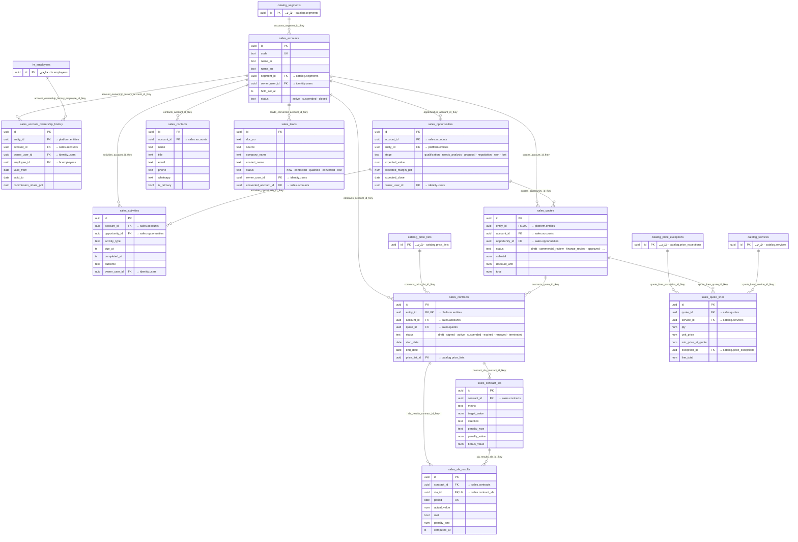

**جرد جداول `sales`**

| الجدول | الوصف (`obj_description`) | الأعمدة | RLS | `entity_id` | أعمدة الحالة والقيم المسموحة | المفاتيح الأجنبية |
|---|---|---|---|---|---|---|
| `account_ownership_history` | سجل ملكية حساب العميل بتاريخ — أساس تقسيم العمولة عند نقل الحساب — SCR-SC-01 | 12 | نعم · entity_scope | نعم | `role_kind`: `sales_rep` · `sales_mgr` | `account_id` → `sales.accounts` `employee_id` → `hr.employees` `entity_id` → `platform.entities` `owner_user_id` → `identity.users` |
| `accounts` | — | 28 | نعم · client_portal_scope | لا | `status`: `active` · `suspended` · `closed` | `owner_user_id` → `identity.users` `segment_id` → `catalog.segments` |
| `activities` | — | 11 | نعم · internal_only | لا | — | `account_id` → `sales.accounts` `opportunity_id` → `sales.opportunities` `owner_user_id` → `identity.users` |
| `contacts` | — | 10 | نعم · internal_only | لا | — | `account_id` → `sales.accounts` |
| `contract_sla` | — | 8 | نعم · internal_only | لا | — | `contract_id` → `sales.contracts` |
| `contracts` | — | 25 | نعم · entity_scope | نعم | `status`: `draft` · `signed` · `active` · `suspended` · `expired` · `renewed` · `terminated` | `account_id` → `sales.accounts` `entity_id` → `platform.entities` `price_list_id` → `catalog.price_lists` `quote_id` → `sales.quotes` |
| `leads` | — | 13 | نعم · internal_only | لا | `status`: `new` · `contacted` · `qualified` · `converted` · `lost` | `converted_account_id` → `sales.accounts` `owner_user_id` → `identity.users` |
| `opportunities` | — | 16 | نعم · entity_scope | نعم | `stage`: `qualification` · `needs_analysis` · `proposal` · `negotiation` · `won` · `lost` | `account_id` → `sales.accounts` `entity_id` → `platform.entities` `owner_user_id` → `identity.users` |
| `quote_lines` | — | 12 | نعم · internal_only | لا | — | `exception_id` → `catalog.price_exceptions` `quote_id` → `sales.quotes` `service_id` → `catalog.services` |
| `quotes` | — | 21 | نعم · entity_scope | نعم | `status`: `draft` · `commercial_review` · `finance_review` · `approved` · `sent` · `accepted` · `rejected` · `expired` | `account_id` → `sales.accounts` `entity_id` → `platform.entities` `opportunity_id` → `sales.opportunities` |
| `sla_results` | — | 8 | نعم · internal_only | لا | — | `contract_id` → `sales.contracts` `sla_id` → `sales.contract_sla` |

### 2.5 مخطط `wms` — 20 جدولاً

إدارة المستودعات: البنية المادية (المستودعات · المناطق · المواقع · الكتل) وتخصيص المساحات وحجزها ولقطات الإشغال.
والجانب المخزني: الأصناف، الأرصدة، الحركات، أوامر الإدخال والإخراج وبنودها، وعمليات الجرد.

#### خريطة 2-5-1: `wms` — البنية والمساحات
تقرأ من الجدول الأصل (`||`) إلى الجدول التابع (`o{`)؛ اسم السهم هو اسم المفتاح الأجنبي في القاعدة. ملف منفصل: `diagrams/erd-wms-1.mmd`.

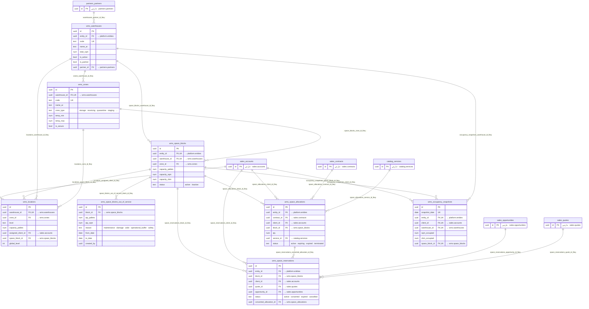

#### خريطة 2-5-2: `wms` — المخزون والطلبات والجرد
تقرأ من الجدول الأصل (`||`) إلى الجدول التابع (`o{`)؛ اسم السهم هو اسم المفتاح الأجنبي في القاعدة. ملف منفصل: `diagrams/erd-wms-2.mmd`.

```mermaid
%% wms · المخزون والطلبات والجرد
erDiagram
    sales_accounts ||--o{ wms_skus : "skus_client_id_fkey"
    sales_accounts ||--o{ wms_stock_balance : "stock_balance_client_id_fkey"
    wms_locations ||--o{ wms_stock_balance : "stock_balance_location_id_fkey"
    wms_skus ||--o{ wms_stock_balance : "stock_balance_sku_id_fkey"
    sales_accounts ||--o{ wms_stock_movements : "stock_movements_client_id_fkey"
    wms_locations ||--o{ wms_stock_movements : "stock_movements_from_location_id_fkey"
    wms_skus ||--o{ wms_stock_movements : "stock_movements_sku_id_fkey"
    wms_locations ||--o{ wms_stock_movements : "stock_movements_to_location_id_fkey"
    sales_accounts ||--o{ wms_inbound_orders : "inbound_orders_client_id_fkey"
    sales_contracts ||--o{ wms_inbound_orders : "inbound_orders_contract_id_fkey"
    wms_warehouses ||--o{ wms_inbound_orders : "inbound_orders_warehouse_id_fkey"
    sales_accounts ||--o{ wms_outbound_orders : "outbound_orders_client_id_fkey"
    sales_contracts ||--o{ wms_outbound_orders : "outbound_orders_contract_id_fkey"
    wms_warehouses ||--o{ wms_outbound_orders : "outbound_orders_warehouse_id_fkey"
    wms_locations ||--o{ wms_order_lines : "order_lines_location_id_fkey"
    wms_skus ||--o{ wms_order_lines : "order_lines_sku_id_fkey"
    sales_accounts ||--o{ wms_inventory_counts : "inventory_counts_client_id_fkey"
    wms_warehouses ||--o{ wms_inventory_counts : "inventory_counts_warehouse_id_fkey"
    wms_stock_movements ||--o{ wms_inventory_count_lines : "inventory_count_lines_adjusted_movement_id_fkey"
    wms_inventory_counts ||--o{ wms_inventory_count_lines : "inventory_count_lines_count_id_fkey"
    wms_locations ||--o{ wms_inventory_count_lines : "inventory_count_lines_location_id_fkey"
    wms_skus ||--o{ wms_inventory_count_lines : "inventory_count_lines_sku_id_fkey"

    wms_skus {
        uuid id PK
        uuid client_id FK,UK "→ sales.accounts"
        text code UK
        num net_weight_kg
        num gross_weight_kg
        num volume_cbm
        num unit_value
        text status "active · on_hold · discontinued"
    }
    wms_stock_balance {
        uuid id PK
        uuid client_id FK,UK "→ sales.accounts"
        uuid sku_id FK,UK "→ wms.skus"
        uuid location_id FK,UK "→ wms.locations"
        date expiry_date
        num qty_on_hand
        num qty_allocated
        num qty_available
    }
    wms_stock_movements {
        uuid id PK
        uuid entity_id FK "→ platform.entities"
        ts occurred_at
        uuid client_id FK "→ sales.accounts"
        uuid sku_id FK "→ wms.skus"
        uuid from_location_id FK "→ wms.locations"
        uuid to_location_id FK "→ wms.locations"
        num qty
    }
    wms_inbound_orders {
        uuid id PK
        uuid entity_id FK,UK "→ platform.entities"
        uuid client_id FK "→ sales.accounts"
        uuid contract_id FK "→ sales.contracts"
        uuid warehouse_id FK "→ wms.warehouses"
        text status "draft · approved · receiving · received · putaway · closed · cancelled"
        ts expected_at
        ts arrived_at
    }
    wms_outbound_orders {
        uuid id PK
        uuid entity_id FK,UK "→ platform.entities"
        uuid client_id FK "→ sales.accounts"
        uuid contract_id FK "→ sales.contracts"
        uuid warehouse_id FK "→ wms.warehouses"
        text status "draft · checks_pending · credit_rejected · approved · …"
        ts required_by
        ts credit_checked_at
    }
    wms_order_lines {
        uuid id PK
        uuid sku_id FK "→ wms.skus"
        num qty_ordered
        num qty_actual
        date expiry_date
        uuid location_id FK "→ wms.locations"
        text status "open · partial · complete · cancelled"
        ts original_occurred_at
    }
    wms_inventory_counts {
        uuid id PK
        uuid entity_id FK,UK "→ platform.entities"
        text doc_no UK
        uuid warehouse_id FK "→ wms.warehouses"
        uuid client_id FK "→ sales.accounts"
        text status "draft · in_progress · review · recount · adjusted · closed"
        ts started_at
        ts finished_at
    }
    wms_inventory_count_lines {
        uuid id PK
        uuid count_id FK "→ wms.inventory_counts"
        uuid location_id FK "→ wms.locations"
        uuid sku_id FK "→ wms.skus"
        num qty_system
        num qty_counted
        num recount_qty
        uuid adjusted_movement_id FK "→ wms.stock_movements"
    }
    sales_accounts {
        uuid id PK "خارجي · sales.accounts"
    }
    wms_locations {
        uuid id PK "خارجي · wms.locations"
    }
    sales_contracts {
        uuid id PK "خارجي · sales.contracts"
    }
    wms_warehouses {
        uuid id PK "خارجي · wms.warehouses"
    }
```

#### خريطة 2-5-3: `wms` — جداول أخرى
تقرأ من الجدول الأصل (`||`) إلى الجدول التابع (`o{`)؛ اسم السهم هو اسم المفتاح الأجنبي في القاعدة. ملف منفصل: `diagrams/erd-wms-3.mmd`.

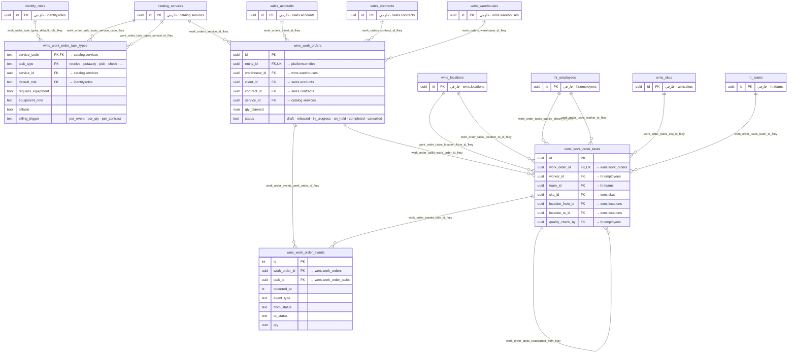

**جرد جداول `wms`**

| الجدول | الوصف (`obj_description`) | الأعمدة | RLS | `entity_id` | أعمدة الحالة والقيم المسموحة | المفاتيح الأجنبية |
|---|---|---|---|---|---|---|
| `inbound_orders` | — | 22 | نعم · entity_scope | نعم | `status`: `draft` · `approved` · `receiving` · `received` · `putaway` · `closed` · `cancelled` | `client_id` → `sales.accounts` `contract_id` → `sales.contracts` `entity_id` → `platform.entities` `warehouse_id` → `wms.warehouses` |
| `inventory_count_lines` | — | 11 | نعم · internal_only | لا | — | `adjusted_movement_id` → `wms.stock_movements` `count_id` → `wms.inventory_counts` `location_id` → `wms.locations` `sku_id` → `wms.skus` |
| `inventory_counts` | — | 11 | نعم · entity_scope | نعم | `status`: `draft` · `in_progress` · `review` · `recount` · `adjusted` · `closed` | `client_id` → `sales.accounts` `entity_id` → `platform.entities` `warehouse_id` → `wms.warehouses` |
| `locations` | — | 26 | نعم · reference_read, reference_write | لا | `location_type`: `pallet` · `shelf` · `operational` · `structural` | `assigned_client_id` → `sales.accounts` `space_block_id` → `wms.space_blocks` `warehouse_id` → `wms.warehouses` `zone_id` → `wms.zones` |
| `occupancy_snapshots` | — | 10 | نعم · client_portal_scope, entity_scope | نعم | — | `client_id` → `sales.accounts` `entity_id` → `platform.entities` `space_block_id` → `wms.space_blocks` `warehouse_id` → `wms.warehouses` |
| `order_lines` | — | 16 | نعم · internal_only | لا | `status`: `open` · `partial` · `complete` · `cancelled` | `location_id` → `wms.locations` `sku_id` → `wms.skus` |
| `outbound_orders` | — | 27 | نعم · client_portal_scope, entity_scope | نعم | `status`: `draft` · `checks_pending` · `credit_rejected` · `approved` · `allocated` · `partially_allocated` · `picking` · `picked` · `checked` · `packed` · `loaded` · `dispatched` · `delivered` · `cancelled` | `client_id` → `sales.accounts` `contract_id` → `sales.contracts` `entity_id` → `platform.entities` `warehouse_id` → `wms.warehouses` |
| `skus` | — | 48 | نعم · sku_client_scope | لا | `picking_policy`: `FIFO` · `FEFO` · `LIFO` · `(أو فارغ)` `status`: `active` · `on_hold` · `discontinued` | `client_id` → `sales.accounts` |
| `space_allocations` | — | 14 | نعم · client_portal_scope, entity_scope | نعم | `status`: `active` · `expiring` · `expired` · `terminated` `alloc_type`: `dedicated` · `shared` · `overflow` | `block_id` → `wms.space_blocks` `client_id` → `sales.accounts` `contract_id` → `sales.contracts` `entity_id` → `platform.entities` `service_id` → `catalog.services` |
| `space_blocks` | — | 18 | نعم · entity_scope | نعم | `status`: `active` · `inactive` `block_type`: `pallet_rack` · `shelf` · `floor` · `mezzanine` · `yard` · `cold` · `frozen` · `secure` · `hazmat` `uom`: `pallet` · `sqm` · `cbm` · `position` | `entity_id` → `platform.entities` `warehouse_id` → `wms.warehouses` `zone_id` → `wms.zones` |
| `space_blocks_out_of_service` | — | 8 | نعم · internal_only | لا | `reason`: `maintenance` · `damage` · `aisle` · `operational_buffer` · `safety` | `block_id` → `wms.space_blocks` |
| `space_reservations` | — | 16 | نعم · client_portal_scope, entity_scope | نعم | `reason`: `quote_pending` · `incoming_client` · `seasonal_peak` · `internal` `status`: `active` · `converted` · `expired` · `cancelled` | `block_id` → `wms.space_blocks` `client_id` → `sales.accounts` `converted_allocation_id` → `wms.space_allocations` `entity_id` → `platform.entities` `opportunity_id` → `sales.opportunities` `quote_id` → `sales.quotes` |
| `stock_balance` | — | 10 | نعم · internal_only | لا | — | `client_id` → `sales.accounts` `location_id` → `wms.locations` `sku_id` → `wms.skus` |
| `stock_movements` | دفتر لا يُعدَّل. التصحيح بحركة تسوية مقابلة فقط | 21 | نعم · entity_scope | نعم | `movement_type`: `receipt` · `putaway` · `pick` · `pack` · `ship` · `issue` · `transfer` · `adjust` · `count` · `damage` · `return` · `scrap` | `client_id` → `sales.accounts` `entity_id` → `platform.entities` `from_location_id` → `wms.locations` `sku_id` → `wms.skus` `to_location_id` → `wms.locations` |
| `warehouses` | — | 11 | نعم · reference_read, reference_write | نعم | — | `entity_id` → `platform.entities` `partner_id` → `partners.partners` |
| `work_order_events` | سجل زمني لأوامر العمل ومهامها — دفتر لا يُعدَّل. التصحيح بحدث مقابل فقط | 12 | نعم · internal_only | لا | — | `task_id` → `wms.work_order_tasks` `work_order_id` → `wms.work_orders` |
| `work_order_task_types` | 12 §1: خريطة الخدمات الداخلية الـ39 إلى أنواع المهام الخمسة عشر. 33 خدمة قابلة للإسناد · 6 رسوم أو سمات لا تُبذر. billing_trigger من عمود «تُفوتر» | 9 | نعم · internal_only | لا | `billing_trigger`: `per_event` · `per_qty` · `per_contract` `task_type`: `receive` · `putaway` · `pick` · `check` · `pack` · `label` · `kit` · `load` · `return_sort` · `count` · `weigh` · `photo` · `transfer` · `scrap` · `qc` | `default_role` → `identity.roles` `service_code` → `catalog.services` `service_id` → `catalog.services` |
| `work_order_tasks` | المهمة المسنَدة لعامل بعينه — بوقت بدء وانتهاء وكمية منجزة وجهاز وسبب استثناء | 29 | نعم · internal_only | لا | `quality_result`: `pass` · `fail` · `(أو فارغ)` `status`: `queued` · `assigned` · `accepted` · `in_progress` · `paused` · `done` · `rejected` · `reassigned` | `location_from_id` → `wms.locations` `location_to_id` → `wms.locations` `quality_check_by` → `hr.employees` `reassigned_from` → `wms.work_order_tasks` `sku_id` → `wms.skus` `team_id` → `hr.teams` `work_order_id` → `wms.work_orders` `worker_id` → `hr.employees` |
| `work_orders` | أمر عمل داخل المستودع — الوحدة القابلة للإسناد والتتبّع والفوترة لخدمات HD/OF/VA | 26 | نعم · client_portal_scope, entity_scope | نعم | `status`: `draft` · `released` · `in_progress` · `on_hold` · `completed` · `cancelled` `task_type`: `receive` · `putaway` · `pick` · `check` · `pack` · `label` · `kit` · `load` · `return_sort` · `count` · `weigh` · `photo` · `transfer` · `scrap` · `qc` | `client_id` → `sales.accounts` `contract_id` → `sales.contracts` `entity_id` → `platform.entities` `service_id` → `catalog.services` `warehouse_id` → `wms.warehouses` |
| `zones` | — | 8 | نعم · reference_read, reference_write | لا | `zone_type`: `storage` · `receiving` · `quarantine` · `staging` · `shipping` · `returns` · `damaged` · `structural` | `warehouse_id` → `wms.warehouses` |

### 2.6 مخطط `tms` — 13 جدولاً

إدارة النقل: المركبات ووثائقها وخطط الصيانة وأوامرها ودفتر الوقود والحوادث.
والتنفيذ الميداني: المسارات، مهام التسليم، استثناءاتها وأسباب الفشل المرجعية، إثبات التسليم ومحاولات الدفع.

#### خريطة 2-6-1: `tms` — الجداول والعلاقات
تقرأ من الجدول الأصل (`||`) إلى الجدول التابع (`o{`)؛ اسم السهم هو اسم المفتاح الأجنبي في القاعدة. ملف منفصل: `diagrams/erd-tms.mmd`.

```mermaid
%% tms · الجداول والعلاقات
erDiagram
    hr_disciplinary_cases ||--o{ tms_accidents : "accidents_disciplinary_case_id_fkey"
    hr_employees ||--o{ tms_accidents : "accidents_driver_employee_id_fkey"
    tms_maintenance_orders ||--o{ tms_accidents : "accidents_repair_order_id_fkey"
    tms_vehicles ||--o{ tms_accidents : "accidents_vehicle_id_fkey"
    hr_employees ||--o{ tms_contact_log : "contact_log_driver_employee_id_fkey"
    tms_delivery_tasks ||--o{ tms_contact_log : "contact_log_task_id_fkey"
    tms_delivery_tasks ||--o{ tms_delivery_exceptions : "delivery_exceptions_task_id_fkey"
    sales_accounts ||--o{ tms_delivery_tasks : "delivery_tasks_client_id_fkey"
    sales_contracts ||--o{ tms_delivery_tasks : "delivery_tasks_contract_id_fkey"
    partners_partners ||--o{ tms_delivery_tasks : "delivery_tasks_executed_by_partner_id_fkey"
    wms_outbound_orders ||--o{ tms_delivery_tasks : "delivery_tasks_outbound_order_id_fkey"
    tms_vehicles ||--o{ tms_delivery_tasks : "delivery_tasks_vehicle_id_fkey"
    tms_failure_reasons ||--o{ tms_failure_reasons : "failure_reasons_parent_code_fkey"
    admin_assets ||--o{ tms_fuel_ledger : "fuel_ledger_card_asset_id_fkey"
    hr_employees ||--o{ tms_fuel_ledger : "fuel_ledger_driver_employee_id_fkey"
    tms_vehicles ||--o{ tms_fuel_ledger : "fuel_ledger_vehicle_id_fkey"
    tms_maintenance_plans ||--o{ tms_maintenance_orders : "maintenance_orders_plan_id_fkey"
    admin_purchase_orders ||--o{ tms_maintenance_orders : "maintenance_orders_purchase_order_id_fkey"
    tms_vehicles ||--o{ tms_maintenance_orders : "maintenance_orders_vehicle_id_fkey"
    partners_partners ||--o{ tms_maintenance_orders : "maintenance_orders_workshop_partner_id_fkey"
    tms_delivery_tasks ||--o{ tms_payment_attempts : "payment_attempts_task_id_fkey"
    tms_delivery_tasks ||--o{ tms_proof_of_delivery : "proof_of_delivery_task_id_fkey"
    tms_vehicles ||--o{ tms_routes : "routes_vehicle_id_fkey"
    tms_vehicles ||--o{ tms_vehicle_documents : "vehicle_documents_vehicle_id_fkey"
    sales_accounts ||--o{ tms_vehicles : "vehicles_assigned_client_id_fkey"

    tms_accidents {
        uuid id PK
        uuid entity_id FK,UK "→ platform.entities"
        uuid vehicle_id FK "→ tms.vehicles"
        uuid driver_employee_id FK "→ hr.employees"
        text claim_status
        num claim_amount
        uuid disciplinary_case_id FK "→ hr.disciplinary_cases"
        uuid repair_order_id FK "→ tms.maintenance_orders"
    }
    tms_contact_log {
        uuid id PK
        uuid task_id FK "→ tms.delivery_tasks"
        uuid driver_employee_id FK "→ hr.employees"
        text channel
        ts attempted_at
        ts delivered_at
        ts read_at
        num cost
    }
    tms_delivery_exceptions {
        uuid id PK
        uuid task_id FK "→ tms.delivery_tasks"
        ts raised_at
        text exception_type "waiting_time · failed_attempt · damage · shortage · …"
        text description
        array evidence_urls
        ts resolved_at
        bool is_billable
    }
    tms_delivery_tasks {
        uuid id PK
        uuid entity_id FK,UK "→ platform.entities"
        uuid client_id FK "→ sales.accounts"
        uuid contract_id FK "→ sales.contracts"
        uuid outbound_order_id FK "→ wms.outbound_orders"
        text status "created · assigned · out_for_delivery · delivered · …"
        uuid vehicle_id FK "→ tms.vehicles"
        uuid executed_by_partner_id FK "→ partners.partners"
    }
    tms_failure_reasons {
        text code PK
        text parent_code FK "→ tms.failure_reasons"
        text name_ar
        text name_en
        bool requires_photo
        int requires_contact_attempts
        bool requires_note
        bool is_billable
    }
    tms_fuel_ledger {
        uuid id PK
        uuid entity_id FK "→ platform.entities"
        uuid card_asset_id FK,UK "→ admin.assets"
        uuid vehicle_id FK "→ tms.vehicles"
        uuid driver_employee_id FK "→ hr.employees"
        num amount UK
        num odometer_km
        num km_since_last
    }
    tms_maintenance_orders {
        uuid id PK
        uuid entity_id FK,UK "→ platform.entities"
        uuid vehicle_id FK "→ tms.vehicles"
        uuid plan_id FK "→ tms.maintenance_plans"
        num odometer_km
        uuid workshop_partner_id FK "→ partners.partners"
        uuid purchase_order_id FK "→ admin.purchase_orders"
        text status "planned · in_progress · in_workshop · awaiting_parts · …"
    }
    tms_maintenance_plans {
        uuid id PK
        text vehicle_type
        text task
        int interval_km
        int interval_days
        int alert_before_km
        int alert_before_days
        num estimated_cost
    }
    tms_payment_attempts {
        uuid id PK
        uuid task_id FK "→ tms.delivery_tasks"
        text method
        num amount_due
        num amount_paid
        ts link_expires_at
        text gateway_status
        ts confirmed_at
    }
    tms_proof_of_delivery {
        uuid id PK
        uuid task_id FK "→ tms.delivery_tasks"
        ts delivered_at
        text receiver_name
        text receiver_id_no
        text relation
        date retain_until
        ts original_occurred_at
    }
    tms_routes {
        uuid id PK
        uuid entity_id FK,UK "→ platform.entities"
        date route_date
        uuid vehicle_id FK "→ tms.vehicles"
        num planned_km
        num actual_km
        ts started_at
        text status "planned · active · closed · cancelled"
    }
    tms_vehicle_documents {
        uuid id PK
        uuid vehicle_id FK "→ tms.vehicles"
        text doc_type
        text doc_no
        date issue_date
        date expiry_date
        text file_url
        int alert_days_before
    }
    tms_vehicles {
        uuid id PK
        uuid entity_id FK "→ platform.entities"
        num capacity_kg
        num capacity_cbm
        bool is_refrigerated
        text status "registered · active · maintenance · idle · out_of_service · disposed"
        uuid assigned_client_id FK "→ sales.accounts"
        num odometer_km
    }
    hr_disciplinary_cases {
        uuid id PK "خارجي · hr.disciplinary_cases"
    }
    hr_employees {
        uuid id PK "خارجي · hr.employees"
    }
    sales_accounts {
        uuid id PK "خارجي · sales.accounts"
    }
    sales_contracts {
        uuid id PK "خارجي · sales.contracts"
    }
    partners_partners {
        uuid id PK "خارجي · partners.partners"
    }
    wms_outbound_orders {
        uuid id PK "خارجي · wms.outbound_orders"
    }
    admin_assets {
        uuid id PK "خارجي · admin.assets"
    }
    admin_purchase_orders {
        uuid id PK "خارجي · admin.purchase_orders"
    }
```

**جرد جداول `tms`**

| الجدول | الوصف (`obj_description`) | الأعمدة | RLS | `entity_id` | أعمدة الحالة والقيم المسموحة | المفاتيح الأجنبية |
|---|---|---|---|---|---|---|
| `accidents` | — | 23 | نعم · entity_scope | نعم | — | `disciplinary_case_id` → `hr.disciplinary_cases` `driver_employee_id` → `hr.employees` `entity_id` → `platform.entities` `repair_order_id` → `tms.maintenance_orders` `vehicle_id` → `tms.vehicles` |
| `contact_log` | — | 15 | نعم · internal_only | لا | — | `driver_employee_id` → `hr.employees` `task_id` → `tms.delivery_tasks` |
| `delivery_exceptions` | — | 10 | نعم · internal_only | لا | `exception_type`: `waiting_time` · `failed_attempt` · `damage` · `shortage` · `wrong_address` · `refused` · `return` · `other` | `task_id` → `tms.delivery_tasks` |
| `delivery_tasks` | — | 39 | نعم · client_portal_scope, entity_scope | نعم | `status`: `created` · `assigned` · `out_for_delivery` · `delivered` · `failed` · `deferred` · `returned` · `cancelled` | `client_id` → `sales.accounts` `contract_id` → `sales.contracts` `entity_id` → `platform.entities` `executed_by_partner_id` → `partners.partners` `outbound_order_id` → `wms.outbound_orders` `vehicle_id` → `tms.vehicles` |
| `failure_reasons` | — | 10 | نعم · reference_read, reference_write | لا | — | `parent_code` → `tms.failure_reasons` |
| `fuel_ledger` | — | 18 | نعم · entity_scope | نعم | — | `card_asset_id` → `admin.assets` `driver_employee_id` → `hr.employees` `entity_id` → `platform.entities` `vehicle_id` → `tms.vehicles` |
| `maintenance_orders` | — | 20 | نعم · entity_scope | نعم | `status`: `planned` · `in_progress` · `in_workshop` · `awaiting_parts` · `done` · `cancelled` | `entity_id` → `platform.entities` `plan_id` → `tms.maintenance_plans` `purchase_order_id` → `admin.purchase_orders` `vehicle_id` → `tms.vehicles` `workshop_partner_id` → `partners.partners` |
| `maintenance_plans` | — | 9 | نعم · reference_read, reference_write | لا | — | — |
| `payment_attempts` | — | 12 | نعم · internal_only | لا | — | `task_id` → `tms.delivery_tasks` |
| `proof_of_delivery` | — | 21 | نعم · internal_only | لا | — | `task_id` → `tms.delivery_tasks` |
| `routes` | — | 14 | نعم · entity_scope | نعم | `status`: `planned` · `active` · `closed` · `cancelled` | `entity_id` → `platform.entities` `vehicle_id` → `tms.vehicles` |
| `vehicle_documents` | — | 8 | نعم · internal_only | لا | — | `vehicle_id` → `tms.vehicles` |
| `vehicles` | — | 15 | نعم · entity_scope | نعم | `status`: `registered` · `active` · `maintenance` · `idle` · `out_of_service` · `disposed` | `assigned_client_id` → `sales.accounts` `entity_id` → `platform.entities` |

### 2.7 مخطط `cc` — 6 جدولاً

مركز الاتصال: الوكلاء وطوابيرهم والمكالمات.
والتذاكر وأحداثها — وهي المدخل الرسمي لشكاوى العملاء وربطها بالحجز القانوني على إثبات التسليم.

#### خريطة 2-7-1: `cc` — الجداول والعلاقات
تقرأ من الجدول الأصل (`||`) إلى الجدول التابع (`o{`)؛ اسم السهم هو اسم المفتاح الأجنبي في القاعدة. ملف منفصل: `diagrams/erd-cc.mmd`.

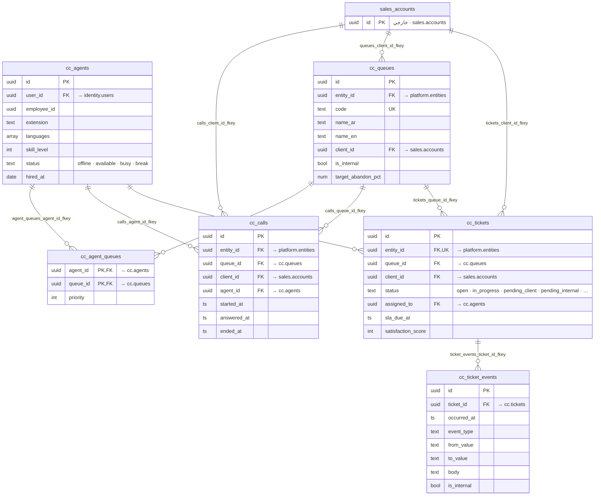

**جرد جداول `cc`**

| الجدول | الوصف (`obj_description`) | الأعمدة | RLS | `entity_id` | أعمدة الحالة والقيم المسموحة | المفاتيح الأجنبية |
|---|---|---|---|---|---|---|
| `agent_queues` | — | 3 | نعم · internal_only | لا | — | `agent_id` → `cc.agents` `queue_id` → `cc.queues` |
| `agents` | — | 8 | نعم · internal_only | لا | `status`: `offline` · `available` · `busy` · `break` | `user_id` → `identity.users` |
| `calls` | — | 17 | نعم · agent_queue_scope, entity_scope | نعم | — | `agent_id` → `cc.agents` `client_id` → `sales.accounts` `entity_id` → `platform.entities` `queue_id` → `cc.queues` |
| `queues` | — | 11 | نعم · agent_queue_scope, entity_scope | نعم | — | `client_id` → `sales.accounts` `entity_id` → `platform.entities` |
| `ticket_events` | — | 9 | نعم · agent_queue_scope, internal_only | لا | — | `ticket_id` → `cc.tickets` |
| `tickets` | — | 23 | نعم · agent_queue_scope, entity_scope | نعم | `priority`: `urgent` · `high` · `normal` · `low` `status`: `open` · `in_progress` · `pending_client` · `pending_internal` · `resolved` · `closed` · `reopened` | `assigned_to` → `cc.agents` `client_id` → `sales.accounts` `entity_id` → `platform.entities` `queue_id` → `cc.queues` |

### 2.8 مخطط `billing` — 11 جدولاً

المحاسبة والفوترة: الأحداث القابلة للفوترة `billable_events` هي البوابة الوحيدة لأي إيراد، ثم الفواتير وبنودها والإشعارات الدائنة والمقبوضات وتخصيصها.
وفيها دفتر الأستاذ: `gl_accounts` والقيود `journal_entries/journal_lines`، وتوزيع التكاليف والربحية.

#### خريطة 2-8-1: `billing` — الجداول والعلاقات
تقرأ من الجدول الأصل (`||`) إلى الجدول التابع (`o{`)؛ اسم السهم هو اسم المفتاح الأجنبي في القاعدة. ملف منفصل: `diagrams/erd-billing.mmd`.

```mermaid
%% billing · الجداول والعلاقات
erDiagram
    sales_accounts ||--o{ billing_billable_events : "billable_events_client_id_fkey"
    sales_contracts ||--o{ billing_billable_events : "billable_events_contract_id_fkey"
    catalog_services ||--o{ billing_billable_events : "billable_events_service_id_fkey"
    sales_accounts ||--o{ billing_cost_allocations : "cost_allocations_client_id_fkey"
    sales_contracts ||--o{ billing_cost_allocations : "cost_allocations_contract_id_fkey"
    sales_accounts ||--o{ billing_credit_notes : "credit_notes_client_id_fkey"
    billing_invoices ||--o{ billing_credit_notes : "credit_notes_invoice_id_fkey"
    billing_gl_accounts ||--o{ billing_gl_accounts : "gl_accounts_parent_id_fkey"
    billing_invoices ||--o{ billing_invoice_lines : "invoice_lines_invoice_id_fkey"
    catalog_services ||--o{ billing_invoice_lines : "invoice_lines_service_id_fkey"
    sales_accounts ||--o{ billing_invoices : "invoices_client_id_fkey"
    sales_contracts ||--o{ billing_invoices : "invoices_contract_id_fkey"
    billing_journal_entries ||--o{ billing_journal_entries : "journal_entries_reversed_by_fkey"
    billing_gl_accounts ||--o{ billing_journal_lines : "journal_lines_account_id_fkey"
    sales_accounts ||--o{ billing_journal_lines : "journal_lines_client_id_fkey"
    sales_contracts ||--o{ billing_journal_lines : "journal_lines_contract_id_fkey"
    billing_journal_entries ||--o{ billing_journal_lines : "journal_lines_entry_id_fkey"
    sales_accounts ||--o{ billing_profitability : "profitability_client_id_fkey"
    sales_contracts ||--o{ billing_profitability : "profitability_contract_id_fkey"
    billing_invoices ||--o{ billing_receipt_allocations : "receipt_allocations_invoice_id_fkey"
    billing_receipts ||--o{ billing_receipt_allocations : "receipt_allocations_receipt_id_fkey"
    sales_accounts ||--o{ billing_receipts : "receipts_client_id_fkey"

    billing_billable_events {
        uuid id PK
        uuid entity_id FK "→ platform.entities"
        uuid client_id FK "→ sales.accounts"
        uuid contract_id FK "→ sales.contracts"
        uuid service_id FK "→ catalog.services"
        num qty
        text status "pending · priced · invoiced · excluded · disputed"
        uuid counterparty_entity_id FK "→ platform.entities"
    }
    billing_cost_allocations {
        uuid id PK
        uuid entity_id FK "→ platform.entities"
        date period
        text cost_type
        uuid client_id FK "→ sales.accounts"
        uuid contract_id FK "→ sales.contracts"
        num amount
        ts computed_at
    }
    billing_credit_notes {
        uuid id PK
        uuid entity_id FK,UK "→ platform.entities"
        uuid client_id FK "→ sales.accounts"
        uuid invoice_id FK "→ billing.invoices"
        date issue_date
        num amount
        text status "draft · approved · applied"
        ts approved_at
    }
    billing_gl_accounts {
        uuid id PK
        uuid entity_id FK,UK "→ platform.entities"
        text code UK
        text name_ar
        text name_en
        text account_type
        uuid parent_id FK "→ billing.gl_accounts"
        bool is_postable
    }
    billing_invoice_lines {
        uuid id PK
        uuid invoice_id FK,UK "→ billing.invoices"
        int line_no UK
        uuid service_id FK "→ catalog.services"
        num qty
        num unit_price
        num discount_pct
        num line_total
    }
    billing_invoices {
        uuid id PK
        uuid entity_id FK,UK "→ platform.entities"
        uuid client_id FK "→ sales.accounts"
        uuid contract_id FK "→ sales.contracts"
        text status "draft · review · approved · sent · …"
        num subtotal
        num discount_amt
        uuid counterparty_entity_id FK "→ platform.entities"
    }
    billing_journal_entries {
        uuid id PK
        uuid entity_id FK,UK "→ platform.entities"
        text doc_no UK
        date entry_date
        text description
        bool is_intercompany
        ts posted_at
        uuid reversed_by FK "→ billing.journal_entries"
    }
    billing_journal_lines {
        uuid id PK
        uuid entry_id FK "→ billing.journal_entries"
        uuid account_id FK "→ billing.gl_accounts"
        num debit
        num credit
        uuid client_id FK "→ sales.accounts"
        uuid contract_id FK "→ sales.contracts"
        text cost_center
    }
    billing_profitability {
        uuid id PK
        uuid entity_id FK,UK "→ platform.entities"
        uuid client_id FK,UK "→ sales.accounts"
        uuid contract_id FK,UK "→ sales.contracts"
        num cost_labour
        num cost_fuel
        num cost_space
        num cost_vehicle
    }
    billing_receipt_allocations {
        uuid id PK
        uuid receipt_id FK "→ billing.receipts"
        uuid invoice_id FK "→ billing.invoices"
        num amount
        ts allocated_at
        uuid allocated_by
    }
    billing_receipts {
        uuid id PK
        uuid entity_id FK,UK "→ platform.entities"
        uuid client_id FK "→ sales.accounts"
        date received_at
        date cheque_date
        num amount
        num allocated_amount
        ts reconciled_at
    }
    sales_accounts {
        uuid id PK "خارجي · sales.accounts"
    }
    sales_contracts {
        uuid id PK "خارجي · sales.contracts"
    }
    catalog_services {
        uuid id PK "خارجي · catalog.services"
    }
```

**جرد جداول `billing`**

| الجدول | الوصف (`obj_description`) | الأعمدة | RLS | `entity_id` | أعمدة الحالة والقيم المسموحة | المفاتيح الأجنبية |
|---|---|---|---|---|---|---|
| `billable_events` | — | 21 | نعم · entity_scope | نعم | `status`: `pending` · `priced` · `invoiced` · `excluded` · `disputed` | `client_id` → `sales.accounts` `contract_id` → `sales.contracts` `counterparty_entity_id` → `platform.entities` `entity_id` → `platform.entities` `service_id` → `catalog.services` |
| `cost_allocations` | — | 11 | نعم · entity_scope | نعم | — | `client_id` → `sales.accounts` `contract_id` → `sales.contracts` `entity_id` → `platform.entities` |
| `credit_notes` | — | 12 | نعم · entity_scope | نعم | `status`: `draft` · `approved` · `applied` | `client_id` → `sales.accounts` `entity_id` → `platform.entities` `invoice_id` → `billing.invoices` |
| `gl_accounts` | — | 8 | نعم · reference_read, reference_write | نعم | — | `entity_id` → `platform.entities` `parent_id` → `billing.gl_accounts` |
| `invoice_lines` | — | 14 | نعم · internal_only | لا | — | `invoice_id` → `billing.invoices` `service_id` → `catalog.services` |
| `invoices` | — | 29 | نعم · client_portal_scope, entity_scope | نعم | `status`: `draft` · `review` · `approved` · `sent` · `partially_paid` · `paid` · `overdue` · `void` | `client_id` → `sales.accounts` `contract_id` → `sales.contracts` `counterparty_entity_id` → `platform.entities` `entity_id` → `platform.entities` |
| `journal_entries` | — | 11 | نعم · entity_scope | نعم | — | `entity_id` → `platform.entities` `reversed_by` → `billing.journal_entries` |
| `journal_lines` | — | 9 | نعم · internal_only | لا | — | `account_id` → `billing.gl_accounts` `client_id` → `sales.accounts` `contract_id` → `sales.contracts` `entry_id` → `billing.journal_entries` |
| `profitability` | — | 18 | نعم · entity_scope | نعم | — | `client_id` → `sales.accounts` `contract_id` → `sales.contracts` `entity_id` → `platform.entities` |
| `receipt_allocations` | — | 6 | نعم · internal_only | لا | — | `invoice_id` → `billing.invoices` `receipt_id` → `billing.receipts` |
| `receipts` | — | 18 | نعم · entity_scope | نعم | — | `client_id` → `sales.accounts` `entity_id` → `platform.entities` |

### 2.9 مخطط `hr` — 14 جدولاً

الموارد البشرية: الوحدات التنظيمية والفرق والموظفون ووثائقهم، طلبات القوى العاملة.
ودورة الاستقدام بمراحلها وسجلها وتكاليفها، لائحة الجزاءات وقضايا الانضباط، وقواعد العمولة واحتسابها اليومي.

#### خريطة 2-9-1: `hr` — الجداول والعلاقات
تقرأ من الجدول الأصل (`||`) إلى الجدول التابع (`o{`)؛ اسم السهم هو اسم المفتاح الأجنبي في القاعدة. ملف منفصل: `diagrams/erd-hr.mmd`.

```mermaid
%% hr · الجداول والعلاقات
erDiagram
    imile_driver_ids ||--o{ hr_commission_daily : "commission_daily_driver_id_ref_fkey"
    hr_employees ||--o{ hr_commission_daily : "commission_daily_employee_id_fkey"
    sales_accounts ||--o{ hr_commission_rules : "commission_rules_client_id_fkey"
    hr_employees ||--o{ hr_disciplinary_cases : "disciplinary_cases_employee_id_fkey"
    hr_penalty_schedule ||--o{ hr_disciplinary_cases : "disciplinary_cases_penalty_code_fkey"
    hr_employees ||--o{ hr_disciplinary_cases : "disciplinary_cases_routed_to_fkey"
    hr_employees ||--o{ hr_disciplinary_cases : "disciplinary_cases_signed_by_fkey"
    identity_roles ||--o{ hr_disciplinary_cases : "disciplinary_cases_signer_role_fkey"
    hr_employees ||--o{ hr_employee_documents : "employee_documents_employee_id_fkey"
    sales_accounts ||--o{ hr_employees : "employees_assigned_client_id_fkey"
    hr_org_units ||--o{ hr_employees : "employees_org_unit_id_fkey"
    hr_employees ||--o{ hr_employees : "employees_reports_to_fkey"
    sales_accounts ||--o{ hr_manpower_requests : "manpower_requests_client_id_fkey"
    hr_org_units ||--o{ hr_manpower_requests : "manpower_requests_org_unit_id_fkey"
    hr_employees ||--o{ hr_manpower_requests : "manpower_requests_requested_by_fkey"
    hr_org_units ||--o{ hr_org_units : "org_units_parent_id_fkey"
    partners_partners ||--o{ hr_recruitment_cases : "recruitment_cases_agency_partner_id_fkey"
    hr_employees ||--o{ hr_recruitment_cases : "recruitment_cases_employee_id_fkey"
    hr_manpower_requests ||--o{ hr_recruitment_cases : "recruitment_cases_request_id_fkey"
    hr_recruitment_stages ||--o{ hr_recruitment_cases : "recruitment_cases_stage_fkey"
    hr_recruitment_cases ||--o{ hr_recruitment_costs : "recruitment_costs_case_id_fkey"
    hr_recruitment_cases ||--o{ hr_recruitment_stage_log : "recruitment_stage_log_case_id_fkey"
    identity_roles ||--o{ hr_recruitment_stages : "recruitment_stages_default_owner_role_fkey"
    sales_accounts ||--o{ hr_sales_commission_events : "sales_commission_events_client_id_fkey"
    sales_contracts ||--o{ hr_sales_commission_events : "sales_commission_events_contract_id_fkey"
    hr_employees ||--o{ hr_sales_commission_events : "sales_commission_events_employee_id_fkey"
    hr_commission_rules ||--o{ hr_sales_commission_events : "sales_commission_events_rule_id_fkey"
    sales_accounts ||--o{ hr_teams : "teams_client_id_fkey"
    hr_org_units ||--o{ hr_teams : "teams_org_unit_id_fkey"
    hr_employees ||--o{ hr_teams : "teams_supervisor_employee_id_fkey"

    hr_commission_daily {
        uuid id PK
        uuid entity_id FK "→ platform.entities"
        uuid employee_id FK,UK "→ hr.employees"
        uuid driver_id_ref FK "→ imile.driver_ids"
        num gross_commission
        num deductions
        num net_commission
        text status "calculated · disputed · approved · paid"
    }
    hr_commission_rules {
        uuid id PK
        uuid entity_id FK "→ platform.entities"
        uuid client_id FK "→ sales.accounts"
        num rate_per_unit
        num bonus_rate
        num rate_pct
        num split_on_sign_pct
        num split_on_execute_pct
    }
    hr_disciplinary_cases {
        uuid id PK
        uuid entity_id FK,UK "→ platform.entities"
        uuid employee_id FK "→ hr.employees"
        text penalty_code FK "→ hr.penalty_schedule"
        uuid signed_by FK "→ hr.employees"
        text signer_role FK "→ identity.roles"
        uuid routed_to FK "→ hr.employees"
        uuid art35_override_by FK "→ identity.users"
    }
    hr_employee_documents {
        uuid id PK
        uuid employee_id FK "→ hr.employees"
        text doc_type
        text doc_no
        date issue_date
        date expiry_date
        text file_url
        int alert_days_before
    }
    hr_employees {
        uuid id PK
        uuid entity_id FK "→ platform.entities"
        uuid org_unit_id FK "→ hr.org_units"
        uuid reports_to FK "→ hr.employees"
        date hire_date
        date end_date
        text status "active · on_leave · suspended · terminated"
        uuid assigned_client_id FK "→ sales.accounts"
    }
    hr_manpower_requests {
        uuid id PK
        uuid entity_id FK,UK "→ platform.entities"
        uuid requested_by FK "→ hr.employees"
        uuid org_unit_id FK "→ hr.org_units"
        num proposed_salary
        uuid client_id FK "→ sales.accounts"
        text status "draft · pending_approval · approved · in_progress · …"
        ts approved_at
    }
    hr_org_units {
        uuid id PK
        uuid entity_id FK "→ platform.entities"
        text code UK
        text name_ar
        text name_en
        text unit_type
        uuid parent_id FK "→ hr.org_units"
        uuid manager_employee_id
    }
    hr_penalty_schedule {
        uuid id PK
        text code UK
        text category "attendance · work · vehicle · client · …"
        text offence_ar
        text offence_en
        bool is_active
        bool is_fraud
        int min_degree
    }
    hr_recruitment_cases {
        uuid id PK
        uuid entity_id FK,UK "→ platform.entities"
        uuid request_id FK "→ hr.manpower_requests"
        uuid agency_partner_id FK "→ partners.partners"
        text stage FK "→ hr.recruitment_stages"
        uuid employee_id FK "→ hr.employees"
        num cost_to_date
        text outcome
    }
    hr_recruitment_costs {
        uuid id PK
        uuid case_id FK "→ hr.recruitment_cases"
        text cost_type
        num amount
        date incurred_at
        uuid gov_transaction_id
        text receipt_url
        uuid recorded_by
    }
    hr_recruitment_stage_log {
        uuid id PK
        uuid case_id FK "→ hr.recruitment_cases"
        text from_stage
        text to_stage
        uuid owner_id
        ts entered_at
        ts exited_at
        num duration_days
    }
    hr_recruitment_stages {
        text code PK
        int seq UK
        text name_ar
        text default_owner_role FK "→ identity.roles"
        int default_sla_days
        bool is_active
    }
    hr_sales_commission_events {
        uuid id PK
        uuid entity_id FK "→ platform.entities"
        uuid employee_id FK "→ hr.employees"
        uuid user_id FK "→ identity.users"
        uuid client_id FK "→ sales.accounts"
        uuid contract_id FK "→ sales.contracts"
        uuid rule_id FK "→ hr.commission_rules"
        text status "accrued · under_review · disputed · approved · …"
    }
    hr_teams {
        uuid id PK
        uuid entity_id FK "→ platform.entities"
        text code UK
        text name_ar
        text team_type
        uuid org_unit_id FK "→ hr.org_units"
        uuid supervisor_employee_id FK "→ hr.employees"
        uuid client_id FK "→ sales.accounts"
    }
    imile_driver_ids {
        uuid id PK "خارجي · imile.driver_ids"
    }
    sales_accounts {
        uuid id PK "خارجي · sales.accounts"
    }
    identity_roles {
        uuid id PK "خارجي · identity.roles"
    }
    partners_partners {
        uuid id PK "خارجي · partners.partners"
    }
    sales_contracts {
        uuid id PK "خارجي · sales.contracts"
    }
```

**جرد جداول `hr`**

| الجدول | الوصف (`obj_description`) | الأعمدة | RLS | `entity_id` | أعمدة الحالة والقيم المسموحة | المفاتيح الأجنبية |
|---|---|---|---|---|---|---|
| `commission_daily` | — | 25 | نعم · own_commission | نعم | `status`: `calculated` · `disputed` · `approved` · `paid` | `driver_id_ref` → `imile.driver_ids` `employee_id` → `hr.employees` `entity_id` → `platform.entities` |
| `commission_rules` | — | 29 | نعم · entity_scope | نعم | `applies_to`: `driver` · `sales_rep` · `sales_mgr` `basis`: `per_unit` · `recurring` · `one_time` · `hybrid` `service_category`: `ST` · `HD` · `OF` · `VA` · `DL` · `CC` · `IT` · `all` `revenue_basis`: `collected` · `invoiced` | `client_id` → `sales.accounts` `entity_id` → `platform.entities` |
| `disciplinary_cases` | — | 43 | نعم · entity_scope | نعم | `status`: `draft` · `issued` · `grievance_filed` · `upheld` · `cancelled` · `applied` · `carried_forward` · `pending_authority` · `signed` | `art35_override_by` → `identity.users` `employee_id` → `hr.employees` `entity_id` → `platform.entities` `penalty_code` → `hr.penalty_schedule` `routed_to` → `hr.employees` `signed_by` → `hr.employees` `signer_role` → `identity.roles` |
| `employee_documents` | — | 8 | نعم · internal_only | لا | — | `employee_id` → `hr.employees` |
| `employees` | — | 20 | نعم · entity_scope | نعم | `status`: `active` · `on_leave` · `suspended` · `terminated` | `assigned_client_id` → `sales.accounts` `entity_id` → `platform.entities` `org_unit_id` → `hr.org_units` `reports_to` → `hr.employees` |
| `manpower_requests` | — | 18 | نعم · entity_scope | نعم | `status`: `draft` · `pending_approval` · `approved` · `in_progress` · `completed` · `rejected` · `cancelled` | `client_id` → `sales.accounts` `entity_id` → `platform.entities` `org_unit_id` → `hr.org_units` `requested_by` → `hr.employees` |
| `org_units` | — | 9 | نعم · reference_read, reference_write | نعم | — | `entity_id` → `platform.entities` `parent_id` → `hr.org_units` |
| `penalty_schedule` | لائحة الجزاءات — البنود نفسها في وثيقة 15 §2..§5 وتُبذَر كمهمة WBS (بيانات مرجعية، ليست DDL) | 20 | نعم · reference_read, reference_write | لا | `category`: `attendance` · `work` · `vehicle` · `client` · `safety` · `conduct` · `housing` · `custody` · `system` | — |
| `recruitment_cases` | — | 21 | نعم · entity_scope | نعم | `stage`: `manpower_request` · `sourcing_route` · `work_permit` · `visa_issue` · `agency_contract` · `candidate_shortlist` · `medical_origin` · `visa_stamp_ticket` · `arrival` · `medical_local` · `biometrics_security` · `residency_issue` · `civil_id` · `driving_licence` · `onboarding_setup` · `probation_start` · `probation_review` | `agency_partner_id` → `partners.partners` `employee_id` → `hr.employees` `entity_id` → `platform.entities` `request_id` → `hr.manpower_requests` `stage` → `hr.recruitment_stages` |
| `recruitment_costs` | — | 8 | نعم · internal_only | لا | — | `case_id` → `hr.recruitment_cases` |
| `recruitment_stage_log` | — | 9 | نعم · internal_only | لا | — | `case_id` → `hr.recruitment_cases` |
| `recruitment_stages` | — | 6 | نعم · reference_read, reference_write | لا | — | `default_owner_role` → `identity.roles` |
| `sales_commission_events` | استحقاق عمولة المبيعات لكل تحصيل أو إشعار دائن أو عقد — SCR-SC-01 | 31 | نعم · entity_scope, own_sales_commission | نعم | `event_kind`: `recurring_collection` · `one_time_sign` · `one_time_execute` · `clawback_credit_note` · `manager_override` · `adjustment` `status`: `accrued` · `under_review` · `disputed` · `approved` · `paid` · `clawed_back` · `rejected` | `client_id` → `sales.accounts` `contract_id` → `sales.contracts` `employee_id` → `hr.employees` `entity_id` → `platform.entities` `rule_id` → `hr.commission_rules` `user_id` → `identity.users` |
| `teams` | — | 9 | نعم · reference_read, reference_write | نعم | — | `client_id` → `sales.accounts` `entity_id` → `platform.entities` `org_unit_id` → `hr.org_units` `supervisor_employee_id` → `hr.employees` |

### 2.10 مخطط `imile` — 15 جدولاً

عمليات iMile: هويات السائقين وتخصيصها، مؤشر الثقة، استثناءات المناطق، واستقلالية محرّك DTL والتوزيع.
والتشغيل اليومي: الشحنات، خطط الفرز وإسنادها، سجل المسح، الجرد اليومي وفروقاته، وصحة الوكيل.

#### خريطة 2-10-1: `imile` — السائقون والثقة والاستقلالية
تقرأ من الجدول الأصل (`||`) إلى الجدول التابع (`o{`)؛ اسم السهم هو اسم المفتاح الأجنبي في القاعدة. ملف منفصل: `diagrams/erd-imile-1.mmd`.

```mermaid
%% imile · السائقون والثقة والاستقلالية
erDiagram
    imile_driver_ids ||--o{ imile_driver_id_assignments : "driver_id_assignments_driver_id_ref_fkey"
    hr_employees ||--o{ imile_driver_id_assignments : "driver_id_assignments_employee_id_fkey"
    platform_documents ||--o{ imile_driver_id_assignments : "driver_id_assignments_handover_doc_id_fkey"
    imile_coverage_areas ||--o{ imile_driver_zone_exclusions : "driver_zone_exclusions_zone_code_fkey"

    imile_driver_ids {
        uuid id PK
        text imile_code UK
        date allocated_at
        text status "available · assigned · suspended"
        date suspended_at
        text suspension_reason
        text suspension_category "administrative · performance · conduct · permanent_ban · (أو فارغ)"
        date returned_at
    }
    imile_driver_id_assignments {
        uuid id PK
        uuid driver_id_ref FK "→ imile.driver_ids"
        uuid employee_id FK "→ hr.employees"
        ts assigned_from
        ts assigned_to
        uuid assigned_by
        uuid approved_by
        uuid handover_doc_id FK "→ platform.documents"
    }
    imile_driver_trust {
        uuid id PK
        text driver_code UK
        ts computed_at UK
        int window_days
        num p1
        int p1_denominator
        num driver_trust
        bool is_cold_start
    }
    imile_driver_zone_exclusions {
        uuid id PK
        text driver_code
        text zone_code FK "→ imile.coverage_areas"
        text reason
        date valid_from
        date valid_to
        uuid created_by
        ts created_at
    }
    imile_dtl_problems {
        uuid id PK
        ts raised_at
        jsonb gate_result
        text engine_decision "accept · reject · human · reclassify · (أو فارغ)"
        text auditor_decision "accept · reject · human · reclassify · (أو فارغ)"
        ts decided_at
        text actual_outcome
        ts synced_to_imile_at
    }
    imile_dtl_rule_autonomy {
        uuid id PK
        text problem_type UK
        text decision_kind UK "accept · reclassify"
        int level "0 · 1"
        date measured_on
        ts promoted_at
        ts demoted_at
        bool is_active
    }
    imile_dispatch_autonomy {
        uuid id PK
        int level "0 · 1"
        num unchanged_acceptance_pct
        date measured_on
        ts promoted_at
        num first_attempt_pct
        ts demoted_at
        bool is_active
    }
    imile_agent_health {
        uuid id PK
        ts reported_at
        text agent_id
        bool session_valid
        ts last_pull_at
        int pending_pushes
        text engine_version
        text error_message
    }
    hr_employees {
        uuid id PK "خارجي · hr.employees"
    }
    platform_documents {
        uuid id PK "خارجي · platform.documents"
    }
    imile_coverage_areas {
        uuid id PK "خارجي · imile.coverage_areas"
    }
```

#### خريطة 2-10-2: `imile` — الشحنات وخطط الفرز والجرد اليومي
تقرأ من الجدول الأصل (`||`) إلى الجدول التابع (`o{`)؛ اسم السهم هو اسم المفتاح الأجنبي في القاعدة. ملف منفصل: `diagrams/erd-imile-2.mmd`.

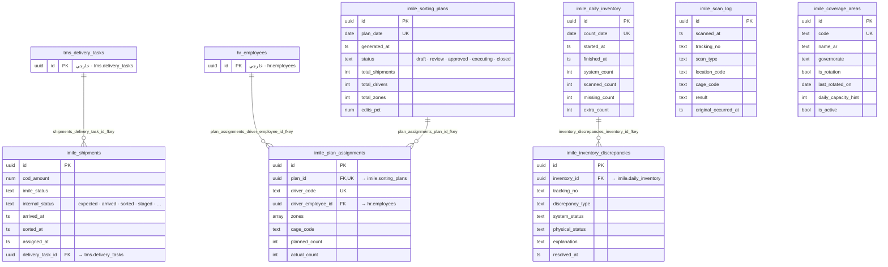

**جرد جداول `imile`**

| الجدول | الوصف (`obj_description`) | الأعمدة | RLS | `entity_id` | أعمدة الحالة والقيم المسموحة | المفاتيح الأجنبية |
|---|---|---|---|---|---|---|
| `agent_health` | — | 8 | نعم · internal_only | لا | — | — |
| `coverage_areas` | بلا بذرة عمداً: قائمة المناطق بيانات تشغيلية يُدخلها مشرف التوصيل (07 §10 بند 6) — لا تُخترع أسماء مناطق | 11 | نعم · reference_read, reference_write | لا | — | — |
| `daily_inventory` | — | 12 | نعم · internal_only | لا | — | — |
| `dispatch_autonomy` | — | 15 | نعم · internal_only | لا | `level`: `0` · `1` | — |
| `driver_id_assignments` | — | 10 | نعم · internal_only | لا | — | `driver_id_ref` → `imile.driver_ids` `employee_id` → `hr.employees` `handover_doc_id` → `platform.documents` |
| `driver_ids` | — | 10 | نعم · internal_only | لا | `status`: `available` · `assigned` · `suspended` `suspension_category`: `administrative` · `performance` · `conduct` · `permanent_ban` · `(أو فارغ)` | — |
| `driver_trust` | ADR-28 §9. الاحتفاظ 24 شهراً (تاريخ). لا يُعرض للسائق كقيمة مركّبة أبداً، ولا يُربط بأجر ولا بجزاء — EXECUTION-MASTER-v4 §1.13 (ex DECISIONS-ADDENDUM §9) و§11 | 19 | نعم · internal_only | لا | — | — |
| `driver_zone_exclusions` | — | 8 | نعم · internal_only | لا | — | `zone_code` → `imile.coverage_areas` |
| `dtl_problems` | — | 21 | نعم · internal_only | لا | `auditor_decision`: `accept` · `reject` · `human` · `reclassify` · `(أو فارغ)` `engine_decision`: `accept` · `reject` · `human` · `reclassify` · `(أو فارغ)` | — |
| `dtl_rule_autonomy` | ADR-27 §8: الاستقلالية تُكتسب لكل (نوع مشكلة × نوع قرار). reject لا يُؤتمت أبداً. العتبات في platform.thresholds تحت dtl.* | 14 | نعم · internal_only | لا | `level`: `0` · `1` `decision_kind`: `accept` · `reclassify` | — |
| `inventory_discrepancies` | — | 9 | نعم · internal_only | لا | — | `inventory_id` → `imile.daily_inventory` |
| `plan_assignments` | — | 9 | نعم · internal_only | لا | — | `driver_employee_id` → `hr.employees` `plan_id` → `imile.sorting_plans` |
| `scan_log` | — | 13 | نعم · internal_only | لا | — | — |
| `shipments` | — | 24 | نعم · internal_only | لا | `internal_status`: `expected` · `arrived` · `sorted` · `staged` · `assigned` · `ofd` · `delivered` · `failed` · `returned` | `delivery_task_id` → `tms.delivery_tasks` |
| `sorting_plans` | — | 13 | نعم · internal_only | لا | `approved_by_kind`: `human` · `engine` `status`: `draft` · `review` · `approved` · `executing` · `closed` | — |

### 2.11 مخطط `partners` — 6 جدولاً

الشركاء والمقاولة من الباطن: الشركاء وعقودهم وبنود أسعارهم.
وتخصيص الخدمات للشركاء، الأحداث المستحقة الدفع `payable_events` المرتبطة بالحدث القابل للفوترة، وفواتير الشركاء.

#### خريطة 2-11-1: `partners` — الجداول والعلاقات
تقرأ من الجدول الأصل (`||`) إلى الجدول التابع (`o{`)؛ اسم السهم هو اسم المفتاح الأجنبي في القاعدة. ملف منفصل: `diagrams/erd-partners.mmd`.

```mermaid
%% partners · الجداول والعلاقات
erDiagram
    partners_partners ||--o{ partners_partner_contracts : "partner_contracts_partner_id_fkey"
    partners_partner_contracts ||--o{ partners_partner_invoices : "partner_invoices_contract_id_fkey"
    partners_partners ||--o{ partners_partner_invoices : "partner_invoices_partner_id_fkey"
    partners_partner_contracts ||--o{ partners_partner_price_lines : "partner_price_lines_contract_id_fkey"
    catalog_services ||--o{ partners_partner_price_lines : "partner_price_lines_service_id_fkey"
    billing_billable_events ||--o{ partners_payable_events : "payable_events_billable_event_id_fkey"
    sales_accounts ||--o{ partners_payable_events : "payable_events_client_id_fkey"
    partners_partner_contracts ||--o{ partners_payable_events : "payable_events_contract_id_fkey"
    partners_partners ||--o{ partners_payable_events : "payable_events_partner_id_fkey"
    catalog_services ||--o{ partners_payable_events : "payable_events_service_id_fkey"
    sales_accounts ||--o{ partners_service_allocations : "service_allocations_client_id_fkey"
    partners_partner_contracts ||--o{ partners_service_allocations : "service_allocations_partner_contract_id_fkey"
    partners_partners ||--o{ partners_service_allocations : "service_allocations_partner_id_fkey"
    catalog_services ||--o{ partners_service_allocations : "service_allocations_service_id_fkey"

    partners_partner_contracts {
        uuid id PK
        uuid entity_id FK,UK "→ platform.entities"
        uuid partner_id FK "→ partners.partners"
        text status "draft · active · expired · terminated"
        date start_date
        num committed_qty
        num committed_monthly_cost
        num min_utilization_pct
    }
    partners_partner_invoices {
        uuid id PK
        uuid entity_id FK,UK "→ platform.entities"
        uuid partner_id FK,UK "→ partners.partners"
        uuid contract_id FK "→ partners.partner_contracts"
        num claimed_amount
        num matched_amount
        num variance_amount
        text status "received · matched · frozen · approved · paid · rejected"
    }
    partners_partner_price_lines {
        uuid id PK
        uuid contract_id FK,UK "→ partners.partner_contracts"
        uuid service_id FK,UK "→ catalog.services"
        num cost_price
        text uom
        num tier_from UK
        date valid_from
        date valid_to
    }
    partners_partners {
        uuid id PK
        text code UK
        text name_ar
        text name_en
        text partner_type
        text cr_number
        text tax_number
        text status "active · suspended · terminated"
    }
    partners_payable_events {
        uuid id PK
        uuid entity_id FK "→ platform.entities"
        uuid partner_id FK "→ partners.partners"
        uuid contract_id FK "→ partners.partner_contracts"
        uuid client_id FK "→ sales.accounts"
        uuid service_id FK "→ catalog.services"
        uuid billable_event_id FK "→ billing.billable_events"
        text status "pending · priced · invoiced · excluded · disputed"
    }
    partners_service_allocations {
        uuid id PK
        uuid entity_id FK "→ platform.entities"
        uuid client_id FK "→ sales.accounts"
        uuid service_id FK "→ catalog.services"
        uuid partner_id FK "→ partners.partners"
        uuid partner_contract_id FK "→ partners.partner_contracts"
        date valid_from
        date valid_to
    }
    catalog_services {
        uuid id PK "خارجي · catalog.services"
    }
    billing_billable_events {
        uuid id PK "خارجي · billing.billable_events"
    }
    sales_accounts {
        uuid id PK "خارجي · sales.accounts"
    }
```

**جرد جداول `partners`**

| الجدول | الوصف (`obj_description`) | الأعمدة | RLS | `entity_id` | أعمدة الحالة والقيم المسموحة | المفاتيح الأجنبية |
|---|---|---|---|---|---|---|
| `partner_contracts` | — | 26 | نعم · entity_scope | نعم | `liability_basis`: `3x_monthly` · `contract_value` · `(أو فارغ)` `status`: `draft` · `active` · `expired` · `terminated` | `entity_id` → `platform.entities` `partner_id` → `partners.partners` |
| `partner_invoices` | — | 22 | نعم · entity_scope | نعم | `status`: `received` · `matched` · `frozen` · `approved` · `paid` · `rejected` | `contract_id` → `partners.partner_contracts` `entity_id` → `platform.entities` `partner_id` → `partners.partners` |
| `partner_price_lines` | — | 9 | نعم · internal_only | لا | — | `contract_id` → `partners.partner_contracts` `service_id` → `catalog.services` |
| `partners` | — | 18 | نعم · internal_only | لا | `status`: `active` · `suspended` · `terminated` | — |
| `payable_events` | — | 18 | نعم · entity_scope | نعم | `status`: `pending` · `priced` · `invoiced` · `excluded` · `disputed` | `billable_event_id` → `billing.billable_events` `client_id` → `sales.accounts` `contract_id` → `partners.partner_contracts` `entity_id` → `platform.entities` `partner_id` → `partners.partners` `service_id` → `catalog.services` |
| `service_allocations` | — | 11 | نعم · entity_scope | نعم | — | `client_id` → `sales.accounts` `entity_id` → `platform.entities` `partner_contract_id` → `partners.partner_contracts` `partner_id` → `partners.partners` `service_id` → `catalog.services` |

### 2.12 مخطط `admin` — 12 جدولاً

الدورة الإدارية: طلبات الشراء وعروض الموردين وأوامر الشراء، وبنود الموازنة.
وطلبات الاعتماد وخطواتها، الأصول وعهدتها، الصندوق النثري وحركاته، المعاملات الحكومية والمراسلات.

#### خريطة 2-12-1: `admin` — الجداول والعلاقات
تقرأ من الجدول الأصل (`||`) إلى الجدول التابع (`o{`)؛ اسم السهم هو اسم المفتاح الأجنبي في القاعدة. ملف منفصل: `diagrams/erd-admin.mmd`.

```mermaid
%% admin · الجداول والعلاقات
erDiagram
    admin_approval_requests ||--o{ admin_approval_steps : "approval_steps_request_id_fkey"
    admin_assets ||--o{ admin_asset_custody : "asset_custody_asset_id_fkey"
    hr_employees ||--o{ admin_asset_custody : "asset_custody_employee_id_fkey"
    platform_documents ||--o{ admin_asset_custody : "asset_custody_handover_doc_id_fkey"
    hr_employees ||--o{ admin_assets : "assets_current_holder_id_fkey"
    admin_purchase_orders ||--o{ admin_assets : "assets_purchase_order_id_fkey"
    billing_gl_accounts ||--o{ admin_budget_lines : "budget_lines_gl_account_id_fkey"
    admin_correspondence ||--o{ admin_correspondence : "correspondence_reply_to_id_fkey"
    hr_recruitment_cases ||--o{ admin_gov_transactions : "gov_transactions_recruitment_case_id_fkey"
    hr_employees ||--o{ admin_petty_cash : "petty_cash_holder_employee_id_fkey"
    sales_accounts ||--o{ admin_petty_cash_transactions : "petty_cash_transactions_client_id_fkey"
    admin_petty_cash ||--o{ admin_petty_cash_transactions : "petty_cash_transactions_fund_id_fkey"
    billing_gl_accounts ||--o{ admin_petty_cash_transactions : "petty_cash_transactions_gl_account_id_fkey"
    sales_accounts ||--o{ admin_purchase_orders : "purchase_orders_client_id_fkey"
    admin_purchase_requests ||--o{ admin_purchase_orders : "purchase_orders_request_id_fkey"
    partners_partners ||--o{ admin_purchase_orders : "purchase_orders_vendor_id_fkey"
    admin_budget_lines ||--o{ admin_purchase_requests : "purchase_requests_budget_line_id_fkey"
    sales_accounts ||--o{ admin_purchase_requests : "purchase_requests_client_id_fkey"
    hr_org_units ||--o{ admin_purchase_requests : "purchase_requests_org_unit_id_fkey"
    partners_partners ||--o{ admin_vendor_quotes : "vendor_quotes_partner_id_fkey"
    admin_purchase_requests ||--o{ admin_vendor_quotes : "vendor_quotes_request_id_fkey"

    admin_approval_requests {
        uuid id PK
        uuid entity_id FK,UK "→ platform.entities"
        text doc_no UK
        text request_type
        num amount
        text status "pending · approved · rejected · expired · delegated"
        ts due_at
        ts completed_at
    }
    admin_approval_steps {
        uuid id PK
        uuid request_id FK,UK "→ admin.approval_requests"
        int step_no UK
        text approver_role
        uuid approver_user_id
        ts delegation_expires_at
        text decision
        ts decided_at
    }
    admin_asset_custody {
        uuid id PK
        uuid asset_id FK "→ admin.assets"
        uuid employee_id FK "→ hr.employees"
        ts issued_at
        uuid issued_by
        ts returned_at
        num charged_amount
        uuid handover_doc_id FK "→ platform.documents"
    }
    admin_assets {
        uuid id PK
        uuid entity_id FK "→ platform.entities"
        text code UK
        uuid purchase_order_id FK "→ admin.purchase_orders"
        num purchase_value
        date purchase_date
        text status "in_stock · in_custody · maintenance · disposed"
        uuid current_holder_id FK "→ hr.employees"
    }
    admin_budget_lines {
        uuid id PK
        uuid entity_id FK,UK "→ platform.entities"
        int fiscal_year UK
        text cost_center UK
        uuid gl_account_id FK,UK "→ billing.gl_accounts"
        num annual_amount
        num committed_amount
        num spent_amount
    }
    admin_correspondence {
        uuid id PK
        uuid entity_id FK,UK "→ platform.entities"
        text doc_no UK
        text direction
        text correspondent
        ts due_at
        text status "open · replied · closed"
        uuid reply_to_id FK "→ admin.correspondence"
    }
    admin_gov_transactions {
        uuid id PK
        uuid entity_id FK,UK "→ platform.entities"
        uuid recruitment_case_id FK "→ hr.recruitment_cases"
        text stage "requested · submitted · in_progress · completed · rejected"
        ts stage_started_at
        ts due_at
        num fees_paid
        ts completed_at
    }
    admin_petty_cash {
        uuid id PK
        uuid entity_id FK "→ platform.entities"
        uuid holder_employee_id FK "→ hr.employees"
        num limit_amount
        num current_balance
        text status "active · closed"
        date opened_at
        date closed_at
    }
    admin_petty_cash_transactions {
        uuid id PK
        uuid fund_id FK "→ admin.petty_cash"
        ts occurred_at
        text txn_type
        num amount
        text description
        uuid client_id FK "→ sales.accounts"
        uuid gl_account_id FK "→ billing.gl_accounts"
    }
    admin_purchase_orders {
        uuid id PK
        uuid entity_id FK,UK "→ platform.entities"
        uuid request_id FK "→ admin.purchase_requests"
        uuid vendor_id FK "→ partners.partners"
        uuid client_id FK "→ sales.accounts"
        num total_amount
        text status "issued · received · matched · paid · cancelled"
        num received_amount
    }
    admin_purchase_requests {
        uuid id PK
        uuid entity_id FK,UK "→ platform.entities"
        uuid org_unit_id FK "→ hr.org_units"
        uuid client_id FK "→ sales.accounts"
        uuid budget_line_id FK "→ admin.budget_lines"
        num estimated_amount
        text status "draft · pending_approval · approved · rejected · ordered · cancelled"
        date needed_by
    }
    admin_vendor_quotes {
        uuid id PK
        uuid request_id FK "→ admin.purchase_requests"
        uuid partner_id FK "→ partners.partners"
        text vendor_name
        num amount
        int delivery_days
        date validity_date
        bool is_selected
    }
    hr_employees {
        uuid id PK "خارجي · hr.employees"
    }
    platform_documents {
        uuid id PK "خارجي · platform.documents"
    }
    billing_gl_accounts {
        uuid id PK "خارجي · billing.gl_accounts"
    }
    hr_recruitment_cases {
        uuid id PK "خارجي · hr.recruitment_cases"
    }
    sales_accounts {
        uuid id PK "خارجي · sales.accounts"
    }
    partners_partners {
        uuid id PK "خارجي · partners.partners"
    }
    hr_org_units {
        uuid id PK "خارجي · hr.org_units"
    }
```

**جرد جداول `admin`**

| الجدول | الوصف (`obj_description`) | الأعمدة | RLS | `entity_id` | أعمدة الحالة والقيم المسموحة | المفاتيح الأجنبية |
|---|---|---|---|---|---|---|
| `approval_requests` | — | 13 | نعم · entity_scope | نعم | `status`: `pending` · `approved` · `rejected` · `expired` · `delegated` | `entity_id` → `platform.entities` |
| `approval_steps` | — | 10 | نعم · internal_only | لا | — | `request_id` → `admin.approval_requests` |
| `asset_custody` | — | 12 | نعم · internal_only | لا | — | `asset_id` → `admin.assets` `employee_id` → `hr.employees` `handover_doc_id` → `platform.documents` |
| `assets` | — | 14 | نعم · entity_scope | نعم | `status`: `in_stock` · `in_custody` · `maintenance` · `disposed` | `current_holder_id` → `hr.employees` `entity_id` → `platform.entities` `purchase_order_id` → `admin.purchase_orders` |
| `budget_lines` | — | 9 | نعم · entity_scope | نعم | — | `entity_id` → `platform.entities` `gl_account_id` → `billing.gl_accounts` |
| `correspondence` | — | 15 | نعم · entity_scope | نعم | `status`: `open` · `replied` · `closed` | `entity_id` → `platform.entities` `reply_to_id` → `admin.correspondence` |
| `gov_transactions` | — | 22 | نعم · entity_scope | نعم | `stage`: `requested` · `submitted` · `in_progress` · `completed` · `rejected` | `entity_id` → `platform.entities` `recruitment_case_id` → `hr.recruitment_cases` |
| `petty_cash` | — | 10 | نعم · entity_scope | نعم | `status`: `active` · `closed` | `entity_id` → `platform.entities` `holder_employee_id` → `hr.employees` |
| `petty_cash_transactions` | — | 12 | نعم · internal_only | لا | — | `client_id` → `sales.accounts` `fund_id` → `admin.petty_cash` `gl_account_id` → `billing.gl_accounts` |
| `purchase_orders` | — | 19 | نعم · entity_scope | نعم | `status`: `issued` · `received` · `matched` · `paid` · `cancelled` | `client_id` → `sales.accounts` `entity_id` → `platform.entities` `request_id` → `admin.purchase_requests` `vendor_id` → `partners.partners` |
| `purchase_requests` | — | 17 | نعم · entity_scope | نعم | `status`: `draft` · `pending_approval` · `approved` · `rejected` · `ordered` · `cancelled` | `budget_line_id` → `admin.budget_lines` `client_id` → `sales.accounts` `entity_id` → `platform.entities` `org_unit_id` → `hr.org_units` |
| `vendor_quotes` | — | 10 | نعم · internal_only | لا | — | `partner_id` → `partners.partners` `request_id` → `admin.purchase_requests` |

### 2.13 مخطط `housing` — 10 جدولاً

إدارة السكن: العقارات والوحدات والغرف والأسرّة، حجز الأسرّة وإسنادها للموظفين.
وفواتير المرافق، طلبات الصيانة، عمليات التفتيش، وأصول السكن.

#### خريطة 2-13-1: `housing` — الجداول والعلاقات
تقرأ من الجدول الأصل (`||`) إلى الجدول التابع (`o{`)؛ اسم السهم هو اسم المفتاح الأجنبي في القاعدة. ملف منفصل: `diagrams/erd-housing.mmd`.

```mermaid
%% housing · الجداول والعلاقات
erDiagram
    housing_rooms ||--o{ housing_assets : "assets_room_id_fkey"
    housing_units ||--o{ housing_assets : "assets_unit_id_fkey"
    housing_beds ||--o{ housing_bed_assignments : "bed_assignments_bed_id_fkey"
    hr_employees ||--o{ housing_bed_assignments : "bed_assignments_employee_id_fkey"
    platform_documents ||--o{ housing_bed_assignments : "bed_assignments_handover_doc_id_fkey"
    housing_beds ||--o{ housing_bed_reservations : "bed_reservations_bed_id_fkey"
    hr_recruitment_cases ||--o{ housing_bed_reservations : "bed_reservations_recruitment_case_id_fkey"
    housing_rooms ||--o{ housing_beds : "beds_room_id_fkey"
    housing_units ||--o{ housing_inspections : "inspections_unit_id_fkey"
    housing_assets ||--o{ housing_maintenance_requests : "maintenance_requests_housing_asset_id_fkey"
    housing_properties ||--o{ housing_maintenance_requests : "maintenance_requests_property_id_fkey"
    admin_purchase_orders ||--o{ housing_maintenance_requests : "maintenance_requests_purchase_order_id_fkey"
    housing_rooms ||--o{ housing_maintenance_requests : "maintenance_requests_room_id_fkey"
    housing_units ||--o{ housing_maintenance_requests : "maintenance_requests_unit_id_fkey"
    partners_partners ||--o{ housing_maintenance_requests : "maintenance_requests_vendor_id_fkey"
    housing_units ||--o{ housing_rooms : "rooms_unit_id_fkey"
    housing_properties ||--o{ housing_units : "units_property_id_fkey"
    housing_properties ||--o{ housing_utility_bills : "utility_bills_property_id_fkey"
    admin_purchase_orders ||--o{ housing_utility_bills : "utility_bills_purchase_order_id_fkey"
    housing_units ||--o{ housing_utility_bills : "utility_bills_unit_id_fkey"

    housing_assets {
        uuid id PK
        uuid unit_id FK "→ housing.units"
        uuid room_id FK "→ housing.rooms"
        date purchase_date
        num purchase_value
        date last_service_date
        date next_service_date
        text status "working · faulty · replaced"
    }
    housing_bed_assignments {
        uuid id PK
        uuid bed_id FK "→ housing.beds"
        uuid employee_id FK "→ hr.employees"
        date assigned_from
        date assigned_to
        uuid assigned_by
        uuid handover_doc_id FK "→ platform.documents"
        ts original_occurred_at
    }
    housing_bed_reservations {
        uuid id PK
        uuid bed_id FK "→ housing.beds"
        uuid recruitment_case_id FK "→ hr.recruitment_cases"
        text reserved_for
        date reserved_from
        date expires_at
        uuid reserved_by
        text status "active · converted · expired · cancelled"
    }
    housing_beds {
        uuid id PK
        uuid room_id FK,UK "→ housing.rooms"
        text code UK
        text bed_type
        text status "available · occupied · reserved · maintenance · blocked"
        text block_reason
    }
    housing_inspections {
        uuid id PK
        uuid entity_id FK,UK "→ platform.entities"
        text doc_no UK
        uuid unit_id FK "→ housing.units"
        ts inspected_at
        int cleanliness_score
        int safety_score
        date follow_up_date
    }
    housing_maintenance_requests {
        uuid id PK
        uuid entity_id FK,UK "→ platform.entities"
        uuid property_id FK "→ housing.properties"
        uuid unit_id FK "→ housing.units"
        uuid room_id FK "→ housing.rooms"
        uuid housing_asset_id FK "→ housing.assets"
        uuid vendor_id FK "→ partners.partners"
        uuid purchase_order_id FK "→ admin.purchase_orders"
    }
    housing_properties {
        uuid id PK
        uuid entity_id FK "→ platform.entities"
        text code UK
        text name
        date lease_start
        date lease_end
        num deposit_amount
        text status
    }
    housing_rooms {
        uuid id PK
        uuid unit_id FK,UK "→ housing.units"
        text code UK
        text room_type
        num area_sqm
        int bed_capacity
        bool has_ac
        text status "active · inactive"
    }
    housing_units {
        uuid id PK
        uuid property_id FK,UK "→ housing.properties"
        text code UK
        text floor
        text unit_no
        text unit_type
        num monthly_rent
        text status "active · inactive"
    }
    housing_utility_bills {
        uuid id PK
        uuid entity_id FK "→ platform.entities"
        uuid property_id FK "→ housing.properties"
        uuid unit_id FK "→ housing.units"
        date period_from
        date period_to
        num amount
        uuid purchase_order_id FK "→ admin.purchase_orders"
    }
    hr_employees {
        uuid id PK "خارجي · hr.employees"
    }
    platform_documents {
        uuid id PK "خارجي · platform.documents"
    }
    hr_recruitment_cases {
        uuid id PK "خارجي · hr.recruitment_cases"
    }
    admin_purchase_orders {
        uuid id PK "خارجي · admin.purchase_orders"
    }
    partners_partners {
        uuid id PK "خارجي · partners.partners"
    }
```

**جرد جداول `housing`**

| الجدول | الوصف (`obj_description`) | الأعمدة | RLS | `entity_id` | أعمدة الحالة والقيم المسموحة | المفاتيح الأجنبية |
|---|---|---|---|---|---|---|
| `assets` | — | 12 | نعم · internal_only | لا | `status`: `working` · `faulty` · `replaced` | `room_id` → `housing.rooms` `unit_id` → `housing.units` |
| `bed_assignments` | — | 14 | نعم · internal_only | لا | — | `bed_id` → `housing.beds` `employee_id` → `hr.employees` `handover_doc_id` → `platform.documents` |
| `bed_reservations` | — | 9 | نعم · internal_only | لا | `status`: `active` · `converted` · `expired` · `cancelled` | `bed_id` → `housing.beds` `recruitment_case_id` → `hr.recruitment_cases` |
| `beds` | — | 6 | نعم · internal_only | لا | `status`: `available` · `occupied` · `reserved` · `maintenance` · `blocked` | `room_id` → `housing.rooms` |
| `inspections` | — | 14 | نعم · entity_scope | نعم | — | `entity_id` → `platform.entities` `unit_id` → `housing.units` |
| `maintenance_requests` | — | 24 | نعم · entity_scope | نعم | `status`: `open` · `assigned` · `in_progress` · `resolved` · `done` · `closed` · `rejected` · `cancelled` | `entity_id` → `platform.entities` `housing_asset_id` → `housing.assets` `property_id` → `housing.properties` `purchase_order_id` → `admin.purchase_orders` `room_id` → `housing.rooms` `unit_id` → `housing.units` `vendor_id` → `partners.partners` |
| `properties` | — | 22 | نعم · entity_scope | نعم | — | `entity_id` → `platform.entities` |
| `rooms` | — | 8 | نعم · internal_only | لا | `status`: `active` · `inactive` | `unit_id` → `housing.units` |
| `units` | — | 10 | نعم · internal_only | لا | `status`: `active` · `inactive` | `property_id` → `housing.properties` |
| `utility_bills` | — | 14 | نعم · entity_scope | نعم | — | `entity_id` → `platform.entities` `property_id` → `housing.properties` `purchase_order_id` → `admin.purchase_orders` `unit_id` → `housing.units` |

### 2.14 مخطط `governance` — 14 جدولاً

—

#### خريطة 2-14-1: `governance` — الجداول والعلاقات
تقرأ من الجدول الأصل (`||`) إلى الجدول التابع (`o{`)؛ اسم السهم هو اسم المفتاح الأجنبي في القاعدة. ملف منفصل: `diagrams/erd-governance.mmd`.

```mermaid
%% governance · الجداول والعلاقات
erDiagram
    governance_budgets ||--o{ governance_budget_lines : "budget_lines_budget_id_fkey"
    billing_gl_accounts ||--o{ governance_budget_lines : "budget_lines_gl_account_id_fkey"
    governance_ncr ||--o{ governance_corrective_actions : "corrective_actions_ncr_id_fkey"
    identity_roles ||--o{ governance_corrective_actions : "corrective_actions_owner_role_fkey"
    governance_decisions ||--o{ governance_decisions : "decisions_supersedes_id_fkey"
    governance_kpis ||--o{ governance_key_results : "key_results_kpi_id_fkey"
    governance_objectives ||--o{ governance_key_results : "key_results_objective_id_fkey"
    governance_kpis ||--o{ governance_kpi_actuals : "kpi_actuals_kpi_id_fkey"
    governance_kpis ||--o{ governance_kpi_targets : "kpi_targets_kpi_id_fkey"
    identity_roles ||--o{ governance_kpis : "kpis_owner_role_fkey"
    governance_kpis ||--o{ governance_kpis : "kpis_parent_id_fkey"
    identity_roles ||--o{ governance_ncr : "ncr_owner_role_fkey"
    identity_roles ||--o{ governance_objectives : "objectives_owner_role_fkey"
    governance_policies ||--o{ governance_policy_acknowledgements : "policy_acknowledgements_policy_id_fkey"
    governance_risks ||--o{ governance_risk_reviews : "risk_reviews_risk_id_fkey"
    identity_roles ||--o{ governance_risks : "risks_owner_role_fkey"

    governance_budget_lines {
        uuid id PK
        uuid budget_id FK,UK "→ governance.budgets"
        uuid gl_account_id FK,UK "→ billing.gl_accounts"
        date month UK
        num planned_amount
        num actual_amount
        num variance_amount
        num variance_pct
    }
    governance_budgets {
        uuid id PK
        uuid entity_id FK,UK "→ platform.entities"
        int fiscal_year UK
        text cost_center UK
        text status "draft · approved · locked · closed"
        uuid approved_by
        ts approved_at
        ts created_at
    }
    governance_corrective_actions {
        uuid id PK
        uuid ncr_id FK "→ governance.ncr"
        text action_ar
        text owner_role FK "→ identity.roles"
        date due_date
        ts completed_at
        ts verified_at
        text status "open · in_progress · done · verified · cancelled"
    }
    governance_decisions {
        uuid id PK
        text code UK
        text title_ar
        text decision_ar
        text rationale_ar
        date decided_at
        uuid supersedes_id FK "→ governance.decisions"
        text status "active · superseded · revoked"
    }
    governance_key_results {
        uuid id PK
        uuid objective_id FK "→ governance.objectives"
        text title_ar
        uuid kpi_id FK "→ governance.kpis"
        num baseline_value
        num target_value
        num current_value
        num progress_pct
    }
    governance_kpi_actuals {
        uuid id PK
        uuid kpi_id FK,UK "→ governance.kpis"
        date period UK
        num actual_value
        ts measured_at
    }
    governance_kpi_targets {
        uuid id PK
        uuid kpi_id FK,UK "→ governance.kpis"
        date period_start UK
        date period_end UK
        num target_value
        uuid set_by
        ts set_at
    }
    governance_kpis {
        uuid id PK
        text code UK
        text name_ar
        text level "group · entity · module"
        uuid parent_id FK "→ governance.kpis"
        uuid entity_id FK "→ platform.entities"
        text owner_role FK "→ identity.roles"
        bool is_active
    }
    governance_ncr {
        uuid id PK
        uuid entity_id FK,UK "→ platform.entities"
        text doc_no UK
        text title_ar
        ts raised_at
        text owner_role FK "→ identity.roles"
        text status "open · investigating · action_pending · verifying · closed"
        ts closed_at
    }
    governance_objectives {
        uuid id PK
        uuid entity_id FK "→ platform.entities"
        text code UK
        text title_ar
        text quarter
        text owner_role FK "→ identity.roles"
        text status "draft · active · achieved · missed · cancelled"
        ts created_at
    }
    governance_policies {
        uuid id PK
        text code UK
        text title_ar
        int version UK
        text body_url
        date effective_from
        ts approved_at
        bool is_active
    }
    governance_policy_acknowledgements {
        uuid id PK
        uuid policy_id FK,UK "→ governance.policies"
        uuid user_id FK,UK "→ identity.users"
        ts acknowledged_at
        text ip_address
    }
    governance_risk_reviews {
        uuid id PK
        uuid risk_id FK "→ governance.risks"
        ts reviewed_at
        uuid reviewed_by
        int likelihood
        int impact
        text finding
        date next_review_date
    }
    governance_risks {
        uuid id PK
        uuid entity_id FK "→ platform.entities"
        text code UK
        int score
        text owner_role FK "→ identity.roles"
        text status "open · mitigating · accepted · closed"
        ts opened_at
        ts closed_at
    }
    billing_gl_accounts {
        uuid id PK "خارجي · billing.gl_accounts"
    }
    identity_roles {
        uuid id PK "خارجي · identity.roles"
    }
```

**جرد جداول `governance`**

| الجدول | الوصف (`obj_description`) | الأعمدة | RLS | `entity_id` | أعمدة الحالة والقيم المسموحة | المفاتيح الأجنبية |
|---|---|---|---|---|---|---|
| `budget_lines` | — | 9 | نعم · internal_only | لا | — | `budget_id` → `governance.budgets` `gl_account_id` → `billing.gl_accounts` |
| `budgets` | — | 8 | نعم · entity_scope | نعم | `status`: `draft` · `approved` · `locked` · `closed` | `entity_id` → `platform.entities` |
| `corrective_actions` | — | 10 | نعم · internal_only | لا | `status`: `open` · `in_progress` · `done` · `verified` · `cancelled` | `ncr_id` → `governance.ncr` `owner_role` → `identity.roles` |
| `decisions` | 36 §6-2 · 40 §C9: سجل القرارات المركزي الدائم. غير platform.decisions الذي هو صندوق قرارات التشغيل اليومي ويختفي بنده بالبتّ (40 §B5) — SCH-4 ق-27 | 10 | نعم · internal_only | لا | `status`: `active` · `superseded` · `revoked` | `supersedes_id` → `governance.decisions` |
| `key_results` | — | 9 | نعم · internal_only | لا | — | `kpi_id` → `governance.kpis` `objective_id` → `governance.objectives` |
| `kpi_actuals` | — | 5 | نعم · internal_only | لا | — | `kpi_id` → `governance.kpis` |
| `kpi_targets` | — | 7 | نعم · internal_only | لا | — | `kpi_id` → `governance.kpis` |
| `kpis` | — | 13 | نعم · entity_scope | نعم | `direction`: `higher_better` · `lower_better` `level`: `group` · `entity` · `module` | `entity_id` → `platform.entities` `owner_role` → `identity.roles` `parent_id` → `governance.kpis` |
| `ncr` | — | 13 | نعم · entity_scope | نعم | `status`: `open` · `investigating` · `action_pending` · `verifying` · `closed` | `entity_id` → `platform.entities` `owner_role` → `identity.roles` |
| `objectives` | — | 8 | نعم · entity_scope | نعم | `status`: `draft` · `active` · `achieved` · `missed` · `cancelled` | `entity_id` → `platform.entities` `owner_role` → `identity.roles` |
| `policies` | — | 10 | نعم · internal_only | لا | — | — |
| `policy_acknowledgements` | — | 5 | نعم · internal_only | لا | — | `policy_id` → `governance.policies` `user_id` → `identity.users` |
| `risk_reviews` | — | 8 | نعم · internal_only | لا | — | `risk_id` → `governance.risks` |
| `risks` | — | 13 | نعم · entity_scope | نعم | `category`: `operational` · `financial` · `legal` · `safety` · `technology` · `commercial` `status`: `open` · `mitigating` · `accepted` · `closed` | `entity_id` → `platform.entities` `owner_role` → `identity.roles` |

## 3. جرد العتبات — `platform.thresholds`

كل حدّ رقمي قابل للضبط في النظام يعيش هنا؛ لا حد مبرمَج داخل الكود. التعديل يتطلب صلاحية `platform.reference.manage` ويُسجَّل في `changed_by` + `changed_at`.

| المفتاح | القيمة | الوحدة | الوصف |
|---|---|---|---|
| `catalog.min_price_markup_pct` | 15.000 | pct | min_price = standard_cost × 1.15 — EXEC §1.1 |
| `contract.gm_margin_pct` | 10.000 | pct | هامش العقد — تحته اعتماد GM — EXEC §1.1 |
| `contract.min_margin_pct` | 15.000 | pct | هامش العقد — تحته تحذير — EXEC §1.1 |
| `dispatch.demotion.consecutive_plans` | 2.000 | count | ADR-27: خطتان متتاليتان تجاوزتا حد التعديل ⇒ تنزيل |
| `dispatch.demotion.first_attempt_drop_pts` | 10.000 | points | ADR-27: هبوط معدّل النجاح من أول محاولة > 10 نقاط عن متوسط 30 يوماً ⇒ تنزيل |
| `dispatch.demotion.max_edits_pct` | 20.000 | pct | ADR-27: حد التعديل على الخطة 20% |
| `dispatch.gate.max_overflow_pct` | 3.000 | pct | ADR-27: بوابة الجودة — فائض غير مُسنَد ≤ 3% مع قائمة مُرحَّلة |
| `dispatch.gate.max_zones_per_driver` | 3.000 | count | ADR-27: بوابة الجودة — ≤ 3 مناطق للسائق |
| `dispatch.gate.min_drivers_zone_cap_pct` | 95.000 | pct | ADR-27: بوابة الجودة — ≥ 95% من السائقين ضمن حد المناطق |
| `dispatch.promotion.min_plans` | 14.000 | count | ADR-27: الاستقلالية تُكتسب بعد 14 خطة |
| `dispatch.promotion.min_unchanged_pct` | 90.000 | pct | ADR-27: الترقية تتطلب قبولاً بلا تعديل ≥ 90% |
| `driver.bonus_first_attempt_pct` | 85.000 | pct | عتبة النجاح من أول محاولة لاستحقاق البونص — EXEC §1.2 |
| `driver.commission_base` | 0.300 | KWD | عمولة الشحنة المسلَّمة — EXEC §1.2 |
| `driver.commission_bonus` | 0.050 | KWD | بونص الجودة للشحنة — EXEC §1.2 |
| `driver.custody.alert_hours` | 24.000 | hours | تنبيه العهدة الفاشلة — 35 §7 (v4: فُصل عن التصعيد) |
| `driver.custody.escalate_hours` | 48.000 | hours | تصعيد العهدة الفاشلة — 35 §7 |
| `driver.payment.link_ttl_min` | 30.000 | minutes | مهلة رابط الدفع — 40 §B5 |
| `dtl.auto_close.max_cod_kwd` | 20.000 | KWD | ADR-27: الإغلاق الآلي يشترط قيمة تحصيل ≤ 20.000 د.ك |
| `dtl.auto_close.min_confidence` | 0.900 | ratio | ADR-27: الإغلاق الآلي يشترط ثقة المحرّك ≥ 0.90 |
| `dtl.auto_close.min_driver_trust` | 0.800 | ratio | ADR-27: الإغلاق الآلي يشترط ثقة السائق ≥ 0.80 |
| `dtl.demotion.accuracy_floor` | 0.950 | ratio | ADR-27: أي يوم دقته < 0.95 ⇒ تنزيل فوري |
| `dtl.promotion.consecutive_days` | 14.000 | days | ADR-27: الترقية 0→1 تتطلب 14 يوماً متتالياً |
| `dtl.promotion.min_accuracy` | 0.970 | ratio | ADR-27: الترقية تتطلب دقة ≥ 0.97 |
| `dtl.promotion.min_cases` | 50.000 | count | ADR-27: الترقية تتطلب ≥ 50 حالة في النافذة |
| `dtl.review.random_sample_pct` | 5.000 | pct | ADR-27: إعادة مراجعة عشوائية يومية لـ 5% من الإغلاقات الآلية |
| `fleet.pm_brakes_km` | 20000.000 | km | صيانة وقائية — الفرامل — EXEC §1.3 |
| `fleet.pm_oil_days` | 90.000 | days | صيانة وقائية — الزيت بالزمن — EXEC §1.3 |
| `fleet.pm_oil_km` | 5000.000 | km | صيانة وقائية — الزيت — EXEC §1.3 |
| `fleet.pm_tyres_km` | 40000.000 | km | صيانة وقائية — الإطارات — EXEC §1.3 |
| `housing.deduction` | 23.000 | KWD | خصم السكن الشهري — EXEC §1.2/§1.3 |
| `housing.min_occupancy_pct` | 70.000 | pct | إشغال السكن قبل مراجعة الإيجار — EXEC §1.3 |
| `housing.phone_deduction` | 5.000 | KWD | خصم الهاتف الشهري — EXEC §1.2 |
| `housing.residency_deduction` | 12.000 | KWD | خصم الإقامة الشهري — EXEC §1.2 |
| `invoice.auto_approve_max` | 500.000 | KWD | سقف الاعتماد الآلي للفاتورة — EXEC §1.1 |
| `partner.liability_cap_months` | 3.000 | months | سقف المسؤولية = min(3 × الفوترة الشهرية، قيمة العقد) — EXEC §1.1 |
| `partner.match_tolerance_pct` | 2.000 | pct | تفاوت مطابقة فاتورة الشريك — 40 §C6 · 09 §5-1 (مُسجَّل في EXECUTION-MASTER-v4 §1.1) |
| `purchase.auto_max` | 100.000 | KWD | شراء ≤ 100 يُعتمد آلياً — EXEC §1.1 |
| `purchase.cfo_max` | 2000.000 | KWD | شراء 500–2,000 المدير المالي · فوقها GM — EXEC §1.1 |
| `purchase.manager_max` | 500.000 | KWD | شراء 100–500 مدير القسم — EXEC §1.1 |
| `purchase.three_quotes_min` | 500.000 | KWD | ثلاثة عروض أسعار فوق هذا المبلغ — 11 §3 · 12 س14 |
| `recruitment.escalate_days` | 11.000 | days | تصعيد مرحلة الاستقدام — 40 Part E S13 (7 + 50%) |
| `recruitment.escalate_pct` | 50.000 | pct | نسبة تجاوز SLA الموجبة للتصعيد — 10 §5 (للعرض) |
| `sales.commission.collection_max_days` | 60.000 | days | لا عمولة على تحصيل تأخّر أكثر من هذه المدة — SCR-SC-01 (ابتدائية — قرار GM · D-14 §8) |
| `sales.commission.dispute_window_hours` | 48.000 | hours | نافذة اعتراض المندوب على كشف العمولة — SCR-SC-01 (ابتدائية — قرار GM · D-14 §8) |
| `sales.commission.duration_months` | 24.000 | months | مدة استمرار العمولة المتكررة — 0 = بلا نهاية — SCR-SC-01 (ابتدائية — قرار GM · D-14 §8) |
| `sales.commission.manager_override_pct` | 0.500 | pct | النسبة الإشرافية لمدير المبيعات — SCR-SC-01 (ابتدائية — قرار GM · D-14 §8) |
| `sales.commission.max_monthly_kwd` | 0.000 | KWD | سقف العمولة الشهرية للمندوب — 0 = بلا سقف — SCR-SC-01 (ابتدائية — قرار GM · D-14 §8) |
| `sales.commission.min_margin_pct` | 15.000 | pct | لا عمولة على عقد تحت هذا الهامش إلا بموافقة GM — EXEC §1.1 (ابتدائية — قرار GM · D-14 §8) |
| `sales.commission.one_time_multiplier` | 1.000 | ratio | مضاعف عمولة المرة الواحدة من متوسط الفوترة الشهرية — SCR-SC-01 (ابتدائية — قرار GM · D-14 §8) |
| `sales.commission.rate_cc_pct` | 3.000 | pct | نسبة عمولة الكول سنتر CC — SCR-SC-01 (ابتدائية — قرار GM · D-14 §8) |
| `sales.commission.rate_delivery_pct` | 2.000 | pct | نسبة عمولة التوصيل DL — SCR-SC-01 (ابتدائية — قرار GM · D-14 §8) |
| `sales.commission.rate_services_pct` | 5.000 | pct | نسبة عمولة الخدمات HD/OF/VA — SCR-SC-01 (ابتدائية — قرار GM · D-14 §8) |
| `sales.commission.rate_storage_pct` | 3.000 | pct | نسبة عمولة التخزين ST — SCR-SC-01 (ابتدائية — قرار GM · D-14 §8) |
| `sales.commission.split_on_execute_pct` | 50.000 | pct | حصة دفعة بدء التنفيذ الفعلي — SCR-SC-01 (ابتدائية — قرار GM · D-14 §8) |
| `sales.commission.split_on_sign_pct` | 50.000 | pct | حصة دفعة التوقيع من عمولة المرة الواحدة — SCR-SC-01 (ابتدائية — قرار GM · D-14 §8) |
| `space.buffer_pct` | 7.000 | pct | العازل التشغيلي من طاقة الكتلة — EXEC §1.1 · 17 §5-1 |
| `space.reservation_max_days` | 30.000 | days | أقصى مدة حجز مساحة — EXEC §1.1 |
| `wo.max_active_tasks_per_worker` | 3.000 | count | أقصى مهام نشطة لعامل واحد في آن — SCR-WO-01 (ابتدائية — قرار GM · 12 §10-3 D-1) |
| `wo.sla.check_min` | 30.000 | minutes | SLA مهمة التدقيق — SCR-WO-01 (ابتدائية — قرار GM · 12 §10-3 D-1) |
| `wo.sla.pack_min` | 30.000 | minutes | SLA مهمة التغليف — SCR-WO-01 (ابتدائية — قرار GM · 12 §10-3 D-1) |
| `wo.sla.pick_min` | 60.000 | minutes | SLA مهمة الالتقاط — SCR-WO-01 (ابتدائية — قرار GM · 12 §10-3 D-1) |
| `wo.sla.putaway_min` | 120.000 | minutes | SLA مهمة التخزين — SCR-WO-01 (ابتدائية — قرار GM · 12 §10-3 D-1) |
| `wo.sla.receive_min` | 240.000 | minutes | SLA مهمة الاستلام — SCR-WO-01 (ابتدائية — قرار GM · 12 §10-3 D-1) |
| `wo.sla.vas_min` | 480.000 | minutes | SLA مهمة القيمة المضافة — SCR-WO-01 (ابتدائية — قرار GM · 12 §10-3 D-1) |
| `work.at_risk_pct` | 80.000 | pct | نسبة انقضاء نافذة SLA التي يصير عندها البند at_risk في لوحات التركيز — مأخوذة من منطق N-14 ومعمَّمة على المصادر الأحد عشر (ابتدائية — قرار GM · 15 §8 B-7) |

## 4. البذور المرجعية وأعدادها الفعلية

عدد الصفوف الموجود فعلاً في القاعدة وقت التوليد. الصفر يعني أن البذرة لم تُطبَّق بعد.

| الجدول | المحتوى | عدد الصفوف |
|---|---|---|
| `identity.roles` | الأدوار | **26** |
| `identity.permissions` | الصلاحيات | **2** |
| `identity.role_permissions` | ربط الدور بالصلاحية | **3** |
| `identity.sod_rules` | قواعد فصل المهام | **4** |
| `identity.column_classification` | تصنيف الأعمدة الحساسة | **0** |
| `catalog.service_categories` | فئات الخدمات | **7** |
| `catalog.services` | الخدمات | **92** |
| `catalog.segments` | شرائح العملاء | **6** |
| `hr.penalty_schedule` | بنود لائحة الجزاءات | **77** |
| `hr.recruitment_stages` | مراحل الاستقدام | **17** |
| `hr.commission_rules` | قواعد العمولة | **1** |
| `hr.org_units` | الوحدات التنظيمية | **0** |
| `tms.failure_reasons` | أسباب فشل التسليم | **32** |
| `platform.alert_rules` | قواعد التنبيه | **22** |
| `platform.thresholds` | العتبات | **65** |
| `platform.counters` | عدّادات المستندات | **160** |
| `platform.settings` | الإعدادات | **14** |
| `platform.entities` | الكيانات القانونية | **5** |
| `platform.approval_chains` | سلاسل الاعتماد | **8** |
| `platform.domain_owners` | ملّاك النطاقات | **12** |
| `platform.automation_rules` | قواعد الأتمتة | **9** |
| `platform.document_templates` | قوالب المستندات | **0** |
| `platform.feature_flags` | رايات الميزات | **0** |
| `billing.gl_accounts` | دليل الحسابات | **0** |
| `imile.dtl_problems` | أنواع مشكلات DTL | **0** |

**بذور فارغة وقت التوليد:** `identity.column_classification` · `hr.org_units` · `platform.document_templates` · `platform.feature_flags` · `billing.gl_accounts` · `imile.dtl_problems`.

## 5. الدوال والمشغّلات

### 5.1 الدوال (خارج `public`)

الوصف من `obj_description` حيث وُجد؛ وإلا سطر يشرح ما تفعله الدالة كما يظهر من اسمها وموضع استدعائها.

| الدالة | النوع المُعاد | الوصف |
|---|---|---|
| `admin.reject_self_approval` | `trigger` | يمنع اعتماد الشخص لطلبه — الأربع عيون على خطوات الاعتماد |
| `billing.reject_holding_invoice` | `trigger` | يمنع إصدار فاتورة عميل من الكيان القابض |
| `billing.verify_journal_balance` | `TABLE(entry_id uuid, doc_no text, total_debit numeric, total_credit numeric)` | حارس: يعيد كل قيد غير متوازن (مدين ≠ دائن) |
| `billing.verify_unpriced_events` | `TABLE(client_id uuid, service_id uuid, event_count bigint, oldest timestamp with time zone)` | حارس: يعيد كل حدث قابل للفوترة بلا سعر |
| `cc.current_agent_queues` | `uuid[]` | 40 §C5: «agent sees only assigned queues (RLS on queue_id)». security definer لتقرأ cc.agents و agent_queues بلا ارتداد على سياساتهما |
| `cc.is_agent` | `boolean` | — |
| `hr.check_penalty_authority` | `trigger` | يتحقق أن درجة الجزاء ضمن سلطة موقّعها |
| `hr.close_driver_id_on_termination` | `trigger` | يغلق هوية السائق تلقائياً عند إنهاء الخدمة |
| `hr.guard_sales_commission_status` | `trigger` | — |
| `hr.max_degree_for_role` | `integer` | EXECUTION-MASTER-v4 §1.6 · 15 §3: مشرف D1–D2 · مدير D1–D3 · GM D1–D4. الفصل GM حصراً |
| `hr.next_penalty_degree` | `integer` | يحسب الدرجة التالية في تدرّج الجزاء |
| `identity.check_sod` | `trigger` | يرفض إسناد دور يخالف قاعدة فصل مهام في `identity.sod_rules` |
| `identity.check_sod_delegation` | `trigger` | 22 §2-3 · ADR-16c: «الإنابة لا تلتفّ على فصل المهام — الفحص نفسه يُطبَّق على identity.delegations» |
| `imile.close_assignment_on_suspension` | `trigger` | يغلق إسناد الهوية تلقائياً عند الإيقاف |
| `imile.verify_attribution` | `TABLE(tracking_no text, driver_code text, ofd_at timestamp with time zone, reason text)` | حارس: يتحقق من نسبة كل شحنة إلى سائق/هوية صحيحة |
| `imile.verify_no_orphan_ids` | `TABLE(imile_code text, employee_id uuid, employee_status text)` | حارس: يعيد هويات السائقين بلا موظف مرتبط |
| `partners.check_committed_utilization` | `TABLE(contract_id uuid, partner_id uuid, committed numeric, used numeric, utilization_pct numeric, wasted_cost numeric)` | يتحقق من الالتزام التعاقدي المستخدَم مع الشريك |
| `partners.verify_paid_matched` | `TABLE(doc_no text, partner_ref text, claimed numeric, matched numeric)` | حارس: يعيد كل مدفوع للشريك بلا مطابقة |
| `platform.allowed_entities` | `uuid[]` | الكيانات المسموحة للمستخدم الحالي — أساس RLS |
| `platform.audit_hash_chain` | `trigger` | مشغّل سلسلة التجزئة: يربط كل صف تدقيق بتجزئة سابقه |
| `platform.current_client_id` | `uuid` | معرّف العميل المحقون في المعاملة — أساس بوابة العميل |
| `platform.current_user_id` | `uuid` | معرّف المستخدم المحقون في المعاملة — أساس RLS |
| `platform.has_perm` | `boolean` | يتحقق من امتلاك المستخدم الحالي صلاحية بعينها |
| `platform.is_internal` | `boolean` | يميّز المستخدم الداخلي عن مستخدم بوابة العميل |
| `platform.is_reference_table` | `boolean` | يميّز الجداول المرجعية لأغراض السياسات |
| `platform.my_employee_id` | `uuid` | 15 §8: معرّف الموظف المرتبط بالمستخدم الحالي — أساس ترشيح البنود المكلَّف بها (SCR-FB-01) |
| `platform.my_roles` | `text[]` | 15 §8: أدوار المستخدم الحالي — أساس ترشيح بنود platform.my_work بالدور (SCR-FB-01) |
| `platform.next_doc_no` | `text` | ترقيم ذرّي داخل معاملة. UPDATE..RETURNING يقفل الصف فلا يتكرر رقم عند التزامن |
| `platform.sanitize_audit` | `jsonb` | ينقّي حمولة التدقيق من الأعمدة الحساسة |
| `platform.set_stage_due_at` | `trigger` | مشغّل: يحسب تاريخ استحقاق المرحلة من SLA المرحلة |
| `platform.verify_audit_chain(p_anchor_seq bigint default 1, p_anchor_prev_hash text default null)` | `TABLE(chain_seq bigint, id bigint, occurred_at timestamp with time zone, problem text, detail text, expected_hash text, actual_hash text)` | حارس G8 (40 Part F). يجب أن يعيد صفر صفوف. ترتيب `chain_seq` فقط؛ `problem` ∈ `hash_mismatch` · `prev_hash_mismatch` · `duplicate_chain_seq` · `chain_seq_gap` · `partition_missing_chain_seq_unique_index` · `definer_owner_cannot_bypass_rls` · `anchor_invalid` · `anchor_not_found` (13B v4.3 · ADR-0002 · 23/09/2026). أي صف → تنبيه GM + SYSADMIN (31 §3-3) |
| `tms.raise_legal_hold` | `trigger` | 31 §8-1: أي نزاع أو شكوى أو جزاء مرتبط بمهمة يرفع legal_hold على إثبات تسليمها تلقائياً |
| `wms.check_location_limits` | `void` | حاجز صلب (19 §3-3) — لا تنبيه. رافدة النوع A عند 100% من المصنَّف بلا هامش |
| `wms.check_space_available` | `void` | يمنع تخصيصاً أو حجزاً يتجاوز المتاح |
| `wms.convert_reservation` | `uuid` | — |
| `wms.enforce_checker_not_picker` | `trigger` | 12 §9 C-1: ينقل INV-C3-6 من «enforced in command» إلى قيد في القاعدة. اختبار T4 |
| `wms.enforce_worker_task_cap` | `trigger` | 12 §3-4: حدّ الحمل الفردي يُقرأ من platform.thresholds لا من رقم في الكود. اختبار T6 |
| `wms.generate_locations` | `integer` | 19 §4 بند 5. الحارسان يمنعان كسر الصيغة السباعية قبل كتابة صفّ واحد. خريطة الممرات مدخَل بشري من المسح الميداني (19 §7 · §9 بند 4). |
| `wms.space_availability` | `TABLE(block_code text, uom text, capacity numeric, out_of_service numeric, contracted numeric, reserved numeric, sellable numeric, occupied_now numeric, idle_contracted numeric)` | المساحة المتاحة في كتلة بعد الحجوزات والعازل |
| `wms.trg_space_reservation_guard` | `trigger` | — |
| `wms.verify_balance_integrity` | `TABLE(client_id uuid, sku_id uuid, location_id uuid, ledger_qty numeric, balance_qty numeric, diff numeric)` | يجب أن يعيد صفر صفوف. أي صف = يوقف النشر |
| `wms.verify_wh1` | `TABLE(check_name text, expected numeric, actual numeric, passed boolean)` | الواحد والعشرون اختباراً يجب أن تمر كلها (19 §3-4). أي فشل = خطأ في التوليد أو تعديل غير مصرّح |
| `wms.wo_rollup_qty_done` | `trigger` | — |

### 5.2 المشغّلات (Triggers)

| المشغّل | على الجدول | الدالة | ما يفرضه |
|---|---|---|---|
| `trg_no_self_approval` | `admin.approval_steps` | `admin.reject_self_approval` | يمنع اعتماد الشخص لطلبه — الأربع عيون على خطوات الاعتماد |
| `trg_gov_due_at` | `admin.gov_transactions` | `platform.set_stage_due_at` | مشغّل: يحسب تاريخ استحقاق المرحلة من SLA المرحلة |
| `trg_no_holding_invoice` | `billing.invoices` | `billing.reject_holding_invoice` | يمنع إصدار فاتورة عميل من الكيان القابض |
| `trg_pod_hold_ticket` | `cc.tickets` | `tms.raise_legal_hold` | 31 §8-1: أي نزاع أو شكوى أو جزاء مرتبط بمهمة يرفع legal_hold على إثبات تسليمها تلقائياً |
| `trg_penalty_authority` | `hr.disciplinary_cases` | `hr.check_penalty_authority` | يتحقق أن درجة الجزاء ضمن سلطة موقّعها |
| `trg_close_driver_id` | `hr.employees` | `hr.close_driver_id_on_termination` | يغلق هوية السائق تلقائياً عند إنهاء الخدمة |
| `trg_recruitment_due_at` | `hr.recruitment_cases` | `platform.set_stage_due_at` | مشغّل: يحسب تاريخ استحقاق المرحلة من SLA المرحلة |
| `trg_guard_sales_commission_status` | `hr.sales_commission_events` | `hr.guard_sales_commission_status` | — |
| `trg_sod_delegation` | `identity.delegations` | `identity.check_sod_delegation` | 22 §2-3 · ADR-16c: «الإنابة لا تلتفّ على فصل المهام — الفحص نفسه يُطبَّق على identity.delegations» |
| `trg_sod` | `identity.user_roles` | `identity.check_sod` | يرفض إسناد دور يخالف قاعدة فصل مهام في `identity.sod_rules` |
| `trg_close_on_suspension` | `imile.driver_ids` | `imile.close_assignment_on_suspension` | يغلق إسناد الهوية تلقائياً عند الإيقاف |
| `trg_audit_hash_chain` | `platform.audit_log` | `platform.audit_hash_chain` | مشغّل سلسلة التجزئة: يربط كل صف تدقيق بتجزئة سابقه |
| `trg_audit_hash_chain` | `platform.audit_log_2026_09` | `platform.audit_hash_chain` | مشغّل سلسلة التجزئة: يربط كل صف تدقيق بتجزئة سابقه |
| `trg_audit_hash_chain` | `platform.audit_log_2026_10` | `platform.audit_hash_chain` | مشغّل سلسلة التجزئة: يربط كل صف تدقيق بتجزئة سابقه |
| `trg_audit_hash_chain` | `platform.audit_log_2026_11` | `platform.audit_hash_chain` | مشغّل سلسلة التجزئة: يربط كل صف تدقيق بتجزئة سابقه |
| `trg_audit_hash_chain` | `platform.audit_log_2026_12` | `platform.audit_hash_chain` | مشغّل سلسلة التجزئة: يربط كل صف تدقيق بتجزئة سابقه |
| `trg_audit_hash_chain` | `platform.audit_log_default` | `platform.audit_hash_chain` | مشغّل سلسلة التجزئة: يربط كل صف تدقيق بتجزئة سابقه |
| `trg_pod_hold_exception` | `tms.delivery_exceptions` | `tms.raise_legal_hold` | 31 §8-1: أي نزاع أو شكوى أو جزاء مرتبط بمهمة يرفع legal_hold على إثبات تسليمها تلقائياً |
| `space_reservation_guard` | `wms.space_reservations` | `wms.trg_space_reservation_guard` | — |
| `trg_wo_checker_not_picker` | `wms.work_order_tasks` | `wms.enforce_checker_not_picker` | 12 §9 C-1: ينقل INV-C3-6 من «enforced in command» إلى قيد في القاعدة. اختبار T4 |
| `trg_wo_rollup_qty_done` | `wms.work_order_tasks` | `wms.wo_rollup_qty_done` | — |
| `trg_wo_worker_task_cap` | `wms.work_order_tasks` | `wms.enforce_worker_task_cap` | 12 §3-4: حدّ الحمل الفردي يُقرأ من platform.thresholds لا من رقم في الكود. اختبار T6 |

### 5.3 الحرّاس (`verify_*`) — يجب أن تعيد كلها صفر صفوف

| الحارس | الوصف |
|---|---|
| `billing.verify_journal_balance` | حارس: يعيد كل قيد غير متوازن (مدين ≠ دائن) |
| `billing.verify_unpriced_events` | حارس: يعيد كل حدث قابل للفوترة بلا سعر |
| `imile.verify_attribution` | حارس: يتحقق من نسبة كل شحنة إلى سائق/هوية صحيحة |
| `imile.verify_no_orphan_ids` | حارس: يعيد هويات السائقين بلا موظف مرتبط |
| `partners.verify_paid_matched` | حارس: يعيد كل مدفوع للشريك بلا مطابقة |
| `platform.verify_audit_chain` | حارس G8 (40 Part F). يجب أن يعيد صفر صفوف. ترتيب `chain_seq` فقط؛ يكشف عدم تطابق التجزئة والتجزئة السابقة والتكرار والفجوات وقسماً بلا فهرس `chain_seq` الفريد ومالكاً لا يتجاوز RLS ونقطة ارتكاز فارغة أو غائبة (13B v4.3 · ADR-0002). أي صف → تنبيه GM + SYSADMIN (31 §3-3) |
| `wms.verify_balance_integrity` | يجب أن يعيد صفر صفوف. أي صف = يوقف النشر |
| `wms.verify_wh1` | الواحد والعشرون اختباراً يجب أن تمر كلها (19 §3-4). أي فشل = خطأ في التوليد أو تعديل غير مصرّح |

### 5.4 المناظير (Views)

| المنظور | النوع | الأعمدة | الوصف (`obj_description`) |
|---|---|---|---|
| `housing.capacity_overview` | view | 12 | — |
| `hr.employees_basic` | view | 5 | EXEC §1.7: «HOUSING_SUP … hr.employees read code/name/unit; no payroll/commercial». ثلاثة أعمدة فقط زائد المفاتيح — لا راتب ولا مدني ولا جواز ولا هاتف |
| `hr.recruitment_cost_per_employee` | view | 7 | — |
| `identity.unclassified_columns` | view | 4 | حارس G6 (40 Part F): كل عمود غير مصنَّف. تصنيف الكل مهمة WBS 0.16 — ق-8 |
| `imile.driver_id_dashboard` | view | 9 | — |
| `imile.shipments_attributed` | view | 12 | المصدر الوحيد لنسب الشحنة لسائق. أي انضمام مباشر بـ driver_code يُحتسب خطأ حرجاً في مراجعة الشيفرة |
| `partners.resale_margin` | view | 8 | — |
| `platform.mdm_scorecard` | view | 5 | — |
| `platform.my_work` | view | 16 | بنود العمل المفتوحة موحَّدة من أحد عشر مصدراً — أساس لوحات التركيز (SCR-FB-01) |
| `sales.possible_duplicates` | view | 7 | — |
| `wms.client_space_overview` | view | 15 | مساحة العميل: المتعاقد/المشغول/المتبقي/التجاوز — بلا مواقع تفصيلية · security_invoker (v4 · D-13) |
| `wms.reservations_aging` | view | 21 | أعمار الحجوزات النشطة وقرب انتهائها ومخالفة حد 30 يوماً (v4 · D-13) |
| `wms.space_by_type` | view | 18 | إشغال المساحة مجمّعاً بحسب نوع الكتلة ووحدة القياس — بالمواضع والم² والم³ (v4 · D-13) |
| `wms.space_dashboard` | view | 16 | المصدر الرسمي للمتاح للبيع (17 §5). v4 SCH-6 ق-40: آخر لقطة ≤ اليوم + ترشيح التخصيصات بمدى السريان — فيطابق wms.space_by_type (13 §8-1 · §8-2 · اختبار T14) |
| `wms.space_trend_30d` | view | 12 | اتجاه الإشغال 30 يوماً لكل كتلة من occupancy_snapshots — مُدخل توقّع الامتلاء (v4 · D-13) |
| `wms.warehouse_capacity` | view | 11 | — |

### 5.5 القيود المركّبة — قواعد عمل مفروضة داخل القاعدة

قيود `CHECK` التي لا تكتفي بحصر قيم عمود واحد، بل تفرض علاقة بين أعمدة. نصّها كما تعيده `pg_get_constraintdef`.

| الجدول | القيد | النص |
|---|---|---|
| `admin.gov_transactions` | `chk_gov_fees_need_voucher` | `CHECK (((completed_at IS NULL) OR (COALESCE(fees_paid, (0)::numeric) = (0)::numeric) OR (fee_voucher_no IS NOT NULL)))` |
| `admin.gov_transactions` | `chk_gov_voucher_series` | `CHECK (((fee_voucher_no IS NULL) OR (fee_voucher_no ~ '-GV-[0-9]+$'::text)))` |
| `admin.petty_cash_transactions` | `expense_needs_receipt` | `CHECK (((txn_type <> 'expense'::text) OR (receipt_url IS NOT NULL)))` |
| `admin.purchase_orders` | `no_pay_before_match` | `CHECK (((paid_at IS NULL) OR three_way_matched))` |
| `admin.purchase_requests` | `no_self_approval` | `CHECK (((approved_by IS NULL) OR (approved_by <> requested_by)))` |
| `admin.vendor_quotes` | `selected_needs_reason` | `CHECK (((NOT is_selected) OR (selection_reason IS NOT NULL)))` |
| `billing.invoices` | `doc_no_only_when_approved` | `CHECK ((((status = ANY (ARRAY['draft'::text, 'review'::text])) AND (doc_no IS NULL)) OR ((status <> ALL (ARRAY['draft'::text, 'review'::text])) AND (doc_no IS NOT NULL))))` |
| `billing.journal_lines` | `one_side_only` | `CHECK ((((debit > (0)::numeric) AND (credit = (0)::numeric)) OR ((credit > (0)::numeric) AND (debit = (0)::numeric))))` |
| `billing.receipt_allocations` | `positive_allocation` | `CHECK ((amount > (0)::numeric))` |
| `billing.receipts` | `chk_billing_receipts_offline_has_date` | `CHECK (((entered_offline = false) OR (original_occurred_at IS NOT NULL)))` |
| `governance.risks` | `chk_risks_scale` | `CHECK ((((likelihood >= 1) AND (likelihood <= 5)) AND ((impact >= 1) AND (impact <= 5))))` |
| `housing.bed_assignments` | `chk_housing_bed_assignments_offline_has_date` | `CHECK (((entered_offline = false) OR (original_occurred_at IS NOT NULL)))` |
| `housing.bed_assignments` | `valid_period` | `CHECK (((assigned_to IS NULL) OR (assigned_to >= assigned_from)))` |
| `housing.maintenance_requests` | `chk_housing_maintenance_requests_offline_has_date` | `CHECK (((entered_offline = false) OR (original_occurred_at IS NOT NULL)))` |
| `housing.rooms` | `positive_capacity` | `CHECK ((bed_capacity > 0))` |
| `hr.commission_daily` | `deduction_needs_reason` | `CHECK (((deductions = (0)::numeric) OR (deduction_reason IS NOT NULL)))` |
| `hr.commission_rules` | `chk_commission_rules_driver_shape` | `CHECK (((applies_to <> 'driver'::text) OR ((basis = 'per_unit'::text) AND (rate_per_unit IS NOT NULL))))` |
| `hr.commission_rules` | `chk_commission_rules_duration` | `CHECK (((duration_months IS NULL) OR (duration_months > 0)))` |
| `hr.commission_rules` | `chk_commission_rules_one_time_mult` | `CHECK (((basis <> ALL (ARRAY['one_time'::text, 'hybrid'::text])) OR (one_time_multiplier IS NOT NULL)))` |
| `hr.commission_rules` | `chk_commission_rules_rate_pct_range` | `CHECK (((rate_pct IS NULL) OR ((rate_pct >= (0)::numeric) AND (rate_pct <= (100)::numeric))))` |
| `hr.commission_rules` | `chk_commission_rules_sales_shape` | `CHECK (((applies_to = 'driver'::text) OR ((basis <> 'per_unit'::text) AND (rate_pct IS NOT NULL))))` |
| `hr.commission_rules` | `chk_commission_rules_split_sum` | `CHECK (((basis <> ALL (ARRAY['one_time'::text, 'hybrid'::text])) OR ((COALESCE(split_on_sign_pct, (0)::numeric) + COALESCE(split_on_execute_pct, (0)::numeric)) = (100)::numeric)))` |
| `hr.commission_rules` | `chk_commission_rules_valid_window` | `CHECK (((valid_to IS NULL) OR (valid_to > valid_from)))` |
| `hr.commission_rules` | `valid_tier` | `CHECK (((tier_to IS NULL) OR (tier_to > tier_from)))` |
| `hr.disciplinary_cases` | `art35_15_days` | `CHECK (((signed_at IS NULL) OR (art35_override_by IS NOT NULL) OR (signed_at <= (proven_date + 15))))` |
| `hr.disciplinary_cases` | `art35_incident_before_proof` | `CHECK ((proven_date >= incident_date))` |
| `hr.disciplinary_cases` | `art37_due_process` | `CHECK (((penalty_type <> 'deduction'::text) OR ((notified_at IS NOT NULL) AND statement_heard AND defence_investigated AND (investigation_minutes_url IS NOT NULL) AND (decision_notified_at IS NOT NULL))))` |
| `hr.disciplinary_cases` | `witnesses_required` | `CHECK (((NOT refused_to_sign) OR ((witness1_civil_id IS NOT NULL) AND (witness2_civil_id IS NOT NULL) AND (witness1_civil_id <> witness2_civil_id))))` |
| `hr.manpower_requests` | `positive_headcount` | `CHECK ((headcount > 0))` |
| `hr.penalty_schedule` | `chk_penalty_min_degree` | `CHECK (((min_degree >= 1) AND (min_degree <= 4)))` |
| `hr.sales_commission_events` | `chk_sce_approved_has_approver` | `CHECK (((status <> ALL (ARRAY['approved'::text, 'paid'::text])) OR ((approved_by IS NOT NULL) AND (approved_at IS NOT NULL))))` |
| `hr.sales_commission_events` | `chk_sce_clawback_sign` | `CHECK ((((event_kind = 'clawback_credit_note'::text) AND (amount <= (0)::numeric)) OR ((event_kind <> 'clawback_credit_note'::text) AND (event_kind <> 'adjustment'::text) AND (amount >= (0)::numeric)) OR (event_kind = 'adjustment'::text)))` |
| `hr.sales_commission_events` | `chk_sce_dispute_has_note` | `CHECK (((status <> 'disputed'::text) OR (dispute_note IS NOT NULL)))` |
| `hr.sales_commission_events` | `chk_sce_paid_has_period` | `CHECK (((status <> 'paid'::text) OR (payroll_period IS NOT NULL)))` |
| `hr.sales_commission_events` | `chk_sce_period_first_day` | `CHECK ((period = (date_trunc('month'::text, (period)::timestamp with time zone))::date))` |
| `hr.sales_commission_events` | `chk_sce_share_pct` | `CHECK (((share_pct > (0)::numeric) AND (share_pct <= (100)::numeric)))` |
| `identity.delegations` | `bounded` | `CHECK (((valid_to > valid_from) AND (valid_to <= (valid_from + '90 days'::interval))))` |
| `identity.users` | `client_user_has_client` | `CHECK (((user_type <> 'client'::text) OR (client_id IS NOT NULL)))` |
| `imile.driver_id_assignments` | `valid_period` | `CHECK (((assigned_to IS NULL) OR (assigned_to > assigned_from)))` |
| `imile.driver_trust` | `trust_clamped` | `CHECK (((driver_trust >= (0)::numeric) AND (driver_trust <= (1)::numeric)))` |
| `imile.driver_trust` | `weights_sum_one` | `CHECK ((round(((((((weights ->> 'p1'::text))::numeric + ((weights ->> 'p2'::text))::numeric) + ((weights ->> 'p3'::text))::numeric) + ((weights ->> 'p4'::text))::numeric) + ((weights ->> 'p5'::text))::numeric), 4) = 1.0000))` |
| `imile.scan_log` | `chk_imile_scan_log_offline_has_date` | `CHECK (((entered_offline = false) OR (original_occurred_at IS NOT NULL)))` |
| `partners.partner_invoices` | `matcher_ne_approver` | `CHECK (((matched_by IS NULL) OR (approved_by IS NULL) OR (matched_by <> approved_by)))` |
| `platform.entities` | `holding_has_no_parent` | `CHECK (((entity_kind <> 'holding'::text) OR (parent_id IS NULL)))` |
| `platform.outbox` | `outbox_business_needs_entity` | `CHECK (((entity_id IS NOT NULL) OR (split_part(aggregate_type, '.'::text, 1) = ANY (ARRAY['platform'::text, 'identity'::text]))))` |
| `sales.account_ownership_history` | `chk_aoh_share` | `CHECK (((commission_share_pct > (0)::numeric) AND (commission_share_pct <= (100)::numeric)))` |
| `sales.account_ownership_history` | `chk_aoh_transfer_has_reason` | `CHECK (((valid_to IS NULL) OR (transfer_reason IS NOT NULL)))` |
| `sales.account_ownership_history` | `chk_aoh_window` | `CHECK (((valid_to IS NULL) OR (valid_to > valid_from)))` |
| `sales.quote_lines` | `below_min_needs_exception` | `CHECK (((unit_price >= COALESCE(min_price_at_quote, (0)::numeric)) OR (exception_id IS NOT NULL)))` |
| `tms.accidents` | `charge_within_deductible` | `CHECK ((charged_to_driver <= COALESCE(deductible, (0)::numeric)))` |
| `tms.delivery_tasks` | `chk_tms_delivery_tasks_offline_has_date` | `CHECK (((entered_offline = false) OR (original_occurred_at IS NOT NULL)))` |
| `tms.fuel_ledger` | `chk_tms_fuel_ledger_offline_has_date` | `CHECK (((entered_offline = false) OR (original_occurred_at IS NOT NULL)))` |
| `tms.payment_attempts` | `link_needs_gateway` | `CHECK (((method <> 'link'::text) OR (confirmed_at IS NULL) OR (gateway_ref IS NOT NULL)))` |
| `tms.proof_of_delivery` | `chk_tms_proof_of_delivery_offline_has_date` | `CHECK (((entered_offline = false) OR (original_occurred_at IS NOT NULL)))` |
| `wms.inbound_orders` | `chk_wms_inbound_orders_offline_has_date` | `CHECK (((entered_offline = false) OR (original_occurred_at IS NOT NULL)))` |
| `wms.locations` | `chk_locations_code_format` | `CHECK (((location_type <> ALL (ARRAY['pallet'::text, 'shelf'::text])) OR (code ~ '^[PGMT][1-9]-[0-9]{2}-[1-9]$'::text)))` |
| `wms.locations` | `chk_locations_structural_prefix` | `CHECK (((location_type <> 'structural'::text) OR (code ~~ 'X-%'::text)))` |
| `wms.order_lines` | `chk_wms_order_lines_offline_has_date` | `CHECK (((entered_offline = false) OR (original_occurred_at IS NOT NULL)))` |
| `wms.order_lines` | `variance_needs_reason` | `CHECK (((qty_actual IS NULL) OR (qty_actual = qty_ordered) OR (variance_reason IS NOT NULL)))` |
| `wms.outbound_orders` | `chk_wms_outbound_orders_offline_has_date` | `CHECK (((entered_offline = false) OR (original_occurred_at IS NOT NULL)))` |
| `wms.space_allocations` | `positive_qty` | `CHECK ((qty > (0)::numeric))` |
| `wms.space_reservations` | `reservation_has_expiry` | `CHECK ((expires_at > reserved_from))` |
| `wms.stock_balance` | `no_negative_stock` | `CHECK ((qty_on_hand >= (0)::numeric))` |
| `wms.stock_movements` | `chk_wms_stock_movements_offline_has_date` | `CHECK (((entered_offline = false) OR (original_occurred_at IS NOT NULL)))` |
| `wms.stock_movements` | `qty_not_zero` | `CHECK ((qty <> (0)::numeric))` |
| `wms.work_order_tasks` | `chk_wms_wo_tasks_offline_has_date` | `CHECK (((entered_offline = false) OR (original_occurred_at IS NOT NULL)))` |
| `wms.work_order_tasks` | `chk_wo_tasks_assigned_has_worker` | `CHECK (((status = 'queued'::text) OR (worker_id IS NOT NULL)))` |
| `wms.work_order_tasks` | `chk_wo_tasks_done_has_times` | `CHECK (((status <> 'done'::text) OR ((started_at IS NOT NULL) AND (completed_at IS NOT NULL))))` |
| `wms.work_order_tasks` | `chk_wo_tasks_exception_has_code` | `CHECK (((exception_note IS NULL) OR (exception_code IS NOT NULL)))` |
| `wms.work_order_tasks` | `chk_wo_tasks_qc_not_self` | `CHECK (((quality_check_by IS NULL) OR (worker_id IS NULL) OR (quality_check_by <> worker_id)))` |
| `wms.work_order_tasks` | `chk_wo_tasks_qty` | `CHECK (((qty_assigned >= (0)::numeric) AND (qty_done >= (0)::numeric)))` |
| `wms.work_order_tasks` | `chk_wo_tasks_reassign_has_reason` | `CHECK (((status <> 'reassigned'::text) OR (reassign_reason IS NOT NULL)))` |
| `wms.work_orders` | `chk_work_orders_cancel_has_reason` | `CHECK (((status <> 'cancelled'::text) OR (cancel_reason IS NOT NULL)))` |
| `wms.work_orders` | `chk_work_orders_completed_has_time` | `CHECK (((status <> 'completed'::text) OR (completed_at IS NOT NULL)))` |
| `wms.work_orders` | `chk_work_orders_qty` | `CHECK (((qty_planned >= (0)::numeric) AND (qty_done >= (0)::numeric)))` |
| `wms.work_orders` | `chk_work_orders_source_pair` | `CHECK (((source_table IS NULL) = (source_id IS NULL)))` |

المجموع: **76** قيداً مركّباً، إضافة إلى **97** عمود حالة محصور القيم (مدرجة في جرد كل مخطط).

## 6. ملاحظات مرصودة أثناء التوليد

- **الجداول بلا تعليق في القاعدة: 157 من 175.** الجداول الموصوفة هي فقط: `governance.decisions` · `hr.penalty_schedule` · `hr.sales_commission_events` · `identity.delegations` · `imile.coverage_areas` · `imile.driver_trust` · `imile.dtl_rule_autonomy` · `platform.document_bindings` · `platform.domain_quality_monthly` · `platform.entities` · `platform.outbox` · `platform.thresholds` · `sales.account_ownership_history` · `wms.stock_movements` · `wms.work_order_events` · `wms.work_order_task_types` · `wms.work_order_tasks` · `wms.work_orders`.
- **بلا RLS: 1 جدول** — `platform.audit_log`.
- **لا يوجد مخطط `governance` في القاعدة.** المخططات الموجودة فعلاً 14: `admin` · `billing` · `catalog` · `cc` · `governance` · `housing` · `hr` · `identity` · `imile` · `partners` · `platform` · `sales` · `tms` · `wms`. ما يُتوقع أن يكون «حوكمة» يعيش داخل `platform` (`decisions` · `domain_owners` · `domain_quality_monthly` · `approval_chains` · `audit_log`) و`identity` (`sod_rules` · `delegations`).
- **بذور مرجعية فارغة أو شبه فارغة وقت التوليد (6 من 25 جدولاً مرجعياً مفحوصاً):** `identity.column_classification` · `hr.org_units` · `platform.document_templates` · `platform.feature_flags` · `billing.gl_accounts` · `imile.dtl_problems`. الأثر المباشر: `identity.permissions` فيه صف واحد و`identity.role_permissions` فارغ، أي أن دالة `platform.has_perm` — التي تستند إليها كل سياسات الكتابة — لا سند بيانات لها بعد.
- **16 منظوراً (Views)** خارج عدّ الجداول الـ175 — مدرجة في §5.4، منها حارسان (`identity.unclassified_columns` · `imile.shipments_attributed`).
- `platform.audit_log` جدول مقسَّم شهرياً؛ أقسامه الخمسة (`audit_log_2026_09..12` · `audit_log_default`) تُحسب ضمن الـ175 جدولاً وتظهر في الجرد، ولا تُرسم في الخريطة لأنها نسخ من بنية الأصل.

---

*مولَّد بـ `D-blueprints/tools/gen_erd.py` — أعد التشغيل بعد أي تغيير في المخطط.*
