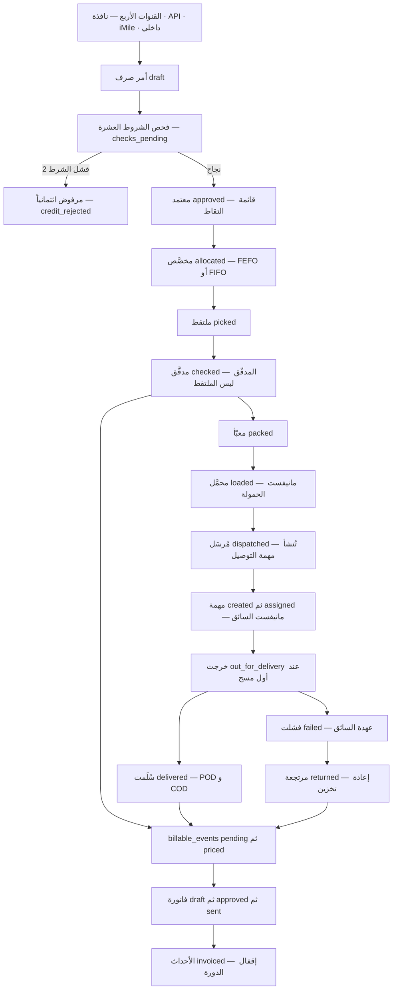
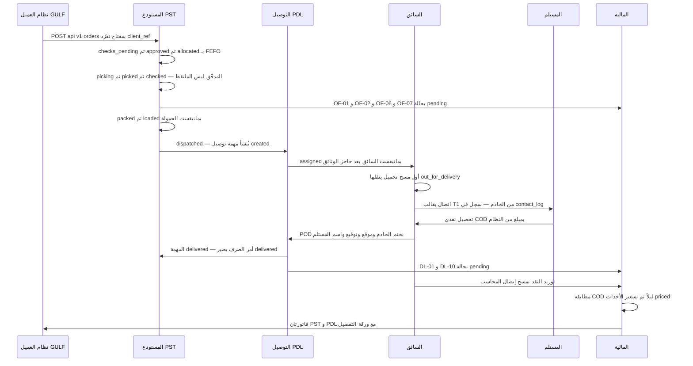
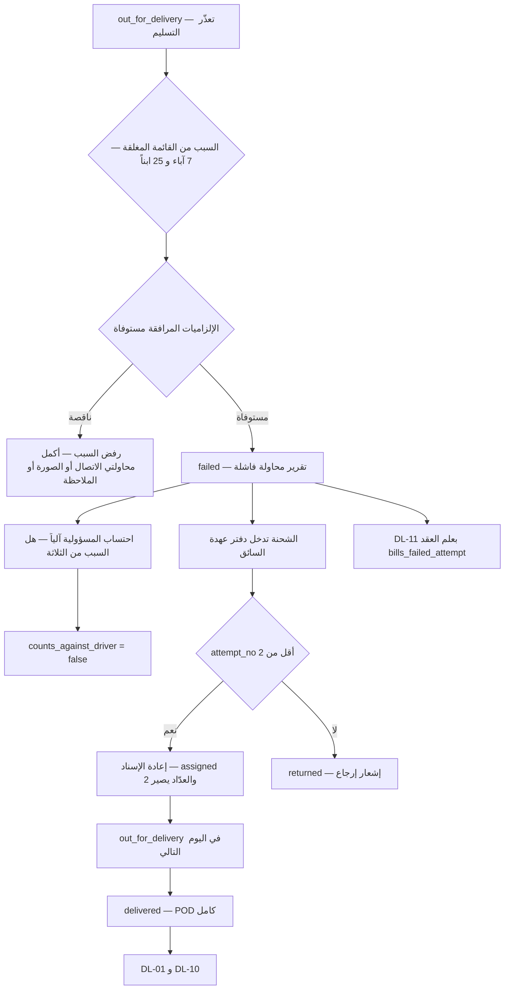
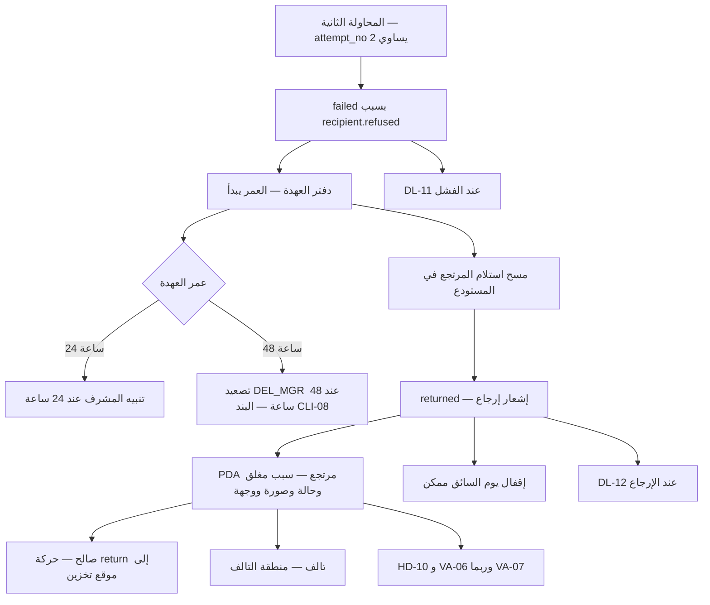
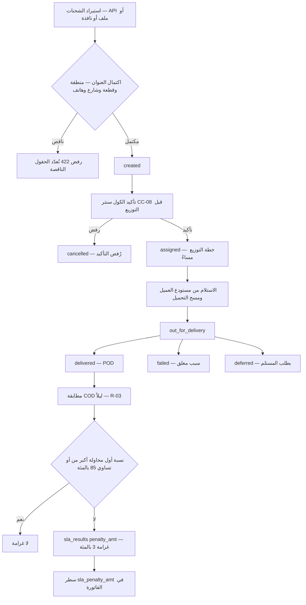
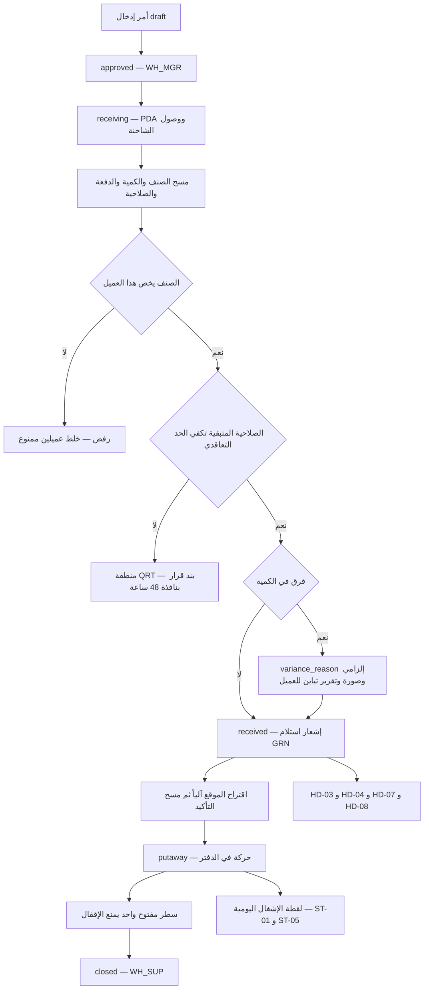

# سيناريوهات دورة تنفيذ الطلبات — من الاستلام إلى التسليم

**PG-EOS v4 · D-blueprints · 21/09/2026 · المصادر: D-03 §4 · D-04 §4 · D-02 §4-3/§4-4 · 03 §0/§5/§11/§12 · 05 (س1 · س2 · س3) · 35 · 40 §C3/§C4/§C10/Part D/Part E · 23 §I-09 · 26 §2/§5 · 38 (WBS) · `_changelog/STATE-REGISTER.md` · القاعدة الحيّة `pgeos`**

---

## 0. كيف تُقرأ هذه الوثيقة

هذه الوثيقة **لا تضيف قاعدة واحدة** إلى الحزمة؛ هي تصل ما وصفته الوثائق مجزّأً — المستودع في D-03، التوصيل في D-04، المال في D-02، التجاري في 05 — في **دورة واحدة متصلة** كما يراها العميل والمدير: من لحظة وصول الطلب إلى إقفاله مالياً.
كل **حالة** مكتوبة هنا موجودة في قيد `check` حيّ في القاعدة؛ كل **حدث** بصيغته في جدول الأحداث الموحّد (03 §12)؛ كل **كود خدمة** من `catalog.services`. ما لا يوجد لا يُستعمل في الخطوات — يُذكر في **§6** بوصفه «غير معرَّف في الحزمة».
**الأوقات** في جداول الخطوات (٠٨:٤٠ · ١١:٢٠ …) **خط زمني توضيحي ليوم واحد، وليست حدوداً**. كل حدّ حقيقي مكتوب في عمود «الحدّ» بمصدره.
**الأكواد المالية** بصيغتها في الكتالوج: `ST-*` تخزين · `HD-*` مناولة · `OF-*` تجهيز · `VA-*` قيمة مضافة · `DL-*` توصيل · `CC-*` كول سنتر.
**الأدوار:** `WH_OP` عامل مستودع · `WH_SUP` مشرف · `WH_MGR` مدير مستودع · `DEL_SUP` مشرف توزيع · `DEL_MGR` مدير توصيل · `DRIVER` سائق · `CC_AGENT` وكيل كول سنتر · `CFO` مدير مالي · `GM` المدير العام.

### جدول 0-1: قنوات دخول الطلب إلى النظام

القيم الخمس لـ`tms.delivery_tasks.source_type` منصوصة في **40 §C4** — `internal · imile · oula · client_portal · api` — ويقابلها على جانب المستودع `wms.outbound_orders` المنشأ من النافذة أو من `WH_OP`.

| القناة | `source_type` | من يُدخل | الجدول الأول المكتوب | الضابط عند الدخول | الحالة في الخطة |
|---|---|---|---|---|---|
| **نافذة العميل يدوياً** | `client_portal` | `CLIENT_CREATOR` من نافذته (12 شاشة · 40 §C10) | `wms.outbound_orders` أو `tms.delivery_tasks` | عزل `client_id = current_client_id()` بـRLS في القاعدة لا في الكود · رفض فوري بذكر السبب عند الحجز الائتماني | **المرحلة 6 · WBS 6.1** |
| **Client API v1 (I-09)** | `api` | نظام العميل عبر `POST /api/v1/orders` | `wms.outbound_orders` أو `tms.delivery_tasks` | **تفرّد إلزامي بـ`client_ref`** — إعادة الإرسال لا تنشئ أمراً ثانياً · مفتاح لكل عميل قابل للإبطال · **١٠٠ طلب/دقيقة** · `/v1` مجمَّد | **المرحلة 6 · WBS 6.2** |
| **وكيل محطة iMile** | `imile` | الوكيل المخصَّص يسحب كل ١٠ دقائق | `imile.shipments` ← `tms.delivery_tasks` | فهرس فريد `(source_type, source_ref)` يمنع الإدخال المزدوج · توقّف الوكيل **> ١٥ دقيقة** ⇒ التنبيه `N-01` | **المرحلة 3 · WBS 3.14** |
| **إدخال داخلي من الكول سنتر / العمليات** | `internal` | `CC_AGENT` أو `DEL_SUP` أو `WH_OP` | `tms.delivery_tasks` أو `wms.outbound_orders` | نفس فحص الشروط العشرة · رفض **422** بلا `area, block, street, recipient_phone` | **المرحلة 3 · WBS 3.4** |
| _(قناة خامسة منصوصة)_ | `oula` | تكامل عميل محطة ثانٍ | `tms.delivery_tasks` | نفس ضوابط `imile` | **المرحلة 3** |

> **العمود `source_type` بلا قيد `check` في القاعدة اليوم** — القيم الخمس منصوصة في 40 §C4 نصاً فقط. انظر **§6 البند 8**.

---

## 1. الخريطة الكبرى للدورة

#### خريطة 1-1: الدورة العشرية من الطلب إلى الفاتورة
تقرأ من وصول الطلب بأي قناة إلى إقفاله مالياً، مع المخرجين الاستثنائيين: الرفض الائتماني والإرجاع.

### جدول 1-1: المراحل العشر — المسؤول والشاشة والحالة والحدث والفوترة والحدّ

| # | المرحلة | المسؤول | الشاشة / التطبيق | الجدول.الحالة | الحدث المنشور | حدث الفوترة | SLA / الحدّ ومصدره |
|---|---|---|---|---|---|---|---|
| **1** | **استلام الطلب وفحصه** | العميل أو `WH_OP`؛ الفحص آلي؛ الاعتماد **`WH_MGR`** | نافذة العميل · شاشة أمر صرف · صندوق القرارات | `wms.outbound_orders.status`: `draft → checks_pending → approved` (أو `credit_rejected`) | `wms.outbound.drafted` · `checks_started` · `credit_rejected` · `approved` | — | **الشروط العشرة** كلها آلية وكل شرط له رسالة فشل خاصة (40 §C3) |
| **2** | **التخصيص** | النظام + `WH_SUP` | شاشة التخصيص | `allocated` أو `partially_allocated` · السطر `order_lines.status = partial` | `wms.outbound.allocated` · `partially_allocated` | — | **FEFO** لذوات الصلاحية · **FIFO** لغيرها · `LIFO` باستثناء معتمد (`wms.skus.picking_policy`) |
| **3** | **الالتقاط** | `WH_OP` | **PDA · التقاط** بالمسار الأقصر | `picking → picked` · `picked_by` · حركة `pick` | `wms.outbound.picking_started` · `picked` | — | زمن ردّ المسح **≤ ١٫٠ ثانية** · النقص يوجب سبباً من قائمة وتنبيهاً فورياً للمشرف |
| **4** | **الفحص / التدقيق** | **`WH_OP` آخر** | **PDA · تدقيق** — مسح كل بند | `checked` · `checked_by` | **`wms.outbound.checked`** | **`OF-01…OF-11`** بحالة `pending` | **`checked_by ≠ picked_by` مفروض دائماً**؛ التجاوز بيد `WH_SUP` بسبب مسجَّل يظهر في تقرير شهري (INV-C3-6 · EXEC §1.2 FIXED) |
| **5** | **التغليف** | `WH_OP` | PDA | `packed` · `packed_by` | `wms.outbound.packed` | — (`OF-07` يُولَّد مع حزمة التدقيق — **§6 البند 1**) | — |
| **6** | **التحميل** | `WH_OP` | **PDA · تحميل** — مسح الشحنة ثم المركبة | `loaded` | `wms.outbound.loaded` | — | **يُرفض الإقفال إن نقص شيء** · شحنة لعميل آخر ⇒ **رفض فوري** |
| **7** | **التسليم للتوصيل** | **`WH_SUP`** | شاشة الأمر | `dispatched` · `dispatched_at` · تُنشأ `tms.delivery_tasks` بحالة `created` | `wms.outbound.dispatched` · `tms.task.created` | — | **رفض 422** بلا `area, block, street, recipient_phone` (INV-C4-2) |
| **8** | **التوزيع والإسناد** | **`DEL_MGR`** مساء اليوم السابق | شاشة «خطة التوزيع» | `tms.delivery_tasks.status = assigned` · `driver_id` · `vehicle_id` · `route_id` | `tms.task.assigned` — **مانيفست السائق** | — | **حاجز صلب INV-C4-1:** سائق أو مركبة بوثيقة منتهية **لا يُسنَد** |
| **9** | **الخروج والمحاولة** | `DRIVER` | تطبيق السائق · «تنفيذ المهمة» | `out_for_delivery` ← أول مسح · ثم `delivered` أو `failed` أو `deferred` | `tms.task.out_for_delivery` · `delivered` · `failed` · `deferred` | `DL-11` عند `failed` (بعلم العقد) · `DL-14` عند `deferred` (بعلم العقد) | **مسح باركود الشحنة إلزامي قبل التسليم** · مسح خارج العهدة مرفوض (INV-C4-4) · المستهدف **≥ ٩٨٪** مسح فعلي |
| **10** | **POD و COD ثم الإقفال والفوترة** | `DRIVER` ثم `DEL_SUP` ثم النظام ثم `CFO` | POD · شاشة النقد الحية · إقفال اليوم · صندوق قرارات `CFO` | `delivered` ← `wms.outbound_orders.status = delivered` · `billable_events`: `pending → priced → invoiced` · `invoices`: `draft → review → approved → sent` | `tms.task.delivered` · `wms.outbound.delivered` · `billing.event.recorded/priced/invoiced` · `billing.invoice.approved/sent` | **`DL-01` أو `DL-02` دائماً** + `DL-07` · `DL-08` · `DL-09` · `DL-10` حسب خصائص المهمة | POD = **GPS + (توقيع أو صورة) + اسم المستلم + ختم الخادم** (INV-C4-3) · **لا يُقفل يوم السائق** بأي من الحواجز الخمسة · **اعتماد آلي للفاتورة ≤ ٥٠٠ د.ك** وفوقها `CFO` |

> **قاعدة الدورة الحاكمة:** حدث الفوترة يُولَّد من **انتقال حالة مُقفَل**، لا من نية ولا من تقدير. `wms.outbound.checked` يولّد حزمة التجهيز، و`tms.task.delivered` يولّد حزمة التوصيل، و`wms.occupancy.snapshot` يولّد التخزين يومياً. **لكل حدث كود خدمة واحد** (المبدأ P10).

---

## 2. السيناريوهات التفصيلية

### 2.1 طلب متجر إلكتروني B2C من مستودعنا — تسليم من أول محاولة مع COD

#### (أ) الوصف والافتراضات

العميل **`GULF`** (سيناريو 1 · SEG-A · عميل 3PL متكامل): شركة توزيع مستحضرات تجميل · **320 منصة** · **2,400 طلب تجزئة شهرياً** · كيانان `PST` (تخزين وتجهيز) و`PDL` (توصيل) · عقدان بدورة فوترة شهرية وسداد 30 يوماً · **حد ائتماني 15,000 د.ك على مستوى المجموعة**.
خدماته المتعاقد عليها: تخزين `ST-01` (و`ST-05` مبرَّد لـ12%) و`ST-11` حد أدنى 2,000 د.ك · مناولة `HD-03 · HD-04 · HD-07 · HD-08` · تجهيز `OF-01 · OF-02 · OF-03 · OF-06 · OF-07` · توصيل `DL-01 · DL-07 · DL-10` — **و`DL-11` و`DL-12` منصوص عليهما في عقده**.
**الطلب:** أمر صرف واحد بأربعة بنود من الصنف `GULF-0137` وأخواته · `order_type` تجزئة · `is_cod = true` بمبلغ 18٫500 د.ك · عنوان في السالمية مكتمل الحقول الأربعة.

#### (ب) جدول الخطوات المرقّمة

| # | الوقت | من | الشاشة | ما يحدث في القاعدة — الحالة قبل → بعد | الحدث | حدث الفوترة |
|---|---|---|---|---|---|---|
| 1 | ٢٠:١٥ (أمس) | نظام العميل عبر **I-09** | `POST /api/v1/orders` بـ`client_ref` فريد | `wms.outbound_orders` صف جديد · `— → draft` · `doc_no` من سلسلة `OUT` (`PST-OUT-`) · `source` مسجَّل | `wms.outbound.drafted` | — |
| 2 | ٢٠:١٥ | **النظام آلياً** | — | `draft → checks_pending` — **حارس على الانتقال لا مرحلة عمل** · تشغيل الشروط العشرة · الشرط 2 يمرّ (لا حجز ائتماني) | `wms.outbound.checks_started` | — |
| 3 | ٢٠:١٦ | **`WH_MGR`** | صندوق القرارات | `checks_pending → approved` ← **قائمة التقاط تُولَّد** | `wms.outbound.approved` | — |
| 4 | ٢٠:١٧ | النظام + `WH_SUP` | شاشة التخصيص | `approved → allocated` · **FEFO** على الأصناف ذات الصلاحية · `stock_balance.qty_allocated` يرتفع · `order_lines.location_id` يُملأ · السطور `open → complete` | `wms.outbound.allocated` | — |
| 5 | ٠٦:٤٠ | `WH_OP` | **PDA · التقاط** بالمسار الأقصر | `allocated → picking → picked` · `picked_by` · حركة `pick` في `stock_movements` | `wms.outbound.picking_started` ثم `picked` | — |
| 6 | ٠٧:٠٥ | **`WH_OP` آخر** | **PDA · تدقيق** — مسح كل بند | `picked → checked` · `checked_by ≠ picked_by` — **إذن صرف / بوليصة تسليم تُولَّد** | **`wms.outbound.checked`** | **`OF-01 ×1` · `OF-02 ×4` · `OF-06 ×1` · `OF-07 ×1`** — كلها `status = pending` |
| 7 | ٠٧:١٥ | `WH_OP` | PDA | `checked → packed` · `packed_by` | `wms.outbound.packed` | — |
| 8 | ٠٧:٣٠ | `WH_OP` | **PDA · تحميل** — مسح الشحنة ثم المركبة | `packed → loaded` — **مانيفست الحمولة** | `wms.outbound.loaded` | — |
| 9 | ٠٧:٣٥ | **`WH_SUP`** | شاشة الأمر | `loaded → dispatched` · `dispatched_at` · **`tms.delivery_tasks` صف جديد بحالة `created`** بمرجع `outbound_order_id` و`doc_no` من سلسلة `TSK` (`PDL-TSK-`) | `wms.outbound.dispatched` · `tms.task.created` | — |
| 10 | ٠٧:٤٠ | **`DEL_MGR`** | «خطة التوزيع» | `created → assigned` · `driver_id` · `vehicle_id` · `route_id` · `assigned_at` — **مانيفست السائق** · `tms.routes` بحالة `planned` | `tms.task.assigned` | — |
| 11 | ٠٨:٠٠ | `DRIVER` | فحص الجاهزية · بدء الوردية · قائمة فحص المركبة | تحقق من سريان وثائق السائق والمركبة · بصمة وجه + GPS · **قراءة العداد الابتدائية مع صورة** | — | — |
| 12 | ٠٨:٢٠ | `DEL_SUP` + `DRIVER` | مسح التحميل | **أول مسح ينقل تلقائياً** `assigned → out_for_delivery` · `ofd_at` | `tms.task.out_for_delivery` | — |
| 13 | ١٠:٤٥ | `DRIVER` | «تنفيذ المهمة» | مكالمة بقالب `T1` **من الخادم** · صف في `tms.contact_log` بقناته وتوقيته ونتيجته | — | — |
| 14 | ١١:٠٥ | `DRIVER` | الوصول والمسح | **مسح باركود الشحنة إلزامي** · شحنة خارج العهدة تُرفض فوراً · مسح بعد **> ٥ دقائق** من «وصلت» يُعلَّم للتدقيق | — | — |
| 15 | ١١:٠٨ | `DRIVER` | دورة الدفع | `tms.payment_attempts` صف بـ`method = 'cash'` و`amount_due = 18.500` · **تأكيد الاستلام** · `confirmed_by = 'driver_cash'` · `cod_collected = 18.500` على المهمة | — | — |
| 16 | ١١:١٠ | `DRIVER` | التقاط POD | `tms.proof_of_delivery`: `delivered_at` **بختم الخادم لا بساعة الجهاز** · `geo_lat/lng` · اسم المستلم وصلته · **توقيع أو صورة** · `sha256` و`photo_sha256`/`signature_sha256` · `device_id` · `captured_by` → **`out_for_delivery → delivered`** · `completed_at` · `attempt_no = 1` | **`tms.task.delivered`** — **إثبات تسليم POD** | **`DL-01 ×1`** + **`DL-10 ×1`** (COD) · و`DL-07` لو كانت `is_same_day` |
| 17 | ١١:١٠ | النظام من TMS | — | `wms.outbound_orders.status`: `dispatched → delivered` | `wms.outbound.delivered` | — |
| 18 | ١٧:٣٠ | `DRIVER` + المحاسب | التوريد | توريد النقد **بمسح إيصال المحاسب** · `cod_amount − cod_collected = 0` | `billing.receipt.recorded` | — |
| 19 | ١٨:٠٠ | `DRIVER` | إقفال اليوم — **الحواجز الخمسة** | كلها صفر ⇒ اليوم مقفل · `tms.routes.status = closed` بـ`finished_at` و`actual_km` و`completed_stops` بيد `DEL_SUP` | — | — |
| 20 | ٠١:٤٠ (ليلاً) | النظام | — | **مطابقة COD** `delivery_tasks × payment_attempts × billing.receipts` ⇒ التقرير **`R-03`** بلا فروق · محرّك التسعير ينقل الأحداث `pending → priced` | `billing.event.priced` | — |
| 21 | إقفال الشهر | النظام ثم `CFO` | شاشة الفواتير | تجميع أحداث `priced` لكل (عميل × كيان) ⇒ فاتورتان: `PST` و`PDL` · `draft → review → approved` (`doc_no` من سلسلة `INV` **لحظة الاعتماد فقط**) `→ sent` · الأحداث `priced → invoiced` | `billing.invoice.drafted` · `under_review` · `approved` · `sent` · `billing.event.invoiced` | — |

#### (ج) خريطة التتابع

#### خريطة 2-1: الدورة السعيدة الكاملة بين الأطراف الستة
تقرأ من نداء الواجهة البرمجية إلى إقفال الشهر، بالترتيب الزمني لا المنطقي.

#### (د) ماذا يرى العميل في نافذته

| عند الخطوة | ما يظهر للعميل |
|---|---|
| 1–3 | الأمر في «طلباتي» بحالته؛ الرفض — لو وقع — **بسببه المحدد لا برسالة عامة** |
| 4–8 | تقدّم التجهيز؛ **لا يرى المواقع** إلا إذا فُعِّل إعداد تفصيل الموقع، ولا يرى تكاليفنا ولا هوامشنا ولا أسعار غيره |
| 9 | **إشعار في النافذة + رابط تتبّع** (حدث `wms.outbound.dispatched`) |
| 12–16 | شاشة «تتبّع + POD»: خرجت · سُلِّمت · **صورة الإثبات والتوقيع واسم المستلم** |
| 20–21 | كشف الحساب وأعمار الذمم لكيانه المتعاقد معه + **كشف موحّد إدارياً** · الفاتورة **مع ورقة التفصيل** التي تحصر كل حدث بتاريخه ومرجعه وسعره **ومصدر ذلك السعر** |
| دائماً | **لا يرى أبداً:** عملاء آخرين · تكاليفنا أو هوامشنا · بيانات الموظفين · أسعار غيره · الشركاء المنفِّذين (إلا بإعداد) · أسماء السائقين |

#### (هـ) نقاط الفشل الممكنة ومعالجتها

| نقطة الفشل | ما يفعله النظام |
|---|---|
| إعادة إرسال الطلب من نظام العميل | **`client_ref` فريد** — لا يُنشأ أمر ثانٍ (I-09) |
| حجز ائتماني على المجموعة | `checks_pending → credit_rejected` · `credit_check_passed = false` · **ومهمة التوصيل الجديدة تُرفض بالسبب نفسه** (S6 · S8) — والتخزين يستمر في الفوترة أثناء الحجز |
| الرصيد لا يكفي | **تخصيص جزئي:** `partially_allocated` والسطر `partial` — **لا يُقفل تلقائياً · ينبّه المشرف** |
| المدقّق هو نفسه الملتقط | **مرفوض دائماً**؛ التجاوز بيد `WH_SUP` بسبب مسجَّل يظهر في **تقرير شهري إلزامي** |
| عنوان ناقص عند إنشاء المهمة | **422 تُعدّد الحقول الناقصة** (INV-C4-2) |
| وثيقة السائق أو المركبة منتهية | **لا إسناد** — حاجز صلب INV-C4-1 · التنبيه `N-05` / `N-04` سبق على سلّم **90/45/30/15** يوماً |
| السائق يعلن دفعاً إلكترونياً لم يحدث | **مستحيل برمجياً** — قيد `link_needs_gateway`: `method = 'link'` لا يُؤكَّد بلا `gateway_ref` |
| المستلم يريد دفع جزء من المبلغ | **مرفوض مطلقاً** — لا استثناء ولا اعتماد مشرف (`driver.payment.allow_partial = false`) |
| فرق نقدي عند الإقفال | **فرق مفتوح يمنع إقفال اليوم** · التنبيه **`N-03` بلا كبح ومستثنى من ساعات الهدوء** · تصعيد إلى `GM` بعد **٤٨ ساعة** |
| حدث فوترة بلا سعر | يبقى `pending` ويظهر في **`R-14` الإيراد الضائع** · التنبيه **`N-08`** بعد **٧ أيام** · **لا فوترة بصفر** |

#### (و) الأثر المالي

| الحدث | الكود | الكمية | مصدره | متى |
|---|---|---|---|---|
| رسم الطلب الأساسي | `OF-01` | ١ طلب | `wms.outbound.checked` | عند التدقيق |
| التقاط بند داخل الطلب | `OF-02` | ٤ بنود | `wms.outbound.checked` | عند التدقيق |
| تدقيق ومطابقة قبل الشحن | `OF-06` | ١ طلب | `wms.outbound.checked` | عند التدقيق |
| تغليف وتعبئة | `OF-07` | ١ طلب | `wms.outbound.checked` | عند التدقيق |
| توصيل شحنة استهلاكية B2C | `DL-01` | ١ شحنة | `tms.task.delivered` و`task_type = 'b2c'` | **دائماً** |
| تحصيل نقدي عند التسليم | `DL-10` | ١ شحنة | `is_cod = true` عند التسليم | حسب العقد — مبلغ ثابت أو نسبة |
| تخزين على منصات | `ST-01` | يومي | `wms.occupancy.snapshot` | **مستقل عن هذا الطلب** — يومياً ٠٠:٣٠ |

**COD:** 18٫500 د.ك محصَّلة نقداً ومورَّدة بالكامل ⇒ الفرق صفر ⇒ لا حاجز إقفال. **العهدة:** لا شيء — الشحنة لم تدخل دفتر العهدة لأنها لم تفشل.

---

### 2.2 المحاولة الأولى تفشل ← إعادة جدولة ← تسليم في المحاولة الثانية

#### (أ) الوصف والافتراضات

العميل **`SHOP`** (سيناريو 3 · SEG-B · توصيل استهلاكي B2C): متجر إلكتروني · **1,800 شحنة شهرياً** · **COD 70%** · بضاعته في مستودعه · الكيان `POR`.
خدماته: `DL-01 · DL-07 · DL-10` — **و`DL-11` ✅ و`DL-12` ✅ و`DL-14` ✅ منصوصة** · و`CC-08` تأكيد الطلبات قبل التوصيل.
**العلم العقدي المحدِّد: `bills_failed_attempt = true`.** **SLA:** نسبة التسليم من المحاولة الأولى **≥ ٨٥٪** · غرامة **٣٪ من الفاتورة الشهرية** عند الإخلال.
**الحالة:** مهمة عليها **محاولتا اتصال مسجَّلتان** في `tms.contact_log`؛ المستلم لم يردّ.

#### (ب) جدول الخطوات المرقّمة

| # | الوقت | من | الشاشة | ما يحدث في القاعدة — الحالة قبل → بعد | الحدث | حدث الفوترة |
|---|---|---|---|---|---|---|
| 1 | ٠٩:٥٠ | `DRIVER` | «تنفيذ المهمة» | محاولة اتصال أولى · صف في `tms.contact_log` (`answered = false`) | — | — |
| 2 | ١٠:١٥ | `DRIVER` | «تنفيذ المهمة» | محاولة اتصال ثانية · صف ثانٍ في `tms.contact_log` | — | — |
| 3 | ١٠:٣٠ | `DRIVER` | الوصول وتسجيل الموقع | `geo_lat/lng` للمحاولة مسجَّلان | — | — |
| 4 | ١٠:٣٢ | `DRIVER` | قائمة أسباب الفشل | اختيار **`no_answer.no_response`** من **٧ آباء و٢٥ ابناً** — **لا خيار «أخرى» ولا نص حر** (INV-C4-5) | — | — |
| 5 | ١٠:٣٢ | النظام | — | **استيفاء الإلزاميات:** `requires_contact_attempts = 2` على الأب `no_answer` ⇒ **الصفّان موجودان** فالسبب مقبول | — | — |
| 6 | ١٠:٣٣ | النظام | — | `out_for_delivery → failed` · `failure_reason = 'no_answer.no_response'` · **`attempt_no` يبقى كما هو في المحاولة الأولى** — **وثيقة تقرير محاولة فاشلة** | **`tms.task.failed`** | **`DL-11 ×1`** — لأن `bills_failed_attempt = true` |
| 7 | ١٠:٣٣ | النظام آلياً | — | **نسبة المسؤولية بلا رأي المشرف:** `no_answer.no_response` ليس من الثلاثة ⇒ **`counts_against_driver = false`** | — | — |
| 8 | ١٠:٣٣ | النظام | دفتر العهدة | الشحنة تدخل **دفتر عهدة السائق** مع عمرها من هذه اللحظة | — | — |
| 9 | ١٦:٠٠ | النظام | إشعار `N5` | «لديك شحنات فاشلة لم تُرجَع» — يومياً ١٦:٠٠ | — | — |
| 10 | ١٨:٠٠ | `DRIVER` | إقفال اليوم | **الحاجز الرابع:** عهدة فاشلة لم تُرجَع ⇒ **اليوم لا يُقفل** حتى المسح في المستودع أو إعادة الإسناد | — | — |
| 11 | ١٩:٣٠ | **`DEL_SUP`** | «خطة التوزيع» | **إعادة الإسناد مشروطة بـ`attempt_no < 2`** · العدّاد يزيد إلى **٢** · `failed → assigned` — **«محاولة ٢» عدّاد لا حالة** | **`tms.task.reassigned`** | — |
| 12 | ٠٨:١٥ (اليوم التالي) | `DRIVER` | مسح التحميل | `assigned → out_for_delivery` · `ofd_at` جديد | `tms.task.out_for_delivery` | — |
| 13 | ١١:٤٠ | `DRIVER` | التحصيل ثم POD | مسح الشحنة · COD · `tms.proof_of_delivery` كامل ⇒ `out_for_delivery → delivered` · `attempt_no = 2` | **`tms.task.delivered`** | **`DL-01 ×1`** + `DL-10 ×1` |
| 14 | ٠١:٤٠ | النظام | — | الأحداث `pending → priced` · التسليم لم يكن من المحاولة الأولى ⇒ **يدخل مقام مؤشر SLA الشهري** | `billing.event.priced` | — |

> **تفريق يجب ألا يُخلط:** `DL-14` «إعادة جدولة بطلب المستلم» يُولَّد من **`tms.task.deferred`** — أي حين **يطلب المستلم** التأجيل. أمّا **إعادة الإسناد بعد الفشل** (`tms.task.reassigned`) **فلا تولّد أي حدث فوترة**؛ الحدث الوحيد في هذا المسار هو **`DL-11`** لحظة الفشل. وهما مساران مختلفان في الكتالوج وفي جدول الأحداث.

#### (ج) خريطة التدفق

#### خريطة 2-2: من الفشل الأول إلى التسليم في المحاولة الثانية
تقرأ من اختيار السبب إلى إغلاق الدورة، مع الحلقة المشروطة بالعدّاد.

#### (د) ماذا يرى العميل

| عند الخطوة | ما يظهر للعميل |
|---|---|
| 6 | حالة الشحنة **«فشلت»** مع **كود السبب من القائمة المغلقة** — لا نص حرّ قابل للتأويل |
| 6 | تقرير المحاولة الفاشلة متاح في التتبّع |
| 11–12 | **«أُعيدت الجدولة»** ثم «خرجت» في اليوم التالي بـ`attempt_no = 2` |
| 13 | POD كامل بالصورة والتوقيع واسم المستلم |
| شهرياً | **المحاولة الفاشلة تظهر سطراً بـ`DL-11` في ورقة التفصيل** — لأن عقده ينص عليها؛ ولو لم ينص لظهرت في **`R-14` الإيراد الضائع** بقيمتها التقديرية |

#### (هـ) نقاط الفشل الممكنة ومعالجتها

| نقطة الفشل | ما يفعله النظام |
|---|---|
| السائق يختار `no_answer.*` بلا محاولتي اتصال | **السبب يُرفض** — `requires_contact_attempts = 2` مفروض من صفّ السبب في `tms.failure_reasons` |
| السائق يختار سبباً من `shipment` أو `access` بلا صورة | **مرفوض** — `requires_photo = true` على هذين الأبوين وعلى `driver.accident` |
| `no_answer.door_not_opened` بلا محاولتي اتصال | **يُحتسب على السائق** — أحد الثلاثة، بالشرط المكتوب، **والنظام هو من يقرّر من سجل الاتصال لا المشرف** |
| `address.building_not_found` والموقع المسجَّل **> ٣٠٠ متر** عن عنوان المهمة | **يُحتسب على السائق** — من إحداثيات المحاولة |
| `driver.vehicle_breakdown` أو `driver.accident` | **لا يُحتسبان على السائق إطلاقاً** — الأول إلى مسار الأسطول والثاني إلى مسار التحقيق؛ «لا نسبة بلا دليل» |
| محاولة إسناد ثالثة | **مرفوضة** — `attempt_no < 2` شرط إعادة الإسناد |
| السائق يحاول إقفال يومه والشحنة في سيارته | **الحاجز الرابع** يمنع — والخروج من العهدة **بمسح الاستلام في المستودع حصراً، لا بضغطة في التطبيق** |
| مرور **٢٤ ساعة** على العهدة | تنبيه للمشرف (`driver.custody.alert_hours = 24`) |
| مرور **٤٨ ساعة** | **تصعيد إلى `DEL_MGR`** ويصير البند الجزائي **`CLI-08`** قابلاً للتطبيق (`driver.custody.escalate_hours = 48`) |

#### (و) الأثر المالي

| الحدث | الكود | الشرط | الحالة الابتدائية |
|---|---|---|---|
| محاولة توصيل فاشلة | **`DL-11`** | **فقط إن `bills_failed_attempt = true`** — و`SHOP` عنده `true` | `pending` |
| توصيل شحنة استهلاكية | `DL-01` | دائماً عند `delivered` و`task_type = 'b2c'` | `pending` |
| تحصيل نقدي | `DL-10` | `is_cod = true` عند التسليم · حسب العقد | `pending` |
| _لا حدث_ | — | **إعادة الإسناد `tms.task.reassigned`** لا تولّد شيئاً | — |

> **الخسارة الصامتة:** لو كان `bills_failed_attempt = false` — وهو **الافتراضي في القاعدة** لكل عقد — لسُجِّل الحدث نفسه **بلا سعر** وظهر في **`R-14`** بقيمته التقديرية. هذا هو ما يبرّر إعادة التفاوض بالأرقام: في سيناريو التجديد **S11** يعرض الملف **٣٤٠ محاولة فاشلة و١٨٠ إرجاعاً** بلا علم عقدي خلال ١٢ شهراً.

---

### 2.3 فشل نهائي ← إرجاع إلى المستودع (RTO) ← إعادة تخزين ← تسوية

#### (أ) الوصف والافتراضات

نفس العميل **`SHOP`** ونفس المهمة، لكن **المحاولة الثانية تفشل أيضاً** بالسبب `recipient.refused` (رفض الاستلام). العلم `bills_return = true` منصوص في عقده (`DL-12` ✅). الشحنة تعود مادياً في مركبة السائق، ثم إلى المستودع.

#### (ب) جدول الخطوات المرقّمة

| # | الوقت | من | الشاشة | ما يحدث في القاعدة — الحالة قبل → بعد | الحدث | حدث الفوترة |
|---|---|---|---|---|---|---|
| 1 | ١٣:٢٠ | `DRIVER` | قائمة الأسباب | `out_for_delivery → failed` · `failure_reason = 'recipient.refused'` · `attempt_no = 2` | `tms.task.failed` | `DL-11` (بعلم العقد) |
| 2 | ١٣:٢٠ | النظام | دفتر العهدة | الشحنة في عهدة السائق · عدّاد العمر يبدأ | — | — |
| 3 | ١٦:٠٠ | النظام | `N5` | «لديك شحنات فاشلة لم تُرجَع» | — | — |
| 4 | ١٧:٤٥ | `WH_OP` | **PDA · مسح استلام المرتجع في المستودع** | **الخروج من العهدة بالمسح حصراً** ⇒ المهمة `failed → returned` — **وثيقة إشعار إرجاع** · يقفل `DEL_SUP` المسار | **`tms.task.returned`** | **`DL-12 ×1`** — لأن `bills_return = true` |
| 5 | ١٧:٥٠ | `WH_OP` | **PDA · مرتجع** | مسح الشحنة → **سبب الإرجاع من قائمة مغلقة** → الحالة صالح / تالف → **📷 صورة** → الوجهة: مخزون / تالف / فحص | — | **`HD-10`** استلام مرتجعات · و**`VA-06`** عند طلب الفرز |
| 6 | ١٨:٠٠ | `WH_OP` | PDA · تخزين | صالح ⇒ حركة **`return`** في `stock_movements` إلى موقع تخزين · `check_location_limits()` · `stock_balance.qty_on_hand` يرتفع · `qty_allocated` يُفرَج عنه | — | — |
| 7 | ١٨:٠٥ | `WH_OP` | PDA · تخزين | تالف ⇒ منطقة التالف (`zone_type = 'damaged'`) — وعند الإتلاف خدمة **`VA-07`** | — | `VA-07` عند الإتلاف |
| 8 | ١٨:٠٥ | `DRIVER` | إقفال اليوم | الحاجز الرابع صار صفراً ⇒ اليوم قابل للإقفال · **و`cod_collected` صفر** لأن التحصيل لم يقع | — | — |
| 9 | شهرياً | `CFO` | شاشة الفواتير | `DL-11` و`DL-12` و`HD-10` و`VA-06` ⇒ سطور في فاتورة `POR` مع ورقة التفصيل | `billing.event.invoiced` | — |

#### (ج) خريطة التدفق

#### خريطة 2-3: من الفشل النهائي إلى إعادة التخزين
تقرأ من المحاولة الثانية الفاشلة إلى إقفال العهدة وتسوية المخزون.

#### (د) ماذا يرى العميل

حالة «مرتجعة» مع **إشعار الإرجاع** وسبب الفشل بكوده · تحديث كشف مخزونه في النافذة بعد إعادة التخزين · وسطور `DL-12` و`HD-10` و`VA-06` في ورقة تفصيل فاتورته.

#### (هـ) نقاط الفشل الممكنة ومعالجتها

| نقطة الفشل | ما يفعله النظام |
|---|---|
| السائق يضغط «أرجعتها» في التطبيق | **لا أثر** — الخروج من العهدة **بمسح المستودع حصراً** |
| العهدة تتجاوز ٤٨ ساعة | تصعيد `DEL_MGR` + **`CLI-08`** من لائحة الجزاءات الـ٧٧ |
| مرتجع بلا صورة | **الصورة إلزامية** في عملية المرتجع على الـPDA |
| إعادة تخزين تتجاوز حدّ الموقع | `check_location_limits()` يرفض — **منصة ١,٠٠٠ كجم / ١٫٧٦١٧٥ م³** · **رف ٧٥٠ كجم / ٠٫٩٧٢٠٠ م³** |
| محاولة تعديل دفتر الحركات | **مستحيل بالتصميم** — «دفتر لا يُعدَّل. التصحيح بحركة تسوية مقابلة فقط» (تعليق القاعدة على `wms.stock_movements`) |
| ما الذي يُقفل أمر الصرف بعد الإرجاع؟ | **غير معرَّف في الحزمة** — انظر **§6 البند 3** |

#### (و) الأثر المالي

`DL-11` (بعلم العقد) · **`DL-12`** (بعلم العقد) · `HD-10` استلام مرتجعات · `VA-06` فرز · `VA-07` عند الإتلاف. **COD = صفر محصَّل** فلا فرق نقدي. **الخمسة الخارجة عن العقد افتراضياً — `DL-11 · DL-12 · DL-13 · DL-14 · DL-18` — أعلامها `boolean not null default false` على `sales.contracts`**، وهي «مصدر الخسارة الصامتة الأكبر في التوصيل الاستهلاكي».

---

### 2.4 توصيل فقط — B2C من مستودع العميل (SEG-B) بـSLA ٤٨ ساعة

#### (أ) الوصف والافتراضات

**`SHOP`** مرة أخرى، لكن هذه المرة على **الدورة الكاملة كما يعيشها هو**: بضاعته في مستودعه هو، لا عندنا. نحن نستلم منه ونوزّع ونسلّم. الكيان `POR`. **1,800 شحنة شهرياً · COD 70% · تسليم خلال ٤٨ ساعة.** `sla_enabled` مفعَّل على العقد: **نسبة التسليم من المحاولة الأولى ≥ ٨٥٪** وإلا **غرامة ٣٪ من الفاتورة الشهرية**.

#### (ب) جدول الخطوات المرقّمة

| # | الوقت | من | الشاشة | ما يحدث في القاعدة — الحالة قبل → بعد | الحدث | حدث الفوترة |
|---|---|---|---|---|---|---|
| 1 | ١٨:٠٠ | نظام العميل | **API I-09** أو ملف أو نافذة العميل | `tms.delivery_tasks` صفوف بحالة **`created`** · `source_type` بحسب القناة · **فهرس فريد `(source_type, source_ref)` يمنع الإدخال المزدوج** · `doc_no` من سلسلة `TSK` | `tms.task.created` | — |
| 2 | ١٨:٠٠ | النظام | — | **رفض فوري 422** لكل مهمة تنقصها `area` أو `block` أو `street` أو `recipient_phone`، **تُعدّد الحقول الناقصة** | — | — |
| 3 | ١٨:٣٠ | `CC_AGENT` | طابور الكول سنتر | **تأكيد الطلبات قبل التوزيع** · الطلب المرفوض يُلغى **قبل الخروج** بيد `DEL_MGR` ⇒ `created → cancelled` | `tms.task.cancelled` | **`CC-08`** تأكيد الطلبات |
| 4 | ٢٠:٠٠ | **`DEL_MGR`** | «خطة التوزيع» | `created → assigned` بمناطق وأحمال وتدوير · `tms.routes` بحالة `planned` — **مانيفست السائق** | `tms.task.assigned` | — |
| 5 | ٠٧:٤٥ | `DEL_SUP` + `DRIVER` | **استلام الشحنات من مستودع العميل** ومسح التحميل | أول مسح ⇒ `assigned → out_for_delivery` · `ofd_at` · `tms.routes.status = active` | `tms.task.out_for_delivery` | — |
| 6 | ٠٩:٠٠–١٦:٠٠ | `DRIVER` | «تنفيذ المهمة» | لكل مهمة: اتصال (`contact_log`) → وصول → **مسح إلزامي** → COD → POD ⇒ `delivered` · أو `failed` بكود · أو `deferred` بطلب المستلم | `tms.task.delivered` / `failed` / `deferred` | `DL-01` (+`DL-07` · `DL-10`) · `DL-11` عند الفشل · **`DL-14` عند `deferred`** |
| 7 | ١٧:٣٠ | `DRIVER` | التوريد وإقفال اليوم | الحواجز الخمسة · `tms.routes.status = closed` بـ`finished_at` و`actual_km` | — | — |
| 8 | ٠١:٤٠ | النظام | — | **مطابقة COD** ⇒ `R-03` لـ`CFO` · أي فرق غير مسوّى ⇒ **`N-03` فوراً بلا كبح** وتصعيد إلى `GM` بعد ٤٨ ساعة · تسعير الأحداث `priced` | `billing.event.priced` | — |
| 9 | إقفال الشهر | النظام | — | قياس SLA ⇒ `sales.sla_results` بـ`actual_value` و`met` و**`penalty_amt`** | — | — |
| 10 | إقفال الشهر | النظام ثم `CFO` | شاشة الفواتير | `penalty_amt` ينزل في **`billing.invoices.sla_penalty_amt`** — **سطر ظاهر في الفاتورة** · `draft → review → approved → sent` | `billing.invoice.approved` · `sent` | — |

#### (ج) خريطة التدفق

#### خريطة 2-4: دورة التوصيل فقط ومسار غرامة SLA
تقرأ من استيراد الشحنات إلى سطر الغرامة في الفاتورة الشهرية.

#### (د) ماذا يرى العميل

تتبّع كل شحنة بحالتها · POD لكل تسليم · **نسبة التسليم من أول محاولة** ضمن تقرير `R-11` أداء SLA لكل عقد (أسبوعي) · وفي الفاتورة الشهرية **سطر غرامة SLA صريح** — «تُحسب آلياً من البيانات وتظهر كسطر خصم في الفاتورة — لا نقاش تقديري».

#### (هـ) نقاط الفشل الممكنة ومعالجتها

| نقطة الفشل | ما يفعله النظام |
|---|---|
| **العنوان الناقص** — أكبر سبب فشل | رفض المهمة عند الإنشاء بـ**422** بلا منطقة أو قطعة أو شارع أو هاتف |
| تكرار الشحنة من قناتين | فهرس فريد **(المصدر + مرجع المصدر)** |
| COD غير محصَّل | فرق مفتوح · **لا يُقفل يوم السائق** · تقرير يومي `R-03` للمالية |
| نزاع على الغرامة | **لا تقدير** — الحساب من `sales.sla_results` وسطر ظاهر في الفاتورة |
| سائق تحت **٩٠٪** مسح فعلي | يُراجَع — والمستهدف العام **≥ ٩٨٪** |
| **استلام الشحنات من مستودع العميل كحالة أو حدث** | **غير معرَّف في الحزمة** — انظر **§6 البند 2** |

#### (و) الأثر المالي

`DL-01` لكل شحنة مسلَّمة · `DL-07` لما كان في نفس اليوم · `DL-10` للتحصيل · `DL-11` و`DL-12` و`DL-14` بأعلامها المنصوصة في عقد `SHOP` · `CC-08` لكل طلب مؤكَّد · **و`sla_penalty_amt` خصماً** عند خرق العتبة. **لا أحداث `ST-*` ولا `HD-*` ولا `OF-*`** — البضاعة ليست عندنا.

---

### 2.5 طلب B2B — صرف بالجملة لتاجر مع تسليم ومستندات

#### (أ) الوصف والافتراضات

صرف بالجملة من مستودعنا لتاجر: **منصات كاملة** لا تجزئة. المسار المستودعي هو نفسه، ويختلف في: خدمة التجهيز (`OF-10` صرف منصة كاملة بدل `OF-01`/`OF-02`/`OF-03`)، و`task_type = 'b2b'` على المهمة فيولّد **`DL-02`** بدل `DL-01`، وفي **المستندات**: إذن الصرف وبوليصة التسليم يُولَّدان من `wms.outbound.checked`، والمانيفست من `wms.outbound.loaded`، وPOD بـ**اسم المستلم وصلته ورقم هويته** (`receiver_id_no` و`relation` في `tms.proof_of_delivery`).
**المتغيّر الثاني — عميل 2PL تخزين فقط:** العميل **`PARTS`** (سيناريو 2 · SEG-C) عقده `ST-01 · ST-11 · HD-03 · HD-04 · HD-08 · OF-10` **بلا أي خدمة توصيل**: `order_type` قياسي **بلا مهمة توصيل** — **الدورة تنتهي عند `loaded`**، والعميل يمسح إذن الصرف عند البوابة و**توقيع مندوبه هو إثبات التسليم**.

#### (ب) جدول الخطوات المرقّمة

| # | الوقت | من | الشاشة | ما يحدث في القاعدة — الحالة قبل → بعد | الحدث | حدث الفوترة |
|---|---|---|---|---|---|---|
| 1 | ٠٨:٠٠ | العميل / `WH_OP` | نافذة العميل | `— → draft` بنوع صرف بالجملة | `wms.outbound.drafted` | — |
| 2 | ٠٨:٠٠ | النظام | — | `draft → checks_pending` ← الشروط العشرة · **الشرط 10: الكمية ضمن حد الطلب** مهم هنا | `wms.outbound.checks_started` | — |
| 3 | ٠٨:٠٥ | `WH_MGR` | صندوق القرارات | `checks_pending → approved` | `wms.outbound.approved` | — |
| 4 | ٠٨:١٠ | النظام + `WH_SUP` | التخصيص | `approved → allocated` بمنصات كاملة · `qty_allocated` يرتفع | `wms.outbound.allocated` | — |
| 5 | ٠٩:٠٠ | `WH_OP` | PDA · التقاط | `allocated → picking → picked` · حركة `pick` | `wms.outbound.picking_started` · `picked` | — |
| 6 | ٠٩:٣٠ | **`WH_OP` آخر** | PDA · تدقيق | `picked → checked` — **إذن صرف / بوليصة تسليم** | **`wms.outbound.checked`** | **`OF-10`** صرف منصة كاملة · و`OF-06` تدقيق · و`OF-09` تحميل حسب العقد |
| 7 | ٠٩:٤٥ | `WH_OP` | PDA | `checked → packed` | `wms.outbound.packed` | — |
| 8 | ١٠:٠٠ | `WH_OP` | PDA · تحميل | `packed → loaded` — **مانيفست الحمولة** | `wms.outbound.loaded` | — |
| **9أ** | ١٠:١٠ | `WH_SUP` | شاشة الأمر | **مسار التوصيل:** `loaded → dispatched` · `tms.delivery_tasks` بحالة `created` و**`task_type = 'b2b'`** | `wms.outbound.dispatched` · `tms.task.created` | — |
| **9ب** | ١٠:١٠ | `WH_SUP` | البوابة | **مسار 2PL (`PARTS`):** الدورة **تنتهي عند `loaded`** — العميل يمسح إذن الصرف وتوقيع مندوبه إثبات التسليم · **لا مهمة توصيل** | — | — |
| 10 | ١١:٣٠ | `DRIVER` | POD | `tms.proof_of_delivery` بـ`receiver_name` و**`receiver_id_no`** و`relation` وتوقيع · `out_for_delivery → delivered` | **`tms.task.delivered`** | **`DL-02 ×1`** لأن `task_type = 'b2b'` (+`DL-09` إن خارج الدوام) |
| 11 | ١١:٣٠ | النظام من TMS | — | `wms.outbound_orders.status`: `dispatched → delivered` | `wms.outbound.delivered` | — |

#### (د) ماذا يرى العميل

إذن الصرف وبوليصة التسليم فور التدقيق · المانيفست عند التحميل · **POD باسم المستلم ورقم هويته وصلته** عند التسليم. وفي مسار 2PL: إذن الصرف وحده، وإثبات التسليم توقيع مندوبه عند البوابة.

#### (هـ) نقاط الفشل الممكنة ومعالجتها

| نقطة الفشل | ما يفعله النظام |
|---|---|
| خلط شحنة عميلين على المركبة | **رفض فوري عند مسح التحميل** |
| نقص بند عند التحميل | **يُرفض الإقفال إن نقص شيء** |
| خدمة نُفّذت بلا بند تعاقدي (مثل `VA-08` تغليف انكماشي لـ`PARTS`) | **يُسجَّل الحدث `pending` بلا سعر** ويظهر في **`R-14` الإيراد الضائع** — «لا يُسقط ولا يُفوتر بلا سند» (S2) |
| **التسليم الجزئي بموافقة المستلم** | `DL-18` في الكتالوج بعلم عقدي — لكن **آلية الإقفال الجزئي للمهمة غير معرَّفة**: انظر **§6 البند 5** |

#### (و) الأثر المالي

`OF-10` · `OF-06` · `OF-09` حسب العقد · **`DL-02`** عند التسليم التجاري · `ST-*` يومياً من لقطة الإشغال · و`DL-09` لو وقع التسليم خارج ساعات العمل.

---

### 2.6 الاستلام الوارد — ASN ← استلام ← فحص ← فروقات ← تخزين (بداية الدورة)

#### (أ) الوصف والافتراضات

العميل **`GULF`** · الصنف **`GULF-0137`** · **شاحنة واحدة بـ٤٨ منصة** · الدفعة **`B2409-7`** بصلاحية **١٢٠ يوماً** من اليوم · و**الحد الأدنى للصلاحية عند الاستلام في عقده = ١٨٠ يوماً**.

#### (ب) جدول الخطوات المرقّمة

| # | الوقت | من | الشاشة | ما يحدث في القاعدة — الحالة قبل → بعد | الحدث | حدث الفوترة |
|---|---|---|---|---|---|---|
| 1 | أمس | العميل / `WH_OP` | نافذة العميل · أمر إدخال | `wms.inbound_orders` صف `— → draft` · `doc_no` من سلسلة `INB` (`PST-IN-`) · `asn_ref` و`expected_at` | `wms.inbound.drafted` | — |
| 2 | أمس | **`WH_MGR`** | صندوق القرارات | `draft → approved` | `wms.inbound.approved` | — |
| 3 | ٠٧:٠٠ | `WH_OP` | **PDA · استلام** — مسح رقم الأمر | `approved → receiving` · `arrived_at` | `wms.inbound.receiving_started` | — |
| 4 | ٠٧:٠٥ | `WH_OP` | PDA · مسح باركود الصنف | فحص **الصنف يخص هذا العميل؟** — **خلط عميلين مرفوض** (INV-C3-3) | — | — |
| 5 | ٠٧:١٠ | `WH_OP` | PDA · كمية · دفعة · صلاحية | `order_lines.qty_actual` · `batch_no = 'B2409-7'` · `expiry_date` · **`variance_reason` إلزامي عند الفرق** (`variance_needs_reason`) | **`wms.inbound.variance`** عند الفرق — **من السطر لا من الأمر** | — |
| 6 | ٠٧:١٢ | `WH_OP` | PDA · التقاط صورة | إلزامية عند وجود فرق أو تلف · تُضغط **≤ ٢٠٠ ك.ب** | — | — |
| 7 | ٠٧:١٥ | النظام | — | **الصلاحية ١٢٠ < ١٨٠** ⇒ السطر إلى منطقة **`QRT`** (`zone_type = 'quarantine'`) · **بند قرار `quarantine_decision`** بنافذة تواصل العميل **٤٨ ساعة** · **لا `stock_movement` إلى موقع تخزين لتلك الدفعة** | — | — |
| 8 | ٠٧:٢٠ | النظام | — | باقي السطور تمرّ ⇒ `receiving → received` · `received_by` — **إشعار استلام GRN** | **`wms.inbound.received`** | **`HD-03 ×1`** شاحنة · **`HD-04 ×48`** بالمنصة · **`HD-07 ×48`** فحص جودة · **`HD-08 ×48`** إدخال وتخزين — كلها `pending` |
| 9 | ٠٧:٣٠ | `WH_OP` | **PDA · تخزين** — مسح المنصة | النظام يقترح الموقع آلياً: شروط الصنف · تصنيف ABC · قرب موقع الصرف · السعة المتبقية · تخصيص العميل (المبرَّد إلى منطقة مبرَّدة) | — | — |
| 10 | ٠٧:٣٢ | `WH_OP` | PDA · مسح كود الموقع للتأكيد | `check_location_limits()` · حركة **`putaway`** في `stock_movements` · `stock_balance` يرتفع · `received → putaway` — **موقع غير مطابق للاقتراح يتطلب سبباً من قائمة مغلقة** | `wms.inbound.putaway` | — |
| 11 | ٠٨:٠٠ | **`WH_SUP`** | شاشة الأمر | `putaway → closed` · `closed_at` · `closed_by` — **سطر مفتوح واحد يمنع الإقفال مع ذكر عددها** | `wms.inbound.closed` | — |
| 12 | ٠٠:٣٠ (ليلاً) | النظام | — | **لقطة الإشغال اليومية** ⇒ `ST-01` و`ST-05` (المبرَّد) · و`ST-12` آلياً على المنصات الزائدة عن المتعاقد عليه | **`wms.occupancy.snapshot`** | **`ST-01…ST-14` يومياً** |

#### (ج) خريطة التدفق

#### خريطة 2-6: دورة الاستلام مع مسار الحجر
تقرأ من المسودة إلى الإقفال، مع فرع الصلاحية القصيرة وقرار العميل.

#### (د) ماذا يرى العميل

`GRN` بالكميات الفعلية والفروق · **تقرير تباين يُرسل تلقائياً عند الفرق** · **بند قرار الحجر في نافذته مع مهلة ٤٨ ساعة** · تحديث كشف مخزونه · وبعد اللقطة الليلية تظهر رسوم التخزين اليومية.

#### (هـ) نقاط الفشل ومعالجتها

| نقطة الفشل | ما يفعله النظام |
|---|---|
| فرق كمية | **سبب إلزامي** (`variance_needs_reason`) + صورة + إبلاغ العميل |
| بضاعة تالفة | منطقة التالف + صورة + تقرير تلف |
| صنف غير مسجَّل | `QRT` + طلب تسجيل صنف |
| صلاحية أقل من الحد | `QRT` + **قرار `WH_MGR` ونافذة العميل ٤٨ ساعة** وإلا إرجاع |
| وصول بلا أمر | أمر طارئ غير مخطَّط + إخطار `WH_MGR` |
| تخزين فوق حدّ الموقع | `check_location_limits()` يرفض · **وموقع محجوب يُرفض** |
| إقفال وسطر مفتوح | **ممنوع** — مع ذكر عدد السطور المفتوحة |
| رصيد سالب | `no_negative_stock`: `qty_on_hand ≥ 0` |

#### (و) الأثر المالي

`HD-03 ×1` · `HD-04 ×48` · `HD-07 ×48` · `HD-08 ×48` بحالة `pending` من `wms.inbound.received` · ثم `ST-01` (و`ST-05` للمبرَّد) **يومياً** من لقطة الإشغال · و`ST-12` على أي تجاوز · و`ST-11` الحد الأدنى الشهري إن قلّ الاستهلاك عن **٢,٠٠٠ د.ك** — **يُفوتر الفرق فقط**.

---

### 2.7 المرتجعات والاستبدال — عميل نهائي يرجع الشحنة

#### (أ) الوصف والافتراضات

شحنة سُلِّمت فعلاً لعميل `GULF` النهائي، ثم يطلب إرجاعها. **هذا مسار مختلف عن RTO في §2.3:** هناك الشحنة لم تُسلَّم أصلاً؛ هنا سُلِّمت ثم عادت. **الوعاء في الحزمة واحد:** عملية «المرتجع» على الـPDA وحركة `return` في الدفتر وخدمتا `HD-10` و`VA-06`.

#### (ب) جدول الخطوات المرقّمة

| # | من | الشاشة | ما يحدث في القاعدة | الحدث | حدث الفوترة |
|---|---|---|---|---|---|
| 1 | العميل النهائي | نافذة العميل → شكوى | **تُنشئ تذكرة في PCC تلقائياً** · `cc.tickets.status = open` | `cc.ticket.created` | — |
| 2 | `CC_AGENT` | شاشة التذكرة | `open → in_progress` ثم `resolved` بـ**حقل «الحل» إلزامي** | `cc.ticket.started` · **`cc.ticket.resolved`** | **`CC-01…CC-05`** بحسب القناة والنوع · و**`CC-09`** متابعة الشحنات الفاشلة وإعادة الجدولة |
| 3 | `DEL_SUP` | «مهام التوصيل» | مهمة استرجاع تُنشأ بحالة `created` ثم `assigned` | `tms.task.created` · `assigned` | — |
| 4 | `WH_OP` | **PDA · مرتجع** | مسح الشحنة → **سبب الإرجاع من قائمة مغلقة** → الحالة **صالح / تالف** → **📷 صورة** → الوجهة: **مخزون / تالف / فحص** | — | **`HD-10`** استلام مرتجعات · **`VA-06`** فحص وفرز مرتجعات وتصنيف حالتها |
| 5 | `WH_OP` | PDA · تخزين | **صالح** ⇒ حركة `return` إلى موقع تخزين · `stock_balance` يرتفع · كشف مخزون العميل يتحدّث | — | `HD-08` إن كانت خدمة التخزين متعاقداً عليها للمرتجع |
| 6 | `WH_OP` | PDA | **تالف** ⇒ منطقة التالف · وعند الإتلاف **`VA-07`** إتلاف بضاعة منتهية أو تالفة | — | `VA-07` |
| 7 | `WH_OP` | PDA | **فحص** ⇒ منطقة **`QRT`** بانتظار قرار العميل | — | `VA-13` مناولة الحجر الصحي والإفراج، حسب العقد |
| 8 | **`GM`** | صندوق القرارات | **الائتمان:** `billing.credit_notes` بحالة `draft → approved` — **`GM` حصراً ولا يُؤتمت أبداً** · ثم `applied` | **`billing.credit_note.approved`** — **إشعار دائن** | — |

#### (د) ماذا يرى العميل

حالة تذكرته ومسارها · **تحديث كشف المخزون** بعد إعادة التخزين · و**إشعار دائن** بسلسلته القانونية عند اعتماد `GM`. **الفاتورة المعتمدة لا تُعدَّل؛ التصحيح بإشعار دائن** لا غير.

#### (هـ) نقاط الفشل ومعالجتها

| نقطة الفشل | ما يفعله النظام |
|---|---|
| تعديل فاتورة معتمدة | **ممنوع** — التصحيح بإشعار دائن فقط |
| اعتماد إشعار دائن من غير `GM` | **ممنوع** — `GM` حصراً ولا يُؤتمت أبداً (EXEC §1.1 FIXED) |
| سحب دفعة من السوق | النظام يجيب فوراً: **لأي عملاء صُرفت وبأي شحنات** — من `stock_movements` بـ`batch_no` |
| مرتجع بلا صورة أو بلا سبب | **مرفوض** على الـPDA |
| **حدث `platform.outbox` لإعادة تخزين المرتجع** | **غير معرَّف في الحزمة** — انظر **§6 البند 4** |

#### (و) الأثر المالي

`HD-10` · `VA-06` · `VA-07` أو `VA-13` بحسب الوجهة · `CC-01…CC-05` و`CC-09` من مسار التذكرة · وإشعار دائن بقيمته عند اعتماد `GM`. **الاستبدال** يُعالَج كأمر صرف جديد بدورته الكاملة (§2.1) — لا مسار مختصر له في الحزمة.

---

### 2.8 الإلغاء أو التعديل بعد التخصيص أو بعد الالتقاط

#### (أ) الوصف والافتراضات

العميل يطلب إلغاء أو تعديل أمر صرف بعد بدء التنفيذ. **القاعدة الحاكمة:** الإلغاء من **أي حالة قبل `loaded`** · **بسبب** · **بيد `WH_MGR`** (03 §0-5). وعلى جانب التوصيل: الإلغاء بيد **`DEL_MGR` فقط**، من أي حالة قبل `delivered`، **والسائق يُخطَر فوراً بالإشعار `N3` «شحنة أُلغيت — لا تسلّمها»**.

#### (ب) جدول الحالات الأربع

| متى | من يملك القرار | الحالة قبل → بعد | ما يُعكس في المخزون | ما يُفوتر |
|---|---|---|---|---|
| **بعد `approved` وقبل التخصيص** | `WH_MGR` بسبب | `approved → cancelled` | **لا شيء** — لم تُحجز كمية | **لا شيء** |
| **بعد `allocated` وقبل الالتقاط** | `WH_MGR` بسبب | `allocated → cancelled` · السطور `open/partial → cancelled` | **الإفراج عن `qty_allocated`** — الكمية تعود متاحة (`qty_available = qty_on_hand − qty_allocated`) | **لا شيء** — لم يقع `wms.outbound.checked` |
| **بعد `picked` وقبل التدقيق** | `WH_MGR` بسبب | `picked → cancelled` | حركة `pick` **وقعت فعلاً في الدفتر ولا تُعدَّل**؛ الإعادة إلى الموقع **غير معرَّفة في الحزمة** — انظر **§6 البند 10** | **لا شيء** — الفوترة تبدأ من `checked` |
| **بعد `checked` أو `packed` أو `loaded`** | `WH_MGR` | **`loaded` هو السقف** — بعده لا إلغاء على أمر الصرف | — | **`OF-*` وُلِّدت فعلاً** عند `checked` وتبقى؛ الاستبعاد بيد **`CFO` وحده** إلى `excluded` **بسبب مسجَّل** |
| **بعد `dispatched` — على المهمة** | **`DEL_MGR` فقط** | أي حالة قبل `delivered` → `cancelled` | — | لا `DL-01`/`DL-02` — لم يقع `delivered` |

#### (هـ) نقاط الفشل ومعالجتها

| نقطة الفشل | ما يفعله النظام |
|---|---|
| السائق يسلّم شحنة ملغاة | **إشعار `N3` فوري** «شحنة أُلغيت — لا تسلّمها» · والمسح يكشف أنها ليست في عهدته |
| إلغاء بلا سبب | **ممنوع** — السبب إلزامي |
| حدث فوترة وُلِّد ثم أُلغي الأمر | **الحدث لا يُحذف** — `CFO` وحده ينقله إلى `excluded` **بسبب مسجَّل**، أو `disputed` |
| إعادة الالتقاط إلى موقعه | **غير معرَّف في الحزمة** — §6 البند 10 |

#### (و) الأثر المالي

`billing.billable_events.status`: من `pending` إلى **`excluded` بيد `CFO` بسبب مسجَّل** — وهذا هو المسار الوحيد للإسقاط. **ويظهر الاستبعاد وسببه في `R-14` الإيراد الضائع.**

---

### 2.9 ذروة موسمية عبر شريك من الباطن (S19)

#### (أ) الوصف والافتراضات

**حجم الذروة ثلاثة أضعاف طاقتنا.** عقد توصيل عند الطلب مع شريك بتكلفة **`DL-01` = 0٫950 د.ك للشحنة**. عقد عميلنا يسعّر `DL-01` بـ**1٫400 د.ك** و**`bills_failed_attempt = true`**. **٢,٨٠٠ شحنة** نفّذها الشريك في الشهر، **٦٠ منها فشلت**.

#### (ب) جدول الخطوات المرقّمة

| # | من | الشاشة | ما يحدث في القاعدة | الحدث | حدث الفوترة |
|---|---|---|---|---|---|
| 1 | `DEL_MGR` | «خطة التوزيع» | مهام الفائض تُسنَد للشريك · `executed_by_partner_id` و`partner_task_ref` على `tms.delivery_tasks` | `tms.task.assigned` | — |
| 2 | الشريك | تكامل الشريك | إعادة حالة الشحنة إلينا | — | — |
| 3 | النظام | — | **شحنة يعيدها الشريك بلا GPS أو توقيع/صورة أو اسم مستلم ⇒ لا تُقفل، تُرفض وتُعاد للشريك** — معيار POD **واحد** سواء نفّذناها نحن أو الشريك | — | — |
| 4 | النظام | — | POD مكتمل ⇒ `out_for_delivery → delivered` | `tms.task.delivered` | **`DL-01`** للعميل بـ1٫400 · **و`payable_event` للشريك** بـ0٫950 **مربوط بـ`billable_event_id`** |
| 5 | النظام | — | الشحنات الستون الفاشلة ⇒ `failed` | `tms.task.failed` | **`DL-11` تُفوتَر للعميل** · **ولا تُدفع للشريك** |
| 6 | النظام | مطابقة COD اليومية | فرق COD **45٫000 د.ك** ⇒ **تجميد التسوية** + **بند قرار بمهلة ٤٨ ساعة** | — | — |
| 7 | `CFO` | فاتورة الشريك | مطابقة آلية: فرق **> ٢٪** (`partner.match_tolerance_pct = 2`) ⇒ **تجميد الدفع آلياً** + التنبيه **`N-10` بلا كبح** وتصعيد إلى `GM` بعد ٧ أيام | — | — |

#### (و) الأثر المالي

**الهامش 0٫450 د.ك للشحنة** (1٫400 − 0٫950) · **٦٠ شحنة فاشلة لا تُدفع للشريك بينما `DL-11` عنها تُفوتَر للعميل** · و`partners.resale_margin` يعرض الهامش. **تحذير موثّق:** بيع خدمة شريك **بهامش سالب ممكن اليوم بلا حارس** — حدّ الهامش (١٥٪ تحذير · < ١٠٪ `GM`) موضوع للعقد ككل لا للخدمة منفردةً (Gap-Register #9 · **قرار `GM` مفتوح**).

---

### 2.10 الوضع اليدوي — النظام متوقف أثناء الدورة

#### (أ) الوصف والافتراضات

عطل يصيب النظام في منتصف يوم التشغيل. **القاعدة الحاكمة (26 §2):** **لكل عملية نموذج ورقي محدد بالاسم + مسار إدخال لاحق بمهلة صريحة.**

#### (ب) جدول البدائل والمهل

| المرحلة في الدورة | البديل الورقي **بالاسم** | مهلة الإدخال اللاحق |
|---|---|---|
| **الاستلام** | **نموذج GRN ورقي مرقّم مسبقاً** — الصنف والكمية والدفعة والصلاحية + **صورة بالجوال** | **٤ ساعات** من عودة النظام |
| **التخزين** | تسجيل الموقع يدوياً على الورقة — **كود الموقع مقروء من اللافتة** | مع الاستلام |
| **الصرف** | **قائمة التقاط مطبوعة مسبقاً لأكثر ٢٠ عميلاً حركةً** تُحدَّث أسبوعياً · التقاط بالورقة · **توقيع المدقّق** | **٤ ساعات** |
| **التوزيع** | **خطة الأمس المطبوعة** — تُطبع تلقائياً كل مساء وتُحفظ في المحطة | **٤ ساعات** — التعديلات اليدوية تُدخَل **بتاريخها** |
| **تسليم الأقفاص** | **كشف تسليم الأقفاص** — ورقي بتوقيع السائق | **٤ ساعات** |
| **إثبات التسليم** | السائق يصوّر الإثبات على جواله + **كشف POD الورقي** بالحالة | **٤ ساعات** — والصور تُرفع **بتاريخها الأصلي** |
| **COD** | **كشف COD النقدي** — ورقي يوقّعه **السائق والمحاسب** — لا استثناء | **قبل إقفال اليوم المالي · ≤ ٤ ساعات** |
| **المرتجعات** | **كشف المرتجعات** — ورقي بأرقام البوالص | **٤ ساعات** |
| **نافذة العميل** | **تعذّر** — يُخطَر العملاء على القناة المعلنة بأن الطلبات تُستقبل **هاتفياً عبر الكول سنتر** وتُدوَّن على نموذج التذكرة | مع التذكرة — **٤ ساعات** |
| **الجرد** | **يُؤجَّل — لا يُجرى جرد يدوي أثناء العطل** | — |

#### (هـ) الضوابط التي تبقى نافذة في العطل

| الضابط | صيغته |
|---|---|
| **الحجز الائتماني** | **لا صرف يدوي لعميل تحت حجز ائتماني.** قائمة العملاء المحجوزين **مطبوعة ومحدَّثة يومياً** لدى مشرف المستودع — **«هذه الورقة هي الضابط الوحيد الذي لا يمكن استبداله»** |
| **COD** | **أعلى خطر في العطل.** الكشف الورقي الموقّع من الطرفين هو الدليل الوحيد — **لا يُقفل يوم السائق بلا توقيعين** |
| **العودة** | إعلان العودة · **تجميد العمليات الجديدة ٣٠ دقيقة** · الإدخال **بالتواريخ الأصلية لا تاريخ الإدخال** · **مطابقة إلزامية**: عدد المستندات الورقية = عدد السجلات المُدخلة · مجاميع COD الورقية = المسجّلة · لا رقم مستند مكرر · **سجل العطل**: السبب والمدة وما فات وما أُدخل ومن أدخل |
| **الوسم في القاعدة** | كل معاملة يدوية تُعلَّم **`entered_offline = true`** مع **`original_occurred_at`** — والقيد يفرضه: `entered_offline = true ⇒ original_occurred_at not null` على **`wms.inbound_orders`** و**`wms.outbound_orders`** و**`wms.order_lines`** و**`wms.stock_movements`** و**`tms.delivery_tasks`** و**`tms.proof_of_delivery`** و**`tms.fuel_ledger`** و`billing.receipts` وأخواتها |

> **الحاجز الذي يكشف التزوير:** `tms.payment_attempts` عليه قيد `link_needs_gateway` — فحتى في وضع الإدخال اللاحق **يستحيل تسجيل دفع إلكتروني مؤكَّد بلا `gateway_ref`**.

---

## 3. مصفوفة الحالات عبر الدورة

الحالات كلها من قيود `check` حيّة في القاعدة. **«—»** تعني أن العمود لا ينطبق بعد على هذه الخطوة.

| # | الخطوة | `wms.outbound_orders.status` | `wms.order_lines.status` | `tms.delivery_tasks.status` | `billing.billable_events.status` | ما يراه العميل |
|---|---|---|---|---|---|---|
| 1 | الطلب أُنشئ | `draft` | `open` | — | — | «طلبي مسجَّل» |
| 2 | فحص الشروط العشرة | `checks_pending` | `open` | — | — | قيد الفحص |
| 2ب | فشل الشرط الائتماني | **`credit_rejected`** | `open` | — | — | **رفض بالسبب المحدد** |
| 3 | اعتماد `WH_MGR` | `approved` | `open` | — | — | «قيد التجهيز» |
| 4 | التخصيص | `allocated` | `complete` | — | — | قيد التجهيز |
| 4ب | تخصيص جزئي | **`partially_allocated`** | **`partial`** | — | — | قيد التجهيز — **لا يُقفل تلقائياً** |
| 5 | الالتقاط | `picking` ← `picked` | `complete` | — | — | قيد التجهيز |
| 6 | **التدقيق** | **`checked`** | `complete` | — | **`pending`** ← `OF-*` | إذن صرف / بوليصة تسليم |
| 7 | التغليف | `packed` | `complete` | — | `pending` | قيد التجهيز |
| 8 | التحميل | `loaded` | `complete` | — | `pending` | مانيفست الحمولة |
| 9 | الإرسال | `dispatched` | `complete` | **`created`** | `pending` | **إشعار + رابط تتبّع** |
| 10 | الإسناد | `dispatched` | `complete` | `assigned` | `pending` | «في الطريق إليك غداً» |
| 11 | الخروج | `dispatched` | `complete` | **`out_for_delivery`** | `pending` | «خرجت للتوصيل» |
| 12أ | **التسليم** | **`delivered`** | `complete` | **`delivered`** | `pending` ← `DL-*` | **POD بالصورة والتوقيع** |
| 12ب | الفشل | `dispatched` | `complete` | **`failed`** | `pending` ← `DL-11` | «فشلت» + كود السبب |
| 12ج | التأجيل بطلب المستلم | `dispatched` | `complete` | **`deferred`** | `pending` ← `DL-14` | «أُجّلت بطلبك» |
| 13 | إعادة الإسناد | `dispatched` | `complete` | `assigned` (`attempt_no = 2`) | `pending` | «محاولة ثانية» |
| 14 | الإرجاع | `dispatched` — **§6 البند 3** | `complete` | **`returned`** | `pending` ← `DL-12` | **إشعار إرجاع** |
| 15 | الإلغاء | `cancelled` (قبل `loaded`) | `cancelled` | `cancelled` (قبل `delivered`) | `pending` أو **`excluded`** بيد `CFO` | «أُلغي» + السبب |
| 16 | التسعير الليلي | نهائية | نهائية | نهائية | **`priced`** | — |
| 17 | الفوترة | نهائية | نهائية | نهائية | **`invoiced`** | **الفاتورة + ورقة التفصيل** |
| 18 | استبعاد أو نزاع | نهائية | نهائية | نهائية | **`excluded`** أو **`disputed`** — بيد `CFO` وحده | ظاهر في `R-14` داخلياً |

**حالات `billing.invoices` المقابلة:** `draft → review → approved` (**`doc_no` لحظة الاعتماد فقط** بقيد `doc_no_only_when_approved`) `→ sent → partially_paid → paid`؛ و`overdue` و`void` مخرجان. **اعتماد آلي ≤ ٥٠٠ د.ك** وفوقها بند في صندوق قرارات `CFO`.

---

## 4. مصفوفة الأحداث القابلة للفوترة في الدورة

كل كود أدناه موجود في `catalog.services`، وكل مصدر توليد من **04 §4-11** و**03 §12**.

### 4-1 التوصيل — `DL-*`

| الكود | الاسم | مصدر التوليد | من يعتمد | خارج العقد افتراضياً |
|---|---|---|---|---|
| `DL-01` | توصيل شحنة استهلاكية B2C | `tms.task.delivered` و`task_type = 'b2c'` | آلي — **دائماً** | لا |
| `DL-02` | توصيل شحنة تجارية B2B | `tms.task.delivered` و`task_type = 'b2b'` | آلي — **دائماً** | لا |
| `DL-03` | رحلة مخصصة | إقفال مهمة من نوع رحلة | حسب العقد | لا |
| `DL-04` | سائق ومركبة مخصصان — باقة يومية | `tms.vehicles.assigned_client_id` × يوم | ثابت يومي | لا |
| `DL-05` | سائق ومركبة مخصصان — باقة شهرية | التخصيص × شهر | ثابت شهري | لا |
| `DL-06` | توصيل بالمسافة | `tms.routes.actual_km` | حسب العقد | لا |
| `DL-07` | توصيل في نفس اليوم | `is_same_day = true` عند التسليم | **إضافي — دائماً** | لا |
| `DL-08` | توصيل بموعد محدد | وجود `time_slot_from`/`time_slot_to` عند التسليم | **إضافي — دائماً** | لا |
| `DL-09` | توصيل خارج الدوام أو في العطل | `completed_at` خارج ساعات العمل | **إضافي — دائماً** | لا |
| `DL-10` | تحصيل نقدي عند التسليم COD | `is_cod = true` عند التسليم | حسب العقد — مبلغ ثابت أو نسبة | لا |
| **`DL-11`** | **محاولة توصيل فاشلة** | **`tms.task.failed`** | **فقط إن `bills_failed_attempt = true`** | **نعم** |
| **`DL-12`** | **إرجاع شحنة إلى المستودع** | **`tms.task.returned`** | **فقط إن `bills_return = true`** | **نعم** |
| **`DL-13`** | **انتظار المركبة فوق المدة المسموحة** | `tms.delivery_exceptions` بـ`exception_type = 'waiting_time'` و`is_billable = true` | **فقط إن `bills_waiting = true`** | **نعم** |
| **`DL-14`** | **إعادة جدولة بطلب المستلم** | **`tms.task.deferred`** | **فقط إن `bills_reschedule = true`** | **نعم** |
| `DL-15` | توصيل بمركبة مبرَّدة | `vehicles.is_refrigerated = true` | حسب العقد | لا |
| `DL-16` | نقل بين المستودعات | مهمة تحويل بين مستودعين | حسب العقد | لا |
| `DL-17` | توصيل لمناطق نائية / خارج النطاق | منطقة المهمة خارج النطاق المتعاقد عليه | إضافي حسب العقد | لا |
| **`DL-18`** | **تسليم جزئي بموافقة المستلم** | «إقفال جزئي للمهمة» — **الآلية غير معرَّفة · §6 البند 5** | **فقط إن `bills_partial_delivery = true`** | **نعم** |

> **الخمسة `DL-11 · DL-12 · DL-13 · DL-14 · DL-18`** هي وحدها التي تحمل `requires_contract_clause = true` في `catalog.services`، وأعلامها على `sales.contracts` **`boolean not null default false`**. **القرار المعتمد: تُرصد كلها في `billing.billable_events` حتى مع غياب البند**، وتظهر بقيمتها التقديرية في **`R-14`** (INV-C4-8). **«هذا التقرير وحده هو ما يبرّر إعادة التفاوض على العقود — بأرقام لا بانطباعات».**

### 4-2 المستودع والتخزين — `ST-*` و`HD-*` و`OF-*` و`VA-*` و`CC-*` في هذه الدورة

| الكود | الاسم | مصدر التوليد في الدورة | متى |
|---|---|---|---|
| `ST-01…ST-14` | التخزين بأنواعه | **`wms.occupancy.snapshot`** | **يومياً ٠٠:٣٠** — و`ST-13` من **مدة العقد** لا من اللقطة · `ST-14` من **`wms.space_reservations`** لا من اللقطة |
| `ST-11` | حد أدنى شهري للتخزين | مقارنة الاستهلاك بالحد | شهرياً — **يُفوتر الفرق فقط** |
| `ST-12` | رسم إشغال فوق المتعاقد عليه | تجاوز التخصيص في اللقطة | يومياً — **آلياً** + التنبيه `N-11` |
| `HD-01…HD-13` | المناولة | **`wms.inbound.received`** | عند الاستلام |
| `HD-10` | استلام مرتجعات | عملية «المرتجع» على الـPDA | عند استلام المرتجع |
| `HD-11` | تحويل داخلي بطلب العميل | عملية «التحويل» على الـPDA | عند التحويل |
| `OF-01…OF-11` | التجهيز | **`wms.outbound.checked`** | عند التدقيق |
| `VA-06` | فحص وفرز مرتجعات | عملية «المرتجع» بطلب الفرز | عند الفرز |
| `VA-07` | إتلاف بضاعة منتهية أو تالفة | وجهة «تالف» ثم الإتلاف | عند الإتلاف |
| `CC-01…CC-05` | الكول سنتر | **`cc.ticket.resolved`** | عند حل التذكرة |
| `CC-08` | تأكيد الطلبات قبل التوصيل | تأكيد الطلب قبل التوزيع | لكل طلب مؤكَّد |
| `CC-09` | متابعة الشحنات الفاشلة وإعادة الجدولة | متابعة الفشل من PCC | لكل شحنة متابَعة |

### 4-3 ضوابط الفوترة النافذة على الدورة كلها

| الضابط | صيغته | المصدر |
|---|---|---|
| **لا احتساب مزدوج** | فهرس فريد `(source_table, source_id, service_id)` على `billing.billable_events` | القاعدة |
| **كود خدمة واحد لكل حدث** | المبدأ P10 | 40 §A1 |
| **لا فوترة بسعر صفر أو مفقود** | الحدث يبقى `pending` · الدورة تتوقف ويُرفع البند إلى `CFO` · التنبيه `N-08` بعد **٧ أيام** · `verify_unpriced_events()` حارس **G18 تقرير فقط** | 03 §9-1 · 40 Part F |
| **أسبقية السعر الخماسية** | استثناء سعري → ملحق العقد → قائمة الشريحة → القائمة القياسية → وإلا يبقى `pending` | D-02 §4-3 |
| **الاستبعاد بيد `CFO` وحده** | `pending → excluded` بسبب مسجَّل · أو `→ disputed` | 03 §0-10 |
| **كل سطر فاتورة يسنده حدث** | الحارس **G11**: `invoice_lines` بلا `billable_events.invoice_line_id` = **صفر صفوف** | 40 Part F |
| **الحدث المتلازم للشريك** | كل حدث فوترة لخدمة نفّذها شريك يقابله `payable_event` **مربوط بـ`billable_event_id`** | 09 §5 |

---

## 5. مؤشرات الدورة — Order-to-Delivery KPIs

| المؤشر | التعريف الحسابي الدقيق | مصدر البيانات | الدورية | المالك | الهدف |
|---|---|---|---|---|---|
| **الطلبات في الموعد** | `100 × count(dispatched_at ≤ required_by) ÷ count(*)` | `wms.outbound_orders.dispatched_at` · `required_by` | يومي · أسبوعي | `WH_MGR` | يحدده GM · يظهر في **`R-11`** |
| **زمن الاستلام** | `received_at − arrived_at` — بين وصول الشاحنة وحالة `received` | `wms.inbound_orders.arrived_at` مقابل توقيت الانتقال في `platform.outbox` | يومي | `WH_MGR` | يحدده GM |
| **زمن التخزين (Put-away)** | توقيت `wms.inbound.putaway` − توقيت `wms.inbound.received` | `platform.outbox` · `stock_movements.occurred_at` | يومي | `WH_SUP` | يحدده GM |
| **نسبة الأوامر المخصَّصة جزئياً** | `100 × count(status='partially_allocated') ÷ count(*)` | `wms.outbound_orders` | يومي | `WH_SUP` | يحدده GM |
| **تجاوزات «المدقّق ≠ الملتقط»** | `count(*)` من سجل التجاوز بسببه | `platform.audit_log` | **شهري** | `WH_MGR` | يحدده GM — **تقرير شهري إلزامي** |
| **نسبة النجاح من أول محاولة** | `delivered` و`attempt_no = 1` ÷ المهام المقفلة (`delivered + returned`) × 100 | `tms.delivery_tasks (status, attempt_no)` | يومي ومجمَّع شهرياً | `DEL_MGR` | **≥ ٨٥٪** — شرط بونص الجودة وسقف غرامة SLA في عقود B2C |
| **نسبة التسليم في الموعد** | `delivered` بـ`completed_at ≤ time_slot_to` ÷ المهام ذات نافذة زمنية × 100 | `tms.delivery_tasks (completed_at, time_slot_to)` | يومي | `DEL_SUP` | يحدده GM لكل عقد |
| **نسبة التسليم اليومي DLD** | الشحنات المسلَّمة في اليوم ÷ الخارجة للتوصيل × 100 | `tms.delivery_tasks` · `imile.shipments` | يومي | `DEL_MGR` | **≥ ٧٠٪** (الأساس ~٥٢٪) |
| **نسبة التسليم بمسح فعلي** | تسليمات مسبوقة بمسح باركود ÷ كل التسليمات × 100 | `tms.proof_of_delivery` + سجل المسح | أسبوعي | `DEL_SUP` | **≥ ٩٨٪** · وأي سائق تحت **٩٠٪** يُراجَع |
| **توزيع أسباب الفشل** | `failed` مجمَّعة بـ`failure_reason` ونسبتها | `tms.delivery_tasks.failure_reason` | شهري | `DEL_MGR` | **الغرض الترتيب لا العدد** |
| **نسبة الفشل المنسوب للسائق** | الفاشلة بسبب `counts_against_driver = true` ÷ مهام السائق المقفلة | `tms.failure_reasons × tms.delivery_tasks` | شهري | `DEL_MGR` | أي سبب يُحتسب على **> ٣٠٪** من السائقين يُراجَع تصنيفه |
| **عمر العهدة الفاشلة** | ساعات بين `tms.task.failed` و`tms.task.returned` | `tms.delivery_tasks` + `platform.outbox` | يومي ١٦:٠٠ | `DEL_SUP` | **صفر شحنة > ٤٨ ساعة** |
| **فرق COD** | `Σ (cod_amount − cod_collected)` للمهام `delivered` بـ`is_cod` | `tms.delivery_tasks` · `tms.payment_attempts` · `billing.receipts` | يومي | `CFO` | **صفر** |
| **زمن استجابة المسح (PDA)** | زمن ردّ الخادم على عملية مسح | قياس التطبيق | مستمر | `SYSADMIN` | **≤ ١٫٠ ثانية** |
| **الإيراد الضائع من التوصيل** | Σ القيمة التقديرية لأحداث `DL-11/12/13/14/18` غير المفوترة لغياب علم العقد | `billing.billable_events (status='pending') × sales.contracts` | شهري | `CFO` + `GM` | **صفر بعد جولة إعادة التفاوض** |
| **زمن الدورة الكامل** | `tms.delivery_tasks.completed_at − wms.outbound_orders.created_at` للأمر ومهمته | `wms.outbound_orders` × `tms.delivery_tasks` عبر `outbound_order_id` | أسبوعي | `WH_MGR` + `DEL_MGR` | **يحدده GM** — لا هدف منصوص في الحزمة |

---

## 6. الفجوات المرصودة في هذه الدورة

> كل بند هنا **رُصد من القاعدة الحيّة أو من نصّ الحزمة** — ولا يُملأ باختراع. الرموز: **✗ غير معرَّف في الحزمة** · **⏳ قرار GM** · **↷ مهمة WBS** · **🔗 مسجَّل في `09-Gap-Register.md`**.

| # | الفجوة | الوصف الدقيق | الأثر على الدورة | الحالة |
|---|---|---|---|---|
| **1** | **التغليف `packed` يولّد حدثاً بلا حدث فوترة** | الحالة `packed` موجودة في `chk_outbound_orders_status` والحدث `wms.outbound.packed` مذكور في جدول 03 §12 — **وعمود «حدث الفوترة» له فارغ**. وخدمة **`OF-07` «تغليف وتعبئة»** موجودة في الكتالوج، لكن 03 §12 يربط **`OF-01…OF-11` كلها بـ`wms.outbound.checked`**. أي أن التغليف **يُفوتر بحدث التدقيق لا بحدث التغليف**. | إن اختُلف على كمية التغليف لاحقاً، **مرجع الحدث في `billable_events.source_id` سيشير إلى أمر الصرف لا إلى واقعة التغليف** — وورقة التفصيل تفقد دقتها. | **↷ مهمة WBS (تصحيح ربط)** — لا اختراع: العلاقة كما هي في 03 §12 |
| **2** | **الاستلام من مستودع العميل (pickup) بلا حالة ولا نوع مهمة** | في §2.4 يستلم السائق الشحنات من مستودع العميل قبل التوزيع. **لا حالة في `chk_delivery_tasks_status` تمثّل ذلك** (الثماني هي `created · assigned · out_for_delivery · delivered · failed · deferred · returned · cancelled`)، و**`tms.delivery_tasks.task_type` بلا قيد `check` في القاعدة**؛ القيمتان الوحيدتان المنصوصتان `b2c` و`b2b` في 04 §4-11. | **الاستلام من العميل غير مقيس ولا مفوتر ولا مرصود** — مرحلة كاملة من دورة SEG-B خارج آلة الحالات. | **✗ غير معرَّف في الحزمة** — نظيره على `outbound_orders.order_type` مسجَّل بـ🔗 **Gap-Register #22** |
| **3** | **الإرجاع RTO ليس حالة على أمر الصرف** | `chk_outbound_orders_status` **لا تحوي `returned`**. الإرجاع حالة على المهمة وحدها (`tms.delivery_tasks.status = 'returned'`). ولا نصّ في الحزمة يحسم إلى أي حالة ينتقل `wms.outbound_orders` عند إرجاع شحنته. | **أمر الصرف يبقى `dispatched` إلى الأبد** وإن رجعت بضاعته إلى الرف — فمؤشر «الطلبات في الموعد» ومقام نسبة التسليم يُحسبان على أمر لم يُقفل. | **✗ غير معرَّف في الحزمة** |
| **4** | **لا حدث `platform.outbox` لإعادة تخزين المرتجع** | عملية «المرتجع» معرَّفة بخطواتها في D-03 §4-5 وبحركة `return` في الدفتر وبخدمتَي `HD-10` و`VA-06` — **وجدول الأحداث الموحّد 03 §12 لا يحمل حدثاً لها**. والمبدأ القائم أن حدث الفوترة يُولَّد من انتقال حالة منشور. | **لا مشترك يلتقط الواقعة** — فتوليد `HD-10` و`VA-06` يبقى بلا مُطلِق منصوص، ونافذة العميل لا تُخطَر آلياً. | **✗ غير معرَّف في الحزمة** |
| **5** | **التسليم الجزئي بلا آلية** | `DL-18` في الكتالوج بـ`requires_contract_clause = true` ومصدر توليده في 04 §4-11 «إقفال جزئي للمهمة». **ولا حالة جزئية على `tms.delivery_tasks.status` ولا عمود كمية مسلَّمة على المهمة** — الجزئية على المستودع تُمثَّل على `wms.order_lines.status = 'partial'` وحدها. | **خدمة مسعَّرة في الكتالوج بلا مسار تنفيذ** — تُباع ولا تُقاس. | **✗ غير معرَّف في الحزمة** |
| **6** | **الدفع الإلكتروني مؤجَّل بلا حامل لمفتاحه** | `driver.payment.gateway = none` عند الإطلاق — **مؤجَّل إلى مخرج المرحلة 4**، والمحرّك والجدول (`tms.payment_attempts`) يُبنيان الآن **والميزة مخفية بمفتاح**. و`platform.feature_flags` **فارغ** اليوم. | مسار `link` بمهلته (**٣٠ دقيقة**) وقيده `link_needs_gateway` جاهز تقنياً **ومفتاح إخفائه بلا محل** — فالإخفاء يبقى قراراً في الكود لا في البيانات. | **↷ مهمة WBS** · 🔗 **Gap-Register #28** |
| **7** | **تعارض قائمة `movement_type` بين النص والقاعدة** | نصّ D-03 §4-5 يسمّي القائمة: `receipt · putaway · pick · issue · transfer · adjust · count · damage · return · scrap`. **والقيد الحيّ `chk_stock_movements_type` يسمح بـ** `receipt · putaway · pick · **pack** · **ship** · return · adjust · transfer · count · scrap` — **بلا `issue` وبلا `damage`**. | حركة «صرف» و«تلف» بالمسميين المنصوصين **تُرفض من القاعدة**. ومسار المرتجع التالف في §2.3/§2.7 يجب أن يستعمل `return` أو `scrap` لا `damage`. **القاعدة هي الحاكم**، ويلزم تصحيح النصّ. | **↷ مهمة WBS (تصحيح وثائقي)** |
| **8** | **`source_type` و`task_type` بلا قيد `check`** | القيم الخمس `internal · imile · oula · client_portal · api` منصوصة في **40 §C4 نصاً فقط**، ولا قيد عليها في القاعدة. وكذلك `task_type`. | **قناة الدخول ونوع المهمة نصّان حرّان** — وعليهما يتفرّع توليد `DL-01` مقابل `DL-02`، أي **حقلان حرّان يولّدان إيراداً**؛ وهذا هو بعينه ما أُغلق في `failure_reasons` وفي `delivery_exceptions.exception_type`. | **✗ غير معرَّف بقائمة في القاعدة** (النصّ موجود في 40 §C4) |
| **9** | **حواجز إقفال يوم السائق الخمسة بلا حامل في القاعدة** | مخطط `hr` **لا يحوي جدول ورديات ولا حضور**؛ و`offline_start` وحالة إقفال الوردية وحواجز اليوم الخمسة **بلا عمود يحملها**. | الحاجز الرابع في §2.2 و§2.3 (عهدة فاشلة تمنع الإقفال) **إجراء بشري على المشرف لا قيد في القاعدة**. | **✗ بلا نصّ يغطيه** · 🔗 **Gap-Register #17** · ⏳ قرار GM بنقلها إلى المخطط |
| **10** | **لا حركة معرَّفة لعكس الالتقاط عند الإلغاء** | الإلغاء مسموح **من أي حالة قبل `loaded`** بيد `WH_MGR` بسبب. لكن بعد `picked` تكون حركة `pick` قد وقعت في الدفتر — **و«الدفتر لا يُعدَّل، التصحيح بحركة تسوية مقابلة فقط»**. ولا نصّ يحسم أي حركة هي: `transfer` أم `adjust`؟ ولا من يعتمدها. | **إلغاء بعد الالتقاط يترك المخزون منقوصاً حتى تسوية يدوية غير موصوفة.** | **✗ غير معرَّف في الحزمة** |
| **11** | **لا هدف منصوص لزمن الدورة الكامل** | المؤشر قابل للحساب من `wms.outbound_orders.created_at` و`tms.delivery_tasks.completed_at` عبر `outbound_order_id`، **ولا هدف له في أي وثيقة حاكمة** — بخلاف SLA العقدي لكل عميل. | لا عتبة داخلية للتصعيد؛ القياس بلا حكم. | **⏳ يحدده GM** |
| **12** | **`billing.invoices` بلا `reviewed_by`** | الحالة `review` قائمة في القيد **بلا أثر لمن راجع** — والخطوة 21 في §2.1 تمرّ بها. | أثر المراجعة يبقى في `platform.audit_log` لا في الصفّ — خلافاً للمبدأ P7. | **✗ بلا نصّ يغطيه** · 🔗 **Gap-Register #20** |

> **لا فجوة من الاثنتي عشرة تمنع تشغيل الدورة.** البنود **1** و**6** و**7** تصحيحات ربط ونصّ؛ و**2** و**3** و**4** و**5** و**10** قدرات ناقصة على أطراف الدورة (pickup · RTO على أمر الصرف · حدث المرتجع · التسليم الجزئي · عكس الالتقاط) — وهي **الخمس الوحيدة التي تمسّ مرحلة كاملة لا عموداً**، وتحتاج قرار `GM` بإدراجها في المخطط أو شطب الوعد المرتبط بها؛ و**8** و**9** و**12** مسجَّلة أو نظائرها في سجل الفجوات الموحّد؛ و**11** قرار عتبة.

---

**نهاية الوثيقة.** المصدر الوحيد للحقيقة يبقى: قيود `check` الحيّة في `pgeos` للحالات · `catalog.services` للأكواد · **03 §12** لأسماء الأحداث · **40 Part E** لبيانات القبول.
