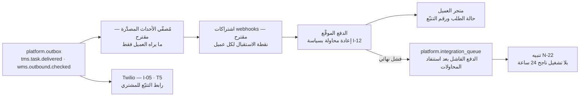

# الربط والتكامل مع المتاجر الإلكترونية للعملاء — الواقع في الخطة والخيارات
**PG-EOS v4 · D-blueprints · 21/09/2026 · حالة الوثيقة: تقييم + مقترح (لا قرار)**

**المصادر:** 23 §1 · §2 · §3 (I-09) · §4 · 40 §C10 · §B3 · §C3 · §C4 · Part E · 38-WBS المراحل 2/3/6 · 29 §6 · 27 §5–§10 · 26 §2-8 · 05 سيناريو 3 و4 · 25 §2 · §5 · EXECUTION-MASTER-v4 §1.1 · §1.4 · §1.7 · §1.8 · القاعدة الحيّة `pgeos` (فحص مباشر 21/09/2026)

---

## 1. الجواب المباشر

**نعم — الخطة تتضمن الربط، لكنها تتضمن *نصفه*: نحن نوفّر الواجهة، والعميل يبرمج الطرف الآخر.**

1. **ما هو مُخطَّط ومعتمد:** التكامل **`I-09` «واجهة العملاء — استيراد الطلبات»** مسجَّل في سجل التكاملات الأحد عشر (23 §1)، بخمس نقاط نهاية: `POST /orders` · `GET /orders/{ref}` · `GET /inventory` · `GET /shipments/{no}` · `POST /webhooks` (23 §3 · 40 §C10).
2. **مع ضوابطه:** مفتاح لكل عميل قابل للإبطال · عزل بـ**RLS في القاعدة لا في الكود** · **١٠٠ طلب/دقيقة** لكل مفتاح (EXEC §1.8) · التفرّد بـ`client_ref` · الإصدار `/v1` مجمَّد و`/v2` بتداخل ستة أشهر.
3. **مع نافذته:** **نافذة العميل باثنتي عشرة شاشة** وأربعة أدوار (`CLIENT_ADMIN` · `CLIENT_CREATOR` · `CLIENT_VIEWER` · `CLIENT_FINANCE`) — تطبيق منفصل تماماً (27 §5).
4. **التوقيت:** **المرحلة ٦** — المهمة **6.1** النافذة، والمهمة **6.2** الواجهة البرمجية وتعتمد على 6.1. أي **بعد** المستودع والتوصيل والمالية.
5. **وما هو *غير* مُخطَّط — وهذا جوهر السؤال:**
   - **لا موصّل جاهز لأي منصة متاجر بعينها.** فحص الحزمة كاملةً: **لا ذكر إطلاقاً** لـ Shopify · WooCommerce · Salla (سلة) · Zid (زد) · Magento · OpenCart · Wix. صفر إشارة، لا كقرار ولا كفجوة.
   - **لا سحب للطلبات من متجر العميل.** النموذج المعتمد **دفع من العميل إلينا** (`POST /orders`) — يعني أن **كل عميل متجر إلكتروني يحتاج مبرمجاً** ليربط متجره بنا.
   - **لا استيراد ملف للطلبات.** وثيقة 05 (سيناريو 3 · المتجر الإلكتروني SEG-B) تقول حرفياً: «① استيراد الشحنات: **API أو ملف أو نافذة العميل**» — **فمسار «الملف» منصوص عليه ولا مهمة WBS تبنيه ولا جدول يحمله**. هذه فجوة حقيقية في الحزمة لا خياراً مفتوحاً.
6. **والخلاصة الإدارية:** بالخطة كما هي، عميل متجر إلكتروني لا يملك مبرمجاً **لا يستطيع الربط**، ويبقى أمامه إدخال الطلبات يدوياً من نافذة العميل — ١٨٠٠ شحنة شهرياً في سيناريو 5 (05 §سيناريو 3) تعني **ستين إدخالاً يدوياً في اليوم**.

> **تحفّظ على السجل:** 23 §6 القرار رقم 5 يقول «**في الإطلاق** — I-09 مبنيّ ضمن نافذة العميل»، بينما EXECUTION-MASTER-v4 §1.4 يقول «**Phase 6**». الحاكم عند التعارض هو **EXECUTION-MASTER-v4** (سلّم الأسبقية R-01): **المرحلة ٦**. العبارتان متّسقتان عملياً لأن بوابة الإطلاق هي المرحلة ٧، لكن الصياغة في 23 §6 تُقرأ خطأً على أنها «مبكراً».

---

## 2. ما تقوله الحزمة حرفياً — والحالة المقابلة في القاعدة

**الفحص أُجري على القاعدة الحيّة، لا على الوصف النثري.** «موجود» تعني أن الجدول أو العمود أو السياسة موجودة فعلاً في `pgeos`.

### 2-1 العقد المعلَن

| # | البند | الوثيقة:القسم | النص / القرار المسجَّل | المرحلة · WBS | الحالة في القاعدة |
|---|---|---|---|---|---|
| 1 | التكامل `I-09` نفسه | 23 §1 | «**واجهة العملاء — استيراد الطلبات** · وارد · REST **يوفّرها نظامنا** · فوري · المالك `SYSADMIN` · الحرجية 🟠» | 6.2 | ⚠️ الجدول `platform.integration_config` **موجود وفارغ — صفر صفوف**. الأحد عشر رمزاً `I-01…I-11` **غير مبذورة** رغم ما توجبه 23 §2-2 |
| 2 | نقاط النهاية الخمس | 23 §3 · 40 §C10 | `POST /orders` · `GET /orders/{ref}` · `GET /inventory` · `GET /shipments/{no}` · `POST /webhooks` | 6.2 | ✗ لا يوجد — طبقة تطبيق تُبنى في 6.2 |
| 3 | المصادقة | 23 §3 | «مفتاح لكل عميل · **قابل للإبطال فوراً**» | 6.2 | ✗ **لا جدول لمفاتيح الـAPI** في أي مخطط. `identity` يحمل `sessions` و`otp_codes` فقط |
| 4 | العزل | 23 §3 · 40 §C10 · 27 §5 | «**RLS في القاعدة — لا في الكود**» · `client_id = current_client_id()` | 6.1 | ◐ الدالة `platform.current_client_id()` **موجودة**؛ والسياسات موجودة على **خمسة جداول فقط** — التفصيل في §2-2 |
| 5 | الحد | 23 §3 · EXEC §1.8 | «**١٠٠ طلب/دقيقة** لكل عميل» | 6.2 | ✗ لا مفتاح له بين الـ**٤٤** مفتاحاً في `platform.thresholds` — الحد يبقى ثابتاً في الكود لا قابلاً لضبط `GM` |
| 6 | التفرّد | 23 §3 · 40 §C10 | «`client_ref` **فريد لكل عميل** — إعادة الإرسال لا تنشئ أمراً ثانياً» | 6.2 | ◐ العمود `wms.outbound_orders.client_ref text` **موجود وnullable**، و**لا فهرس فريد** على `(client_id, client_ref)` — التفرّد **غير مفروض في القاعدة** |
| 7 | الإصدار | 23 §3 | «`/v1` ثابت · الكاسر يفتح `/v2` ويبقى `/v1` **ستة أشهر**» | 6.2 | — سياسة تطبيق |
| 8 | التوقيت | EXEC §1.4 | «Client API — **Phase 6**، `/v1`» | 6.2 | — |
| 9 | ترتيب التبعية | 38 §6 | **6.2 تعتمد على 6.1** · و**6.1 تعتمد على 2.11 و3.4 و4.6** (أمر الصرف · مهام التوصيل وPOD · الفاتورة PDF) | — | — تبعية حقيقية: لا نافذة قبل اكتمال المستودع والتوصيل والفوترة |
| 10 | قبول 6.1 | 38 §6 · 27 §10 | «مستخدم عميل A يعدّل معرّف العميل → **يعيد صفر صفوف، لا خطأ صلاحية**» | 6.1 | — اختبار آلي دائم، فشله يمنع النشر |
| 11 | قبول 6.2 | 38 §6 | «Idempotent by `client_ref`; rate-limited» | 6.2 | ⚠️ **لا سيناريو قبول Gherkin في 40 Part E يختبر `POST /orders`** — السيناريوهات الثلاثة لبوابة المرحلة ٦ (6.7) هي **S7 · S9 · S12** وكلها تجارية لا تمسّ الواجهة |
| 12 | التشغيل ثلاثة عملاء | 38 §6.6 | «ثلاثة عملاء حقيقيون يعملون» بوابة المرحلة، المالك `GM` | 6.6 | — |

### 2-2 الأدوار والنافذة

| # | البند | الوثيقة:القسم | النص / القرار | المرحلة · WBS | الحالة في القاعدة |
|---|---|---|---|---|---|
| 13 | الأدوار الأربعة | 40 §C10 · 27 §8 · EXEC §1.7 | `CLIENT_ADMIN` يدير مستخدميه ويعتمد · `CLIENT_CREATOR` ينشئ **ولا يعتمد** · `CLIENT_VIEWER` قراءة · `CLIENT_FINANCE` الفواتير وكشف الحساب فقط | 6.1 | ✅ **الأربعة مبذورة** في `identity.roles` بـ`scope_type = 'client'` |
| 14 | مستخدم العميل | 40 §B1 | مستخدم من نوع عميل مربوط بحسابه | 6.1 | ✅ `identity.users.user_type` + `client_id` + القيد `client_user_has_client` يمنع مستخدم عميل بلا عميل |
| 15 | الشاشات الاثنتا عشرة | 40 §C10 · 27 §6 | الدخول · اللوحة · المخزون · الحركات · **إنشاء ASN** · **إنشاء أمر صرف** · أوامري · تتبّع + POD · تنبيهات المخزون · الفواتير وكشف الحساب · التقارير · الشكاوى | 6.1 | — تطبيق منفصل `apps/portal` |
| 16 | تطبيق منفصل | 27 §5 · 40 §C10 | «تطبيق **منفصل تماماً** — لا مشاركة كود مع الواجهة الإدارية» | 6.1 | — |
| 17 | ما لا يراه العميل | 27 §7 · 40 §C10 · EXEC §1.1 | عملاء آخرون · تكاليفنا وهوامشنا · الموظفون · أسعار غيره · **الشريك المنفّذ لا يُسمّى إطلاقاً** · **المواقع التفصيلية** | 6.1 | ◐ الإعداد `wms.client_sees_detailed_locations` **موجود في `platform.settings`** — لكنه **عام لا لكل عميل**، بينما EXEC §1.1 و27 §15 بند 3 ينصّان «**إعداد لكل عميل** والافتراضي لا» |
| 18 | تهيئة عميل جديد | 27 §9 | عقد ساري + أسعار → `CLIENT_ADMIN` بدعوة بريدية → جلسة ٣٠ دقيقة → **أسبوع تشغيل مراقَب تُراجع فيه أوامره يدوياً** → التشغيل الكامل | 6.1 · 6.6 | — |
| 19 | بوابة فتح النافذة | 27 §9 | «لا تُفتح النافذة لعميل قبل اكتمال **جاهزية العميل**: أصنافه · مواقعه · أسعاره · حده الائتماني» | 6.6 | — حاجز إداري لا تقني |
| 20 | البديل اليدوي عند التعطل | 26 §2-8 | «نافذة العميل **تعذّر** — يُخطَر العملاء أن الطلبات تُستقبل **هاتفياً عبر الكول سنتر** وتُدوَّن على نموذج التذكرة · **أربع ساعات**» | — | ✅ البديل منصوص — وهو الحقل السابع من العقد الموحّد (23 §2) |

### 2-3 المسارات التي تدخل الطلب إلى النظام

| # | البند | الوثيقة:القسم | النص / القرار | المرحلة · WBS | الحالة في القاعدة |
|---|---|---|---|---|---|
| 21 | المسارات الثلاثة لعميل المتجر | 05 سيناريو 3 §الدورة | «① استيراد الشحنات: **API أو ملف أو نافذة العميل** → `tms.delivery_tasks`» | ✗ **لا مهمة WBS لمسار «الملف»** | ⚠️ **فجوة**: النص يعد بثلاثة مسارات، والحزمة تبني اثنين |
| 22 | مصدر المهمة | 40 §C4 | `delivery_tasks.source_type` بقيم `internal | imile | oula | client_portal | api` | 3.4 | ◐ العمود **موجود** افتراضه `'internal'` — **بلا قيد قائمة مغلقة**، فأي نص يُقبل |
| 23 | منع التكرار | 05 سيناريو 3 §نقاط الحذر · 40 §C4 | «**فهرس فريد على (المصدر + مرجع المصدر)** يمنع الإدخال المزدوج» · `source_ref` unique per source | 3.4 | ⚠️ العمود موجود والفهرس `delivery_tasks_source_type_source_ref_idx` **موجود — لكنه `btree` عادي لا `unique`**. فهو يسرّع البحث **ولا يمنع التكرار**: الضمانة المكتوبة غير مفروضة |
| 24 | رفض العنوان الناقص | 05 سيناريو 3 · 40 Part E `S3` | «مهمة بمنطقة `Salmiya` بلا قطعة ولا شارع ⇒ **الواجهة تعيد `422`** تُعدّد الحقول الناقصة» | 3.4 | ◐ الأعمدة `area` · `governorate` · `block` · `street` · `building` **كلها موجودة nullable** — الفرض على طبقة التطبيق كما هو مقصود |
| 25 | أمر الصرف من النافذة | 40 §C10 · 27 §6 شاشة 6 | «يُرفض فوراً عند الحجز الائتماني **مع ذكر السبب**» + الفحص العشري (40 §C3) | 2.11 · 6.1 | ✅ `outbound_orders.status` يحمل `checks_pending` و`credit_rejected` في قيد الحالة — المسار مبنيّ في المخطط |
| 26 | أمر الاستلام من النافذة (ASN) | 27 §6 شاشة 5 | «بنفس فحص الشروط الداخلي» | 6.1 | ⚠️ `wms.inbound_orders` فيه `asn_ref` **ولا `client_ref`** — فلا مفتاح تفرّد للعميل على الاستلام، و**لا سياسة RLS للعميل** على الجدول إطلاقاً |
| 27 | نموذج المحطة (البديل النقيض) | 05 سيناريو 4 | «مصدر البيانات: **وكيل يقرأ بوابة العميل**» — أي أن الحزمة **تعرف** نموذج السحب من نظام العميل وتطبّقه على iMile وحدها | I-01/I-02 · المرحلة 3 | ✅ مخطط `imile` كامل — فالقدرة التقنية على السحب من طرف ثالث **مثبتة في الحزمة**، وغير معمَّمة على المتاجر |

### 2-4 الطابور والمراقبة — العمود الفقري لأي موصّل لاحق

| # | البند | الوثيقة:القسم | النص / القرار | المرحلة · WBS | الحالة في القاعدة |
|---|---|---|---|---|---|
| 28 | `integration_config` | 23 §2-2 | «**العقد والسياسة** — صف واحد ثابت لكل تكامل» | 0.x | ✅ الجدول موجود بثمانية عشر عموداً منها `owner_role` و`legacy_name` و`idempotency_key` و`on_failure` — **وفارغ** |
| 29 | `integration_queue` | 23 §2-1 | الحالات: `pending · resolved · discarded` | 0.x | ⚠️ **تعارض**: القيد في القاعدة `chk_integration_queue_status` يسمح بـ`pending · processing · done · failed` — **أربع قيم مختلفة عن الوثيقة**. الفهرس `(status, created_at)` موجود كما تنصّ الوثيقة |
| 30 | `integration_runs` | 23 §2-2 | «سجل التشغيل — كل تشغيلة بنتيجتها» | 0.x | ✅ موجود بحالات `running · success · failed · partial` وفهرس `(integration_code, started_at desc)` — وفارغ |
| 31 | القاموس المشترك | 23 §2-2 · PLT-26 | «يُضاف عمود `integration_code` إلى الجدولين ويرجع إلى `integration_config(code)`» | 0.x | ✅ **منفَّذ** — العمود والمفتاح الأجنبي موجودان على `integration_queue` و`integration_runs` كليهما |
| 32 | التنبيهات الأربعة | 23 §4 · 25 §2 · EXEC §1.4 | **N-19** الطابور > ٢٠ سجلاً أو > ٤٨ ساعة · **N-20** ارتداد واتساب > ٥٪ · **N-21** مطابقة بنكية > ٧ أيام · **N-22** تكامل بلا تشغيل ناجح ٢٤ ساعة | 5.13 | ✅ `platform.alert_rules` و`alert_log` موجودان |
| 33 | لوحة التكاملات | 23 §4 | `/platform/integrations` — صف لكل تكامل · «**صف واحد أحمر = يوم لا يُقفل**» | 5.13 · 29 §6-3 فئة «إعدادات وإدارة» | — |
| 34 | تقرير حالة التكاملات | 25 §5 | **R-06** حالة التكاملات · يومي · المالك `SYSADMIN` · الإجراء «تدخّل فني» | 5.13 | — |
| 35 | الحدث والصندوق الصادر | 40 §B3 | `platform.outbox` هو **جدول الأحداث الحاكم**؛ الحدث يُكتب **في نفس المعاملة** مع تغيّر الحالة؛ الناشر **at-least-once** والمشترك **idempotent** بـ`(event_id)` | 0.12 | ✅ الجدول موجود مع `correlation_id not null` و`causation_id` وفهرس الصفوف غير المنشورة — **هذا هو الحامل الطبيعي لأي دفع حالة إلى متجر العميل** |

### 2-5 خلاصة §2 في ست نقاط

1. **العقد مكتوب جيداً** — الحقول التسعة للتكامل (23 §2) والحدود والأدوار وسياسة الفشل كلها محسومة.
2. **الوعاء الأساسي موجود ومنفَّذ** — `integration_config/queue/runs` بالقاموس المشترك، و`platform.outbox` بـ`correlation_id`.
3. **`integration_config` فارغ** — لا صف واحد لأي من `I-01…I-11`، فلوحة التكاملات والتنبيه **N-22** بلا مصدر اليوم.
4. **ثلاثة ضمانات مكتوبة وغير مفروضة في القاعدة:** تفرّد `client_ref` (لا فهرس)، تفرّد `(source_type, source_ref)` (الفهرس قائم **غير فريد**)، والقائمة المغلقة لـ`source_type`.
5. **حالات `integration_queue` في القاعدة تخالف الوثيقة** — يجب توحيدها قبل بناء أي شاشة طابور.
6. **مسار «الملف» في 05 بلا مهمة ولا جدول** — وهو بالضبط المسار الذي يحتاجه عميل متجر بلا مبرمج.

---

## 3. ما يطلبه عميل متجر إلكتروني فعلاً — وهل تغطيه `I-09` كما هي

المنظور هنا منظور **العميل صاحب المتجر**، لا منظورنا. سبع قدرات يسأل عنها كل مشغّل متجر قبل التعاقد مع مزوّد لوجستي:

| # | القدرة التجارية | ماذا تعني عملياً | تغطية `I-09` كما هي | ما الناقص بالتحديد |
|---|---|---|---|---|
| **ق-1** | **استيراد الطلبات آلياً** | كل طلب يُنشأ في متجره يصل إلينا بلا لمسة بشرية | **جزئياً** — `POST /orders` معلن بمفتاح تفرّد إلزامي | **الاتجاه معكوس**: نحن ننتظر أن *يدفع* العميل. لا سحب من متجره. العميل بلا مبرمج = لا ربط. ولا مسار ملف بديل رغم نصّ 05 |
| **ق-2** | **تحديث حالة الشحنة في متجره** | حالة الطلب في لوحة متجره تتبدّل: خرجت · سُلّمت · فشلت · مرتجع | **جزئياً** — `POST /webhooks` «تسجيل نقطة استقبال أحداثه» | **لا جدول اشتراك** ولا سجل تسليم ولا إعادة محاولة ولا توقيع للحمولة. و**لا قائمة معتمَدة للأحداث المرئية للعميل** — `platform.outbox` يحمل كل الأحداث الداخلية ولا تصنيف يفرز ما يُصدَّر |
| **ق-3** | **رقم التتبّع للعميل النهائي** | رابط يُرسله المتجر لمشتريه ليتابع شحنته | **جزئياً** — `GET /shipments/{no}` معلن، والقالب **T5** «رابط تتبّع + إثبات تسليم» معرَّف في 35 §1-3 ويُرسل عبر Twilio | ⚠️ **لا عمود `tracking_no` على `tms.delivery_tasks` إطلاقاً** — فحص القاعدة: العمود موجود في `imile.*` **وحدها** (خمسة جداول). المتاح لمهامنا `doc_no` و`source_ref`، فالـ`{no}` في نقطة النهاية **بلا حامل معرَّف**. وT5 يُرسله **نظامنا** لا متجر العميل |
| **ق-4** | **مزامنة المخزون (3PL)** | رصيد متجره يعكس رصيدنا الحقيقي فلا يبيع ما ليس موجوداً | **لا** | `GET /inventory` معلن، لكن `wms.stock_balance` سياسته `internal_only` — **لا مسار قراءة للعميل أصلاً**. ولا حدث دفع عند تغيّر الرصيد، ولا نقطة نهاية للحجز الناعم قبل التأكيد |
| **ق-5** | **COD والتسويات** | كم حُصِّل نقداً · متى يُحوَّل إليه · ما المعلّق | **جزئياً** | `tms.delivery_tasks.is_cod` و`cod_amount` و`cod_collected` **موجودة**، و**R-03 مطابقة COD** يومية لـ`CFO`. لكن **لا نقطة نهاية** تعطي العميل كشف COD، ولا دورة تسوية معرَّفة، ولا حدث «حُصِّل» مصدَّر |
| **ق-6** | **المرتجعات** | المشتري يرفض · الطلب يعود · المخزون يُعاد · الفاتورة تُعدَّل | **لا** | الحالة `returned` موجودة في قيد `chk_delivery_tasks_status`، والعلم `bills_return` على `sales.contracts`، والموقع `RTN` ضمن الثلاثين التشغيلية. **ولا جدول أمر إرجاع، ولا نقطة نهاية، ولا مسار يعيد الصنف إلى `stock_balance` عبر الواجهة** |
| **ق-7** | **الإشعارات** | المشتري يُخطَر في كل مرحلة | **جزئياً** | I-05/I-06 عبر **Twilio** بالقوالب **T1–T5** (35 §1-3) · **لا كتابة حرة** · **ساعات هدوء ٢٢:٠٠–٠٧:٠٠** · الارتداد > ٥٪ = **N-20**. لكن الإشعار **من نظامنا للمشتري** — لا إشعار آلي إلى نظام العميل ليشعر متجره بالتغيير (وهو ق-2) |

**القراءة الإدارية لهذا الجدول:** من سبع قدرات، **صفر مغطاة كاملةً**، **خمس جزئية**، **اثنتان غائبتان** (المخزون والمرتجعات). والقاسم المشترك في كل «جزئياً» واحد: **العقد معلن والحامل غير مبنيّ**. هذا طبيعي لمرحلة لم تُبنَ بعد — لكنه يعني أن الإجابة على المدير العام ليست «نعم مغطّى»، بل «**نعم مخطَّط، وبفجوتين حقيقيتين ونموذج تشغيل يفترض أن كل عميل يملك مبرمجاً**».

---

## 4. الخيارات الثلاثة

**قاعدة التقدير:** لا أرقام تكلفة ولا أيام عمل — الحزمة لا تحملها، واختراعها يفسد التخطيط. التقدير **بالحجم النسبي** مع سببه.

### 4-1 جدول المقارنة

| البند | **الخيار أ — API فقط كما في الخطة** | **الخيار ب — جسر سريع: استيراد/تصدير ملف** | **الخيار ج — طبقة موصّلات `I-12`** |
|---|---|---|---|
| **النطاق** | ما هو مُخطَّط بالفعل، بلا إضافة نطاق | استيراد طلبات بقالب موحّد من نافذة العميل + تصدير حالات | موصّلات لمنصات بعينها تسحب الطلبات وتدفع الحالة والتتبّع والمخزون |
| **ما يُبنى** | 6.1 النافذة · 6.2 الواجهة الخمس · **+ توثيق للمطورين** · **+ بيئة تجريبية (sandbox) بمفتاح اختبار وبيانات وهمية** · بذر `integration_config` بالرمز `I-09` | شاشة رفع في النافذة · قالب CSV/Excel موحّد منشور · مُحقِّق يرفض الصف الناقص قبل الإنشاء · جدول دفعات الاستيراد · تصدير الحالات بالجدولة أو عند الطلب | محوّل لكل منصة فوق `I-09` نفسه · جدول ربط حساب المتجر · مخزن الأسرار للرموز · مجدول سحب · مُصفّي أحداث للدفع · شاشة ربط في نافذة العميل |
| **من يبرمج عند العميل** | **مبرمج إلزامي** | **لا أحد** — موظف يرفع ملفاً | **لا أحد** — العميل يضغط «اربط متجري» ويأذن |
| **المرحلة المقترحة** | **٦** كما هي | **٢ أو ٣** — بعد 2.11 أمر الصرف (للتخزين) وبعد 3.4 مهام التوصيل (للشحن) | **٦ كتوسعة `6.2b`** بعد 6.2 · أو **٣** إن قرّر `GM` التقديم |
| **الأثر على WBS** | **صفر** — تعديل نص 6.2 ليشمل التوثيق والبيئة التجريبية | **مهمة واحدة جديدة** في المرحلة ٢ أو ٣ · تعتمد على 2.11 و3.4 | **مهمة واحدة جديدة `6.2b`** تعتمد على 6.2 · + صف ثاني عشر في سجل التكاملات |
| **الأثر على المخطط** | **صفر جديد** — لكن يلزم **إغلاق ثلاث ضمانات مكتوبة وغير مفروضة** (§2-5 بند 4) | **صغير**: فهرس فريد `(client_id, client_ref)` · جدول دفعات الاستيراد · ترقية فهرس `(source_type, source_ref)` إلى `unique` · قائمة مغلقة لـ`source_type` | **متوسط**: جدول ربط المتجر · جدول اشتراك webhooks · عمود `tracking_no` · سياسات RLS على المخزون وسطور الأوامر وPOD |
| **الحجم النسبي** | **صغير** (فوق المخطَّط أصلاً) — التوثيق والبيئة التجريبية عمل معروف بلا منطق أعمال جديد | **صغير–متوسط** — المنطق موجود كله في أمر الصرف ومهمة التوصيل؛ الجديد **قراءة ملف والتحقق منه ومعالجة الخطأ** | **متوسط–كبير** — ليس لتعقيد المنطق، بل **لتعدّد المنصات**: كل منصة نموذج بيانات ومصادقة وحدود مختلفة، **وكلها تتغيّر بلا إذننا** |
| **المخاطر** | العميل بلا مبرمج لا يُربَط · المنافس بموصّل جاهز يسبقنا · الطلبات اليدوية تُدخَل خطأً · **التتبّع بلا `tracking_no`** | التأخّر بحكم الطبيعة الدفعية — **ليس لحظياً** · خطأ صف واحد يُفشل الدفعة إن لم تُعالَج جزئياً · **الملف يصير عادةً دائمة** فيؤجَّل الربط الحقيقي | **العبء المستمر**: كل تحديث منصة يكسر الموصّل · تخزين رمز وصول لمتجر العميل = **مسؤولية أمنية جديدة** · موصّل معطوب = طلبات مفقودة ولوم علينا |
| **ما يحتاج قرار `GM`** | لا شيء — **تنفيذ ما هو مقرّر** | ①إقرار المسار ② المرحلة ٢ أم ٣ ③ هل القالب موحّد لكل العملاء أم لكل عقد | ①إنشاء `I-12` ② المنصات وترتيبها ③ المرحلة ④ من يملك الموصّل بالمنصب ⑤ سياسة تخزين رموز المتاجر |

### 4-2 تفصيل الخيار أ — API فقط

**ما هو:** تنفيذ 6.1 و6.2 كما هما، **زائد** شيئين لا تذكرهما الحزمة وبدونهما الواجهة غير قابلة للاستخدام فعلياً:

1. **توثيق للمطورين** — مرجع نقاط النهاية الخمس بأمثلة حقيقية وبأكواد الخطأ (منها الـ`422` المنصوص في `S3`). الحزمة توجب `api/` بـ«Zod schemas → OpenAPI» (40 §A4) فالتوثيق **مولَّد لا مكتوب**، وهذا يخفّض الكلفة.
2. **بيئة تجريبية** — مفتاح اختبار وبيانات وهمية يجرّب عليها مبرمج العميل قبل الإنتاج. بدونها كل تجربة تقع على قاعدة الإنتاج.

**ما يلزم إغلاقه على المخطط (ليس إضافة — بل وفاء بما هو مكتوب):**

| الضمانة | النص الموجب | الحالة | ما يلزم |
|---|---|---|---|
| تفرّد `client_ref` | 23 §3 · 40 §C10 | العمود بلا فهرس فريد | فهرس فريد جزئي على `(client_id, client_ref)` حيث `client_ref is not null` |
| مفتاح لكل عميل قابل للإبطال | 23 §3 | لا جدول | جدول مفاتيح بتجزئة المفتاح لا نصّه · `revoked_at` · `last_used_at` |
| حدّ ١٠٠/دقيقة | EXEC §1.8 | ثابت في الكود | مفتاح في `platform.thresholds` ليضبطه `GM` بلا نشر |
| `I-09` في سجل التكاملات | 23 §2-2 | `integration_config` فارغ | بذر الأحد عشر رمزاً — **شرط لعمل N-22 ولوحة التكاملات وR-06** |

**متى يكفي هذا الخيار وحده:** إذا كان عملاء المتاجر المستهدفون **كباراً بفرق تقنية**. سيناريو 3 في 05 (`SHOP` · ١٨٠٠ شحنة شهرياً) **ليس منهم غالباً**.

### 4-3 تفصيل الخيار ب — الجسر السريع

**الفكرة:** أبسط طريق من «طلبات في متجره» إلى «مهام في نظامنا» بلا سطر كود عند العميل: **يصدّر من متجره ملفاً، ويرفعه في نافذتنا، ويستقبل ملف حالات**. كل منصات المتاجر المذكورة تصدّر CSV/Excel أصلاً.

**لماذا هو مشروع فعلاً وليس اختراعاً:** وثيقة 05 سيناريو 3 تنصّ على المسار حرفياً — «**API أو ملف أو نافذة العميل**». فالخيار ب **ليس نطاقاً جديداً، بل وفاء بنصّ قائم بلا مهمة**.

**ما يلزم للمخطط — بالحد الأدنى، وكله موسوم «مقترح»:**

| # | الإضافة | لماذا | الحجم |
|---|---|---|---|
| ب-1 | **فهرس فريد على `(client_id, client_ref)`** في `wms.outbound_orders` | العمود موجود والتفرّد غير مفروض — ورفع نفس الملف مرتين هو **الخطأ الأول المتوقّع** | ضئيل |
| ب-2 | **`client_ref` على `wms.inbound_orders`** بفهرس فريد مماثل | الجدول يحمل `asn_ref` فقط ولا مفتاح تفرّد للعميل — وشاشة ASN (27 §6 شاشة 5) تحتاجه | ضئيل |
| ب-3 | **ترقية فهرس `(source_type, source_ref)` إلى `unique`** في `tms.delivery_tasks` | الفهرس قائم **عادياً لا فريداً**، فهو يسرّع ولا يمنع — والنصّ يوجب «فهرساً **فريداً**» (05 · 40 §C4) وهو الحارس الوحيد ضد الشحنة المكرّرة | ضئيل |
| ب-4 | **قيد قائمة مغلقة على `source_type`** بالقيم الخمس المنصوصة في 40 §C4 | العمود نصّ حرّ اليوم؛ وبلا قائمة لا يُفرَز مصدر الطلب في أي تقرير | ضئيل |
| ب-5 | **جدول دفعات الاستيراد** — «مقترح» | لا وجود له. يحمل: العميل · الملف · من رفعه · عدد الصفوف · المقبول · المرفوض · الحالة · الربط بـ`integration_queue` للصفوف الفاشلة | صغير |
| ب-6 | **سياسة RLS للعميل على `wms.inbound_orders`** | الجدول اليوم `entity_scope` فقط — فالعميل لا يرى أوامر استلامه | ضئيل |

**سلوك المعالجة المقترح:** الملف يُقبل **جزئياً لا كلياً** — الصفوف السليمة تُنشئ أوامر، والصفوف الفاشلة تذهب إلى `platform.integration_queue` بحمولتها وسبب الفشل، فتظهر في **N-19** إن تجاوزت العتبة. هذا استخدام للوعاء القائم بلا آلية ثانية.

**حدّه:** دفعي لا لحظي. لعميل يرفع مرتين يومياً هذا كافٍ؛ لمن يحتاج التزام «٤٨ ساعة من لحظة الطلب» (SLA سيناريو 3) فالفارق ساعات ويؤكل من المهلة.

### 4-4 تفصيل الخيار ج — طبقة الموصّلات `I-12`

**الفكرة:** محوّل لكل منصة يتحدث لغتها، ويترجم إلى **نفس أوامر الإنشاء** التي يستدعيها `I-09`. **لا مسار ثانٍ داخل النظام** — الموصّل عميل داخلي لواجهتنا، لا باب خلفي.

**المبدأ الحاكم — ثلاثة قيود على التصميم:**
1. **الموصّل لا يكتب في القاعدة مباشرة.** يستدعي `CreateOutbound` نفسه (40 §C3) فيمرّ بالفحص العشري كاملاً. أي التفاف يعني مساراً ثانياً وهو ما يحظره المبدأ المعماري (40 §A4: «No cross-module import — use an event or a contract»).
2. **الموصّل يُعلَن في `platform.integration_config`** بالرمز `I-12` وسياسة فشله وعتبة تنبيهه ومالكه بالمنصب — كأي تكامل، بالحقول التسعة (23 §2).
3. **ما يفشل يذهب إلى `platform.integration_queue`** — لا إلى سجلّ خاص. فالطابور الموحّد والتنبيه **N-19** يعملان عليه بلا بناء جديد.

**المنصات المقترحة بداية** — بحكم السوق الخليجي والكويتي: **Salla (سلة)** · **Zid (زد)** · **Shopify** · **WooCommerce**. الاثنتان الأوليان لأن حصتهما في السوق المحلي هي الأكبر بين متاجر التجزئة الصغيرة والمتوسطة؛ والأخيرتان لأنهما الأوسع عالمياً وتخدمان العميل الذي يبيع خارج الكويت. **الترتيب قرار `GM`** ويُبنى على عملائنا الفعليين لا على حصة السوق العامة.

**موضعه في WBS — خياران:**

| البديل | الموضع | الأثر | متى يُختار |
|---|---|---|---|
| **ج-1** | **`6.2b`** بعد 6.2 مباشرة في المرحلة ٦ | لا يمسّ أي تبعية قائمة · بوابة المرحلة ٦ (6.6 ثلاثة عملاء) قد تستفيد منه | الافتراضي — لأنه يبني فوق `I-09` الذي لا يوجد قبل 6.2 |
| **ج-2** | تقديمه إلى المرحلة ٣ | يفرض تقديم جزء من 6.2 معه (لا موصّل بلا واجهة)، **فيخلّ بترتيب المراحل ويؤخّر المالية** | فقط إن كان عميل متجر كبير **شرطاً تعاقدياً موقَّعاً** |

**التوصية الفنية:** **ج-1**، مع الخيار ب في المرحلة ٢/٣ كجسر يسدّ الفجوة حتى المرحلة ٦. الخياران **متكاملان لا بديلان**: ب يخدم الصغار والاستثناءات دائماً، وج يخدم من يستحق موصّلاً مخصّصاً.

### 4-5 ما تحسمه المقارنة

- **أ وحده** = وفاء بالمخطَّط، **وعجز تجاري مع عميل بلا مبرمج**.
- **ب** = أرخص ردّ على سؤال المدير العام، **وأسرعه**، ويسدّ فجوة منصوصة في 05 بلا اختراع نطاق.
- **ج** = الردّ التنافسي الحقيقي، **وأثقله في الصيانة**، ولا معنى له قبل وجود `I-09`.
- **الثلاثة معاً مسار متدرّج**: ب في المرحلة ٢/٣ → أ في المرحلة ٦ كما هو مقرّر → ج في `6.2b`.

---

## 5. التصميم المقترح للخيار ج — إن قُبل

> **حالة هذا القسم: مقترح بالكامل.** كل جدول أو عمود يذكره موسوم «**مقترح**» ما لم يُنصّ على أنه موجود. لا شيء هنا قرار.

### 5-1 خريطة المسار

#### خريطة 11-1: من متجر العميل إلى مهمة توصيل — الاتجاه الوارد
تقرأ من متجر العميل على اليسار إلى المهمة والحدث على اليمين؛ كل عقدة رمادية «مقترح» وكل عقدة زرقاء موجودة اليوم في القاعدة.

#### خريطة 11-2: من الحدث إلى متجر العميل — الاتجاه الصادر
تقرأ من الحدث في نظامنا على اليسار إلى لوحة متجر العميل على اليمين.

**قراءة الخريطتين في ست نقاط:** ① الموصّل **يسحب** من المتجر بدل انتظار الدفع. ② كل طلب يمرّ بـ`I-09` نفسه فيخضع للفحص العشري كاملاً — **لا باب خلفي**. ③ ما يفشل في أي محطة يهبط في `platform.integration_queue` الموجود، فيراه **N-19**. ④ الحدث يُكتب في **نفس معاملة** تغيّر الحالة (40 §B3) فلا يُدفع ما لم يقع. ⑤ المُصفّي هو الضابط الذي يمنع تسرّب حدث داخلي إلى العميل. ⑥ إشعار المشتري النهائي يبقى مسارنا عبر **Twilio بالقوالب T1–T5** ولا يمرّ بالمتجر.

### 5-2 الحقول الدنيا للطلب المستورد

**الربط من حقل المتجر إلى عمودنا المتحقَّق منه في القاعدة:**

| # | حقل المتجر | عمودنا | الجدول | الحالة | إلزامي | ملاحظة |
|---|---|---|---|---|---|---|
| 1 | رقم الطلب في المتجر | `client_ref` | `wms.outbound_orders` | ✅ موجود nullable | **نعم** | **مفتاح التفرّد** — يلزمه فهرس فريد `(client_id, client_ref)` · **مقترح** |
| 2 | هوية العميل (المتجر) | `client_id` | `wms.outbound_orders` | ✅ موجود not null | نعم | يُشتقّ من مفتاح الـAPI لا من الحمولة — **لا يُقبل من العميل إطلاقاً** |
| 3 | اسم المشتري | `ship_to_name` → `recipient_name` | `outbound_orders` → `delivery_tasks` | ✅ موجودان | نعم | |
| 4 | هاتف المشتري | `ship_to_phone` → `recipient_phone` | نفسهما | ✅ موجودان | **نعم** | 05: «النظام يرفض المهمة بلا: منطقة · قطعة · شارع · **هاتف**» |
| 5 | المنطقة | `ship_to_area` → `area` | نفسهما | ✅ موجودان | **نعم** | |
| 6 | القطعة | `block` | `tms.delivery_tasks` | ✅ موجود nullable | **نعم** | الفرض على التطبيق — `422` |
| 7 | الشارع | `street` | `tms.delivery_tasks` | ✅ موجود nullable | **نعم** | `422` |
| 8 | المبنى | `building` | `tms.delivery_tasks` | ✅ موجود nullable | لا | مفيد لا حاسم |
| 9 | المحافظة | `governorate` | `tms.delivery_tasks` | ✅ موجود | لا | تُشتقّ من المنطقة عادة |
| 10 | العنوان الحرّ | `ship_to_address` → `address_text` | نفسهما | ✅ موجودان | لا | |
| 11 | **الدفع عند الاستلام** | `is_cod` | `tms.delivery_tasks` | ✅ موجود not null افتراضه false | نعم | |
| 12 | **مبلغ COD** | `cod_amount` | `tms.delivery_tasks` | ✅ موجود `numeric(14,3)` | إن `is_cod` | ثلاث خانات عشرية — الدينار الكويتي |
| 13 | الصنف | `sku_id` | `wms.order_lines` | ✅ موجود not null | نعم | **يُحلّ من رمز المتجر** — انظر أدناه |
| 14 | **رمز الصنف عند العميل** | `client_sku` | `wms.skus` | ✅ **موجود** | — | **مفتاح الربط الطبيعي** · يلزمه فهرس فريد `(client_id, client_sku)` · **مقترح** |
| 15 | الباركود | `barcode` · `carton_barcode` | `wms.skus` | ✅ موجودان | — | بديل للربط |
| 16 | الكمية | `qty_ordered` | `wms.order_lines` | ✅ موجود not null | نعم | |
| 17 | وحدة القياس | `uom` | `wms.order_lines` | ✅ موجود not null | نعم | من الصنف عادةً |
| 18 | تاريخ الاستحقاق | `required_by` | `wms.outbound_orders` | ✅ موجود | لا | يخدم قياس SLA |
| 19 | مصدر المهمة | `source_type = 'api'` | `tms.delivery_tasks` | ✅ موجود **بلا قيد** | نعم | من القيم الخمس في 40 §C4 |
| 20 | مرجع المصدر | `source_ref` | `tms.delivery_tasks` | ✅ موجود · الفهرس قائم **غير فريد** | نعم | يحمل رقم الطلب في المتجر |
| 21 | **رقم التتبّع** | — | — | ❌ **غير موجود** | نعم | **الفجوة**: `tracking_no` في `imile.*` وحدها · **مقترح** إضافته إلى `tms.delivery_tasks` ليخدم `GET /shipments/{no}` |

**قاعدة حاكمة على هذا الجدول:** ثمانية عشر من الواحد والعشرين حقلاً **لها عمود موجود فعلاً**. الناقص **ثلاثة فقط**: فهرس تفرّد الطلب، فهرس تفرّد صنف العميل، وعمود رقم التتبّع. **هذا هو السبب الحقيقي لتقدير الخيار ج بـ«متوسط» لا «كبير»** — نموذج البيانات جاهز، والعمل في المحوّلات لا في المخطط.

### 5-3 معالجة الأخطاء — بالوعاء القائم

`platform.integration_queue` موجود بالحالات **`pending` · `processing` · `done` · `failed`** (القيد `chk_integration_queue_status` في القاعدة). كل خطأ يُخزَّن بحمولته الكاملة في `payload jsonb` وسببه في `error`، فلا يضيع طلب.

| الخطأ | متى يقع | الحالة الأولية | من يبتّ | القرار المتاح | الضابط |
|---|---|---|---|---|---|
| **صنف غير معروف** | `client_sku` أو الباركود لا يطابق أي صنف لهذا العميل | `pending` | `WH_MGR` أو `CLIENT_ADMIN` عبر تذكرة | ربط الرمز بصنف قائم · إنشاء الصنف · تجاهل الصف | ⚠️ **INV-C3-3**: «صنف يخصّ عميلاً واحداً؛ حركة صنفها ≠ عميل الأمر **مرفوضة**» — فالربط لا يعبر الحدود |
| **عنوان ناقص** | بلا منطقة أو قطعة أو شارع أو هاتف | `pending` | الكول سنتر `CC_AGENT` | استكمال بالاتصال بالمشتري ثم إعادة المحاولة · إلغاء | **الواجهة تعيد `422` تُعدّد الحقول الناقصة** — 40 Part E `S3` · 05 نقاط الحذر |
| **تكرار** | نفس `client_ref` وصل مرتين | **لا يدخل الطابور** | — | **يُعاد الأمر الأصلي بنجاح** | التفرّد `client_ref` (23 §3) — هذا سلوك idempotent لا خطأ |
| **حجز ائتماني** | العميل تحت `credit_hold` | `pending` | `CFO` | فكّ الحجز · رفض الطلب | 40 §C10: «رفض فوري **مع ذكر السبب**» · `outbound_orders.status = 'credit_rejected'` **موجود في القيد** |
| **رصيد غير كافٍ** | الكمية تتجاوز المتاح | `pending` | `WH_MGR` | تخصيص جزئي · انتظار وارد | من الفحص العشري (40 §C3) · الحالة `partially_allocated` **موجودة في القيد** |
| **تجاوز الحدّ** | > ١٠٠ طلب/دقيقة للمفتاح | **لا يدخل الطابور** | — | إعادة المحاولة بتباعد | EXEC §1.8 — استجابة `429` |
| **فشل دفع الحالة** | نقطة استقبال العميل لا تستجيب | `failed` بعد استنفاد `retry_max` | `SYSADMIN` | إعادة الدفع · تعطيل الاشتراك | `retry_max` و`retry_backoff_sec` و`on_failure` **أعمدة موجودة** في `integration_config` |
| **الموصّل متوقف** | لا تشغيل ناجح ٢٤ ساعة | — | `SYSADMIN` | تدخّل فني | **N-22** (23 §4) · و**R-06** يومياً |

> ⚠️ **يجب حسمه قبل أي بناء:** حالات الطابور في القاعدة (`pending · processing · done · failed`) **تخالف نصّ 23 §2-1** (`pending · resolved · discarded`). شاشة الطابور والتنبيه N-19 يُبنيان على القيد الفعلي. **التوحيد قرار فني على `SYSADMIN` قبل المهمة 5.13** — وهو مسجَّل في §7 أدناه.

### 5-4 ما يلزم إضافته للمخطط — بالحد الأدنى

| # | الإضافة | لخدمة | الحجم | الوسم |
|---|---|---|---|---|
| ج-1 | فهرس فريد جزئي `(client_id, client_ref)` على `wms.outbound_orders` | تفرّد `I-09` المكتوب وغير المفروض | ضئيل | **وفاء بنصّ** لا إضافة |
| ج-2 | ترقية فهرس `(source_type, source_ref)` من `btree` إلى `unique` على `tms.delivery_tasks` | منع الشحنة المكرّرة | ضئيل | **وفاء بنصّ** (05 · 40 §C4) |
| ج-3 | قيد قائمة مغلقة على `source_type` بالقيم الخمس | فرز مصدر الطلب في التقارير | ضئيل | **وفاء بنصّ** (40 §C4) |
| ج-4 | فهرس فريد `(client_id, client_sku)` على `wms.skus` | حلّ الصنف بلا لبس | ضئيل | **مقترح** |
| ج-5 | عمود `tracking_no` على `tms.delivery_tasks` + فهرس | `GET /shipments/{no}` والقالب **T5** | ضئيل | **مقترح** — فجوة مكشوفة |
| ج-6 | جدول مفاتيح الـAPI لكل عميل | «مفتاح قابل للإبطال فوراً» (23 §3) | صغير | **وفاء بنصّ** |
| ج-7 | جدول اشتراكات webhooks + سجل تسليم | `POST /webhooks` (23 §3) | صغير | **وفاء بنصّ** |
| ج-8 | جدول ربط حساب المتجر لكل عميل | الموصّل: المنصة · حالة الربط · آخر سحب | صغير | **مقترح — جديد لـ`I-12`** |
| ج-9 | سياسات RLS للعميل على `wms.stock_balance` و`wms.order_lines` و`tms.proof_of_delivery` و`wms.inbound_orders` | **بدونها `GET /inventory` وشاشة التتبّع وشاشة ASN بلا مسار قراءة** | صغير | **وفاء بنصّ** — 40 §C10 يعد بها |
| ج-10 | بذر `platform.integration_config` بـ`I-01…I-11` + `I-12` | لوحة التكاملات · **N-22** · **R-06** | ضئيل | **وفاء بنصّ** (23 §2-2) |
| ج-11 | مفتاح `client.api.rate_limit_per_min = 100` في `platform.thresholds` | ضبط `GM` بلا نشر (EXEC §1.15) | ضئيل | **مقترح** |

**ملاحظة حاسمة:** من أحد عشر بنداً، **سبعة «وفاء بنصّ»** — أي أن الحزمة وعدت بها ولم تُنفَّذ في المخطط، و**أربعة «مقترح»** فقط. هذه هي الحصيلة الفعلية لكلفة الخيار ج على المخطط.

### 5-5 سياسة الفشل المقترحة لـ`I-12` — بالحقول التسعة

الحقول التسعة الملزمة (23 §2) مطبَّقة على الموصّل، وكلها أعمدة **موجودة** في `platform.integration_config`:

| الحقل | القيمة المقترحة | العمود |
|---|---|---|
| مفتاح التفرّد | رقم الطلب في المتجر + معرّف الربط | `idempotency_key` |
| إعادة المحاولة | **٣ محاولات بتباعد تصاعدي** — أسوة بـ`I-01` (23 §3) | `retry_max` · `retry_backoff_sec` |
| سلوك الفشل | **`manual_queue`** — لا `halt` ولا `skip_log`: **لا طلب عميل يُتخطّى بصمت** | `on_failure` |
| عتبة التنبيه | **بعد فشلين** — الافتراضي القائم | `alert_after_failures` |
| المالك بالمنصب | `SYSADMIN` تقنياً · **`SALES_MGR` تجارياً** — **قرار `GM`** | `owner_role` |
| سجل التشغيل | `platform.integration_runs` بكل تشغيلة | — موجود |
| البديل اليدوي | **رفع ملف من نافذة العميل (الخيار ب)** وإلا **هاتفياً عبر الكول سنتر** (26 §2-8) | `manual_fallback` |
| تخزين الأسرار | رمز متجر العميل مصنَّف **`secret`** · **لا يصل المتصفح** · تدوير كل ٩٠ يوماً · **الأربع أعين على كل إدخال أو تدوير** (23 §5 · PLT-51) | — |
| الاحتفاظ بالخام | الافتراضي القائم **٩٠ يوماً** | `raw_retention_days` |

---

## 6. الضوابط الثابتة التي لا يغيّرها أي خيار

**هذه ليست تفضيلات — هي قرارات مسجَّلة في سلّم الأسبقية، وأي خيار يخالف واحداً منها مرفوض بصرف النظر عن قيمته التجارية.**

| # | الضابط | النص الحاكم | المصدر | لماذا لا يُمسّ |
|---|---|---|---|---|
| 1 | **العزل بـRLS في القاعدة** | «العزل: **RLS في القاعدة — لا في الكود**» · `client_id = current_client_id()` | 23 §3 · 40 §C10 · 27 §5 | خطأ برمجي في موصّل **لا يسرّب بيانات عميل آخر**. الموصّل يتصل بهوية العميل لا بهوية داخلية |
| 2 | **اختبار العزل الحاسم** | «مستخدم عميل A يعدّل معرّف العميل → **يعيد صفر صفوف، لا خطأ صلاحية**» | 27 §10 · 38 §6.1 | **اختبار آلي دائم، فشله يمنع النشر** — يسري على كل مسار جديد |
| 3 | **مفتاح لكل عميل قابل للإبطال** | «مفتاح لكل عميل · قابل للإبطال فوراً» | 23 §3 | موصّل مخترَق يُبطَل مفتاحه وحده بلا مساس بغيره |
| 4 | **`client_ref` idempotent** | «فريد لكل عميل — **إعادة الإرسال لا تنشئ أمراً ثانياً**» | 23 §3 · 40 §C10 | موصّل يعيد المحاولة عند انقطاع الشبكة؛ بلا هذا تتضاعف الشحنات ويتضاعف التحصيل |
| 5 | **١٠٠ طلب/دقيقة لكل مفتاح** | «Rate limits: … **client key 100/min**» | EXEC §1.8 | موصّل معطوب في حلقة لا يُسقط النظام على بقية العملاء |
| 6 | **العميل لا يرى المواقع التفصيلية** | «هل يرى العميل مواقع تخزينه التفصيلية؟ **لا** — إعداد لكل عميل، الافتراضي أمني» | EXEC §1.1 · 27 §7 · §15 بند 3 | لا استثناء للموصّل. `GET /inventory` يعيد **الصنف والكمية والدفعة والصلاحية** — لا رمز الموقع السباعي |
| 7 | **لا تسعير خارج الكتالوج** | «سعر أقل من `min_price` يتطلب `price_exception` سارياً — **قيد CHECK في القاعدة**» · **INV-C1-2** · «مرفوض من **الواجهة والAPI والاستيراد**» | 40 §C1 · 38 §1.2 · 40 Part E `S10` | الموصّل **لا يحمل أسعاراً**. السعر يُحلّ من `price_lists` عندنا. سعر المتجر شأن المتجر |
| 8 | **الشريك لا يُسمّى للعميل** | «لا يُسمَّى الشريك للعميل إطلاقاً» | EXEC §1.1 · 27 §7 · 09 §2 | أي حمولة تُدفع إلى متجر العميل تمرّ بالمُصفّي الذي يحجب المنفّذ |
| 9 | **الفحص العشري لا يُلتفّ عليه** | عشرة شروط على كل أمر صرف — عقد · ائتمان · رصيد · ملكية الصنف · صلاحية · موقع · عنوان · سعر · سقف | 40 §C3 | **الموصّل يستدعي نفس الأمر** — لا مسار ثانٍ |
| 10 | **الحدث في نفس المعاملة** | «الحدث يُكتب في **نفس المعاملة** مع تغيّر الحالة — مكتوب أو غير مكتوب **معه**، لا حالة ثالثة» | 40 §B3 | لا يُدفع إلى متجر العميل حدث لم يقع، ولا يقع حدث بلا دفع |
| 11 | **الأسرار لا تصل المتصفح** | تصنيف `secret` · الخدمة الخلفية فقط · تدوير ٩٠ يوماً · **الأربع أعين** | 23 §5 · PLT-51 | رمز متجر العميل بحوزتنا = **مسؤولية ائتمانية** |
| 12 | **البديل اليدوي إلزامي** | «نافذة العميل تعذّر → الطلبات **هاتفياً عبر الكول سنتر** بنموذج التذكرة · **٤ ساعات**» | 26 §2-8 · 23 §2 حقل ٧ | **لا تكامل يُعتمد بلا بديل يدوي مكتوب** |
| 13 | **ما يفشل يُرى** | الطابور > ٢٠ سجلاً أو > ٤٨ ساعة = **N-19** · بلا تشغيل ناجح ٢٤ ساعة = **N-22** · و**R-06** يومياً | 23 §4 · 25 §2 · §5 | «**صف واحد أحمر = يوم لا يُقفل**» |
| 14 | **الملكية بالمنصب** | `owner_role` لا اسم شخص؛ الشاغل يُشتقّ من `identity.user_roles` | 23 §2 · PLT-25 · EXEC §1.6 | الموصّل بلا مالك بالمنصب = تكامل يتيم |
| 15 | **إشعار المشتري بقوالب مغلقة** | **T1–T5** في 35 §1-3 · **لا كتابة حرة إطلاقاً** · ساعات هدوء **٢٢:٠٠–٠٧:٠٠** · لا أسعار ولا بيانات عميل آخر | 23 §3 I-05/I-06 · EXEC §1.4 | الموصّل **لا يفتح قناة إشعار جديدة**. المشتري يبقى على Twilio بقوالبنا |

---

## 7. القرارات المطلوبة من المدير العام

**الترتيب بأثر التأخير لا بالأهمية.** القرارات ١–٣ قرارات نطاق يملكها `GM` وحده؛ ٤–٧ قرارات فنية تُرفع إليه لأنها تمسّ المخطط أو السجلات المعتمدة.

| # | القرار | الخيارات | التوصية وسببها | أثر التأخير |
|---|---|---|---|---|
| **ق-1** | **هل نكتفي بـ`I-09` أم نضيف قدرة ربط بلا برمجة عند العميل؟** | ① أ وحده ② أ + ب ③ أ + ب + ج | **③ متدرّجاً**: ب في المرحلة ٢/٣ · أ في المرحلة ٦ كما هو مقرّر · ج في `6.2b`. السبب: ب **وفاء بنصّ قائم** في 05 لا نطاق جديد، وكلفته صغيرة وأثره فوري؛ وج لا معنى له قبل `I-09` | **مرتفع وفوري** — كل عرض تجاري لعميل متجر يُقدَّم اليوم يَعِد بما لا نملك أو يُسقط العميل. والقرار يحدّد ما يُكتب في العقد |
| **ق-2** | **إن قُبل الخيار ب — في أي مرحلة؟** | ① المرحلة ٢ (مع أمر الصرف) ② المرحلة ٣ (مع مهام التوصيل) ③ المرحلة ٦ | **② المرحلة ٣** — لأن عميل المتجر الإلكتروني يحتاج **التوصيل** قبل التخزين، و3.4 تبني مهام التوصيل وPOD | **متوسط** — التأخير إلى المرحلة ٦ يلغي قيمة «الجسر» بالكامل: الجسر معناه أن يسبق الواجهة |
| **ق-3** | **إن قُبل الخيار ج — ما المنصات وترتيبها؟** | ① Salla ثم Zid ② Shopify ثم WooCommerce ③ أخرى بحسب عملائنا | **الترتيب من عملائنا الفعليين لا من حصة السوق.** المقترح الافتتاحي: **Salla · Zid** للسوق المحلي، ثم **Shopify · WooCommerce**. **لا يُبنى موصّل لمنصة بلا عميل واحد عليها على الأقل** | **منخفض الآن، مرتفع عند التعاقد** — بناء موصّل خاطئ = جهد كامل مهدور |
| **ق-4** | **من يملك `I-12` بالمنصب؟** | ① `SYSADMIN` ② `SALES_MGR` ③ مشترك: تقني `SYSADMIN` وتجاري `SALES_MGR` | **③** — التشغيل والمراقبة على `SYSADMIN` كبقية التكاملات، وعلاقة العميل ووقف الموصّل عند خلاف تجاري على `SALES_MGR` | **متوسط** — تكامل بلا مالك بالمنصب يخالف 23 §2 حقل ٥ ولا يُعتمد أصلاً |
| **ق-5** | **إعداد «المواقع التفصيلية» — عام أم لكل عميل؟** | ① يبقى عاماً كما هو في القاعدة ② يُنقل إلى مستوى العميل كما تنصّ EXEC §1.1 | **②** — النصّ صريح «**إعداد لكل عميل والافتراضي لا**» (EXEC §1.1 · 27 §15 بند 3)، والقاعدة اليوم تحمل مفتاحاً عاماً واحداً في `platform.settings` | **منخفض تقنياً، مرتفع تعاقدياً** — الإعداد العام يعني أن السماح لعميل واحد **يفتحه للجميع** |
| **ق-6** | **حالات `platform.integration_queue`** | ① القاعدة هي الحاكم `pending · processing · done · failed` ② تُصحَّح إلى نصّ 23 §2-1 | **①** والوثيقة 23 تُصحَّح — لأن القاعدة الحيّة هي المرجع الذي تُبنى عليه الشاشة والتنبيه، وحالتا `processing` و`failed` **أدقّ تشغيلياً** من `resolved`/`discarded` | **متوسط** — يجب الحسم **قبل المهمة 5.13** (محرّك التنبيهات) وإلا بُنيت شاشة الطابور على قائمة خاطئة |
| **ق-7** | **بذر `platform.integration_config`** | ① يُبذر الآن بالأحد عشر ② يُؤجَّل لكل تكامل مع مهمته | **①** — الجدول فارغ اليوم، و**N-22 و R-06 ولوحة التكاملات كلها بلا مصدر بدونه**؛ والبذر عمل مرجعي صغير لا DDL | **مرتفع** — ثلاثة مخرجات معتمَدة (تنبيه · تقرير · لوحة) معطّلة بلا سبب تقني |

---

## 8. فجوات مرصودة — تُضاف إلى سجل الفجوات (09)

**كل ما يلي اكتُشف بفحص القاعدة الحيّة مقابل نصّ الحزمة في هذه المراجعة، ولا يظهر في 09-Gap-Register.md.** مرقَّمة `CSI-01…CSI-09` تمييزاً لها.

| # | الفجوة | النصّ الموجب | النوع | الأثر الإداري |
|---|---|---|---|---|
| **CSI-01** | مسار **«ملف»** لاستيراد الطلبات **منصوص ولا مهمة WBS ولا جدول يحمله** | 05 سيناريو 3 §الدورة بند ① | ✗ وعد بلا مهمة | **عميل متجر بلا مبرمج لا يملك مساراً آلياً** — ١٨٠٠ شحنة شهرياً إدخالاً يدوياً |
| **CSI-02** | **لا عمود `tracking_no`** على `tms.delivery_tasks` — موجود في `imile.*` وحدها | 23 §3 `GET /shipments/{no}` · 35 §1-3 قالب **T5** | ✗ بلا حامل | **نقطة نهاية التتبّع والقالب T5 بلا مفتاح** لشحناتنا غير iMile |
| **CSI-03** | **تفرّد `client_ref` غير مفروض** — لا فهرس فريد `(client_id, client_ref)` | 23 §3 · 40 §C10 · قبول 6.2 | ↷ مهمة WBS | **إعادة إرسال الطلب تنشئ أمراً ثانياً** = شحنة مكرّرة وفاتورة مكرّرة |
| **CSI-04** | الفهرس `(source_type, source_ref)` **موجود `btree` عادياً لا `unique`** | 05 سيناريو 3 «**فهرس فريد** على المصدر ومرجع المصدر» · 40 §C4 «unique per source» | ↷ مهمة WBS | الحارس الوحيد ضد الشحنة المكرّرة **يسرّع البحث ولا يمنع الإدخال المزدوج** |
| **CSI-05** | `tms.delivery_tasks.source_type` **بلا قائمة مغلقة** رغم القيم الخمس المنصوصة | 40 §C4 | ↷ مهمة WBS | مصدر الطلب نصّ حرّ ⇒ **لا فرز بين API ونافذة ويدوي في أي تقرير** |
| **CSI-06** | **`platform.integration_config` فارغ** — صفر صفوف من `I-01…I-11` | 23 §2-2 «تُبذر بالأحد عشر رمزاً مع `legacy_name`» | ↷ مهمة WBS | **N-22 و R-06 ولوحة التكاملات بلا مصدر** — «بدون هذا القاموس لا تُبنى اللوحة ولا التنبيه» (نصّ 23) |
| **CSI-07** | **RLS للعميل ناقصة على أربعة جداول**: `wms.stock_balance` و`wms.order_lines` و`tms.proof_of_delivery` (كلها `internal_only`) و`wms.inbound_orders` (بلا سياسة عميل) | 40 §C10: نافذة فيها المخزون وتتبّع + POD وإنشاء ASN | ↷ مهمة WBS | **أربع من الشاشات الاثنتي عشرة و`GET /inventory` بلا مسار قراءة** |
| **CSI-08** | **حالات `integration_queue` في القاعدة تخالف 23 §2-1** | 23 §2-1 `pending · resolved · discarded` مقابل القاعدة `pending · processing · done · failed` | 📄 تصحيح وثائقي | شاشة الطابور و**N-19** يُبنيان على قائمة خاطئة إن أُخذت من الوثيقة |
| **CSI-09** | **لا سيناريو قبول يختبر `POST /orders`** — بوابة المرحلة ٦ (6.7) تختبر **S7 · S9 · S12** وكلها تجارية | 38 §6.2 القبول «Idempotent by `client_ref`; rate-limited» بلا Gherkin مقابل | ✗ بلا سيناريو | **قبول 6.2 نصّي لا آلي** — بينما 6.1 له اختبار عزل آلي دائم |

> **قاعدة هذه الوثيقة:** كل فجوة أعلاه **مرصودة ولم تُملأ**. لا قيمة مخترعة ولا جدول مُنشأ. القرار في كل منها لـ`GM` أو لمالك المجال بالمنصب.

---

## 9. الخلاصة في خمسة أسطر للمدير العام

1. **نعم، التخطيط فيه إمكانية الربط** — تكامل `I-09` بخمس نقاط نهاية وضوابطه كاملة، ونافذة عميل باثنتي عشرة شاشة وأربعة أدوار، في **المرحلة ٦**.
2. **لكن النموذج «نحن نوفّر API والعميل يبرمج»** — ولا موصّل لأي منصة متاجر بعينها، ولا سحب من متجر العميل، ولا مسار ملف رغم أن 05 تعِد به.
3. **من سبع قدرات يطلبها عميل متجر إلكتروني: خمس جزئية واثنتان غائبتان** — مزامنة المخزون والمرتجعات.
4. **الجسر السريع (الخيار ب) هو أقصر ردّ** — كلفته صغيرة، وأثره على المخطط ستة بنود أغلبها وفاء بنصّ قائم، ويمكن أن يسبق المرحلة ٦.
5. **وتسع فجوات مرصودة** (`CSI-01…CSI-09`) أخطرها أن **تفرّد `client_ref` غير مفروض أصلاً، وفهرس منع التكرار قائم غير فريد** — وهما بالضبط ما يُفترض أن يمنع الشحنة المكرّرة والفاتورة المكرّرة.
