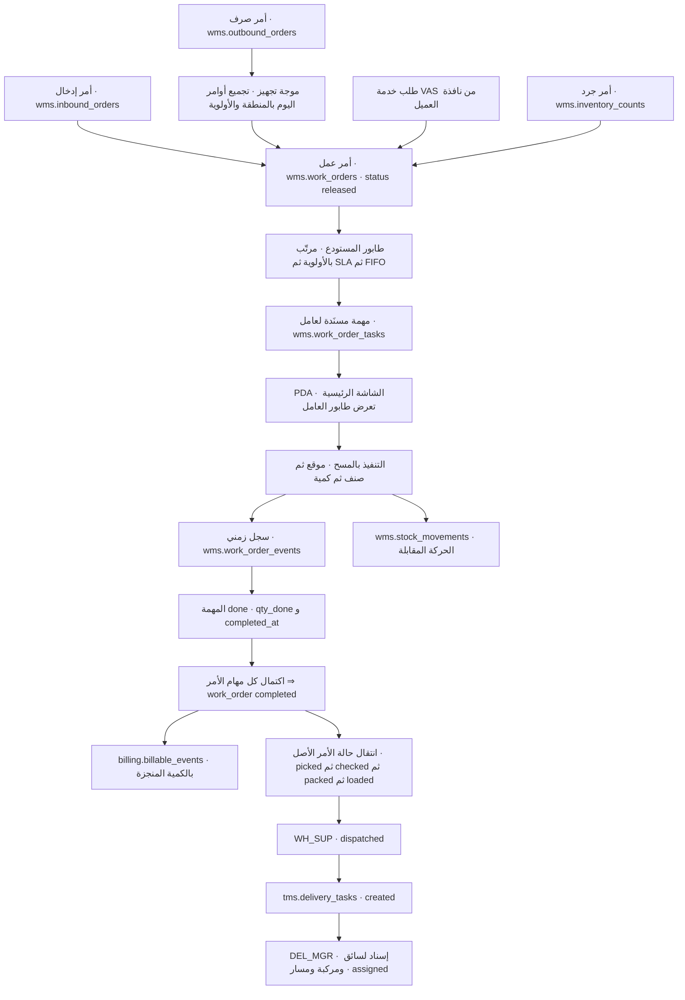
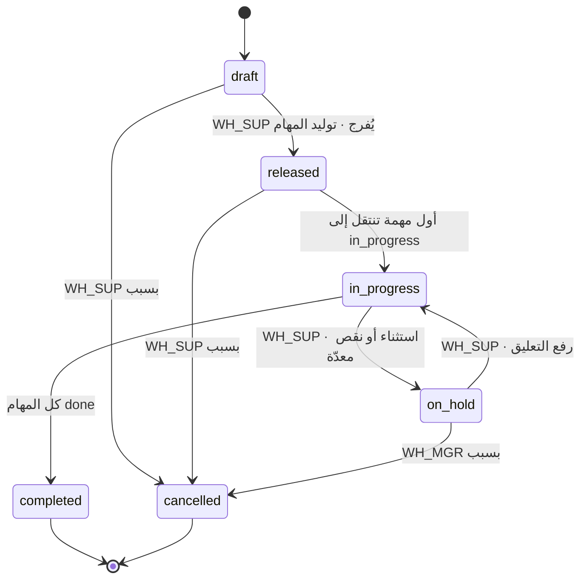
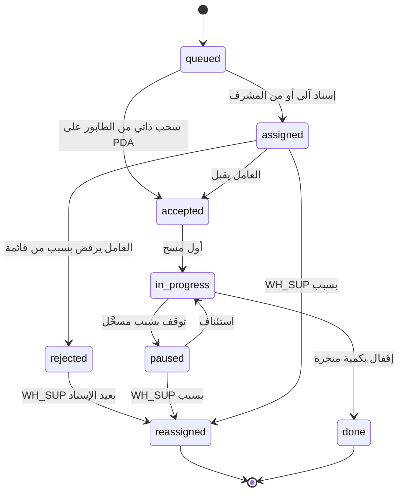
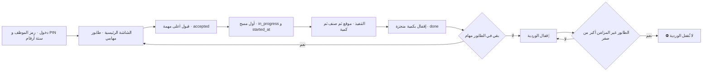
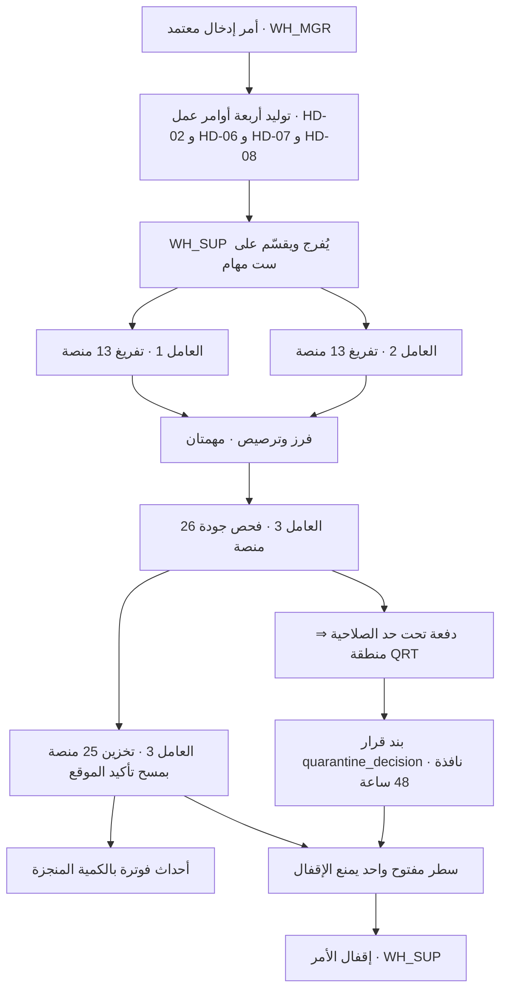
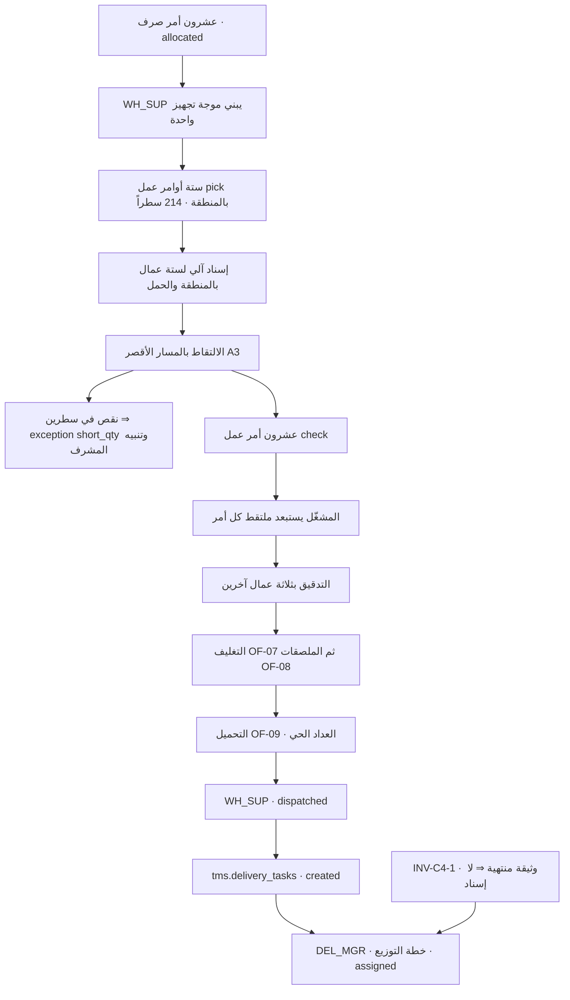
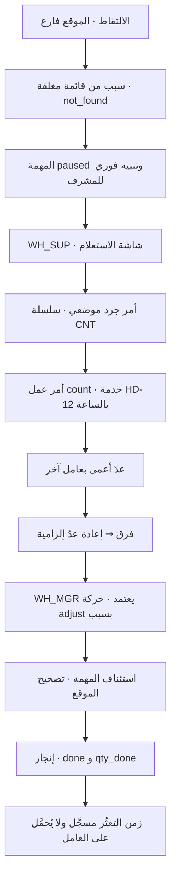
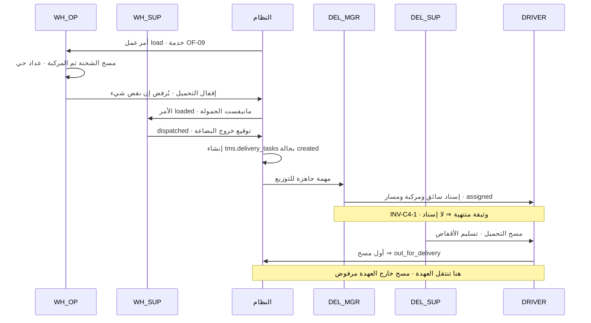

# الخدمات التشغيلية داخل المستودع — أوامر العمل: الإسناد والتتبّع والإنجاز
**PG-EOS v4 · D-blueprints · 21/09/2026 · حالة الوثيقة: سيناريوهات + مواصفة طبقة أوامر العمل (SCR مقترح — `SCR-WO-01`)**

**المصادر:** `03-Operations-Warehouse.md` §4 · §5 · §10 · `10-Order-Fulfillment-Scenarios.md` §1 · §2.1 · §4-2 · `04-Operations-Delivery-Fleet.md` §4.1 · `B-reference/30-PDA-App.md` · `B-reference/03-Workflows.md` §0 · `B-reference/04-Service-Catalog.md` · `A-governing/40-Build-Specification-EN.md` §C3 · §D4 · `A-governing/EXECUTION-MASTER-v4.md` §1.2 · `A-governing/38-WBS.md` المرحلة 2 · القاعدة الحيّة `pgeos` (فحص مباشر 21/09/2026)

> **قاعدة هذه الوثيقة:** كل جدول وعمود وحالة وكود خدمة مذكور أدناه **متحقَّق منه على القاعدة الحيّة**. وكل ما هو **مقترح** موسوم صراحةً بـ«مقترح» أو «`SCR-WO-01`» — ولم يُنفَّذ على القاعدة. اختُبر الـDDL فعلياً داخل `begin; … rollback;` ونتيجته في §3-6.

---

## 0. الخلاصة للمدير العام

1. **الموجود:** كتالوج الخدمات يحمل **39 خدمة داخلية** — `HD-01…13` مناولة واستلام · `OF-01…13` تجهيز طلبات · `VA-01…13` قيمة مضافة — كلها **نشطة ومسعَّرة الوحدة** في `catalog.services` (متحقَّق: 13 + 13 + 13).
2. **الموجود:** تطبيق **PDA** بتسع شاشات وجهاز مشترك ودخول برمز الموظف و**PIN ٦ أرقام** وعمل دون اتصال **٧٢ ساعة** — أداة تنفيذ ناضجة ومحسومة القرارات (`EXEC §1.2` · `G-07`).
3. **الموجود:** حالات دقيقة **على مستوى الأمر كله**: `wms.outbound_orders` بأربع عشرة حالة، و`wms.inbound_orders` بسبع.
4. **الناقص — وهو جوهر المشكلة:** `\dt wms.*` يُظهر **16 جدولاً بلا جدول مهام ولا أوامر عمل**. أقرب ما يوجد ثلاثة أعمدة على `wms.outbound_orders`: `picked_by` · `checked_by` · `packed_by` — **اسم واحد للأمر كله، بلا وقت بدء ولا وقت انتهاء ولا كمية منجزة ولا جهاز ولا سبب تعثّر**.
5. **النتيجة الإدارية:** الخدمات الـ39 **مسعَّرة وغير قابلة للإسناد ولا للتتبّع كمهام**. لا يمكن اليوم أن يُقال: «من نفّذ؟ متى بدأ؟ كم أنجز؟ كم تأخّر؟» — ولا أن يُقاس عامل واحد.
6. **الناقص أيضاً:** لا يوجد أي وعاء للحضور أو الورديات في `hr` (متحقَّق: **13 جدولاً في `hr` بلا `attendance` ولا `shifts`**) — وهذا يحدّ قياس الإنتاجية بالساعة (§10 · الفجوة الحرجة #7 في `09-Gap-Register`).
7. **ما تقترحه الوثيقة:** ثلاثة جداول فقط — `wms.work_orders` · `wms.work_order_tasks` · `wms.work_order_events` — مع حارسين و**سبع عتبات** وسلسلة ترقيم `WO`. لا جدول رابع، ولا تعديل على أي جدول قائم.
8. **ماذا يتغيّر إدارياً — أولاً:** لكل عامل **طابور مهام** مرئي على الـPDA ومرئي للمشرف لحظياً؛ والمشرف يعيد الإسناد بسبب مسجَّل لا بنداء شفهي.
9. **ثانياً:** لكل مهمة **زمن بدء وانتهاء وكمية منجزة وجودة** — فتُقاس الإنتاجية بالعامل وبالفريق وبالوردية، ويُعرف أين تضيع الساعة.
10. **ثالثاً:** الفوترة تُولَّد من **الإنجاز الفعلي بالكمية** لا من انتقال حالة الأمر تقديراً — فخدمات `VA-*` التي تُقدَّم اليوم بلا أثر تصير إيراداً موثَّقاً.
11. **رابعاً:** «المدقّق ≠ الملتقط» يصير **قيداً في القاعدة** يمتد إلى كل زوج مهام على المصدر نفسه — لا شرطاً في طبقة التطبيق وحدها (`INV-C3-6` كان **enforced in command**).
12. **ما يبقى قرار المدير العام:** قيم العتبات السبع · هل تُصرف مكافأة إنتاجية · وهل يُنشأ وعاء الحضور والورديات أم تُشطب الوعود المعلّقة به (§10).

---

## 1. فهرس الخدمات الداخلية الـ39 كمهام قابلة للإسناد

> **طريقة القراءة:** «نوع المهمة» هو قيمة `work_orders.task_type` المقترحة من القائمة الخمس عشرة. الخدمات التي لا يقابلها نوع مهمة هي **رسوم على مستوى الأمر** أو **سمات** (عجلة · خارج دوام) لا عمل يُسنَد لعامل — وهي مميَّزة بـ«—».
> **وحدة القياس** منقولة حرفياً من عمود `catalog.services.uom`.

### 1-1 المناولة والاستلام — `HD-01…HD-13`

| الكود | الخدمة | نوع المهمة | وحدة القياس | متى يُنشأ أمر العمل آلياً | تُفوتر | الدور | المهارة/المعدّة |
|---|---|---|---|---|---|---|---|
| `HD-01` | استلام وتفريغ حاوية 20 قدم | `receive` | حاوية | `wms.inbound.approved` + وصول الحاوية | نعم — لكل حدث | `WH_OP` | رافعة شوكية + فريق تفريغ |
| `HD-02` | استلام وتفريغ حاوية 40 قدم | `receive` | حاوية | `wms.inbound.approved` + وصول الحاوية | نعم — لكل حدث | `WH_OP` | رافعة شوكية + فريق ≥ 3 |
| `HD-03` | استلام شاحنة / مقطورة | `receive` | شاحنة | `wms.inbound.approved` + وصول الشاحنة | نعم — لكل حدث | `WH_OP` | رافعة شوكية |
| `HD-04` | استلام بالمنصة (بضاعة مرصوصة) | `receive` | منصة | مع `receiving_started` — كمية = منصات الأمر | نعم — بالكمية | `WH_OP` | رافعة شوكية |
| `HD-05` | استلام بالكرتون (تفريغ يدوي) | `receive` | كرتون | مع `receiving_started` — كمية = كراتين الأمر | نعم — بالكمية | `WH_OP` | يدوي |
| `HD-06` | فرز وترصيص على منصات | `putaway` ¹ | منصة | بعد `received` وقبل التخزين | نعم — بالكمية | `WH_OP` | رافعة + ترصيص |
| `HD-07` | فحص جودة عند الاستلام | `qc` | منصة / كرتون | بعد `received` — بطلب العقد أو العميل | نعم — بالكمية | `WH_OP` + `WH_SUP` | تدريب فحص |
| `HD-08` | إدخال وتخزين (Put-away) | `putaway` | منصة | `wms.inbound.received` — تلقائياً | نعم — بالكمية | `WH_OP` | رافعة شوكية |
| `HD-09` | مناولة بضاعة ثقيلة أو غير قياسية | `receive` ² | قطعة | عَلَم على المهمة لا نوع مستقل | نعم — لكل حدث | `WH_OP` | رافعة ثقيلة + إذن |
| `HD-10` | استلام مرتجعات | `return_sort` | كرتون / قطعة | عملية «مرتجع» على الـPDA | نعم — بالكمية | `WH_OP` | — |
| `HD-11` | تحويل داخلي بين المواقع بطلب العميل | `transfer` | منصة | طلب العميل من النافذة → اعتماد | نعم — بالكمية | `WH_OP` | رافعة شوكية |
| `HD-12` | جرد استثنائي بطلب العميل | `count` | ساعة | طلب العميل → `wms.inventory_counts` | نعم — بالساعة | `WH_OP` | عدّ أعمى |
| `HD-13` | مناولة خارج ساعات الدوام | — ³ | ساعة | سمة زمنية على أي أمر عمل | نعم — بالساعة | — | — |

¹ `HD-06` ليس له نوع مطابق واحد في القائمة المقترحة؛ الترصيص خطوة داخل التخزين. **قرار مطلوب (§10-3):** إضافة نوع `sort_stack` أم إبقاؤه `putaway` بعلَم.
² `HD-09` سمة «ثقيل/غير قياسي» على المهمة تُغيّر المعدّة والتسعير — لا نوع مستقل.
³ `HD-13` يُحتسب من فارق `started_at`/`completed_at` الواقع خارج ساعات الدوام — **ساعات الدوام غير معرَّفة في القاعدة** (§10-1).

### 1-2 تجهيز الطلبات والصرف — `OF-01…OF-13`

| الكود | الخدمة | نوع المهمة | وحدة القياس | متى يُنشأ أمر العمل آلياً | تُفوتر | الدور | المهارة/المعدّة |
|---|---|---|---|---|---|---|---|
| `OF-01` | رسم الطلب الأساسي | — ⁴ | طلب | لا مهمة — رسم على الأمر عند `checked` | نعم — لكل حدث | — | — |
| `OF-02` | التقاط بند داخل الطلب | `pick` | بند | `wms.outbound.allocated` — مهمة لكل منطقة | نعم — بالكمية | `WH_OP` | PDA |
| `OF-03` | التقاط بالقطعة | `pick` | قطعة | `wms.outbound.allocated` — حبيبة قطعة | نعم — بالكمية | `WH_OP` | PDA |
| `OF-04` | التقاط بالكرتون | `pick` | كرتون | `wms.outbound.allocated` — حبيبة كرتون | نعم — بالكمية | `WH_OP` | عربة |
| `OF-05` | التقاط بالمنصة الكاملة | `pick` | منصة | `wms.outbound.allocated` — حبيبة منصة | نعم — بالكمية | `WH_OP` | رافعة شوكية |
| `OF-06` | تدقيق ومطابقة قبل الشحن | `check` | طلب | عند `picked` — **لعامل غير الملتقط** | نعم — لكل حدث | `WH_OP` آخر | PDA |
| `OF-07` | تغليف وتعبئة | `pack` | طلب / كرتون | عند `checked` | نعم — بالكمية | `WH_OP` | محطة تغليف |
| `OF-08` | لصق ملصقات / باركود | `label` | قطعة / كرتون | عند `packed` أو بطلب العميل | نعم — بالكمية | `WH_OP` | طابعة ملصقات |
| `OF-09` | تحميل على المركبة | `load` | شحنة / منصة | عند `packed` + وصول المركبة | نعم — بالكمية | `WH_OP` | رافعة شوكية |
| `OF-10` | صرف منصة كاملة | `pick` | منصة | أمر صرف بحبيبة منصة | نعم — بالكمية | `WH_OP` | رافعة شوكية |
| `OF-11` | تجهيز عاجل خارج الدور (Rush) | — ⁵ | طلب | عَلَم `is_rush = true` على أمر العمل | نعم — لكل حدث | — | — |
| `OF-12` | إعادة تجهيز بسبب خطأ العميل | `pick` + `check` | طلب | أمر عمل جديد بنفس `source_id` | نعم — لكل حدث | `WH_OP` | PDA |
| `OF-13` | تجهيز طلب تجزئة متعدد الأصناف | — ⁴ | طلب | رسم على مستوى الأمر عند `checked` | نعم — لكل حدث | — | — |

⁴ `OF-01` و`OF-13` رسمان على مستوى الأمر — يبقى مصدر توليدهما **`wms.outbound.checked`** كما هو اليوم (10 §4-2).
⁵ `OF-11` عَلَم يكسر ترتيب الطابور (§4-3) ويُولّد رسماً — لا نوع مهمة.

### 1-3 خدمات القيمة المضافة — `VA-01…VA-13`

| الكود | الخدمة | نوع المهمة | وحدة القياس | متى يُنشأ أمر العمل آلياً | تُفوتر | الدور | المهارة/المعدّة |
|---|---|---|---|---|---|---|---|
| `VA-01` | إعادة تغليف / إعادة تعبئة | `pack` | قطعة / كرتون | **بطلب العميل من النافذة** → اعتماد | حسب العقد | `WH_OP` | محطة تغليف |
| `VA-02` | تجميع عروض (Kitting) | `kit` | طقم | بطلب العميل → اعتماد | حسب العقد | `WH_OP` | طاولة تجميع |
| `VA-03` | تفكيك أطقم | `kit` ⁶ | طقم | بطلب العميل → اعتماد | حسب العقد | `WH_OP` | طاولة تجميع |
| `VA-04` | لصق ملصقات ترويجية | `label` | قطعة | بطلب العميل → اعتماد | حسب العقد | `WH_OP` | — |
| `VA-05` | طباعة ولصق باركود (التكويد) | `label` | قطعة | بطلب العميل → اعتماد | حسب العقد | `WH_OP` | طابعة باركود |
| `VA-06` | فحص وفرز مرتجعات وتصنيف حالتها | `return_sort` | قطعة | `HD-10` مُنجزة + بند فرز في العقد | حسب العقد | `WH_OP` | تدريب تصنيف |
| `VA-07` | إتلاف بضاعة منتهية أو تالفة | `scrap` | منصة / كرتون | **بعد موافقة العميل + `WH_MGR`** | حسب العقد | `WH_OP` | محضر إتلاف |
| `VA-08` | تغليف انكماشي (Shrink Wrap) | `pack` | منصة | بطلب العميل أو ضمن التجهيز | حسب العقد | `WH_OP` | آلة تغليف |
| `VA-09` | وزن وقياس الأصناف وتسجيلها | `weigh` | صنف | تأسيس صنف جديد أو بطلب العميل | حسب العقد | `WH_OP` | ميزان + قدمة |
| `VA-10` | تصوير المنتجات | `photo` | قطعة | بطلب العميل → اعتماد | حسب العقد | `WH_OP` | استوديو مصغّر |
| `VA-11` | جرد دوري إضافي بطلب العميل | `count` | ساعة | بطلب العميل → `wms.inventory_counts` | حسب العقد | `WH_OP` | عدّ أعمى |
| `VA-12` | إعداد تقارير مخصصة | — ⁷ | تقرير | عمل مكتبي — لا مهمة PDA | حسب العقد | `WH_SUP` | — |
| `VA-13` | مناولة الحجر الصحي والإفراج | `transfer` + `qc` | منصة | دخول منطقة `QRT` / قرار الإفراج | حسب العقد | `WH_OP` | إذن `WH_MGR` |

⁶ `VA-03` تفكيك — نفس النوع `kit` بعلَم اتجاه عكسي؛ **قرار مطلوب (§10-3):** نوع `de_kit` مستقل أم علَم.
⁷ `VA-12` لا يُنفَّذ على الـPDA ولا يُسنَد لعامل مستودع.

**الخلاصة العددية:** من الـ39 خدمة، **33 تصير مهام قابلة للإسناد**، و**6 تبقى رسوماً أو سمات** (`HD-13` · `OF-01` · `OF-11` · `OF-13` · `VA-12` + سمة `HD-09`). والأنواع الخمسة عشر تغطيها كلها.

---

## 2. خريطة الطبقة

#### خريطة 12-1: من الأمر إلى الإنجاز إلى الفوترة إلى التوصيل
تقرأ من مصادر أوامر العمل الثلاثة إلى مخرجين: حدث فوترة، ومهمة توصيل مسنَدة لسائق.



**شرح الخريطة في عشرة أسطر:**
1. أوامر العمل تُولَد من **أربعة مصادر** — والمرجع إليها بزوج `source_table`/`source_id` على نمط `billing.billable_events` نفسه.
2. أوامر الصرف وحدها تمرّ بـ**موجة تجهيز** تجمع طلبات اليوم قبل توليد أوامر العمل، فيُقلَّل المشي في الممرات.
3. أمر العمل يحمل **الكمية المخطَّطة وكود الخدمة وSLA**، ولا يحمل عاملاً — العامل على المهمة لا على الأمر.
4. الطابور يرتّب المهام بثلاثة مفاتيح: **العاجل أولاً** ثم **الأقرب لتجاوز SLA** ثم **الأقدم**.
5. العامل يرى طابوره على **الشاشة الرئيسية للـPDA** — وهي الشاشة صفر القائمة اليوم، لا شاشة عاشرة (§8).
6. التنفيذ بالمسح كما هو موصوف في `30 §3` — لا يتغيّر شيء في طريقة عمل العامل.
7. كل تغيّر في المهمة يكتب سطراً في **السجل الزمني** — دفتر لا يُعدَّل، مثل `stock_movements`.
8. اكتمال **كل** مهام أمر العمل ينقل الأمر إلى `completed`، وعندها فقط يُولَّد حدث الفوترة **بالكمية المنجزة**.
9. الحركة المخزنية تبقى في `wms.stock_movements` كما هي — أوامر العمل **لا تمسّ الدفتر** ولا تحلّ محله.
10. اكتمال أوامر العمل ينقل **حالة الأمر الأصل**، ومنها يمضي المسار المعروف في `03 §4.2` حتى إسناد السائق في `04 §4.1`.

#### خريطة 12-2: الموقع الدقيق لطبقة أوامر العمل بين الجداول القائمة
تقرأ من الجداول القائمة إلى الجداول الثلاثة المقترحة وعلاقاتها.

```mermaid
erDiagram
  inbound_orders   ||--o{ work_orders : "source_table + source_id"
  outbound_orders  ||--o{ work_orders : "source_table + source_id"
  inventory_counts ||--o{ work_orders : "source_table + source_id"
  work_orders      ||--o{ work_order_tasks : "work_order_id"
  work_orders      ||--o{ work_order_events : "work_order_id"
  work_order_tasks ||--o{ work_order_events : "task_id"
  work_orders      }o--|| services : "service_id"
  work_orders      }o--|| accounts : "client_id"
  work_orders      }o--|| warehouses : "warehouse_id"
  work_order_tasks }o--|| employees : "worker_id"
  work_order_tasks }o--o| teams : "team_id"
  work_order_tasks }o--o| locations : "location_from_id"
  work_order_tasks }o--o| skus : "sku_id"
  work_orders      ||--o{ billable_events : "source_table wms.work_orders"
```



---

## 3. نموذج البيانات المقترح — `SCR-WO-01`

### 3-1 مبدأ التصميم: أقل إضافة ممكنة

| القرار | ما اختير | لماذا |
|---|---|---|
| عدد الجداول | **ثلاثة** | رأس + مهمة + سجل زمني. لا جدول لأنواع المهام (قيد `check` يكفي كما في كل جداول `wms`) ولا جدول للطابور (عرض لا جدول) |
| تعديل الجداول القائمة | **صفر** | `picked_by`/`checked_by`/`packed_by` على `wms.outbound_orders` **تبقى** ويملؤها النظام من آخر مهمة منجزة — فلا يُكسر شيء قائم |
| المرجع للأمر الأصل | `source_table` + `source_id` | نفس نمط `billing.billable_events` المُستخدم في القاعدة اليوم — بلا جدول وسيط |
| الأحداث | `wms.work_order_events` + `platform.outbox` | السجل التفصيلي محلي؛ وأحداث المجال تُنشر في `outbox` كباقي النطاقات (03-Workflows §0 بند 2) |
| الترقيم | سلسلة `WO` في `platform.counters` | نفس آلية `INB`/`OUT`/`CNT`/`TSK` — عبر `platform.next_doc_no()` |
| العزل | `entity_scope` + `client_portal_scope` + `internal_only` | نفس سياسات `wms.outbound_orders` و`wms.order_lines` حرفياً |

### 3-2 آلة حالات أمر العمل — `wms.work_orders.status`

#### خريطة 12-3: آلة حالات أمر العمل
تقرأ من المسودة إلى الاكتمال، مع مخرجَي التعليق والإلغاء.



| الحالة | الوصف | من ينقلها | الحدث المنشور | الشاشة |
|---|---|---|---|---|
| `draft` | مولَّد آلياً ولم يُفرَج عنه | النظام | `wms.wo.drafted` | لوحة طابور المستودع |
| `released` | مُفرَج — مهامه في الطابور | `WH_SUP` (آلي للأوامر المولَّدة من `allocated`) | `wms.wo.released` | لوحة طابور المستودع |
| `in_progress` | عامل واحد على الأقل بدأ | النظام | `wms.wo.started` | PDA |
| `on_hold` | معلَّق بسبب مسجَّل | `WH_SUP` | `wms.wo.held` | لوحة المشرف |
| `completed` | كل المهام `done` | النظام | `wms.wo.completed` ← **حدث الفوترة** | — |
| `cancelled` | ملغى بسبب إلزامي | `WH_SUP`؛ و`WH_MGR` من `on_hold` | `wms.wo.cancelled` | لوحة المشرف |

### 3-3 آلة حالات المهمة — `wms.work_order_tasks.status`

#### خريطة 12-4: آلة حالات المهمة المسنَدة لعامل
تقرأ من دخول المهمة الطابور إلى إنجازها أو رفضها أو إعادة إسنادها.



| الحالة | الوصف | من ينقلها | الحدث | الشاشة |
|---|---|---|---|---|
| `queued` | في الطابور بلا عامل | النظام | `wms.wo.task.queued` | لوحة الطابور |
| `assigned` | مُسنَدة لعامل بعينه | النظام (آلي) أو `WH_SUP` | `wms.wo.task.assigned` | PDA + لوحة المشرف |
| `accepted` | العامل قَبِلها | `WH_OP` | `wms.wo.task.accepted` | PDA |
| `in_progress` | قيد التنفيذ — بدأ المسح | `WH_OP` | `wms.wo.task.started` | PDA |
| `paused` | متوقفة بسبب مسجَّل | `WH_OP` | `wms.wo.task.paused` | PDA |
| `done` | منجزة بكمية وزمن | `WH_OP` | `wms.wo.task.completed` | PDA |
| `rejected` | مرفوضة بسبب من قائمة مغلقة | `WH_OP` | `wms.wo.task.rejected` | PDA ← تنبيه المشرف |
| `reassigned` | أُغلقت لإعادة الإسناد | `WH_SUP` | `wms.wo.task.reassigned` | لوحة المشرف |

### 3-4 القواعد المفروضة برمجياً — طبقة أوامر العمل

| القيد / المشغّل | الحد وقيمته | المصدر |
|---|---|---|
| `chk_work_orders_status` | `draft · released · in_progress · on_hold · completed · cancelled` | `SCR-WO-01` §3-2 |
| `chk_work_orders_task_type` | خمسة عشر نوعاً حصراً (§1) | `SCR-WO-01` §1 |
| `chk_work_orders_source_pair` | `source_table` و`source_id` **معاً أو لا شيء** | نمط `billing.billable_events` |
| `chk_work_orders_cancel_has_reason` | `status = 'cancelled'` ⇒ `cancel_reason not null` | 03-Workflows §0 قاعدة 5 |
| `chk_wo_tasks_status` | ثماني حالات حصراً (§3-3) | `SCR-WO-01` §3-3 |
| `chk_wo_tasks_assigned_has_worker` | أي حالة غير `queued` ⇒ `worker_id not null` | `SCR-WO-01` |
| `chk_wo_tasks_done_has_times` | `done` ⇒ `started_at` و`completed_at` غير فارغين | **أساس قياس الإنتاجية** |
| `chk_wo_tasks_qc_not_self` | `quality_check_by ≠ worker_id` | `INV-C3-6` · `identity.sod_rules` (`WH_OP` / `WH_SUP` — «الملتقط لا يدقّق التقاطه») |
| **`trg_wo_checker_not_picker`** | مهمة `check` على مصدر نفّذ عليه العامل مهمة `pick` ⇒ **رفض** | **`INV-C3-6` · `EXEC §1.2` FIXED** — يرفع الإنفاذ من طبقة الأمر إلى القاعدة |
| **`trg_wo_worker_task_cap`** | عامل واحد لا يحمل أكثر من `wo.max_active_tasks_per_worker` مهمة نشطة | عتبة مقترحة — قيمتها قرار GM (§10) |
| `chk_wo_tasks_reassign_has_reason` | `reassigned` ⇒ `reassign_reason not null` | 03-Workflows §0 قاعدة 5 |
| `chk_wo_tasks_exception_has_code` | لا ملاحظة استثناء بلا كود من قائمة مغلقة | نمط `tms.failure_reasons` (`INV-C4-5`) |
| `chk_wms_wo_tasks_offline_has_date` | `entered_offline = true` ⇒ `original_occurred_at not null` | نمط 13B على كل جداول `wms`/`tms` الميدانية |
| تفرّد الفوترة | فهرس `(source_table, source_id, service_id)` على `billing.billable_events` يمنع الازدواج | القاعدة — **متحقَّق** |
| `unique (entity_id, doc_no)` | سلسلة `WO` عبر `platform.next_doc_no()` | نمط `INB`/`OUT`/`CNT`/`TSK` |
| RLS | `entity_scope` + `client_portal_scope` على الرأس · `internal_only` على المهام والسجل | نمط `wms.outbound_orders` و`wms.order_lines` حرفياً |

### 3-5 الـDDL الكامل — قابل للتشغيل

> **حالة التنفيذ:** **لم يُنفَّذ على القاعدة.** يُدرَج في `13B-Schema-Reference-Consolidation.sql` عند اعتماد `SCR-WO-01`. الكتلة أدناه هي ما اختُبر فعلياً (§3-6).

```sql
-- ═══════════════════════════════════════════════════════════════════
-- SCR-WO-01 · طبقة أوامر العمل داخل المستودع
-- ═══════════════════════════════════════════════════════════════════

-- 1) أمر العمل — الرأس
create table wms.work_orders (
  id            uuid primary key default gen_random_uuid(),
  entity_id     uuid not null references platform.entities(id),
  doc_no        text not null,                          -- سلسلة WO من platform.counters
  warehouse_id  uuid not null references wms.warehouses(id),
  client_id     uuid not null references sales.accounts(id),
  contract_id   uuid references sales.contracts(id),
  -- المرجع متعدد الأشكال — نفس نمط billing.billable_events
  source_table  text,        -- wms.inbound_orders · wms.outbound_orders · wms.inventory_counts · null = طلب VAS مباشر
  source_id     uuid,
  task_type     text not null,
  service_id    uuid references catalog.services(id),   -- كود الخدمة المفوتر عنها
  priority      int  not null default 5,                -- 1 = الأعلى
  is_rush       boolean not null default false,         -- OF-11
  sla_minutes   int,
  due_at        timestamptz,
  qty_planned   numeric(14,3) not null default 0,
  qty_done      numeric(14,3) not null default 0,
  uom           text not null,                          -- من catalog.services.uom
  status        text not null default 'draft',
  requested_by  uuid,
  approved_by   uuid,
  released_at   timestamptz,
  completed_at  timestamptz,
  cancel_reason text,
  notes         text,
  created_at    timestamptz not null default now(),
  created_by    uuid,
  unique (entity_id, doc_no),
  constraint chk_work_orders_status check (status in
    ('draft','released','in_progress','on_hold','completed','cancelled')),
  constraint chk_work_orders_task_type check (task_type in
    ('receive','putaway','pick','check','pack','label','kit','load',
     'return_sort','count','weigh','photo','transfer','scrap','qc')),
  constraint chk_work_orders_source_pair check ((source_table is null) = (source_id is null)),
  constraint chk_work_orders_qty check (qty_planned >= 0 and qty_done >= 0),
  constraint chk_work_orders_completed_has_time check (status <> 'completed' or completed_at is not null),
  constraint chk_work_orders_cancel_has_reason check (status <> 'cancelled' or cancel_reason is not null)
);
create index on wms.work_orders (warehouse_id, status, priority, due_at);
create index on wms.work_orders (source_table, source_id);
create index on wms.work_orders (client_id, status);

comment on table wms.work_orders is
  'أمر عمل داخل المستودع — الوحدة القابلة للإسناد والتتبّع والفوترة لخدمات HD/OF/VA';

-- 2) المهمة — تقسيم أمر العمل على العمال
create table wms.work_order_tasks (
  id               uuid primary key default gen_random_uuid(),
  work_order_id    uuid not null references wms.work_orders(id) on delete cascade,
  line_no          int  not null,
  worker_id        uuid references hr.employees(id),
  team_id          uuid references hr.teams(id),
  assigned_by      uuid,
  assigned_at      timestamptz,
  accepted_at      timestamptz,
  started_at       timestamptz,
  paused_at        timestamptz,
  resumed_at       timestamptz,
  paused_minutes   int  not null default 0,
  completed_at     timestamptz,
  qty_assigned     numeric(14,3) not null default 0,
  qty_done         numeric(14,3) not null default 0,
  sku_id           uuid references wms.skus(id),
  location_from_id uuid references wms.locations(id),
  location_to_id   uuid references wms.locations(id),
  device_id        text,
  exception_code   text,   -- قائمة مغلقة: not_found · short_qty · damaged · blocked_location · wrong_client · equipment_down
  exception_note   text,
  quality_check_by uuid references hr.employees(id),
  quality_result   text,   -- pass · fail
  reassigned_from  uuid references wms.work_order_tasks(id),
  reassign_reason  text,
  status           text not null default 'queued',
  entered_offline  boolean not null default false,
  original_occurred_at timestamptz,
  created_at       timestamptz not null default now(),
  unique (work_order_id, line_no),
  constraint chk_wo_tasks_status check (status in
    ('queued','assigned','accepted','in_progress','paused','done','rejected','reassigned')),
  constraint chk_wo_tasks_assigned_has_worker
    check (status = 'queued' or worker_id is not null),
  constraint chk_wo_tasks_done_has_times
    check (status <> 'done' or (started_at is not null and completed_at is not null)),
  constraint chk_wo_tasks_qc_not_self
    check (quality_check_by is null or worker_id is null or quality_check_by <> worker_id),
  constraint chk_wo_tasks_exception_has_code
    check (exception_note is null or exception_code is not null),
  constraint chk_wo_tasks_reassign_has_reason
    check (status <> 'reassigned' or reassign_reason is not null),
  constraint chk_wo_tasks_quality_result check (quality_result is null or quality_result in ('pass','fail')),
  constraint chk_wms_wo_tasks_offline_has_date
    check (entered_offline = false or original_occurred_at is not null),
  constraint chk_wo_tasks_qty check (qty_assigned >= 0 and qty_done >= 0)
);
create index on wms.work_order_tasks (worker_id, status);
create index on wms.work_order_tasks (work_order_id, status);
create index on wms.work_order_tasks (status, assigned_at);

comment on table wms.work_order_tasks is
  'المهمة المسنَدة لعامل بعينه — بوقت بدء وانتهاء وكمية منجزة وجهاز وسبب استثناء';

-- 3) السجل الزمني — دفتر لا يُعدَّل
create table wms.work_order_events (
  id            bigserial primary key,
  work_order_id uuid not null references wms.work_orders(id) on delete cascade,
  task_id       uuid references wms.work_order_tasks(id) on delete cascade,
  occurred_at   timestamptz not null default now(),
  event_type    text not null,  -- released·assigned·accepted·started·paused·resumed·completed·rejected·reassigned·exception·on_hold·cancelled
  actor_id      uuid,
  from_status   text,
  to_status     text,
  qty           numeric(14,3),
  device_id     text,
  note          text,
  payload       jsonb
);
create index on wms.work_order_events (work_order_id, occurred_at);
create index on wms.work_order_events (task_id, occurred_at);

comment on table wms.work_order_events is
  'سجل زمني لأوامر العمل ومهامها — دفتر لا يُعدَّل. التصحيح بحدث مقابل فقط';

-- 4) RLS — نمط 01/13B
alter table wms.work_orders       enable row level security;
alter table wms.work_order_tasks  enable row level security;
alter table wms.work_order_events enable row level security;

create policy entity_scope on wms.work_orders
  for all using (entity_id = any(platform.allowed_entities()));
create policy client_portal_scope on wms.work_orders
  for select using (platform.is_internal() or client_id = platform.current_client_id());
create policy internal_only on wms.work_order_tasks
  for all using (platform.is_internal());
create policy internal_only on wms.work_order_events
  for all using (platform.is_internal());

-- 5) الحارس 1 — المدقّق ≠ الملتقط على الأمر نفسه (INV-C3-6 · EXEC §1.2 FIXED)
create or replace function wms.enforce_checker_not_picker() returns trigger
language plpgsql as $fn$
declare v_src_table text; v_src_id uuid; v_type text; v_n int;
begin
  if new.worker_id is null then return new; end if;
  select wo.source_table, wo.source_id, wo.task_type
    into v_src_table, v_src_id, v_type
    from wms.work_orders wo where wo.id = new.work_order_id;
  if v_type is distinct from 'check' or v_src_id is null then return new; end if;
  select count(*) into v_n
    from wms.work_order_tasks t
    join wms.work_orders w on w.id = t.work_order_id
   where w.source_table = v_src_table
     and w.source_id    = v_src_id
     and w.task_type    = 'pick'
     and t.worker_id    = new.worker_id
     and t.status in ('accepted','in_progress','paused','done');
  if v_n > 0 then
    raise exception 'المدقّق لا يدقّق التقاطه — INV-C3-6 · EXEC §1.2 FIXED (العامل %)', new.worker_id
      using errcode = 'check_violation';
  end if;
  return new;
end $fn$;

create trigger trg_wo_checker_not_picker
  before insert or update of worker_id on wms.work_order_tasks
  for each row execute function wms.enforce_checker_not_picker();

-- 6) الحارس 2 — حدّ المهام النشطة لكل عامل (platform.thresholds)
create or replace function wms.enforce_worker_task_cap() returns trigger
language plpgsql as $fn$
declare v_cap int; v_n int;
begin
  if new.worker_id is null or new.status not in ('assigned','accepted','in_progress','paused')
    then return new; end if;
  select value::int into v_cap from platform.thresholds
   where key = 'wo.max_active_tasks_per_worker';
  if v_cap is null then return new; end if;
  select count(*) into v_n from wms.work_order_tasks t
   where t.worker_id = new.worker_id
     and t.id <> new.id
     and t.status in ('assigned','accepted','in_progress','paused');
  if v_n >= v_cap then
    raise exception 'العامل % يحمل % مهام نشطة والحد % — wo.max_active_tasks_per_worker',
      new.worker_id, v_n, v_cap using errcode = 'check_violation';
  end if;
  return new;
end $fn$;

create trigger trg_wo_worker_task_cap
  before insert or update of worker_id, status on wms.work_order_tasks
  for each row execute function wms.enforce_worker_task_cap();

-- 7) العتبات السبع المقترحة — القيم الابتدائية قرار GM (§10)
insert into platform.thresholds (key, value, unit, description_ar, changed_by) values
 ('wo.max_active_tasks_per_worker', 3,   'count',   'أقصى مهام نشطة لعامل واحد في آن — SCR-WO-01', '<gm_user_id>'),
 ('wo.sla.pick_min',                60,  'minutes', 'SLA مهمة الالتقاط — SCR-WO-01',              '<gm_user_id>'),
 ('wo.sla.check_min',               30,  'minutes', 'SLA مهمة التدقيق — SCR-WO-01',               '<gm_user_id>'),
 ('wo.sla.pack_min',                30,  'minutes', 'SLA مهمة التغليف — SCR-WO-01',               '<gm_user_id>'),
 ('wo.sla.putaway_min',             120, 'minutes', 'SLA مهمة التخزين — SCR-WO-01',               '<gm_user_id>'),
 ('wo.sla.receive_min',             240, 'minutes', 'SLA مهمة الاستلام — SCR-WO-01',              '<gm_user_id>'),
 ('wo.sla.vas_min',                 480, 'minutes', 'SLA مهمة القيمة المضافة — SCR-WO-01',        '<gm_user_id>');

-- 8) سلسلة الترقيم WO لكل كيان — نمط INB/OUT/CNT/TSK
insert into platform.counters (entity_id, doc_type, period, prefix, padding, current_val)
select id, 'WO', 'ALL', code||'-WO-', 5, 0 from platform.entities;
```

### 3-6 نتيجة الاختبار الفعلي على القاعدة

نُفِّذ الـDDL كاملاً على قاعدة `pgeos` الحيّة داخل `begin; … rollback;` في 21/09/2026، مع إدراج تجريبي واثني عشر اختباراً. **النتيجة: 12/12 ناجحة، والمعاملة رُوجعت ولم يبقَ أي أثر** (متحقَّق بعدها: `0` جداول `work_order%` في `wms` و`0` عتبات `wo.%`).

| # | الاختبار | المتوقَّع | النتيجة |
|---|---|---|---|
| T1 | `platform.next_doc_no(PST,'WO')` | رقم بصيغة `PST-WO-00001` | ✅ `PST-WO-00001` |
| T2 | إنشاء أمرَي عمل `pick` و`check` لنفس أمر الصرف | صفّان بـ`sla_minutes` من العتبات | ✅ `PST-WO-00002 pick 60` · `PST-WO-00003 check 30` |
| T3 | إسناد مهمة الالتقاط لعامل وإنجازها | `done` بـ`qty_done = 9` | ✅ |
| **T4** | **إسناد التدقيق للملتقط نفسه** | **رفض بالمشغّل** | ✅ **رُفض:** «المدقّق لا يدقّق التقاطه — INV-C3-6 · EXEC §1.2 FIXED» |
| T5 | إسناد التدقيق لعامل آخر | قبول | ✅ |
| **T6** | **إسناد مهمة رابعة نشطة لعامل والحد 3** | **رفض بالمشغّل** | ✅ **رُفض:** «يحمل 3 مهام نشطة والحد 3» |
| T7 | مهمة `done` بلا `started_at` | رفض بالقيد | ✅ `chk_wo_tasks_done_has_times` |
| T8 | `source_table` بلا `source_id` | رفض بالقيد | ✅ `chk_work_orders_source_pair` |
| T9 | سجل زمني + حدث فوترة من أمر العمل | صف في `billable_events` بكود `OF-02` و`source_table = 'wms.work_orders'` | ✅ |
| **T10** | **تكرار حدث الفوترة نفسه** | **رفض بالفهرس الفريد** | ✅ `billable_events_source_table_source_id_service_id_idx` |
| T11 | RLS مفعّلة على الجداول الثلاثة | `relrowsecurity = t` للثلاثة | ✅ |
| T12 | عدّ الخدمات الداخلية | `HD 13 · OF 13 · VA 13` | ✅ **39** |

> **ما يثبته T4 و T6 و T10 معاً:** الضوابط الثلاثة التي تُدار اليوم بالثقة في المشرف — فصل المهام، وحمل العامل، ومنع الازدواج في الفوترة — تصير **قيوداً في القاعدة لا يتجاوزها أحد**.

---

## 4. سياسات الإسناد

### 4-1 الأنماط الثلاثة

| النمط | متى يُستخدم | القاعدة | الاستثناء |
|---|---|---|---|
| **آلي بالمنطقة والمهارة والحمل** | موجات التجهيز اليومية (`pick`/`check`/`pack`) وأوامر التخزين (`putaway`) — الحجم الأكبر | يختار النظام العامل **الأقل حملاً** ضمن: نفس منطقة المستودع · يحمل المهارة/المعدّة المطلوبة · لم يصل حدّ `wo.max_active_tasks_per_worker` · **وليس ملتقط المصدر نفسه إن كانت المهمة `check`** | `WH_SUP` يعيد الإسناد بسبب مسجَّل في `reassign_reason` — والحالة تصير `reassigned` |
| **يدوي من المشرف** | أوامر `VA-*` بطلب العميل · `scrap` · `transfer` · الحالات الخاصة والمعدّات النادرة | `WH_SUP` يختار العامل أو **الفريق** (`team_id` → `hr.teams`) ويكتب `assigned_by` | `WH_MGR` وحده يسند مهام `scrap` بعد موافقة العميل |
| **سحب ذاتي من الطابور على PDA** | فترات الذروة ونهاية الوردية · العمال المتفرغون | العامل يفتح الشاشة الرئيسية ويأخذ **أعلى مهمة في الطابور تنطبق عليه**؛ الحالة تقفز من `queued` إلى `accepted` مباشرة | الحارسان نفسهما يسريان: لا سحب لمهمة `check` على مصدر التقطه، ولا سحب فوق الحد |

### 4-2 مفاتيح ترتيب الطابور — بهذا الترتيب

| # | المفتاح | القاعدة | المصدر |
|---|---|---|---|
| 1 | **العاجل** | `is_rush = true` (خدمة `OF-11`) يتقدّم كل شيء | `catalog.services` `OF-11` |
| 2 | **الأقرب لتجاوز SLA** | `due_at` تصاعدياً — و`due_at = released_at + sla_minutes` من `wo.sla.<type>_min` | عتبات `SCR-WO-01` |
| 3 | **الأولوية المعلنة** | `priority` تصاعدياً (1 = الأعلى) — يضبطها `WH_SUP` | `SCR-WO-01` |
| 4 | **FIFO** | `created_at` تصاعدياً | القاعدة الافتراضية |
| — | **داخل المهمة الواحدة** | ترتيب السطور **بالمسار الأقصر (A3)** لا بترتيب سطور الأمر | `03 §3-2` · `29 §5-1 A3` |

### 4-3 ما لا يقرّره النظام

| البند | الوضع | لماذا |
|---|---|---|
| **مهارة العامل ورخصة الرافعة** | **لا عمود لها في `hr.employees`** (متحقَّق: لا `skills` ولا `licences` ولا `certifications`) | الإسناد بالمهارة **غير قابل للأتمتة اليوم** — يبقى بيد `WH_SUP`. فجوة مسجَّلة §10-2 |
| **الوردية الحالية للعامل** | `hr.teams.shift` موجود على **الفريق** لا على الموظف؛ ولا جدول حضور | الإسناد بالوردية يعتمد على عضوية الفريق — **ولا جدول عضوية فريق ↔ موظف في القاعدة**. فجوة §10-2 |
| **منطقة العامل** | لا عمود يربط موظفاً بمنطقة مستودع | الإسناد بالمنطقة يُشتق من **آخر مهمة منجزة** — تقريب لا يقين. فجوة §10-2 |

---

## 5. السيناريوهات التفصيلية

> **قاعدة السيناريوهات:** كل جدول خطوات يذكر الوقت ومن والشاشة وما يتغيّر في القاعدة والحدث وحدث الفوترة. الأسماء والأرقام توضيحية؛ **الجداول والأعمدة والحالات وأكواد الخدمات كلها حقيقية**.

### 5.1 يوم عامل المستودع — من دخول الـPDA إلى إقفال الوردية

**الوصف:** ناريش (`hr.employees.code = 'W-001'`) عامل مستودع في `WH1`. يدخل على جهاز PDA مشترك رقم `PDA-07` برمز موظفه و**PIN من ٦ أرقام**، ويعمل وردية صباحية. يوم كامل: أربع مهام التقاط، مهمة تدقيق واحدة (لطلب لم يلتقطه)، ومهمة تخزين.

| الوقت | من | الشاشة | ما يتغيّر في القاعدة | الحدث | الفوترة |
|---|---|---|---|---|---|
| 06:40 | `WH_OP` ناريش | PDA · الدخول | `identity.sessions` صف جديد · الجهاز `PDA-07` جلسة نشطة واحدة | `identity.session.opened` | — |
| 06:42 | النظام | PDA · **الرئيسية** | قراءة طابوره: `work_order_tasks` بـ`worker_id = W-001` و`status in (assigned, accepted)` | — | — |
| 06:45 | ناريش | PDA · الرئيسية | يقبل أعلى مهمة: `status: assigned → accepted` · `accepted_at` | `wms.wo.task.accepted` | — |
| 06:46 | ناريش | **PDA · التقاط** | أول مسح موقع ⇒ `status: accepted → in_progress` · `started_at` · `device_id = 'PDA-07'` · أمر العمل `released → in_progress` | `wms.wo.task.started` · `wms.wo.started` | — |
| 06:46–07:12 | ناريش | PDA · التقاط | لكل سطر: مسح موقع → صنف → كمية · حركة `pick` في `wms.stock_movements` بـ`performed_by` و`device_id` | — | — |
| 07:12 | ناريش | PDA · التقاط | `status: in_progress → done` · `completed_at` · `qty_done = 9` | `wms.wo.task.completed` | — |
| 07:12 | النظام | — | كل مهام أمر العمل `done` ⇒ `work_orders.status = completed` · `qty_done` يُجمَّع | `wms.wo.completed` | **`OF-02` × 9 بحالة `pending`** |
| 07:13 | النظام | PDA · الرئيسية | المهمة التالية في الطابور تُعرض تلقائياً | — | — |
| 10:30 | ناريش | PDA · **تدقيق** | مهمة `check` لأمر صرف **لم يلتقطه** — المشغّل سمح · `quality_check_by` يُملأ | `wms.wo.task.completed` | `OF-06` × 1 |
| 14:00 | ناريش | PDA · الرئيسية | إقفال الوردية · **الطابور غير المزامَن = 0 شرط الإقفال** | `identity.session.closed` | — |
| 14:00 | النظام | لوحة المشرف | حصيلة اليوم: 6 مهام · 63 سطراً · زمن نشط 4 س 12 د · صفر استثناء | — | — |

#### خريطة 12-5: يوم العامل من الدخول إلى إقفال الوردية
تقرأ من الدخول بالـPIN إلى الإقفال، مع حاجز الطابور غير المزامَن.



**نقاط الفشل والتصعيد:** جهاز بلا شبكة ⇒ الطابور المحلي حتى **٧٢ ساعة** ثم مؤشر أحمر · جهاز ملغى ⇒ **طابوره يُحجر لمراجعة `WH_SUP`** · وردية بطابور > 0 ⇒ **لا تُقفل** (`30 §5`).
**ما يراه كلٌّ:** العامل طابوره فقط · `WH_SUP` طوابير كل عماله لحظياً · `WH_MGR` الإنتاجية اليومية · العميل **لا يرى شيئاً من هذا** (`internal_only` على المهام).

---

### 5.2 استلام حاوية 40 قدم — `HD-02` ثم `HD-06` ثم `HD-07` ثم `HD-08`

**الوصف:** العميل `GULF` يُشعر بوصول حاوية 40 قدم تحوي **26 منصة** إلى `WH1`. `WH_MGR` يعتمد أمر الإدخال، و`WH_SUP` يقسّم العمل على **ثلاثة عمال ورافعة شوكية واحدة**: عاملان على التفريغ والفرز والترصيص، وثالث على الفحص ثم التخزين.

| الوقت | من | الشاشة | ما يتغيّر في القاعدة | الحدث | الفوترة |
|---|---|---|---|---|---|
| 07:00 | `WH_MGR` | صندوق القرارات | `inbound_orders.status = approved` | `wms.inbound.approved` | — |
| 07:05 | النظام | — | **4 أوامر عمل** بـ`source_table='wms.inbound_orders'`: `receive`/`HD-02` × 1 · `putaway`/`HD-06` × 26 · `qc`/`HD-07` × 26 · `putaway`/`HD-08` × 26 · كلها `draft` | `wms.wo.drafted` × 4 | — |
| 07:10 | `WH_SUP` | لوحة طابور المستودع | يُفرج عن الأربعة: `released` · ويقسّم: `HD-02` مهمتان لعاملَي التفريغ · `HD-06` مهمتان × 13 منصة · `HD-07` مهمة واحدة للثالث · `HD-08` مهمة واحدة للثالث | `wms.wo.released` × 4 · `task.assigned` × 6 | — |
| 07:15 | العامل 1 | **PDA · استلام** | `task.status = in_progress` · `started_at` · الأمر `receiving` · `arrived_at` | `wms.inbound.receiving_started` | — |
| 07:15–09:40 | العاملان 1 و2 | PDA · استلام | لكل منصة: مسح باركود · كمية · دفعة · صلاحية ⇒ `order_lines.qty_actual` · فرق ⇒ `variance_reason` إلزامي + صورة | `wms.inbound.variance` عند الفرق | — |
| 09:40 | العاملان | PDA | مهمتا `HD-02` ⇒ `done` · `qty_done = 1` لكلٍّ نصف | `wms.wo.task.completed` × 2 | — |
| 09:40 | النظام | — | `work_orders(HD-02).status = completed` · الأمر `status = received` | `wms.wo.completed` · **`wms.inbound.received`** | **`HD-02` × 1 `pending`** |
| 09:45–11:20 | العاملان | PDA | فرز وترصيص 26 منصة — مهمتان × 13 · `qty_done` يتراكم | — | **`HD-06` × 26** |
| 11:25–12:10 | العامل 3 | PDA · استلام | فحص جودة 26 منصة · دفعة واحدة صلاحيتها تحت الحد ⇒ **منطقة `QRT`** + بند قرار `quarantine_decision` بنافذة **48 ساعة** | `wms.inbound.quarantined` | **`HD-07` × 26** |
| 12:15–13:50 | العامل 3 | **PDA · تخزين** | لكل منصة: اقتراح الموقع (A2) → مسح الموقع للتأكيد · `check_location_limits()` · حركة `putaway` · `stock_balance` يرتفع | `wms.inbound.putaway` | **`HD-08` × 25** ⁸ |
| 14:00 | `WH_SUP` | شاشة الأمر | **سطر مفتوح واحد يمنع الإقفال** — سطر الحجر مفتوح ⇒ الإقفال يُرفض | — | — |
| اليوم+1 | `WH_MGR` | صندوق القرارات | قرار العميل وصل ⇒ إفراج · تخزين المنصة · `inbound_orders.status = closed` | `wms.inbound.closed` | `HD-08` × 1 |

⁸ المنصة المحجورة لا تُخزَّن، فلا تُفوتر `HD-08` إلا بعد الإفراج — **الفوترة بالكمية المنجزة فعلاً، لا بالمخطَّطة**. وهذا بالضبط ما تُضيفه الطبقة.

#### خريطة 12-6: تقسيم استلام الحاوية على ثلاثة عمال
تقرأ من اعتماد أمر الإدخال إلى إقفاله، مع مسار الحجر.



**نقاط الفشل والتصعيد:** الرافعة تتعطل ⇒ `exception_code = 'equipment_down'` · المهمة `paused` · تنبيه `WH_SUP` فوراً · العمل يُعاد إسناده أو يُعلَّق أمر العمل `on_hold`.
**ما يراه كلٌّ:** `WH_SUP` تقدّم كل مهمة لحظياً · `WH_MGR` زمن الاستلام الكلي مقابل SLA · **العميل** يرى أمر الإدخال وحالته وتقرير التباين في نافذته — **ولا يرى من نفّذ**.

---

### 5.3 موجة تجهيز 20 طلب تجزئة — `OF-13` ثم الالتقاط والتدقيق والتغليف والتحميل ثم التسليم للتوصيل

**الوصف:** 20 أمر صرف تجزئة (`OF-13`) للعميل `GULF` بموعد `required_by` اليوم 16:00. `WH_SUP` يبني **موجة تجهيز** واحدة بعد التخصيص، فتُولَّد أوامر العمل بالمنطقة لا بالطلب — كل عامل يمشي ممره مرة واحدة لعشرين طلباً.

| الوقت | من | الشاشة | ما يتغيّر في القاعدة | الحدث | الفوترة |
|---|---|---|---|---|---|
| 08:00 | النظام | — | العشرون: `draft → checks_pending` · **الشروط العشرة** · كلها تنجح ⇒ `approved` | `wms.outbound.approved` × 20 | — |
| 08:10 | النظام + `WH_SUP` | شاشة التخصيص | **FEFO/FIFO** · `stock_balance.qty_allocated` يرتفع · `order_lines.location_id` · الحالة `allocated` | `wms.outbound.allocated` × 20 | — |
| 08:15 | `WH_SUP` | **لوحة طابور المستودع** | بناء الموجة: **6 أوامر عمل `pick`** — واحد لكل منطقة/ممر — مجموع **214 سطراً** · الخدمة `OF-02` · SLA 60 د | `wms.wo.released` × 6 | — |
| 08:20 | النظام | — | إسناد آلي: 6 عمال بالمنطقة والحمل · `task.status = assigned` | `wms.wo.task.assigned` × 6 | — |
| 08:25–10:05 | 6 عمال | **PDA · التقاط** | التسلسل **بالمسار الأقصر (A3)** · لكل سطر حركة `pick` · نقص في سطرين ⇒ `exception_code='short_qty'` + تنبيه `WH_SUP` فوراً | `wms.wo.task.completed` × 6 | **`OF-02` × 212** |
| 10:05 | النظام | — | أوامر الصرف الـ20: `picking → picked` · **`picked_by` يُملأ من العامل الذي التقط أكثر سطور الأمر** | `wms.outbound.picked` × 20 | — |
| 10:10 | النظام | — | **20 أمر عمل `check`** (`OF-06`) · SLA 30 د · **الإسناد الآلي يستبعد ملتقطي كل أمر بالمشغّل** | `wms.wo.released` × 20 | — |
| 10:15–11:40 | 3 عمال آخرون | **PDA · تدقيق** | مسح كل بند · مطابقة آلية · `quality_result = 'pass'` · الأمر `checked` · `checked_by` | **`wms.outbound.checked`** × 20 | **`OF-01` × 20 · `OF-13` × 20 · `OF-06` × 20** |
| 11:45–12:50 | 2 عمال | PDA | أوامر عمل `pack` (`OF-07`) ثم `label` (`OF-08`) · الأمر `packed` · `packed_by` | `wms.outbound.packed` × 20 | **`OF-07` × 20 · `OF-08` × 96** |
| 13:30 | `WH_OP` | **PDA · تحميل** | أمر عمل `load` (`OF-09`) · مسح الشحنة ثم المركبة · العداد الحي · **الإقفال يُرفض إن نقص شيء** · شحنة لعميل آخر ⇒ **رفض فوري** | `wms.outbound.loaded` × 20 | **`OF-09` × 20** |
| 13:50 | **`WH_SUP`** | شاشة الأمر | `status = dispatched` · `dispatched_at` · **تُنشأ `tms.delivery_tasks`** بـ`outbound_order_id` وسلسلة `TSK` | `wms.outbound.dispatched` · `tms.task.created` | — |
| اليوم−1 مساءً | **`DEL_MGR`** | شاشة «خطة التوزيع» | `tms.routes` · `driver_id` · `vehicle_id` · `route_id` · `assigned_at` · `status = assigned` · **مانيفست السائق** | `tms.task.assigned` | — |

**الحاجز الصلب عند تسليم التوصيل:** `INV-C4-1` — سائق بإقامة أو رخصة منتهية، أو مركبة بوثيقة منتهية ⇒ **لا يُسنَد**. و`INV-C4-2` — رفض `422` بلا `area, block, street, recipient_phone`.

#### خريطة 12-7: موجة التجهيز — من التخصيص إلى إسناد السائق
تقرأ من تخصيص العشرين طلباً إلى إسناد مهمة التوصيل لسائق.



**ما يراه كلٌّ:** `WH_SUP` تقدّم الموجة ممراً ممراً ومن تأخّر · `WH_MGR` زمن دورة الموجة الكامل · `DEL_MGR` المهام جاهزة للتوزيع · **العميل** حالة كل أمر ورابط التتبّع في نافذته.

---

### 5.4 خدمة قيمة مضافة بطلب العميل — تكويد `VA-05` لـ5,000 قطعة وتجميع أطقم `VA-02`

**الوصف:** العميل `GULF` يطلب من نافذته: طباعة ولصق باركود على **5,000 قطعة** (`VA-05`)، وتجميع **800 طقم** من ثلاثة أصناف (`VA-02`). العمل أكبر من يوم واحد، فيُنجَز **جزئياً يومياً** ويُفوتر بالكمية المنجزة.

| الوقت | من | الشاشة | ما يتغيّر في القاعدة | الحدث | الفوترة |
|---|---|---|---|---|---|
| اليوم 1 · 09:00 | العميل | **نافذة العميل** | طلب خدمة VAS · أمر عمل `draft` بـ`source_table = null` · `task_type='label'` · `service_id = VA-05` · `qty_planned = 5000` · `uom = 'قطعة'` · `requested_by` | `wms.wo.requested` | — |
| 09:15 | النظام | — | فحص: **هل `VA-05` في قائمة أسعار عقد العميل؟** لا ⇒ الحدث سيُرصد بلا سعر ويظهر في **`R-14` الإيراد الضائع** | — | — |
| 09:30 | **`WH_MGR`** | صندوق القرارات | اعتماد الطلب · `approved_by` · `status = released` · SLA من `wo.sla.vas_min` | `wms.wo.released` | — |
| 09:45 | `WH_SUP` | لوحة طابور المستودع | **إسناد يدوي لفريق** — `team_id` من `hr.teams` (فريق VAS) · 4 مهام × 1,250 قطعة | `wms.wo.task.assigned` × 4 | — |
| 10:00–14:00 | 4 عمال | **PDA · شاشة المهمة** | كل عامل: `started_at` · مسح كل قطعة بعد اللصق · `qty_done` يتراكم · نهاية الوردية ⇒ `status = paused` · `paused_at` | `wms.wo.task.paused` × 4 | — |
| 14:00 | النظام | — | مجموع اليوم `qty_done = 1,840` من 5,000 · **أمر العمل يبقى `in_progress`** | — | **لا حدث — الفوترة عند `completed` فقط** ⁹ |
| اليوم 2 | 4 عمال | PDA | استئناف: `resumed_at` · `paused_minutes` يتراكم · مجموع 3,910 | — | — |
| اليوم 3 · 12:20 | 4 عمال | PDA | الأربع مهام `done` · مجموع `qty_done = 5,000` | `wms.wo.task.completed` × 4 | — |
| 12:20 | النظام | — | `work_orders.status = completed` · `completed_at` | `wms.wo.completed` | **`VA-05` × 5,000 بحالة `pending`** |
| 12:30 | النظام | — | لا سعر في العقد ⇒ الحدث يبقى `pending` · تنبيه **`N-08`** بعد ٧ أيام · بند لـ`CFO` | — | يظهر في **`R-14`** |
| اليوم 3–5 | فريق VAS | PDA · `kit` | أمر عمل ثانٍ `VA-02` · 800 طقم · نفس الدورة · `stock_movements` بحركة `transfer` للمكوّنات | `wms.wo.completed` | **`VA-02` × 800** |

⁹ **قرار تصميمي:** الفوترة عند اكتمال أمر العمل لا عند الإنجاز الجزئي اليومي — لتفادي فواتير مجزّأة ولضمان قاعدة «كود خدمة واحد لكل حدث» (المبدأ P10). **بديل مطروح على GM (§10-3):** تقسيم أمر العمل الكبير إلى أوامر يومية إن أراد العميل فوترة يومية.

**نقاط الفشل والتصعيد:** غياب السعر ⇒ الحدث `pending` ولا يُسقط ولا يُفوتر صامتاً (`S2`) · العميل يلغي في منتصف العمل ⇒ `cancelled` بسبب، والكمية المنجزة تُفوتر بأمر عمل مقتطع بقرار `CFO`.
**ما يراه كلٌّ:** العميل **طلبه وحالته والكمية المنجزة** (عبر `client_portal_scope` على الرأس) — **ولا يرى العمال ولا المهام** (`internal_only`) · `WH_SUP` تقدّم الفريق يومياً · `CFO` بند الإيراد بلا سعر.

---

### 5.5 طلب عاجل خارج الدور — `OF-11`

**الوصف:** الساعة 11:20 والموجة جارية. العميل `RETAIL` يطلب تجهيز أمر صرف عاجل للتسليم قبل 13:00. الخدمة `OF-11` «تجهيز عاجل خارج الدور».

| الوقت | من | الشاشة | ما يتغيّر في القاعدة | الحدث | الفوترة |
|---|---|---|---|---|---|
| 11:20 | العميل | نافذة العميل | أمر صرف بـ`order_type` عاجل · الشروط العشرة تنجح ⇒ `approved` ثم `allocated` | `wms.outbound.allocated` | — |
| 11:22 | `WH_SUP` | لوحة طابور المستودع | أمر عمل `pick` بـ**`is_rush = true`** و`priority = 1` · `sla_minutes = 60` ⇒ `due_at = 12:22` | `wms.wo.released` | **`OF-11` × 1** |
| 11:23 | النظام | — | **كسر الطابور:** المهمة تتصدّر طابور كل العمال المؤهلين بمفتاح الترتيب الأول | — | — |
| 11:24 | `WH_SUP` | لوحة المشرف | العامل الأقل حملاً عليه 3 مهام (الحد) ⇒ يعلّق مهمته الجارية: `paused` بسبب `rush_preempt` ويُسند العاجلة | `wms.wo.task.paused` · `task.assigned` | — |
| 11:25–11:52 | `WH_OP` | PDA · التقاط | تنفيذ · `done` · `qty_done` | `wms.wo.task.completed` | `OF-02` بالكمية |
| 11:55–12:10 | `WH_OP` آخر | PDA · تدقيق ثم تغليف | `checked` ثم `packed` | `wms.outbound.checked` | `OF-01` · `OF-06` · `OF-07` |
| 12:15 | `WH_SUP` | شاشة الأمر | `loaded` ثم `dispatched` · مهمة توصيل | `tms.task.created` | `OF-09` |
| 12:20 | النظام | **لوحة المشرف** | **الأثر على الآخرين:** المهمة المعلّقة تجاوزت `due_at` بـ 12 دقيقة ⇒ تظهر في «متأخرة عن SLA» بسبب `rush_preempt` — **التأخير منسوب للعجلة لا للعامل** | `wms.wo.sla_breached` | — |

> **لماذا هذا مهم إدارياً:** اليوم لا يوجد أي أثر رقمي للعجلة. بعد الطبقة: كل طلب عاجل يترك سطراً يقول **من تأخّر بسببه وكم**، فتُقاس كلفة «الاستثناء» على المدير العام بأرقام — لا بشكوى شفهية.

**نقاط الفشل والتصعيد:** إن لم يوجد عامل مؤهّل غير محمَّل ⇒ `WH_SUP` وحده يتجاوز الحد بسبب مسجَّل، أو يعلّق مهمة أقل أولوية.

---

### 5.6 مهمة متعثّرة — صنف غير موجود في الموقع

**الوصف:** أثناء الالتقاط، العامل يصل إلى `G2-08-1` ويجد الموقع فارغاً بينما النظام يقول 12 وحدة. مسار الاستثناء كاملاً إلى الجرد الاستثنائي `HD-12` ثم الاستكمال.

| الوقت | من | الشاشة | ما يتغيّر في القاعدة | الحدث | الفوترة |
|---|---|---|---|---|---|
| 09:31 | `WH_OP` | PDA · التقاط | مسح الموقع صحيح · الصنف غير موجود ⇒ اختيار سبب من **قائمة مغلقة**: `exception_code = 'not_found'` · `exception_note` | `wms.wo.task.exception` | — |
| 09:31 | النظام | — | المهمة `in_progress → paused` · `paused_at` · **تنبيه فوري لـ`WH_SUP`** | `wms.wo.task.paused` | — |
| 09:33 | `WH_SUP` | لوحة المشرف | يفتح **شاشة الاستعلام** على الـPDA: أين يوجد الصنف فعلاً · الدفعات · الكميات | — | — |
| 09:36 | `WH_SUP` | شاشة الجرد | ينشئ `wms.inventory_counts` من نوع موضعي لموقعين · `doc_no` سلسلة `CNT` · `status = draft` | `wms.count.drafted` | — |
| 09:37 | النظام | — | أمر عمل `count` بـ`service_id = HD-12` · `source_table='wms.inventory_counts'` · **`uom = 'ساعة'`** | `wms.wo.released` | — |
| 09:40–10:05 | `WH_OP` آخر | **PDA · جرد** | **عدّ أعمى** — الرصيد النظامي لا يظهر · `qty_counted` · `variance` **عمود محسوب** · فرق ⇒ **إعادة عدّ إلزامية** | `wms.count.started` · `recount_ordered` | — |
| 10:10 | `WH_SUP` | شاشة مراجعة الفروق | الصنف وُجد في `G2-09-1` — خطأ تخزين سابق · `status = review` | `wms.count.under_review` | — |
| 10:20 | **`WH_MGR`** | صندوق القرارات | `status = adjusted` · **حركة `adjust`** في `stock_movements` بسبب إلزامي · `adjusted_movement_id` على السطر — **لا تعديل رصيد مباشر** | `wms.count.adjusted` | **`HD-12` × 0.42 ساعة** ¹⁰ |
| 10:22 | `WH_SUP` | لوحة المشرف | يستأنف المهمة المتعثّرة: `resumed_at` · `location_from_id` يُصحَّح إلى `G2-09-1` | `wms.wo.task.resumed` | — |
| 10:35 | `WH_OP` | PDA · التقاط | استكمال · `done` · `qty_done = 12` | `wms.wo.task.completed` | `OF-02` |
| 10:36 | النظام | **لوحة المشرف** | **زمن التعثّر المسجَّل: 65 دقيقة** — منها 61 دقيقة `paused` غير محسوبة على إنتاجية العامل | — | — |

¹⁰ `HD-12` وحدته **ساعة** (متحقَّق من `catalog.services.uom`) — والكمية تُحسب من `completed_at − started_at` للمهمة، وهذا ما تُتيحه الطبقة ولا يُتاح اليوم.

#### خريطة 12-8: مسار المهمة المتعثّرة
تقرأ من الاستثناء إلى استكمال المهمة بعد التسوية.



---

### 5.7 فرز مرتجعات `VA-06` وإتلاف `VA-07` بموافقة

**الوصف:** 340 قطعة مرتجعة من التوصيل تصل إلى منطقة `RTN`. الدورة: استلام مرتجعات `HD-10` ⇒ فرز وتصنيف حالة `VA-06` ⇒ الصالح يعود للمخزون، والتالف إلى `DMG` ثم **إتلاف `VA-07` بموافقة العميل و`WH_MGR`**.

| الوقت | من | الشاشة | ما يتغيّر في القاعدة | الحدث | الفوترة |
|---|---|---|---|---|---|
| 08:00 | `WH_OP` | **PDA · مرتجع** | مسح الشحنة · سبب الإرجاع من قائمة · أمر عمل `return_sort`/`HD-10` · حركة `return` في الدفتر · الوجهة `RTN` | `wms.wo.completed` | **`HD-10` × 340** |
| 08:30 | `WH_SUP` | لوحة طابور المستودع | أمر عمل `return_sort` بـ`service_id = VA-06` · `qty_planned = 340` · إسناد لعاملين | `wms.wo.released` | — |
| 08:45–11:30 | 2 `WH_OP` | PDA · مرتجع | لكل قطعة: الحالة **صالح / تالف** + 📷 · الوجهة: مخزون · تالف · فحص | — | — |
| 11:30 | النظام | — | النتيجة: 291 صالحة · 49 تالفة · المهمتان `done` · `qty_done = 340` | `wms.wo.completed` | **`VA-06` × 340** |
| 11:35 | النظام | — | الصالح: حركة `putaway` إلى مواقع المخزون · `stock_balance` يرتفع | `wms.inbound.putaway` | `HD-08` حسب العقد |
| 11:40 | النظام | — | التالف: حركة `transfer` إلى منطقة `DMG` · **لا إتلاف بلا موافقة** | — | — |
| اليوم+1 | العميل | نافذة العميل | موافقة على إتلاف الـ49 · مرفقة بالصور | — | — |
| اليوم+1 | **`WH_MGR`** | صندوق القرارات | اعتماد · أمر عمل `scrap` بـ`service_id = VA-07` · `approved_by` | `wms.wo.released` | — |
| اليوم+1 | `WH_OP` | PDA | تنفيذ الإتلاف · حركة **`scrap`** في `stock_movements` بسبب إلزامي · `stock_balance` ينزل | `wms.wo.completed` | **`VA-07` × 49** |
| اليوم+1 | النظام | — | **محضر إتلاف** من `platform.documents` بتوقيع `WH_MGR` وصور القطع | — | — |

**الضابط الحاكم:** `wms.stock_movements` **دفتر لا يُعدَّل — التصحيح بحركة تسوية مقابلة فقط** (تعليق القاعدة). الإتلاف حركة لا حذف.
**نقاط الفشل والتصعيد:** موافقة العميل لا تصل ⇒ البضاعة التالفة تبقى في `DMG` وتستهلك مساحة مفوترة · تنبيه بعد مدة — **لا عتبة منصوصة لعمر البضاعة في `DMG`** (فجوة §10-2).

---

### 5.8 التسليم الداخلي للتوصيل — من المستودع إلى السائق

**الوصف:** اللحظة التي تنتقل فيها العهدة من المستودع إلى الطريق. هي **حلقتان لا واحدة**: مهمة عمل `load` داخل المستودع، ثم مهمة توصيل `tms.delivery_tasks` للسائق.

| # | من | الشاشة | ما يتغيّر في القاعدة | الحدث | التوقيع/العهدة |
|---|---|---|---|---|---|
| 1 | النظام | — | بعد `packed`: أمر عمل `load` بـ`service_id = OF-09` | `wms.wo.released` | — |
| 2 | `WH_OP` | **PDA · تحميل** | مسح الشحنة ثم المركبة · **العداد الحي 18 من 24** · شحنة لعميل آخر ⇒ **رفض فوري** | `wms.wo.task.started` | — |
| 3 | `WH_OP` | PDA · تحميل | **الإقفال يُرفض إن نقص شيء** · `task.status = done` · الأمر `loaded` | `wms.outbound.loaded` ← **مانيفست الحمولة** | `device_id` + `worker_id` على المهمة = **إثبات من حمّل** |
| 4 | **`WH_SUP`** | شاشة الأمر | `status = dispatched` · `dispatched_at` · **تُنشأ `tms.delivery_tasks`** بـ`outbound_order_id` وسلسلة `TSK` وحالة `created` | `wms.outbound.dispatched` · `tms.task.created` | **`WH_SUP` هو من يوقّع خروج البضاعة من المستودع** |
| 5 | النظام | — | رفض **422** بلا `area` · `block` · `street` · `recipient_phone` (`INV-C4-2`) | — | — |
| 6 | **`DEL_MGR`** | شاشة «خطة التوزيع» | `tms.routes` · `driver_id` · `vehicle_id` · `route_id` · `assigned_at` · `status = assigned` | `tms.task.assigned` ← **مانيفست السائق** | `INV-C4-1`: وثيقة سائق أو مركبة منتهية ⇒ **لا إسناد** |
| 7 | `DEL_SUP` + `DRIVER` | تطبيق السائق | **مسح التحميل** — تسليم الأقفاص بالمسح · أول مسح ينقل المهمة إلى `out_for_delivery` و`ofd_at` | `tms.task.out_for_delivery` | **هنا تنتقل العهدة فعلياً**: مسح شحنة **ليست في عهدة السائق** يُرفض (`INV-C4-4`) |
| 8 | `DRIVER` | تطبيق السائق | التنفيذ حتى `delivered` بـPOD: **GPS + توقيع أو صورة + اسم المستلم + ختم الخادم** | `tms.task.delivered` | `INV-C4-3` |
| 9 | النظام | — | `wms.outbound_orders.status = delivered` | `wms.outbound.delivered` | — |

#### خريطة 12-9: انتقال العهدة من المستودع إلى الطريق
تقرأ من مهمة التحميل داخل المستودع إلى أول مسح للسائق.



**من يوقّع ماذا:** `WH_OP` يثبت **من حمّل** بمهمته وجهازه · **`WH_SUP` يوقّع خروج البضاعة** بانتقال `dispatched` · `DEL_MGR` يوقّع **من يحملها** بالإسناد · `DRIVER` يوقّع **تسلّمها** بأول مسح.
**الفجوة المرصودة:** **لا جدول عهدة يربط الشحنة بحاملها لحظياً** — العهدة مشتقة من `tms.delivery_tasks.driver_id` وحالتها. وهو كافٍ للمسار السعيد، ويُذكر في §10-2 لدورة الشحنة الفاشلة.

---

## 6. لوحة المشرف ولوحة المدير

### 6-1 لوحة المشرف `WH_SUP` — `/wms/work-orders` (مقترحة)

| القسم | ما يُعرض لحظياً | المصدر | القرار الذي يتخذه |
|---|---|---|---|
| **طابور كل عامل** | عمود لكل عامل نشط: مهامه بالترتيب · الجارية بلونها · الزمن المنقضي | `work_order_tasks` بـ`worker_id` و`status` | إعادة توزيع الحمل قبل أن يقع التأخير |
| **المهام المتأخرة عن SLA** | كل مهمة `now() > due_at` وهي غير `done` — مرتّبة بالتأخير | `work_orders.due_at` × حالة المهمة | تعزيز · إعادة إسناد · تعليق أمر أقل أولوية |
| **الاستثناءات المفتوحة** | كل `paused` بـ`exception_code` — بعمرها وسببها | `work_order_tasks` | حل فوري أو تصعيد لـ`WH_MGR` |
| **الإنتاجية الجارية** | لكل عامل: مهام منجزة اليوم · كمية · زمن نشط | `work_order_events` + المهام | تدخّل مبكر لا مساءلة متأخرة |
| **الطابور بلا عامل** | مهام `queued` لم تُسنَد — وسبب عدم الإسناد الآلي | `work_order_tasks` | إسناد يدوي أو طلب عمالة |
| **الأوامر المعلّقة** | `work_orders.status = on_hold` بسببها | `work_orders` | رفع التعليق أو الإلغاء |

### 6-2 لوحة المدير `WH_MGR` — أقسام تُضاف إلى صندوق قراراته

| القسم | ما يُعرض | الدورية | القرار |
|---|---|---|---|
| **الإنتاجية اليومية بالفريق** | أسطر/ساعة · مهام/وردية · مقارنة بالأمس وبمتوسط 30 يوماً | يومي | توزيع العمالة بين المناطق |
| **نسبة التأخر عن SLA بالنوع** | لكل `task_type` نسبة المهام التي تجاوزت `due_at` | يومي | ضبط العتبات أو تعزيز نوع بعينه |
| **تجاوزات فصل المهام** | محاولات إسناد `check` لملتقط — من سجل الرفض | **شهري** | **تقرير شهري إلزامي** (`EXEC §1.2`) |
| **الاستثناءات المتكررة** | `exception_code` مجمَّعة بالعامل وبالموقع | أسبوعي | الموقع المتكرر = مشكلة تخزين لا مشكلة عامل |
| **أثر الطلبات العاجلة** | عدد المهام المعلّقة بسبب `rush_preempt` والزمن الضائع | أسبوعي | تسعير `OF-11` أو تقييده |
| **تكلفة العمل لكل طلب** | ساعات العمل المسنَدة للأمر × تكلفة الساعة | شهري | مُدخَل `billing.profitability.cost_labour` |

---

## 7. مؤشرات الإنتاجية والجودة

| المؤشر | التعريف الحسابي الدقيق | مصدر البيانات | الدورية | المالك | الهدف |
|---|---|---|---|---|---|
| **أسطر لكل ساعة لكل عامل** | `Σ qty_done ÷ (Σ (completed_at − started_at) − Σ paused_minutes)` بالساعات، للمهام `done` من النوع `pick` | `wms.work_order_tasks` | يومي | `WH_SUP` | **يحدده GM** — لا رقم منصوص في الحزمة |
| **مهام لكل وردية لكل عامل** | `count(status='done')` للعامل في نافذة الوردية | `wms.work_order_tasks` | يومي | `WH_SUP` | يحدده GM |
| **زمن الدورة للطلب داخل المستودع** | `max(completed_at) − min(started_at)` لكل أوامر العمل بـ`source_id` = الأمر | `wms.work_orders` × `work_order_tasks` | يومي | `WH_MGR` | يحدده GM |
| **دقة الالتقاط** | `100 × (1 − count(quality_result='fail') ÷ count(مهام check))` | `wms.work_order_tasks.quality_result` | أسبوعي | `WH_MGR` | يحدده GM |
| **نسبة التأخر عن SLA** | `100 × count(completed_at > due_at) ÷ count(status='done')` — مفصّلة بـ`task_type` | `work_orders.due_at` × المهام | يومي | `WH_SUP` | يحدده GM |
| **استغلال العامل** | `100 × (الزمن النشط ÷ زمن الوردية)` — الزمن النشط = مجموع `in_progress` بلا `paused` | `wms.work_order_events` | يومي | `WH_SUP` | **غير قابل للحساب اليوم** ¹¹ |
| **نسبة الاستثناءات** | `100 × count(exception_code is not null) ÷ count(كل المهام)` مجمَّعة بالكود | `wms.work_order_tasks` | أسبوعي | `WH_SUP` | يحدده GM |
| **زمن التعثّر الضائع** | `Σ paused_minutes` مجمَّعة بـ`exception_code` | `wms.work_order_tasks` | أسبوعي | `WH_MGR` | يحدده GM |
| **تكلفة العمل لكل طلب** | `Σ (ساعات المهام على الأمر × تكلفة ساعة العامل)` | `work_order_tasks` × **تكلفة الساعة غير موجودة** ¹² | شهري | `CFO` | مُدخَل `billing.profitability.cost_labour` |
| **تجاوزات «المدقّق ≠ الملتقط»** | `count(*)` من سجل رفض المشغّل + سجل التجاوز بسببه | `platform.audit_log` | **شهري** | `WH_MGR` | **تقرير شهري إلزامي** — `EXEC §1.2` |
| **زمن استجابة المسح** | زمن ردّ الخادم على عملية مسح | قياس التطبيق | مستمر | `SYSADMIN` | **≤ ١٫٠ ثانية** — `30 §8` |
| **ورديات تُقفل بطابور > 0** | عدد | سجل الجلسات | يومي | `WH_SUP` | **صفر** — `30 §8` |

¹¹ **حاجز:** «زمن الوردية» يحتاج بداية ونهاية وردية مسجَّلتين — **ولا جدول حضور ولا ورديات في `hr`** (13 جدولاً، لا `attendance` ولا `shifts`). المؤشر يبقى معطَّلاً حتى قرار §10-1. البديل المؤقت: نافذة الجلسة من `identity.sessions`.
¹² **حاجز:** لا عمود لتكلفة ساعة العامل في `hr.employees` ولا جدول رواتب — الفجوة الحرجة **#7** في `09-Gap-Register`. البديل المؤقت: تكلفة متوسطة يدخلها `CFO` في `billing.cost_allocations`.

> **الرسالة للمدير العام:** **تسعة من الاثني عشر مؤشراً أعلاه تصير قابلة للحساب فوراً** بمجرد اعتماد `SCR-WO-01`. الثلاثة المعطَّلة تنتظر قرار الحضور والورديات وتكلفة الساعة — وهو قرار واحد يفتح الثلاثة معاً.

---

## 8. الشاشات المقترحة

### 8-1 على الـPDA — **لا شاشة عاشرة**

> **المبدأ W9 في `30 §2`: «تسع شاشات — ولا عاشرة».** الطبقة **لا تكسره**: طابور المهام يسكن في **الشاشة صفر (الرئيسية)** التي تعرض اليوم «مهامي اليوم: 3 مفتوحة» — يُحوَّل هذا السطر إلى قائمة قابلة للنقر. والشاشات الثماني الباقية تُفتح **من المهمة** بدل فتحها من القائمة.

| الشاشة | ما يتغيّر | ما لا يتغيّر |
|---|---|---|
| **0 · الرئيسية** | «مهامي اليوم» تصير **طابوراً مرتّباً**: نوع المهمة · العميل · الكمية · الوقت المتبقي لـSLA · زر **قبول** أو **سحب من الطابور** | الشبكة الثمانية للمهام · مؤشر «غير مزامَن» · العدّاد |
| **1–8** | تُفتح **من المهمة المقبولة** فتحمل سياقها (الأمر · العميل · الكمية) بدل سؤال العامل عنه | التسلسل · لغة الخطأ · العدّاد الحي · العدّ الأعمى · المسح هو المدخل |
| **جديد داخل كل شاشة** | ثلاثة أزرار: **تعليق بسبب** · **استثناء بكود من قائمة مغلقة** · **إقفال بكمية منجزة** | أزرار ≥ ٦٠ بكسل · تعمل بقفاز · تباين عالٍ |

**الأثر على عدد الشاشات:** **صفر** على الـPDA — تبقى تسعاً.

### 8-2 على لوحة الإدارة (React · نمط 29 §6 · 40 §D1)

| الشاشة | النمط | الدور | الغرض |
|---|---|---|---|
| **لوحة طابور المستودع** `/wms/work-orders` | **list** (≤ 6 أعمدة · شريط «يحتاج إجراءك» أعلاها) | `WH_SUP` · `WH_MGR` | طابور كل عامل · المتأخرة عن SLA · الاستثناءات · الإسناد وإعادته |
| **شاشة أمر العمل** `/wms/work-orders/:id` | **profile** (هوية + تبويبات · آخر تبويب = التدقيق) | `WH_SUP` · `WH_MGR` | الرأس · المهام · السجل الزمني · أحداث الفوترة المولَّدة |
| **لوحة إنتاجية المستودع** `/wms/productivity` | **list** | `WH_MGR` · `GM` | المؤشرات التسعة القابلة للحساب (§7) بالعامل وبالفريق وبالنوع |

**الأثر على العدد المعتمد:** **57 → 60 شاشة**. يُسجَّل **كتغيير مقترح** على `29 §6-3` و`40 §D1` — لا يُنفَّذ في هذه الوثيقة.

### 8-3 على نافذة العميل

| ما يُضاف | ما لا يُضاف |
|---|---|
| **طلب خدمة VAS** وحالته والكمية المنجزة (عبر `client_portal_scope` على `wms.work_orders`) | **لا مهام ولا أسماء عمال ولا أزمنة** — `internal_only` على `work_order_tasks` و`work_order_events` |

---

## 9. الربط بالمخطط والحزمة — قائمة تصحيحات مقترحة

> **لا يُنفَّذ أي بند أدناه في هذه الوثيقة.** كلها مقترحات تحتاج اعتماداً.

| # | الوثيقة | البند الحالي | التصحيح المقترح |
|---|---|---|---|
| **C-1** | `40 §C3` · `INV-C3-6` | «Checker ≠ picker on the same order (**enforced in command**)» | يصير **مفروضاً في القاعدة** بالمشغّل `trg_wo_checker_not_picker` — وتُضاف عبارة `(DB trigger)` كما في `INV-C3-5` |
| **C-2** | `40 §C3` · Entities | قائمة كيانات `wms` بـ16 جدولاً | تُضاف الثلاثة: `work_orders` · `work_order_tasks` · `work_order_events` |
| **C-3** | `40 §C3` · Commands | `PickLine` · `CheckOrder` · `PackOrder` · `LoadOrder` | تُضاف: `ReleaseWorkOrder` · `AssignTask` · `AcceptTask` · `StartTask` · `PauseTask` · `CompleteTask` · `ReassignTask` |
| **C-4** | `40 §C3` · Events → billing | `wms.outbound.checked → OF-*` · `wms.inbound.received → HD-*` | **الخدمات بالكمية** (`HD-04…08` · `OF-02…05` · `OF-07…09` · كل `VA-*`) تُولَّد من **`wms.wo.completed` بالكمية المنجزة**؛ و**الرسوم بالأمر** (`HD-01…03` · `OF-01` · `OF-06` · `OF-11` · `OF-13`) تبقى على مصدرها الحالي |
| **C-5** | `40 §C3` · State machines | آلتا حالات الإدخال والصرف والجرد | تُضاف آلتا حالات `work_order` و`task` (§3-2 · §3-3) |
| **C-6** | `40 §D4` | «Nine screens … checker ≠ picker» | تُضاف: **الشاشة الرئيسية تعرض طابور العامل**؛ والشاشات الثماني تُفتح من المهمة — **ولا شاشة عاشرة** |
| **C-7** | `_changelog/STATE-REGISTER.md` | 41 عمود حالة | يُضاف عمودان: `wms.work_orders.status` (6 حالات) · `wms.work_order_tasks.status` (8 حالات) |
| **C-8** | `38-WBS.md` المرحلة 2 | تنتهي عند **2.19** | تُضاف **2.20 «طبقة أوامر العمل: الجداول الثلاثة + الحارسان + طابور الـPDA + لوحة المشرف»** — التبعية **2.13** (بعد الجرد وقبل بناء الـPDA في 2.16، لأن 2.16 يبني الشاشة الرئيسية) · الحجم **M** · المالك `WH_MGR` · معيار القبول: **T4 و T6 و T10 من §3-6 خضراء** |
| **C-9** | `03-Operations-Warehouse.md` §4.2 | «`picked_by` · `checked_by` · `packed_by`» | تُضاف ملاحظة: الأعمدة الثلاثة **تبقى** ويملؤها النظام من آخر مهمة منجزة — ومصدر الحقيقة التفصيلي هو `work_order_tasks` |
| **C-10** | `03-Operations-Warehouse.md` §10-2 · §11 | 9 شاشات إدارية · 16 جدولاً | تُضاف الشاشات الثلاث والجداول الثلاثة |
| **C-11** | `B-reference/30-PDA-App.md` §3-0 | «مهامي اليوم: 3 مفتوحة» | تصير **قائمة طابور قابلة للنقر** بترتيب §4-2 — مع الإبقاء الصريح على المبدأ W9 |
| **C-12** | `B-reference/04-Service-Catalog.md` | 39 خدمة داخلية بلا ربط بنوع مهمة | يُضاف عمود **«نوع المهمة»** من §1 |
| **C-13** | `10-Order-Fulfillment-Scenarios.md` §4-2 | مصادر توليد `HD`/`OF`/`VA` | تُحدَّث وفق **C-4** |
| **C-14** | `B-reference/25-Alerts-Reports-NFR.md` | 22 تنبيهاً · 24 تقريراً | **مقترح:** تنبيه «مهمة تجاوزت SLA» و«استثناء مفتوح > ساعة»؛ وتقرير «إنتاجية المستودع اليومية» — **بأرقام جديدة يخصّصها `SYSADMIN`، لا بإعادة استخدام رقم قائم** |
| **C-15** | `identity.sod_rules` | زوج `WH_OP`/`WH_SUP` — «الملتقط لا يدقّق التقاطه» | يبقى كما هو — والمشغّل ينفّذه على مستوى الصف. **لا تعديل** |

---

## 10. الفجوات والقرارات المطلوبة

> الرموز: **⏳ قرار GM** · **✗ بلا نصّ يغطيه في الحزمة** · **↷ مهمة WBS**. البنود المرشّحة للإضافة إلى `09-Gap-Register.md` (الذي يحمل اليوم **#1…#46** مفتوحة و**#47…#52** تصحيحات).

### 10-1 الحاجز الأكبر — الحضور والورديات

| البند | الوصف الدقيق | الأثر | النوع |
|---|---|---|---|
| **W-1** | **لا جدول حضور ولا ورديات ولا إجازات** — `hr` يحمل 13 جدولاً كلها عمولات وجزاءات واستقدام ووثائق (متحقَّق). و`hr.teams.shift` عمود نصّي **على الفريق لا على الموظف**، ولا جدول عضوية فريق ↔ موظف | **ثلاثة من مؤشرات §7 معطَّلة:** استغلال العامل · تكلفة العمل لكل طلب · مهام/وردية بدقة. والإسناد الآلي بالوردية غير ممكن | ✗ — **هو نفسه البند #7 في `09-Gap-Register`** (الفجوة الحرجة) |
| **W-2** | **لا تكلفة ساعة عامل** — لا عمود في `hr.employees` ولا جدول رواتب | `billing.profitability.cost_labour` بلا مصدر آلي — يُدخَل يدوياً | ✗ — مرتبط بـ#7 |
| **القرار المطلوب** | **إمّا** إنشاء وعاء الحضور والورديات في `13B` (وحينها تُفتح المؤشرات الثلاثة والإسناد بالوردية معاً)، **وإمّا** إعلان أن الإنتاجية تُقاس **بالزمن النشط للمهام فقط** بلا مقام «زمن الوردية» — وشطب المؤشرات الثلاثة من §7 | — | ⏳ **GM** |

### 10-2 فجوات هذه الوثيقة

| البند | الوصف | الأثر | النوع |
|---|---|---|---|
| **W-3** | **لا وعاء لمهارات العامل ورخص المعدّات** — لا `skills` ولا `licences` في `hr.employees` | الإسناد الآلي **بالمهارة غير قابل للأتمتة**؛ يبقى بيد `WH_SUP`. وإسناد رافعة لعامل بلا رخصة **لا يوجد ما يمنعه** — وهو خطر سلامة | ✗ |
| **W-4** | **لا ربط موظف ↔ منطقة مستودع** | الإسناد بالمنطقة يُشتق من آخر مهمة منجزة — تقريب لا يقين | ✗ |
| **W-5** | **لا قائمة مغلقة لأكواد استثناء المستودع** — نظيرها في التوصيل جدول مرجعي `tms.failure_reasons` | الستة المقترحة في تعليق العمود (`not_found` · `short_qty` · `damaged` · `blocked_location` · `wrong_client` · `equipment_down`) **اجتهاد لا نصّ** — تحتاج اعتماد `WH_MGR` أو جدولاً مرجعياً نظير `failure_reasons` | ✗ ⏳ |
| **W-6** | **لا ساعات دوام معرَّفة في القاعدة** — ولا مفتاح في `platform.settings` ولا عتبة | خدمتان تعتمدان عليها: `HD-13` «مناولة خارج ساعات الدوام» و`DL-09` — تُحتسبان **يدوياً** اليوم | ✗ |
| **W-7** | **لا عتبة لعمر البضاعة في منطقة `DMG`** قبل الإتلاف أو التنبيه | بضاعة تالفة بانتظار موافقة العميل تستهلك مساحة مفوترة بلا حد زمني (§5.7) | ✗ |
| **W-8** | **لا جدول عهدة للشحنات** يربط الشحنة بحاملها لحظياً — العهدة مشتقة من `tms.delivery_tasks.driver_id` وحالتها | كافٍ للمسار السعيد؛ ودورة الشحنة الفاشلة تعتمد على عتبتَي `driver.custody.alert_hours = 24` و`escalate_hours = 48` بلا دفتر عهدة صريح | ✗ |

### 10-3 قرارات `SCR-WO-01` نفسها

| # | القرار | الخيارات | المالك |
|---|---|---|---|
| **D-1** | **قيم العتبات السبع** — القيم في §3-5 (3 مهام · 60/30/30/120/240/480 دقيقة) **ابتدائية مقترحة ولا سند لها في الحزمة** | تُضبط بعد أول شهر قياس فعلي، أو تُعتمد كما هي مؤقتاً | ⏳ **GM** + `WH_MGR` |
| **D-2** | **مكافأة إنتاجية لعمال المستودع** | `hr.commission_rules` يحمل **قاعدة واحدة فقط بـ`applies_to = 'driver'`** (متحقَّق) والعمود يقبل أي قيمة. هل تُضاف قاعدة `applies_to = 'warehouse'` بمعدل لكل مهمة أو لكل سطر؟ **لا رقم منصوص في الحزمة** | ⏳ **GM** |
| **D-3** | **أنواع المهام: 15 أم أكثر** | `HD-06` (فرز وترصيص) و`VA-03` (تفكيك أطقم) بلا نوع مطابق — يُضاف `sort_stack` و`de_kit`، أم يُكتفى بعلَم على النوع القائم؟ | `WH_MGR` |
| **D-4** | **الفوترة عند الاكتمال أم بالإنجاز الجزئي اليومي** | القرار الحالي: **عند `completed` فقط** (§5.4). البديل: تقسيم الأمر الكبير إلى أوامر يومية لعملاء يطلبون فوترة يومية | ⏳ **GM** + `CFO` |
| **D-5** | **تجاوز حدّ المهام النشطة** | هل يُسمح لـ`WH_SUP` بالتجاوز بسبب مسجَّل (كنمط تجاوز «المدقّق ≠ الملتقط»)، أم يبقى الحد صلباً؟ | ⏳ **GM** |
| **D-6** | **هل يرى العميل كمية الإنجاز الجزئي لحظياً** | التصميم الحالي: نعم للرأس (`client_portal_scope`) ولا للمهام. البديل: إخفاء الجزئي حتى الاكتمال | `WH_MGR` + `SALES_MGR` |

---

## 11. ملحق — ما تحقّقت منه هذه الوثيقة على القاعدة الحيّة

| الادّعاء | طريقة التحقق | النتيجة |
|---|---|---|
| 39 خدمة داخلية `HD`/`OF`/`VA` | `select c.code, count(*) from catalog.services s join catalog.service_categories c … group by 1` | `HD 13 · OF 13 · VA 13` ✅ |
| **لا جدول أوامر عمل أو مهام في `wms`** | `\dt wms.*` | **16 جدولاً — ولا `tasks` ولا `work_orders`** ✅ |
| `wms.outbound_orders` يحمل `picked_by`/`checked_by`/`packed_by` فقط | `\d wms.outbound_orders` | ✅ — ثلاثة أعمدة `uuid` بلا أوقات ولا كميات |
| **لا جدول حضور ولا ورديات** | `select … from information_schema.tables where table_name ~* 'attend\|shift\|roster\|timesheet'` | **صفر نتائج** ✅ |
| `hr.teams.shift` موجود على الفريق | `\d hr.teams` | ✅ — `shift text` بلا قيد |
| `hr.employees` بلا مهارات ولا تكلفة ساعة | `\d hr.employees` | ✅ — 20 عموداً، لا `skills` ولا `rate` |
| `hr.commission_rules` بقاعدة سائق واحدة | `select applies_to … from hr.commission_rules` | ✅ — صف واحد `applies_to = 'driver'` |
| `platform.next_doc_no()` وسلاسل `platform.counters` | `\df platform.next_doc_no` + اختبار T1 | ✅ — `PST-WO-00001` |
| فهرس منع ازدواج الفوترة | اختبار T10 | ✅ `billable_events_source_table_source_id_service_id_idx` |
| `identity.sod_rules` يحمل «الملتقط لا يدقّق التقاطه» | `select * from identity.sod_rules` | ✅ — زوج `WH_OP`/`WH_SUP` |
| `platform.thresholds` يحمل 44 مفتاحاً بلا أي مفتاح `wo.*` | `select key from platform.thresholds` | ✅ |
| الـDDL المقترح يعمل على القاعدة | `begin; … rollback;` بـ12 اختباراً | ✅ **12/12** · لا أثر بعد الرجوع |
