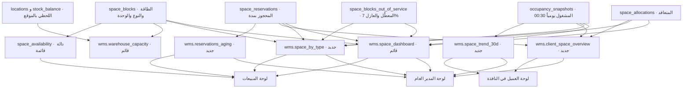
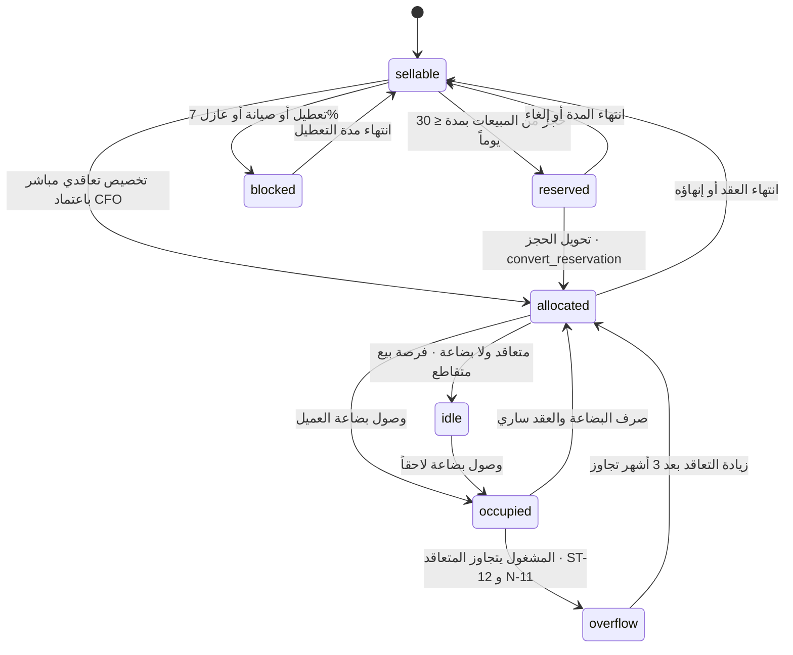

# مؤشرات إشغال مساحات التخزين — المتاح · المشغول · المحجوز
**PG-EOS v4 · D-blueprints · 21/09/2026 · حالة: مواصفة لوحات + عروض SQL منفَّذة/مقترحة**
**المصادر:** EXECUTION-MASTER-v4 §1.1 · 17 §2 و§4 و§5 و§7 و§8 و§9 · 19 §3-4 · 40 §C3 و§C10 و§D1 · 25 (N-11 · N-12 · R-08 · R-10) · 29 §6 · D-03 §4.4 · القاعدة الحيّة `pgeos` (173 جدولاً)
**الطلب الحرفي للمدير العام:** «مؤشرات الإشغال لمساحات التخزين وأنواعها: المتاح، المشغول، المحجوز — للمبيعات، يظهر للمدير العام. ومؤشر لمساحات العميل ليدير مساحته».

---

## 0. الخلاصة للمدير العام

1. **الموجود فعلاً في القاعدة اليوم:** ستة جداول مساحة (`space_blocks` 8 كتل · `space_allocations` · `space_reservations` · `space_blocks_out_of_service` · `occupancy_snapshots` · `locations` 3,153 موقعاً)، وعرضان يعملان: **`wms.space_dashboard`** (المتاح للبيع بالكتلة) و**`wms.warehouse_capacity`** (المواقع والحيّز بالكتلة)، ودالتان **`wms.space_availability`** و**`wms.check_space_available`**، وحدَّان في `platform.thresholds`: **`space.reservation_max_days = 30`** و**`space.buffer_pct = 7`**، وتنبيهان **N-11** (تجاوز) و**N-12** (حجز ينتهي خلال 7 أيام)، وتقرير **R-08** أسبوعي.
2. **الناقص فعلاً:** لا عرض يجمّع **بحسب نوع المساحة**؛ لا عرض **لكل عميل**؛ لا **اتجاه زمني**؛ لا **أعمار حجوزات**؛ ولا **حارس يمنع حجزاً فوق 30 يوماً** — الحدّ مكتوب في `thresholds` وغير مفروض برمجياً.
3. **ما أُضيف في هذه الوثيقة:** أربعة عروض ومشغّل حارس ودالة تحويل — **كلها كُتبت ونُفِّذت واختُبرت على القاعدة الحيّة داخل `begin; … rollback;`** (§5-ب، 14 اختباراً، كلها نجحت).
4. **ما يراه المدير العام:** المستودع كله — الطاقة 3,153 موضعاً · العازل 7% = 220.710 · المتاح للبيع اليوم **2,932.290 موضعاً** · النسب والاتجاه والإيراد لكل م² وقائمة الحجوزات المنتهية قريباً والمتعاقد غير المستخدم بالعميل.
5. **ما تراه المبيعات:** **المتاح للبيع فقط** بالنوع والكتلة، وإنشاء حجز من اللوحة بحدّ 30 يوماً، وتحويل الحجز إلى تخصيص عند التوقيع — **بلا أسعار تكلفة ولا هوامش**.
6. **ما يراه العميل في النافذة:** مساحته وحدها — المتعاقد · المشغول · المتبقي · نسبة الاستغلال · التجاوز · اتجاه 30 يوماً — **وبلا أي موقع تفصيلي** (`platform.settings.wms.client_sees_detailed_locations = false`).
7. **قراران مطلوبان منك** (§8): (أ) هل مصدر `ST-14` هو الحجز غير المستخدم كما تنص 17 §7، أم المتعاقد غير المشغول؟ النصّان مختلفان. (ب) أي خدمة `ST-xx` تُفوتر لكل `block_type` — لا يوجد ربط في القاعدة اليوم.

---

## 1. تعريفات الحالات الخمس للمساحة — واحدة لا تتداخل

**المعادلة الحاكمة (17 §2 · EXEC §1.1):**

```
المتاح للبيع (sellable) = الطاقة − المعطَّل/العازل − المتعاقد − المحجوز
المتعاقد غير المستخدم   = المتعاقد − المشغول فعلاً           [≥ 0]
التجاوز (overflow)      = المشغول فعلاً − المتعاقد           [≥ 0]
```

> **المتاح للبيع ليس «الطاقة − المشغول».** الفرق بين التعريفين هو بالضبط ما يجعل شركات التخزين تبيع مساحة لا تملكها (17 §1).

| # | الحالة | المصدر الدقيق `جدول.عمود` | من يغيّرها | وحدة القياس | ملاحظة تحقّق |
|---|---|---|---|---|---|
| 1 | **الطاقة الإجمالية** `capacity` | `wms.space_blocks.capacity_pallets` · `.capacity_sqm` · `.capacity_cbm` · و`wms.space_blocks.uom ∈ {pallet, sqm, cbm, position}` | `SYSADMIN` عبر `019-Warehouse-WH1-Setup.sql` فقط — ثابت إنشائي | **بحسب `block_type`:** `pallet_rack` ⇒ **منصة** · `shelf` ⇒ **موضع/خانة** · مع م² وم³ لكل كتلة | 8 كتل · 3,153 موضعاً · 3,830.895 م² · 3,301.641 م³ (19 §3-4) |
| 2 | **المعطَّل + العازل** `out_of_service` | `wms.space_blocks_out_of_service.qty_pallets` · `.qty_sqm` · `.reason ∈ {maintenance, damage, aisle, operational_buffer, safety}` · `.from_date`/`.to_date` | `WH_MGR` للتعطيل · **صف دائم** `operational_buffer` للعازل | نفس وحدة الكتلة + م² | **7%** = `platform.thresholds.space.buffer_pct` · مطبَّق فعلاً: 8 صفوف بمجموع **220.710** موضعاً |
| 3 | **المتعاقد** `allocated` | `wms.space_allocations.qty` + `.uom` · `.status='active'` · `.valid_from`/`.valid_to` · `.contract_id` · `.client_id` · `.alloc_type ∈ {dedicated, shared, overflow}` · `.min_charge_applies` | `CFO` يعتمد عند توقيع العقد | وحدة العقد (`uom` على الصف نفسه) | 0 صفاً اليوم — القاعدة بلا عقود بعد |
| 4 | **المحجوز للمبيعات** `reserved` | `wms.space_reservations.qty` + `.uom` · `.status='active'` · `.reserved_from` · **`.expires_at` إلزامي** · `.quote_id`/`.opportunity_id` · `.reason ∈ {quote_pending, incoming_client, seasonal_peak, internal}` | `SALES_MGR` يُنشئ · `CFO` يعتمد ما زاد عن 30 يوماً | وحدة العرض | قيد `reservation_has_expiry`: `expires_at > reserved_from` — **لا حجز بلا انتهاء** |
| 5 | **المشغول فعلاً** `occupied` | `wms.occupancy_snapshots.pallets_occupied` · `.sqm_occupied` · `.cbm_occupied` · `.locations_used` — **حبيبة: تاريخ × كيان × عميل × مستودع × كتلة** (قيد `occupancy_snapshots_grain_uq`) | النظام — وظيفة مجدولة **00:30 يومياً** | الثلاث وحدات معاً | اللحظي يحتاج `wms.stock_balance` ← `wms.locations.space_block_id` (فجوة §8-1) |
| **=** | **المتاح للبيع** `sellable` | **مشتق** — `wms.space_dashboard.sellable` و`wms.space_availability().sellable` | لا أحد يكتبه — يتغيّر بتغيّر 1..4 | نفس وحدة الكتلة | **2,932.290** موضعاً اليوم = 3,153 − 220.710 |
| **=** | **المتعاقد غير المستخدم** `idle_contracted` | **مشتق** — `greatest(contracted − occupied, 0)` في `space_dashboard` و`space_availability()` | — | نفس وحدة الكتلة | **⚠️ ليس بالضرورة أساس `ST-14`** — راجع §8-3 |
| **=** | **التجاوز** `overflow` | **مشتق** — `occupied − contracted` حين `occupied > contracted` | — | نفس وحدة الكتلة | يولّد **`ST-12`** آلياً + تنبيه **N-11** · **بلا اعتماد** (EXEC §1.1) |

**وحدة القياس ليست واحدة للمخزن كله:** العمود `wms.space_blocks.uom` بقيد `chk_space_blocks_uom` يقبل `pallet · sqm · cbm · position`. في `WH1` الفعلي: كتلتا `pallet_rack` وحدتهما **`pallet`**، وست كتل `shelf` وحدتها **`position`**. ولهذا كل عرض في §5 يُخرج الثلاثة معاً: المواضع والم² والم³.

---

## 2. أنواع المساحات — الكتل الثماني من القاعدة مباشرة

`select code, block_type, uom, capacity_pallets, capacity_sqm, capacity_cbm, status from wms.space_blocks order by code;` — **نُفِّذت 21/09/2026:**

| الكتلة | `block_type` | `uom` — وحدة البيع | الطاقة بالمواضع | م² | م³ | العازل 7% | **المتاح للبيع اليوم** |
|---|---|---|---|---|---|---|---|
| `P-A` | `pallet_rack` | `pallet` منصة | **288.000** | 349.920 | 507.384 | 20.160 | **267.840** |
| `P-A1` | `pallet_rack` | `pallet` منصة | **12.000** | 14.580 | 21.141 | 0.840 | **11.160** |
| `G-B` | `shelf` | `position` خانة | **906.000** | 1,100.790 | 880.632 | 63.420 | **842.580** |
| `G-C` | `shelf` | `position` خانة | **45.000** | 54.675 | 43.740 | 3.150 | **41.850** |
| `M-B` | `shelf` | `position` خانة | **906.000** | 1,100.790 | 880.632 | 63.420 | **842.580** |
| `M-C` | `shelf` | `position` خانة | **45.000** | 54.675 | 43.740 | 3.150 | **41.850** |
| `T-B` | `shelf` | `position` خانة | **906.000** | 1,100.790 | 880.632 | 63.420 | **842.580** |
| `T-C` | `shelf` | `position` خانة | **45.000** | 54.675 | 43.740 | 3.150 | **41.850** |
| **الإجمالي** | **نوعان** | — | **3,153.000** | **3,830.895** | **3,301.641** | **220.710** | **2,932.290** |

**التجميع بالنوع** (مخرَج `wms.space_by_type` المقترح في §5-ب — نتيجة حقيقية من القاعدة):

| النوع | الوحدة | عدد الكتل | الطاقة مواضع | الطاقة م² | الطاقة م³ | العازل | **المتاح مواضع** | **المتاح م²** | **المتاح م³** |
|---|---|---|---|---|---|---|---|---|---|
| `pallet_rack` | `pallet` | 2 | 300.000 | 364.500 | 528.525 | 21.000 | **279.000** | **338.985** | **491.528** |
| `shelf` | `position` | 6 | 2,853.000 | 3,466.395 | 2,773.116 | 199.710 | **2,653.290** | **3,223.747** | **2,578.998** |

**قيد `chk_space_blocks_type` يقبل تسعة أنواع:** `pallet_rack · shelf · floor · mezzanine · yard · cold · frozen · secure · hazmat` — **`WH1` يستعمل اثنين فقط**. الستة الباقية (`cold` `frozen` `secure` `hazmat` `yard` و`floor`) تقابل الخدمات `ST-05 · ST-06 · ST-07 · ST-08 · ST-09 · ST-10` التي **لا يوفّرها `WH1`** (18 §5-2 · 19 §3-4-4 · D-03 §13 بند 7). اللوحة تعرض صفوفاً بأصفار لهذه الأنواع لا صفوفاً مخفية — **الصفر المرئي قرار تجاري، والغياب سهو**.

---

## 3. المؤشرات — KPI

الدورية «لحظي» تعني إعادة حساب عند كل فتح للوحة من الجداول المعاملاتية؛ «يومي» يعني من لقطة 00:30.

| # | المؤشر | التعريف الحسابي الدقيق | الوحدة | المصدر | الدورية | الهدف/العتبة | من يراه |
|---|---|---|---|---|---|---|---|
| K-01 | **نسبة الإشغال الفعلي** | `100 × occupied ÷ capacity` | % | `wms.space_dashboard.utilization_pct` | يومي | **يحدده GM** — لا عتبة في `thresholds` | GM · `WH_MGR` · `SALES_MGR` · `CFO` |
| K-02 | **نسبة التعاقد** | `100 × contracted ÷ capacity` | % | `wms.space_dashboard.contracted_pct` | لحظي | **< 70% 🚩 حملة بيع · > 95% 🚩 خطة توسّع** (17 §5 — إرشادي، غير مُبذَر في `thresholds`) | GM · `SALES_MGR` · `CFO` |
| K-03 | **المتاح للبيع — بالمواضع** | `capacity − out_of_service − contracted − reserved` | منصة/خانة | `wms.space_dashboard.sellable` · `wms.space_availability()` | لحظي | — الرقم الذي يعتمده البيع قبل أي وعد | GM · `SALES_MGR` · `SALES_REP` · `WH_MGR` |
| K-04 | **المتاح للبيع — بالم² والم³** | `sellable × capacity_sqm ÷ capacity_pallets` ونظيرتها للم³ | م² · م³ | **`wms.space_by_type`** (جديد) | لحظي | — | GM · `SALES_MGR` |
| K-05 | **المحجوز** | `Σ qty` حيث `status='active' and expires_at ≥ current_date` | منصة/خانة | `wms.space_dashboard.reserved` | لحظي | — | GM · `SALES_MGR` |
| K-06 | **عمر الحجز** | `current_date − reserved_from` | يوم | **`wms.reservations_aging.age_days`** (جديد) | لحظي | مدة الحجز ≤ **30 يوماً** = `thresholds.space.reservation_max_days` | GM · `SALES_MGR` |
| K-07 | **الحجوزات المنتهية قريباً** | `expires_at − current_date ≤ 7` | عدد + كمية | **`wms.reservations_aging.expiry_bucket`** (جديد) · **N-12** | يومي 08:00 | 7 أيام (N-12) · مقترح جرس ثانٍ عند **3 أيام** (§7) | GM · `SALES_MGR` |
| K-08 | **معدل تحويل الحجز إلى عقد** | `count(status='converted') ÷ count(status ∈ {converted, expired, cancelled})` على نافذة زمنية | % | `wms.space_reservations.status` + `.converted_allocation_id` | شهري | **يحدده GM** | GM · `SALES_MGR` |
| K-09 | **المتعاقد غير المستخدم** | `greatest(contracted − occupied, 0)` | منصة/خانة | `wms.space_dashboard.idle_contracted` · **`wms.client_space_overview.remaining_positions`** (جديد) | يومي | **> 20% 🟡 فرصة بيع متقاطع أو مراجعة حجم العقد** (17 §5) | GM · `SALES_MGR` · `CFO` |
| K-10 | **قيمة المتعاقد غير المستخدم** | `idle_contracted × سعر الوحدة من `catalog.price_list_lines`` | د.ك/شهر | `billing.billable_events` على `ST-14` — **راجع §8-3** | شهري | — | GM · `CFO` |
| K-11 | **التجاوز `ST-12`** | `greatest(occupied − contracted, 0)` لكل يوم تجاوز | منصة زائدة/شهر | `wms.space_dashboard` + `billing.billable_events (service ST-12)` | يومي | **أي تجاوز ⇒ فوترة آلية + N-11 · بلا اعتماد** (EXEC §1.1) | GM · `WH_MGR` · `SALES_MGR` · `CFO` |
| K-12 | **تجاوز مستمر 3 أشهر** | تجاوز في 3 لقطات شهرية متتالية لنفس العميل | عدد عملاء | `wms.occupancy_snapshots` مقابل `space_allocations` | شهري | ⇒ ملف زيادة التعاقد لـ`GM` (17 §6-3) · تصعيد N-11 بعد **2,160 ساعة = 90 يوماً** | GM |
| K-13 | **الإيراد لكل موضع** | `Σ amount من ST-01…ST-14 للكتلة ÷ capacity_pallets` | د.ك/موضع/شهر | `billing.billable_events` ← `wms.space_allocations.block_id` | شهري | **يحدده GM** | GM · `CFO` |
| K-14 | **الإيراد لكل م²** | `Σ amount للكتلة ÷ capacity_sqm` | د.ك/م²/شهر | نفسه | شهري | **يحدده GM** | GM · `CFO` |
| K-15 | **تكلفة الموضع المشغول** | `monthly_cost ÷ occupied` | د.ك/موضع | `wms.space_dashboard.cost_per_occupied_pallet` | شهري | يقابَل بالسعر ⇒ هامش المساحة الحقيقي · **هامش < 15% تحذير · < 10% يتطلب GM** (EXEC §1.1) | GM · `CFO` **فقط — لا تراه المبيعات** |
| K-16 | **عمر المخزون في الموقع** | `current_date − last_movement_at::date` على `wms.stock_balance` | يوم | `wms.stock_balance.last_movement_at` + `wms.locations.space_block_id` | يومي | **يحدده GM** | GM · `WH_MGR` |
| K-17 | **توقّع الامتلاء** | ميل الانحدار الخطي `regr_slope(occupied, day)` على 30 يوماً ⇒ `days_to_full = (capacity − occupied) ÷ slope` | يوم | **`wms.space_trend_30d`** (جديد) | أسبوعي | يقابَل بمهلة توفير مساحة بديلة أو شريك (09) | GM · `WH_MGR` · `SALES_MGR` |
| K-18 | **المعطَّل غير العازل** | `Σ qty_pallets` حيث `reason ≠ 'operational_buffer'` | % من الطاقة | `wms.space_blocks_out_of_service` | أسبوعي | **> 10% 🚩 صيانة معطّلة تكلّف مالاً** — العازل 7% مستثنى من هذا القياس (17 §5) | GM · `WH_MGR` |

> **ملاحظة تحقّق على `monthly_cost`:** العمود موجود على `wms.space_blocks` لكنه **`null` في الكتل الثماني كلها** اليوم. لذلك K-15 و`cost_per_occupied_pallet` يعودان `null` إلى أن يُدخِل `CFO` تكلفة الكتلة. هذه **بوابة بيانات لا خلل في العرض** (§8-6).

---

## 4. اللوحات الثلاث

### 4.1 لوحة المدير العام — `/wms/space` بعدسة `GM`

**الغرض:** هل نبيع مساحة نملكها؟ وهل نحصّل ثمن ما نبيعه؟ ومتى نصطدم بالسقف؟

| البند | المحتوى |
|---|---|
| **البطاقات العلوية — ستّ** | ① الطاقة **3,153** موضعاً · ② المتاح للبيع **2,932.290** ونسبته · ③ المتعاقد ونسبته K-02 · ④ المحجوز K-05 · ⑤ المشغول ونسبته K-01 · ⑥ **الإيراد لكل م²** K-14 |
| **الجداول** | (أ) **الكتل الثماني** من `wms.space_dashboard` — الطاقة/المعطَّل/المتعاقد/المحجوز/المشغول/المتاح/النِّسَب/المتعاقد غير المستخدم/تكلفة الموضع؛ (ب) **بحسب النوع** من `wms.space_by_type` بالمواضع والم² والم³؛ (ج) **المتعاقد غير المستخدم بالعميل** من `wms.client_space_overview`؛ (د) **الحجوزات المنتهية خلال 7 أيام** من `wms.reservations_aging` |
| **الرسوم** | خط الإشغال 30 يوماً لكل كتلة من `wms.space_trend_30d` + خط توقّع بلوغ الطاقة K-17 · أعمدة مكدّسة: معطَّل/متعاقد/محجوز/متاح لكل كتلة |
| **الفلاتر** | المستودع · `block_type` · الكتلة · العميل · المدى الزمني · «الكتل المتجاوِزة فقط» · «الحجوزات المنتهية قريباً فقط» |
| **الإجراءات من اللوحة** | اعتماد حجز > 30 يوماً · فتح ملف زيادة التعاقد K-12 · تغيير `space.buffer_pct` و`space.reservation_max_days` في `platform.thresholds` · فتح قرار `partner_or_decline` عند نفاد نوع مطلوب (S9) |
| **التنبيهات** | **N-11** تجاوز مساحة متعاقدة — تصعيد إلى `GM` بعد **2,160 ساعة** · **N-12** حجز ينتهي خلال 7 أيام |
| **مسار الشاشة** | 29 §6: الصفحة الرئيسية لكل دور هي **صندوق القرارات**، واللوحة تُفتح من بند فيه أو من رابط التنبيه `/wms/space`. اللوحة واحدة من **أربع لوحات مؤشرات** المتبقية بعد التقليص (29 §6-3) |

**ما لا يظهر هنا:** لا مواقع تفصيلية — الصفّ الأصغر هو **الكتلة**، لا `wms.locations`.

---

### 4.2 لوحة المبيعات — `/wms/space` بعدسة `SALES_MGR` / `SALES_REP`

**الغرض:** «عميل يريد 200 منصة من الشهر القادم — أقدر؟» — سؤال واحد وجواب واحد (17 §1).

| البند | المحتوى |
|---|---|
| **البطاقات العلوية — أربع** | ① **المتاح للبيع الآن** بالمواضع · ② بالم² · ③ بالم³ · ④ حجوزاتي النشطة وأقربها انتهاءً |
| **الجداول** | (أ) **ما يمكن بيعه الآن** من `wms.space_by_type` ثم `wms.space_dashboard` مفصَّلاً بالكتلة؛ (ب) **حجوزاتي الحيّة** من `wms.reservations_aging`: الكتلة · العميل · الكمية · السبب · العمر · المتبقي للانتهاء · `quote_id`/`opportunity_id` |
| **الرسوم** | شريط «المتاح مقابل المحجوز مقابل المتعاقد» لكل نوع — **بلا خط تكلفة** |
| **الفلاتر** | `block_type` · الوحدة · «متاح ≥ الكمية المطلوبة» · تاريخ البدء المطلوب · المدة |
| **الإجراءات** | ① **فحص التوفّر لفترة**: `wms.space_availability(block, from, to)` ⇒ تسع قيم؛ ② **إنشاء حجز** بحد **30 يوماً**، والزيادة تفتح طلب اعتماد `CFO`؛ ③ **تمديد/إلغاء حجز** بسبب؛ ④ **تحويل الحجز إلى تخصيص** عند توقيع العقد — `wms.convert_reservation()` (§5-ب-5)؛ ⑤ «طلب مساحة نوع غير متوفّر» ⇒ بند قرار `partner_or_decline` لـ`GM` |
| **التنبيهات** | **N-12** حجز ينتهي خلال 7 أيام — `SALES_MGR` · قناة `in_app` · يومي 08:00 · إجراء «حوِّل الحجز أو أفرج عنه» → `/wms/space/reservations` |
| **مسار الشاشة** | `/wms/space` ثم `/wms/space/reservations` — الرابطان مبذوران فعلاً في `platform.alert_rules.action_link` |

**ما لا يظهر للمبيعات (17 §9):** `monthly_cost` · `cost_per_occupied_pallet` · أي هامش. الحقول تُحذف من الاستعلام لا تُخفى في الواجهة.

---

### 4.3 لوحة العميل في النافذة — `apps/portal` بعدسة `CLIENT_ADMIN` / `CLIENT_VIEWER`

**الغرض:** أن يدير العميل مساحته هو — لا أن يرى مخزننا.

| البند | المحتوى |
|---|---|
| **البطاقات العلوية — خمس** | ① **المتعاقد عليه** · ② **المشغول** · ③ **المتبقي له** · ④ **نسبة الاستغلال** · ⑤ **التجاوز إن وُجد** — كلها من صفّه الواحد في `wms.client_space_overview` |
| **الجداول** | جدول واحد: المتعاقد/المشغول/المتبقي/التجاوز بالمواضع والم² والم³ · وسطر «محجوز لك» إن وُجد — **راجع §8-5** |
| **الرسوم** | خط اتجاه 30 يوماً لإشغاله هو من `wms.space_trend_30d` مُرشَّحاً بـ`client_id` — **بلا أسماء كتل داخلية** |
| **الفلاتر** | المدى الزمني فقط |
| **الإجراءات** | ① **«اطلب مساحة إضافية»** ⇒ ينشئ `sales.opportunities` أو بند قرار موجَّه إلى `SALES_MGR` بالكمية والنوع وتاريخ البدء؛ ② تصدير الاتجاه CSV؛ ③ «اعترض على رقم» ⇒ تذكرة PCC |
| **التنبيهات** | إشعار تجاوز التعاقد — نسخة العميل من N-11 عند تفعيلها له · تنبيه «بضاعتك ستُنقل» عند تعطيل كتلة عليها تخصيصه (17 §6-4) |
| **مسار الشاشة** | 40 §C10 — نافذة العميل 12 شاشة. **لا توجد فيها شاشة مساحة اليوم** ⇒ هذه **الشاشة الثالثة عشرة**، وهي فجوة مرصودة §8-4 |

**الحاجز الصلب — «العميل لا يرى المواقع التفصيلية»:**
1. الإعداد المبذور فعلاً: `platform.settings.wms.client_sees_detailed_locations = false` (EXEC §1.1 — إعداد لكل عميل، الافتراض الأمني «لا»).
2. العرض `wms.client_space_overview` **لا يحتوي عمود موقع أصلاً** — أثبته الاختبار T5: أعمدته خمسة عشر، ليس فيها `location` ولا `block` ولا `aisle`.
3. `wms.locations` و`wms.stock_balance` محكومان بسياسة `internal_only` = `platform.is_internal()` — **العميل يعود بصفر صفوف لا بخطأ صلاحية** (معيار القبول G14 · 40 §C10).

---

#### خريطة 13-1: تدفق البيانات — من الجداول إلى اللوحات الثلاث
تقرأ من جداول المساحة الستة إلى العروض ثم إلى اللوحات وصلاحية كل دور.



**قراءة الخريطة:** لوحة العميل تتغذّى من عرضين فقط — `client_space_overview` و`space_trend_30d` — ولا تلمس `space_dashboard` ولا `warehouse_capacity` ولا `locations`. هذا هو **العزل المعماري** الذي يجعل «العميل لا يرى المواقع» قاعدة بنيوية لا إعداد واجهة.

#### خريطة 13-2: دورة حياة الموضع الواحد بين الحالات الخمس
تقرأ من موضع فارغ إلى تعاقد ثم إشغال ثم تجاوز أو خمول، وعودة المحجوز المنتهي.



---

## 5. العروض SQL

### (أ) العرضان القائمان — كما هما، بشرح كل عمود

#### 5-أ-1 `wms.space_dashboard` — **المصدر الرسمي للمتاح للبيع**

مقروء بـ`pg_get_viewdef('wms.space_dashboard'::regclass, true)`.

| العمود | التعريف داخل العرض | القراءة الإدارية |
|---|---|---|
| `warehouse` | `w.code` | `WH1` |
| `block` | `b.code` | الكتلة — **وحدة البيع والتخصيص** (17 §3) |
| `block_type` | `b.block_type` | النوع |
| `capacity` | `b.capacity_pallets` | الطاقة بالمواضع |
| `out_of_service` | `Σ qty_pallets` من `space_blocks_out_of_service` حيث `from_date ≤ today` و`to_date is null or ≥ today` | المعطَّل + **العازل 7%** |
| `contracted` | `Σ qty` من `space_allocations` حيث `status='active'` | المتعاقد — **العرض لا يرشّح بـ`valid_from`/`valid_to`** ⇒ §8-2 |
| `reserved` | `Σ qty` من `space_reservations` حيث `status='active' and expires_at ≥ today` | المحجوز الساري |
| `occupied` | `Σ pallets_occupied` من `occupancy_snapshots` حيث `snapshot_date = current_date − 1` | **إشغال أمس** — ⇒ §8-1 |
| `sellable` | `capacity − out_of_service − contracted − reserved` | **الرقم الوحيد الذي يبني عليه البيع قراره** |
| `contracted_pct` | `round(100 × contracted ÷ capacity, 1)` | K-02 |
| `utilization_pct` | `round(100 × occupied ÷ capacity, 1)` | K-01 |
| `idle_contracted` | `greatest(contracted − occupied, 0)` | K-09 |
| `monthly_cost` | `b.monthly_cost` | `null` في كل الكتل اليوم — §8-6 |
| `cost_per_occupied_pallet` | `round(monthly_cost ÷ occupied, 3)` | K-15 — `null` تبعاً لما سبق |

`where b.status = 'active'` — الكتل المعطَّلة كلياً خارج اللوحة.

#### 5-أ-2 `wms.warehouse_capacity` — الطاقة الفيزيائية من المواقع

| العمود | التعريف | القراءة |
|---|---|---|
| `warehouse` · `block` · `block_type` · `uom` | من `warehouses` و`space_blocks` | مفاتيح التجميع |
| `positions` | `count(l.id)` | عدد المواقع الفعلية في الكتلة — **3,153 موقعاً موزَّعة** |
| `volume_m3` | `round(Σ l.volume_m3, 3)` | الحيّز من المواقع نفسها لا من الكتلة |
| `area_m2` | `round(Σ l.area_m2, 3)` | المساحة من المواقع |
| `max_load_kg` | `Σ l.max_weight_kg` | الحمل المصمَّم — 2,439,750 كجم إجمالاً |
| `assigned` | `count(*) filter (where l.assigned_client_id is not null)` | مواقع مخصَّصة لعميل بالاسم |
| `blocked` | `count(*) filter (where l.is_blocked)` | مواقع محجوبة |
| `free` | `count(*) filter (where not l.is_blocked and l.assigned_client_id is null)` | **شاغر فيزيائياً — وهو غير «المتاح للبيع»** (17 §1) |

**الفرق الحاكم بين العرضين:** `warehouse_capacity` يجيب «ما الفارغ فعلاً؟» و`space_dashboard` يجيب «ما الذي أستطيع بيعه؟». الأول للمستودع، الثاني للمبيعات. **خلطهما هو الخطأ الذي تقع فيه شركات التخزين.** نتيجة حقيقية اليوم: `free = 3,153` بينما `sellable = 2,932.290`.

---

### (ب) العروض الجديدة المقترحة — DDL كامل ونتائج اختبار حقيقية

> **بروتوكول الاختبار:** كل ما يلي نُفِّذ على القاعدة الحيّة `pgeos` في جلسة واحدة داخل `begin; … rollback;` مع بيانات اختبار مؤقتة (عميلان · عقدان · تخصيصان · 60 لقطة إشغال على 30 يوماً · حجزان). **بعد `rollback` عادت القاعدة كما كانت: 0 تخصيصات · 0 حجوزات · 0 لقطات · عرضان في `wms`.**

#### 5-ب-1 `wms.space_by_type` — التجميع بحسب النوع ووحدة القياس

```sql
create or replace view wms.space_by_type as
with snap as (
  select max(snapshot_date) as d from wms.occupancy_snapshots where snapshot_date <= current_date),
oos as (
  select block_id, sum(qty_pallets) as q_pos, sum(qty_sqm) as q_sqm
  from wms.space_blocks_out_of_service
  where from_date <= current_date and (to_date is null or to_date >= current_date)
  group by 1),
alloc as (
  select block_id, sum(qty) as q from wms.space_allocations
  where status = 'active' and valid_from <= current_date
    and (valid_to is null or valid_to >= current_date)
  group by 1),
resv as (
  select block_id, sum(qty) as q from wms.space_reservations
  where status = 'active' and reserved_from <= current_date and expires_at >= current_date
  group by 1),
occ as (
  select o.space_block_id as bid,
         sum(o.pallets_occupied) as p, sum(o.sqm_occupied) as s, sum(o.cbm_occupied) as c
  from wms.occupancy_snapshots o, snap
  where o.snapshot_date = snap.d
  group by 1)
select
  w.code                                   as warehouse,
  b.block_type,
  b.uom,
  (select d from snap)                     as as_of,
  count(*)                                 as blocks,
  sum(b.capacity_pallets)                  as capacity_positions,
  sum(b.capacity_sqm)                      as capacity_sqm,
  sum(b.capacity_cbm)                      as capacity_cbm,
  sum(coalesce(x.q_pos,0))                 as out_of_service_positions,
  sum(coalesce(a.q,0))                     as contracted_positions,
  sum(coalesce(r.q,0))                     as reserved_positions,
  sum(coalesce(o.p,0))                     as occupied_positions,
  sum(b.capacity_pallets - coalesce(x.q_pos,0) - coalesce(a.q,0) - coalesce(r.q,0))
                                           as sellable_positions,
  round(sum((b.capacity_pallets - coalesce(x.q_pos,0) - coalesce(a.q,0) - coalesce(r.q,0))
            * b.capacity_sqm / nullif(b.capacity_pallets,0)), 3) as sellable_sqm,
  round(sum((b.capacity_pallets - coalesce(x.q_pos,0) - coalesce(a.q,0) - coalesce(r.q,0))
            * b.capacity_cbm / nullif(b.capacity_pallets,0)), 3) as sellable_cbm,
  round(100.0 * sum(coalesce(a.q,0)) / nullif(sum(b.capacity_pallets),0), 1) as contracted_pct,
  round(100.0 * sum(coalesce(o.p,0)) / nullif(sum(b.capacity_pallets),0), 1) as utilization_pct,
  sum(greatest(coalesce(a.q,0) - coalesce(o.p,0), 0))            as idle_contracted_positions
from wms.space_blocks b
join wms.warehouses w on w.id = b.warehouse_id
left join oos   x on x.block_id = b.id
left join alloc a on a.block_id = b.id
left join resv  r on r.block_id = b.id
left join occ   o on o.bid      = b.id
where b.status = 'active'
group by w.code, b.block_type, b.uom;

comment on view wms.space_by_type is
 'إشغال المساحة مجمّعاً بحسب نوع الكتلة ووحدة القياس — بالمواضع والم² والم³ (v4 · D-13)';
```

**ثلاثة فوارق مقصودة عن `space_dashboard`، كلٌّ منها تصحيح:**
1. **`as_of`**: الإشغال من **آخر لقطة ≤ اليوم** لا من `current_date − 1` الثابت — فلا تظهر اللوحة صفراً لمجرد أن لقطة أمس لم تُكتب.
2. **ترشيح `valid_from`/`valid_to`** على التخصيصات — العرض القائم يجمع كل `status='active'` بلا نظر للمدى (§8-2).
3. **الم² والم³ بالتناسب**: `sellable × capacity_sqm ÷ capacity_pallets` — يجيب على عقود `ST-02`/`ST-03`/`ST-10` المسعَّرة بالم² والم³.

**نتيجة الاختبار T1 — بعد إدخال تخصيصين وحجزين و60 لقطة:**

| warehouse | block_type | uom | as_of | blocks | capacity_positions | out_of_service | contracted | reserved | occupied | **sellable_positions** | sellable_sqm | sellable_cbm | contracted_pct | utilization_pct | idle_contracted |
|---|---|---|---|---|---|---|---|---|---|---|---|---|---|---|---|
| WH1 | `pallet_rack` | `pallet` | 2026-09-21 | 2 | 300.000 | 21.000 | 150.000 | 0 | 160.000 | **129.000** | 156.735 | 227.266 | 50.0 | 53.3 | 0 |
| WH1 | `shelf` | `position` | 2026-09-21 | 6 | 2853.000 | 199.710 | 100.000 | 65.000 | 60.000 | **2488.290** | 3023.272 | 2418.618 | 3.5 | 2.1 | 40.000 |

**اختبار الاتساق T14 — مجموع العرض الجديد = مجموع العرض القائم:**

| | `space_by_type` | `space_dashboard` |
|---|---|---|
| مجموع الطاقة | **3,153.000** | **3,153.000** ✅ |
| مجموع المتاح للبيع | **2,587.290** | **2,587.290** ✅ |

---

#### 5-ب-2 `wms.client_space_overview` — مساحة كل عميل، بعزل صفّه

```sql
create or replace view wms.client_space_overview
  with (security_invoker = true) as
with snap as (
  select max(snapshot_date) as d from wms.occupancy_snapshots where snapshot_date <= current_date),
alloc as (
  select a.client_id, (array_agg(a.entity_id))[1] as entity_id, sum(a.qty) as contracted
  from wms.space_allocations a
  where a.status = 'active' and a.valid_from <= current_date
    and (a.valid_to is null or a.valid_to >= current_date)
  group by 1),
occ as (
  select o.client_id, (array_agg(o.entity_id))[1] as entity_id,
         sum(o.pallets_occupied) as occupied, sum(o.sqm_occupied) as occupied_sqm,
         sum(o.cbm_occupied) as occupied_cbm, sum(o.locations_used) as locations_used
  from wms.occupancy_snapshots o, snap
  where o.snapshot_date = snap.d
  group by 1),
resv as (
  select r.client_id, sum(r.qty) as reserved, min(r.expires_at) as next_expiry
  from wms.space_reservations r
  where r.status = 'active' and r.expires_at >= current_date and r.client_id is not null
  group by 1)
select
  c.id            as client_id,
  c.code          as client_code,
  c.name_ar       as client_name,
  coalesce(al.entity_id, oc.entity_id)                     as entity_id,
  (select d from snap)                                     as as_of,
  coalesce(al.contracted, 0)                               as contracted_positions,
  coalesce(oc.occupied, 0)                                 as occupied_positions,
  coalesce(oc.occupied_sqm, 0)                             as occupied_sqm,
  coalesce(oc.occupied_cbm, 0)                             as occupied_cbm,
  coalesce(oc.locations_used, 0)                           as locations_used,
  greatest(coalesce(al.contracted,0) - coalesce(oc.occupied,0), 0) as remaining_positions,
  greatest(coalesce(oc.occupied,0) - coalesce(al.contracted,0), 0) as overage_positions,
  round(100.0 * coalesce(oc.occupied,0) / nullif(coalesce(al.contracted,0),0), 1) as utilization_pct,
  coalesce(rs.reserved, 0)                                 as reserved_positions,
  rs.next_expiry                                           as reservation_next_expiry
from sales.accounts c
left join alloc al on al.client_id = c.id
left join occ   oc on oc.client_id = c.id
left join resv  rs on rs.client_id = c.id
where (al.client_id is not null or oc.client_id is not null or rs.client_id is not null)
  and (platform.is_internal() or c.id = platform.current_client_id());

comment on view wms.client_space_overview is
 'مساحة العميل: المتعاقد/المشغول/المتبقي/التجاوز — بلا مواقع تفصيلية · security_invoker (v4 · D-13)';
```

**ثلاث طبقات عزل، لا واحدة:**
1. **`security_invoker = true`** (PostgreSQL 15+؛ القاعدة 16.13): العرض يعمل بصلاحية القارئ لا بصلاحية مالكه ⇒ سياسة `client_portal_scope` القائمة على `wms.space_allocations` (`platform.is_internal() or client_id = platform.current_client_id()`) وسياسة `client_portal_scope` على `sales.accounts` تُطبَّقان فعلياً.
2. **شرط صريح في `where`**: `platform.is_internal() or c.id = platform.current_client_id()` — حارس ثانٍ لا يعتمد على RLS، ويغطي `wms.occupancy_snapshots` و`wms.space_reservations` اللذين عليهما `entity_scope` فقط ⇒ **مقترح إضافة سياسة `client_portal_scope` عليهما، §8-4**.
3. **لا عمود موقع في العرض أصلاً.**

**نتائج الاختبار:**

**T2 — بعدسة داخلية `app.is_internal = true`:**

| client_code | client_name | as_of | contracted | occupied | **remaining** | **overage** | utilization_pct | reserved | locations_used | next_expiry |
|---|---|---|---|---|---|---|---|---|---|---|
| CL-TEST1 | شركة الخليج للتجارة | 2026-09-21 | 150.000 | 160.000 | 0 | **10.000** | **106.7** | 25.000 | 160 | 2026-09-23 |
| CL-TEST2 | مؤسسة قطع الغيار | 2026-09-21 | 100.000 | 60.000 | **40.000** | 0 | 60.0 | 40.000 | 60 | 2026-10-21 |

**T3 — بعدسة العميل الثاني** (`app.is_internal='false'` · `app.client_id='2222…'`): **صفّ واحد فقط**، صفّه هو. `select count(*) from wms.client_space_overview` ⇒ **1**.
**T4 — بعدسة العميل الأول:** صفّ واحد، ويرى تجاوزه **10.000** ونسبة استغلال **106.7%**.
**T5 — أعمدة العرض كاملة:** `client_id · client_code · client_name · entity_id · as_of · contracted_positions · occupied_positions · occupied_sqm · occupied_cbm · locations_used · remaining_positions · overage_positions · utilization_pct · reserved_positions · reservation_next_expiry` — **خمسة عشر عموداً، لا واحد منها موقع**. ✅

> `locations_used` رقم مجمَّع (كم موقعاً تشغل بضاعته) لا قائمة مواقع — يُعرض للداخل، وقرار عرضه للعميل مطروح في §8-5.

---

#### 5-ب-3 `wms.space_trend_30d` — الاتجاه ومُدخل التوقّع

```sql
create or replace view wms.space_trend_30d as
with d as (
  select o.snapshot_date, o.space_block_id,
         sum(o.pallets_occupied) as p, sum(o.sqm_occupied) as s,
         sum(o.cbm_occupied) as c, sum(o.locations_used) as lu,
         count(distinct o.client_id) as clients
  from wms.occupancy_snapshots o
  where o.snapshot_date > current_date - 30 and o.snapshot_date <= current_date
  group by 1,2)
select
  d.snapshot_date,
  w.code             as warehouse,
  b.code             as block,
  b.block_type,
  b.uom,
  b.capacity_pallets as capacity_positions,
  d.p                as occupied_positions,
  d.s                as occupied_sqm,
  d.c                as occupied_cbm,
  d.lu               as locations_used,
  d.clients          as clients_in_block,
  round(100.0 * d.p / nullif(b.capacity_pallets,0), 1) as utilization_pct
from d
join wms.space_blocks b on b.id = d.space_block_id
join wms.warehouses  w on w.id = b.warehouse_id;

comment on view wms.space_trend_30d is
 'اتجاه الإشغال 30 يوماً لكل كتلة من occupancy_snapshots — مُدخل توقّع الامتلاء (v4 · D-13)';
```

**التجميع بالتاريخ والكتلة أولاً ثم الانضمام بالطاقة** — لأن الجمع المباشر عبر العملاء يضاعف `capacity_pallets` بعدد عملاء الكتلة ويفسد `utilization_pct`. هذا نظير خطأ حبيبة اللقطة المصحَّح في v4 (OPS-59).

**نتيجة T6 — كتلة `P-A`، أول ثلاثة أيام وآخر ثلاثة:**

| snapshot_date | block | capacity | occupied | occupied_sqm | occupied_cbm | locations_used | utilization_pct |
|---|---|---|---|---|---|---|---|
| 2026-08-23 | P-A | 288.000 | 87.500 | 106.313 | 154.153 | 88 | 30.4 |
| 2026-08-24 | P-A | 288.000 | 90.000 | 109.350 | 158.558 | 90 | 31.3 |
| 2026-08-25 | P-A | 288.000 | 92.500 | 112.388 | 162.962 | 93 | 32.1 |
| 2026-09-19 | P-A | 288.000 | 155.000 | 188.325 | 273.071 | 155 | 53.8 |
| 2026-09-20 | P-A | 288.000 | 157.500 | 191.363 | 277.476 | 158 | 54.7 |
| 2026-09-21 | P-A | 288.000 | 160.000 | 194.400 | 281.880 | 160 | 55.6 |

**نتيجة T6ب — توقّع الامتلاء K-17** باستعلام الانحدار فوق العرض:

```sql
select block,
       round(regr_slope(occupied_positions, snapshot_date - (current_date-30))::numeric, 3) as slope_per_day,
       max(occupied_positions) as occupied_today,
       max(capacity_positions) as capacity,
       case when regr_slope(occupied_positions, snapshot_date-(current_date-30)) > 0
            then ceil((max(capacity_positions) - max(occupied_positions))
                 / regr_slope(occupied_positions, snapshot_date-(current_date-30))::numeric)
       end as days_to_full
from wms.space_trend_30d group by block;
```

| block | slope_per_day | occupied_today | capacity | **days_to_full** |
|---|---|---|---|---|
| P-A | **2.500** | 160.000 | 288.000 | **52** |

> هذا هو المخرج الأهم إدارياً (17 §8): «متى أحتاج مخزناً إضافياً أو شريكاً؟» — **قبل أن تصطدم بالحائط، لا بعده**. والتوقّع ستة أشهر في 29 §9 مُصنَّف `AI-08` مستوى `A1` — اقتراح لا قرار.

---

#### 5-ب-4 `wms.reservations_aging` — أعمار الحجوزات

```sql
create or replace view wms.reservations_aging as
select
  r.id                             as reservation_id,
  w.code                           as warehouse,
  b.code                           as block,
  b.block_type,
  r.uom,
  c.code                           as client_code,
  c.name_ar                        as client_name,
  r.quote_id, r.opportunity_id, r.qty, r.reason,
  r.reserved_from, r.expires_at,
  (current_date - r.reserved_from) as age_days,
  (r.expires_at - current_date)    as days_to_expiry,
  (r.expires_at - r.reserved_from) as duration_days,
  ((r.expires_at - r.reserved_from)
    > (select t.value from platform.thresholds t where t.key = 'space.reservation_max_days')::int)
                                   as exceeds_max_days,
  case when r.expires_at <  current_date     then 'expired'
       when r.expires_at - current_date <= 3 then 'le_3_days'
       when r.expires_at - current_date <= 7 then 'le_7_days'
       else                                       'gt_7_days' end as expiry_bucket,
  r.reserved_by, r.approved_by, r.created_at
from wms.space_reservations r
join wms.space_blocks b on b.id = r.block_id
join wms.warehouses  w on w.id = b.warehouse_id
left join sales.accounts c on c.id = r.client_id
where r.status = 'active';

comment on view wms.reservations_aging is
 'أعمار الحجوزات النشطة وقرب انتهائها ومخالفة حد 30 يوماً (v4 · D-13)';
```

**`exceeds_max_days` يقرأ الحدّ من `platform.thresholds` لا من ثابت مكتوب** — فتغيير `GM` للحد ينعكس على اللوحة بلا نشر (29 §9 · «القابلية للضبط»).

**نتيجة T7:**

| block | client_code | qty | reason | reserved_from | expires_at | age_days | days_to_expiry | duration_days | exceeds_max_days | expiry_bucket |
|---|---|---|---|---|---|---|---|---|---|---|
| T-B | CL-TEST1 | 25.000 | `incoming_client` | 2026-09-09 | 2026-09-23 | 12 | **2** | 14 | f | **`le_3_days`** |
| M-B | CL-TEST2 | 40.000 | `quote_pending` | 2026-09-21 | 2026-10-21 | 0 | 30 | **30** | f | `gt_7_days` |

---

#### 5-ب-5 المشغّل الحارس ودالة التحويل

```sql
create or replace function wms.trg_space_reservation_guard()
returns trigger language plpgsql as $fn$
declare v_max int; v_sellable numeric; v_code text; v_delta numeric;
begin
  select t.value::int into v_max
    from platform.thresholds t where t.key = 'space.reservation_max_days';
  v_max := coalesce(v_max, 30);

  if (new.expires_at - new.reserved_from) > v_max then
    raise exception
      'مدة الحجز % يوماً تتجاوز الحد المعتمد % يوماً — ما زاد يتطلب اعتماد CFO (EXEC §1.1)',
      (new.expires_at - new.reserved_from), v_max;
  end if;

  if new.status = 'active' then
    v_delta := new.qty - case when tg_op = 'UPDATE' and old.status = 'active'
                              then old.qty else 0 end;
    if v_delta > 0 then
      select sa.sellable, sa.block_code into v_sellable, v_code
        from wms.space_availability(new.block_id, new.reserved_from, new.expires_at) sa;
      if v_sellable < v_delta then
        raise exception
          'المتاح للبيع في الكتلة % هو % فقط والمطلوب حجزه % — لا بيع لمساحة غير موجودة (17 §4-1)',
          v_code, v_sellable, v_delta;
      end if;
    end if;
  end if;
  return new;
end $fn$;

drop trigger if exists space_reservation_guard on wms.space_reservations;
create trigger space_reservation_guard
  before insert or update on wms.space_reservations
  for each row execute function wms.trg_space_reservation_guard();
```

```sql
create or replace function wms.convert_reservation(
  p_reservation uuid, p_contract uuid, p_service uuid,
  p_valid_from date, p_valid_to date, p_actor uuid)
returns uuid language plpgsql as $fn$
declare v_r wms.space_reservations; v_alloc uuid;
begin
  select * into v_r from wms.space_reservations where id = p_reservation for update;
  if not found then raise exception 'الحجز % غير موجود', p_reservation; end if;
  if v_r.status <> 'active' then
    raise exception 'الحجز % حالته % — لا يُحوَّل إلا الحجز النشط', p_reservation, v_r.status;
  end if;
  if v_r.client_id is null then
    raise exception 'الحجز % بلا عميل — لا يمكن تحويله إلى تخصيص تعاقدي', p_reservation;
  end if;

  -- 1) يُقفَل الحجز أولاً حتى لا تُحتسب كميته مرتين داخل sellable
  update wms.space_reservations set status = 'converted' where id = p_reservation;

  -- 2) الحارس القائم على التخصيص
  perform wms.check_space_available(v_r.block_id, v_r.qty, p_valid_from, p_valid_to);

  insert into wms.space_allocations
    (entity_id, contract_id, client_id, block_id, alloc_type, qty, uom,
     service_id, valid_from, valid_to, status, created_by)
  values (v_r.entity_id, p_contract, v_r.client_id, v_r.block_id, 'dedicated',
          v_r.qty, v_r.uom, p_service, p_valid_from, p_valid_to, 'active', p_actor)
  returning id into v_alloc;

  update wms.space_reservations
     set converted_allocation_id = v_alloc where id = p_reservation;
  return v_alloc;
end $fn$;
```

**ترتيب الخطوتين ① و② ليس تفصيلاً:** لو أُدخل التخصيص قبل إقفال الحجز، لاحتُسبت الكمية نفسها مرتين — محجوزة ومتعاقداً عليها — فرفضها `check_space_available` بلا سبب حقيقي. **هذا سبب وجود دالة بدل خطوتين في الواجهة.**

**نتائج اختبار القواعد:**

| # | الاختبار | المدخل | النتيجة الفعلية | ✅ |
|---|---|---|---|---|
| **T8** | حجز مدته 45 يوماً | `expires_at = today + 45` | `ERROR: مدة الحجز 45 يوماً تتجاوز الحد المعتمد 30 يوماً — ما زاد يتطلب اعتماد CFO` | ✅ مرفوض |
| **T9** | حجز 500 موضعاً في `G-C` | متاحها 41.850 | `ERROR: المتاح للبيع في الكتلة G-C هو 41.850 فقط والمطلوب حجزه 500.000` | ✅ مرفوض |
| **T10** | حجز 30 موضعاً في `G-C` | داخل الحدود | قُبل · المتاح نزل من 41.850 إلى **11.850** | ✅ مقبول |
| **T11** | تحويل حجز `M-B` كمية 40 | `convert_reservation()` | تخصيص جديد · الحجز `status='converted'` · `converted_allocation_id` مربوط · اللوحة: `M-B` المحجوز **0** والمتعاقد **40.000** | ✅ |
| **T12** | التجاوز `ST-12` | `space_dashboard` بعد اللقطات | `P-A`: متعاقد 150.000 · مشغول 157.500 · **فائض 7.500** — الاستعلام نفسه المبذور في `alert_rules.N-11` | ✅ |
| **T13** | المتعاقد غير المستخدم | `client_space_overview` | `CL-TEST2`: متعاقد 140.000 · مشغول 60.000 · **خامل 80.000** | ✅ |

> **T12 كشف فرقاً حقيقياً بين العرضين:** `space_dashboard` أعاد `occupied = 157.500` (لقطة **أمس**) بينما `space_by_type` و`client_space_overview` أعادا **160.000** (آخر لقطة ≤ اليوم). الرقمان صحيحان كلٌّ بتعريفه، **والاختلاف بينهما على شاشة واحدة خطأ إداري**. القرار مطروح في §8-1.

---

## 6. القواعد المفروضة

| # | القاعدة | كيف تُفرَض | الحالة اليوم | المصدر |
|---|---|---|---|---|
| ق-1 | **لا حجز بلا تاريخ انتهاء** | قيد `reservation_has_expiry`: `expires_at > reserved_from` | ✅ **مفروض في القاعدة** | 01/13B · 17 §6-2 |
| ق-2 | **الحجز ≤ 30 يوماً** بلا عقد؛ ما زاد يتطلب `CFO` | `platform.thresholds.space.reservation_max_days = 30` | ⚠️ **القيمة مبذورة وغير مفروضة** ⇒ يُفرض بـ`wms.trg_space_reservation_guard` (§5-ب-5 · اختُبر T8) | EXEC §1.1 |
| ق-3 | **الحجز لا يتجاوز المتاح للبيع** | `wms.check_space_available()` قائمة وتعمل — لكن **لا مشغّل يستدعيها على `space_reservations`** | ⚠️ ⇒ يُفرض بنفس المشغّل (اختُبر T9 · T10) | INV-C3-8 · 17 §4-1 |
| ق-4 | **العازل التشغيلي 7%** مستبعَد من البيع | صف دائم `reason='operational_buffer'` لكل كتلة · النسبة من `thresholds.space.buffer_pct` | ✅ **مطبَّق فعلاً** — 8 صفوف بمجموع 220.710 | EXEC §1.1 · 17 §5-1 |
| ق-5 | **تحويل الحجز → تخصيص يقفل الحجز** | `status='converted'` + `converted_allocation_id` | ⚠️ الأعمدة موجودة، **والترتيب غير مضمون** ⇒ `wms.convert_reservation()` (اختُبر T11) | 17 §6-1 · D-03 §4.4 خطوة 4 |
| ق-6 | **التجاوز يولّد `ST-12` آلياً — بلا اعتماد** | حدث فوترة على `(occupied − contracted)` + تنبيه **N-11** | ⚠️ التنبيه مبذور وفعّال؛ **مولّد حدث الفوترة من مسؤولية وظيفة اللقطة 00:30** ⇒ يُثبت بسيناريو S8 | EXEC §1.1 · 17 §7 |
| ق-7 | **المحجوز/المتعاقد غير المستخدم يُفوتر `ST-14` شهرياً** | بند إلزامي في كل عقد تخزين | ⚠️ **المصدر محلّ خلاف نصّي** — 17 §7 يقول `space_reservations`؛ الطلب الإداري يقول `contracted − occupied` ⇒ §8-3 | EXEC §1.1 FIXED · 17 §7 |
| ق-8 | **العميل لا يرى المواقع التفصيلية** | ① `platform.settings.wms.client_sees_detailed_locations = false` ② سياسة `internal_only` على `wms.locations` و`wms.stock_balance` ③ العرض بلا عمود موقع | ✅ **مفروض بثلاث طبقات** (اختُبر T5) | EXEC §1.1 · 17 §9 |
| ق-9 | **حدّ الموقع الواحد** وزناً وحجماً | `wms.check_location_limits()` — منصة 1,000 كجم / 1.76175 م³ · رف 750 كجم / 0.97200 م³ | ✅ دالة قائمة — **حاجز صلب لا تنبيه** | 19 §3-3 · 40 §C3 |
| ق-10 | **تعطيل كتلة عليها تخصيص ⇒ نقل إلزامي + إشعار العميل** | إجراء تشغيلي | ⚠️ **غير مفروض برمجياً** — لا قيد ولا مشغّل | 17 §6-4 |
| ق-11 | **هامش المساحة** 15% تحذير · < 10% يتطلب `GM` | `thresholds.contract.min_margin_pct = 15` · `contract.gm_margin_pct = 10` | ✅ القيمتان مبذورتان | EXEC §1.1 |

---

## 7. التنبيهات والتقارير المرتبطة

### 7-1 القائم فعلاً في `platform.alert_rules`

| الكود | الاسم | الاستعلام المصدر | الأدوار | القنوات | الجدولة | التكرار | التصعيد | الإجراء |
|---|---|---|---|---|---|---|---|---|
| **N-11** | تجاوز مساحة متعاقدة | `wms.space_dashboard` حيث `contracted > 0 and occupied > contracted` | `WH_MGR` · `SALES_MGR` | `in_app` · `email` | `0 8 * * *` يومي 08:00 | 24 س | **2,160 ساعة = 90 يوماً → `GM`** | «افتح لوحة المساحات» → `/wms/space` |
| **N-12** | حجز مساحة ينتهي خلال ٧ أيام | `wms.space_reservations` حيث `status='active' and expires_at between current_date and current_date + 7` | `SALES_MGR` | `in_app` | `0 8 * * *` يومي 08:00 | 24 س | — | «حوِّل الحجز أو أفرج عنه» → `/wms/space/reservations` |

> **تصحيح على البريف:** **`N-13` ليس تنبيه مساحة** — هو **«فرق جرد بلا تفسير»** على `wms.inventory_count_lines` لـ`WH_MGR` بجدولة `realtime`. تنبيهات المساحة في القاعدة **اثنان لا ثلاثة**. ولاحظ أن **N-11** — لا N-12 — هو تنبيه التجاوز `ST-12`.

### 7-2 التقارير المرتبطة من سجل 25

| الكود | التقرير | المصدر | الدورية | المستلم | الإجراء |
|---|---|---|---|---|---|
| **R-08** | إشغال المساحات والتجاوزات | `wms.space_dashboard` · `occupancy_snapshots` | أسبوعي | `WH_MGR` + `SALES_MGR` | بيع أو تفاوض |
| **R-10** | رسالة الطاقة لـ iMile | `imile.shipments_attributed` · **`wms.warehouse_capacity`** | أسبوعي | `GM` | التفاوض على الحجم |
| R-13 | الربحية لكل عميل وعقد | `billing.profitability` · `cost_allocations` | شهري | `GM` + `CFO` | إعادة تفاوض أو إنهاء |
| R-14 | الإيراد الضائع | `billing.billable_events` بـ`status='pending'` | شهري | `GM` + `CFO` | إدراج بنود تعاقدية |
| R-23 | ربحية كل خدمة | `billing.profitability` · `catalog.services` | ربعي | `GM` | تعديل الكتالوج — مدخلها `ST-01…ST-14` |

### 7-3 المقترح إضافته — أربعة، بصياغة جاهزة للبذر

| المقترح | الاستعلام | الأدوار | الجدولة | المبرّر |
|---|---|---|---|---|
| **N-11ب · حجز ينتهي خلال 3 أيام** | `select reservation_id::text, client_code, block, qty, expires_at from wms.reservations_aging where expiry_bucket = 'le_3_days'` | `SALES_MGR` · `SALES_REP` | يومي 08:00 | N-12 عند 7 أيام جرس واحد؛ آخر 72 ساعة هي التي تُحسم فيها الصفقة |
| **N-11ج · المتاح للبيع أقل من 10%** | `select block_type, sellable_positions, capacity_positions from wms.space_by_type where sellable_positions < 0.10 * capacity_positions` | `GM` · `SALES_MGR` | يومي 08:00 | لا مجال لنمو ⇒ خطة توسّع أو شريك (17 §5 عند 95% تعاقد) |
| **N-11د · متعاقد غير مستخدم > 20%** | `select client_code, contracted_positions, remaining_positions from wms.client_space_overview where remaining_positions > 0.20 * contracted_positions` | `SALES_MGR` · `CFO` | شهري | K-09 — فرصة بيع متقاطع أو مراجعة حجم العقد |
| **N-11هـ · حجز يتجاوز حد المدة** | `select reservation_id::text, duration_days from wms.reservations_aging where exceeds_max_days` | `CFO` · `GM` | يومي | شبكة أمان خلف المشغّل الحارس — تكشف أي حجز دخل قبل تفعيله أو بتجاوز مباشر على القاعدة |
| **R-08ب · اتجاه الإشغال وتوقّع الامتلاء** | `wms.space_trend_30d` + انحدار K-17 | `GM` · `WH_MGR` | أسبوعي | «متى أحتاج مخزناً إضافياً؟» — المخرج الأهم إدارياً (17 §8) |

---

## 8. الفجوات والقرارات المطلوبة

> بلا اختراع: كل بند هنا إما تعارض نصّي بين وثيقتين في الحزمة، أو غياب مؤكَّد من القاعدة تحققتُ منه بالاستعلام.

| # | الفجوة | الدليل | الأثر | القرار المطلوب |
|---|---|---|---|---|
| **8-1** | **اللقطة يومية لا لحظية، وتاريخها مختلف بين العروض** | `wms.occupancy_snapshots` حبيبتها يومية (وظيفة 00:30). `space_dashboard` يقرأ `current_date − 1`؛ العروض الجديدة تقرأ آخر لقطة ≤ اليوم. اختبار T12 أعاد **157.500** من الأول و**160.000** من الثاني في اللحظة نفسها | رقمان مختلفان لـ«المشغول» على شاشة واحدة. والمؤشر اللحظي غير ممكن أصلاً من اللقطة — يحتاج `wms.stock_balance` ← `wms.locations.space_block_id` (العمود موجود ومفهرس `locations_space_block_idx`، و3,153 موقعاً من 3,330 مربوطة بكتلة) | **⏳ GM/WH_MGR:** (أ) توحيد تاريخ الإشغال في العرضين على «آخر لقطة ≤ اليوم»؛ (ب) هل نضيف مؤشراً لحظياً من `stock_balance` بجوار اليومي، أم نكتفي باليومي ونكتب تاريخه على اللوحة؟ |
| **8-2** | **`space_dashboard` لا يرشّح التخصيصات بمدى السريان** | `left join (select block_id, sum(qty) … where status='active' group by 1)` — بلا `valid_from`/`valid_to`، بينما `wms.space_availability()` **ترشّح بهما** | تخصيص حالته `active` وتاريخ بدايته الشهر القادم يُخصم من المتاح اليوم ⇒ **تقليل المبيعات بلا سبب**. وتخصيص منتهٍ بـ`valid_to` وحالته لم تُحدَّث يظل مخصوماً | **⏳ WH_MGR:** تعديل العرض القائم ليطابق الدالة — أم إبقاء الفرق متعمَّداً كتحفّظ تجاري؟ |
| **8-3** | **مصدر `ST-14` متعارض نصّياً** | اسم الخدمة في القاعدة: **«حجز مساحة مضمونة غير مستخدمة»** · `uom = 'منصة / شهر'`. و**17 §7 ينص صراحةً**: «المصدر **`wms.space_reservations`** لا لقطة الإشغال». بينما المؤشر الإداري المطلوب هو `contracted − occupied` وهو `idle_contracted` | لو فُوتر `idle_contracted` على `ST-14` فُوتر العميل على مساحة **متعاقد عليها أصلاً وتُفوتر ضمن `ST-01`** ⇒ **فوترة مزدوجة**. ولو لم يُفوتر الحجز غير المستخدم ضاع ما نصّت عليه EXEC §1.1 «Billed — mandatory clause» | **⏳ قرار GM/CFO — تجاري:** `ST-14` مصدره الحجز غير المستخدم (17 §7) و`idle_contracted` مؤشر بيع متقاطع لا حدث فوترة؛ **أم** العكس؟ وهل `ST-11` الحد الأدنى الشهري هو الذي يغطي المتعاقد غير المشغول؟ |
| **8-4** | **لا شاشة مساحة في نافذة العميل، ولا سياسة عميل على جدولَي الإشغال والحجز** | 40 §C10 يعدّ **12 شاشة** ليس فيها شاشة مساحة. وفي القاعدة: `wms.space_allocations` عليها `client_portal_scope`، بينما **`wms.occupancy_snapshots` و`wms.space_reservations` عليهما `entity_scope` فقط** | العرض الجديد يحمي نفسه بشرط `where` صريح، لكن أي استعلام آخر يصل إلى لقطات عملاء آخرين | **⏳ SYSADMIN + GM:** (أ) إضافة الشاشة الثالثة عشرة لنافذة العميل؛ (ب) بذر `create policy client_portal_scope on wms.occupancy_snapshots for select using (platform.is_internal() or client_id = platform.current_client_id());` ونظيرتها على `space_reservations` — **تحت G-01، طلب تغيير مخطط من سطر واحد** |
| **8-5** | **هل يرى العميل المحجوز له؟** | `space_reservations.client_id` قد يكون `null` (حجز على فرصة قبل إنشاء الحساب). والحزمة تنص على ما لا يراه العميل (تكاليفنا · عملاء آخرين · شركاء · أسعار أخرى) ولا تنص على الحجز | إظهاره يبيع ثقة؛ وإخفاؤه يمنع مفاوضة العميل على مساحة لم يتعاقد عليها بعد. والعمود `locations_used` في نفس السؤال | **⏳ قرار GM — تجاري:** إظهار «محجوز لك» و`locations_used` في نافذة العميل: نعم/لا، وبإعداد لكل عميل أم عام؟ |
| **8-6** | **`monthly_cost` فارغ في الكتل الثماني كلها** | `select monthly_cost from wms.space_blocks` ⇒ `null` × 8 | **K-15 تكلفة الموضع المشغول** و`cost_per_occupied_pallet` و**كل مؤشر هامش مساحة** تعود `null`. ومعها قاعدة «الهامش < 15% تحذير» بلا أساس | **⏳ بوابة بيانات على `CFO`:** إدخال التكلفة الشهرية لكل كتلة قبل تشغيل لوحة المدير العام. الفجوة بيانات لا مخطط |
| **8-7** | **وحدة البيع للأرفف غير محسومة تجارياً** | `uom = 'position'` للكتل الست، والخدمة الأقرب **`ST-04` تخزين ميزانين · «خانة / شهر»**. لكن `space_dashboard` و`space_availability` يحسبان كل شيء على `capacity_pallets` — العمود اسمه «منصات» ويحمل عدد المواضع | **الجمع عبر الوحدات**: `sum(capacity_pallets)` يجمع 300 منصة + 2,853 خانة في رقم واحد 3,153. صحيح عدداً، **بلا معنى تجارياً** — منصة `P-A` سعتها 1.76175 م³ والخانة 0.97200 م³ | **⏳ قرار GM/CFO:** (أ) إعادة تسمية العمود إلى `capacity_positions` تحت G-01؛ (ب) **حظر الجمع عبر `uom` مختلفة في كل لوحة** — وهو ما يفعله `wms.space_by_type` بتجميعه على `(block_type, uom)` |
| **8-8** | **لا ربط في القاعدة بين `block_type` والخدمة `ST-xx`** | `wms.space_allocations.service_id` اختياري ويُملأ يدوياً لكل تخصيص. لا جدول ولا عمود يقول «`pallet_rack` ⇒ `ST-01`» و«`shelf` ⇒ `ST-04`» | مبيعات مختلفة تسعّر النوع نفسه بخدمات مختلفة ⇒ تقرير **R-23 ربحية كل خدمة** يخلط | **⏳ CFO:** بذر خريطة `block_type → service_code` الافتراضية، والسماح بتجاوزها بسبب |
| **8-9** | **بيع بالم² والم³ بلا مقام في العروض** | `space_blocks_out_of_service` فيه `qty_sqm` لكن **`space_dashboard` و`space_availability` يطرحان `qty_pallets` فقط**. و`space_allocations.qty` عدد واحد بوحدة واحدة | عقد `ST-02` أرضي أو `ST-10` ساحة مسعَّر بالم² لا يجد في اللوحة مقاماً بالم². **لا يضرّ اليوم** لأن `WH1` بلا كتل `floor`/`yard`، ويضرّ فور بيع الأول | **⏳ WH_MGR + CFO:** حسم وحدة قياس المتاح للبيع حين تختلف وحدة العقد عن وحدة الكتلة — تحويل بالتناسب كما في `space_by_type`، أم منع البيع بوحدة غير وحدة الكتلة؟ |
| **8-10** | **`ST-05…ST-10` ست خدمات تُباع ولا يوفّرها `WH1`** | `chk_space_blocks_type` يقبل `cold · frozen · secure · hazmat · yard · floor`، و**لا كتلة واحدة من هذه الأنواع في القاعدة** | بيعها التزام بلا قدرة. مُعلَن كبند قرار `partner_or_decline` (S9) | **⏳ قرار GM — قائم من قبل** (D-03 §13 بند 7): شريك (09) أو تعديل الكتالوج. اللوحة تُظهرها بصفر لا تخفيها |
| **8-11** | **تعطيل كتلة عليها تخصيص لا يفرض شيئاً** | 17 §6-4 ينص على «نقل إلزامي للبضاعة + إشعار العميل»؛ لا قيد ولا مشغّل على `space_blocks_out_of_service` | تعطيل يُخصم من المتاح فوراً وبضاعة العميل باقية فيه بلا إجراء | **⏳ WH_MGR:** مشغّل ينشئ بند قرار `platform.decisions` لـ`WH_MGR` عند تعطيل كتلة عليها `space_allocations` سارية — تحت G-01 |

---

## ملحق: ما نُفِّذ فعلاً على القاعدة وما بقي مقترحاً

| العنصر | الحالة | الدليل |
|---|---|---|
| `wms.space_dashboard` · `wms.warehouse_capacity` | ✅ **قائمان ويعملان** | `pg_get_viewdef` + تشغيل — 8 صفوف لكل منهما |
| `wms.space_availability()` · `wms.check_space_available()` · `wms.check_location_limits()` | ✅ **قائمة** | `pg_get_functiondef` |
| `thresholds.space.reservation_max_days = 30` · `space.buffer_pct = 7` | ✅ **مبذوران** | `select … from platform.thresholds` |
| `alert_rules` N-11 · N-12 | ✅ **مبذوران وفعّالان** `is_active = t` | `select … from platform.alert_rules` |
| `settings.wms.client_sees_detailed_locations = false` | ✅ **مبذور** | `select … from platform.settings` |
| صفوف العازل 7% | ✅ **8 صفوف** `reason='operational_buffer'` بمجموع 220.710 | `select … from wms.space_blocks_out_of_service` |
| `wms.space_by_type` · `client_space_overview` · `space_trend_30d` · `reservations_aging` | 🟡 **مقترحة — كُتبت ونُفِّذت واختُبرت داخل `begin/rollback`** | §5-ب · 14 اختباراً |
| `wms.trg_space_reservation_guard` · `wms.convert_reservation()` | 🟡 **مقترحان — اختُبرا** T8 · T9 · T10 · T11 | §5-ب-5 |
| سياسة `client_portal_scope` على `occupancy_snapshots` و`space_reservations` | 🔴 **غير موجودة — طلب تغيير مخطط G-01** | §8-4 |
| شاشة المساحة في نافذة العميل | 🔴 **غير موجودة — الشاشة 13 من 12** | §8-4 |

**البذر عند الاعتماد:** العروض الأربعة والمشغّل والدالة **ليست جزءاً من ملفات المخطط الأربعة** (`01` · `13` · `13B` · `019`). وفق **G-01 (EXEC §1.11)** تدخل كملف هجرة مرقَّم في `database/migrations` من المنسّق، ولا تعيد تعريف أي كائن تملكه تلك الملفات — والعرضان القائمان يبقيان كما هما إلى أن يُحسم §8-1 و§8-2.

---

*نهاية الوثيقة — 13-Space-Occupancy-Indicators.md · PG-EOS v4 · D-blueprints*
