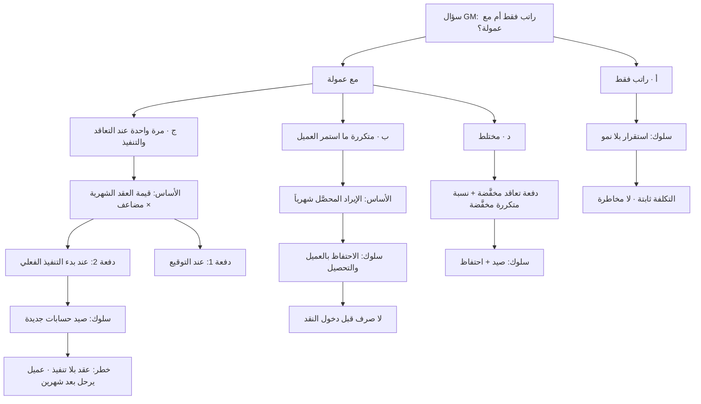
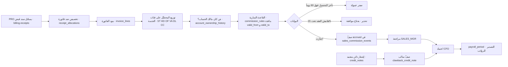
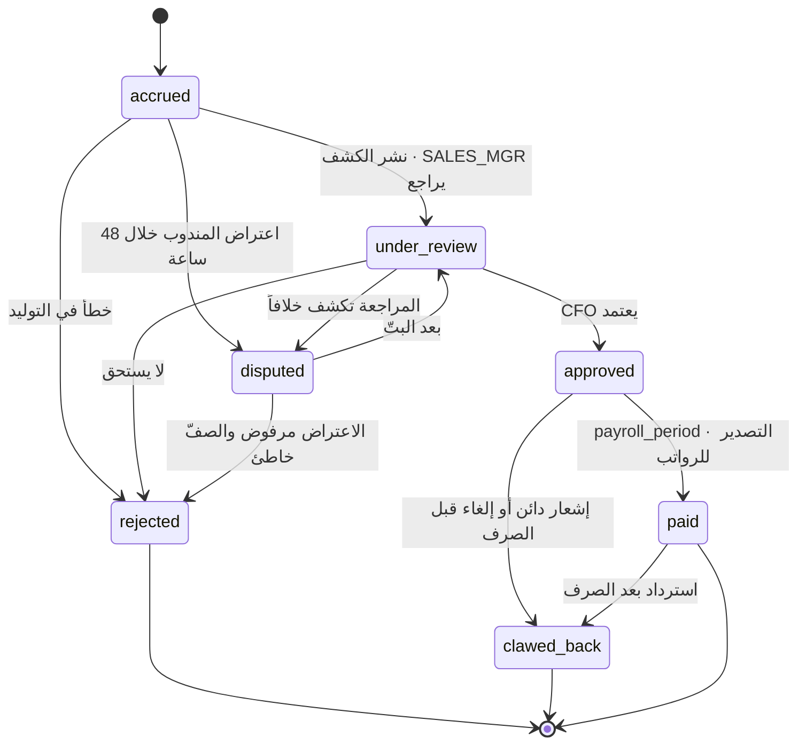
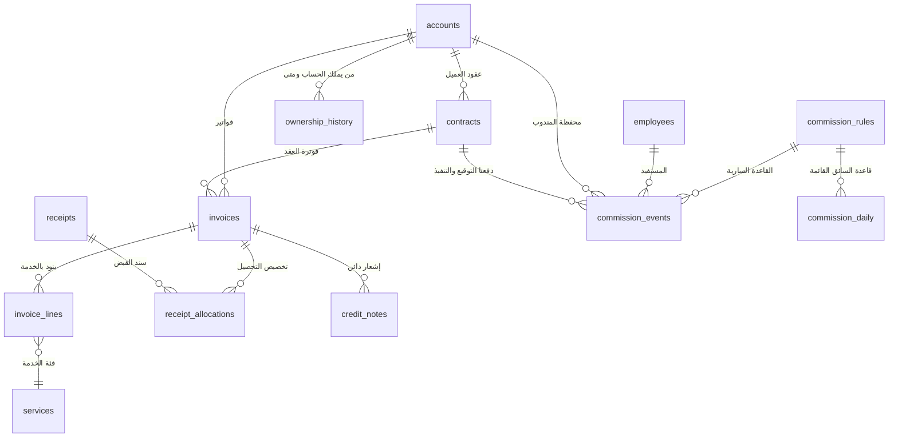
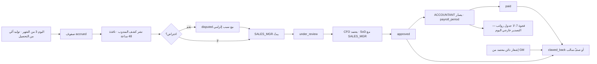

# راتب وعمولة المبيعات — النموذج والخيارات

**PG-EOS v4 · D-blueprints · 21/09/2026 · حالة: مواصفة + DDL مختبَر (SCR مقترح — `SCR-SC-01`) · القرارات للمدير العام**

> **المصادر:** `EXECUTION-MASTER-v4` §1.1 · §1.2 · §1.11 · B-reference **06** (المبيعات والشرائح · دورة الإيراد) · **02** (الأدوار `SALES_MGR`/`SALES_REP`) · **25** (التقارير والتنبيهات) · A-governing **22** (فصل المهام) · **40** §C2 · D-blueprints **02** §4.3–§4.6 (دورة الإيراد والتحصيل والإشعار الدائن) · **06** §4.5 (عمولة السائق كنموذج) · **09** (سجل الفجوات #7).

> **قاعدة هذه الوثيقة:** كل جدول وعمود وحالة وعتبة مذكور أدناه **متحقَّق منه على قاعدة `pgeos` الحيّة** (١٧٣ جدولاً). وكل ما هو **مقترح** موسوم صراحةً بـ«مقترح» أو بـ`SCR-SC-01` ولم يُنفَّذ على القاعدة. الـDDL في §4-6 اختُبر فعلياً داخل `begin; … rollback;` ونتيجته في §4-7.

---

## 0. الخلاصة

1. طلب المدير العام حرفياً: **«راتب وعمولة المبيعات — خيارات: براتب فقط، أو مع عمولة؛ مع تحديد العمولة على التخزين والخدمات: مستمرة ما استمر العميل، أو مرة واحدة عند التعاقد الفعلي والتنفيذ»**.
2. **الخيارات الأربعة بلغة واضحة:** (أ) **راتب فقط** — لا عمولة · (ب) **راتب + عمولة متكررة** تُصرف شهرياً ما دام العميل يدفع · (ج) **راتب + عمولة مرة واحدة** تُصرف على **دفعتين**: عند توقيع العقد وعند بدء التنفيذ الفعلي · (د) **مختلط** — دفعة تعاقد مخفَّضة + نسبة متكررة مخفَّضة.
3. **ما يوجد في النظام اليوم:** جدول `hr.commission_rules` وجدول `hr.commission_daily` — **مبنيان للسائقين وحدهم** (`applies_to` افتراضه `'driver'`، وصفّ واحد مبذور 0.300 + 0.050). و`sales.accounts.owner_user_id` يحمل مندوب الحساب، و`billing.invoices`/`invoice_lines`/`receipts`/`receipt_allocations` تحمل الإيراد المفوتر والمحصَّل بالخدمة والعميل.
4. **ما لا يوجد — حقيقة يجب ذكرها:** **لا جدول رواتب في المخطط إطلاقاً** (الفجوة الحرجة #7 في سجل الفجوات). فـ**«الراتب فقط» يبقى خارج النظام** حتى يُبنى موديول الرواتب. الذي تصمّمه هذه الوثيقة هو **مكوّن العمولة** وحده، ليُصرف مع الراتب عبر أي مسير خارجي اليوم، أو عبر الموديول عند بنائه.
5. **ما يُضاف (`SCR-SC-01`):** تعميم `hr.commission_rules` بـ**١٦ عموداً** لتقبل `applies_to = 'sales_rep' | 'sales_mgr'` · جدول جديد `hr.sales_commission_events` لاستحقاق كل تحصيل وإشعار دائن وعقد · جدول جديد `sales.account_ownership_history` لنقل الحساب بتاريخ · **١٣ عتبة** في `platform.thresholds` معلَّمة **«ابتدائية — قرار GM»**.
6. **الأساس الموصى به: الإيراد المحصَّل فعلاً** (`billing.receipt_allocations`) لا المفوتر — لأن الشركة تدفع من نقد دخل فعلاً، ولأن الفاتورة قابلة للإلغاء والإشعار الدائن.
7. **الرقم الحاسم للمدير العام (§3-5):** نقطة التعادل بين النموذجين ب وج على مثال عميل 3,000 د.ك شهرياً هي **٢٩ شهراً**. عميل يبقى أطول ⇒ **المرة الواحدة أرخص**. عميل يبقى أقصر ⇒ **المتكررة أرخص** وأقلّ مخاطرة.
8. **DDL مختبَر:** ٢٤ اختباراً على القاعدة الحيّة داخل `begin; … rollback;` — **٢٤/٢٤ ناجحة**، منها **١٢ رفضاً مقصوداً** أثبتت أن الضوابط في القاعدة لا في السياسة، ولم يبقَ أي أثر (§4-7).
9. **القرارات المطلوبة من GM: ثمانية** — مجدولة في §8 مع توصية مسبَّبة لكل قرار.

---

## 1. نماذج التعويض — جدول المقارنة

### 1-1 الخيارات الأربعة

| # | النموذج | كيف يُحسب | متى يُصرف |
|---|---|---|---|
| **أ** | **راتب فقط** | لا عمولة إطلاقاً | مع المسير الشهري |
| **ب** | **راتب + عمولة متكررة** | نسبة من **الإيراد المحصَّل شهرياً** على محفظة المندوب، بنسبة لكل فئة خدمة (تخزين `ST` · خدمات `HD`/`OF`/`VA` · توصيل `DL` · كول سنتر `CC`) | شهرياً بعد التحصيل، **ما استمر العميل** وحتى `duration_months` |
| **ج** | **راتب + عمولة مرة واحدة** | مضاعف من متوسط الفوترة الشهرية للعقد (`one_time_multiplier`) — **تُقسَّم على مرحلتين**: عند **التوقيع** `signed_at` وعند **بدء التنفيذ الفعلي** | دفعتان فقط طوال عمر العميل |
| **د** | **مختلط** | دفعة تعاقد مخفَّضة (مثلاً 0.5×) + نسبة متكررة مخفَّضة (مثلاً نصف نِسب النموذج ب) | دفعتان + شهرياً |

### 1-2 ما يحفّزه كل نموذج وما يخاطر به

| النموذج | ما يحفّزه | المخاطر الرئيسية | العلاج داخل النظام | متى يُستخدم | أثره على التدفق النقدي |
|---|---|---|---|---|---|
| **أ · راتب فقط** | الاستقرار والولاء وخدمة العميل بلا ضغط بيعي | **لا يحفّز النمو إطلاقاً** — المندوب يتقاضى الشيء نفسه سواء أضاف عميلاً أو لا | — (لا شيء يُحسب) | فريق يخدم محفظة قائمة · سوق مغلقة · مرحلة تثبيت | **الأدنى تقلّباً والأعلى تكلفةً ثابتة**: يُدفع حتى في شهر بلا إيراد جديد |
| **ب · متكررة** | **الاحتفاظ بالعميل** لا مجرد اصطياده — المندوب يخسر دخله إذا رحل العميل أو توقّف عن الدفع | تراكم عمولات على عملاء **ورثهم** المندوب ولم يجلبهم · تضخّم التكلفة على محفظة قديمة | `duration_months` يحدّ الاستمرار · `sales.account_ownership_history` يفصل من جلب عمّن ورث · `max_monthly` سقف | **الوضع الطبيعي** لشركة لوجستية عقودها متجددة شهرياً | **الأفضل**: لا يُصرف دينار قبل أن يدخل النقد — العمولة مرتبطة بالتحصيل |
| **ج · مرة واحدة** | **الصيد** — اقتناص عملاء جدد بأسرع ما يمكن | **الأخطر:** حسابات وهمية · عقود بلا تنفيذ · **خسارة العميل بعد شهرين والعمولة مصروفة** · عقد بهامش منخفض لمجرد التوقيع | **تقسيم الدفعة على مرحلتين** (التوقيع · التنفيذ الفعلي) يقتل «العقد الورقي» · `min_margin_pct` يمنع العقد الخاسر · `clawback` على الإشعار الدائن | مرحلة نمو صريحة · دخول سوق جديدة · خدمة جديدة تحتاج دفعاً | **الأسوأ**: يُصرف المبلغ كاملاً في أول شهرين **قبل تحصيل دينار واحد** من العميل |
| **د · مختلط** | يوازن: مكافأة على الصيد + مصلحة مستمرة في البقاء | التعقيد في الشرح للمندوب والتدقيق | كلا الضابطين معاً | فريق يجمع بين فتح حسابات جديدة وإدارة محفظة | متوسط: جزء مقدَّم وجزء مرتبط بالتحصيل |

> **الخطر الذي لا يُعالَج إلا بالتقسيم:** عمولة مرة واحدة **كاملة عند التوقيع** تجعل توقيع العقد هو الهدف، لا تشغيله. لذلك النموذج ج في هذه الوثيقة **لا يُصرف دفعة واحدة أبداً**: `split_on_sign_pct` + `split_on_execute_pct` = **100** بقيد في القاعدة (§4-6)، والدفعة الثانية لا تُولَّد إلا بحدث تنفيذ حقيقي (أول أمر استلام `wms.inbound_orders` + أول فاتورة على العقد).

#### خريطة 14-1: الخيارات الأربعة وما يحفّزه كل منها
تقرأ من سؤال المدير العام إلى النموذج إلى السلوك الذي يُنتجه.



---

## 2. قواعد الحساب — بدقة قابلة للبرمجة

### 2-1 الأساس: المحصَّل لا المفوتر

| الخيار | التعريف الحسابي | الحجّة معه | الحجّة ضده |
|---|---|---|---|
| **`collected` — المحصَّل (موصى به)** | مجموع `billing.receipt_allocations.amount` المخصَّص لفواتير العميل في الشهر، موزَّعاً على فئات الخدمة بنسبة بنود الفاتورة `billing.invoice_lines.line_total` | **الشركة تدفع من نقد دخل فعلاً** · يربط مصلحة المندوب بالتحصيل · الإشعار الدائن والفاتورة الملغاة لا يولّدان عمولة أصلاً | المندوب قد ينتظر شهرين على عميل بطيء الدفع |
| `invoiced` — المفوتر | مجموع `billing.invoice_lines.line_total` للفواتير `approved`/`sent` في الشهر | أسرع للمندوب · يفصل مسؤولية البيع عن مسؤولية التحصيل | **يصرف عمولة على إيراد لم يدخل** · يحتاج استرداداً عند كل إشعار دائن وكل ذمّة معدومة |

> **التوصية:** `revenue_basis = 'collected'`. السبب في سطر واحد: **عمولة على فاتورة غير محصَّلة هي قرض من الشركة للمندوب مضمونه عميل قد لا يدفع.** والعمود موجود في القاعدة ليقلبه `GM` بقرار واحد إن رأى غير ذلك.

### 2-2 الأساس بالفئة — نسبة لكل فئة خدمة

فئات الخدمة **السبع المتحقَّقة على القاعدة** في `catalog.service_categories`:

| الكود | الفئة | عدد الخدمات | طبيعتها | نسبة العمولة الابتدائية | مفتاح العتبة |
|---|---|---|---|---|---|
| `ST` | التخزين | 14 | **متكررة بطبيعتها** — إيجار مساحة شهري | **3%** | `sales.commission.rate_storage_pct` |
| `HD` | المناولة والاستلام | 13 | حدثية متكررة | **5%** | `sales.commission.rate_services_pct` |
| `OF` | تجهيز الطلبات والصرف | 13 | حدثية متكررة | **5%** | `sales.commission.rate_services_pct` |
| `VA` | خدمات القيمة المضافة | 13 | حدثية · هامشها الأعلى | **5%** | `sales.commission.rate_services_pct` |
| `DL` | التوصيل | 18 | حدثية · هامشها الأدنى (تكلفة السائق والوقود) | **2%** | `sales.commission.rate_delivery_pct` |
| `CC` | الكول سنتر والبدالة | 15 | مقاعد شهرية + حدثية | **3%** | `sales.commission.rate_cc_pct` |
| `IT` | التقنية والتكامل | 6 | إعداد لمرة واحدة + اشتراك | **قرار GM — الافتراض `all`** | — |

> **لماذا نِسب مختلفة بالفئة ولا نسبة واحدة:** لأن الهامش يختلف جذرياً. التخزين هامشه مرتفع وثابت وإيراده يتكرر بلا جهد بعد الشهر الأول؛ والتوصيل هامشه ضيق وكل دينار إيراد فيه يحمل تكلفة سائق ووقود ومركبة (`billing.profitability.cost_fuel` · `cost_vehicle` · `cost_labour`). نسبة موحّدة تدفع المندوب لبيع ما لا يربح.

### 2-3 الاستثناءات والضوابط

| # | القاعدة | التعريف الحسابي | المصدر في القاعدة | معلَّمة |
|---|---|---|---|---|
| 1 | **الإيراد المفقود لا عمولة عليه** | أحداث `billing.billable_events.status = 'pending'` أو `'excluded'` غير مفوترة ⇒ **صفر** عمولة. تظهر في تقرير **R-14** | `billing.billable_events` | ✅ موجود |
| 2 | **الإشعار الدائن يولّد استرداداً** | عند `billing.credit_notes.status = 'approved'` ⇒ صفّ `clawback_credit_note` بمبلغ **سالب** = `credit_notes.amount × rate_pct` للفئة المعنية | `billing.credit_notes` | 🟡 مقترح `SCR-SC-01` |
| 3 | **العقد دون الهامش الأدنى** | `billing.profitability.margin_pct < 15%` ⇒ **تحذير** ولا تُعتمد العمولة إلا بموافقة · `< 10%` ⇒ **موافقة GM إلزامية** | `platform.thresholds` · `contract.min_margin_pct = 15` · `contract.gm_margin_pct = 10` | ✅ العتبتان موجودتان |
| 4 | **شرط التحصيل** | لا عمولة على تحصيل تأخّر أكثر من `collection_max_days` من **تاريخ إصدار الفاتورة** — الافتراض **٦٠ يوماً** | `billing.invoices.issue_date` · `billing.receipts.received_at` | 🟡 مقترح |
| 5 | **مدة الاستمرار** | `duration_months` — الافتراض **٢٤ شهراً** من `sales.contracts.start_date`؛ و`null` = بلا نهاية | `sales.contracts.start_date` | 🟡 مقترح |
| 6 | **نافذة الصرف الشهرية** | الاستحقاق يُولَّد في **اليوم الثالث من الشهر التالي** لشهر التحصيل؛ وشهر الاستحقاق `period` **أول يوم من الشهر** بقيد `chk_sce_period_first_day` | إقفال الشهر (D-02 §4.12) | 🟡 مقترح |
| 7 | **سقف شهري اختياري** | `max_monthly` — إن تجاوز مجموع استحقاق المندوب في الشهر السقف، يُرحَّل الفائض إلى الشهر التالي كصفّ `adjustment`. الافتراض **٠ = بلا سقف** | — | 🟡 مقترح |
| 8 | **تقسيم العمولة عند نقل الحساب** | `sales.account_ownership_history` يحمل `valid_from`/`valid_to`؛ والحصة `share_pct` تُحسب **بعدد أيام الملكية في الشهر ÷ أيام الشهر**، ومجموع الحصص لكل مصدر = **100** | 🟡 مقترح | — |
| 9 | **الدور الإشرافي** | `SALES_MGR` يستحق `manager_override_pct` من الإيراد المحصَّل **لكل الفريق** — الافتراض **0.5%** · قاعدة منفصلة `applies_to = 'sales_mgr'` | 🟡 مقترح | — |
| 10 | **نافذة الاعتراض** | **٤٨ ساعة** من نشر كشف العمولة — نفس نافذة السائق (D-06 §4.5 · EXEC §1.2) | `sales.commission.dispute_window_hours` | 🟡 مقترح — سياسة |

> **تنبيه على تشابه رقمين (نفس تنبيه B-06 §9):** **خصم شريحة `SEG-A` = 15%** خصم على السعر؛ و**حدّ الهامش الأدنى = 15%** هامش على التكلفة. ليسا الشيء نفسه، ولا يجوز أن يظهرا في شاشة واحدة بلا تسمية صريحة.

### 2-4 قاعدة نقل الحساب — التعريف الحسابي الكامل

حين يُنقل الحساب من المندوب أ إلى ب في اليوم `d` من شهر فيه `n` يوماً:

```
share_pct(أ) = round( (d - 1) / n × 100, 3 )
share_pct(ب) = 100 - share_pct(أ)
amount(س)    = round( base_amount × rate_pct / 100 × share_pct(س) / 100, 3 )
```

والقيد `chk_sce_share_pct` يمنع أي حصة > 100 أو ≤ 0، والفهرس الفريد يسمح بصفّين لنفس المصدر ما دام المندوبان مختلفين. **اختُبر فعلياً (T19): 60/40 على 2,400 د.ك بنسبة 3% ⇒ 43.200 + 28.800 = 72.000 بالضبط.**

#### خريطة 14-2: من التحصيل إلى الاستحقاق إلى الصرف
تقرأ من سند القبض إلى صفّ الاستحقاق إلى مسير الرواتب.



---

## 3. أمثلة رقمية محسوبة

### 3-1 معطيات المثال

| البند | القيمة |
|---|---|
| العميل | حساب واحد — تخزين + خدمات تجهيز |
| إيراد التخزين `ST` | **2,400.000 د.ك / شهر** |
| إيراد الخدمات `OF` | **600.000 د.ك / شهر** |
| إجمالي شهري | **3,000.000 د.ك** |
| توقيع العقد `signed_at` | **05/01/2026** |
| بدء التنفيذ الفعلي `start_date` | **01/02/2026** |
| دورة الفوترة | شهرية بأثر رجعي — فاتورة شهر ما تصدر أول الشهر التالي |
| مهلة السداد | **٣٠ يوماً** (`sales.accounts.payment_terms_days`) |
| هامش العقد | **22.5%** — فوق حد الـ15% ⇒ لا تحذير |

**النسب المطبَّقة:** متكررة **3% تخزين · 5% خدمات** · مرة واحدة **1× الفوترة الشهرية** مقسَّمة **50/50** · مختلط **0.5× مرة واحدة + نصف النسب المتكررة (1.5% · 2.5%)**.

### 3-2 النموذج ب — المتكررة، شهراً بشهر على ١٢ شهراً

يتضمّن الجدول **حالة إشعار دائن** (يوليو) و**حالة تأخر تحصيل** (سبتمبر).

| # | شهر العمولة | يحمل تحصيل خدمة شهر | المحصَّل (د.ك) | أيام التحصيل من الإصدار | عمولة `ST` 3% | عمولة `OF` 5% | استرداد | **صافي الشهر** |
|---|---|---|---|---|---|---|---|---|
| 1 | 01/2026 | — (شهر التوقيع، لا خدمة) | 0 | — | 0 | 0 | — | **0.000** |
| 2 | 02/2026 | — (شهر بدء التنفيذ، الفاتورة لم تصدر) | 0 | — | 0 | 0 | — | **0.000** |
| 3 | 03/2026 | 02/2026 | 3,000.000 | 27 ✅ | 72.000 | 30.000 | — | **102.000** |
| 4 | 04/2026 | 03/2026 | 3,000.000 | 25 ✅ | 72.000 | 30.000 | — | **102.000** |
| 5 | 05/2026 | 04/2026 | 3,000.000 | 28 ✅ | 72.000 | 30.000 | — | **102.000** |
| 6 | 06/2026 | 05/2026 | 3,000.000 | 26 ✅ | 72.000 | 30.000 | — | **102.000** |
| 7 | 07/2026 | 06/2026 | 3,000.000 | 29 ✅ | 72.000 | 30.000 | **−15.000** | **87.000** |
| 8 | 08/2026 | 07/2026 | 3,000.000 | 24 ✅ | 72.000 | 30.000 | — | **102.000** |
| 9 | 09/2026 | 08/2026 | **0 — لم يُحصَّل** | — | 0 | 0 | — | **0.000** |
| 10 | 10/2026 | 09/2026 | 3,000.000 | 27 ✅ | 72.000 | 30.000 | — | **102.000** |
| 11 | 11/2026 | 10/2026 | 3,000.000 | 26 ✅ | 72.000 | 30.000 | — | **102.000** |
| 12 | 12/2026 | 11/2026 | 3,000.000 | 28 ✅ | 72.000 | 30.000 | — | **102.000** |
| — | 12/2026 | **08/2026 متأخر** | 3,000.000 | **110 ❌ > 60** | **0** | **0** | — | **0.000** |
| | | **الإجمالي** | **30,000.000** | | **648.000** | **270.000** | **−15.000** | **903.000** |

> **صافي الإيراد المحصَّل بعد الإشعار الدائن = 30,000.000 − 300.000 = 29,700.000 د.ك.** وعليه **العمولة = 903.000 = 3.0% من الإيراد المحصَّل**.

**تفصيل الحالتين الاستثنائيتين:**

| الحالة | الشرح | الحساب | الأثر |
|---|---|---|---|
| **إشعار دائن — يوليو** | فوترة زائدة 300.000 د.ك على خدمات التجهيز في فاتورة مايو · `billing.credit_notes` بحالة `approved` باعتماد **GM** (D-02 §4.6 — لا أتمتة إطلاقاً) | 300.000 × **5%** = **15.000** | صفّ `clawback_credit_note` بمبلغ **−15.000** في شهر اعتماد الإشعار، لا في شهر الفاتورة الأصلية |
| **تأخر تحصيل — أغسطس** | فاتورة أغسطس صدرت 01/09، استُحقّت 01/10، وحُصّلت 20/12 = **110 يوماً** من الإصدار | 110 > `collection_max_days = 60` | **صفر عمولة** على التحصيل كله — الإيراد يدخل الشركة والمندوب لا يستحقّ عليه شيئاً |

> **ما يعنيه هذا للمندوب:** بابه الوحيد لاستعادة عمولة أغسطس هو أن يدفع العميل خلال ٦٠ يوماً. هذا هو الربط العملي بين المبيعات والتحصيل الذي لا يحقّقه أي نموذج آخر.

### 3-3 النموذج ج — المرة الواحدة على مرحلتين

| # | الشهر | الحدث | الأساس | الحساب | **المبلغ** |
|---|---|---|---|---|---|
| 1 | 01/2026 | **توقيع العقد** — `sales.contracts.signed_at = 05/01` وحالته `signed` | متوسط الفوترة الشهرية = **3,000.000** | 3,000 × **1.000** × **50%** | **1,500.000** |
| 2 | 02/2026 | **بدء التنفيذ الفعلي** — أول أمر استلام في `wms.inbound_orders` + أول فاتورة على العقد | نفس الأساس | 3,000 × **1.000** × **50%** | **1,500.000** |
| — | 03/2026 … 12/2026 | لا شيء | — | — | **0.000** |
| | | **الإجمالي على ١٢ شهراً** | | | **3,000.000** |

> **الملاحظة الحاسمة:** في هذا النموذج **صُرفت 3,000 د.ك في أول شهرين، وقبل أن يُحصَّل من العميل دينار واحد** (أول تحصيل في 28/03). إن ترك العميل بعد ثلاثة أشهر، تكون الشركة قد دفعت 3,000 د.ك عمولة على إيراد محصَّل قدره 6,000 د.ك — أي **50% من الإيراد**.

### 3-4 النموذج د — المختلط

| البند | الحساب | المبلغ |
|---|---|---|
| دفعة التوقيع (0.5× مقسّمة 50/50) | 3,000 × 0.500 × 50% | **750.000** |
| دفعة بدء التنفيذ | 3,000 × 0.500 × 50% | **750.000** |
| المتكررة بنصف النسب (1.5% `ST` · 2.5% `OF`) على نفس الجدول أعلاه | 903.000 ÷ 2 | **451.500** |
| | **الإجمالي على ١٢ شهراً** | **1,951.500** |

### 3-5 المقارنة الحاسمة — التكلفة كنسبة من الإيراد المحصَّل

| السيناريو | الإيراد المحصَّل | أ · راتب فقط | ب · متكررة | ج · مرة واحدة | د · مختلط |
|---|---|---|---|---|---|
| **العميل يبقى ٦ أشهر ثم يرحل** | 17,700.000 | **0** · 0% | **597.000** · **3.4%** | **3,000.000** · **16.9%** | **1,798.500** · 10.2% |
| **العميل يبقى ١٢ شهراً** (جدول §3-2) | 29,700.000 | **0** · 0% | **903.000** · **3.0%** | **3,000.000** · **10.1%** | **1,951.500** · 6.6% |
| **العميل يبقى ٢٤ شهراً** (بلا استثناءات) | 72,000.000 | **0** · 0% | **2,448.000** · **3.4%** | **3,000.000** · **4.2%** | **2,724.000** · 3.8% |
| **العميل يبقى ٣٦ شهراً** (و`duration_months = 24` يوقف المتكررة) | 108,000.000 | **0** · 0% | **2,448.000** · **2.3%** | **3,000.000** · **2.8%** | **2,724.000** · 2.5% |

> **نقطة التعادل: ٢٩ شهراً.** `3,000 ÷ 102 = 29.41`. أي: **إذا كان متوسط عمر العميل في محفظتك أطول من ٢٩ شهراً فالمرة الواحدة أرخص؛ وإذا كان أقصر فالمتكررة أرخص وأقلّ مخاطرة بكثير.** وهذا يجعل مؤشر **متوسط عمر العميل** (§7) هو المؤشر الذي يقرّر النموذج — لا الذوق الإداري. وبما أن النظام جديد ولا تاريخ محفوظاً لعمر العملاء، **التوصية هي البدء بالنموذج ب ثم مراجعة القرار بعد ١٢ شهراً ببيانات حقيقية**.

---

## 4. النموذج في المخطط — أقل إضافة ممكنة

### 4-1 مبدأ التصميم

| المبدأ | التطبيق |
|---|---|
| **لا جدول جديد إن كفى عمود** | `hr.commission_rules` **يُعمَّم** ولا يُستنسخ — قاعدة السائق وقاعدة المندوب في جدول واحد يفصلهما `applies_to` وقيدان متقابلان |
| **نفس نمط `billing.billable_events`** | المرجع متعدد الأشكال `source_table` + `source_id` بدل مفاتيح أجنبية متعددة |
| **لقطة مجمَّدة دليلاً في أي نزاع** | `rule_snapshot` و`calc_snapshot` **كلاهما `NOT NULL`** — نفس مبدأ `hr.commission_daily.source_snapshot` |
| **الضابط في القاعدة لا في السياسة** | كل قاعدة في §2 لها قيد `check` أو فهرس فريد أو مشغّل — لا شيء متروكاً لطبقة التطبيق |
| **ما لا يُعرف اليوم عتبة لا ثابت** | ١٣ قيمة في `platform.thresholds` يغيّرها `GM` بلا نشر برمجي |

### 4-2 تعميم `hr.commission_rules` — الأعمدة الستة عشر المضافة

| العمود | النوع | المعنى | القيد |
|---|---|---|---|
| `basis` | `text` = `'per_unit'` | `per_unit` سائق · `recurring` متكررة · `one_time` مرة واحدة · `hybrid` مختلط | `chk_commission_rules_basis` |
| `revenue_basis` | `text` = `'collected'` | `collected` المحصَّل · `invoiced` المفوتر | `chk_commission_rules_revenue_basis` |
| `service_category` | `text` = `'all'` | `ST` · `HD` · `OF` · `VA` · `DL` · `CC` · `IT` · `all` | `chk_commission_rules_category` |
| `rate_pct` | `numeric(6,3)` | النسبة المئوية لقواعد المبيعات | `chk_commission_rules_rate_pct_range` 0…100 |
| `one_time_multiplier` | `numeric(6,3)` | مضاعف الفوترة الشهرية لعمولة المرة الواحدة | `chk_commission_rules_one_time_mult` |
| `split_on_sign_pct` | `numeric(6,3)` | حصة دفعة التوقيع | `chk_commission_rules_split_sum` = 100 مع التالي |
| `split_on_execute_pct` | `numeric(6,3)` | حصة دفعة بدء التنفيذ | — |
| `duration_months` | `integer` | مدة استمرار العمولة المتكررة · `null` = بلا نهاية | `chk_commission_rules_duration` > 0 |
| `max_monthly` | `numeric(14,3)` | سقف شهري للمندوب · `null` = بلا سقف | — |
| `min_margin_pct` | `numeric(6,3)` | الهامش الأدنى لاستحقاق العمولة | — |
| `clawback_on_credit_note` | `boolean` = `true` | هل يولّد الإشعار الدائن استرداداً | — |
| `collection_max_days` | `integer` | أقصى تأخر تحصيل يستحقّ عليه عمولة | — |
| `manager_override_pct` | `numeric(6,3)` | النسبة الإشرافية لمدير المبيعات | — |
| `approved_by` · `approved_at` | `uuid` · `timestamptz` | **من اعتمد القاعدة ومتى** — القاعدة تمسّ المال فلا تُفعَّل بلا اعتماد | — |
| *(تعديل)* `rate_per_unit` | صار **nullable** | لأن قاعدة المبيعات لا تستخدمه | `chk_commission_rules_driver_shape` يبقيه إلزامياً للسائق |

### 4-3 جدول `hr.sales_commission_events` — سجل الاستحقاق

الحبّة: **صفّ لكل (مصدر × مندوب × نوع حدث × فئة خدمة)**. فتحصيل واحد على فاتورة فيها تخزين وخدمات يولّد **صفّين** — وهو ما يجعل كل دينار عمولة قابلاً لتتبّعه إلى بند فاتورة بعينه.

| المجموعة | الأعمدة |
|---|---|
| الهوية والنطاق | `id` · `entity_id` · `period` (أول الشهر) · `currency` |
| المستفيد | `employee_id` · `user_id` · `role_kind` |
| السياق التجاري | `client_id` · `contract_id` · `rule_id` · `service_category` |
| المصدر | `event_kind` · `source_table` · `source_id` |
| الحساب | `base_amount` · `rate_pct` · `share_pct` · `amount` · `margin_pct_at_calc` |
| الدليل | `rule_snapshot` **NOT NULL** · `calc_snapshot` **NOT NULL** |
| الدورة | `status` · `dispute_note` · `disputed_at` · `reviewed_by`/`reviewed_at` · `approved_by`/`approved_at` · `payroll_period` · `paid_at` |

### 4-4 آلة حالات الاستحقاق

#### خريطة 14-3: آلة حالات صفّ عمولة المبيعات
تقرأ من توليد الاستحقاق إلى الصرف أو الاسترداد.



| الحالة | من ينقلها | الحدث | الشاشة |
|---|---|---|---|
| `accrued` | **النظام** (وظيفة شهرية) | تحصيل مخصَّص · عقد موقَّع · بدء تنفيذ · إشعار دائن معتمد | — |
| `under_review` | `SALES_MGR` | نشر كشف الشهر | لوحة المدير |
| `disputed` | `SALES_REP` | اعتراض خلال **٤٨ ساعة** مع `dispute_note` **إلزامي** | لوحة المندوب |
| `approved` | **`CFO`** | اعتماد الكشف بعد المراجعة | لوحة المالية |
| `paid` | `ACCOUNTANT` | التصدير لمسير الرواتب مع `payroll_period` **إلزامي** | شاشة الرواتب (مقترحة) |
| `clawed_back` | `CFO` | إشعار دائن أو ذمّة معدومة بعد الصرف | لوحة المالية |
| `rejected` | `SALES_MGR` أو `CFO` | صفّ خاطئ أو لا يستحق | لوحة المدير |

> **الحارس `trg_guard_sales_commission_status`** يفرض هذه الانتقالات في القاعدة. **اختُبر (T14 · T15): القفز من `accrued` إلى `approved` أو إلى `paid` مباشرةً مرفوض برسالة عربية صريحة.**

### 4-5 القواعد المفروضة برمجياً

| القيد / المشغّل / الفهرس | ما يمنعه | المصدر |
|---|---|---|
| `chk_commission_rules_driver_shape` | قاعدة سائق بلا `rate_per_unit` — **يحمي القاعدة المبذورة 0.300** | EXEC §1.2 FIXED |
| `chk_commission_rules_sales_shape` | قاعدة مبيعات بلا `rate_pct` — **لا نسبة صفرية ضمنية** | `SCR-SC-01` |
| `chk_commission_rules_split_sum` | عمولة مرة واحدة لا يساوي مجموع شريحتيها 100 — **لا دفعة ضائعة ولا مزدوجة** | `SCR-SC-01` §1-2 |
| `chk_commission_rules_rate_pct_range` | نسبة سالبة أو فوق 100 | `SCR-SC-01` |
| `chk_commission_rules_valid_window` | نافذة صلاحية مقلوبة | `SCR-SC-01` |
| `sales_commission_events_source_uniq` | **الاحتساب المزدوج** — استحقاقان على نفس المصدر لنفس المندوب ونفس الفئة | نمط `billable_events_source_table_source_id_service_id_idx` |
| `chk_sce_clawback_sign` | استرداد بمبلغ **موجب** — الاسترداد سالب دائماً | `SCR-SC-01` |
| `chk_sce_approved_has_approver` | اعتماد بلا `approved_by` و`approved_at` | 22 §2-2 |
| `chk_sce_paid_has_period` | صرف بلا `payroll_period` | `SCR-SC-01` |
| `chk_sce_dispute_has_note` | اعتراض بلا سبب مكتوب | نمط `deduction_needs_reason` |
| `chk_sce_period_first_day` | شهر استحقاق ليس أول الشهر — **يمنع تفتيت الشهر** | `SCR-SC-01` |
| `chk_sce_share_pct` | حصة > 100% أو ≤ 0 | `SCR-SC-01` §2-4 |
| `trg_guard_sales_commission_status` | كل انتقال حالة غير المسموح في §4-4 | `SCR-SC-01` |
| `account_ownership_current_uniq` (جزئي) | **مالكان حاليان للحساب نفسه** | `SCR-SC-01` |
| `chk_aoh_transfer_has_reason` | إغلاق ملكية بلا سبب نقل مكتوب | 22 §2-2 |
| `chk_aoh_window` | نافذة ملكية مقلوبة | `SCR-SC-01` |
| `own_sales_commission` (RLS) | مندوب يرى عمولة زميله | نمط `hr.commission_daily.own_commission` |
| `entity_scope` (RLS) | تجاوز نطاق الكيان | 40 §B1 |

#### خريطة 14-4: الجداول والعلاقات
تقرأ من الحساب والعقد إلى الفاتورة والتحصيل إلى صفّ العمولة.



### 4-6 الـDDL الكامل — قابل للتشغيل

> **حالة التنفيذ: لم يُنفَّذ على القاعدة.** يُدرَج في `13B-Schema-Reference-Consolidation.sql` عند اعتماد `SCR-SC-01` من `GM` (قاعدة تغيير المخطط — EXEC §1.11). الكتلة أدناه هي **ما اختُبر فعلياً** ونتيجته في §4-7.

```sql
-- ═══════════════════════════════════════════════════════════════════
-- SCR-SC-01 · عمولة المبيعات — تعميم قواعد العمولة + سجل الاستحقاق
-- ═══════════════════════════════════════════════════════════════════

-- 1) تعميم hr.commission_rules ليقبل قواعد المبيعات
alter table hr.commission_rules
  alter column rate_per_unit drop not null,
  add column basis                   text not null default 'per_unit',
  add column revenue_basis           text not null default 'collected',
  add column service_category        text not null default 'all',
  add column rate_pct                numeric(6,3),
  add column one_time_multiplier     numeric(6,3),
  add column split_on_sign_pct       numeric(6,3),
  add column split_on_execute_pct    numeric(6,3),
  add column duration_months         integer,
  add column max_monthly             numeric(14,3),
  add column min_margin_pct          numeric(6,3),
  add column clawback_on_credit_note boolean not null default true,
  add column collection_max_days     integer,
  add column manager_override_pct    numeric(6,3),
  add column approved_by             uuid,
  add column approved_at             timestamptz;

alter table hr.commission_rules
  add constraint chk_commission_rules_applies_to
    check (applies_to in ('driver','sales_rep','sales_mgr')),
  add constraint chk_commission_rules_basis
    check (basis in ('per_unit','recurring','one_time','hybrid')),
  add constraint chk_commission_rules_revenue_basis
    check (revenue_basis in ('collected','invoiced')),
  add constraint chk_commission_rules_category
    check (service_category in ('ST','HD','OF','VA','DL','CC','IT','all')),
  -- قاعدة السائق تبقى كما هي: سعر بالوحدة إلزامي
  add constraint chk_commission_rules_driver_shape
    check (applies_to <> 'driver' or (basis = 'per_unit' and rate_per_unit is not null)),
  -- قاعدة المبيعات: نسبة مئوية إلزامية
  add constraint chk_commission_rules_sales_shape
    check (applies_to = 'driver' or (basis <> 'per_unit' and rate_pct is not null)),
  -- المرة الواحدة: مجموع الشريحتين = 100
  add constraint chk_commission_rules_split_sum
    check (basis not in ('one_time','hybrid')
           or (coalesce(split_on_sign_pct,0) + coalesce(split_on_execute_pct,0) = 100)),
  add constraint chk_commission_rules_one_time_mult
    check (basis not in ('one_time','hybrid') or one_time_multiplier is not null),
  add constraint chk_commission_rules_duration
    check (duration_months is null or duration_months > 0),
  add constraint chk_commission_rules_rate_pct_range
    check (rate_pct is null or (rate_pct >= 0 and rate_pct <= 100)),
  add constraint chk_commission_rules_valid_window
    check (valid_to is null or valid_to > valid_from);

comment on column hr.commission_rules.basis is
  'per_unit سائق · recurring متكررة ما استمر العميل · one_time مرة واحدة عند التعاقد والتنفيذ · hybrid مختلط — SCR-SC-01';
comment on column hr.commission_rules.revenue_basis is
  'collected المحصَّل فعلاً وهو الافتراضي · invoiced المفوتر — قرار GM · SCR-SC-01';

-- 2) سجل استحقاق عمولة المبيعات
create table hr.sales_commission_events (
  id                 uuid primary key default gen_random_uuid(),
  entity_id          uuid not null references platform.entities(id),
  period             date not null,                        -- أول يوم من شهر الاستحقاق
  employee_id        uuid not null references hr.employees(id),
  user_id            uuid references identity.users(id),
  role_kind          text not null default 'sales_rep',
  client_id          uuid not null references sales.accounts(id),
  contract_id        uuid references sales.contracts(id),
  rule_id            uuid not null references hr.commission_rules(id),
  event_kind         text not null,
  service_category   text,
  source_table       text not null,                        -- نفس نمط billing.billable_events
  source_id          uuid not null,
  base_amount        numeric(14,3) not null,
  rate_pct           numeric(6,3),
  amount             numeric(14,3) not null,               -- موجب استحقاق · سالب استرداد
  currency           char(3) not null default 'KWD',
  margin_pct_at_calc numeric(8,4),
  share_pct          numeric(6,3) not null default 100,    -- حصة المندوب عند نقل الحساب
  status             text not null default 'accrued',
  rule_snapshot      jsonb not null,
  calc_snapshot      jsonb not null,
  dispute_note       text,
  disputed_at        timestamptz,
  reviewed_by        uuid,
  reviewed_at        timestamptz,
  approved_by        uuid,
  approved_at        timestamptz,
  payroll_period     date,
  paid_at            timestamptz,
  created_at         timestamptz not null default now(),
  constraint chk_sce_status
    check (status in ('accrued','under_review','disputed','approved','paid','clawed_back','rejected')),
  constraint chk_sce_event_kind
    check (event_kind in ('recurring_collection','one_time_sign','one_time_execute',
                          'clawback_credit_note','manager_override','adjustment')),
  constraint chk_sce_clawback_sign
    check ((event_kind = 'clawback_credit_note' and amount <= 0)
        or (event_kind <> 'clawback_credit_note' and event_kind <> 'adjustment' and amount >= 0)
        or  event_kind = 'adjustment'),
  constraint chk_sce_approved_has_approver
    check (status not in ('approved','paid') or (approved_by is not null and approved_at is not null)),
  constraint chk_sce_paid_has_period
    check (status <> 'paid' or payroll_period is not null),
  constraint chk_sce_dispute_has_note
    check (status <> 'disputed' or dispute_note is not null),
  constraint chk_sce_period_first_day
    check (period = date_trunc('month', period)::date),
  constraint chk_sce_share_pct
    check (share_pct > 0 and share_pct <= 100)
);

-- لا استحقاق مزدوج على المصدر نفسه لنفس المندوب ونفس نوع الحدث ونفس فئة الخدمة
create unique index sales_commission_events_source_uniq
  on hr.sales_commission_events
     (source_table, source_id, employee_id, event_kind, coalesce(service_category,'-'));
create index sales_commission_events_emp_period_idx
  on hr.sales_commission_events (employee_id, period desc);
create index sales_commission_events_period_status_idx
  on hr.sales_commission_events (period, status);
create index sales_commission_events_client_idx
  on hr.sales_commission_events (client_id, period desc);

comment on table hr.sales_commission_events is
  'استحقاق عمولة المبيعات لكل تحصيل أو إشعار دائن أو عقد — SCR-SC-01';

alter table hr.sales_commission_events enable row level security;
create policy entity_scope on hr.sales_commission_events
  using (entity_id = any (platform.allowed_entities()));
create policy own_sales_commission on hr.sales_commission_events for select
  using (platform.has_perm('hr.commission.read_all')
      or employee_id = (select u.employee_id from identity.users u
                         where u.id = platform.current_user_id()));

-- 3) تاريخ ملكية الحساب — نقل الحساب بين المندوبين
create table sales.account_ownership_history (
  id                   uuid primary key default gen_random_uuid(),
  entity_id            uuid not null references platform.entities(id),
  account_id           uuid not null references sales.accounts(id),
  owner_user_id        uuid not null references identity.users(id),
  employee_id          uuid references hr.employees(id),
  role_kind            text not null default 'sales_rep',
  valid_from           date not null,
  valid_to             date,                              -- null = المالك الحالي
  commission_share_pct numeric(6,3) not null default 100,
  transfer_reason      text,
  changed_by           uuid,
  created_at           timestamptz not null default now(),
  constraint chk_aoh_role_kind check (role_kind in ('sales_rep','sales_mgr')),
  constraint chk_aoh_window    check (valid_to is null or valid_to > valid_from),
  constraint chk_aoh_share     check (commission_share_pct > 0 and commission_share_pct <= 100),
  constraint chk_aoh_transfer_has_reason
    check (valid_to is null or transfer_reason is not null)
);

create unique index account_ownership_current_uniq
  on sales.account_ownership_history (account_id, role_kind)
  where valid_to is null;
create index account_ownership_owner_idx
  on sales.account_ownership_history (owner_user_id, valid_from desc);

comment on table sales.account_ownership_history is
  'سجل ملكية حساب العميل بتاريخ — أساس تقسيم العمولة عند نقل الحساب — SCR-SC-01';

alter table sales.account_ownership_history enable row level security;
create policy entity_scope on sales.account_ownership_history
  using (entity_id = any (platform.allowed_entities()));

-- 4) حارس انتقالات الحالة
create or replace function hr.guard_sales_commission_status() returns trigger
language plpgsql as $$
begin
  if tg_op = 'UPDATE' and new.status is distinct from old.status then
    if not (
         (old.status = 'accrued'      and new.status in ('under_review','disputed','rejected'))
      or (old.status = 'under_review' and new.status in ('approved','disputed','rejected'))
      or (old.status = 'disputed'     and new.status in ('under_review','rejected'))
      or (old.status = 'approved'     and new.status in ('paid','clawed_back'))
      or (old.status = 'paid'         and new.status = 'clawed_back')
    ) then
      raise exception 'انتقال حالة عمولة غير مسموح: % ⇒ % — SCR-SC-01', old.status, new.status;
    end if;
  end if;
  return new;
end $$;

create trigger trg_guard_sales_commission_status
  before update on hr.sales_commission_events
  for each row execute function hr.guard_sales_commission_status();

-- 5) العتبات الابتدائية — كلها معلَّمة «قرار GM»
insert into platform.thresholds (key, value, unit, description_ar, changed_by) values
 ('sales.commission.rate_storage_pct',     3.000,  'pct',    'نسبة عمولة التخزين ST — SCR-SC-01 (ابتدائية — قرار GM)',         '<gm_user_id>'),
 ('sales.commission.rate_services_pct',    5.000,  'pct',    'نسبة عمولة الخدمات HD/OF/VA — SCR-SC-01 (ابتدائية — قرار GM)',  '<gm_user_id>'),
 ('sales.commission.rate_delivery_pct',    2.000,  'pct',    'نسبة عمولة التوصيل DL — SCR-SC-01 (ابتدائية — قرار GM)',         '<gm_user_id>'),
 ('sales.commission.rate_cc_pct',          3.000,  'pct',    'نسبة عمولة الكول سنتر CC — SCR-SC-01 (ابتدائية — قرار GM)',      '<gm_user_id>'),
 ('sales.commission.one_time_multiplier',  1.000,  'ratio',  'مضاعف عمولة المرة الواحدة من متوسط الفوترة الشهرية — SCR-SC-01', '<gm_user_id>'),
 ('sales.commission.split_on_sign_pct',   50.000,  'pct',    'حصة دفعة التوقيع من عمولة المرة الواحدة — SCR-SC-01',            '<gm_user_id>'),
 ('sales.commission.split_on_execute_pct',50.000,  'pct',    'حصة دفعة بدء التنفيذ الفعلي — SCR-SC-01',                        '<gm_user_id>'),
 ('sales.commission.duration_months',     24.000,  'months', 'مدة استمرار العمولة المتكررة — 0 = بلا نهاية — SCR-SC-01',       '<gm_user_id>'),
 ('sales.commission.max_monthly_kwd',      0.000,  'KWD',    'سقف العمولة الشهرية للمندوب — 0 = بلا سقف — SCR-SC-01',          '<gm_user_id>'),
 ('sales.commission.collection_max_days', 60.000,  'days',   'لا عمولة على تحصيل تأخّر أكثر من هذه المدة — SCR-SC-01',          '<gm_user_id>'),
 ('sales.commission.manager_override_pct', 0.500,  'pct',    'النسبة الإشرافية لمدير المبيعات — SCR-SC-01 (ابتدائية — قرار GM)','<gm_user_id>'),
 ('sales.commission.min_margin_pct',      15.000,  'pct',    'لا عمولة على عقد تحت هذا الهامش إلا بموافقة GM — EXEC §1.1',     '<gm_user_id>'),
 ('sales.commission.dispute_window_hours',48.000,  'hours',  'نافذة اعتراض المندوب على كشف العمولة — SCR-SC-01',               '<gm_user_id>');

-- 6) عدّاد مستند كشف العمولة لكل كيان
insert into platform.counters (entity_id, doc_type, period, prefix, padding)
select id, 'SCM', 'ALL', code || '-SCM-', 5 from platform.entities;
```

**بذرة القواعد الافتراضية — معلَّمة قرار GM (لا تُدرَج قبل اعتماد §8):**

```sql
-- ⚠️ لا تُنفَّذ قبل قرار GM على النموذج والنِسب (§8 القراران D-1 و D-2)
insert into hr.commission_rules
 (entity_id, name, applies_to, basis, revenue_basis, service_category, rate_pct,
  duration_months, min_margin_pct, collection_max_days, valid_from, created_by, approved_by, approved_at)
select e.id, 'عمولة مبيعات — تخزين متكررة', 'sales_rep', 'recurring', 'collected', 'ST',
       (select value from platform.thresholds where key='sales.commission.rate_storage_pct'),
       (select value::int from platform.thresholds where key='sales.commission.duration_months'),
       (select value from platform.thresholds where key='sales.commission.min_margin_pct'),
       (select value::int from platform.thresholds where key='sales.commission.collection_max_days'),
       current_date, '<gm_user_id>', '<gm_user_id>', now()
  from platform.entities e where e.code in ('PST','POR','PDL','PCC');
-- ويُكرَّر الصفّ للفئات HD · OF · VA بنسبة الخدمات · و DL بنسبة التوصيل · و CC بنسبتها
```

### 4-7 نتيجة الاختبار الفعلي على القاعدة

نُفِّذ الـDDL كاملاً على قاعدة `pgeos` الحيّة داخل `begin; … rollback;` في **21/09/2026** مع بيانات تجريبية و**أربعة وعشرين اختباراً**. **النتيجة: ٢٤/٢٤ ناجحة — منها ١٢ رفضاً مقصوداً** — والمعاملة رُوجعت ولم يبقَ أي أثر (متحقَّق بعدها: `0` جدول `sales_commission_events`، `0` جدول `account_ownership_history`، `0` عتبة `sales.commission.%`، `0` عمود `rate_pct`، و`hr.commission_rules` عادت إلى صفّها الواحد).

| # | الاختبار | المتوقَّع | النتيجة |
|---|---|---|---|
| T1 | قاعدة السائق المبذورة بعد التعميم | تبقى صالحة بـ0.300 + 0.050 | ✅ صفّ واحد سليم |
| T2 | قاعدتا مبيعات متكررتان `ST` 3% و`OF` 5% | صفّان بـ`duration_months = 24` و`collection_max_days = 60` | ✅ |
| **T3** | **قاعدة مبيعات بلا `rate_pct`** | **رفض** | ✅ `chk_commission_rules_sales_shape` |
| **T4** | **قاعدة سائق بلا `rate_per_unit`** | **رفض** | ✅ `chk_commission_rules_driver_shape` |
| **T5** | **مرة واحدة بشريحتين مجموعهما 90** | **رفض** | ✅ `chk_commission_rules_split_sum` |
| T5b | مرة واحدة صحيحة 50/50 | قبول | ✅ `1.000 · 50.000 · 50.000` |
| T6 | ملكية الحساب — أول مالك | قبول | ✅ |
| **T6-b** | **مالك حالي ثانٍ لنفس الحساب** | **رفض** | ✅ `account_ownership_current_uniq` |
| **T6-c** | **إغلاق ملكية بلا سبب نقل** | **رفض** | ✅ `chk_aoh_transfer_has_reason` |
| T7 | نقل الحساب بتاريخ وسبب | مالك حالي واحد هو المندوب الثاني | ✅ صفّ واحد `valid_to is null` |
| **T8** | **عقد موقَّع ⇒ دفعة التوقيع** | `3,000 × 1.000 × 50%` | ✅ **1,500.000** |
| **T9** | **تكرار دفعة التوقيع نفسها** | **رفض** | ✅ `sales_commission_events_source_uniq` |
| T10 | بدء التنفيذ الفعلي ⇒ الدفعة الثانية | 1,500.000 | ✅ |
| **T11** | **تحصيل 3,000 ⇒ استحقاقان بالفئة** | `ST` 72.000 + `OF` 30.000 | ✅ **المجموع 102.000** |
| **T12** | **إشعار دائن 300 معتمد ⇒ استرداد** | **−15.000** | ✅ صفّ سالب |
| **T13** | **استرداد بمبلغ موجب** | **رفض** | ✅ `chk_sce_clawback_sign` |
| **T14** | **القفز `accrued` ⇒ `approved`** | **رفض بالحارس** | ✅ «انتقال حالة عمولة غير مسموح» |
| **T14-b** | **`under_review` ⇒ `approved` بلا معتمِد** | **رفض** | ✅ `chk_sce_approved_has_approver` |
| **T15** | **`accrued` ⇒ `paid` مباشرة** | **رفض بالحارس** | ✅ |
| T16 | المسار الصحيح الكامل | `accrued → under_review → approved → paid` | ✅ 4 صفوف · 3,102.000 مدفوعة |
| **T17** | **`period` ليس أول الشهر** | **رفض** | ✅ `chk_sce_period_first_day` |
| **T18** | **حصة مندوب 120%** | **رفض** | ✅ `chk_sce_share_pct` |
| T19 | تقسيم 60/40 عند نقل الحساب | 43.200 + 28.800 | ✅ **المجموع 72.000 بالضبط** |
| T20 | قاعدة النسبة الإشرافية `sales_mgr` | قبول بـ0.500% | ✅ |
| T21 | RLS على الجدولين الجديدين | `relrowsecurity = t` للاثنين | ✅ |
| T22 | العتبات والعدّادات | 13 عتبة · 5 عدّادات `SCM` | ✅ |

> **ما تثبته T3 و T5 و T9 و T13 و T14 معاً:** الأخطاء الخمسة التي تُدار في أي شركة بالثقة في المحاسب — نسبة ناقصة، ودفعة ضائعة، واحتساب مزدوج، واسترداد بالإشارة الخاطئة، واعتماد بلا مراجعة — تصير **رفضاً في القاعدة لا يتجاوزه أحد**. وT11 يثبت أن **كل دينار عمولة قابل لتتبّعه إلى بند فاتورة بعينه**.

---

## 5. سير العمل

### 5-1 من يفعل ماذا

| المرحلة | من | ماذا | الضابط |
|---|---|---|---|
| **① تعريف القاعدة** | `SALES_MGR` يقترح | يملأ `hr.commission_rules` بحالة غير معتمدة (`approved_by is null`) | القاعدة لا تسري قبل الاعتماد |
| **② المراجعة المالية** | **`CFO`** | يراجع أثر النسب على التدفق النقدي وعلى هامش العقود | **`identity.sod_rules (SALES_MGR, CFO)` نشط: «من يبيع لا يحدّد الحد الأدنى»** |
| **③ الاعتماد** | **`GM`** | يعتمد القاعدة ⇒ `approved_by` · `approved_at` · `valid_from` | قرار مسجَّل في `platform.decisions` |
| **④ التوليد الآلي** | **النظام** | اليوم الثالث من كل شهر: يقرأ تحصيلات الشهر السابق ويولّد صفوف `accrued` | لا تدخّل بشري في التوليد |
| **⑤ نشر الكشف** | النظام | إشعار للمندوب · نافذة اعتراض **٤٨ ساعة** | `sales.commission.dispute_window_hours` |
| **⑥ الاعتراض** | `SALES_REP` | `disputed` + `dispute_note` **إلزامي** | `chk_sce_dispute_has_note` |
| **⑦ المراجعة** | `SALES_MGR` | يبتّ الاعتراضات ويحوّل الكشف إلى `under_review` | — |
| **⑧ الاعتماد النهائي** | **`CFO`** | `approved` + `approved_by` + `approved_at` | `chk_sce_approved_has_approver` |
| **⑨ التصدير للرواتب** | `ACCOUNTANT` | `paid` + `payroll_period` — **يدوياً إلى المسير الخارجي حتى يُبنى موديول الرواتب** | `chk_sce_paid_has_period` · **فجوة #7** |
| **⑩ الاسترداد** | `CFO` | إشعار دائن أو ذمّة معدومة ⇒ `clawed_back` أو صفّ سالب | `chk_sce_clawback_sign` |

> **فصل المهام المفروض (22 §2-2 · `identity.sod_rules` على القاعدة):** قاعدة `(SALES_MGR, CFO)` نشطة ومتحقَّق منها. عملياً: **من يقترح النسبة لا يعتمدها، ومن يراجع الكشف لا يعتمده، ومن يعتمده لا يصرفه.** ثلاثة أشخاص على الأقل يمرّ بهم كل دينار عمولة.

#### خريطة 14-5: دورة الاعتماد الشهرية وفصل المهام
تقرأ من التوليد الآلي إلى التصدير للرواتب.



#### خريطة 14-6: نقل الحساب بين مندوبين وتقسيم العمولة
تقرأ من قرار النقل إلى صفّي العمولة في شهر النقل.


### 5-2 ما لا يقرّره النظام

| البند | لماذا يبقى بشرياً |
|---|---|
| **قيمة الراتب الأساسي** | لا جدول رواتب — **فجوة #7** |
| اعتماد النسب نفسها | قرار GM — النظام ينفّذ ولا يقترح |
| رفع استثناء على عقد دون الهامش | تحذير آلي + موافقة GM، والقرار له |
| البتّ في اعتراض مندوب | `SALES_MGR` — النظام يوفّر اللقطة المجمَّدة دليلاً |

---

## 6. لوحة المندوب ولوحة المدير

### 6-1 ما يراه `SALES_REP` — `/sales/my-commission` (مقترحة)

| القسم | المحتوى | المصدر |
|---|---|---|
| **محفظتي** | عدد الحسابات · العقود النشطة · إجمالي الفوترة الشهرية | `sales.account_ownership_history` (`valid_to is null`) + `sales.contracts` |
| **الإيراد المحصَّل هذا الشهر** | بالفئة: تخزين · خدمات · توصيل · كول سنتر | `billing.receipt_allocations` × `billing.invoice_lines` |
| **عمولتي** | ثلاثة أرقام: **مستحقّة** `accrued` · **معتمدة** `approved` · **مدفوعة** `paid` | `hr.sales_commission_events` بـRLS `own_sales_commission` |
| **تفصيل كل دينار** | صفّ لكل تحصيل: العميل · الفئة · الأساس · النسبة · المبلغ · رابط الفاتورة | `calc_snapshot` |
| **الاستردادات** | إشعارات دائنة خصمت من عمولتي مع سببها | صفوف `clawback_credit_note` |
| **عملائي المتوقّفون** | حسابات بلا تحصيل > 60 يوماً · وحسابات `credit_hold = true` | `sales.accounts.credit_hold` + آخر `receipts.received_at` |
| **زر الاعتراض** | خلال **٤٨ ساعة** مع سبب إلزامي | `chk_sce_dispute_has_note` |

> **ما لا يراه المندوب:** عمولة زملائه (تمنعها سياسة RLS `own_sales_commission`) · هامش العقد بالتفصيل (يراه كعلامة ✅/⚠️ لا كرقم) · تكلفة الخدمة.

### 6-2 ما يراه `SALES_MGR` و`GM` — `/sales/commission-dashboard` (مقترحة)

| القسم | المحتوى | المصدر |
|---|---|---|
| **العمولات بالفريق** | لكل مندوب: المحصَّل · العمولة · النسبة · الحالة | `hr.sales_commission_events` بصلاحية `hr.commission.read_all` |
| **تكلفة المبيعات كنسبة من الإيراد** | الرقم الذي يقرّر استمرار النموذج | §7 KPI-1 |
| **العملاء المكتسبون** | عقود `signed` هذا الشهر وقيمتها وهامشها المتوقَّع | `sales.contracts` + `sales.opportunities.expected_margin_pct` |
| **الاحتفاظ** | عقود انتقلت إلى `terminated` أو `expired` وعمرها عند الانتهاء | `sales.contracts.status` |
| **العقود دون الهامش** | قائمة بالعقود `margin_pct < 15%` وعمولتها الموقوفة | `billing.profitability.margin_pct` |
| **صندوق القرارات** | استثناءات العمولة المعلَّقة لاعتماد GM | `platform.decisions` |
| **المتأخر عن الاعتماد** | كشوف `under_review` تجاوزت نافذة الاعتماد | `sales_commission_events_period_status_idx` |

---

## 7. مؤشرات الأداء

| # | المؤشر | التعريف الحسابي الدقيق | مصدر البيانات | الدورية | المالك | الهدف |
|---|---|---|---|---|---|---|
| 1 | **تكلفة المبيعات كنسبة من الإيراد** | `sum(sales_commission_events.amount where status in ('approved','paid')) ÷ sum(receipt_allocations.amount)` للفترة | `hr.sales_commission_events` · `billing.receipt_allocations` | شهري | `GM` + `CFO` | **يحدده GM** — ومرجعه §3-5 |
| 2 | **العمولة إلى الإيراد المحصَّل لكل مندوب** | نفس الكسر مقسوماً على `employee_id` | `hr.sales_commission_events` | شهري | `SALES_MGR` | يحدده GM |
| 3 | **معدل الاحتفاظ بالعملاء المكتسبين** | عدد الحسابات التي لها عقد `active` بعد ١٢ شهراً من `signed_at` ÷ عدد الحسابات الموقَّعة في نفس الشهر قبل سنة | `sales.contracts.signed_at` · `status` | ربعي | `GM` + `SALES_MGR` | يحدده GM |
| 4 | **متوسط عمر العميل بالأشهر** | `avg(coalesce(end_date, current_date) - start_date) ÷ 30` للعقود المنتهية والنشطة | `sales.contracts.start_date` · `end_date` | ربعي | `GM` | **مقارنة بـ٢٩ شهراً** — نقطة التعادل §3-5 |
| 5 | **نسبة العقود دون الهامش الأدنى** | عدد العقود `margin_pct < 15` ÷ إجمالي العقود النشطة | `billing.profitability.margin_pct` | شهري | `CFO` | **صفر** — EXEC §1.1 |
| 6 | **نسبة الاستردادات** | `abs(sum(amount where event_kind='clawback_credit_note')) ÷ sum(amount where amount > 0)` | `hr.sales_commission_events` | شهري | `CFO` | يحدده GM |
| 7 | **نسبة التحصيل داخل النافذة** | عدد التحصيلات خلال ≤ 60 يوماً ÷ إجمالي التحصيلات | `billing.invoices.issue_date` · `receipts.received_at` | شهري | `CFO` + `PRO` | يحدده GM |
| 8 | **نسبة الاعتراضات على الكشف** | صفوف `disputed` ÷ صفوف الشهر | `hr.sales_commission_events` | شهري | `SALES_MGR` | يحدده GM |
| 9 | **الإيراد المحصَّل لكل مندوب** | `sum(receipt_allocations.amount)` لحسابات المندوب من `account_ownership_history` | `sales.account_ownership_history` | شهري | `SALES_MGR` | يحدده GM |

**التقارير والتنبيهات المقترحة** (تُضاف إلى سجل **25** — الأرقام القائمة تنتهي عند `R-24` و`N-22` وهو متحقَّق):

| الكود | الاسم | المصدر | الدورية | المستلم | الإجراء |
|---|---|---|---|---|---|
| **R-25** *(مقترح)* | **كشف عمولة المبيعات الشهري** | `hr.sales_commission_events` | شهري | المندوب + `SALES_MGR` | الاعتراض خلال **٤٨ ساعة** |
| **R-26** *(مقترح)* | **تكلفة المبيعات إلى الإيراد** | `hr.sales_commission_events` · `billing.receipt_allocations` | شهري | `GM` + `CFO` | مراجعة النسب |
| **N-23** *(مقترح)* | **عقد موقَّع بهامش دون 15%** — العمولة موقوفة | `billing.profitability` · `sales.contracts` | فوري | `GM` + `CFO` | موافقة أو رفض |
| **N-24** *(مقترح)* | **كشف عمولة لم يُعتمد بعد نافذة الاعتماد** | `hr.sales_commission_events` | يومي | `CFO` | الاعتماد |

---

## 8. القرارات المطلوبة من المدير العام

| # | القرار | الخيارات | **التوصية وسببها** |
|---|---|---|---|
| **D-1** | **النموذج الافتراضي للفريق** | أ راتب فقط · **ب متكررة** · ج مرة واحدة · د مختلط | **ب — المتكررة.** السبب: النظام جديد ولا بيانات عن متوسط عمر العميل، ونقطة التعادل ٢٩ شهراً (§3-5) لا يمكن اختبارها بلا تاريخ. والنموذج ب **لا يصرف ديناراً قبل دخول النقد**، فهو الخيار الوحيد الذي لا يمكن أن يكلّف الشركة أكثر مما حصّلته. يُعاد النظر بعد **١٢ شهراً** ببيانات KPI-4 |
| **D-2** | **النِسب بالفئة** | الابتدائية: `ST` 3% · خدمات 5% · `DL` 2% · `CC` 3% | **اعتمادها كما هي لسنة أولى.** السبب: تعطي على المثال (3,000 د.ك شهرياً) **102 د.ك شهرياً للمندوب** أي **3.4% من الإيراد** — رقم معقول لوجستياً، ومرتفع كفايةً ليُحدث فرقاً في دخل المندوب. وكلها عتبات في `platform.thresholds` تُغيَّر بلا نشر برمجي |
| **D-3** | **الأساس: محصَّل أم مفوتر** | `collected` · `invoiced` | **`collected`.** السبب في §2-1: عمولة على فاتورة غير محصَّلة قرض مضمونه عميل قد لا يدفع. وهي تربط المندوب بالتحصيل، وهو أضعف حلقة في أي شركة خدمات |
| **D-4** | **مدة الاستمرار** | بلا نهاية · **٢٤ شهراً** · ١٢ شهراً · حتى انتهاء العقد الأول | **٢٤ شهراً.** السبب: بعد سنتين يكون العميل قد صار عميل الشركة لا عميل المندوب، وخدمته صارت مسؤولية التشغيل. و«بلا نهاية» تراكم تكلفة على محفظة قديمة بلا جهد بيعي مقابل |
| **D-5** | **السقف الشهري** | **بلا سقف** · سقف بالدينار · سقف كمضاعف من الراتب | **بلا سقف في السنة الأولى** مع **مراجعة أي مندوب تجاوزت عمولته راتبه**. السبب: السقف يوقف المندوب عن البيع في آخر الشهر — وهو أسوأ ما يمكن أن يفعله نظام حوافز. والعمود `max_monthly` جاهز إن ظهرت الحاجة |
| **D-6** | **نسبة مدير المبيعات** | لا نسبة · **0.5%** على الفريق · نسبة من عمولات الفريق | **0.5% من الإيراد المحصَّل للفريق.** السبب: تجعل مصلحته في **نجاح كل مندوب** لا في حسابه الشخصي، وتكلفتها على مثال محفظة 30,000 د.ك شهرياً = **150 د.ك** |
| **D-7** | **العملاء الحاليون قبل تفعيل النظام** | لا عمولة عليهم · عمولة كاملة · **عمولة بنصف النسبة** · عمولة لمن جلبهم فعلاً | **نصف النسبة لمدة ١٢ شهراً، ولمن هو مالك الحساب يوم التفعيل.** السبب: العمولة الكاملة تكافئ على عمل سابق لم تكن العمولة حافزه (تكلفة بلا عائد سلوكي)؛ والصفر يخلق ظلماً بين مندوبين يحملان محفظتين متشابهتين. **ويجب تعبئة `sales.account_ownership_history` بصفّ لكل حساب قائم يوم التفعيل — وهي خطوة ترحيل إلزامية** |
| **D-8** | **اعتماد `SCR-SC-01`** | اعتماد · تعديل · رفض | **الاعتماد.** السبب: الـDDL اختُبر على القاعدة الحيّة بـ٢٤ اختباراً ناجحاً (§4-7)، وهو **إضافة صرفة** لا تكسر شيئاً قائماً — قاعدة السائق المبذورة بقيت صالحة (T1)، وقيد `chk_commission_rules_driver_shape` يحميها من أي تعميم لاحق |

---

## 9. فجوات مرصودة

| # | الفجوة | الأثر | الحالة |
|---|---|---|---|
| **G-SC-1** | **لا جدول رواتب في المخطط** — `hr.payroll_runs` و`hr.payroll_lines` غير موجودين | **«الراتب فقط» يبقى خارج النظام كلياً**، وحتى العمولة المعتمدة تُصدَّر يدوياً إلى مسير خارجي. والخطوة ⑨ في §5-1 بلا وعاء | **الفجوة الحرجة #7** في سجل الفجوات · `_changelog/CHANGELOG-ADM.md` §3 · **القرار المطلوب من GM قائم بحرفيته: نقلها إلى `13B` أو شطب كل وعد بأتمتة الرواتب** |
| **G-SC-2** | **سجل الصلاحيات شبه فارغ** — `identity.permissions` فيه **صفّ واحد** فقط (`platform.reference.manage`) و`identity.role_permissions` **فارغ تماماً** (متحقَّق: 0 صفّ) | سياسة RLS `own_sales_commission` تستدعي `platform.has_perm('hr.commission.read_all')` وهي صلاحية **غير معرَّفة بعد**، ولا دور مربوط بأي صلاحية — فكل بوابات `has_perm` في المخطط بلا مفعول اليوم | ↷ مهمة بذر الصلاحيات — **نفس أثرها على `hr.commission_daily` القائم**، فليست فجوة أحدثها `SCR-SC-01` |
| **G-SC-3** | **`sales.opportunities.owner_user_id` و`sales.accounts.owner_user_id` بلا تاريخ** | نقل الحساب اليوم **يمحو** المالك السابق ولا أثر له — فلا أساس لتقسيم عمولة شهر النقل | **يعالجها `SCR-SC-01`** بجدول `sales.account_ownership_history` + خطوة ترحيل إلزامية (D-7) |
| **G-SC-4** | **لا حدث «بدء التنفيذ الفعلي» في المخطط** | دفعة التنفيذ في النموذج ج تحتاج تعريفاً قاطعاً. المقترح: **أول أمر استلام `wms.inbound_orders` مرتبط بالعقد + أول فاتورة `approved` عليه** | 🟡 تعريف مقترح — يحتاج إقرار GM ضمن D-1 إن اختار النموذج ج أو د |
| **G-SC-5** | **نافذة الاعتراض ٤٨ ساعة بلا عمود مهلة** | نفس حال عمولة السائق (D-06 §4.5 · فجوة G-17: «ضوابط سياسية بلا فرض في المخطط») — العتبة مبذورة لكن الفرض على طبقة التطبيق | 🟡 يُحسم مع نفس القرار العام في G-17 |
| **G-SC-6** | **`billing.profitability` تُحسب شهرياً بأثر رجعي** | هامش العقد لحظة توليد العمولة قد لا يكون محسوباً بعد. الحل المطبَّق: تخزين `margin_pct_at_calc` في الصفّ نفسه لحظة الحساب | **يعالجها `SCR-SC-01`** — والقيمة مجمَّدة دليلاً |
| **G-SC-7** | **الفوترة البينية `is_intercompany`** | هل تستحقّ عمولة على إيراد بيني بين كيانات المجموعة؟ | 🟡 **قرار GM** — التوصية: **لا**، لأنه ليس إيراداً جديداً للمجموعة (D-02 §4.7) |

---

*انتهت الوثيقة. الـDDL في §4-6 لم يُنفَّذ على القاعدة وينتظر قرار GM رقم **D-8**.*
