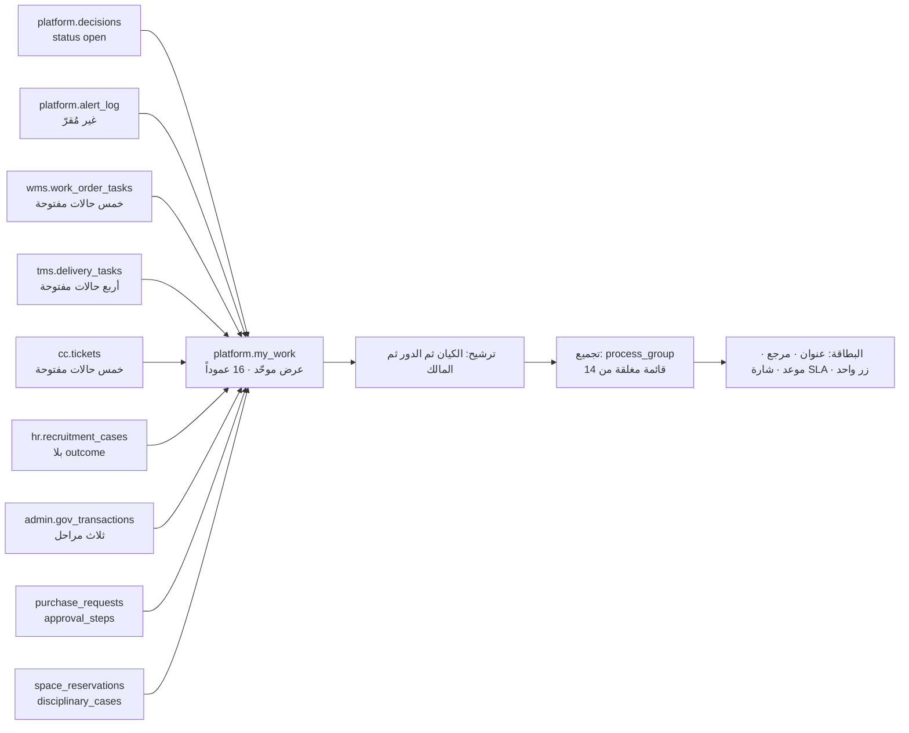
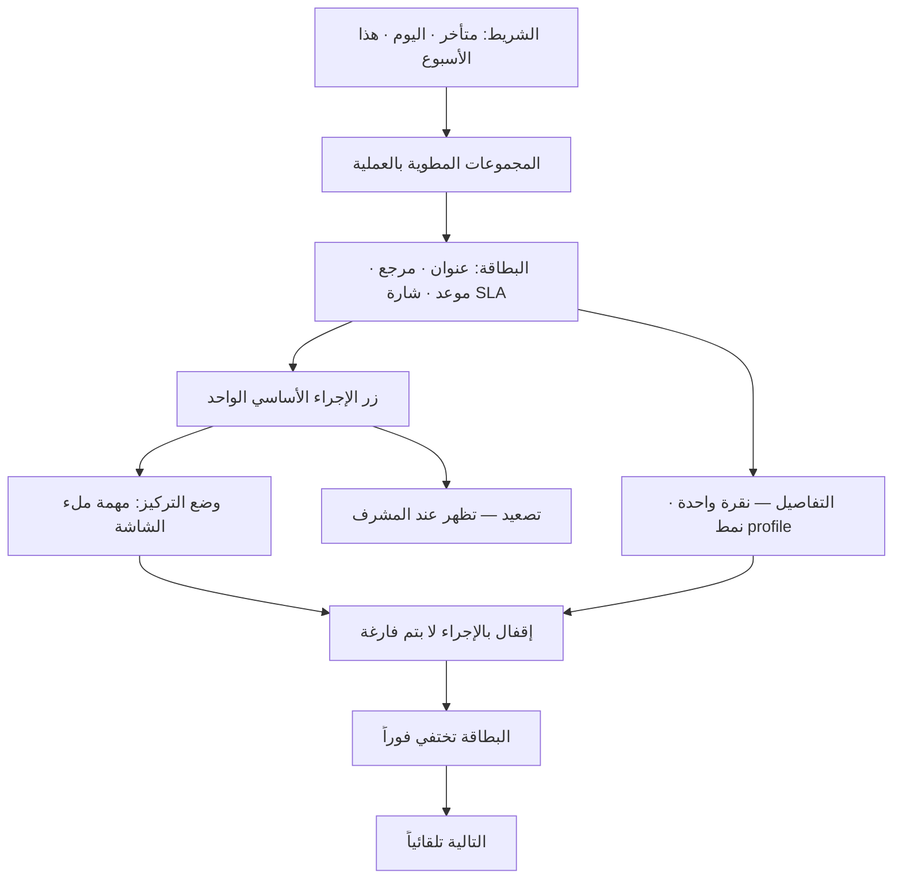
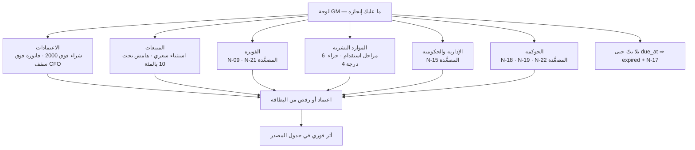
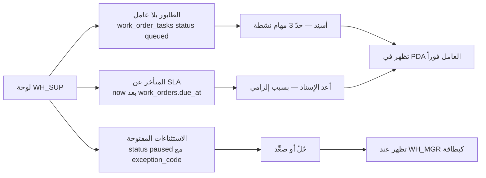
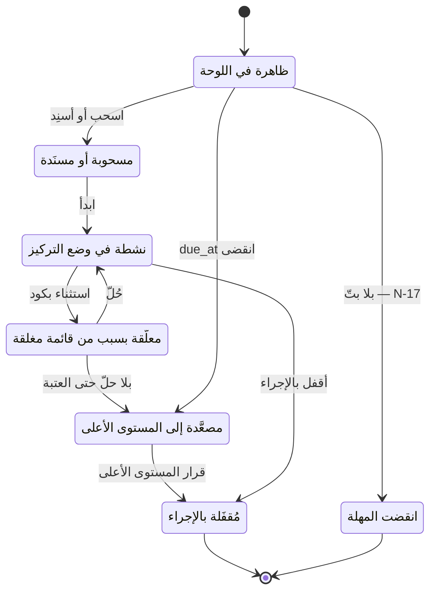

# لوحات التركيز — تتبّع المهام مجمَّعة بالعمليات
**PG-EOS v4 · D-blueprints · 21/09/2026 · حالة: مواصفة تجربة المستخدم (UX) + نموذج «المهمة الموحّدة» المقترح**

> **المصادر:** 29 §6 (النموذج الجديد · 57 شاشة · أنماط الشاشات الثلاثة) · 40 Part D (التطبيقات الخمسة) و Part G (أهداف الأداء) · 30 (PDA — تسع شاشات · الشاشة صفر) · 35 §0 (شاشات السائق العشر) · 25 §2-1 (`action_link` لكل تنبيه) · D-07 §4.1 و§9-3 · D-10 §1 · D-12 §6 و§8 · القاعدة الحيّة `pgeos`.
> **حالة التحقق:** كل جدول وعمود وحالة وعتبة في هذه الوثيقة **مقروء من القاعدة الحيّة**. العرض المقترح `platform.my_work` **نُفِّذ فعلياً** داخل `begin; … rollback;` ببيانات عيّنة عبر **أحد عشر مصدراً** ونجح — النتيجة في §9.
> **ما تقترحه هذه الوثيقة يحمل الرمز `SCR-FB-01`** ولا يُنفَّذ إلا باعتماد `GM` — لا تغيّر هذه الوثيقة المخطط.

---

## 0. المبدأ

كل مستخدم يفتح النظام فيرى **شيئاً واحداً: ما عليه إنجازه الآن** — مرتَّباً، مجمَّعاً بالعملية، بلا قوائم ولا شاشات جانبية. التفاصيل على بُعد نقرة واحدة، والإنجاز يُسجَّل **من اللوحة نفسها** لا من شاشة أخرى.

الأصل موجود في الحزمة ولا نخترعه: **صندوق القرارات** (29 §6-2 · 40 §D1 · D-07 §4.1) — «الصندوق هو الصفحة الرئيسية لكل دور · لا بند بلا إجراء · البند يختفي فور البتّ · صندوق فارغ = يومك منتهٍ».

ما تفعله هذه الوثيقة: **تعمّم هذا النموذج** من «القرارات» (`platform.decisions` وحده) إلى **كل عمل مطلوب** — مهمة مستودع، مهمة توصيل، تذكرة، مرحلة استقدام، معاملة حكومية، اعتماد، تنبيه غير مُقرّ. لأن الصندوق اليوم يخدم **المدراء الذين يقرّرون**، بينما **العامل والسائق والوكيل والمندوب ينفّذون** ولا صندوق لهم. اللوحة واحدة، والمحتوى يتغيّر بالدور.

**الفرق الحاكم:** الصندوق يسأل «ما الذي يحتاج قرارك؟». اللوحة تسأل **«ما الذي عليك إنجازه؟»** — والقرار حالة خاصة من الإنجاز.

---

## 1. نموذج «المهمة الموحّدة» — `platform.my_work`

### 1-1 لماذا عرض واحد

اليوم يعيش «العمل المطلوب» في **أحد عشر جدولاً** في **سبعة مخططات**، لكل منها اسم حالة مختلف وعمود موعد مختلف. الواجهة التي تريد أن تسأل «ماذا على هذا المستخدم؟» مضطرة إلى أحد عشر استعلاماً. **عرض واحد يوحّدها** — ولا يضيف جدولاً ولا عموداً ولا يغيّر حرفاً في المخطط.

### 1-2 المصادر الأحد عشر — متحقَّق منها على القاعدة

| # | المصدر (الجدول) | شرط «مفتوح» | الدور / المستخدم المكلَّف | الموعد (`due_at`) | الأولوية | رابط الإجراء |
|---|---|---|---|---|---|---|
| 1 | `platform.decisions` | `status = 'open'` | `assigned_role` (**not null**) · `assigned_user_id` | `due_at` | `urgency` | `/inbox?kind=<kind>` |
| 2 | `platform.alert_log` | `acknowledged_at is null and resolved_at is null` | `alert_rules.target_roles[1]` (22 قاعدة مبذورة) | `fired_at + escalate_after_hours` | `high` إن كان التصعيد ≤ 24 س | **`alert_rules.action_link`** — `not null` بالتعريف |
| 3 | `wms.work_order_tasks` | `status in (queued, assigned, accepted, in_progress, paused)` **و** الأمر `in (released, in_progress, on_hold)` | `worker_id` → `hr.employees` · الدور `work_order_task_types.default_role` = **`WH_OP`** للأنواع الخمسة عشر | `work_orders.due_at` | `is_rush` ⇒ `urgent` · `priority ≤ 3` ⇒ `high` | `/wms/work-orders/:id` |
| 4 | `tms.delivery_tasks` | `status in (created, assigned, out_for_delivery, deferred)` | `driver_id` · وإلا الدور `DEL_MGR` | `time_slot_to` | `attempt_no > 1` أو `is_same_day` ⇒ `high` | `/tms/tasks/:id` |
| 5 | `cc.tickets` | `status in (open, in_progress, pending_client, pending_internal, reopened)` | `assigned_to` → `cc.agents` → `employee_id` · وإلا `CC_MGR` | `sla_due_at` | `priority` (`urgent·high·normal·low`) | `/cc/tickets/:id` |
| 6 | `hr.recruitment_cases` | `completed_at is null and outcome is null` | `stage_owner` · الدور `recruitment_stages.default_owner_role` (**`GM`** لستٍّ · **`PRO`** لإحدى عشرة) | `due_at` (يملؤه المشغّل `platform.set_stage_due_at`) | `blocked_reason is not null` ⇒ `high` | `/hr/recruitment/:id` |
| 7 | `admin.gov_transactions` | `stage in (requested, submitted, in_progress)` | `stage_owner` · الدور `PRO` | `due_at` (نفس المشغّل) | `blocked_reason is not null` ⇒ `high` | `/admin/gov/:id` |
| 8 | `admin.purchase_requests` | `status = 'pending_approval'` | يُشتق من `platform.approval_chains` بـ`request_type='purchase'` والمبلغ: **`WH_MGR` 100–500 · `CFO` 500–2,000 · `GM` فوق 2,000** | `needed_by` | `urgency` | `/inbox?kind=purchase_approval` |
| 9 | `admin.approval_steps` (مع `approval_requests`) | `requests.status='pending'` و`steps.step_no = current_step` و`decision is null` | `approver_role` · `approver_user_id` | `requests.due_at` | `amount ≥ 2,000` ⇒ `high` | `/inbox?kind=approval` |
| 10 | `wms.space_reservations` | `status='active' and expires_at <= current_date + 7` | `SALES_MGR` (مالك **N-12**) | `expires_at` | `normal` | `/wms/space/reservations` |
| 11 | `hr.disciplinary_cases` | `status in (draft, pending_authority, grievance_filed) and routed_to is not null` | `routed_to` → `hr.employees` · الدور `signer_role` → `identity.roles` | — (**لا عمود موعد** — §8) | `high` | `/hr/disciplinary/:id` |

> **كل قيمة حالة أعلاه مأخوذة من قيد `check` فعلي في القاعدة** (`chk_decisions_status` · `chk_wo_tasks_status` · `chk_delivery_tasks_status` · `chk_tickets_status` · `chk_recruitment_cases_stage` · `chk_gov_transactions_stage` · `chk_purchase_requests_status` · `chk_approval_requests_status` · `chk_space_reservations_status` · `chk_disciplinary_cases_status`) — لا حالة مخترعة.

### 1-3 الأعمدة الموحّدة

| العمود | النوع | المعنى |
|---|---|---|
| `kind` | `text` | نوع البند: `decision · alert · wo_task · delivery_task · ticket · recruitment_stage · gov_transaction · purchase_request · approval_step · space_reservation · disciplinary_case` |
| `ref` | `text` | المرجع الظاهر للمستخدم — `doc_no` حيث وُجد، وإلا بادئة + مقتطف المعرّف |
| `title` | `text` | سطر واحد يقرأه المستخدم |
| `process_group` | `text` | مجموعة العملية — **قائمة مغلقة من أربع عشرة** (§2) |
| `owner_kind` | `text` | `role` · `user` · `employee` — **لأن المصادر لا تتفق على نوع المالك** |
| `owner_role` | `text` | كود الدور من `identity.roles` (26 دوراً) |
| `owner_id` | `uuid` | معرّف المستخدم أو الموظف حسب `owner_kind` |
| `due_at` | `timestamptz` | الموعد النهائي — `null` حيث لا موعد في المصدر |
| `priority` | `text` | `urgent · high · normal · low` |
| `sla_state` | `text` | `overdue · at_risk · on_time` · **و`no_sla`** لما لا موعد له (§8) |
| `action_link` | `text` | مسار الشاشة بصيغة 25 §2-1: `/<الموديول>/<الشاشة>` |
| `source_table` / `source_id` | `text` / `uuid` | العودة إلى الصف الأصلي — أساس التتبّع وشاشة Trace |
| `entity_id` | `uuid` | الكيان — أساس RLS (الكيانات الخمسة) |
| `started_at` | `timestamptz` | بدء احتساب المهلة — أساس `at_risk` |
| `sort_bucket` | `integer` | مفتاح الفرز الثابت (§3-ز) |

**قاعدة `sla_state`:**
- `overdue` — `now() > due_at`
- `at_risk` — انقضى **≥ 80٪** من نافذة `(due_at − started_at)`. النسبة مأخوذة من منطق **N-14** «تذكرة تتجاوز ٨٠٪ من SLA» — وهي **النسبة الوحيدة المنصوصة في الحزمة**؛ تعميمها على بقية المصادر اجتهاد يُثبَّت بمفتاح عتبة مقترح `work.at_risk_pct` (§8).
- `on_time` — ما عدا ذلك · `no_sla` — `due_at is null`.

### 1-4 الـDDL — قابل للتشغيل

```sql
-- platform.my_work — العرض الموحّد لبنود العمل (SCR-FB-01)
create or replace view platform.my_work as
with src as (

  -- 1) بنود صندوق القرارات
  select 'decision'::text                                   as kind,
         'DEC-'||left(d.id::text,8)                          as ref,
         d.title_ar                                          as title,
         case
           when d.source_table in ('wms.outbound_orders','wms.order_lines') then 'fulfilment'
           when d.source_table = 'wms.inbound_orders'        then 'inbound'
           when d.source_table like 'wms.%'                  then 'storage'
           when d.source_table like 'tms.%'                  then 'delivery'
           when d.source_table like 'imile.%'                then 'imile'
           when d.source_table like 'cc.%'                   then 'callcenter'
           when d.source_table like 'sales.%'                then 'sales'
           when d.source_table like 'catalog.%'              then 'sales'
           when d.source_table like 'billing.%'              then 'billing'
           when d.source_table like 'partners.%'             then 'billing'
           when d.source_table like 'hr.%'                   then 'hr'
           when d.source_table like 'admin.%'                then 'admin_gov'
           when d.source_table like 'housing.%'              then 'housing'
           else 'governance'
         end                                                 as process_group,
         'role'::text                                        as owner_kind,
         d.assigned_role                                     as owner_role,
         d.assigned_user_id                                  as owner_id,
         d.created_at                                        as started_at,
         d.due_at                                            as due_at,
         d.urgency                                           as priority,
         '/inbox?kind='||d.kind                              as action_link,
         'platform.decisions'::text                          as source_table,
         d.id                                                as source_id,
         d.entity_id                                         as entity_id
  from platform.decisions d
  where d.status = 'open'

  union all

  -- 2) تنبيهات غير مُقرّة ولا محلولة
  select 'alert',
         a.rule_code,
         r.name_ar,
         case a.rule_code
           when 'N-01' then 'imile'      when 'N-02' then 'imile'
           when 'N-03' then 'delivery'   when 'N-04' then 'hr'
           when 'N-05' then 'fleet'      when 'N-06' then 'sales'
           when 'N-07' then 'billing'    when 'N-08' then 'billing'
           when 'N-09' then 'billing'    when 'N-10' then 'billing'
           when 'N-11' then 'storage'    when 'N-12' then 'sales'
           when 'N-13' then 'storage'    when 'N-14' then 'callcenter'
           when 'N-15' then 'admin_gov'  when 'N-16' then 'hr'
           when 'N-17' then 'approvals'  when 'N-21' then 'billing'
           else 'governance'
         end,
         'role',
         r.target_roles[1],
         null::uuid,
         a.fired_at,
         case when r.escalate_after_hours is not null
              then a.fired_at + make_interval(hours => r.escalate_after_hours) end,
         case when r.escalate_after_hours is not null and r.escalate_after_hours <= 24
              then 'high' else 'normal' end,
         r.action_link,
         'platform.alert_log',
         null::uuid,
         null::uuid
  from platform.alert_log a
  join platform.alert_rules r on r.code = a.rule_code
  where a.acknowledged_at is null
    and a.resolved_at is null
    and r.is_active

  union all

  -- 3) مهام أوامر العمل داخل المستودع
  select 'wo_task',
         wo.doc_no||'/'||t.line_no::text,
         wo.task_type||' · '||coalesce(acc.name_ar, wo.doc_no),
         case wo.task_type
           when 'receive'  then 'inbound'
           when 'putaway'  then 'storage'  when 'transfer' then 'storage'
           when 'count'    then 'storage'  when 'scrap'    then 'storage'
           else 'fulfilment'
         end,
         case when t.worker_id is not null then 'employee' else 'role' end,
         coalesce(tty.default_role, 'WH_OP'),
         t.worker_id,
         coalesce(t.assigned_at, t.created_at),
         wo.due_at,
         case when wo.is_rush then 'urgent'
              when wo.priority <= 3 then 'high'
              else 'normal' end,
         '/wms/work-orders/'||wo.id::text,
         'wms.work_order_tasks',
         t.id,
         wo.entity_id
  from wms.work_order_tasks t
  join wms.work_orders wo on wo.id = t.work_order_id
  left join sales.accounts acc on acc.id = wo.client_id
  left join lateral (
        select min(k.default_role) as default_role
        from wms.work_order_task_types k
        where k.task_type = wo.task_type) tty on true
  where t.status in ('queued','assigned','accepted','in_progress','paused')
    and wo.status in ('released','in_progress','on_hold')

  union all

  -- 4) مهام التوصيل
  select 'delivery_task',
         dt.doc_no,
         coalesce(dt.recipient_name,'—')||' · '||coalesce(dt.area,'—'),
         'delivery',
         case when dt.driver_id is not null then 'employee' else 'role' end,
         case when dt.driver_id is not null then 'DRIVER' else 'DEL_MGR' end,
         dt.driver_id,
         coalesce(dt.assigned_at, dt.created_at),
         dt.time_slot_to,
         case when dt.attempt_no > 1 then 'high'
              when dt.is_same_day then 'high'
              else 'normal' end,
         '/tms/tasks/'||dt.id::text,
         'tms.delivery_tasks',
         dt.id,
         dt.entity_id
  from tms.delivery_tasks dt
  where dt.status in ('created','assigned','out_for_delivery','deferred')

  union all

  -- 5) تذاكر الكول سنتر
  select 'ticket',
         tk.doc_no,
         tk.subject,
         'callcenter',
         case when ag.employee_id is not null then 'employee' else 'role' end,
         case when tk.assigned_to is not null then 'CC_AGENT' else 'CC_MGR' end,
         ag.employee_id,
         tk.created_at,
         tk.sla_due_at,
         tk.priority,
         '/cc/tickets/'||tk.id::text,
         'cc.tickets',
         tk.id,
         tk.entity_id
  from cc.tickets tk
  left join cc.agents ag on ag.id = tk.assigned_to
  where tk.status in ('open','in_progress','pending_client','pending_internal','reopened')

  union all

  -- 6) ملفات الاستقدام — مالك المرحلة
  select 'recruitment_stage',
         rc.doc_no,
         rc.candidate_name||' · '||coalesce(rs.name_ar, rc.stage),
         'hr',
         'employee',
         coalesce(rs.default_owner_role,'PRO'),
         rc.stage_owner,
         rc.stage_started_at,
         rc.due_at,
         case when rc.blocked_reason is not null then 'high' else 'normal' end,
         '/hr/recruitment/'||rc.id::text,
         'hr.recruitment_cases',
         rc.id,
         rc.entity_id
  from hr.recruitment_cases rc
  left join hr.recruitment_stages rs on rs.code = rc.stage
  where rc.completed_at is null
    and rc.outcome is null

  union all

  -- 7) المعاملات الحكومية
  select 'gov_transaction',
         gt.doc_no,
         gt.transaction_type||' · '||gt.authority,
         'admin_gov',
         'employee',
         'PRO',
         gt.stage_owner,
         gt.stage_started_at,
         gt.due_at,
         case when gt.blocked_reason is not null then 'high' else 'normal' end,
         '/admin/gov/'||gt.id::text,
         'admin.gov_transactions',
         gt.id,
         gt.entity_id
  from admin.gov_transactions gt
  where gt.stage in ('requested','submitted','in_progress')

  union all

  -- 8) طلبات الشراء بانتظار الاعتماد
  select 'purchase_request',
         pr.doc_no,
         pr.description,
         'approvals',
         'role',
         coalesce((select ch.approver_role
                   from platform.approval_chains ch
                   where ch.request_type = 'purchase' and ch.is_active
                     and pr.estimated_amount >= coalesce(ch.min_amount, 0)
                     and pr.estimated_amount <  coalesce(ch.max_amount, 1e15)
                   order by ch.step_no limit 1), 'GM'),
         null::uuid,
         pr.created_at,
         pr.needed_by::timestamptz,
         pr.urgency,
         '/inbox?kind=purchase_approval',
         'admin.purchase_requests',
         pr.id,
         pr.entity_id
  from admin.purchase_requests pr
  where pr.status = 'pending_approval'

  union all

  -- 9) خطوات سلاسل الاعتماد المفتوحة
  select 'approval_step',
         ar.doc_no||'/'||st.step_no::text,
         ar.request_type||' · '||coalesce(ar.amount::text,'—'),
         'approvals',
         case when st.approver_user_id is not null then 'user' else 'role' end,
         st.approver_role,
         st.approver_user_id,
         ar.created_at,
         ar.due_at,
         case when coalesce(ar.amount,0) >= 2000 then 'high' else 'normal' end,
         '/inbox?kind=approval',
         'admin.approval_steps',
         st.id,
         ar.entity_id
  from admin.approval_requests ar
  join admin.approval_steps st
    on st.request_id = ar.id and st.step_no = ar.current_step
  where ar.status = 'pending'
    and st.decision is null

  union all

  -- 10) حجوزات المساحة المقاربة للانتهاء
  select 'space_reservation',
         'RSV-'||left(sr.id::text,8),
         coalesce(acc.name_ar,'—')||' · '||sr.qty::text||' '||sr.uom,
         'sales',
         'role',
         'SALES_MGR',
         sr.reserved_by,
         sr.created_at,
         sr.expires_at::timestamptz,
         'normal',
         '/wms/space/reservations',
         'wms.space_reservations',
         sr.id,
         sr.entity_id
  from wms.space_reservations sr
  left join sales.accounts acc on acc.id = sr.client_id
  where sr.status = 'active'
    and sr.expires_at <= current_date + 7

  union all

  -- 11) القضايا التأديبية الموجَّهة لصاحب سلطة أعلى
  select 'disciplinary_case',
         dc.doc_no,
         coalesce(emp.name_ar,'—')||' · '||dc.penalty_code,
         'hr',
         'employee',
         coalesce(dc.signer_role,'HR_MGR'),
         dc.routed_to,
         dc.created_at,
         null::timestamptz,
         'high',
         '/hr/disciplinary/'||dc.id::text,
         'hr.disciplinary_cases',
         dc.id,
         dc.entity_id
  from hr.disciplinary_cases dc
  left join hr.employees emp on emp.id = dc.employee_id
  where dc.status in ('draft','pending_authority','grievance_filed')
    and dc.routed_to is not null
)
select s.kind,
       s.ref,
       s.title,
       s.process_group,
       s.owner_kind,
       s.owner_role,
       s.owner_id,
       s.due_at,
       s.priority,
       case
         when s.due_at is null then 'no_sla'
         when now() > s.due_at then 'overdue'
         when s.started_at is not null
              and extract(epoch from (now() - s.started_at))
                  >= 0.80 * nullif(extract(epoch from (s.due_at - s.started_at)), 0)
           then 'at_risk'
         else 'on_time'
       end                                                     as sla_state,
       s.action_link,
       s.source_table,
       s.source_id,
       s.entity_id,
       s.started_at,
       (case when s.due_at is not null and now() > s.due_at then 0 else 1 end) * 1000
         + case s.priority when 'urgent' then 0 when 'high' then 1
                           when 'normal' then 2 else 3 end      as sort_bucket
from src s;

comment on view platform.my_work is
 'بنود العمل المفتوحة موحَّدة من أحد عشر مصدراً — أساس لوحات التركيز (SCR-FB-01)';
```

**الفهارس المطلوبة لتحقيق هدف الأداء (§6) — ثلاثة منها موجود بالفعل:**

```sql
-- موجود في القاعدة (29 §7) — لا يُعاد إنشاؤه
-- create index on platform.decisions (assigned_role, status, urgency, financial_impact desc);

-- مقترحة ضمن SCR-FB-01
create index if not exists ix_wo_tasks_worker_open  on wms.work_order_tasks (worker_id, status);
create index if not exists ix_del_tasks_driver_open on tms.delivery_tasks   (driver_id, status);
create index if not exists ix_tickets_assigned_open on cc.tickets           (assigned_to, status, sla_due_at);
create index if not exists ix_alert_log_unack       on platform.alert_log   (rule_code, fired_at)
       where acknowledged_at is null and resolved_at is null;
```

#### خريطة 15-1: من المصدر إلى البطاقة
تقرأ من اليسار: أحد عشر جدولاً تشغيلياً تُقرأ بشرط «مفتوح»، فتوحَّد في عرض واحد، فتُرشَّح بالدور، فتُجمَّع بالعملية، فتظهر بطاقةً واحدة بزر إجراء واحد.



---

## 2. التجميع بالعمليات — أربع عشرة مجموعة

### 2-1 القائمة المغلقة

| # | الكود | المجموعة | المصادر التي تغذّيها |
|---|---|---|---|
| 1 | `inbound` | **استلام** | `work_order_tasks` نوع `receive` · قرارات `wms.inbound_orders` |
| 2 | `storage` | **تخزين** | `work_order_tasks` أنواع `putaway · transfer · count · scrap` · **N-11** · **N-13** |
| 3 | `fulfilment` | **تجهيز الطلبات** | `work_order_tasks` الأنواع العشرة الباقية (`pick · check · pack · label · kit · load · weigh · photo · qc · return_sort`) · قرارات `wms.outbound_orders` |
| 4 | `delivery` | **التوصيل** | `tms.delivery_tasks` · قرارات `tms.*` (فرق COD) · **N-03** |
| 5 | `imile` | **iMile** | قرارات `imile.*` · **N-01** · **N-02** |
| 6 | `callcenter` | **الكول سنتر** | `cc.tickets` · **N-14** |
| 7 | `sales` | **المبيعات** | قرارات `sales.*` و`catalog.*` · `wms.space_reservations` · **N-06** · **N-12** |
| 8 | `billing` | **الفوترة والتحصيل** | قرارات `billing.*` و`partners.*` · **N-07 · N-08 · N-09 · N-10 · N-21** |
| 9 | `approvals` | **الاعتمادات** | `admin.purchase_requests` · `admin.approval_steps` · **N-17** |
| 10 | `hr` | **الموارد البشرية** | `hr.recruitment_cases` · `hr.disciplinary_cases` · **N-04** · **N-16** |
| 11 | `admin_gov` | **الإدارية والحكومية** | `admin.gov_transactions` · قرارات `admin.*` · **N-15** |
| 12 | `fleet` | **الأسطول** | **N-05** · قرارات صيانة `tms.vehicles` |
| 13 | `housing` | **السكن** | قرارات `housing.*` |
| 14 | `governance` | **الحوكمة** | قرارات بلا `source_table` · **N-18 · N-19 · N-20 · N-22** |

> **لماذا مغلقة:** مجموعة مفتوحة تعني أن كل فريق يخترع تبويبه — فتعود الشاشات الجانبية من الباب الخلفي. أربع عشرة مجموعة تغطي **المصادر الأحد عشر والتنبيهات الاثنين والعشرين** بلا بقيّة.

### 2-2 مصفوفة الدور × المجموعة — ما يراه كل دور افتراضياً

**مبنيّة من:** `alert_rules.target_roles` (22 قاعدة مبذورة) · `work_order_task_types.default_role` · `recruitment_stages.default_owner_role` · `platform.approval_chains` · `identity.sod_rules` (أربعة أزواج) · وثائق D-02…D-07.
**تحذير صريح:** `identity.role_permissions` **فارغ** و`identity.permissions` يحمل **سطراً واحداً** فقط في القاعدة اليوم — فالمصفوفة أدناه **مواصفة تُبذَر منها الصلاحيات**، لا قراءة منها (§8).

الرمز: **●** = مجموعة افتراضية في لوحته · **○** = يراها عند التصعيد أو البحث فقط · فراغ = لا يراها.

| الدور | استلام | تخزين | تجهيز | توصيل | iMile | كول | مبيعات | فوترة | اعتمادات | HR | حكومي | أسطول | سكن | حوكمة |
|---|:-:|:-:|:-:|:-:|:-:|:-:|:-:|:-:|:-:|:-:|:-:|:-:|:-:|:-:|
| `GM` | ○ | ○ | ○ | ○ | ○ | ○ | ● | ● | ● | ● | ● | ○ | ○ | ● |
| `OWNER` | | | | | | | ○ | ○ | | | | | | ● |
| `OPS_DIR` | ● | ● | ● | ● | ● | ○ | | | ○ | ○ | | ○ | | ○ |
| `CFO` | | | | ○ | | | ○ | ● | ● | | | | | ○ |
| `ACCOUNTANT` | | | | | | | | ● | ○ | | | | | |
| `COST_ANALYST` | | ○ | ○ | ○ | | | | ● | | | | | | ○ |
| `SALES_MGR` | | ○ | | | | ○ | ● | ○ | ○ | | | | | |
| `SALES_REP` | | | | | | | ● | ○ | | | | | | |
| `WH_MGR` | ● | ● | ● | | | | | | ● | | | | | ○ |
| `WH_SUP` | ● | ● | ● | ○ | | | | | | | | | | |
| `WH_OP` (PDA) | ● | ● | ● | | | | | | | | | | | |
| `DEL_MGR` | | | | ● | ● | ○ | | | ○ | | | ○ | | |
| `DEL_SUP` | | | ○ | ● | ● | | | | | | | ○ | | |
| `DRIVER` (تطبيق) | | | | ● | | | | | | | | | | |
| `CC_MGR` | | | | ○ | | ● | ○ | | | | | | | |
| `CC_AGENT` | | | | ○ | | ● | | | | | | | | |
| `HR_MGR` | | | | | | | | | ○ | ● | ● | | ● | |
| `PRO` | | | | | | | | ○ | | ● | ● | | | |
| `HOUSING_SUP` | | | | | | | | | | ○ | | | ● | |
| `FLEET_MGR` | | | | ○ | | | | | ○ | | | ● | | |
| `SYSADMIN` | | | | | ○ | | | | | ○ | | | | ● |
| `DEPUTY_SYSADMIN` | | | | | ○ | | | | | | | | | ● |
| `CLIENT_ADMIN` (نافذة) | ●¹ | ○¹ | ●¹ | ●¹ | | ●¹ | | ○¹ | | | | | | |
| `CLIENT_CREATOR` | ●¹ | | ●¹ | ○¹ | | ○¹ | | | | | | | | |
| `CLIENT_FINANCE` | | | | | | | | ●¹ | | | | | | |
| `CLIENT_VIEWER` | ○¹ | ○¹ | ○¹ | ○¹ | | | | | | | | | | |

¹ **أدوار العميل الأربعة** مقيَّدة بـ`client_id = current_client_id()` (RLS · 40 §C10)، ولا ترى إلا بنودها هي: طلباتها ومخزونها وشحناتها وفواتيرها وشكاواها. **لا ترى مهام العمال ولا أسماءهم ولا أزمنتهم** (`internal_only` — D-12 §8-3).

> **26 دوراً في `identity.roles` — كلها ممثَّلة.** الأدوار التي لا تملك مجموعة افتراضية واحدة (`OWNER` مثلاً) تفتح **اللوحة نفسها فارغة** برسالة الحالة الفارغة، لا شاشة مختلفة.

---

## 3. تشريح اللوحة — واحدة لكل الأدوار

**قالب واحد.** يتغيّر **محتواه** بالدور، ولا يتغيّر **شكله**. هذا هو الفرق بين نظام يُتعلَّم مرة ونظام يُتعلَّم ستاً وعشرين مرة.

```
┌────────────────────────────────────────────────────────────────┐
│  ما عليك إنجازه — محمد حامد · مشرف المستودع                   │
│                                                                │
│      متأخر  3        اليوم  11        هذا الأسبوع  24          │
├────────────────────────────────────────────────────────────────┤
│ ▾ تجهيز الطلبات (7)                                            │
│   ┌──────────────────────────────────────────────────────────┐ │
│   │ التقاط · شركة الخليج          WO-0042/3    🔴 متأخر 18د  │ │
│   │                                             [ أسنِد ]     │ │
│   ├──────────────────────────────────────────────────────────┤ │
│   │ تدقيق · متجر السالمية         WO-0051/1    🟠 40 د       │ │
│   │                                             [ أسنِد ]     │ │
│   └──────────────────────────────────────────────────────────┘ │
│ ▾ تخزين (2)                                                    │
│   ┌──────────────────────────────────────────────────────────┐ │
│   │ فرق جرد بلا تفسير             CNT-0007     🟠 4 س        │ │
│   │                                             [ فسِّر ]      │ │
│   └──────────────────────────────────────────────────────────┘ │
│ ▸ استلام (1)                                                   │
└────────────────────────────────────────────────────────────────┘
```

### (أ) الشريط العلوي — **ثلاثة أرقام فقط**

| الرقم | التعريف من العرض |
|---|---|
| **متأخر** | `count(*) where sla_state = 'overdue'` |
| **اليوم** | `count(*) where due_at::date = current_date` |
| **هذا الأسبوع** | `count(*) where due_at < date_trunc('week', now()) + interval '7 days'` |

**ولا رقم رابع.** الرقم الرابع يفتح باب الخامس، والخامس يصنع لوحة مؤشرات — وهو بالضبط ما رفضته 29 §6-1.

### (ب) المجموعات

المجموعات المعروضة = صفوف **●** للدور في مصفوفة §2-2. كل مجموعة **قابلة للطي**، وحالة الطي تُحفَظ للمستخدم. **(D-138: لا تُحفَظ — المجموعات تُفتح كاملة عند كل فتح للوحة؛ الطيّ إن وُجد مؤقت داخل الجلسة فقط.)** **مجموعة فارغة لا تُعرض أصلاً** — لا عنوان بلا محتوى.

### (ج) البطاقة — خمسة عناصر ولا سادس

| العنصر | المصدر |
|---|---|
| العنوان | `title` |
| المرجع | `ref` |
| الموعد | `due_at` معروضاً كـ«متبقٍ» لا كتاريخ كامل |
| شارة SLA | `sla_state` — 🔴 `overdue` · 🟠 `at_risk` · بلا شارة `on_time` · ⚪ `no_sla` |
| **زر الإجراء الأساسي الواحد** | `action_link` مع تسمية من `alert_rules.action_label` أو من `kind` |

**زر واحد.** أي بطاقة تحتاج زرين تعني أن القرار لم يُحسم في التصميم. الاستثناء الوحيد المسموح: **زوج الاعتماد/الرفض** في بنود `decision` و`approval_step` — وهو نصّ 40 §B5 «مجموعة إجراءات واحدة لكل بند».

### (د) وضع التركيز — مهمة واحدة ملء الشاشة

للأجهزة الميدانية أساساً (**PDA** و**تطبيق السائق**): بعد قبول المهمة تختفي اللوحة وتملأ المهمة الشاشة، وعند الإقفال **تُفتح التالية تلقائياً** بلا عودة إلى القائمة.

- **PDA (30):** لا يكسر مبدأ «تسع شاشات ولا عاشرة». الطابور يسكن في **الشاشة صفر** حيث يعرض اليوم «مهامي اليوم: 3 مفتوحة» — يصير سطراً قابلاً للنقر (D-12 §8-1). **الأثر على عدد شاشات الـPDA: صفر.**
- **السائق (35 §0):** الشاشة **5 «قائمة المهام»** هي اللوحة، والشاشة **6 «تنفيذ المهمة»** هي وضع التركيز. **الأثر على الشاشات العشر: صفر** — ما يتغيّر هو أن الشاشة 6 تفتح التالية بلا رجوع إلى 5، وهو ما يخدم حدّ **≤ ٦ نقرات و≤ ٤٥ ثانية** (35 §0-2).

### (هـ) لا إشعارات منبثقة داخل اللوحة

التنبيه **يصير بطاقة** في مجموعته — لا نافذة تقطع العمل. هذا ما يجعل المصدر رقم 2 (`alert_log`) جزءاً من العرض لا قناة موازية. الإشعار الفوري يبقى **خارج** اللوحة: تطبيق **Premium Decisions** (40 §D2) بساعات هدوء، والقنوات في `alert_rules.channels`.

### (و) لا شاشة فارغة

مكوّن الحالة الفارغة **إلزامي** (40 §D1). جملة واحدة + زر واحد:

| السياق | الجملة | الزر |
|---|---|---|
| لا بنود إطلاقاً | **لا شيء ينتظرك الآن.** | `عرض ما أنجزته اليوم` |
| المجموعة فارغة | لا تُعرض المجموعة — لا جملة ولا عنوان | — |
| الطابور المشترك فارغ | **الطابور فارغ — لا مهام بلا صاحب.** | `تحديث` |
| لا صلاحية لأي مجموعة | **لا مجموعة مسنَدة لدورك.** المالك: `SYSADMIN` | `اطلب صلاحية` |

> «**صندوق فارغ = يومك منتهٍ**» (29 §6-2) تصير: **لوحة فارغة = عملك منتهٍ.**

### (ز) الفرز الثابت — لا يُخصَّص

```
متأخر  →  urgent  →  أقرب SLA  →  الأقدم
order by sort_bucket, due_at nulls last, started_at
```

`sort_bucket` يضع كل `overdue` قبل كل `on_time` مهما كانت أولويته، ثم يرتّب داخل كل طبقة بالأولوية. **بند بلا موعد (`no_sla`) يهبط إلى الذيل** — وهو تنبيه تصميمي مقصود: ما لا موعد له لا يُنجَز.

> **فرق عن صندوق القرارات:** الصندوق يرتّب **بالأثر المالي ثم الاستعجال** (29 §6-2) — وهو صحيح للمدير. اللوحة ترتّب **بالمتأخر ثم الأولوية ثم SLA** — لأن مهمة الالتقاط لا `financial_impact` لها. **القاعدتان تتعايشان:** بنود `kind = 'decision'` تحتفظ بترتيبها الداخلي بالأثر المالي داخل مجموعتها.

### (ح) ما لا يُعرض على اللوحة

| ممنوع | السبب | أين يعيش |
|---|---|---|
| مؤشرات KPI | تشتيت — لا تُنجَز | لوحات المؤشرات الأربع (29 §6-3) |
| رسوم بيانية | لا فعل يتبعها | D-07 §9 · التقارير الـ24 |
| قوائم جانبية | البحث العام `Ctrl+K` يغني (40 §D1) | — |
| عدّادات تنازلية متحرّكة | تصنع قلقاً لا إنجازاً | شارة SLA ساكنة |
| عدد البنود المنجَزة اليوم | تحفيز لا توجيه | شاشة الأداء (35 §8-1) |

#### خريطة 15-2: تشريح اللوحة ودورة البطاقة
تقرأ من أعلى: الشريط ثم المجموعات ثم البطاقة ثم الإجراء، وما يحدث للبطاقة بعد الإجراء.



---

## 4. اللوحات بحسب الدور

> العمود «ما يتسلسل إلى غيره» يجيب سؤال المدير العام: **متى يغادر العمل لوحتي ويصير مسؤولية غيري؟**

### 4-1 الإدارة العليا والمالية

| الدور | مجموعاته الافتراضية | أمثلة البطاقات (من مصادر حقيقية) | الإجراء الأساسي | ما يتسلسل إلى غيره |
|---|---|---|---|---|
| **`GM`** | مبيعات · فوترة · اعتمادات · HR · حكومي · حوكمة | استثناء سعري (`decisions`/`catalog.price_exceptions`) · شراء فوق **2,000 د.ك** (`approval_chains` خطوة 3) · مرحلة استقدام بمالك `GM` (ستٌّ من السبع عشرة) · **N-18** جودة بيانات | **اعتماد / رفض** من البطاقة | البتّ ⇒ أثر في `source_table` فوراً · عدم البتّ حتى `due_at` ⇒ `status='expired'` + **N-17** |
| **`OWNER`** | حوكمة (○ مبيعات · فوترة) | قرارات مستوى المجموعة (`entity_id is null`) | اطّلاع / اعتماد | — |
| **`CFO`** | فوترة · اعتمادات · مبيعات ○ · توصيل ○ | **N-03** فرق COD · فاتورة فوق **500 د.ك** (`invoice.auto_approve_max`) · **N-21** مطابقة بنكية · شراء 500–2,000 | **سوِّ / اعتمد** | فوق سقفه ⇒ `GM` بالخطوة التالية في `approval_steps` |
| **`ACCOUNTANT`** | فوترة | **N-09** فاتورة متأخرة · حدث بلا سعر (**N-08**) | سجِّل / سعِّر | **فصل مهام:** `CFO ≠ ACCOUNTANT` — معتمِد الفاتورة لا يسجّل السداد (`sod_rules`) |
| **`COST_ANALYST`** | فوترة · تخزين ○ · تجهيز ○ · توصيل ○ | أحداث فوترة بلا سعر | سعِّر | التسعير ⇒ `billable_events` إلى `priced` |

### 4-2 المبيعات

| الدور | مجموعاته | أمثلة البطاقات | الإجراء | يتسلسل |
|---|---|---|---|---|
| **`SALES_MGR`** | مبيعات · كول ○ · تخزين ○ · فوترة ○ · اعتمادات ○ | **N-12** حجز مساحة ينتهي خلال 7 أيام (`space_reservations.expires_at`) · **N-06** عقد ينتهي · **N-11** تجاوز مساحة متعاقدة | **حوِّل الحجز أو أفرج عنه** | هامش تحت **10٪** (`contract.gm_margin_pct`) ⇒ بند قرار لـ`GM` · **فصل مهام:** `SALES_MGR ≠ CFO` |
| **`SALES_REP`** | مبيعات | متابعة فرصة · تجديد عرض | تابع | تحويل العرض إلى عقد ⇒ اعتماد `SALES_MGR` |

### 4-3 المستودع

| الدور | مجموعاته | أمثلة البطاقات | الإجراء | يتسلسل |
|---|---|---|---|---|
| **`WH_MGR`** | استلام · تخزين · تجهيز · اعتمادات | **N-13** فرق جرد بلا تفسير · شراء 100–500 (`approval_chains` خطوة 1) · أوامر `on_hold` | فسِّر / اعتمد / ارفع التعليق | فرق جرد بلا تفسير **> 24 س** ⇒ تصعيد بـ**N-13** |
| **`WH_SUP`** | استلام · تخزين · تجهيز · توصيل ○ | مهام `queued` بلا عامل · مهام `paused` بـ`exception_code` · مهام تجاوزت `work_orders.due_at` | **أسنِد / أعد الإسناد / حُلّ الاستثناء** | استثناء لا يُحَل ⇒ `WH_MGR` · **فصل مهام:** `WH_OP ≠ WH_SUP` — الملتقط لا يدقّق التقاطه |
| **`WH_OP`** (PDA) | استلام · تخزين · تجهيز | مهامه هو فقط (`worker_id`) · **حدّ 3 مهام نشطة** (`wo.max_active_tasks_per_worker = 3`) | **اقبل · نفِّذ · أقفل بكمية** | الرفض أو التعثّر ⇒ بطاقة عند `WH_SUP` فوراً |

### 4-4 التوصيل والأسطول

| الدور | مجموعاته | أمثلة البطاقات | الإجراء | يتسلسل |
|---|---|---|---|---|
| **`DEL_MGR`** | توصيل · iMile · كول ○ · أسطول ○ · اعتمادات ○ | **N-01** وكيل iMile متوقف · **N-02** تدقيق حي بلا بتّ · مهام `created` بلا سائق | أسنِد / افتح التدقيق الحي | **N-01 > 60 د** و**N-02 > 48 س** ⇒ `GM` |
| **`DEL_SUP`** | توصيل · iMile · تجهيز ○ · أسطول ○ | عهدة فاشلة **> 24 س** (`driver.custody.alert_hours`) · إقفال يوم سائق معلّق | صفِّ العهدة / أقفل اليوم | **> 48 س** (`escalate_hours`) ⇒ `DEL_MGR` |
| **`DRIVER`** (تطبيق) | توصيل | مهامه هو (`driver_id`) بترتيب المسار الأقصر (A3) · إعادة محاولة (`attempt_no > 1`) | **نفِّذ: وصول · مسح · تسليم أو فشل بكود** | الفشل بكود ⇒ `delivery_exceptions` ⇒ بطاقة عند `DEL_SUP` |
| **`FLEET_MGR`** | أسطول · توصيل ○ · اعتمادات ○ | **N-05** وثيقة مركبة على سلّم **90/45/30/15** · أمر صيانة مستحق | جدّد / أصدر أمر صيانة | وثيقة منتهية ⇒ **حاجز صلب INV-C4-1**: المركبة لا تُسنَد |

### 4-5 الكول سنتر

| الدور | مجموعاته | أمثلة البطاقات | الإجراء | يتسلسل |
|---|---|---|---|---|
| **`CC_MGR`** | كول · توصيل ○ · مبيعات ○ | **N-14** تذكرة تجاوزت **80٪** من SLA · تذاكر بلا وكيل (`assigned_to is null`) | أسنِد / تولَّ | تجاوز SLA ⇒ مدير الكول (25 §2) |
| **`CC_AGENT`** | كول · توصيل ○ | تذاكره هو · `pending_client` عاد إليه (`reopened`) | ردّ / أغلق بحلّ | `resolved` ⇒ تغادر لوحته · **RLS**: لا يرى تذاكر طابور آخر |

### 4-6 الإداري والحكومي والسكن والنظام

| الدور | مجموعاته | أمثلة البطاقات | الإجراء | يتسلسل |
|---|---|---|---|---|
| **`PRO`** | حكومي · HR · فوترة ○ | معاملة `in_progress` تجاوزت `due_at` (**N-15**) · إحدى عشرة مرحلة استقدام مالكها `PRO` · **N-04** وثيقة موظف | قدِّم / حدِّث المرحلة | تجاوز **+50٪** من SLA (`recruitment.escalate_pct` · يوم **11**) ⇒ `GM` · **فصل مهام:** `PRO ≠ CFO` |
| **`HR_MGR`** | HR · حكومي · سكن · اعتمادات ○ | قضية تأديبية `routed_to` لسلطته · **N-04** · طلب قوى عاملة | وقِّع / وجِّه لأعلى | جزاء فوق سلطته ⇒ توجيه آلي لأعلى بـ`routed_to` (لا رفض صامت — WBS 5.7) |
| **`HOUSING_SUP`** | سكن · HR ○ | طلب صيانة · تفتيش مستحق · سرير بلا تسليم | نفِّذ / أغلق | إخلاء طرف محجوب حتى تحرير السرير |
| **`SYSADMIN`** / **`DEPUTY_SYSADMIN`** | حوكمة · iMile ○ · HR ○ | **N-19** طابور يدوي **> 20** سجلاً أو عمر **> 48 س** · **N-22** تكامل بلا تشغيل ناجح · ~~**N-16** مزامنة بصمة~~ (SUPERSEDED — ADR-0003) | عالج الطابور / أعد التشغيل | **N-19 > 72 س** و**N-22 > 48 س** ⇒ `GM` |
| **`OPS_DIR`** | استلام · تخزين · تجهيز · توصيل · iMile (○ الباقي) | أي مجموعة تشغيلية تجاوزت عتبتها | تدخَّل | — |

### 4-7 نافذة العميل

| الدور | مجموعاته | أمثلة البطاقات | الإجراء |
|---|---|---|---|
| **`CLIENT_ADMIN`** | استلام · تجهيز · توصيل · كول (○ تخزين · فوترة) | طلبه في `credit_rejected` · شحنة `failed` تحتاج قراره · تذكرته `pending_client` | صحّح / أكّد / ردّ |
| **`CLIENT_CREATOR`** | استلام · تجهيز (○ توصيل · كول) | مسودة طلب ناقصة · ASN بلا تأكيد | أكمِل |
| **`CLIENT_FINANCE`** | فوترة | فاتورة مرسَلة بانتظار السداد · كشف حساب | سدِّد / اعترض |
| **`CLIENT_VIEWER`** | ○ فقط | — (اللوحة فارغة برسالة الحالة الفارغة) | — |

#### خريطة 15-3: لوحة المدير العام — نموذج
تقرأ من أعلى: مجموعات `GM` الست وما يصعّد إليه وما يغادره.



#### خريطة 15-4: لوحة مشرف المستودع — نموذج
تقرأ من اليسار: ثلاث مجموعات تغذّيها أوامر العمل، وثلاثة إجراءات، ومخرجان.



---

## 5. قواعد التركيز — المفروضة برمجياً حيث أمكن

| # | القاعدة | كيف تُفرَض | المصدر / الحالة |
|---|---|---|---|
| **F-1** | **مهمة واحدة نشطة في وضع التركيز** على الـPDA، وحدّ **ثلاث مهام** مسنَدة للعامل في آن | مشغّل على `wms.work_order_tasks` يقرأ `platform.thresholds` بالمفتاح `wo.max_active_tasks_per_worker` | العتبة **موجودة في القاعدة بقيمة 3** — **ابتدائية بانتظار قرار `GM`** (D-12 §10-3 D-1) |
| **F-2** | **لا يُعرض للمستخدم إلا ما هو مكلَّف به أو ما يخصّ دوره** | `where (owner_kind='employee' and owner_id = my_employee_id()) or (owner_kind='role' and owner_role = any(my_roles()))` فوق العرض · و**RLS بالكيان** موجود أصلاً | RLS مطبَّق · الدوال المساعدة `my_roles()` **غير موجودة** (§8) |
| **F-3** | **الإسناد الذاتي من الطابور المشترك بنقرة** | بند `owner_kind='role'` بلا `owner_id` يظهر بزر **«اسحب»**؛ النقر يكتب `worker_id`/`assigned_to`/`driver_id` + `assigned_at` — ويُرفض إن تجاوز حدّ **F-1** | نمط الإسناد الثالث في D-12 §4-1 |
| **F-4** | **إقفال المهمة يتطلب الإجراء لا «تم» فارغة** | القيود موجودة فعلاً: `chk_wo_tasks_done_has_times` (لا `done` بلا `started_at` و`completed_at`) · `chk_wo_tasks_reassign_has_reason` · `chk_work_orders_cancel_has_reason` · POD = GPS + توقيع أو صورة + اسم + ختم الخادم (INV-C4-3) | **مفروض في القاعدة — متحقَّق** |
| **F-5** | **التصعيد يظهر عند المشرف كبطاقة بلون واحد** | التصعيد **لا يولّد قناة جديدة**: يكتب `alert_log.escalated_at` أو ينقل `approval_steps` خطوةً، فتظهر البطاقة في لوحة المستوى الأعلى بشارة `overdue` | `escalate_after_hours` و`escalate_to_roles` موجودان في `alert_rules` |
| **F-6** | **حدّ زمني على البطاقة (SLA) لا عدّاد مزعج** | `sla_state` يُحسب عند تحميل اللوحة فقط — **ثلاث حالات ساكنة**، بلا عدّ تنازلي متحرّك | قرار تصميم هذه الوثيقة |
| **F-7** | **فصل المهام يُفرض قبل الإسناد لا بعده** | `identity.check_sod()` مشغّل موجود · أربعة أزواج مبذورة: `CFO≠ACCOUNTANT` · `SALES_MGR≠CFO` · `WH_OP≠WH_SUP` · `PRO≠CFO` | **موجود — متحقَّق** |
| **F-8** | **البند يختفي فور الإنجاز** | العرض يقرأ شرط «مفتوح»؛ تغيّر الحالة يخرج الصف تلقائياً — **لا حذف ولا علَم «مقروء»** | 29 §6-2 · 40 §B5 |
| **F-9** | **لا تخصيص للوحة في الإطلاق** | الفرز والمجموعات والأعمدة **مثبَّتة في الكود**؛ ما يُحفَظ للمستخدم هو **حالة الطي فقط** — **نُسخ بـD-138: لا يُحفَظ شيء للمستخدم، ولا حالة الطي** | GM D-138 (كان توصية §8) |

#### خريطة 15-5: حياة بطاقة العمل
تقرأ كآلة حالات: من ظهور البند إلى اختفائه، بكل المخارج البديلة.



---

## 6. الأداء والقياس

### 6-1 أهداف الأداء — من 40 Part G

| الهدف | القيمة المنصوصة | ينطبق على |
|---|---|---|
| شاشة قائمة p95 | **≤ 1.2 ث** | تحميل اللوحة كاملةً |
| حفظ p95 | **≤ 0.8 ث** | الإسناد الذاتي · إقفال المهمة |
| **زمن ردّ المسح على الـPDA** | **≤ 1.0 ث** | وضع التركيز في المستودع |
| شاشة ملف p95 | ≤ 1.5 ث | تفاصيل البطاقة |
| تسليم ناجح كامل | **≤ 6 نقرات · ≤ 45 ثانية** | وضع التركيز في تطبيق السائق (35 §0-2) |

> اللوحة **قائمة** لا لوحة مؤشرات، فينطبق عليها هدف القائمة **1.2 ث** لا هدف التقرير الشهري (8 ث). الفهارس الأربعة في §1-4 هي ما يجعل الهدف قابلاً للبلوغ مع نموّ الجداول.

### 6-2 مؤشرات اللوحة نفسها

| المؤشر | التعريف الحسابي الدقيق | المصدر | الدورية | المالك | الهدف |
|---|---|---|---|---|---|
| **معدل الإنجاز اليومي** | عدد البنود التي غادرت `my_work` بإجراء خلال اليوم، لكل دور | لقطة يومية من العرض × `platform.audit_log` | يومي | `OPS_DIR` | **يحدده GM** |
| **متوسط عمر المهمة بالمجموعة** | `avg(now() − started_at)` للبنود المفتوحة، مجمَّعة بـ`process_group` | `platform.my_work` | يومي | مالك المجموعة | يحدده GM |
| **نسبة المتأخر** | `100 × count(sla_state='overdue') ÷ count(*)` بالمجموعة وبالدور | `platform.my_work` | يومي | `OPS_DIR` | يحدده GM |
| **عمق الطابور لكل دور** | `count(*)` لكل `owner_role` — و**البنود بلا `owner_id`** = الطابور غير المسنَد | `platform.my_work` | لحظي | `SYSADMIN` | — |
| **النقرات حتى الإنجاز** | متوسط النقرات من فتح اللوحة إلى إقفال البند | قياس التطبيق (بروتوكول وثيقة 34) | مستمر | `SYSADMIN` | **≤ 3** ¹ |
| **متوسط بنود اللوحة لكل دور** | `count(*) ÷ عدد مستخدمي الدور` | `platform.my_work` | يومي | `GM` | **≤ 7** ² |
| **وسيط زمن البتّ** | `median(decided_at − created_at)` لبنود `decision` | `platform.decisions` | أسبوعي | `GM` | **≤ 4 ساعات عمل** ² |

¹ **«≤ 3 نقرات» هدف هذه الوثيقة، لا نصّ في الحزمة.** المنصوص: **≤ 6 نقرات** للتسليم الكامل في تطبيق السائق (35 §0-2). يُعتمد أو يُعدَّل — §8.
² من 29 §6-2 و§10 عبر D-07 §4.1 — وهما عن **صندوق القرارات**؛ تعميمهما على كل بنود اللوحة يحتاج إقرار `GM` (§8).

---

## 7. الربط بالمخطط والحزمة

### 7-1 `SCR-FB-01` — ما يُطلب تغييره فعلاً

| البند | التغيير | الأثر على المخطط |
|---|---|---|
| **العرض** `platform.my_work` | `create or replace view` — §1-4 | **لا جدول ولا عمود جديد.** عرض واحد فقط |
| **أربعة فهارس** | §1-4 | فهارس جزئية ومركّبة على جداول قائمة |
| **مفتاح عتبة مقترح** | `work.at_risk_pct = 80` في `platform.thresholds` | صفّ بيانات — لا DDL (العتبات في القاعدة اليوم **51**) |
| **دالتان مساعدتان** | `platform.my_roles() → text[]` و`platform.my_employee_id() → uuid` | نظير `platform.current_user_id()` و`current_client_id()` الموجودتين |

### 7-2 كيف تُغذّى البطاقة من `outbox`

اللوحة **لا تُبنى على دفع الأحداث** — تُبنى على **قراءة الحالة**. هذا مقصود: الحالة هي الحقيقة، والحدث إشعار بها.

| الخطوة | ما يحدث | الجدول |
|---|---|---|
| 1 | عملية تشغيلية تغيّر حالة صفّ | جدول المصدر |
| 2 | المشغّل يكتب الحدث | `platform.outbox` (`aggregate_type · event_type · payload · correlation_id`) |
| 3 | الناشر يسلّم الحدث | `outbox.published_at` |
| 4 | المشترك يحدّث اللوحة **لحظياً** للمستخدمين المفتوحة لوحتهم | — (دفع WebSocket) |
| 5 | **وإن فشل الدفع** فاللوحة تبقى صحيحة عند أي تحديث | العرض يقرأ الحالة مباشرة |

> **القاعدة:** الدفع **تحسين للراحة**، والقراءة **مصدر الحقيقة**. لوحة تعتمد على الدفع وحده تكذب عند أول رسالة ضائعة.

### 7-3 الأثر على وثائق الحزمة

| الوثيقة | التغيير المقترح | نوعه |
|---|---|---|
| **29 §6-2** | «صندوق القرارات» ⇒ **«لوحة العمل» (Work Inbox)**: البند لم يعد قراراً فقط، بل **كل عمل مطلوب**. المبادئ الستّ تبقى حرفياً | تعميم — لا نقض |
| **29 §6-3** | جرد الشاشات: خانة «صندوق القرارات = **١**» تصير «**لوحة العمل = ١**» — **قالب واحد يُرشَّح بالدور** | **لا تغيير في العدد** |
| **40 §D1** | «Home for every role = Decision Inbox» ⇒ «Home for every role = **Work Board**»؛ أنماط الشاشات الثلاثة (list · profile · action) **تبقى كما هي** — اللوحة نمط `list` بتجميع | تعديل نصّي |
| **40 §D3** | الشاشة **5** «قائمة المهام» = اللوحة · الشاشة **6** = وضع التركيز | **لا شاشة جديدة** |
| **40 §D4** | الشاشة **0** تحمل الطابور القابل للنقر (D-12 §8-1) | **لا شاشة عاشرة** |
| **25 §2-1** | `action_link` لكل تنبيه **يصير زر البطاقة** — الاصطلاح قائم ولا يتغيّر | **بلا تغيير** |
| **D-07 §9-3** | «طقس الإدارة»: «صندوق فارغ = يومك منتهٍ» ⇒ **«لوحة فارغة = عملك منتهٍ»** لكل دور لا للمدراء وحدهم | توسيع |

### 7-4 عدد الشاشات

| الحساب | العدد |
|---|---|
| المعتمد في 40 §D1 و29 §6-3 | **57** |
| **استبدال** الصفحة الرئيسية `/inbox` بلوحة العمل | **+0** |
| وضع التركيز على الـPDA (داخل الشاشة صفر) | **+0** |
| وضع التركيز في تطبيق السائق (داخل الشاشة 6) | **+0** |
| **إجمالي `SCR-FB-01`** | **57 — بلا تغيير** |

> **تنبيه:** `SCR-WO-01` في D-12 §8-2 يقترح **57 → 60** (ثلاث شاشات مستودع). المقترحان **مستقلان ومتوافقان**: لوحة التركيز هي `/inbox` المعمَّمة، ولوحة `/wms/work-orders` شاشة تشغيل متخصّصة لـ`WH_SUP`. إن اعتُمدا معاً: **60**.

### 7-5 مهمة WBS مقترحة

| ID | المهمة | النوع | يعتمد على | المسار | المالك | القبول |
|---|---|---|---|---|---|---|
| **2.20** ✳ | **وضع التركيز في الـPDA:** الشاشة صفر تعرض طابور `work_order_tasks` مرتّباً بـ`sort_bucket`؛ سحب من الطابور بنقرة بحدّ `wo.max_active_tasks_per_worker`؛ فتح المهمة التالية آلياً عند الإقفال | 🤖 | 2.16 · `SCR-WO-01` | **M** | `WH_MGR` | زمن ردّ المسح ≤ 1.0 ث · تجاوز الحدّ مرفوض برسالة تذكر الحدّ · لا شاشة عاشرة |
| **5.18** ✳ | **لوحة العمل الموحّدة:** العرض `platform.my_work` + أربعة فهارس + دالتا الدور والموظف + قالب اللوحة الواحد بترشيح الدور والتجميع بالعملية + مكوّن الحالة الفارغة | 🤖 | **5.13** (محرّك التنبيهات) · 0.19 · 6.3 | **M** | `SYSADMIN` + `GM` | اللوحة p95 ≤ 1.2 ث بـ10,000 بند مفتوح · مستخدم لا يرى بنداً ليس مكلَّفاً به ولا يخصّ دوره · كل بطاقة لها `action_link` غير فارغ |

> **لماذا المرحلة 5 لا أبكر:** اللوحة تحتاج **محرّك التنبيهات (5.13)** حتى يكون المصدر الثاني حيّاً، وتحتاج مصادر المرحلة 5 نفسها (تذاكر · استقدام · حكومي · اعتمادات · جزاءات). بناؤها قبل ذلك يعني لوحة بمصدرين من أحد عشر. **أما 2.20 فتُبنى مبكراً** لأن العامل هو أكثر من يعاني التشتّت وأقلّ من يملك شكوى مسموعة.

---

## 8. الفجوات والقرارات

> الرموز: **⏳ قرار GM** · **✗ بلا نصّ يغطيه في الحزمة** · **↷ مهمة WBS**.
> البنود مرشّحة للإضافة إلى `09-Gap-Register.md`.

### 8-1 ما لا يمكن تتبّعه كمهمة اليوم

| # | البند | الوصف الدقيق — متحقَّق على القاعدة | الأثر على اللوحة | النوع |
|---|---|---|---|---|
| **B-1** | **`hr.disciplinary_cases` بلا عمود موعد** | **43 عموداً**، فيها `notified_at` و`decision_notified_at` و`signed_at` و`grievance_filed_at` — **ولا `due_at` ولا `sla_days`**. ومهلة التظلّم **7 أيام** (35 §0-1) وحدّ المادة 35 **15 يوماً** منصوصان في الحزمة وغير محسوبين في القاعدة | البطاقة تظهر بـ`sla_state='no_sla'` فتهبط إلى ذيل الفرز — **وهي من أخطر البنود قانونياً** | ✗ ⏳ |
| **B-2** | **`tms.delivery_tasks.driver_id` بلا مفتاح أجنبي** | الجدول يحمل ستة مفاتيح أجنبية (`client_id · contract_id · entity_id · executed_by_partner_id · outbound_order_id · vehicle_id`) — **و`driver_id uuid` ليس منها** | لا يمكن للوحة أن تضمن أن السائق موظف قائم؛ ولا ربط موثوق بين لوحة السائق وملفه | ✗ ↷ |
| **B-3** | **`stage_owner` بلا مفتاح أجنبي** في `recruitment_cases` و`gov_transactions` | العمودان `not null` — لكن بلا `references`، فلا يُعرف أهما `identity.users` أم `hr.employees` | ترشيح «مهامي» لهذين المصدرين يقوم على **افتراض** لا على عقد | ✗ ↷ |
| **B-4** | **`identity.role_permissions` فارغ و`permissions` يحمل سطراً واحداً** | `select count(*)` = **0** و**1** | مصفوفة §2-2 **مواصفة لا قراءة**؛ قاعدة **F-2** لا يمكن فرضها على مستوى القاعدة اليوم | ✗ ↷ — يقابل البند #4 من فئة «بذر ناقص» في `09` |
| **B-5** | **لا جدول حضور ولا ورديات** | `hr` يحمل 13 جدولاً ليس فيها `attendance` ولا `shifts` (متحقَّق — D-12 §10-1 W-1 · الفجوة الحرجة **#7**) | اللوحة لا تعرف **من في الوردية الآن**، فالإسناد الذاتي قد يذهب لعامل خارج دوامه | ✗ ⏳ — **نفس البند #7** |
| **B-6** | **لا دالة `my_roles()`** | القاعدة تحمل `current_user_id()` و`current_client_id()` و`allowed_entities()` و`has_perm()` و`is_internal()` — **ولا دالة تعيد أدوار المستخدم** | ترشيح الدور يقع على التطبيق لا على القاعدة — وهو أضعف | ✗ ↷ |
| **B-7** | **لا عتبة `work.at_risk_pct`** | **51 عتبة** في `platform.thresholds` (متحقَّق بالعدّ)، **ولا واحدة لنسبة الخطر العامة**. الـ80٪ منصوصة لـ**N-14 وحدها** | التعميم اجتهاد — يُثبَّت كعتبة أو يُقصَر على التذاكر | ⏳ |
| **B-8** | **`housing` و`fleet` بلا مصدر مهام مباشر** | المجموعتان 12 و13 تُغذَّيان اليوم من **التنبيهات والقرارات فقط**: `housing.maintenance_requests` و`housing.inspections` و`tms.maintenance_orders` **بلا عمود مالك مسنَد** يصلح لـ`owner_id` | لوحتا `HOUSING_SUP` و`FLEET_MGR` أفقر من غيرهما | ✗ |
| **B-9** | **لا وعاء لحالة طيّ المجموعات** | لا `platform.user_preferences` ولا عمود في `identity.users` | تُحفظ في تخزين المتصفّح — تضيع بتبديل الجهاز. مقبول في الإطلاق | ✗ |
| **B-10** | **فارق في عدد العتبات بين الأطلس والقاعدة** | `00-Atlas-Index.md` §3 و`EXECUTION-MASTER-v4` يذكران **٤٤ عتبة**؛ `select count(*) from platform.thresholds` يعيد **٥١** (الزائدة من `dispatch.*` و`dtl.*` لـADR-27). **القاعدة هي الحاكم** | لا أثر على اللوحة — لكنه رقم حاكم يُصحَّح في الأطلس | ✗ — **تصحيح وثائقي** |

### 8-2 القرارات المطلوبة — `SCR-FB-01`

| # | القرار | الخيارات | التوصية | المالك |
|---|---|---|---|---|
| **D-1** | **هل يُسمح للمستخدم بتخصيص لوحته** — ترتيب المجموعات · إخفاء مجموعة · تغيير الفرز | (أ) لا تخصيص إطلاقاً · (ب) طيّ فقط · (ج) تخصيص كامل | **(ب) — لا تخصيص في الإطلاق عدا الطيّ.** لوحة مخصَّصة لكل مستخدم تعني أن **التدريب لا يُنقل** وأن المشرف لا يستطيع القول «افتح المجموعة الثالثة»؛ ولوحة يُخفي فيها المستخدم مجموعة هي لوحة يختبئ فيها التأخير. يُعاد النظر بعد ثلاثة أشهر من الإطلاق ببيانات استخدام فعلية | ✅ **GM — D-138 (2026-09-24): (أ) لا تخصيص إطلاقاً.** لا حالة طيّ محفوظة للمستخدم؛ المجموعات تُفتح كاملة في كل مرة. B-9 يسقط |
| **D-2** | **اللغات على البطاقة** | (أ) ست لغات في كل مكان · (ب) **ست في التطبيقات الميدانية وعربي/إنجليزي في لوحة الإدارة** · (ج) عربي فقط | **(ب)** — وهو نصّ الحزمة: «6 languages in field apps» (EXEC §1.4 · 40 الخاتمة · 30 §W7 · 28 §4). فتترجم بطاقات **`WH_OP` و`DRIVER`** إلى `ar · en · hi · ur · bn · am`، وتبقى لوحات الإدارة `ar · en`. **ما يجب ترجمته فعلاً:** `title` و`action_label` وشارة SLA — لا `ref` ولا `kind` | ✅ **GM — D-141: (ب)** |
| **D-3** | **هل تحلّ اللوحة محلّ صندوق القرارات أم تحتويه** | (أ) `/inbox` يصير اللوحة والقرارات مجموعة فيها · (ب) لوحتان منفصلتان | **(أ)** — لوحتان تعنيان أن المدير يفتح شاشتين ليعرف ما عليه، وهو عين التشتّت الذي تعالجه الوثيقة | ✅ **GM — D-141: (أ)** |
| **D-4** | **هدف «≤ 3 نقرات حتى الإنجاز»** | (أ) يُعتمد هدفاً · (ب) يُقصَر على بنود القرار · (ج) يُترك بلا رقم | **(أ) مع استثناء معلن:** المهام التي تتطلب مسحاً أو POD محكومة بحدّها الخاص (**≤ 6 نقرات** — 35 §0-2)، لا بالثلاث | ✅ **GM — D-141: (ج) بلا رقم — خلاف التوصية** |
| **D-5** | **تعميم عتبتَي «≤ 7 بنود للدور» و«وسيط بتّ ≤ 4 ساعات»** من القرارات إلى كل بنود اللوحة | (أ) تعميم كما هو · (ب) عتبة لكل مجموعة · (ج) للقرارات فقط | **(ب)** — «سبعة بنود» معقولة لمدير، لا لعامل تجهيز يغلق عشرين مهمة في الوردية. العتبة تصير **لكل `process_group`** وتُضبط بعد شهر قياس | ✅ **GM — D-141: (ب)** |
| **D-6** | **هل يرى المشرف البنود المسنَدة لعمّاله في لوحته هو** | (أ) نعم كاملةً · (ب) المتأخر والمتعثّر فقط · (ج) لا — شاشة منفصلة | **(ب)** — لوحة المشرف التي تعرض كل مهام كل عامل تصير قائمة، لا لوحة تركيز. **المتأخر والمتعثّر والطابور بلا عامل** هي ما يحتاج فعله | ✅ **GM — D-141: (ب)** |

---

## 9. ملحق — ما تحقّقت منه هذه الوثيقة على القاعدة الحيّة

**البيئة:** PostgreSQL 16 · قاعدة `pgeos` · المخطط من `01 + 13 + 13B + 019` · كل اختبار داخل `begin; … rollback;`.

| # | ما اختُبر | النتيجة |
|---|---|---|
| 1 | `create or replace view platform.my_work` بالـDDL الكامل في §1-4 | ✅ **نجح** — `CREATE VIEW` + `COMMENT` |
| 2 | أعمدة العرض | ✅ **16 عموداً** بالأنواع المتوقَّعة: `kind:text · ref:text · title:text · process_group:text · owner_kind:text · owner_role:text · owner_id:uuid · due_at:timestamptz · priority:text · sla_state:text · action_link:text · source_table:text · source_id:uuid · entity_id:uuid · started_at:timestamptz · sort_bucket:integer` |
| 3 | `select count(*)` على القاعدة كما هي | ✅ **0 صف** — الجداول التشغيلية الأحد عشر فارغة اليوم (بذر المرجعيات فقط: **26 دوراً · 22 قاعدة تنبيه · 51 عتبة · 17 مرحلة استقدام · 15 نوع مهمة · 8 سلاسل اعتماد · 4 أزواج فصل مهام**) |
| 4 | **العينة عبر أحد عشر مصدراً** — إدراج صفوف اختبار في كل الفروع ثم القراءة | ✅ **11 صفاً** ظهرت بالتجميع والترتيب الصحيحين |
| 5 | صحة `sla_state` | ✅ قرار مستحق منذ ساعتين ⇒ `overdue` · مهمة التقاط انقضى **83٪** من نافذتها ⇒ `at_risk` · مهمة توصيل في نافذتها ⇒ `on_time` · قضية تأديبية بلا موعد ⇒ `no_sla` |
| 6 | صحة `sort_bucket` | ✅ بند `overdue` بأولوية `urgent` ⇒ **0** · بند `on_time` بأولوية `high` ⇒ **1001** — المتأخر يسبق غير المتأخر مهما كانت أولويته |
| 7 | اشتقاق المعتمِد من `approval_chains` | ✅ طلب شراء **1,200 د.ك** ⇒ `CFO` (المجال 500–2,000) — من القاعدة لا من نصّ |
| 8 | اشتقاق الدور من `recruitment_stages` | ✅ مرحلة `residency_issue` ⇒ `PRO` |
| 9 | اشتقاق الدور من `work_order_task_types` | ✅ نوع `pick` ⇒ `WH_OP` (الأنواع الخمسة عشر كلها `WH_OP`) |
| 10 | اشتقاق `action_link` من `alert_rules` | ✅ **N-13** ⇒ `/wms/counts?variance=unexplained` · **N-14** ⇒ `/cc/tickets?sla=at_risk` — كما في 25 §2-1 حرفياً |
| 11 | كل قيمة حالة استُخدمت في شرط «مفتوح» | ✅ مقروءة من قيد `check` فعلي — **عشرة قيود** فُحصت بالاسم |
| 12 | حدّ المهام النشطة | ✅ `wo.max_active_tasks_per_worker = 3.000 count` موجود في `platform.thresholds` |
| 13 | فصل المهام | ✅ **4 أزواج** في `identity.sod_rules` والمشغّل `identity.check_sod()` موجود |
| 14 | المفاتيح الأجنبية الغائبة | ✅ أُثبت غياب `driver_id` من مفاتيح `tms.delivery_tasks` الستة، وغياب `references` عن `stage_owner` في الجدولين — **البندان B-2 و B-3** |
| 15 | `identity.permissions` / `role_permissions` | ✅ **1** و**0** صفاً — **البند B-4** |
| 16 | عدد العتبات | ✅ **51** صفاً في `platform.thresholds` — والأطلس يذكر **44** — **البند B-10** |
| 17 | أعمدة `hr.disciplinary_cases` | ✅ **43** عموداً، **ولا `due_at` ولا `sla_days` بينها** — **البند B-1** |
| 18 | فهرس ترتيب صندوق القرارات | ✅ موجود: `decisions_assigned_role_status_urgency_financial_impact_idx` على `(assigned_role, status, urgency, financial_impact DESC)` — لا يُعاد إنشاؤه |
| 19 | الفهارس الأربعة المقترحة في §1-4 | ✅ `create index if not exists` × 4 **نُفِّذت ونجحت** داخل المعاملة |
| 20 | الخرائط الخمس | ✅ صُيِّرت الخمس إلى SVG بـ`mmdc` بلا خطأ نحوي |

**ما لم يُختبر:** الأداء تحت حمل (لا بيانات) · الدفع اللحظي من `outbox` (لا ناشر) · زمن اللوحة p95 (يُقاس بعد المهمة 5.18).

---

**انتهت الوثيقة 15.**
